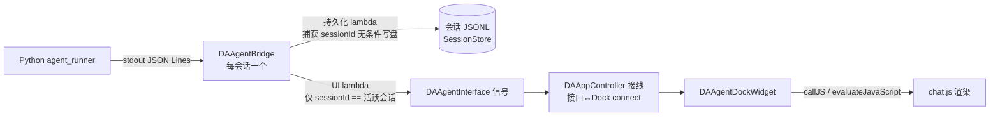

# e1053d1 并发会话重构审计报告（2026-09-08 深度复核扩充版）

- **审计日期**：2026-09-08（初版）；同日深度复核并扩充
- **审计对象**：commit `e1053d1`（refactor(agent): DAAgentModule 会话化桥管理，支持多子进程并发会话，2026-09-05），并扩展至 **agent 功能全链路**（Bridge 协议/生命周期、Module 编排、Dock/WebChannel/chat.js UI 层、Python agent_runner、权限层、会话存储）
- **审计范围**：`src/DAAgent/DAAgentModule.cpp/.h` 重构前后全量对照（旧版 1693 行 → 新版 2104 行）；`DAAgentBridge.cpp/.h`（1184 行）；`DAAgentDockWidget.cpp`（993 行）；`DAAgentWebChannel.cpp`（555 行）；`chat.js`（1904 行）；`agent_runner.py` 及 agent Python 包；`DAAgentPermissionManager`；`DAAgentSessionStore`；`DAAppController` 接线；`plugins/DAAgentTools` 工具执行层
- **状态标记**：✅ 已修复 ｜ 🔴 待修复 ｜ 🟡 待拍板（设计决策） ｜ ⚪ 次要缺口（可不修）
- **来源标记**（深度复核新增）：【e1053d1 回归】重构直接引入 ｜【并发放大】历史缺陷被多会话并发新暴露 ｜【历史缺陷】重构前即存在 ｜【修复引入】修复旧缺陷时引入的新缺陷

> **复核结论速览**：初版报告的 8 个问题经逐条对照代码**全部属实**（问题 1/2/3/5 另有影响面补充）。深度复核另发现 **8 个高严重度**（问题 9–16）、**13 个中严重度**（问题 17–29）新缺陷与一批低严重度缺口（§ 七），并整理出 **6 个决策点**（§ 九）——**其中 5 项已于 2026-09-08 经用户拍板**（权限记忆=方案 b、工具执行模型=方案 c、错误持久化=方案 b、开工程处置=方案 c、导出范围=全部工程绑定会话），**仅决策点 3（run_code 跨会话隔离）待用户确认**。其中问题 9（运行期错误即杀死子进程）、10（冷启动重复注入用户消息）、12（工具执行无取消语义 + 跨会话超时误报）、13（run_code 跨会话共享命名空间）、14/15（Dock busy 守卫漏洞）为最高优先级。

---

## 一、背景

### 1.1 重构做了什么

e1053d1 之前，`DAAgentModule` 持有**单一** `DAAgentBridge`（一个 Python 子进程），所有会话共享：

- Bridge 信号在 `initialize()` 中以 **15 条直连**转发到 `DAAgentInterface`（供 APP 层接到 Dock）；
- 持久化/状态记账在 `connectSignals()` 中以 **14 个 lambda**挂接，统一写 `mCurrentSessionId`；
- 切换会话会 `requestStop` 终止进行中的对话（忙碌时排队续切），并 eager 下发 `load_session` 重建 Python 侧状态。

重构后改为**每会话一个桥**（`mSessionBridges`）+ 至多一个预热空闲桥（`mIdleBridge`）：

- 所有信号路由收口到 `attachBridge(bridge, sessionId)`：持久化 lambda 捕获桥所属 `sessionId` 无条件写盘；**UI 接口信号仅当 `sessionId == mCurrentSessionId`（活跃会话）时转发**；
- 切换会话变为**纯 UI 重放**（不再终止后台对话），Python 侧状态重建推迟到该会话下次 `sendMessage`（init → load_session → user_msg 的 stdin 管道序）；
- 桥生命周期收窄：后台会话跑完（`agentDone`）、切离空闲会话、删除会话、`sendMessage` 防御重建时经 `retireBridge` 退役；
- 后台会话的 ask_user / 审批卡缓存于 `mPendingQuestions` / `mPendingApprovalRequests`，切回时重发；
- 配置/工具/子 agent 热更新经 `forEachLiveBridge` 广播到全部存活桥。

### 1.2 为什么要审计

重构规模大（单文件 965 行改动）且信号路由从"直连"改为"手写 lambda 逐条重建"，**遗漏一条不会编译报错，只会静默丢失行为**。重构落地后已陆续暴露多个问题：

| 提交 | 日期 | 问题 | 状态 |
|------|------|------|------|
| `f74d857` | 09-05 | 历史重放时工具卡片与思考文本顺序错乱（chat.js 侧） | ✅ 与重构同批修复 |
| `2e66a4c` | 09-05 | 切换守卫等 `session_loaded` 解除，纯重放切换时永真冻结渲染 | ✅ 与重构同批修复 |
| `d6bdbdc` | 09-05 | 重放逐事件滚动 O(n²)，大会话切换冻结半分钟 | ✅ 与重构同批修复 |
| `34cc093` | 09-07 | 桥改懒创建后晚于插件 `registerTool`，`mTools` 恒空 → 全部插件工具返回 Unknown tool | ✅ 已修复 |
| `017e0b1` | 09-07 | **`agentMessageComplete`/`agentToolCall`/`agentToolResult` 三条 UI 转发遗漏** → 工具卡片不渲染、整轮回复堆进同一个大气泡（用户实际报告的症状） | ✅ 已修复 |

本次审计目标：穷举剩余遗漏。方法为将旧版 `initialize()`/`connectSignals()`/`switchSession()` 等函数的每一条行为与新版的 `attachBridge()`/`retireBridge()`/会话化函数逐条对照，确认"删除的旧行为是否有等价新实现"。

### 1.3 信号路由架构（审计基准）

**审计要点**：每条 Bridge 信号必须同时回答两个问题——① 持久化路径是否保留？② UI 路径（活跃会话过滤后 emit 接口信号）是否保留？`017e0b1` 修的正是三条信号只答了 ① 没答 ②。

### 1.4 深度复核方法（2026-09-08 扩充）

在初版"新旧逐条对照"基础上，增加三路并行深探 + 主线交叉验证：

1. **Module 层**（主线人工）：`DAAgentModule.cpp` 2104 行全文逐行复核，对照 `git show e1053d1^` 旧版验证全部"旧行为"描述；
2. **Bridge 层**：`DAAgentBridge.cpp/.h` 协议解析、启动/崩溃恢复/停止状态机、busy/error 发射时序、多实例隔离；
3. **UI 层**：Dock 守卫状态机、WebChannel callJS/loadHistory 配对、chat.js 工具卡 FIFO/气泡/交互卡渲染；
4. **Python + 权限层**：agent_runner stdin 协议与 RPC 多路复用、permission_judge、subagent_orchestrator、PermissionManager、SessionStore 并发写。

所有 🔴 高严重度与大部分 🟡 中严重度结论均经第二人（主线）对源码引用行号逐一手工确认；"旧行为"引用均以 `e1053d1^` 实际代码核实（旧版 `switchSession` 确实在 :983-987 清 FIFO + 清权限记忆；旧版 `agentError` lambda 确实 `mPendingToolCallUuids.clear()`——初版描述准确）。

---

## 二、确认的回归（🔴 待修复）——复核结论与补充

> 复核总评：问题 1–4 **全部属实**，行号与机制描述准确。以下为逐项复核补充。

### 问题 1：`agentError` 不再清空 tool_call 配对 FIFO

- **位置**：`src/DAAgent/DAAgentModule.cpp:887`（agentError lambda）
- **旧行为**：agentError lambda 中 `d->mPendingToolCallUuids.clear()`，注释明确写着"出错时清空队列，避免旧会话残留 uuid 配对新会话"（旧版 :683-684 已核实）；旧 `switchSession` 切换时也清一次（旧版 :983-984，MAJOR1 round-3）。
- **新行为**：agentError lambda 只置 `mSessionError[sessionId] = true` 并转发/刷角标，**不清队列**；新版 `switchSession` 也不清（队列已按会话隔离，切换不清是对的）；唯一清理点是 `retireBridge`（:983）。
- **触发场景**：工具调用已入队但结果永不到达——① 回合中途出错；② 进程崩溃；③ 用户在 tool_call 发出与执行之间按 Stop。残留 uuid 留在该会话队列头部，**下一轮的 tool_result 出队时配到旧 uuid**，JSONL 中 `tool_result.tool_call_id` 挂错。
- **影响**：历史重放（`DAAgentWebChannel::loadHistory` 按 id 配对）时旧工具卡挂着新结果、新工具卡因无结果被整个跳过；ask_user 待答时按 Stop 再发"继续"，答案/结果配对同样错位。落盘数据永久污染。
- **复核补充**：
  1. 触发概率被**问题 9**（运行期错误即杀进程）与**问题 12**（超时误报/迟到执行）显著放大——错误与 Stop 场景比初版评估更频繁；
  2. 修复必须与**问题 17**（ask_user 挂起缓存无作废路径）联动：`stop()` 清 FIFO 后，若 `mPendingQuestions` 与 Dock 问题卡不清理，用户对着幽灵卡作答会因 FIFO 已空而**不落盘**（`sendUserAnswer` :488-491 空队列直接跳过持久化），产生"答案消失"的新症状。三处（FIFO/问题缓存/UI 卡）必须同批修。
- **整改建议**：
  1. agentError lambda 中增加 `d->mPendingToolCallUuids[sessionId].clear()`（恢复旧语义，按会话作用域）；
  2. `stop()`（`DAAgentModule.cpp:450`）中对活跃会话同样清队列——用户 Stop 必然中断在途配对，旧代码虽未覆盖此场景，但并发版 Stop 只作用活跃会话，按会话清理无副作用；**同步清 `mPendingQuestions[sid]` 并通知 Dock 撤销问题卡**（见问题 17）；
  3. 崩溃自愈路径无需特殊处理：`crash_recovery` 错误已触发清理，恢复后 Python 重放整轮会重新入队，配对自洽。

### 问题 2：`mSessionStarting` 在启动失败/崩溃耗尽后永久残留

- **位置**：`src/DAAgent/DAAgentModule.cpp:847`（agentStarting lambda 置位）；清理点仅 `agentReady`（:855 置 false）与 `retireBridge`（:978）
- **旧行为**：Module 无此状态（单一全局 `mAgentBusy`，由 Bridge 的 busy(false) 兜底复位）。
- **新行为**：`mSessionStarting[sessionId]` 置 true 后，若 ready 永不到达则无人清除。子进程反复崩溃到 `crash_exhausted` 时，Bridge 只发 `agentError` + `agentBusy(false)`（`DAAgentBridge.cpp:1067-1073` 已核实），**不发 ready**。
- **触发场景**：启动超时 → ready 计时器 kill 进程 → 崩溃恢复循环 3 次耗尽；或任何"error + busy(false) 但无 ready"的终态。
- **影响**：① `sessionRuntimeState` 首查 starting → 会话角标永远"starting"；② `switchSession` 切离守卫要求 `!mSessionStarting` → 死桥永不退役（僵尸映射，仅靠下次 `sendMessage` 防御分支重建）；③ `newSession` 空会话复用判断被误阻。Dock 侧自身有 busy(false) 兜底（`DAAgentDockWidget.cpp:512-513`），Module 侧漏了对称逻辑。
- **复核补充（影响升级）**：④ **切入残留 starting 的会话会冻结 Dock 输入**——`switchSession` :1345-1346 见 starting 标志即 `emit agentStarting()`，Dock `onAgentStarting`（:477-484）置 `mAgentStarting=true`，发送守卫（:220 `mAgentBusy || mAgentStarting`）拦截输入；死桥不再发任何 ready/busy(false)，**无人解除**。即用户切回一个崩溃耗尽的会话后连消息都发不出（发不出消息也就触发不了 `sendMessage` 的防御重建，形成死锁闭环，只能再切走或删除会话）。
- **整改建议**：agentBusy lambda（`DAAgentModule.cpp:869`）中增加 `if (!busy) d->mSessionStarting.remove(sessionId)`——与 Dock 的兜底完全同构；崩溃重试窗口内 `recoverFromCrash → startAgent → agentStarting` 会重新置位，语义不受影响。顺带在 busy(false) 分支补 `emit sessionListChanged(listSessionsForUI())`（见问题 6）。**注意**：本修复覆盖不了问题 21（恢复路径 `waitForStarted` 失败连 busy(false) 都没有），需 Bridge 侧配合。

### 问题 3：后台会话的错误信息切回时永久丢失

- **位置**：`src/DAAgent/DAAgentModule.cpp:1367`（`switchSession` 末尾 `mSessionError.remove(sessionId)`）
- **旧行为**：单会话时代错误总是实时可见（错误卡直接渲染）。
- **新行为**：后台会话出错时 `agentError` 被活跃会话过滤挡掉，只刷角标（"error"状态）；切回该会话时 `switchSession` 直接清除错误标志，**错误内容既没缓存也没重发**。
- **触发场景**：会话 A 后台运行出错（限流耗尽、上下文超限、崩溃耗尽等）→ 用户切回 A。
- **影响**：用户看到对话戛然而止，无任何错误解释；角标也在切入瞬间消失，连"出过错"的痕迹都没有。ask_user 和审批卡都有切回重发机制（`mPendingQuestions`/`mPendingApprovalRequests`），错误没有对应物——属于同一设计意图下的遗漏。
- **复核补充（两处深化）**：
  1. **角标消失得比初版描述更早**：切离出错会话时（不是切回时），若其桥空闲，step 1 的 `retireBridge`（:1330）即已 `mSessionError.remove`（:979）——后台出错会话的"error"角标在用户切离瞬间就被抹掉；
  2. **错误从不持久化**：JSONL 无 error 记录类型（`readMessagesForLoad` 仅认 user/assistant/tool_result，SessionStore 无 error 写入路径），因此活跃会话的错误卡在切离→切回后同样从重放中消失，重启程序后更是全无痕迹。初版建议的 `mPendingErrors` 缓存只覆盖"后台错误 + 同一次运行 + 切回"这一种场景。**完整方案对比见决策点 4（§ 九）**。
- **整改建议**：**已拍板（2026-09-08，决策点 4 方案 b）**：error 记录落盘 JSONL + 重放渲染——新增 `type="error"` 记录类型，agentError 持久化 lambda 无条件写盘，`readMessagesForLoad` 过滤该类型，chat.js 重放渲染错误卡；活跃/后台错误统一走落盘，不再需要内存缓存（详见决策点 4 拍板记录）。

### 问题 4：`shutdown()` 对非常态 QHash 范围迭代（COW 违规）

- **位置**：`src/DAAgent/DAAgentModule.cpp:468`
- **问题**：`for (DAAgentBridge* b : d->mSessionBridges)` 处于 `DA_D`（非 const）上下文，触发 Qt 容器 COW 深拷贝，违反项目铁律（AGENTS.md：禁止对非 const Qt 容器直接范围迭代）。指针容器功能上无害，但属规范性缺陷。
- **对照**：`isRunning()`（:693）同款迭代在 `DA_DC`（const）上下文中，无问题。`forEachLiveBridge`（:1016）用显式迭代器，不属范围 for 违规。
- **整改建议**：改为 `for (DAAgentBridge* b : std::as_const(d->mSessionBridges))`。
- **复核补充**：`shutdown()` 另有串行阻塞问题（N 桥 × stopAgent 各自 `waitForFinished(5s)`，应用关闭最坏冻结 N×5 秒）与 stopAgent 栈内重入 Module lambda 的时序脆弱性，归入低严重度汇总（§ 七 L7）。

---

## 三、待拍板的设计决策（🟡）——复核补充

### 问题 5：权限 A5"审批记忆不跨会话"实际失效

- **位置**：`src/DAAgent/DAAgentModule.cpp:992`（`retireBridge` 的 `disconnect(bridge, nullptr, this, nullptr)`）；新版 `switchSession`（:1314）
- **旧行为**（两道防线，均经旧版代码核实）：
  1. `switchSession` 每次切换显式 `mPermissionManager->clearSessionMemory()`（旧版 :985-987）——"审批记忆不跨会话存活"（权限层母文档 A5 [v2.1]）；
  2. `processExited → clearSessionMemory`（旧版 :619，子进程退出即清）。
- **新行为**：两道防线都失效——
  1. 新版 `switchSession` 删除了显式清理（并发下全局清记忆会打断仍在后台运行的会话，删除有其合理性，但未见替代方案）；
  2. `retireBridge` **先 disconnect 再 requestStop**，`processExited → clearSessionMemory` 的 lambda（context = Module，:957-962）在进程退出前已被断开，因此所有退役路径（切离空闲会话、后台跑完自动退役、删除会话、`sendMessage` 防御重建）都不清记忆。仅剩"未退役桥崩溃/用户 Stop/正常退出"这一条窄路径仍会清。
- **影响**：用户在会话 A 点过"批准并本会话记住"的授权，**事实上全局跨会话存活**（切到会话 B 依然生效），直到某个未退役桥退出。这是安全方向的**欠清理**，与 T16/A5 铁律的书面承诺相悖。
- **复核补充（第三面：过度清除同样真实）**：仍在生效的窄路径是**全局**清除——任一未退役桥退出（会话 A 崩溃、用户 Stop A、问题 9 的运行期错误杀死 A 进程）都会把 B、C 等其它活跃会话正在使用的"本会话记住"一并清空，B/C 用户被重复弹审批卡。代码注释（:952-956）自认"并发下可能过度清除——安全方向"。即当前实现**同时存在欠清理（退役路径）与过度清除（退出路径）**，两个方向都偏离 A5 语义；问题 9 修好前进程异常生死频繁，两面都会被放大。`rememberSession` 写入侧（`DAAgentBridge.cpp:852-857`）同为全局键空间，与清除侧是同一根因（`mSessionMemory` 全局单例）。
- **候选方案**（需产品/安全语义拍板，**更新版利弊见决策点 1，§ 九**）：

| 方案 | 内容 | 优点 | 代价 |
|------|------|------|------|
| **(a) 退役时显式清理** | `retireBridge` 在 disconnect 前调用 `clearSessionMemory()` | 改动一行；近似恢复旧"切离即清"语义；过度清除方向安全 | **复核后代价上调**：后台会话跑完自动退役（:881-884）是并发工作流的**高频路径**，每次都会连带清掉活跃会话的记忆 → 活跃会话被频繁重复询问；与现存"退出路径全局清"叠加后行为更难预测 |
| **(b) 记忆按会话隔离** | `DAAgentPermissionManager` 会话记忆改为 `sessionId → 记忆集`；Bridge 增加所属会话标识（`setSessionId`），`decide()` 按会话查记忆 | 彻底符合并发语义，A5 承诺精确成立；欠清理与过度清除**两面同时根治**；不误清 | 改动中等：Manager API、Bridge 成员、attachBridge 注入三处；需补测试 |
| **(c) 接受现状** | 保持全局记忆直到进程退出，修订 `src/DAAgent/AGENTS.md` 的 A5 描述 | 零代码改动 | 安全承诺缩水，需明确记录为已知设计变更 |

- **建议（复核后更新）**：**直接落 (b)**。初版"短期 (a)、中期 (b)"的建议基于 (a) 代价低的判断；复核发现 (a) 在"后台跑完自动退役"高频路径上的误清代价被低估，且 (b) 一并根治过度清除面，改动量可控（三处 + 测试），性价比反超 (a)。**已拍板（2026-09-08）：方案 (b)**，落地要点见决策点 1 拍板记录。
- **拍板记录（2026-09-08）**：**方案 (b) 记忆按会话隔离**。落地要点：`DAAgentPermissionManager` 会话记忆改为 `sessionId → 记忆集`；Bridge 增加所属会话标识（`setSessionId`，attachBridge 时注入）；`decide()` 按会话查记忆；会话删除/桥退役时销毁该会话记忆。问题 25（`${workspace}`/`${project}` 全局漂移）与本方案同属"权限引擎状态会话化"，建议同批设计。

---

## 四、次要/展示层缺口（⚪ 可不修）——复核结论

### 问题 6：活跃会话出错时不刷新会话列表角标

- **位置**：`src/DAAgent/DAAgentModule.cpp:869`（agentBusy lambda 仅在 `busy == true` 时 `emit sessionListChanged`）
- **现象**：活跃会话错误路径 busy(false) 到达后角标状态（"running"→"error"）不刷新，会话管理器对话框要等下一个事件才更新。
- **复核确认**：Bridge 错误路径确实只发 `agentError` + `agentBusy(false)`（`DAAgentBridge.cpp:708-709`），**不发 agentDone**（done 只在正常完成 :735 发射），因此无其它信号兜底刷新。
- **建议**：agentBusy lambda 的 busy(false) 分支同样 `emit sessionListChanged(listSessionsForUI())`，与问题 2 的修复合并实施。

### 问题 7：切回运行中会话时，进行中的工具卡整轮不可见

- **位置**：`DAAgentWebChannel::loadHistory`（未配对 tool_call 跳过不入 uiEvents）+ `chat.js appendToolResult`（:716-719，FIFO 无匹配卡片即忽略）
- **现象**：后台会话正在执行某工具时切回——重放跳过进行中的 tool_call（尚无 result），实时 result 到达时前端无卡可配 → 该工具调用本轮在 UI 上完全不可见，下轮重放才出现。
- **复核补充**：与问题 28（切回后在途子 Agent 进度全丢）同属"切回运行中会话"的在途状态恢复缺口，建议合并设计（统一的"在途状态快照重放"而非逐信号缓存）。
- **建议**（如要修）：`loadHistory` 将末尾未配对 tool_call 渲染为 running 态卡片（result 留空），实时 `appendToolResult` 依 FIFO 自然补全；需同步考虑分段懒加载的 chunk 边界。

### 问题 8：后台会话的重试条与"话说一半"提醒被丢弃

- **位置**：`src/DAAgent/DAAgentModule.cpp` agentRetrying（:823-828）/ agentTurnPossiblyIncomplete（:834-844）lambda（活跃会话过滤后直接丢弃，无缓存）
- **现象**：后台会话经历 LLM 重试或"回合疑似未完成"时，切回后看不到重试条/提醒卡（`systemMessage` 提醒也一并不发）。
- **评估**：设计上后台会话只以角标提示，重试条属瞬态信息，可接受；`agentTurnPossiblyIncomplete` 的提醒卡有实际指导价值（提示用户发"继续"），若要修可与问题 3 的缓存机制合并为"后台事件缓存重发"。
- **复核确认**：属实；另注意 `agentTurnPossiblyIncomplete` 接口信号在 APP 层**无任何消费者**（Dock 无对应槽，提醒实际全靠同 lambda 内的 `systemMessage`），见 § 七 L16。

---

## 五、深度复核新发现：高严重度（🔴 问题 9–16）

### 问题 9：运行期错误即静默杀死子进程——`error` 分支无条件 `closeWriteChannel()`【历史缺陷】

- **位置**：`src/DAAgent/DAAgentBridge.cpp:686-698`（error 分支）；Python 侧 `agent_runner.py:1747-1749`（EOF → 主循环 break）、:1751-1780（user_msg 运行期错误 error+done 后**继续循环**）、:1827（session_load_failed 注释明说"进程保持存活"）
- **机制**：Bridge 收到任何 `error` 消息即 `closeWriteChannel()`，注释假设"error ⇒ main() 提前退出"。该假设**只对 init 阶段错误成立**（agent_runner :1700-1734，init 失败 `return` 退出）。运行期错误（`quota_exhausted` / `auth_error` / `recursion_limit` / `session_load_failed` / `reconfigure_failed`）在 Python 侧发完 error+done 后主循环继续、进程设计为存活；但 C++ 已关闭 stdin 写通道 → Python reader 收到 EOF → 分发器投递 None 哨兵 → 主循环 break → 进程以 **exit 0** 终止。
- **连锁影响**：
  1. exit 0 被 `onProcessFinished`（:1042-1046）视为正常退出，不自愈、无 processExited 之外的痕迹；死桥留在 `mSessionBridges`，下一条消息走 `sendMessage` 防御重建（Module :431-436）→ **每次运行期错误后用户都要再付 ~16s 冷启动**（配额耗尽、鉴权失败是生产环境常见错误）；
  2. 后台会话场景：error → done → 自动退役守卫通过 → `retireBridge` → `requestStop` → `writeJson(stop)` 写**已关闭的通道**失败 → 触发 :523 的二次假错误 "Failed to write to agent subprocess stdin"；
  3. 与问题 5 联动：每次运行期错误都触发一次全局 `clearSessionMemory`（processExited 窄路径），过度清除面被高频放大。
- **整改建议**：error 分支区分阶段——仅 init 阶段（未收到过 ready / `mReadyTimer` 仍存活）才 `closeWriteChannel`；运行期错误保持通道开放，让 Python 按设计继续存活。一行判断即可修复主症状。

### 问题 10：冷启动 `sendMessage` 重复注入最后一条用户消息【e1053d1 回归（修复引入）】

- **位置**：`DAAgentModule.cpp:423`（先 appendRecord 落盘 user 记录）→ :613-614（`adoptOrStartBridge` 以 `messageCount > 1` 判定后 `readMessagesForLoad` **包含刚落盘的这条**）→ :441（`bridge->sendMessage(text)` 再发同文本 user_msg）；Python 侧 `agent_runner.py:1589-1591`（`run()` 无条件向 state append `HumanMessage(user_message)`）、`context_manager.py:178-218`（`json_to_message` 不去重，C++ 记录无 id 字段，两条消息 id 不同不会被 add_messages 合并）
- **机制**：`sendMessage` 的持久化先于桥启动（有意设计："桥启动失败时记录保留"），导致冷启动路径 load_session 的历史快照**末尾必然是本轮 user 记录**，随后 user_msg 又注入一次——LLM 上下文中当前提问出现**两遍**。
- **触发场景**：所有"会话有历史且无存活桥"的发消息路径，**必然触发**（非概率性）：应用重启后在旧会话发消息；切离（桥退役）后切回再发消息；Stop/崩溃后桥重建再发消息。
- **影响**：每轮冷启动多耗一份 user 消息 token；模型看到重复提问可能产生"如前所述"类混乱回复；上下文压缩（compact_node）与 token 统计被轻微污染。JSONL 本身干净（重复只存在于 Python state），重放 UI 无异常，因此隐蔽。
- **历史对照**：旧版此路径**不发 load_session**（懒启动直接 user_msg，上下文全丢——`sendMessage` :408-409 注释承认的"既有缺陷"）；e1053d1 修复丢上下文时引入了重复注入。与问题 11 同根因（"load_session 快照已含将被重发的消息"）。
- **整改建议**：冷启动路径下发 load_session 前**剔除末尾未回答的 user 记录**（快照排除本轮消息，由随后的 user_msg 唯一注入）。实现可为 `adoptOrStartBridge` 增加"排除末尾 user"参数，或 `sendMessage` 先取快照后落盘。与问题 11 的修复合并设计（统一约定：**load_session 快照永远不含将被 user_msg/resend 重发的那条末尾 user 记录**）。

### 问题 11：空闲期崩溃"自发重放"已回答过的消息——`mLastUserMessage` 在 done 后不清除【历史缺陷】

- **位置**：`DAAgentBridge.cpp:370`（sendMessage 置 `mLastUserMessage`）、:723-736（done 分支**不清除**）、:1169-1181（`resendLastMessage` 非空即重发）；`recoverFromCrash`（:1146-1165）不区分 turn 中/空闲期崩溃；Module 恢复链 :853-867（ready → load_session）+ :898-903（session_loaded → resendLastMessage）
- **机制**：一轮对话正常完成后 `mLastUserMessage` 仍保留。活跃会话的桥跑完不退役（设计如此，避免下轮冷启动），若进程在**空闲期**异常崩溃（原生崩溃/OOM/被杀），自愈链为：ready(isRecovering) → load_session（JSONL 历史**已含完整问答**）→ session_loaded → resendLastMessage → 把上一条**已经回答过**的用户消息重新注入并 `emit agentBusy(true)`。
- **影响**：无人操作时 UI 自己进入"思考中"并滚动输出；LLM 对同一问题再生成一遍答案，重复回答**写进会话 JSONL**（持久化污染，与问题 1 同级别的数据问题）；token 白白消耗一轮。turn 中崩溃的"合法重放"场景也有次生风险：崩溃前已执行的 C++ 工具副作用 + 重放后基于重建历史继续执行 → 部分工具动作重复（与问题 12 的取消语义缺失同族）。
- **整改建议**：done 分支增加 `d->mLastUserMessage.clear()`（一行修复主症状）。更彻底的方案（恢复时比对 JSONL 末尾记录决定是否重发）与问题 10 的统一约定合并设计。

### 问题 12：工具执行无存活检查与取消语义 + 主线程队头阻塞 → 跨会话超时误报与重复副作用【并发放大】

三个子面共享同一根因：**工具在 C++ 主线程同步执行（`executeToolNow` :886-934，`execute(args)` 阻塞）且全链路无取消协议**。

- **12a 跨会话队头阻塞 → 超时误报 + 迟到副作用**（并发特有，e1053d1 新暴露）：
  - 会话 A 执行慢工具（run_code 默认 300s、重型导出等）期间主线程被占住，**无法读取会话 B 子进程的 stdout 管道**；B 的 tool_call 滞留管道，而 B 的 Python 侧超时从**发送时刻**起算（`agent_runner.py:1301-1305` 非 gated 工具 60s、:1349 `deadline = loop.time() + timeout`）→ B 在 60s 后误判超时，向 LLM 返回 "timed out" 并弹出等待槽（:1382 finally）；
  - 主线程解锁后 C++ 读到积压的 tool_call **照常执行**（含 write_file/run_code 等有副作用者），回传结果因槽位已弹被 Python 按"迟到/错配"丢弃（:1438-1443）；LLM 收到超时后若重试，**同一副作用执行两遍**；
  - `tool_exec_start` 重置计时机制（:1360-1367）救不了此场景——exec_start 本身也滞留在被阻塞的管道里。
- **12b 崩溃/Stop 后已排队的工具照常执行**：`executeTool` 经 `singleShot(0)` 投递（:628-630）但执行前**不检查进程存活**（:779-828 无 `mRunning`/`mProcess->state()` 守卫）→ tool_call 处理后进程立刻崩溃时，工具仍真实执行（副作用发生）、结果 write 静默失败（:515-516）但 `emit agentToolResult` 照发 → **孤儿 tool_result 落盘 JSONL**（Python 永远没收到）、崩溃恢复重放后同一工具**再执行一遍**。`onToolApproval`（:840-874）同理：requestStop 后进程退出前的窗口内用户点批准，工具为将死进程执行。
- **12c 用户 Stop 不能取消执行中的工具**：`requestStop` 只写 stop 消息给 Python；C++ 侧正在 `execute()` 内的工具（最长 run_code 300s）继续跑完，期间 UI 冻结不变；Stop 后已投递未执行的 singleShot 也照常执行（同 12b 缺守卫）。
- **整改方向**：执行模型**已拍板（2026-09-08，决策点 2 方案 c）**：全局执行队列（排队状态可见）+ Python 超时改从 exec_start 起算 + C++ 执行前存活/停止检查（取消已排队未执行的调用，即 12b 守卫）+ run_code 跨会话限流 + 迟到结果不落盘。详见决策点 2 拍板记录。

### 问题 13：run_code / run_script 跨会话共享持久命名空间与 CWD【并发放大】

- **位置**：`plugins/DAAgentTools/tools/DAAgentToolRunCode.cpp:13-24`（工具规格自述："shared persistent namespace (Jupyter-like)… code runs on the main thread and freezes the UI while running… CWD is the workspace root"）；`src/DAPyScripts/DAPyScriptRunner.cpp:274-277`（静态单例 `s_data` + 单一持久命名空间）、:462（`CwdGuard` 全进程 CWD 切换到同一 workspaceRoot）；`DAAgentToolRunScript.cpp:53`（全局单一工作区根）
- **机制**：所有会话（及各自的子 agent）的 run_code/run_script 都在**同一个嵌入式 Python 解释器的同一持久命名空间**执行，CWD 都切到同一工作区。单会话时代这是 feature（Jupyter 心智：变量跨调用持久）；多会话并发后变成**跨会话状态串扰**：会话 B 的 `df = ...` 静默改写会话 A 正在使用的 `df`（`df`/`result`/`model` 是数据分析场景最高频变量名），A 的后续 run_code 引用到被污染的值，产出**错误的分析结果且无任何报错**。
- **触发场景**：两个并发会话（或两会话的子 agent）同时用 run_code 做多步分析——这正是并发会话重构的目标使用场景。
- **影响**：正确性缺陷，静默、难排查（结果看起来"正常执行"）。与问题 26（TOCTOU）共享"工作区无隔离"根因。
- **整改方向**：**待拍板，见决策点 3（§ 九，已补充"命名空间"通俗解释；复核后推荐由 (a) 更新为 (c)——只隔离变量表、工作目录保持共享）**。

### 问题 14：后台会话运行中点「+」新建会话 → Dock busy 态永不复位，新会话 UI 冻结【e1053d1 回归】

- **位置**：`DAAgentDockWidget.cpp:660-677`（`onSessionCreated` 清聊天区/复位 token，但**不复位 `mAgentBusy`/`mAgentStarting`、不调 `setBusy(false)`**）；`DAAgentModule.cpp:1283-1303`（`newSession` 无 switchSession :1344-1349 那样的 busy 重断言）；busy 转发 lambda（:869-872）只转发活跃会话
- **机制**：会话 A 运行中（Dock 显示 thinking、输入禁用）→ 点「+」→ Module `newSession` 使 B 成为活跃会话，Dock `onSessionCreated` 清空聊天区但 busy 守卫原样保留；A 跑完时的 `busy(false)` 被活跃会话过滤挡掉（A≠B），**无任何自愈路径**。`onSessionCleared`（:682-697，启动/开工程路径）同样不复位 busy。
- **触发场景**：后台会话运行中点「+」（并发重构的招牌操作）。
- **影响**：全新的空会话显示"Agent thinking..."、输入框禁用、按钮为 Stop；点 Stop 又空转（新会话无桥，`Module::stop()` :450-457 静默 no-op，Dock `onStopClicked` 还会进入 Stopping 过渡态，见 § 七 L8）。用户被永久卡住，只能手动切换一次会话触发 `switchSession` 的 busy 重断言解救。
- **整改建议**：Module `newSession`/`createSession` 复用 `switchSession` step 4 的状态重断言（`emit agentBusy(false)` + 按需 starting/busy）；Dock `onSessionCreated`/`onSessionCleared` 补 `mAgentBusy=false; mAgentStarting=false; setBusy(false)`。两侧任选其一即可解卡，建议都补（防御对称）。

### 问题 15：冷启动 `onAgentReady` 无条件清 busy → 整轮回复期间 UI 显示"Ready"、无 Stop、可双发【历史缺陷】

- **位置**：`DAAgentDockWidget.cpp:489-500`（`onAgentReady`：`mAgentStarting=false; mAgentBusy=false; setBusy(false)`）；`DAAgentBridge.cpp:374`（sendMessage 写 stdin 时即 `emit agentBusy(true)`）、:518-520（Dock 在 starting 态吞掉 busy 的 web 推送）、:611（Bridge 仅在 tool_call 处重新 `emit agentBusy(true)`）
- **机制**：冷启动时序——sendMessage 的 `busy(true)` 在启动期被 Dock 的 starting 守卫吞掉（内部 `mAgentBusy=true` 已记但 web 未推送）→ ~16s 后 ready 到达 → `onAgentReady` **强制清 busy** 并推 `setBusy(false)` → 而此轮对话此刻才真正开始。后续仅当 Python 发出首个 tool_call 时 Bridge 才重发 `busy(true)`（:611）；**纯文本回复则整轮**没有任何重断言。
- **触发场景**：每个无预热桥的新会话首条消息必现（预热桥全局仅 1 个，之后的新会话都冷启动）。
- **影响**：ready 到达后 UI 显示"Ready"、按钮=Send、输入框可用，而 token 正在流式渲染——① 用户**无法 Stop** 运行中的回合；② 发送守卫（:220）因 `mAgentBusy=false` 放行第二条消息，user_msg 在 Python stdin 排队、用户气泡被插进流式输出中间（`flushAgentMessage` 截断当前气泡），转写时序错乱；③ 第二条消息的 `busy(true)`（:374）随后又被第一轮 done 的 `busy(false)`（:727）冲掉，第二轮同样裸奔。
- **整改建议**：`onAgentReady` 不清 busy（只清 starting）；或 Bridge 在 ready 后若 `mTurnActive` 仍为 true 则重发 `busy(true)`。需要梳理 reconfigure 也会触发 ready 确认的路径（`reconfigure()` 内部发 ready），避免误伤。

### 问题 16：删除当前会话后 Dock 状态孤儿化：旧转写残留、下一条消息与其视觉混合【历史缺陷】

- **位置**：`DAAgentModule.cpp:1379-1391`（`deleteSession` 清 `mCurrentSessionId` 但只发 `sessionListChanged`，**不发 `sessionCleared`**——该信号全工程仅 :1877 启动/开工程处发射一次，已核实）；`DAAgentDockWidget.cpp:648-654`（`onSessionListChanged` 只缓存 payload + 刷标题，不校验 `mCurrentSessionId` 是否仍在列表）；`createSession` :1269-1270 有意不发 `sessionCreated`（避免擦除刚显示的用户消息）
- **触发场景**：会话管理对话框删除**当前**会话（对话框 :556-560 仅确认框，允许删当前）→ 关闭对话框 → 直接在输入框发消息。
- **影响**：Dock 聊天区保留已删会话全部气泡；`sendMessage → createSession` 新建会话但无任何清理信号 → 新会话的用户气泡与 agent 回复**渲染在已删会话转写下方**，两个会话内容视觉混合；Dock 的 `mCurrentSessionId` 与 Module 永久不一致（直到手动切换会话）；token 标签残留旧值（`resetCumulativeTokens` 后未发 `tokenUsageUpdated`）。
- **整改建议**：`deleteSession` 删除当前会话时补发 `sessionCleared`（Dock 已有完整处理槽 :682-697）+ `emitTokenUsageForSession("")` 复位 token UI。改动小、无副作用（`createSession` 不发 `sessionCreated` 的 MAJOR3 约定不受影响）。

---

## 六、深度复核新发现：中严重度（🟡 问题 17–29）

### 问题 17：ask_user 挂起缓存无作废路径——幽灵问题卡 / 角标卡死 / 死桥永不退役【e1053d1 回归】

- **位置**：审批卡有完整作废契约（Bridge `onProcessFinished` :1010-1018 逐条 emit `agentToolApprovalDismissed` → Module :931-943 清路由表与缓存）；**ask_user 没有任何对应物**——`mPendingQuestions`（Module :77）只在 `sendUserAnswer`（:493）和 `retireBridge`（:984）清除，进程退出/Stop/崩溃均不清。
- **机制与影响链**：问题卡挂起时进程死亡（用户 Stop、崩溃、问题 9 的错误杀进程）→ ① `sessionRuntimeState`（:1031-1033）永远返回 "waiting_input"，角标卡死；② `switchSession` 切离守卫（:1328）与 `agentDone` 退役守卫（:881）都因 pendingQuestions 非空**拒绝退役死桥**（僵尸桥长期占位）；③ 切回时 step 5（:1351-1353）重发**幽灵问题卡**；④ 用户作答 → `sendUserAnswer`：FIFO 出队落盘一条**孤儿 tool_result**（Python 从未收到——死桥 writeJson 静默失败，问题 23），卡片消失、什么也不会发生，用户以为已回答；⑤ 崩溃自愈场景更糟：恢复重放的是原 user_msg（interrupt 状态不经 load_session 保留，`agent_runner.py:1625-1638` 只重建消息），旧卡与新回合并存。
- **整改建议**：与问题 1 修复同批——Module 的 processExited lambda（:957，需补捕获 sessionId）或 `stop()` 中清 `mPendingQuestions[sid]` + FIFO，并新增 `agentQuestionDismissed` 契约（镜像审批 dismissed）让 Dock 撤卡；切回重发前校验桥存活。

### 问题 18：`newSession` 与打开工程不退役旧桥 → 空闲子进程累积、旧工程后台会话失控【e1053d1 遗漏】

- **位置**：`DAAgentModule.cpp:1283-1303`（`newSession` 无 switchSession step 1 :1324-1332 那样的切离退役逻辑）；:1868-1878（`restoreLastActiveSession`，打开工程时清 `mCurrentSessionId` 但不退役任何桥）；桥池**无数量上限**（全文无 cap 逻辑）。
- **机制**：活跃会话跑完后桥不退役（设计如此，免下轮冷启动）。此时点「+」新建会话（不走 switchSession）→ 旧会话空闲桥**永久滞留**；反复"聊一轮 → 点+ → 聊一轮"会累积 N 个空闲 Python 子进程（每个含 langchain/openai 导入，数百 MB 级），直到应用关闭。打开工程路径同理：旧工程的桥（**包括运行中的**）继续存活，但新工程的会话列表按 projectPath 过滤（:1441），旧工程运行中会话**不可见、角标不可达、无法切换过去 Stop**（只能等它自己跑完退役，或删不掉也停不掉地挂着）。
- **影响**：内存/资源泄漏式增长；旧工程后台会话脱离管控（数据仍在正确落盘，属资源与可控性问题而非数据问题）。
- **整改建议**：① `newSession` 复用 switchSession step 1 的切离退役判断（空闲无挂起 → retire）；② 打开工程时旧工程桥处置**已拍板（2026-09-08，决策点 5 方案 c）**：保持运行 + UI 提示条（"N 个上一工程的会话仍在后台运行"）+ 跨工程视图与一键停止入口（联动 L14）；③ 可加桥池上限 + LRU 退役作兜底。

### 问题 19：Python 侧工具规格不热更新——无 `update_tools` 协议消息【历史缺陷，插件热插拔放大】

- **位置**：`DAAgentBridge.cpp:317-321`（`setTools` 只更新 C++ 执行表 `mTools`，无任何 stdin 下发）；`agent_runner.py` 消息类型枚举（init/user_msg/user_answer/load_session/reconfigure/update_subagents/stop）**无 update_tools**；`reconfigureAgent`（:447-458）载荷不含工具表。
- **机制**：桥创建时 init 携带当时的工具规格；之后 `registerTool`/`unregisterToolsByProvider` 的 `forEachLiveBridge(setTools)`（Module :230、:288）只同步 C++ 执行表——**Python/LLM 看到的工具列表停留在 init 时刻**，直至该桥退役重建。子 agent 定义有 `update_subagents` 热更新（:468-478，还会重绑 llm_with_tools），工具没有对称机制。
- **影响**：插件热插拔（57c90f8 官方特性）后两面都破：**禁用插件** → 存活桥的 LLM 仍看到并调用其工具 → C++ 执行表已移除 → "Unknown tool" 错误回传（浪费一轮推理）；**启用插件/新注册工具** → 存活桥的 LLM 永远看不到新工具（34cc093 修的是 C++ 表注入，Python 规格面仍缺口）。长寿命会话桥（活跃会话跑完不退役）使窗口无限延长。系统提示词片段同类（`unregisterSystemPromptsByProvider` :296 注释已承认限制，属"已知"；工具规格属"未承认"的缺口）。
- **整改建议**：镜像 `update_subagents` 增加 `update_tools` 协议消息（Python 侧重绑 llm_with_tools），`registerTool`/`unregisterToolsByProvider` 广播时同时下发新规格数组。

### 问题 20：ready 超时 kill 未置用户停止标志 → 环境性失败被当作崩溃进入 3 轮自愈循环【历史缺陷】

- **位置**：`DAAgentBridge.cpp:223-233`（ready 超时 lambda kill 进程前**不置** `mUserRequestedStop`）+ :1050-1064（被 `onProcessFinished` 识别为 CrashExit → `crash_recovery` + 1s 重启）
- **机制**：ready 超时的典型原因是 Python 依赖损坏/langchain 导入失败（注释自己列的），重启必然再次超时。循环至 `crash_exhausted` 总计最长 **4×readyTimeout（默认 4 分钟）**无意义等待，用户被 5 条错误轰炸（1 not-ready + 3 crash_recovery + 1 exhausted）；期间恢复分支不发 busy(false)，UI 一直 starting/busy；exhausted 终态落入问题 2（starting 残留 → 角标卡死 + 切入冻结输入）。
- **整改建议**：ready 超时 kill 前置 `mUserRequestedStop = true`（或专用 `mEnvFailure` 标志），使其走"非崩溃"退出分支，不进自愈循环、直接终态报错。

### 问题 21：崩溃恢复路径 `waitForStarted` 失败 = 状态机黑洞【历史缺陷】

- **位置**：`DAAgentBridge.cpp:180-183`（`waitForStarted(5000)` 失败仅 `emit agentError` 后 return）
- **机制**：Qt 对 FailedToStart **不发射 finished**（只发 errorOccurred）→ `onProcessFinished` 不执行 → 无 `processExited`、无 `agentBusy(false)`、无后续恢复调度；`mRunning` 保持 false、`mRecovering` 停在 true。冷启动路径有 Module :562-564 的 `!isRunning() → retireBridge` 兜底；**恢复路径（recoverFromCrash → startAgent）无任何兜底**——此前崩溃发生在 turn 中时 busy(true) 仍挂着，Module 的 `mSessionBusy`/`mSessionStarting` 永不复位。
- **影响**：会话 UI 永久"思考中/启动中"，Dock 发送守卫（:220）拦截输入——用户**连触发防御重建的消息都发不出**，只能切会话或重启应用。与问题 2 的修复（busy(false) 清 starting）无法覆盖此场景（根本没有 busy(false)）。
- **整改建议**：`waitForStarted` 失败路径补齐终止语义：置 `mRecovering=false`、`emit agentBusy(false)`、`emit processExited`（让 Module 侧记账清理），或直接通知退役。

### 问题 22：`reconfigureAgent` 不更新 `mSavedLlmConfig` → 崩溃恢复用陈旧配置复活【历史缺陷】

- **位置**：`DAAgentBridge.cpp:447-458`（reconfigure 只写 stdin，不同步缓存）vs :471（`sendUpdateSubagents` **有**同步 `mSavedSubagents`，证明"热更新需同步缓存"是既定意图）vs `recoverFromCrash`（:1158 用 `mSavedLlmConfig` 重启 init）
- **机制**：Module 所有配置变更（setLLMConfig :1129、setActiveModel :1232、权限配置 :1622/:1658/:1709）都只广播 reconfigure、从不重调 startAgent；`mSavedLlmConfig` 只在 startAgent（:120）写入。用户换模型/密钥后，该桥若崩溃自愈，**复活进程仍跑旧模型旧密钥**；旧 key 已失效时恢复必然再失败 → 进入问题 20 的 4 分钟循环。附带缺口：自愈窗口内桥 `isRunning()==false` → `forEachLiveBridge`（Module :1017 按 isRunning 过滤）跳过它 → **恢复期间的热更新全部丢失**（配置、权限、子 agent 定义、工具表）。
- **整改建议**：`reconfigureAgent` 内同步 `d->mSavedLlmConfig = config`（一行，与 sendUpdateSubagents 对齐）；权限字段缓存同理核查。恢复窗口热更新丢失可接受（恢复后 init 用最新缓存即可），前提是缓存被正确同步。

### 问题 23：`sendMessage`/`sendUserAnswer` 忽略 `writeJson` 失败 → 消息静默丢失、busy 挂到看门狗超时【历史缺陷，问题 9 放大】

- **位置**：`DAAgentBridge.cpp:367-380`（sendMessage：`emit agentBusy(true)` 后 `writeJson(msg)` **返回值丢弃**）、:401-412（sendUserAnswer 同）、:512-527（writeJson：state!=Running 静默 false；写通道已关返回 -1 仅补发通用 agentError，**不回滚** busy/mTurnActive/看门狗）
- **机制**：问题 9 关闭 stdin 后、进程退出前存在 `mRunning==true` 但写必失败的窗口（`mRunning` 要到 `onProcessFinished` 才置 false），Module :431 的 `!isRunning()` 防御盖不住。窗口内发消息：user_msg 丢失、UI 转圈，直到 4 分钟看门狗超时才报错 + requestStop。对死桥回答 ask_user 卡（问题 17 幽灵卡场景）：答案蒸发，且 Module :493 已清问题缓存，用户以为已回答。
- **整改建议**：writeJson 失败时回滚本轮状态（busy(false)/mTurnActive=false/停看门狗）并发明确错误（区别于通用 stdin 错误）；调用方（Bridge::sendMessage/sendUserAnswer）检查返回值。

### 问题 24：callId 碰撞防御缺失——审批路由表与 `_pending_rpcs` 可能被覆盖【e1053d1 引入（路由表）+ 历史（Python 侧）】

- **位置**：`DAAgentModule.cpp:78`（`mApprovalSessionByCallId` 全局 callId→会话）、:918（写入无碰撞检查）、:1676-1679（`sendToolApproval` 据此路由）；`agent_runner.py:1308-1309`（`self._pending_rpcs[call_id] = pending` 插入前无碰撞检查）
- **机制**：callId 是 **LLM 生成的 tool_call id**，并非本项目 UUID。两处都隐含"callId 全局唯一"假设：① Module 路由表——两个并发会话产出相同 callId 时后写覆盖前者，用户在会话 A 点"批准"被路由到会话 B 的桥执行 B 的挂起工具（**批错会话**）；② Python `_pending_rpcs`——RPC 多路复用明确支持主图+并发子图同时挂起多个调用（Q20），同进程内碰撞时后注册者覆盖前者等待槽，前一等待方永不被唤醒（挂到超时）、结果被路由到错误的 pending。
- **触发概率**：OpenAI 官方高熵 id 下极低；部分 OpenAI 兼容网关/本地模型用低熵或索引式 id（如 `call_0`），并发下碰撞概率不可忽略。
- **整改建议**：写入侧碰撞防御（检测到已存在同 callId 时告警 + 桥侧加会话/进程前缀重映射），或路由表键改为 `(bridge*, callId)` 复合键。成本低，属"未雨绸缪"级修复。

### 问题 25：`${workspace}`/`${project}` 全局单例——工程切换使后台会话路径判定漂移【并发放大】

- **位置**：`DAAgentPermissionManager.cpp:600-634`（setWorkspaceRoot/setProjectDir 写单一成员）；`DAAgentModule.cpp:1522-1533`（setCurrentProjectPath）、:1701-1712（setScriptWorkspaceDir 并 `forEachLiveBridge` 广播 reconfigure 到**全部**桥）
- **机制**：后台会话 A 绑定工程 P1 运行中，用户打开/另存工程 P2 → 全局 `${workspace}` 改写为 P2 并 reconfigure 推给 A 的子进程 → A 的 write_file 到 P1 工作区不再命中 `${workspace}/**` allow 规则（`evaluatePath` 无命中返回 Ask，PermissionManager :850）→ 频繁弹审批；A 的 run_script 相对路径按 P2 解析 → 判定读到错误/不存在文件 → uncertain → ask。
- **整改建议**：与问题 5 方案 (b) 同族——权限引擎状态按会话隔离（每桥携带自己的 workspace/project 上下文），或短期接受 + 打开工程时退役旧工程桥（决策点 5 联动）。

### 问题 26：run_script 判定→执行 TOCTOU（共享工作区放大）【并发放大】

- **位置**：`permission_judge.py:373-386`（auto 模式读脚本**文件内容**做 safety 判定）→ `DAAgentToolRunScript.cpp:53-62`（C++ **再次从磁盘读同一文件**执行）
- **机制**：判定与执行之间文件可被改写。工作区跨会话共享（问题 13 同根因）时，会话 B（或 A 自己的 write_file）可在 A 的"判定完成 → C++ 执行"窗口内覆盖 `scripts/x.py`，使**实际执行的代码 ≠ 被判定的代码**，绕过 deny/escalate 规则。agent"先写后跑"模式下同名脚本很常见。
- **整改建议**：C++ 执行侧改为消费判定时已读取的内容（判定载荷携带文件内容或哈希，执行前校验哈希一致），或执行时重判定。与决策点 2/3 的执行模型选型联动。

### 问题 27：跨进程 LLM 并发无全局上限【并发放大】

- **位置**：`subagent_orchestrator.py:387-392`（每进程独立 concurrency=2、batch_limit=4，无跨进程协调）；所有子 agent 工具 RPC 汇合到同一 C++ 主线程（`subagent_orchestrator.py:234-238` + `DAAgentBridge.cpp:628`）
- **机制**：N 个会话进程 × 每进程 M 个并发子 agent → 同一 LLM 供应商 N×M 路并发请求，无全局并发/配额协调（仅 retry_wrapper 退避兜底 429）；同时所有进程的工具执行都串行挤在唯一 C++ 主线程，与问题 12a 队头阻塞互相放大。
- **整改建议**：中期考虑主进程侧全局并发预算（如 PermissionManager 同级的全局协调器，经 reconfigure 下发每进程配额）；短期至少在文档中记录该放大效应，并把子 agent 默认并发调保守。

### 问题 28：子 Agent 实时可视化缺陷——dispatch 卡误标 incomplete、结果静默丢弃；切回后在途进度全丢【D4 历史缺陷 / D5 e1053d1 回归】

- **28a（D4）**：`chat.js:490-492`——主 agent 调用 `dispatch_subagents` 的 tool_call 正常建卡入 `pendingToolCards`；首条 `spawned` 进度到达时 `createSubagentGroup` 调 `closeToolGroup()`（:377-393），走 incomplete 分支：红点 + "· incomplete" + 清空 pending；派发结束后该工具的 tool_result 到达，`appendToolResult`（:716-719）findIndex 落空**静默丢弃**。结果：**每次子 Agent 派发**，实时视图中 dispatch 工具卡永远红色"incomplete"、子 agent 汇总结论不可见；历史重放却正常——实时/重放不一致。
- **28b（D5）**：`chat.js:601-604`——切回运行中会话时 `clearChat` 已复位 `subagentCards={}`，而 Module 只缓存/重发 questions 与 approvals（:71-79），**不缓存 subagent_progress**；切回后该 call_id 的 running/done/error/聚合终态全部因"无 entry 且非 spawned"被忽略，进度卡永不重建。叠加问题 7（在途 tool_call 重放跳过），整个派发过程切回后完全不可见，直到最终 assistant 文本。
- **整改建议**：28a 在 `createSubagentGroup` 时把 dispatch 卡从 pendingToolCards 摘出转running态（或 closeToolGroup 增加"排除指定 callId"参数），result 到达时补全；28b 与问题 7 合并为"在途状态快照重放"设计（Module 缓存最近进度 or 切回时向桥查询）。

### 问题 29：`loadHistory` 整段会话 JSON 塞单次 `runJavaScript`——无截断、无回调、超限静默失败【历史缺陷】

- **位置**：`DAAgentWebChannel.cpp:326-327`（`callJS("loadHistory(" + json + ")")`，args/result 全量嵌入 :286/:319）、`callJS`（:63-68 无回调无错误处理）；`chat.js:458`（工具结果全量 `JSON.stringify` 进 `<pre>`，无截断——对比审批卡 :1199 有 200 字符截断、错误详情 1500 字符截断）
- **机制**：本项目是数据分析工作台，工具结果常含大表格 JSON。超大会话切换时单次 eval 可达数十 MB：轻则主进程-渲染进程 IPC + JS 解析卡死数秒，重则超过 Chromium IPC 消息上限**静默失败**——表现为切换后聊天区全白且无任何错误。`HISTORY_CHUNK_SIZE`（d6bdbdc）只分段**渲染**，不减小**传输**体积；长期会话 DOM 无虚拟化，`loadEarlierChunk` 只增不减。
- **整改建议**：C++ 侧对 tool_result 展示内容设截断上限（完整内容点击展开时再取）；loadHistory 分片传输（多次 callJS 追加）或经 QWebChannel 大块传输通道；callJS 增加回调记录 eval 失败。

---

## 七、深度复核新发现：低严重度（⚪ 汇总表）

| # | 位置 | 问题 | 来源 | 建议 |
|---|------|------|------|------|
| L1 | Module :1364-1366 + adoptOrStartBridge :589-592；prestartAgent :677-681 | switchSession step6 温暖化接管在预热桥已死时**退化为冷启动**（仅切换会话即 spawn 子进程 ~16s，违背纯 UI 重放语义）；prestartAgent 的 startAgent 失败后不清理 mIdleBridge（对比 createBridgeForSession :562-565 有退役兜底） | e1053d1 | step6 加 `mIdleBridge->isRunning()` 守卫；prestartAgent 失败后 deleteLater+置空 |
| L2 | Module :613（`messageCount > 1`） | 温暖化接管时历史**恰好 1 条**不发 load_session，该条历史丢失出上下文（sendMessage 路径因先落盘无此问题） | e1053d1 | 判定改为"存在可加载消息"（与问题 10 的快照逻辑统一后自然消除） |
| L3 | Bridge :286-309 | requestStop 的 kill 定时器在自身 timeout 槽内裸 `delete` 发送者（应为 deleteLater）；二次 requestStop 因 mRunning 已 false **不重建 kill 定时器**（Python 忽略 stop 时无人兜底），当前调用点均有守卫、触发面小 | 历史 | 改 deleteLater；二次调用补 kill 兜底 |
| L4 | Bridge :1062-1064 + Module :453-456 | 崩溃自愈 1s 窗口内用户 Stop 被静默忽略（Module 以 isRunning 守卫 no-op），恢复 singleShot 无句柄不可取消，1s 后照常重启重放，违背用户终止意图 | 历史 | singleShot 改持有句柄的 QTimer，requestStop 时取消 |
| L5 | Bridge.h :192-196 vs Bridge.cpp（全文无 emit）+ Module :946-950 | `sessionRestoreRequested` 是**死信号**：实际恢复走 agentReady lambda（:853-867），Module 对它的连接与 Bridge.h 契约注释均为死代码，且与 :1162-1163 注释互相矛盾 | 历史 | 删除信号与连接，或改注释指向真实路径 |
| L6 | Bridge :557-558、:999-1000 | 协议解析失败用 `daWarning + tr()` 把原始协议垃圾刷进 **UI 消息队列**（违反 AGENTS.md"开发诊断禁用 da* 宏"规约）；`mStdoutBuffer` 无长度上限（异常超长无换行输出可无限吃内存） | 历史 | 改 qWarning 纯英文；缓冲设上限（超限截断+告警） |
| L7 | Bridge :248-264 + Module :462-474 | ① stopAgent 的 `mStopped` 永不复位（startAgent 复用时优雅停止失效——当前无此路径，潜在地雷）；② shutdown 对 N 桥**串行阻塞** waitForFinished（最坏 N×5s 冻结 UI）；③ waitForFinished 在本函数栈内同步触发 onProcessFinished → Module lambda 重入（后台会话可能当场 retireBridge 改 map），当前无害但时序脆弱 | 历史+并发放大 | startAgent 复位 mStopped；shutdown 两阶段（先全部写 stop+closeWriteChannel，再逐个 wait）；重入路径加注释或延迟退役 |
| L8 | Dock :330-340 + Module :450-457 | `onStopClicked` 无 busy 守卫、无超时回退，无条件进 Stopping 过渡态；Module::stop() 空转（无桥/未运行）时不发任何信号 → 崩溃恢复 1s 窗口或完成竞态时点 Stop，按钮+输入禁用直到外部信号拯救；且 requestStop 会把已空闲会话的进程整个杀掉，下条消息被迫冷启动 | 历史 | stop() 空转时回发 busy(false)；onStopClicked 加守卫 |
| L9 | chat.js :790 | 问题卡提交 `chatBridge.onUserSelect(answer)` 无空守卫（全文件其它 JS→C++ 调用点均有），WebChannel 断开时抛 TypeError：卡片不进 answered 态、答案不发送、无提示 | 历史 | 补守卫 + 失败提示 |
| L10 | chat.js :1531-1533 + Module :777-781；Dock :278 + chat.js :1224 | 重放问题卡 `submit_label`/`custom_placeholder` 永不落盘 → 历史重放恒显英文 "Submit"（实时路径是 tr）；"Approve && remember" 译文经 textContent 设置，`&&` 助记符按字面显示 | 历史 | ask_user args 落盘补 submit_label；文案去 `&&` 或经助记符处理 |
| L11 | Dock :963/:978/:981 | `mapErrorMessage` 硬编码计数（.arg(7)/.arg(4)/.arg(1)）覆盖 Bridge 真实值——crash_recovery 原始消息带 "(%2/%3)" 真实进度，被映射后**第 2、3 次恢复也永远显示 "(1/3)"** | 历史 | 映射文案保留原始进度占位或透传参数 |
| L12 | WebChannel :284-290 | loadHistory 中 JSONL 记录缺 `id` 时多个 tool_call 全落入 `pendingToolCalls[""]` 互相覆盖，空 tool_call_id 的 result 与最后一个错配（依赖上游 schema 恒有 id，防御缺口） | 历史 | 空 id 跳过配对并告警 |
| L13 | WebChannel :221-224、:234-236、:204-209 | 链式 `QString::arg` 占位符污染：错误/系统消息原文含 "%2"/"%3"（URL 编码 %2F、traceback 百分号）时被后续实参二次替换，错误卡主文案错乱（同文件 appendQuestion :188 的多参 arg 用法是对的） | 历史 | 改多参 arg 重载或先转义 |
| L14 | DADialogAgentSessionManager :585-590 | 会话管理对话框右键菜单只有 切换/重命名/删除，**无"停止"**——失控后台会话须先切换过去再按 Stop（结合问题 2 切入冻结场景，starting 残留会话甚至切过去也停不了） | e1053d1 场景 | 菜单加"停止"（调 Module 对该会话桥 requestStop） |
| L15 | Module :1474-1488 | `exportActiveSessions` 只导出当前 + 运行中桥的会话；绑定工程的**空闲已退役**会话不进工程 zip（本机 store 仍保留）——异机打开工程时这些会话丢失。是设计意图（D3"复制活跃会话"）还是缺口需确认 | e1053d1 场景 | **已拍板（决策点 6）**：导出全部工程绑定会话 + 数量/体积上限 |
| L16 | DAAgentInterface.h vs DAAppController | `agentDone` 与 `agentTurnPossiblyIncomplete` 两个接口信号**无任何消费者**（Dock 无槽；分别靠 busy(false) 与 systemMessage 兜底）——初版 § 五"22 条 connect 无一遗漏"表述不精确：实为"凡 Dock 有槽的信号均已接线"，此二信号属有意冗余或漏接，需明确 | 历史 | 文档化"Dock 不消费 done/incomplete"的决定，或补接 |
| L17 | DAAgentSessionStore.cpp :619、:631-632、:683、:694-695；PermissionManager :406-418 | 原子写用**固定 `.tmp` 名** + remove-then-rename（中间窗口索引不存在）；单实例主线程串行下安全，同机多开 data-workbench 共享 appData 时互相截断/丢更新 | 历史（多实例才触发） | tmp 名加进程号/随机后缀 |
| L18 | Bridge :1099 | 子进程 stderr 转 qInfo 无会话归属标识——多进程并发时无法区分 traceback 属于哪个会话 | 并发放大 | 日志前缀加 sessionId 短码 |
| L19 | Module :669-676 vs Bridge :1062 | 预热桥崩溃自愈被 Module 短路（processExited → deleteLater 取消恢复 singleShot），行为可辩护（预热桥可弃）但 Bridge 恢复状态机对"谁消费 processExited"无防御，两种宿主语义未在 Bridge.h 契约化 | e1053d1 | Bridge.h 注释明确宿主职责 |

---

## 八、核查通过、确认重建正确的部分（复核修订）

以下路径经初版逐条对照 + 深度复核三路交叉验证，语义完整，无需整改：

- **UI 信号转发**（除已修复的 3 条外）：`agentToken`、`agentQuestion`、`agentError`、`agentRetrying`、`agentSubagentProgress`、`agentTurnPossiblyIncomplete`、`agentStarting/Ready/Busy/Done`、`agentSessionLoaded`、审批请求/作废——均带活跃会话过滤重建；
- **持久化 lambda**：assistant/tool_call/tool_result/usage/ask_user 五类记录均按桥所属会话无条件写盘（重构核心目标达成），子 agent 结果过滤（`subagentId` 非空不落盘）保留；
- **广播类**：`setActiveModel`/`setLLMConfig`/`setPermissionConfig`/`setPermissionMode`/`setScriptWorkspaceDir`/`saveSubagent`/`deleteSubagent`/`registerTool`/`unregisterToolsByProvider` 均经 `forEachLiveBridge` 热同步（含预热桥），后出生桥由 `attachBridge` 的 `setTools` 注入兜底（34cc093）——**C++ 执行表侧完整**；Python 规格侧缺口另立问题 19；
- **切换/交互路由**：`switchSession` 纯重放 + 挂起问题/审批卡切回重发 + 预热桥温暖化接管；`sendToolApproval` 按 `mApprovalSessionByCallId` 路由到正确桥；`sendUserAnswer` 按活跃会话 FIFO 出队落盘；
- **生命周期**：`agentDone` 后台退役守卫（有挂起问题/审批不退役）；`sendMessage` 死桥防御重建；崩溃自愈链（`agentReady` 恢复分支、`resendLastMessage`）；`retireBridge` 状态哈希全量清理（busy/starting/error/累计 token/FIFO/挂起缓存/审批路由表，:977-989 逐项核实）；
- **token 记账**：per-session 累计 + `emitTokenUsageForSession` 切换重算 + `resetCumulativeTokens` 仅清当前会话；
- **APP 接线（修订表述）**：DAAppController 中接口↔Dock 的 connect 覆盖**所有 Dock 设有槽的信号**（初版"22 条"计数不精确，实际接口→Dock 约 24 条 + Dock→接口 6 条）；`agentDone`/`agentTurnPossiblyIncomplete` 无 Dock 槽（见 L16）；
- **导出**：`exportActiveSessions` 扩展导出后台运行中会话（较旧版增强；范围取舍见 L15/决策点 6）；
- **Bridge 层核实通过**（深度复核新增）：stdout 分包与残留行排空、UTF-8 编码对齐（Python reconfigure + C++ QJsonDocument）、stdin 写入无交错（主线程单 write 完整行、每桥独立管道）、Bridge 无可变 static（多实例隔离干净）、busy 配对常规路径（done/error/exit0/用户停止/exhausted/空重放均发 busy(false)）、看门狗对等待回答与挂起审批的双守卫、崩溃计数机本身、startAgent 旧进程清理序列、Q18 子 agent 终态撤卡；
- **Python 层核实通过**（深度复核新增）：agent_runner 无全局单实例假设（无锁文件/固定端口/固定临时文件名）、permission_judge 失败一律 fail-safe 降级为 Ask（非 fail-open）、safety 字段传递链完整、每进程独立 stop_event（停止级联不跨会话）、子 agent 定义派发时快照（热更新无竞态）、context_manager token 统计每进程私有；
- **存储层核实通过**（深度复核新增）：SessionStore 全部写盘在主线程串行（appendRecord 即写即 flush，多会话 append 互不丢更新）、会话文件名为 UUID 无路径冲突、索引懒迁移幂等；
- **UI 层核实通过**（深度复核新增）：callJS 同页 FIFO + 全链主线程直连（切换过程无旧会话渲染污染新视图）、问题/审批卡重发去重（重发总在 clearChat 后 + 即时清缓存 + 退出逐条 dismiss）、工具卡 FIFO 常规路径无跨组错配、分段懒加载 chunk 边界安全（事件在 C++ 侧已自包含配对）、markdown-it `html:false` + textContent/escapeHtml/toJsString 转义充分（无 XSS）、web-ready 竞态由 onWebReady flush 覆盖。

---

## 九、待拍板决策点（含推进方向与利弊）

> 以下 6 项无法由审计单方拍板（涉及产品语义/安全承诺/架构投入），每项给出候选方案利弊与**推荐方向**。

### 决策点 1：权限"会话记忆"的最终语义（承接问题 5）【✅ 已拍板：方案 (b)】

- **背景**：当前实现同时存在欠清理（退役路径不清）与过度清除（任一桥退出全局清），A5 书面承诺两头落空。
- **推荐方向：直接落方案 (b) 按会话隔离**，放弃初版"短期 (a) 过渡"的建议。

| 方案 | 利 | 弊 |
|------|----|----|
| (a) 退役时显式清理 | 一行改动，立即恢复"安全方向" | "后台跑完自动退役"是并发高频路径 → 活跃会话记忆被频繁误清、重复弹审批卡；与现存退出路径全局清叠加后行为不可预测；本质仍是全局语义打补丁 |
| **(b) 记忆按会话隔离（推荐）** | A5 精确成立；欠清/过清两面同时根治；与问题 25（workspace 全局漂移）可共享"权限引擎状态会话化"的同一次改造 | 改动中等（Manager API + Bridge 会话标识 + attachBridge 注入 + 测试）；需明确"会话删除/退役时记忆随会话销毁"的清理点 |
| (c) 接受现状改文档 | 零代码 | 安全承诺缩水；过度清除面的 UX 问题（重复弹卡）依然存在，并未真正"零代价" |

### 决策点 2：工具执行模型（承接问题 12/20/23/26，并发缺陷的共同根因）【✅ 已拍板：方案 (c)】

- **背景**：工具在主线程同步执行 + 无取消协议，派生出跨会话超时误报（12a）、崩溃/Stop 后照常执行（12b/12c）、UI 冻结（run_code 自述"freezes the UI"）、TOCTOU（26）一族问题。**这是并发会话架构下最大的一笔技术债**。
- **推进方向三选**：

| 方案 | 内容 | 利 | 弊 |
|------|------|----|----|
| (a) 保守补丁 | Python 超时改"从 exec_start 起算"（发送→执行段不设死限或大幅放宽）+ C++ 执行前存活/停止守卫 + 迟到结果不落盘 | 改动小，消除误报与孤儿落盘两个最痛症状 | 不解决队头阻塞本身（B 的调用仍要等 A 的 300s 工具跑完，只是不再误报超时）；不解决 UI 冻结；副作用重复只能缓解不能根除 |
| (b) 工具异步化 | executeTool 移出主线程（QtConcurrent/工作线程），结果经信号回主线程 | 根治队头阻塞与 UI 冻结；超时语义恢复正常 | **大改动**：现有 20 个内置工具默认主线程亲和（run_code 要嵌入式解释器 GIL/主线程、GUI 操作类工具必须主线程）——需逐工具标注线程亲和性，run_code 类仍得回主线程，收益打折；测试面广 |
| (c) 队列 + 取消语义（推荐起步） | 保持主线程执行，但：① 全局工具执行队列（可见的排队状态上报 Python/UI）；② Python 超时从 exec_start 起算；③ C++ 执行前检查该桥 `mRunning`/停止标志（取消已排队未执行的调用）；④ run_code 类长任务工具单独限流（同一时刻只允许一个会话执行） | 改动适中；误报、孤儿执行、Stop 不生效三个症状全消；排队状态对用户可见（可解释的等待而非假超时） | run_code 执行中仍是全局冻结（主线程亲和无法绕开）；跨会话"公平性"仍受限流约束 |

- **建议**：先落 (c)（含 12b 的存活守卫必做项），(b) 作为长期方向按工具逐个迁移；无论选哪个，问题 9/20/23 的 Bridge 修复独立先行。
- **拍板记录（2026-09-08）**：**方案 (c) 队列 + 取消语义**。落地要点：① 全局工具执行队列（排队状态经协议上报 Python/UI，等待可解释）；② Python 侧超时改从 `tool_exec_start` 起算（发送→开始执行段不设 60s 死限或大幅放宽）；③ C++ 执行前检查该桥存活/停止标志，取消已排队未执行的调用（12b 存活守卫同批）；④ run_code 类长任务工具同一时刻只允许一个会话执行（跨会话限流）；⑤ 迟到结果不落盘 JSONL。问题 9/20/23 的 Bridge 修复独立先行不受本决策影响。

### 决策点 3：run_code/run_script 跨会话隔离（承接问题 13）【🟡 未决——已补充通俗解释，待用户确认】

> **通俗解释："命名空间"是什么**（2026-09-08 应用户要求补充）：
>
> 命名空间就是代码运行时的**变量表**。当前所有会话的 run_code 都在主程序内嵌 Python 解释器的**同一张变量表**里执行——这是单会话时代的 Jupyter 式设计：第一次 run_code 里 `df = 读入销售数据`，第二次 run_code 里直接 `df.describe()`，变量跨调用持久，多步分析很方便。
>
> 并发后的问题（即问题 13）：会话 A 和会话 B 用的是**同一张表**。A 先执行 `df = 销售数据`，B 随后执行 `df = 实验数据`，A 下一次再访问 `df` 时拿到的就是 B 的实验数据——**不报错、结果直接错**，这对数据分析工作台是最坏的失败模式。
>
> "按会话命名空间"= 每个会话一张自己的变量表，相当于给每个会话开一个独立的 Jupyter 笔记本。用户体验变化：**同一会话内完全无感**（变量照样跨 run_code 持久）；**跨会话互不可见**（A 的 `df` 和 B 的 `df` 是两个变量）。
>
> **技术成本**：`DAPyScriptRunner` 的静态单例变量表（`s_data`）改为"按会话 id 查表"；工具执行链需要把会话身份传到 Runner——决策点 2 已拍板保持主线程串行执行，因此可用"当前执行会话"RAII 上下文守卫实现（`executeToolNow` 入口设置、Runner 读当前上下文选表），**不必改 `DAAbstractAgentTool::execute` 的公开 API**。改动量中等偏小；da_app/da_interface/da_data 预导入是模块级的，全会话共享一份，无按会话复制成本。

| 方案 | 利 | 弊 |
|------|----|----|
| (a) 变量表 + 工作目录都按会话隔离 | 最彻底隔离 | **复核后不推荐**：工作目录按会话拆子目录会带来新混乱——同一工程的数据文件/脚本产物分散到各会话子目录，"两个会话分析同一工程数据"（合法高频场景）无法自然共享文件；用户找不到"脚本到底存哪了" |
| (c) 只隔离变量表，工作目录保持共享（**复核后更新推荐**） | 消除最高频的静默变量污染；文件共享符合数据分析直觉（同工程多会话本来就该看到同一批文件）；实现量中等偏小（见上方技术成本） | 文件层串扰仍在（同名脚本互相覆盖、问题 26 TOCTOU）——由问题 26 的"判定载荷带内容哈希、执行前校验"兜底闭环 |
| (b) 接受共享 + 文档化 | 零改动 | 静默错误结果保留，与"并发会话"卖点根本矛盾；文档提示无法防御 `df`/`result` 这类高频变量名撞车 |

- **推荐方向（复核后由 (a) 更新为 (c)）**：初版倾向 (a) 过度追求彻底性；工作目录共享在数据分析产品里是合法需求而非缺陷，真正必须隔离的只有变量表。(c) 与决策点 2 已拍板的 run_code 跨会话限流组合后模型自洽：**每会话独立变量表 + 全局串行执行 + 共享工程文件**。
- **待用户确认**：① 方案选择（c / a / b）；② 是否存在"跨会话**故意**共享变量"的合法需求——若有，需要设计显式共享通道（如约定经 `da_app.getCore().getDataManagerInterface()` 全局数据入口传递，而非变量直传），并在系统提示词中引导。

### 决策点 4：错误信息的持久化深度（承接问题 3）【✅ 已拍板：方案 (b)】

| 方案 | 利 | 弊 |
|------|----|----|
| (a) `mPendingErrors` 内存缓存 + 切回重发（初版方案） | 改动小，覆盖"后台错误切回"主场景 | 只保当次运行：重启后、活跃错误切离切回后仍无痕迹；与角标清理时序需小心（retireBridge 会清缓存——错误会话退役即丢，需要豁免或转移到落盘） |
| (b) error 记录落盘 JSONL + 重放渲染 | 全场景覆盖（含重启后追溯）；与 usage/tool_result 同一持久化范式；角标可由"末尾记录是 error"派生 | 新增记录类型需三处适配：`readMessagesForLoad` 过滤（Python state 不该吃 error 记录）、chat.js 重放渲染错误卡、SessionStore 索引兼容旧文件；改动中等 |

- **推荐方向：(b)**——本项目已有"JSONL 是唯一事实源"的架构惯性（重放/恢复/导出全依赖它），错误游离在事实源之外正是问题 3 的病根；(a) 可作为 (b) 落地前的止血。
- **拍板记录（2026-09-08）**：**方案 (b) error 记录落盘 JSONL + 重放渲染**。落地要点：新增 `type="error"` 记录（载荷 message/errorType/detail）；agentError 持久化 lambda 按桥所属会话无条件写盘（与其它五类记录同范式）；`readMessagesForLoad` 过滤 error 类型（不进 Python state）；chat.js 重放渲染错误卡（复用实时 `appendError` 样式）；活跃/后台错误统一走落盘，**不再需要 mPendingErrors 缓存**（切回重放天然可见），角标 error 态可由"末尾记录为 error 且未开始新轮"派生或维持现有 mSessionError（退役不清）。

### 决策点 5：打开工程时旧工程会话桥的处置（承接问题 18）【✅ 已拍板：方案 (c)】

| 方案 | 利 | 弊 |
|------|----|----|
| (a) 保持运行（现状） | 长任务不因切工程中断；数据继续正确落盘 | 旧会话不可见不可控（列表按工程过滤、无法切入 Stop）；资源占用；工程边界语义模糊 |
| (b) 打开/新建工程时全部退役 | 边界干净，资源即刻回收 | 进行中的长任务被腰斩（load_session 可恢复上下文但本轮产出丢失）；与"并发会话后台跑"的产品承诺冲突 |
| (c) 保持运行 + UI 提示（推荐） | 不腰斩任务；用户知情（"N 个上一工程的会话仍在后台运行"），提供一键停止入口 | 需要跨工程会话的展示通道（会话管理对话框加"全部工程"视图或提示条）；实现量中等 |

- **推荐方向：(c)**，并把 L14（会话对话框加"停止"菜单）纳入同一批 UI 改造。
- **子问题解释（2026-09-08 应用户要求补充）**："工程=会话容器"指会话隶属于工程内容——打开工程只应看到该工程的会话，旧工程的会话理应随之终止（工程切换是硬边界）；" merely 过滤器"指会话全局存在、工程路径只是会话列表的过滤标签（工程切换是软边界）。**选择 (c)（允许旧工程会话继续后台运行，但给予可见性与停止入口）实质上就是采用"过滤器 + 可见性"语义**——该子问题随方案 (c) 的拍板一并回答，无需单独决策。
- **拍板记录（2026-09-08）**：**方案 (c) 保持运行 + UI 提示条 + 一键停止入口**。落地要点：打开/新建工程时不退役任何桥；检测到存在绑定其它工程的存活桥时，在 Dock 或会话管理对话框显示提示条（"N 个上一工程的会话仍在后台运行"），点击进入跨工程视图（会话管理对话框加"全部工程"过滤项），提供单会话"停止"操作（联动 L14 右键菜单加 Stop）。问题 18 的 newSession 切离退役修复不受本决策影响，照常实施。

### 决策点 6：工程保存的会话导出范围（承接 L15）【✅ 已拍板：导出全部工程绑定会话】

| 方案 | 利 | 弊 |
|------|----|----|
| (a) 现状：仅当前 + 运行中 | zip 体积小；语义简单 | 绑定工程的空闲会话不进工程文件，异机打开丢历史 |
| (b) 导出全部绑定该工程的会话 | 工程文件自包含，异机体验完整 | zip 体积随会话数增长（JSONL 含全部工具结果，数据分析场景可能很大）；需要上限/裁剪策略 |

- **推荐方向：(b) + 数量/体积上限**（如最多 N 个最近会话），与总纲 D3"保存工程时复制活跃会话"的表述同步修订。
- **拍板记录（2026-09-08）**：**方案 (b) 导出全部工程绑定会话**。落地要点：`exportActiveSessions` 改为按 `projectPath` 从 SessionStore 取全部绑定会话（不再以"当前 + 运行中桥"为条件）；上限/裁剪策略（数量 N 或总体积阈值，超限取最近）作为实现细节在整改时定默认值并写入配置；总纲 D3 表述同步修订为"保存工程时复制该工程绑定的会话"。

---

## 十、整改优先级汇总（全量）

> 排序原则：数据污染/安全 > 功能冻结 > 资源泄漏 > 体验。同批联动修复的合并说明。

| # | 问题 | 严重度 | 来源 | 状态 | 建议动作 |
|---|------|--------|------|------|----------|
| 0 | 3 条 UI 信号转发遗漏 | 高 | e1053d1 回归 | ✅ `017e0b1` | 已修复 |
| 9 | 运行期错误即杀死子进程 | **高** | 历史 | 🔴 | error 分支区分 init/运行期，仅 init 关写通道（一行判断） |
| 10 | 冷启动重复注入用户消息 | **高** | e1053d1 修复引入 | 🔴 | load_session 快照剔除末尾待重发 user 记录（与 11 统一约定） |
| 11 | 空闲期崩溃自发重放 | **高** | 历史 | 🔴 | done 分支清 mLastUserMessage（一行） |
| 12 | 工具无取消/存活语义 + 队头阻塞 | **高** | 并发放大 | 🔴 | **已拍板方案 (c)**：执行队列可见 + exec_start 起算超时 + 执行前取消检查 + run_code 跨会话限流 + 迟到结果不落盘 |
| 13 | run_code 跨会话共享命名空间 | **高** | 并发放大 | 🟡 | **待拍板**（决策点 3 已补充通俗解释，推荐方案 c：只隔离变量表、工作目录共享） |
| 14 | 「+」新建会话 busy 冻结 | **高** | e1053d1 回归 | 🔴 | newSession 补状态重断言 + Dock onSessionCreated 复位 |
| 15 | 冷启动 ready 误清 busy | **高** | 历史 | 🔴 | onAgentReady 不清 busy 或 ready 后按 mTurnActive 重断言 |
| 1 | agentError/stop 不清 FIFO | 高（数据污染） | e1053d1 回归 | 🔴 | 按会话清队列；**与 17 同批**（FIFO/问题缓存/撤卡三处联动） |
| 16 | 删除当前会话 Dock 孤儿化 | 高 | 历史 | 🔴 | deleteSession 补发 sessionCleared + token 复位 |
| 17 | ask_user 缓存无作废路径 | 中高 | e1053d1 回归 | 🔴 | processExited/stop 清缓存 + 新增 question dismissed 契约 |
| 2 | mSessionStarting 残留 | 中高 | e1053d1 回归 | 🔴 | busy(false) 时 remove；**21 需 Bridge 侧配合** |
| 5 | 权限记忆跨会话失效 | 中高（安全） | e1053d1 回归 | 🔴 | **已拍板**：方案 (b) 记忆按会话隔离（Manager 分桶 + Bridge 会话标识 + attachBridge 注入） |
| 18 | newSession/开工程桥累积 | 中高（资源） | e1053d1 遗漏 | 🔴 | newSession 补切离退役；开工程**已拍板方案 (c)**：保持运行 + UI 提示条 + 一键停止（联动 L14） |
| 3 | 后台错误切回丢失 | 中 | e1053d1 回归 | 🔴 | **已拍板**：error 记录落盘 JSONL + 重放渲染（决策点 4 方案 b） |
| 19 | Python 工具规格不热更 | 中 | 历史×热插拔 | 🔴 | 新增 update_tools 协议消息（镜像 update_subagents） |
| 20 | ready 超时被当崩溃循环 | 中 | 历史 | 🔴 | kill 前置用户停止标志 |
| 21 | 恢复路径 waitForStarted 黑洞 | 中 | 历史 | 🔴 | 失败路径补 busy(false)/processExited 终止语义 |
| 22 | reconfigure 不同步配置缓存 | 中 | 历史 | 🔴 | reconfigureAgent 同步 mSavedLlmConfig（一行） |
| 23 | writeJson 失败被忽略 | 中 | 历史×9 放大 | 🔴 | 失败回滚 busy/看门狗 + 明确错误 |
| 24 | callId 碰撞防御缺失 | 中（概率） | e1053d1+历史 | 🔴 | 路由表复合键 / 写入碰撞检测 |
| 25 | ${workspace} 全局漂移 | 中 | 并发放大 | 🔴 | 与问题 5 方案 (b) 同批落地（已拍板，权限引擎状态会话化） |
| 26 | run_script TOCTOU | 中 | 并发放大 | 🟡 | 判定载荷带内容/哈希，执行前校验 |
| 27 | LLM 并发无全局上限 | 中 | 并发放大 | ⚪/🟡 | 中期全局配额协调；短期调保守默认并发 |
| 28 | 子 Agent 实时可视化缺陷 | 中 | D4 历史/D5 回归 | 🔴 | dispatch 卡摘出转 running；在途进度快照重放（与 7 合并设计） |
| 29 | loadHistory 单次 eval 无截断 | 中 | 历史 | 🔴 | 结果截断 + 分片传输 + callJS 回调 |
| 4 | shutdown() COW 违规 | 低（规范） | e1053d1 回归 | 🔴 | std::as_const 包裹 |
| 6 | 活跃错误后角标不刷新 | 低 | e1053d1 回归 | ⚪ | 并入问题 2 修复 |
| 7 | 切回运行中会话工具卡缺失 | 低（展示） | e1053d1 场景 | ⚪ | 与 28b 合并"在途状态重放"设计 |
| 8 | 后台重试条/提醒丢弃 | 低 | e1053d1 回归 | ⚪ | 可并入问题 3 缓存机制 |
| L1–L19 | 低严重度汇总（§ 七） | 低 | 混合 | ⚪ | 按表内建议择机修；L1/L14/L17 建议随相关主问题同批 |

**修复验证建议**：问题 1/2/10/11/17 可扩展现有 `src/tst` 下的 DAAgent 系列测试（DAAgentSessionStoreTest 等）补状态机与落盘断言；问题 12/15/28 可用 `tools/perf/` 的 headless Chromium harness（d6bdbdc 引入）加载真实 chat.js 做 DOM 断言；问题 9/20/21 属进程生命周期，建议为 DAAgentBridge 增加基于假 Python 脚本（模拟 error/超时/崩溃序列）的协议级测试。

---

## 附录 A：审计涉及的提交与文件

| 提交 | 说明 |
|------|------|
| `e1053d1` | 被审计的重构（2026-09-05） |
| `f74d857` / `2e66a4c` / `d6bdbdc` | 与重构同批的前端重放修复 |
| `34cc093` | 重构后遗漏 #1：桥工具表注入（C++ 侧；Python 规格侧缺口见问题 19） |
| `017e0b1` | 重构后遗漏 #2：3 条 UI 信号转发（本次审计前置修复） |
| `57c90f8` | 插件热插拔——放大问题 19（工具规格不热更） |
| `633f1d8` | 会话管理对话框丰富化——L14（无停止菜单）载体 |
| `7d7caeb` | LLM 输出截断自动续写 + 完成度提示——问题 8 相关信号来源 |

| 文件 | 角色 |
|------|------|
| `src/DAAgent/DAAgentModule.cpp` | 会话化桥管理/信号路由/持久化（审计主体） |
| `src/DAAgent/DAAgentBridge.cpp` | 子进程桥：协议解析、崩溃恢复、busy/error 发射时序、工具执行 |
| `src/DAGui/Agent/DAAgentDockWidget.cpp` | UI 侧守卫与状态兜底 |
| `src/DAGui/Agent/DAAgentWebChannel.cpp` | callJS 序列化 + loadHistory 事件配对 |
| `src/DAGui/Agent/resources/chat.js` | 前端渲染（工具卡 FIFO、气泡闭合、分段重放、子 agent 进度卡） |
| `src/DAGui/Dialog/DADialogAgentSessionManager.cpp` | 会话管理对话框（角标/右键菜单） |
| `src/APP/DAAppController.cpp` | 接口↔Dock 信号接线、prestart/cleanup/restore 调度 |
| `src/PyScripts/DAWorkbench/agent/agent_runner.py` | Python 主循环：stdin 协议、RPC 多路复用、超时计时、崩溃恢复配合 |
| `src/PyScripts/DAWorkbench/agent/permission_judge.py` | 代码内容判定（TOCTOU 相关） |
| `src/PyScripts/DAWorkbench/agent/subagent_orchestrator.py` | 子 agent 并发编排（限流/超时/停止级联） |
| `src/DAAgent/DAAgentPermissionManager.cpp` | 权限引擎（会话记忆/路径规则/workspace 变量） |
| `src/DAAgent/DAAgentSessionStore.cpp` | 会话 JSONL 持久化与索引 |
| `plugins/DAAgentTools/tools/DAAgentToolRunCode.cpp` | run_code 工具（共享命名空间/主线程执行自述） |
| `src/DAAgent/AGENTS.md` | 权限层铁律（T16/A5）与设计文档索引 |

## 附录 B：问题来源速查

- **e1053d1 直接引入/遗漏**（重构验收范围）：0✅、1、2、3、4、5、6、8、10、14、17、18、24(路由表)、28b、L1、L2、L14、L19
- **并发放大**（历史缺陷被多会话新暴露）：12、13、25、26、27、L7②、L18
- **纯历史缺陷**（重构前即存在，借本次深扫暴露）：9、11、15、16、19、20、21、22、23、28a、29、L3–L6、L8–L13、L15–L17
