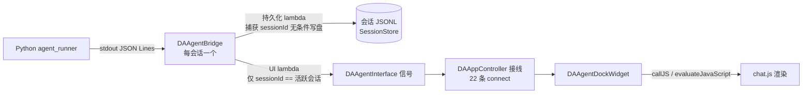

# e1053d1 并发会话重构遗漏审计报告

- **审计日期**：2026-09-08
- **审计对象**：commit `e1053d1`（refactor(agent): DAAgentModule 会话化桥管理，支持多子进程并发会话，2026-09-05）
- **审计范围**：`src/DAAgent/DAAgentModule.cpp/.h` 重构前后全量对照（旧版 1693 行 → 新版 2104 行），并延伸核对 `DAAgentBridge`、`DAAgentDockWidget`、`DAAgentWebChannel`、`DAAppController` 的关联行为
- **状态标记**：✅ 已修复 ｜ 🔴 待修复（确认回归） ｜ 🟡 待拍板（设计决策） ｜ ⚪ 次要缺口（可不修）

---

## 一、背景

### 1.1 重构做了什么

e1053d1 之前，`DAAgentModule` 持有**单一** `DAAgentBridge`（一个 Python 子进程），所有会话共享：

- Bridge 信号在 `initialize()` 中以 **15 条直连**转发到 `DAAgentInterface`（供 APP 层接到 Dock）；
- 持久化/状态记账在 `connectSignals()` 中以 **14 个 lambda** 挂接，统一写 `mCurrentSessionId`；
- 切换会话会 `requestStop` 终止进行中的对话（忙碌时排队续切），并 eager 下发 `load_session` 重建 Python 侧状态。

重构后改为**每会话一个桥**（`mSessionBridges`）+ 至多一个预热空闲桥（`mIdleBridge`）：

- 所有信号路由收口到 `attachBridge(bridge, sessionId)`：持久化 lambda 捕获桥所属 `sessionId` 无条件写盘；**UI 接口信号仅当 `sessionId == mCurrentSessionId`（活跃会话）时转发**；
- 切换会话变为**纯 UI 重放**（不再终止后台对话），Python 侧状态重建推迟到该会话下次 `sendMessage`（init → load_session → user_msg 的 stdin 管道序）；
- 桥生命周期收窄：后台会话跑完（`agentDone`）、切离空闲会话、删除会话、`sendMessage` 防御重建时经 `retireBridge` 退役；
- 后台会话的 ask_user / 审批卡缓存于 `mPendingQuestions` / `mPendingApprovalRequests`，切回时重发；
- 配置/工具/子 agent 热更新经 `forEachLiveBridge` 广播到全部存活桥。

### 1.2 为什么要审计

重构规模大（单文件 965 行改动）且信号路由从"直连"改为"手写 lambda 逐条重建"，**遗漏一条不会编译报错，只会静默丢失行为**。重构落地后已陆续暴露多个问题：

| 提交 | 日期 | 问题 | 状态 |
|------|------|------|------|
| `f74d857` | 09-05 | 历史重放时工具卡片与思考文本顺序错乱（chat.js 侧） | ✅ 与重构同批修复 |
| `2e66a4c` | 09-05 | 切换守卫等 `session_loaded` 解除，纯重放切换时永真冻结渲染 | ✅ 与重构同批修复 |
| `d6bdbdc` | 09-05 | 重放逐事件滚动 O(n²)，大会话切换冻结半分钟 | ✅ 与重构同批修复 |
| `34cc093` | 09-07 | 桥改懒创建后晚于插件 `registerTool`，`mTools` 恒空 → 全部插件工具返回 Unknown tool | ✅ 已修复 |
| `017e0b1` | 09-07 | **`agentMessageComplete`/`agentToolCall`/`agentToolResult` 三条 UI 转发遗漏** → 工具卡片不渲染、整轮回复堆进同一个大气泡（用户实际报告的症状） | ✅ 已修复 |

本次审计目标：穷举剩余遗漏。方法为将旧版 `initialize()`/`connectSignals()`/`switchSession()` 等函数的每一条行为与新版的 `attachBridge()`/`retireBridge()`/会话化函数逐条对照，确认"删除的旧行为是否有等价新实现"。

### 1.3 信号路由架构（审计基准）

**审计要点**：每条 Bridge 信号必须同时回答两个问题——① 持久化路径是否保留？② UI 路径（活跃会话过滤后 emit 接口信号）是否保留？`017e0b1` 修的正是三条信号只答了 ① 没答 ②。

---

## 二、确认的回归（🔴 待修复）

### 问题 1：`agentError` 不再清空 tool_call 配对 FIFO

- **位置**：`src/DAAgent/DAAgentModule.cpp:887`（agentError lambda）
- **旧行为**：agentError lambda 中 `d->mPendingToolCallUuids.clear()`，注释明确写着"出错时清空队列，避免旧会话残留 uuid 配对新会话"；旧 `switchSession` 切换时也清一次（MAJOR1 round-3）。
- **新行为**：agentError lambda 只置 `mSessionError[sessionId] = true` 并转发/刷角标，**不清队列**；新版 `switchSession` 也不清（队列已按会话隔离，切换不清是对的）；唯一清理点是 `retireBridge`。
- **触发场景**：工具调用已入队但结果永不到达——① 回合中途出错；② 进程崩溃；③ 用户在 tool_call 发出与执行之间按 Stop。残留 uuid 留在该会话队列头部，**下一轮的 tool_result 出队时配到旧 uuid**，JSONL 中 `tool_result.tool_call_id` 挂错。
- **影响**：历史重放（`DAAgentWebChannel::loadHistory` 按 id 配对）时旧工具卡挂着新结果、新工具卡因无结果被整个跳过；ask_user 待答时按 Stop 再发"继续"，答案/结果配对同样错位。落盘数据永久污染。
- **整改建议**：
  1. agentError lambda 中增加 `d->mPendingToolCallUuids[sessionId].clear()`（恢复旧语义，按会话作用域）；
  2. `stop()`（`DAAgentModule.cpp:450`）中对活跃会话同样清队列——用户 Stop 必然中断在途配对，旧代码虽未覆盖此场景，但并发版 Stop 只作用活跃会话，按会话清理无副作用；
  3. 崩溃自愈路径无需特殊处理：`crash_recovery` 错误已触发清理，恢复后 Python 重放整轮会重新入队，配对自洽。

### 问题 2：`mSessionStarting` 在启动失败/崩溃耗尽后永久残留

- **位置**：`src/DAAgent/DAAgentModule.cpp:847`（agentStarting lambda 置位）；清理点仅 `agentReady`（:853 区段）与 `retireBridge`（:977）
- **旧行为**：Module 无此状态（单一全局 `mAgentBusy`，由 Bridge 的 busy(false) 兜底复位）。
- **新行为**：`mSessionStarting[sessionId]` 置 true 后，若 ready 永不到达则无人清除。子进程反复崩溃到 `crash_exhausted` 时，Bridge 只发 `agentError` + `agentBusy(false)`（`DAAgentBridge.cpp:1073`），**不发 ready**。
- **触发场景**：启动超时 → ready 计时器 kill 进程 → 崩溃恢复循环 3 次耗尽；或任何"error + busy(false) 但无 ready"的终态。
- **影响**：① `sessionRuntimeState` 首查 starting → 会话角标永远"starting"；② `switchSession` 切离守卫要求 `!mSessionStarting` → 死桥永不退役（僵尸映射，仅靠下次 `sendMessage` 防御分支重建）；③ `newSession` 空会话复用判断被误阻。Dock 侧自身有 busy(false) 兜底（`DAAgentDockWidget.cpp:512`），Module 侧漏了对称逻辑。
- **整改建议**：agentBusy lambda（`DAAgentModule.cpp:869`）中增加 `if (!busy) d->mSessionStarting.remove(sessionId)`——与 Dock 的兜底完全同构；崩溃重试窗口内 `recoverFromCrash → startAgent → agentStarting` 会重新置位，语义不受影响。顺带在 busy(false) 分支补 `emit sessionListChanged(listSessionsForUI())`（见问题 6）。

### 问题 3：后台会话的错误信息切回时永久丢失

- **位置**：`src/DAAgent/DAAgentModule.cpp:1367`（`switchSession` 末尾 `mSessionError.remove(sessionId)`）
- **旧行为**：单会话时代错误总是实时可见（错误卡直接渲染）。
- **新行为**：后台会话出错时 `agentError` 被活跃会话过滤挡掉，只刷角标（"error"状态）；切回该会话时 `switchSession` 直接清除错误标志，**错误内容既没缓存也没重发**。
- **触发场景**：会话 A 后台运行出错（限流耗尽、上下文超限、崩溃耗尽等）→ 用户切回 A。
- **影响**：用户看到对话戛然而止，无任何错误解释；角标也在切入瞬间消失，连"出过错"的痕迹都没有。ask_user 和审批卡都有切回重发机制（`mPendingQuestions`/`mPendingApprovalRequests`），错误没有对应物——属于同一设计意图下的遗漏。
- **整改建议**：仿照 pending 机制增加 `mPendingErrors[sessionId]`（缓存 message/errorType/detail 三元组），agentError lambda 中非活跃会话时缓存，`switchSession` 第 5 步与挂起问题/审批一并重发 `emit agentError(...)` 后再清除；Dock 侧无需改动（`onAgentError` 已渲染错误卡且会复位守卫）。

### 问题 4：`shutdown()` 对非常态 QHash 范围迭代（COW 违规）

- **位置**：`src/DAAgent/DAAgentModule.cpp:468`
- **问题**：`for (DAAgentBridge* b : d->mSessionBridges)` 处于 `DA_D`（非 const）上下文，触发 Qt 容器 COW 深拷贝，违反项目铁律（AGENTS.md：禁止对非 const Qt 容器直接范围迭代）。指针容器功能上无害，但属规范性缺陷。
- **对照**：`isRunning()`（:693）同款迭代在 `DA_DC`（const）上下文中，无问题。
- **整改建议**：改为 `for (DAAgentBridge* b : std::as_const(d->mSessionBridges))`。

---

## 三、待拍板的设计决策（🟡）

### 问题 5：权限 A5"审批记忆不跨会话"实际失效

- **位置**：`src/DAAgent/DAAgentModule.cpp:992`（`retireBridge` 的 `disconnect(bridge, nullptr, this, nullptr)`）；新版 `switchSession`（:1314）
- **旧行为**（两道防线）：
  1. `switchSession` 每次切换显式 `mPermissionManager->clearSessionMemory()`——"审批记忆不跨会话存活"（权限层母文档 A5 [v2.1]）；
  2. `processExited → clearSessionMemory`（子进程退出即清）。
- **新行为**：两道防线都失效——
  1. 新版 `switchSession` 删除了显式清理（并发下全局清记忆会打断仍在后台运行的会话，删除有其合理性，但未见替代方案）；
  2. `retireBridge` **先 disconnect 再 requestStop**，`processExited → clearSessionMemory` 的 lambda（context = Module）在进程退出前已被断开，因此所有退役路径（切离空闲会话、后台跑完自动退役、删除会话、sendMessage 防御重建）都不清记忆。仅剩"未退役桥崩溃/用户 Stop/正常退出"这一条窄路径仍会清。
- **影响**：用户在会话 A 点过"批准并本会话记住"的授权，**事实上全局跨会话存活**（切到会话 B 依然生效），直到某个未退役桥退出。这是安全方向的**欠清理**，与 T16/A5 铁律的书面承诺相悖。
- **候选方案**（需产品/安全语义拍板）：

| 方案 | 内容 | 优点 | 代价 |
|------|------|------|------|
| **(a) 退役时显式清理** | `retireBridge` 在 disconnect 前调用 `clearSessionMemory()` | 改动一行；近似恢复旧"切离即清"语义；过度清除方向安全（代码注释已接受"宁可多问一次不漏清"） | 后台会话跑完自动退役时，会连带清掉用户当前活跃会话的记忆 → 活跃会话被重复询问 |
| **(b) 记忆按会话隔离** | `DAAgentPermissionManager` 会话记忆改为 `sessionId → 记忆集`；Bridge 增加所属会话标识（`setSessionId`），`decide()` 按会话查记忆 | 彻底符合并发语义，A5 承诺精确成立，无误清 | 改动中等：Manager API、Bridge 成员、attachBridge 注入三处；需补测试 |
| **(c) 接受现状** | 保持全局记忆直到进程退出，修订 `src/DAAgent/AGENTS.md` 的 A5 描述 | 零代码改动 | 安全承诺缩水，需明确记录为已知设计变更 |

- **建议**：短期先落 (a)（恢复"安全方向"），中期按 (b) 排期。

---

## 四、次要/展示层缺口（⚪ 可不修）

### 问题 6：活跃会话出错时不刷新会话列表角标

- **位置**：`src/DAAgent/DAAgentModule.cpp:869`（agentBusy lambda 仅在 `busy == true` 时 `emit sessionListChanged`）
- **现象**：活跃会话错误路径 busy(false) 到达后角标状态（"running"→"error"）不刷新，会话管理器对话框要等下一个事件才更新。
- **建议**：agentBusy lambda 的 busy(false) 分支同样 `emit sessionListChanged(listSessionsForUI())`，与问题 2 的修复合并实施。

### 问题 7：切回运行中会话时，进行中的工具卡整轮不可见

- **位置**：`DAAgentWebChannel::loadHistory`（:296-302，未配对 tool_call 跳过不入 uiEvents）+ `chat.js appendToolResult`（:716-719，FIFO 无匹配卡片即忽略）
- **现象**：后台会话正在执行某工具时切回——重放跳过进行中的 tool_call（尚无 result），实时 result 到达时前端无卡可配 → 该工具调用本轮在 UI 上完全不可见，下轮重放才出现。
- **建议**（如要修）：`loadHistory` 将末尾未配对 tool_call 渲染为 running 态卡片（result 留空），实时 `appendToolResult` 依 FIFO 自然补全；需同步考虑分段懒加载的 chunk 边界。

### 问题 8：后台会话的重试条与"话说一半"提醒被丢弃

- **位置**：`src/DAAgent/DAAgentModule.cpp` agentRetrying / agentTurnPossiblyIncomplete lambda（活跃会话过滤后直接丢弃，无缓存）
- **现象**：后台会话经历 LLM 重试或"回合疑似未完成"时，切回后看不到重试条/提醒卡（`systemMessage` 提醒也一并不发）。
- **评估**：设计上后台会话只以角标提示，重试条属瞬态信息，可接受；`agentTurnPossiblyIncomplete` 的提醒卡有实际指导价值（提示用户发"继续"），若要修可与问题 3 的 `mPendingErrors` 机制合并为"后台事件缓存重发"。

---

## 五、核查通过、确认重建正确的部分

以下路径逐条对照过，重构语义完整，无需整改：

- **UI 信号转发**（除已修复的 3 条外）：`agentToken`、`agentQuestion`、`agentError`、`agentRetrying`、`agentSubagentProgress`、`agentTurnPossiblyIncomplete`、`agentStarting/Ready/Busy/Done`、`agentSessionLoaded`、审批请求/作废——均带活跃会话过滤重建；
- **持久化 lambda**：assistant/tool_call/tool_result/usage/ask_user 五类记录均按桥所属会话无条件写盘（重构核心目标达成），子 agent 结果过滤（`subagentId` 非空不落盘）保留；
- **广播类**：`setActiveModel`/`setLLMConfig`/`setPermissionConfig`/`setPermissionMode`/`setScriptWorkspaceDir`/`saveSubagent`/`deleteSubagent`/`registerTool`/`unregisterToolsByProvider` 均经 `forEachLiveBridge` 热同步（含预热桥），后出生桥由 `attachBridge` 的 `setTools` 注入兜底（34cc093）；
- **切换/交互路由**：`switchSession` 纯重放 + 挂起问题/审批卡切回重发 + 预热桥温暖化接管；`sendToolApproval` 按 `mApprovalSessionByCallId` 路由到正确桥；`sendUserAnswer` 按活跃会话 FIFO 出队落盘；
- **生命周期**：`agentDone` 后台退役守卫（有挂起问题/审批不退役）；`sendMessage` 死桥防御重建；崩溃自愈链（`sessionRestoreRequested` 带桥绑定校验、`agentReady` 恢复分支、`resendLastMessage`）；`retireBridge` 状态哈希全量清理（busy/starting/error/累计 token/FIFO/挂起缓存/审批路由表）；
- **token 记账**：per-session 累计 + `emitTokenUsageForSession` 切换重算 + `resetCumulativeTokens` 仅清当前会话；
- **APP 接线**：`DAAppController::initialize` 的 22 条接口↔Dock connect 无一遗漏；
- **导出**：`exportActiveSessions` 扩展导出后台运行中会话（较旧版增强）。

---

## 六、整改优先级汇总

| # | 问题 | 严重度 | 状态 | 建议动作 |
|---|------|--------|------|----------|
| 0 | 3 条 UI 信号转发遗漏（工具卡不渲染/大气泡） | 高 | ✅ `017e0b1` | 已修复 |
| 1 | agentError/stop 不清配对 FIFO → JSONL 配对错位 | 高（数据污染） | 🔴 | agentError lambda + stop() 按会话清队列 |
| 2 | mSessionStarting 残留 → 角标卡死/死桥不退役 | 中高 | 🔴 | agentBusy lambda busy(false) 时 remove |
| 3 | 后台错误切回丢失 → 用户无从得知失败原因 | 中 | 🔴 | mPendingErrors 缓存 + 切回重发 |
| 4 | shutdown() COW 违规 | 低（规范） | 🔴 | std::as_const 包裹 |
| 5 | 权限 A5 审批记忆跨会话存活 | 中高（安全语义） | 🟡 | 方案 a/b/c 待拍板，建议短期 (a)、中期 (b) |
| 6 | 活跃会话错误后角标不刷新 | 低 | ⚪ | 并入问题 2 修复 |
| 7 | 切回运行中会话工具卡缺失 | 低（纯展示） | ⚪ | 可选：loadHistory 渲染 running 卡 |
| 8 | 后台重试条/未完成提醒丢弃 | 低 | ⚪ | 可选：并入问题 3 缓存机制 |

**修复验证建议**：问题 1/2 可扩展现有 `src/tst` 下的 DAAgent 系列测试（DAAgentSessionStoreTest 等）补状态机断言；问题 7 可用 `tools/perf/` 的 headless Chromium harness（d6bdbdc 引入）加载真实 chat.js 做 DOM 断言。

---

## 附录：审计涉及的提交与文件

| 提交 | 说明 |
|------|------|
| `e1053d1` | 被审计的重构（2026-09-05） |
| `f74d857` / `2e66a4c` / `d6bdbdc` | 与重构同批的前端重放修复 |
| `34cc093` | 重构后遗漏 #1：桥工具表注入 |
| `017e0b1` | 重构后遗漏 #2：3 条 UI 信号转发（本次审计前置修复） |

| 文件 | 角色 |
|------|------|
| `src/DAAgent/DAAgentModule.cpp` | 会话化桥管理/信号路由/持久化（审计主体） |
| `src/DAAgent/DAAgentBridge.cpp` | 子进程桥：协议解析、崩溃恢复、busy/error 发射时序 |
| `src/DAGui/Agent/DAAgentDockWidget.cpp` | UI 侧守卫与状态兜底 |
| `src/DAGui/Agent/DAAgentWebChannel.cpp` | callJS 序列化 + loadHistory 事件配对 |
| `src/DAGui/Agent/resources/chat.js` | 前端渲染（工具卡 FIFO、气泡闭合、分段重放） |
| `src/APP/DAAppController.cpp` | 接口↔Dock 信号接线 |
| `src/DAAgent/AGENTS.md` | 权限层铁律（T16/A5）与设计文档索引 |
