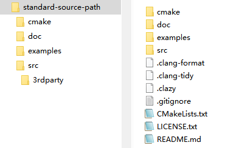
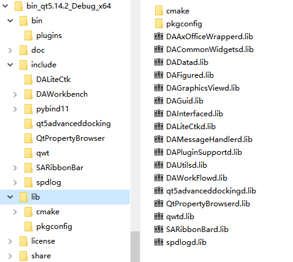
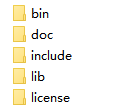

一个大型工程，并不会单单只包括应用自身，还有此程序抽象出来的库，这些库除了自身模块化意外，还有可能是提供给第三方用户进行插件化的开发使用的，同时工程还包含了很多第三方库

一个大型工程通常由如内容组成:

- 第三方库（例如 `OCCT`，`VTK`，`Qt`）
- 自定义库
- Gui 程序
- 静态资源（例如脚本、图片、配置文件）

针对这些大型的工程，如果用一些简单的构建工具，是很难做到一键编译一键安装的，例如 `qmake`，缺少强大的安装和依赖管理功能，所以QT6已经弃用了`qmke`，而转用了`cmake`，目前来说，在C++领域，最适合进行构建管理的还是`cmake`，虽然`cmake` 有非常非常多的缺点，但它的功能暂时是最全面的

针对大型系统目前还是推荐用`cmake`进行构建，通过`cmake`，你可以做到如下这些事情：

- 组织庞大的工程关系
- 自动化编译第三方库
- 按照依赖关系自动构建出整个工程的各组件
- 自动化安装
- 形成一个第三方方便引入的插件开发环境

这里所谓第三方方便引入的开发环境，是能让第三方可以一键引入你的库，以及你依赖的第三方库

但是`cmake`的缺点也是复杂，文档生涩，语法奇葩，说到底`cmake`就是一种高级别的宏

下面根据我的经验，介绍一下如何通过`cmake`组织和构建一个大型的工程，适合大型工业软件的构建，构建出来的软件能给第三方用户方便的进行二次开发，同时，结合 `git` 的 `submodel` 管理第三方库，让整个工程变得更为简洁明了

# 工程的目录结构

工程的顶层文件夹应该包含如下几个文件夹：

- src 文件夹，这个文件夹用来放置你所有的源代码
- doc 文件夹，这个文件夹用来放置你所有的文档
- 3rdparty 文件夹，这个文件夹用来放置你所有的第三方库，这个文件夹可以放在 src 文件夹里面，也可以放在外层目录
- 针对整个工程的 `CMakeLists.txt` 文档
- cmake 文件夹，这个文件夹放置了一些封装好的 cmake 文件，用来方便你的 cmake 的集成

上面的这些文件夹和文件是一个工程比较通用的组织结构

一般而言，在工程的顶层目录下，还会有`.clang-format`用于规范编码，`.clang-tidy`和`.clazy`用于代码检查这些按需提供，但作为一个开源的项目，还是建议提供的

因此一个相对标准的源码目录如下图所示



# 第三方库的管理

3rdparty 文件夹用来放置所有的第三方库的源代码，通常来讲，第三方库源代码不应该下载下来，放进 3rdparty 文件夹，而是通过 git 的 `submodule` 添加进去，通过 `submodule` 方式添加进去的源代码，可以随时更新到 github 上的最新版本，也可以指定这个第三方库是某个固定分支或者是某个 tag

例如我这里需要使用ribbon界面，添加了SARibbon作为第三方库

```shell
git submodule add https://github.com/czyt1988/SARibbon.git ./src/3rdparty/SARibbon
```

> 注意，对于使用`submodule`管理第三方库的方式，首次拉取项目之后，需要执行：
> 
> ```shell
> git submodule update --init --recursive
> ```
> 
> 把所有库拉取下来
>
> 也可以clone的时候使用--recursive参数
> 
> ```shell
> git clone --recursive
> ```

大部分的第三方库都提供了 `cmake`，如果不提供的话，我会 fork 一个，写一个带有 `cmake` 的版本，例如 [qwt库](https://github.com/czyt1988/QWT)，[QtPropertyBroswer库](https://github.com/czyt1988/QtPropertyBrowser)，3rdparty 文件夹下会写一个 `cmake` 文件，用来集中编译所有的第三方库，一般我会在 `cmake` 中就指定安装目录，确保第三方库的安装目录和我的程序的安装目录是一致的，这样的好处是，如果你的程序需要给其他人进行二次开发的话，能保证你程序编译出来的库和第三方库是在一个安装环境下，这样可以解决第三方库和你自身程序库的依赖问题，不需要用户在编译你的程序之前先进行大量的第三方库的编译，只需要一次统一的编译即可把所有的第三方库安装到固定目录下,最后install后，形成一个完整的开发环境


连同第三方库一起发布的开发环境bin目录


连同第三方库一起发布的开发环境lib目录


作为第三方开发者，这个完整开发环境里面包含了所有的库，第三方开发者只需知道安装目录，就可以加载所有的依赖

下面就介绍一下，如何通过cmake实现这种大型工程的组织

# 大型工程的cmake写法

这里不会教你如何写cmake，而是着重讲讲大型工程的cmake要注意事项，工程顶层会有个`CMakeLists.txt`文件，这个文件定义了整个工程的信息、可选项、总体的安装步骤等，实现整个工程的构建，顶层的`CMakeLists.txt`通过`add_subdirectory`添加子目录，一般会添加src目录，以我自己的一个[仿真集成平台data-workbench举例](https://github.com/czyt1988/data-workbench)，介绍如何通过cmake组织一个大型的工程

> 上述的仿真集成平台不提供业务逻辑，所有业务逻辑都是通过插件实现，插件的开发就需要依赖此集成平台和所有第三方库

首先，如前文所述，这个工程的目录结构大致如下：

```
data-workbench
  |-doc
  |-cmake
  | |-此项目用到的cmake文件
  |-src
  | |-3rdparty
  | |-DAUtils (utils模块，封装了通用功能)
```

这里的工程使用同一前缀

在进行大型工程组织之前，`cmake` 的 `install` 命令是绝对要掌握的，而且要熟知通用的安装目录结构标准，不能过度自由的发挥，`install` 命令可以做下面这些事情：

1. 复制文件或者文件夹到某个固定的目录下
2. 导出能被其它工程 `cmake` 正确导入的 `cmake` 文件，一般是4个cmake文件：`{库名}Config.cmake`、`{库名}ConfigVersion.cmake`、`{库名}Targets.cmake`、`{库名}Targets-debug.cmake`
3. 能给当前这个构件树下其他的模块提供依赖支持

另外 `cmake` 有一个很重要的功能，可以区分构建环境和安装环境进行不同的依赖引用和头文件寻址，这样就可以区分当前的构建环境亦或是未来第三方用户，进行二次开发时候的安装环境，这两个环境的头文件寻址路径以及依赖的寻址路径是不一样的

`cmake`的`install`用法是比较固定的，按照一个例子或者模板非常简单的就能实现自己的安装和部署，针对大型系统一个多组件的安装是必须的，类似于QT的包引入，能进行模块的划分，不需要整个QT所有库都一起引进工程里面，针对自己的大型系统也应该实现类似的引入，因此，下面将着重介绍如何进行模块化的`install`

## 规范的安装路径

使用规范的安装路径，能让你工程的库以及第三方库安装在同一个目录下，这样你的工程就很容易被第三方使用者集成起来进行二次开发，因此，安装路径尽量使用规范化的安装路径，而不是过于自由的进行定制，一般规范化的安装路径如下：

- bin
- lib
- lib/cmake
- include

常见的cmake安装路径下的文件夹如图所示



cmake中提供了GNUInstallDirs来获取这些规范的路径命名，你可以通过`include(GNUInstallDirs)`导入，就可以使用：

- `CMAKE_INSTALL_BINDIR`
- `CMAKE_INSTALL_LIBDIR`
- `CMAKE_INSTALL_INCLUDEDIR`
- `CMAKE_INSTALL_DOCDIR`

这些变量了提供了标准的命名

bin目录放置编译完的二进制文件在WINDOWS系统上就是dll文件

lib文件夹放置编译后的lib文件，在WINDOWS系统下，MSVC编译器编译出来就是.lib后缀的文件

一般情况下，lib文件夹下还有一个`cmake`子文件夹，这个文件夹放置`cmake`的导出文件，通常来讲，这个文件夹下的导出文件放在它自身工程名的一个文件夹里，形成如：`lib/cmake/{LibName}`的文件夹结构

include文件夹主要放置头文件，通常来讲头文件也是需要放在他自身工程名的一个文件夹里，形成如：`include/{LibName}`的文件夹结构

基本上大部分的第三方库都是按照这个目录结构进行安装，这样当你的工程包含了大量的第三方库，以及你自身的库的情况下，最终所有的dll都会安装在`bin`录下，所有的库文件都会安装在`lib`目录下，所有的头文件都会在`include`文件夹下面对应的自身库名的文件夹下面，所有`cmake`需要用的文件都在`lib/cmake`文件夹下对应的自身库名的文件夹下面

以这种标准化的形式构建，第三方开发者可以很方便的使用你的工程

这里举一个例子，假如你的库名叫`SARibbonBar`，那么它安装后在windows系统下应该生成如下结构

```
bin
  |-SARibbonBar.dll
include
  |-SARibbonBar
     |-SARibbonBar.h
     |-...所有头文件都在此文件夹下
lib
  |-SARibbonBar.lib
  |-cmake
    |-SARibbonBar
       |-SARibbonBarConfig.cmake
       |-SARibbonBarConfigVersion.cmake
       |-SARibbonBarTargets.cmake
       |-SARibbonBarTargets-debug.cmake
```

## install命令

cmake的install是一组命令，有多个功能

### 复制文件`install(FILES)`&`install(DIRECTORY)`

最简单的就是拷贝，包括`install(FILES)`,`install(DIRECTORY)`这两个都是拷贝用的，一个拷贝文件，一个拷贝目录

例如，[SARibbon库](https://github.com/czyt1988/SARibbon)的Cmake文件中，头文件都在`${SARIBBON_HEADER_FILES}`这个变量下面,把它拷贝到安装目录下的`include/${SARIBBON_LIB_NAME}`路径下，就如下这样写，安装路径按照上面说的标准化走

```cmake
install(FILES
    ${SARIBBON_HEADER_FILES}
    DESTINATION include/${SARIBBON_LIB_NAME}
    COMPONENT headers
)
```

### 生成cmake目标文件`install(TARGETS)`&`install(EXPORT)`

`install(TARGETS)`&`install(EXPORT)`这两个命令是要配合一起用，用来生成cmake目标文件，cmake目标文件描述了整个工程所有的依赖内容，最终生成`{LibName}Targets.cmake`和`{LibName}Targets-debug.cmake`文件

这两个函数写法也比较固定,这里假如你自己的库名字叫${LIB_NAME}，那么`install(TARGETS)`&`install(EXPORT)`的写法基本如下：

```cmake
install(TARGETS ${LIB_NAME}
    EXPORT ${LIB_NAME}Targets
    RUNTIME DESTINATION bin
    LIBRARY DESTINATION lib
    ARCHIVE DESTINATION lib
    INCLUDES DESTINATION include/${LIB_NAME}
)

install(EXPORT ${LIB_NAME}Targets
    FILE ${LIB_NAME}Targets.cmake
    DESTINATION lib/cmake/${LIB_NAME}
)
```

这两个结合，把你的目标依赖内容，写到了`{LibName}Targets.cmake`文件中，并复制到安装目录下的`lib/cmake/${LIB_NAME}`下,`install(TARGETS)`用来把你的工程信息导出到`${LIB_NAME}Targets`这个变量中，`install(EXPORT)`把`${LIB_NAME}Targets`这个内容，生成到`${LIB_NAME}Targets.cmake`文件中，同时也会生成一个`{LibName}Targets-debug.cmake`文件

这个文件就是第三方引入你的工程的关键，这里会把target_打头的函数相关信息写入这个文件中，例如`target_compile_definitions`和`target_include_directories`这些函数定义的信息，也会写入`${LIB_NAME}Targets.cmake`文件中，一些预定义的宏和头文件路径在加载`${LIB_NAME}Targets.cmake`后就自动加载进来了，因此，那些宏和头文件路径要暴露给第三方的，都应该使用target_xx的函数，同时也要区分构建环境还是安装环境，如果你的CMakeLists.txt作为一个子目录，那么这时属于构建环境，尤其针对include_directories，构建环境和安装环境肯定不一样的，因此要区别对待，否则作为子工程嵌入时会出错，如下区分构建环境和安装环境的路径引用

```cmake
target_include_directories(${SARIBBON_LIB_NAME} PUBLIC
    $<INSTALL_INTERFACE:include/${SARIBBON_LIB_NAME}>
    $<BUILD_INTERFACE:${CMAKE_CURRENT_SOURCE_DIR}>
)
```

### 生成config文件`configure_package_config_file`

cmake的find_package函数不是加载`${LIB_NAME}Targets.cmake`，而是加载`{LibName}Config.cmake`文件，`{LibName}Config.cmake`文件的生成，需要用到`configure_package_config_file`函数，一般还会配合`write_basic_package_version_file`,这两个函数在`CMakePackageConfigHelpers`里面，需要先引入

```cmake
include(CMakePackageConfigHelpers)
```

你会留意到好多开源项目都会有个`{LibName}Config.cmake.in`文件在src目录下，这个文件就是用来生成`{LibName}Config.cmake`文件的，`{LibName}Config.cmake`的作用就是加载上面生成的`${LIB_NAME}Targets.cmake`文件，同时能加入一些自己的扩展内容，因此，`{LibName}Config.cmake.in`的通用写法是：

```cmake
# This module defines
# @PROJECT_NAME@_FOUND, if false, do not try to link to @PROJECT_NAME@
# @PROJECT_NAME@_INCLUDE_DIR, where to find the headers
# @PROJECT_NAME@_LIBRARIES, where to find the libs
@PACKAGE_INIT@

set (PackageName @YOUR_LIB_NAME@)
set (@YOUR_LIB_NAME@_VERSION @YOUR_LIB_VERSION@)

include ( ${CMAKE_CURRENT_LIST_DIR}/${PackageName}Targets.cmake )

set_and_check ( ${PackageName}_INCLUDE_DIR ${PACKAGE_PREFIX_DIR}/@YOUR_LIB_INCLUDE_INSTALL_DIR@ )

set ( ${PackageName}_LIBRARIES)
list ( APPEND ${PackageName}_LIBRARIES ${PackageName})

check_required_components(${PackageName})
```

其中@xx@是调用这个cmake.in文件的CMakeLists文件的变量，一般会传入三个变量

- `@YOUR_LIB_NAME@` 你的库名字,也可以用`PROJECT_NAME`替代，看习惯
- `@YOUR_LIB_VERSION@` 你的库的版本号
- `@YOUR_LIB_INCLUDE_INSTALL_DIR@` 你的库安装后的include文件位置，这个用来检查文件的完整性

`${PACKAGE_PREFIX_DIR}`这个变量是在`@PACKAGE_INIT@`里面展开的

`@PACKAGE_INIT@`这个变量会展开为下面这段

```cmake
####### Expanded from @PACKAGE_INIT@ by configure_package_config_file() #######
####### Any changes to this file will be overwritten by the next CMake run ####
####### The input file was DAWorkbenchConfig.cmake.in                            ########

get_filename_component(PACKAGE_PREFIX_DIR "${CMAKE_CURRENT_LIST_DIR}/../../../" ABSOLUTE)

macro(set_and_check _var _file)
  set(${_var} "${_file}")
  if(NOT EXISTS "${_file}")
    message(FATAL_ERROR "File or directory ${_file} referenced by variable ${_var} does not exist !")
  endif()
endmacro()

####################################################################################
```

`@PACKAGE_INIT@`相当于提供了一个宏函数和一个变量，宏函数为`set_and_check`，用于检测文件是否存在，变量为`PACKAGE_PREFIX_DIR`，用于指定工程的绝对安装路径，用过这个变量可以直接指到安装路径的顶层目录

## 单一模块的install写法

如果你作为一个库开发者，这个库只有一个模块，那么写法相对固定，根据上面的介绍，单一模块的install写法基本就是如下步骤：

1. 确定库名和版本号

```cmake
set(YOUR_LIB_NAME YOURLibName)
set(YOUR_VERSION_MAJOR 1)
set(YOUR_VERSION_MINOR 0)
set(YOUR_VERSION_PATCH 0)
set(YOUR_VERSION "${YOUR_VERSION_MAJOR}.${YOUR_VERSION_MINOR}.${YOUR_VERSION_PATCH}")
```

2. target_xx相关函数，定义宏、头文件路径等内容

- 注意要区分安装模式还是构建模式，通过`$<INSTALL_INTERFACE:`指定安装模式，通过`$<BUILD_INTERFACE:`指定构建模式

3. 文件复制

复制头文件

```cmake
install(FILES
    ${YOUR_HEADER_FILES}
    DESTINATION include/${YOUR_LIB_NAME}
    COMPONENT headers
)
```
其中${YOUR_HEADER_FILES}为你头文件的列表

通过install可以复制任意内容

4.把依赖信息导出同时生成XXTargets.cmake文件

```cmake
install(TARGETS ${YOUR_LIB_NAME}
    EXPORT ${YOUR_LIB_NAME}Targets
    RUNTIME DESTINATION bin
    LIBRARY DESTINATION lib
    ARCHIVE DESTINATION lib
    INCLUDES DESTINATION include/${YOUR_LIB_NAME}
)
install(EXPORT ${YOUR_LIB_NAME}Targets
    FILE ${YOUR_LIB_NAME}Targets.cmake
    DESTINATION lib/cmake/${YOUR_LIB_NAME}
)
```

5. 生成config文件

```cmake
include(CMakePackageConfigHelpers)
set(YOUR_LIB_INCLUDE_INSTALL_DIR include/${YOUR_LIB_NAME})
write_basic_package_version_file(
    ${CMAKE_CURRENT_BINARY_DIR}/${YOUR_LIB_NAME}ConfigVersion.cmake
    VERSION ${YOUR_VERSION}
    COMPATIBILITY SameMajorVersion
)
configure_package_config_file(
    "${CMAKE_CURRENT_SOURCE_DIR}/${YOUR_LIB_NAME}Config.cmake.in"
    "${CMAKE_CURRENT_BINARY_DIR}/${YOUR_LIB_NAME}Config.cmake"
    INSTALL_DESTINATION lib/cmake/${YOUR_LIB_NAME}
    PATH_VARS YOUR_LIB_INCLUDE_INSTALL_DIR
)
```

上面的${YOUR_LIB_NAME}Config.cmake.in是你为了生成Config.cmake文件使用的内嵌文件，具体位置视情况而定

YOUR_LIB_INCLUDE_INSTALL_DIR变量指定了安装位置，用于进行导入检查

6. 复制cmake文件到lib/cmake

```cmake
install(FILES
    "${CMAKE_CURRENT_BINARY_DIR}/${YOUR_LIB_NAME}Config.cmake"
    "${CMAKE_CURRENT_BINARY_DIR}/${YOUR_LIB_NAME}ConfigVersion.cmake"
    DESTINATION lib/cmake/${YOUR_LIB_NAME}
)
```

上面6步完成了一个库的安装，能把库需要的东西都放到安装目录下，通过提供的cmake文件，能找到对应的内容

使用这个库仅仅需要以下步骤：

```cmake
set(${YOUR_LIB_NAME}_DIR "your-lib-install-dir/lib/cmake")
find_package(${YOUR_LIB_NAME})
```

## 多模块的install写法

上面介绍了单一模块的写法，多模块有一点区别

Qt就是一个多模块的例子，Qt模块的引入是这样写的：

```cmake
find_package(QT NAMES Qt6 Qt5 COMPONENTS 
    Core
    Gui
    Widgets
)
```

可以按需获取对应的模块

多模块的`install`必须先有单模块的`install`，其实多模块的`install`就是遍历了所有单模块所生成的config文件，多模块的`install` 也是需要一个类似单模块的config文件，只是这个config文件和单模块不太一样，它会遍历所有子模块的Target，把这些子模块需要的头文件引用路径以及依赖的库加载进来，这样只需要调用findPackage函数就可以把这个子模块所有需要的内容加载进来

对于多模块，你的工程目录可能是这样的

```
root
├src
│├─module-1
││ └─CMakeLists.txt
│├─module-2
││ └─CMakeLists.txt
│...
│├─module-n
││  └─CMakeLists.txt
│├─CMakeLists.txt
│└─LibConfig.cmake.in
│CMakeLists.txt
└PackageConfig.cmake.in
```

这里有两个cmake.in文件，一个是`LibConfig.cmake.in`这个是给各个独自模块公用的，名字不固定，如果每个模块有特殊处理，可以用自己的，这个非必须，有个通用的方便一点，写法和单一模块的config文件写法一致

但这个单一模块在构建时，应该加入命名空间，避免冲突，这时候，你的库在定义过程中应该如下：

```cmake
add_library(${YOUR_LIB_NAME} SHARED
        ${YOUR_LIB_HEADER_FILES}
        ${YOUR_LIB_SOURCE_FILES}
)
# 定义别名让YourNameSpace::${DA_LIB_NAME}也能获取到
add_library(YourNameSpace::${YOUR_LIB_NAME} ALIAS ${YOUR_LIB_NAME})
```

在安装过程中，生成的XXTargets.cmake也可以加个前缀也可以不加，只要能保证不重命名即可


要实现模块化，最重要的是`PackageConfig.cmake.in`这个文件，这个文件作用是组织所有的模块，此cmake.in名字不固定，方便记忆即可

此文件用来生成整个模块包的Config.cmake文件，效果和单一模块写法类似，但它是遍历加载所有模块的{LibName}Targets.cmake文件,cmake的find_package原理就是找到对应的xxConfig.cmake文件并加载，如果是下面这段命令

```cmake
find_package(Qt5 COMPONENTS 
    Core
    Gui
    Widgets
)
```

它加载的是Qt5Config.cmake,因此，看看Qt5Config.cmake是如何实现的，就知道如何写package相关的Config.cmake文件

Qt5Config.cmake的主要工作代码段是：

```cmake
foreach(module ${Qt5_FIND_COMPONENTS})
    find_package(Qt5${module}
        ${_Qt5_FIND_PARTS_QUIET}
        ${_Qt5_FIND_PARTS_REQUIRED}
        PATHS ${_qt5_module_paths} NO_DEFAULT_PATH
    )
    if (NOT Qt5${module}_FOUND)
        string(CONFIGURE ${_qt5_module_location_template} _expected_module_location @ONLY)

        if (Qt5_FIND_REQUIRED_${module})
            set(_Qt5_NOTFOUND_MESSAGE "${_Qt5_NOTFOUND_MESSAGE}Failed to find Qt5 component \"${module}\" config file at \"${_expected_module_location}\"\n")
        elseif(NOT Qt5_FIND_QUIETLY)
            message(WARNING "Failed to find Qt5 component \"${module}\" config file at \"${_expected_module_location}\"")
        endif()

        unset(_expected_module_location)
    endif()
endforeach()
```

Qt5_FIND_COMPONENTS是调用`find_package(Qt5 COMPONENTS Core Gui Widgets)`命令COMPONENTS后面的内容列表

其实就是遍历这些components，逐个find_package

`find_package(Qt5 COMPONENTS Core Gui Widgets)`这段最后相当于执行了

```cmake
find_package(Qt5Core)
find_package(Qt5Gui)
find_package(Qt5Widgets)
```

一般没有哪个库有Qt如此大的规模，因此我们可以适当简化，这里给出一个简单的模块化cmake写法

对于模块化的cmake，首先要有个总的进入文件，以YourPackage命名，像Qt5就叫Qt5Config.cmake，自己模块就叫{YourPackageName}Config.cmake

一般{YourPackageName}Config.cmake会通过{YourPackageName}Config.cmake.in模板生成，一个相对通用的写法如下：

```cmake
@PACKAGE_INIT@

include(CMakeFindDependencyMacro)
# 这里PROJECT_NAME就作为包名
set(_package_name @PROJECT_NAME@)

# 这里要修改为所支持的模块名
set(_${_package_name}_supported_components Module1 Module2 Module3 ... ModuleN)

# 遍历所有要导入的模块
foreach(_component ${${_package_name}_FIND_COMPONENTS})
    # 首先判断是否在所支持列表中
    if(_component IN_LIST _${_package_name}_supported_components)
        set(__target ${_package_name}::${_component})
        if(TARGET ${__target})
            # 避免重复加载
            continue()
        else()
            find_package(${_component} 
                REQUIRED 
                PATHS ${CMAKE_CURRENT_LIST_DIR}
            )
        endif()
    else()
        set(${_package_name}_FOUND FALSE)
        set(${_package_name}_NOT_FOUND_MESSAGE "Unknown component: ${__target}.")
        break()
    endif()
endforeach()
```

在你的工程的顶层目录的CMakeLists里，对此config文件进行生成即可

因此，对于多模块的install写法，总结步骤如下

1. 各自单一模块实现各自的install，参考单一模块install写法，各个子模块的安装路径为lib/cmake/${TOP_PROJECT_NAME}目录

${TOP_PROJECT_NAME}是顶层CMakeLists文件的project名称，按实际工程需求传递到子模块的CMakeLists中，可以通过变量或者固定

2. 编写{YourPackageName}Config.cmake.in模板，模板内容参考上文描述

3. 在工程的顶层目录的CMakeLists里，生成模块的{YourPackageName}Config.cmake文件：

```cmake
include(CMakePackageConfigHelpers)
write_basic_package_version_file(
    "${CMAKE_CURRENT_BINARY_DIR}/${PROJECT_NAME}ConfigVersion.cmake"
    VERSION ${DA_VERSION}
    COMPATIBILITY AnyNewerVersion
)
configure_package_config_file(
    "${CMAKE_CURRENT_SOURCE_DIR}/${PROJECT_NAME}Config.cmake.in"
    "${CMAKE_CURRENT_BINARY_DIR}/${PROJECT_NAME}Config.cmake"
    INSTALL_DESTINATION lib/cmake/${PROJECT_NAME}
    NO_CHECK_REQUIRED_COMPONENTS_MACRO
)
```

这里${PROJECT_NAME}是工程名称，也可以使用自定义的名字

4. 把生成的{YourPackageName}Config.cmake文件复制到lib/cmake/${PROJECT_NAME}目录下，和子模块的路径一致

```cmake
install(FILES
    "${CMAKE_CURRENT_BINARY_DIR}/${PROJECT_NAME}ConfigVersion.cmake"
    "${CMAKE_CURRENT_BINARY_DIR}/${PROJECT_NAME}Config.cmake"
    DESTINATION lib/cmake/${PROJECT_NAME}
)
```

最终子模块的Config.cmake和包的Config.cmake都在lib/cmake/${PROJECT_NAME}

# 工程的组织

至此，单模块和多模块的安装都已介绍完成，大型工程的组织和安装就是这两者的组合

工程各个模块安装到固定目录下，连同第三方库指定同一个安装路径，最终形成一个完整的开发环境

这里以实际例子举例，例子源码位于：

[github:https://github.com/czyt1988/data-workbench](https://github.com/czyt1988/data-workbench)

[gitee镜像:https://gitee.com/czyt1988/data-workbench](https://gitee.com/czyt1988/data-workbench)

源码目录结构(这里为了便于显示，文件夹用[]扩起)：

```
[root]
├[src]
│ ├─[3rdparty]
│ │ ├─[spdlog]
│ │ ...
│ │ ├─[SARibbon]
│ │ └─CMakeLists.txt(用于构建和安装第三方库)
│ ├─[DAUtils]
│ │ └─CMakeLists.txt
│ ├─[DAGui]
│ │ └─CMakeLists.txt
│ ...
│ ├─[APP]
│ │  └─CMakeLists.txt
│ ├─CMakeLists.txt
│ └─DALibConfig.cmake.in(用于给各个子模块生成Config.cmake文件)
├─CMakeLists.txt
└─DAWorkbenchConfig.cmake.in(用于生成总包的Config.cmake文件)
```

1. 第三方库

如前文所述，第三方库都在`src/3rdparty`下面，首先需要的是对第三方库的编译，`3rdparty`有个`CMakeLists.txt`文件夹用于编译安装所有第三方库，个人习惯不把`3rdparty`下的`CMakeLists.txt`纳入工程的`subdirectory`中


# 第三方用户引入的方式

对于第三方插件开发者来说，只需要知道你工程的安装的路径即可方便的引入你的开发环境，因为你的工程已经和第三方库安装在同一个目录下，这时候他只需要知道这一个路径就可以把你的工程以及其他的第三方库都引入，当然，为了让第三方开发者更好地使用你的库，你最好把第三方库的引入封装成宏，以方便第三方开发者的引入
