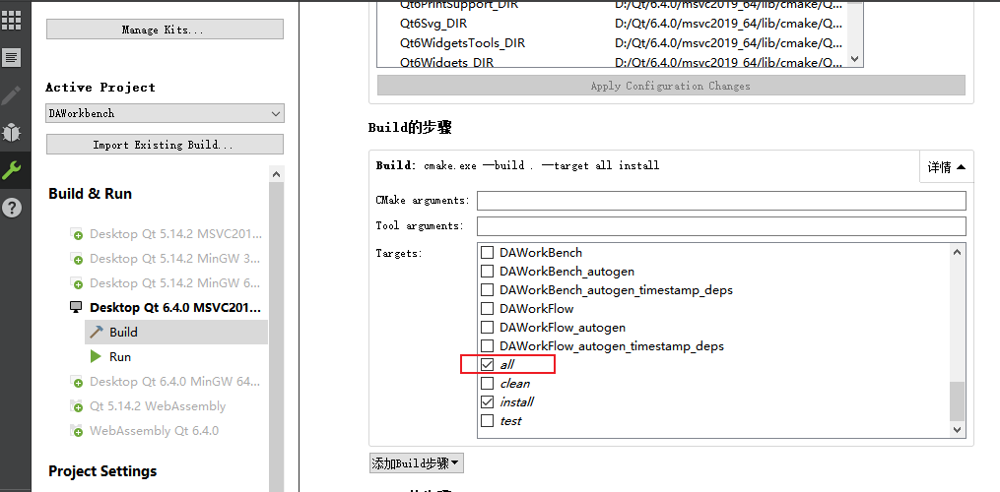

# 概述

本文讲述如何构建`data-workbench`，整个构建过程需要加载2到3次cmake文件，首先是`src/3rdparty/CMakeLists.txt`，然后是`CMakeLists.txt`，最后是`plugins/CMakeLists.txt`（此步骤可以并入第二步中一起执行）

`data-workbench`通过cmake来建立复杂的依赖，通过git submodule来管理第三方库，在构建`data-workbench`之前，需要构建第三方库

如果没有构建第三方库，直接打开`data-workbench`下的CMakeLists.txt将报错

# 构建第三方库

第三方库的cmake文件位于:

```txt
src\3rdparty\CMakeLists.txt
```

此文件不属于上级工程，构建第三方库直接用cmake打开此文件构建即可，这里面已经把第三方库的基本设置配置好，构建后需要进行安装（install），安装完成后会在工程目录下生成`bin_qt{version}_{MSVC/GNU}_x{64/32}`的安装目录，`data-workbench`需要依赖此目录

## 使用Qt Creator基于CMake构建所有第三方库

1. 打开Qt Creator，文件->打开文件或项目（`Ctrl+O`），选择`src/3rdparty/CMakeLists.txt`文件


2. 切换到项目模式（`Ctrl+5`）,Build步骤选择all和install


3. 点击运行（`Ctrl+R`）进行编译和安装


编译完成后你能看到`bin_qt{version}_{MSVC/GNU}_x{64/32}`的安装目录，假如是用qt6.4+msvc,将生成`bin_qt6.4.0_MSVC_x64`这样的目录

目录里是所有第三方库的必要内容

# 构建`data-workbench`

## 使用Qt Creator基于CMake构建data-workbench

1. 打开Qt Creator，文件->打开文件或项目（`Ctrl+O`），选择`CMakeLists.txt`(dataworkbench顶层目录下的cmake)文件


2. 切换到项目模式（`Ctrl+5`）,Build步骤选择all，如果不安装，可不勾选install



3. 设置第三方库的安装路径

`data-workbench`的`./CMakeLists.txt`文件已经设置了第三方库路径，如果你在编译过程中没有调整第三方库的安装路径，那么在编译过程中你无需设置，如果调整了第三方库的安装路径，那么在编译过程中需要设置到你第三库的位置

```cmake
########################################################
# 定义第三方库路径
########################################################
set(SARibbonBar_DIR ${DA_INSTALL_LIB_CMAKE_PATH}/SARibbonBar)
message(STATUS "SARibbonBar_DIR=${SARibbonBar_DIR}")

set(DALiteCtk_DIR ${DA_INSTALL_LIB_CMAKE_PATH}/DALiteCtk)
message(STATUS "DALiteCtk_DIR=${DALiteCtk_DIR}")

set(qwt_DIR ${DA_INSTALL_LIB_CMAKE_PATH}/qwt)
message(STATUS "qwt_DIR=${qwt_DIR}")

set(QtPropertyBrowser_DIR ${DA_INSTALL_LIB_CMAKE_PATH}/QtPropertyBrowser)
message(STATUS "QtPropertyBrowser_DIR=${QtPropertyBrowser_DIR}")

set(spdlog_DIR ${DA_INSTALL_LIB_CMAKE_PATH}/spdlog)
message(STATUS "spdlog_DIR=${spdlog_DIR}")

# 注意tsl-ordered-map的安装位置在share/cmake,而不是lib/cmake
set(tsl-ordered-map_DIR ${DA_INSTALL_LIB_SHARE_PATH}/tsl-ordered-map)
message(STATUS "tsl-ordered-map_DIR=${tsl-ordered-map_DIR}")

set(qt${QT_VERSION_MAJOR}advanceddocking_DIR  ${DA_INSTALL_LIB_CMAKE_PATH}/qt${QT_VERSION_MAJOR}advanceddocking)
message(STATUS "qt${QT_VERSION_MAJOR}advanceddocking_DIR=${qt${QT_VERSION_MAJOR}advanceddocking_DIR}")
```

3. 点击运行（`Ctrl+R`）进行编译和安装

# 构建`data-workbench plugins`

`data-workbench`一切业务功能均通过plugin提供，如果不构建`plugins`,编译完的`data-workbench`无任何功能

## 使用Qt Creator基于CMake构建`data-workbench plugins`

1. 打开Qt Creator，文件->打开文件或项目（`Ctrl+O`），选择`plugins/CMakeLists.txt`文件


步骤和上述一致，这里不再赘述

最后编译完成后，在bin_qt{version}_{MSVC/GNU}_x{64/32}目录下生成plugins文件夹，里面是编译好的插件dll

# 常见错误

- vs编译器构建出错

> error D8050: 无法执行 xxx/c1xx.dll  未能将命令行放入调试记录中

如果你的vs正确安装，但出现这个错误，有两种情况：你的构建目录可能存在中文，例如你的用户名就是中文，早期版本的vs，例如vs2017，会把构建目录放到用户的临时文件夹下面，这时就会导致构建出错，解决方法是定义
```json
{
  "configurations": [
    {
      "name": "x64-Debug",
      "generator": "Ninja",
      "configurationType": "Debug",
      "inheritEnvironments": [ "msvc_x64" ],
      "buildRoot": "${workspaceRoot}\\build\\x64-Debug",
      "cmakeCommandArgs": "",
      "ctestCommandArgs": ""
    },
    {
      "name": "x64-Release",
      "generator": "Ninja",
      "configurationType": "Release",
      "inheritEnvironments": [ "msvc_x64" ],
      "buildRoot": "${workspaceRoot}\\build\\x64-Release"
    }
  ]
}
```

另外还有一种情况就是你的操作系统最大路径没有放开，只支持255长度，这样非常容易出现问题，你可以通过修改组策略编辑器，把路径的最大长度设置为8192


```txt
按 Win + R 输入 gpedit.msc。

导航到：
计算机配置 > 管理模板 > 系统 > 文件系统
启用 启用 Win32 长路径。

重启系统。
```

- 构建过程中出现moc错误

> 在编译输出中看到moc相关的错误时，只需要再多几次构建即可，这个问题尤其发生在第一次构建的时候，大批量的moc操作有时会出现异常，只要保留build目录，继续构建即可

- 完成编译后软件运行python报错

> `data-workbench`依赖python，启动过程会寻找python，如果python环境没有指定，会使用`where python`命令获取操作系统下的python环境，如果找不到，会报错，也有可能找到了别的python环境，导致启动加载库失败，`data-workbench`对应的python库需要指定安装相关的包，具体见：[readme文档](../readme.md)，你可以通过`python-config.json`让程序寻找指定的python环境，具体见：[readme文档](../readme.md)
>
> 你需要把`python-config.json`放到build对应的bin目录下，以及安装目录下