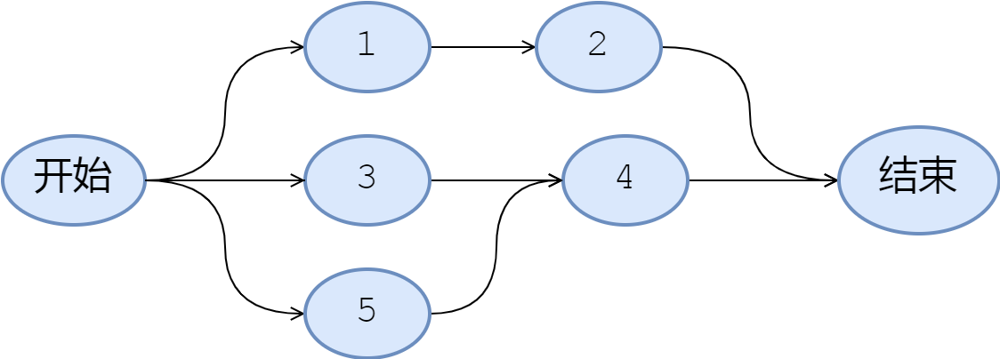
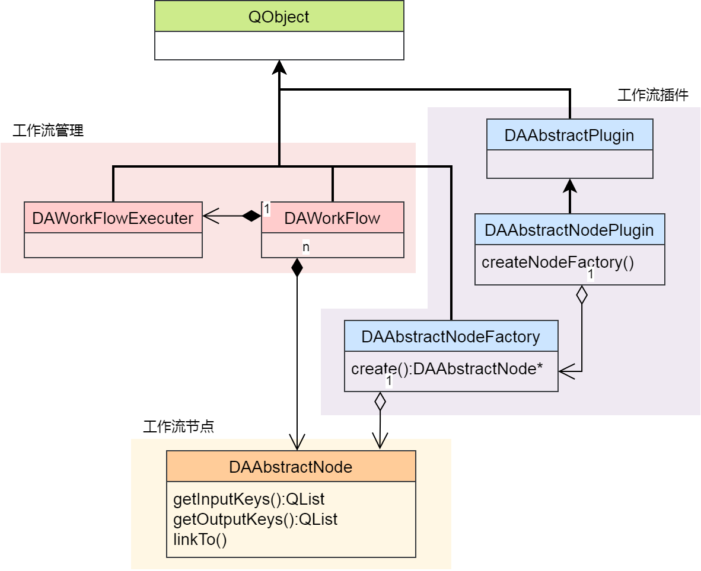
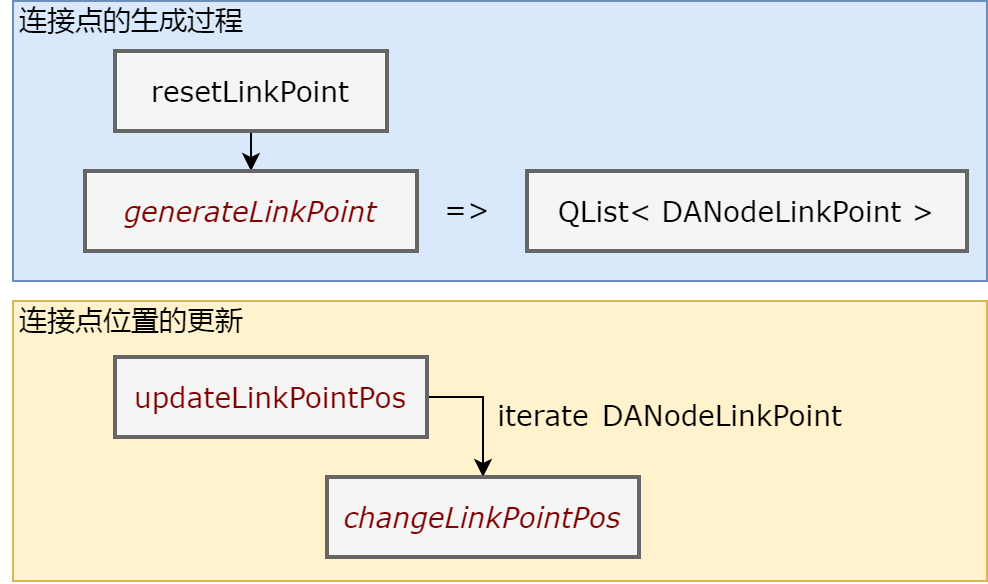
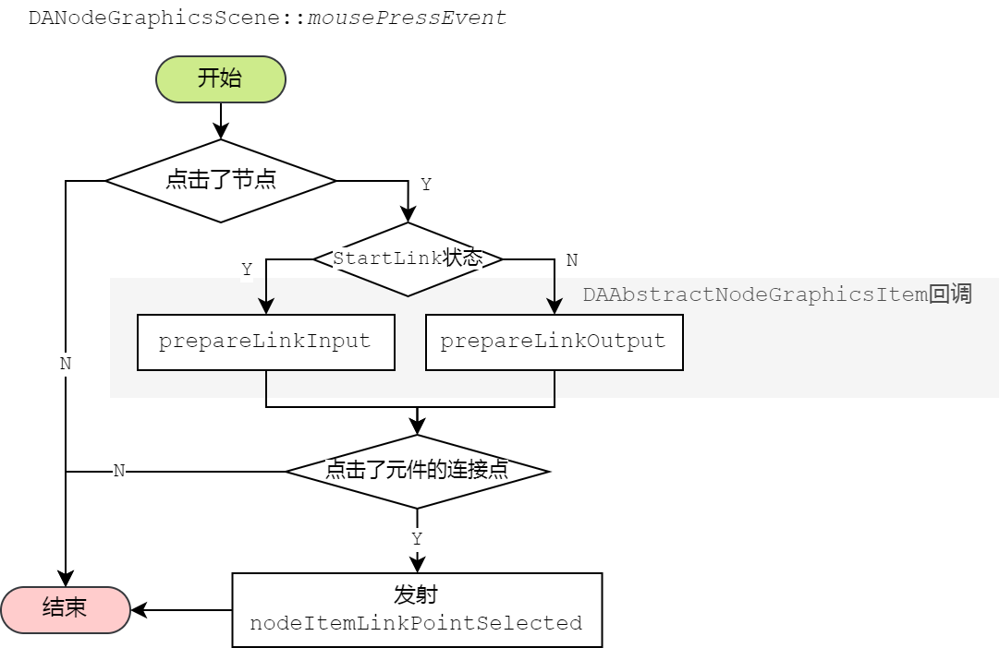

一个普通的工作流如下所示



普通的工作流是一个有向图，出度和入度没有名字属性，只有数量属性（如上图节点4有2个入度），这种工作流非常适合处理事务，尤其适合进行一些网络业务的处理，许多大规模事件处理框架都是基于此类工作流

但针对一些相对复杂的情景，工作流中的节点要具体化，节点不仅仅代表一个事务，而是一个带有参数的函数，那么节点的入度和出度就需要有名字属性，如下图所示


而本程序的workflow就是这种出入度带有名字属性的工作流

# 工作流模块`DAWorkFlow`

工作流主要的类有3个，为`DAWorkFlow`、`DAAbstractNodeFactory`和`DAAbstractNode`，`DAWorkFlow`负责整个工作流图的组织，`DAAbstractNode`为每个工作流的节点，节点的生成通过`DAAbstractNodeFactory`

另外还有`DAWorkFlowExecuter`负责工作流的执行，这几个类的UML图如下图所示：



插件库提供了`DAAbstractNodePlugin`插件，负责管理工作流的节点

## 节点元数据`DANodeMetaData`

工作流的每个节点都有一个唯一的元数据，`DAAbstractNodeFactory`通过元数据生产出对应的节点

节点元数据描述了节点的固定信息，如节点名称、节点图标、节点描述等，最核心的是节点原型(Node Prototype),通过此信息区分每个不同的节点，因此，自定义节点需要提供一个不会和其他节点重复的原型(Node Prototype)信息

## 节点

节点`DAAbstractNode`包含了如下信息：

- 元数据`DANodeMetaData`
- 入度（入口）和出度（出口）信息（名称，数量）
- 入度出度对应的数据
- 入度节点和出度节点
- 一个唯一id

通过上述信息基本可描述一个有向图结构，而`DAWorkFlow`就是用于管理和生成这个有向图

## 生成节点

每个节点对应一个`DAAbstractNode`类，每个节点内部保留着它的`MetaData`,而节点的创建是通过`DAAbstractNodeFactory`来实现的，`DAWorkFlow`负责节点的管理

生成一个节点的方式可以通过`DAWorkFlow`生成也可以通过`DANodeGraphicsScene`生成:

- `DAWorkFlow::createNode`
- `DANodeGraphicsScene::createNode`
- `DANodeGraphicsScene::createNode_`

`DAWorkFlow`只会生成节点，`DANodeGraphicsScene`可以把节点和和图元一起生成，同时`DANodeGraphicsScene`还提供了`createNode`和`createNode_`函数，在data-work-flow中，所有带xxx_函数一般是表示可支持redo/undo的函数

通过上面的函数，只要传入`DANodeMetaData`即可生成对应的节点

节点生成过程实际是调用了工作流中的节点工厂，其生成过程如下：


## 连接点

你可以把节点理解为一个函数，输入节点是函数的输入参数，输出节点是函数的返回参数

在工作流中，节点的链接点是一个名字，`DAAbstractNode::getInputKeys`用来获取输入的连接点，`DAAbstractNode::getOutputKeys`用来获取输出的连接点

连接点携带的参数统一通过`QVariant`携带，你可以通过`DAAbstractNode::getInputData`和`DAAbstractNode::getOutputData`获取输入或输出连接点的数据

连接点是可以动态添加和删除的，通过`DAAbstractNode::addInputKey`/`DAAbstractNode::addOutputKey`可以对连接点进行添加，通过`DAAbstractNode::removeInputKey`/`DAAbstractNode::removeOutputKey`可以对连接点进行删除


# 工作流渲染

工作流的渲染绘制通过`DANodeGraphicsScene`配合`DAAbstractNodeGraphicsItem`完成，`DAWorkFlow`的渲染依赖`DAGraphicsView`库，`DAGraphicsView`库提供了可缩放图元及redo/undo的集成

工作流渲染相关的关键类如下：

- `DANodeGraphicsScene`：负责场景的管理
- `DAAbstractNodeGraphicsItem`：每个节点在场景的渲染
- `DAAbstractNodeLinkGraphicsItem`：节点之间连接线的渲染
- `DANodeLinkPoint`：节点连接点的渲染

## 场景和工作流的关系

工作流场景包含工作流，场景设置了工作流后，可执行工作流的操作，这时场景相当于工作流的wrapper，但场景具有对工作流的渲染功能，如果类比为MVC架构，工作流相当于是Model，场景这是Control和view层


`DANodeGraphicsScene`必须设置工作流后才能正常工作：`DANodeGraphicsScene::setWorkFlow`

## 节点的显示

节点`DAAbstractNode`类提供纯虚函数`createGraphicsItem`接口，用于生图元：

```cpp
//节点对应的item显示接口，所有node都需要提供一个供前端的显示接口
virtual DAAbstractNodeGraphicsItem* createGraphicsItem() = 0;
```

通过此函数返回一个`DAAbstractNodeGraphicsItem`对象，`DAAbstractNodeGraphicsItem`对象负责节点在画布（`DANodeGraphicsScene`）上的显示

`DAAbstractNodeGraphicsItem`内部维护了`DAAbstractNode`的weak point,通过`DAAbstractNodeGraphicsItem::node`函数可以获取节点的指针实例，如果节点已经删除，将获取空的节点指针

节点渲染第一步是调用`DAAbstractNode::createGraphicsItem`生成`DAAbstractNodeGraphicsItem`，并把它添加到场景中

场景中的操作会反应到工作流和ui中，因此，在GUI层面，直接操作场景可实现工作流的读写也可以同步实现渲染

`DANodeGraphicsScene`提供了`DANodeGraphicsScene::createNode`函数可以创建节点，此函数会先调用`DAWorkFlow::createNode`，然后通过创建的node，调用`DAAbstractNode::createGraphicsItem`接口，获取节点对应的item，并把生成的item返回，此时就完成了节点的生成和渲染

节点在场景中包含了位置坐标，渲染方式，但实际上，对于一个有向图来说，节点是不存在这些信息，一个工作流图仅仅包含关系属性

## 节点连接点的绘制

连接点由`DANodeLinkPoint`来描述，主要包含4个信息：

```cpp
class DAWORKFLOW_API DANodeLinkPoint
{
public:
    QPointF position;     ///< 连接点相对DAAbstractNodeGraphicsItem的位置
    QString name;         ///< 连接点名字
    Way way;              ///< 连接点的属性，是输入还是输出
    Direction direction;  ///< 连接点引线的伸出方向（用于绘制连线的时候指定方向）
    ......
```

`DAAbstractNodeGraphicsItem`的`generateLinkPoint`函数负责生成`DANodeLinkPoint`，此函数是虚函数，用户可以自定义改变连接点的信息，`DAAbstractNodeGraphicsItem`在构造时会调用`resetLinkPoint`函数，`resetLinkPoint`函数内部会调用`generateLinkPoint`生成连接点信息

正常连接点信息生成完成就不会发生变化，但如果节点图元缩放时，需要更新连接点的位置信息，需要通过`DAAbstractNodeGraphicsItem::updateLinkPointPos`函数进行位置信息的更新，此函数会遍历每个连接点，并调用`DAAbstractNodeGraphicsItem::changeLinkPointPos`函数，对每个连接点进行重新设置

```cpp
//更新连接点，传入已有的连接点和总体尺寸，通过此函数的重写可以改变连接点的位置，如果想改变连接点的绘制应该通过setLinkPointDrawDelegate实现
virtual void changeLinkPointPos(QList< DANodeLinkPoint >& lps, const QRectF& bodyRect) const;
```

`DAAbstractNodeGraphicsItem::changeLinkPointPos`是虚函数，用户如果有自己设置连接点位置的方式可以重载此函数

连接点的生成到更新的相关函数关系如下：



`DAAbstractNodeGraphicsItem`已经继承了节点连接点的绘制，如果要绘制自己的连接点，可注入`DANodeLinkPointDrawDelegate`

节点连接点的绘制主要通过`DAAbstractNodeGraphicsItem`的成员函数`paintLinkPoints`实现：
```cpp
void paintLinkPoints(QPainter* painter, const QStyleOptionGraphicsItem* option, QWidget* widget);
```

注意，`paintLinkPoints`函数并非虚函数，因此，若想更改连接点的绘制，可通过`setLinkPointDrawDelegate`来设置绘制代理实行连接点的自定义绘制

```cpp
void setLinkPointDrawDelegate(DANodeLinkPointDrawDelegate* delegate);
```

`DAWorkFlow`库已经提供了`DAStandardNode***GraphicsItem`相关的图元，用户无需关注过多的连接点重绘即可快速实现自己的图元绘制

## 连接线的绘制

连接线实际上也是一个图元，由`DAAbstractNodeLinkGraphicsItem`负责绘制，实际上用户并不需要关心连接线是如何绘制的

连接线提供了几种绘制方案，通过`DAAbstractNodeLinkGraphicsItem::LinkLineStyle`枚举：

```cpp
/**
* @brief 连接点的样式
*/
enum LinkLineStyle
{
    LinkLineBezier,    ///< 贝塞尔曲线连接
    LinkLineStraight,  ///< 直线连接
    LinkLineKnuckle    ///< 肘形连接（直角）
};
```

通过`void setLinkLineStyle(LinkLineStyle s)`函数即可实现连接线绘制的改变

## 节点连接过程

连接线连接过程主要由`DANodeGraphicsScene`触发和管理，`DANodeGraphicsScene`的`mousePressEvent`对每次鼠标的点击会进行如下判断:

- 判断是否点击到了节点
- 判断当前的StartLink状态，如果是非开始连接状态调用`DAAbstractNodeGraphicsItem::prepareLinkInput`回调，如果是开始连接状态，掉用`DAAbstractNodeGraphicsItem::prepareLinkOutput`回调
- 判断是否点击到连接点
- 如果点击到连接点，发射`DANodeGraphicsScene::nodeItemLinkPointSelected`信号

其流程图如下



`DANodeGraphicsScene`内部绑定了`nodeItemLinkPointSelected`信号的槽函数，具体连接线的建立在此槽函数中实现，具体流程如下图所示，这里不再描述


prepareLinkInput和prepareLinkOutput的回调针对大部分情况是不需要实现的，这两个回调主要是针对一些不确定连接点的情况，连接点不是固定的，只有点击节点时才能判断是否应该存在连接点，这时候就可以重载这两个回调函数来动态生成连接点

# 工作流执行

工作流通过`DAWorkFlowExecuter`执行，每次执行都会生成一个`DAWorkFlowExecuter`并把它转移到线程中执行,`DAWorkFlowExecuter`继承于`QObject`,这里线程调用使用QObject的moveToThread方法，把`DAWorkFlowExecuter`转移到线程中执行

```cpp
/**
 * @brief 创建执行器
 */
void DAWorkFlowPrivate::createExecuter()
{
    if (_executerThread) {
        _executerThread->quit();  // quit会触发finished，从而进行内存清除
    }
    _executerThread = new QThread();
    _executer       = new DA::DAWorkFlowExecuter();
    //设置开始节点
    _executer->setStartNode(_startNode.lock());
    _executer->setWorkFlow(q_ptr);
    _executer->moveToThread(_executerThread);
    QObject::connect(_executerThread, &QThread::finished, _executer, &QObject::deleteLater);
    QObject::connect(_executerThread, &QThread::finished, _executerThread, &QObject::deleteLater);
    //
    QObject::connect(q_ptr, &DAWorkFlow::startExecute, _executer, &DA::DAWorkFlowExecuter::startExecute);
    QObject::connect(_executer, &DA::DAWorkFlowExecuter::nodeExecuteFinished, q_ptr, &DAWorkFlow::nodeExecuteFinished);
    QObject::connect(_executer, &DA::DAWorkFlowExecuter::finished, q_ptr, &DAWorkFlow::onExecuteFinished);
    _executerThread->start();
}
```

在工作流执行和结束前，可以注册执行和结束的回调函数

```cpp
//DAWorkFlow
public:
    using CallbackPrepareStartExecute = std::function< bool(DAWorkFlowExecuter*) >;
    using CallbackPrepareEndExecute   = std::function< bool(DAWorkFlowExecuter*) >;
    //注册开始执行的回调
    void registStartWorkflowCallback(CallbackPrepareStartExecute fn);
    //注册开始结束的回调
    void registEndWorkflowCallback(CallbackPrepareEndExecute fn);
```

这两个回调函数都会在线程中执行，因此务必注意，**注册的回调函数不要进行界面的操作**，否则会导致程序崩溃

工作流在执行的时候会涉及到3个信号：

```cpp
//DAWorkFlow
/**
* @brief 开始执行，exec函数调用后会触发此信号
*/
void startExecute();

/**
* @brief 执行到某个节点发射的信号
* @param n
*/
void nodeExecuteFinished(DAAbstractNode::SharedPointer n, bool state);

/**
* @brief 工作流执行完毕信号
* @param success 成功全部执行完成为true
*/
void finished(bool success);
```

`finished`信号可以判断工作流是否执行成功