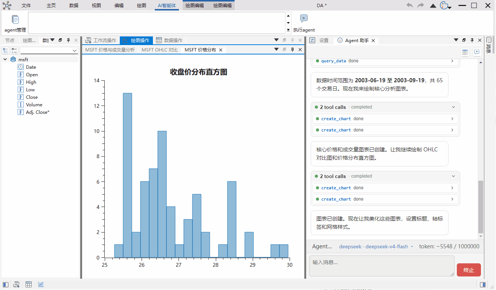
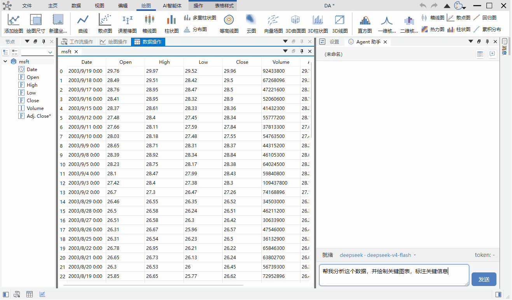
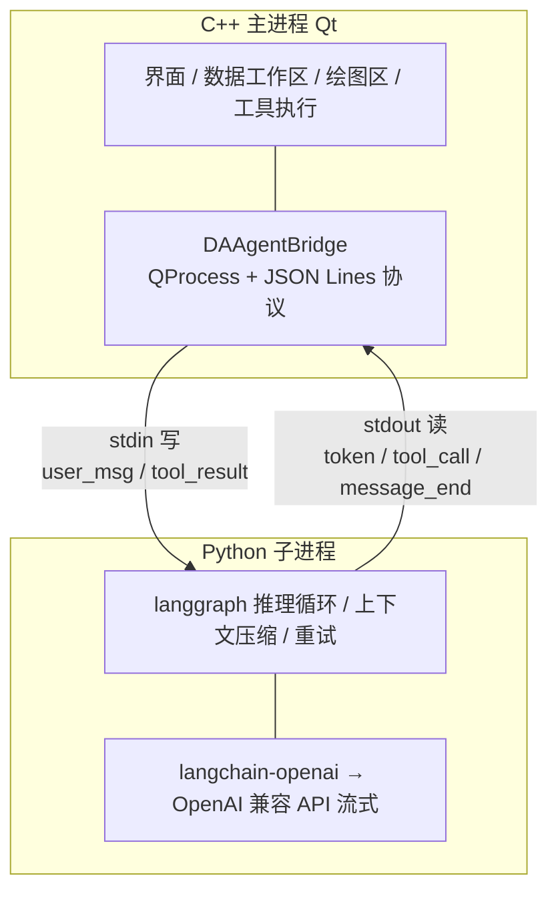
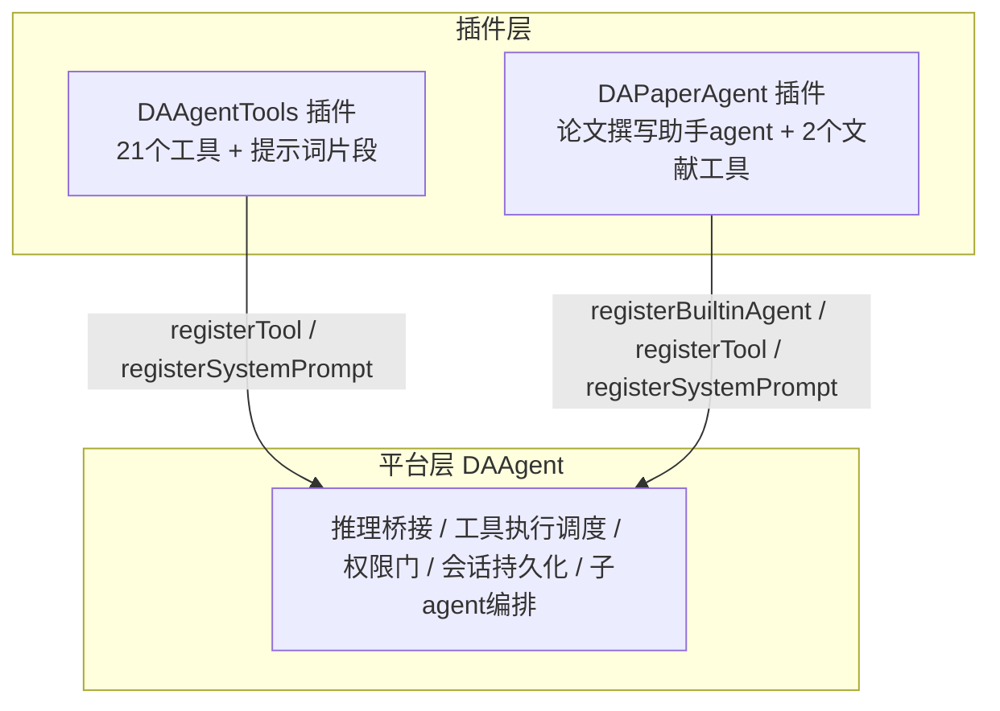

# 给C++写的工业软件搭建 Agent

这篇文章介绍如何给C++/Qt写的软件搭建自身的agent，让agent直接操控软件干活，不是skill/mcp，也不需要软件提供cli，尤其适合工业软件加入agent时参考

这篇文章基于我维护的一个开源的工作流和数据分析软件，项目地址：[github:data-workbench](https://github.com/czyt1988/data-workbench)，国内镜像：[gitee:data-workbench](https://gitee.com/czyt1988/data-workbench)

data-workbench 是我维护的一个数据分析软件，C++17 加 Qt 写界面层，内嵌 Python 跑 pandas 和 numpy，主要给科研实验数据做清洗、分析、绘图，内嵌工作流，可以执行一些固有数据分析任务。最近这段时间我给它补上了 Agent 功能，通过内部agent对话直接操作软件自身功能，可以查数据、让ai画图、画完的图用户自己可以手动调整，可以生成分析报告等等。

agent 分析数据自动出报告的效果。



agent 自动绘图的效果。



整个过程里我手写的代码很少。真正干活的是 zcode、kimi code、qwen code、deepseek 这几个 coding agent（我穿插着用），模型主力是 glm-5.2，中间还体验过 qwen3.8-plus、deepseek-v4-flash，前前后后差不多两亿 token 就可以搭建一个相对完备的agent，花费也就几百块钱而已，后续就是工具的调整和完善。

这篇文章主要基于 `data-workbench` 这个C++项目，介绍如何让 AI 替你在你的某个项目中加入agent功能。最后会提供一组提示词，通过这组提示词即可让ai基于你的项目搭建出一个agent，目前我已经在其它项目测试过，无论是java写的还是c#写的项目都可以很轻松地搭建

## Agent

我对 `Agent` 的理解，核心就是行动循环和提示词注入。agent就是在调模型，解析它想调什么工具，执行，把结果塞回消息列表，再调模型，直到它认为完成。实际就一个while循环，内部一直调模型直至结束。各种 `Agent` 框架，`langgraph` 也好自己手写也好，都是在给这个循环加工程保障。

现在能控制大模型的只有文本，因此，无论skill还是mcp，对模型而言最终都是提示词的一种注入。大模型是无状态的，实际开发agent你会发现每次请求都是一个大大的json，把所有会话拼接起来，让大模型能“知道”之前的对话信息，你可以塞入之前的对话，你也可以加入其它的东西，例如Agents.md的内容

一个Agent核心是提供的工具，尤其是垂直领域Agent，例如工业软件，你提供了什么工具，就决定了Agent能操作软件的哪些功能。这里会面临一个问题，软件的功能非常多的时候，尤其是工业软件，可能会要暴露非常多的工具，这是后续需要解决的问题

工具包含两段内容，一段是 JSON Schema，告诉模型有哪些功能、参数是什么。另一段是执行器，模型要调用时，程序去执行，把结果作为一条消息返回。

目前data-workbench提供了 23 个C++工具（DAAgentTools插件21个 + DAPaperAgent插件2个），工具的执行是C++端执行的，且工具全部通过插件注入，可以自由扩展——插件化注入机制后面单独一节细讲

### data-workbench中增加agent的架构和方法

data-workbench 是桌面软件，C++ 生态里没有趁手的 agent 框架，生态最丰富的是Python，data-workbench 选用的是Python的`langgraph`,把Agent的推理循环、上下文管理、重试、子 agent 编排，全部跑在一个 Python 子进程里。工具执行全部留在 C++ 主进程。两边用 stdin/stdout 管道通信，一行一条 JSON。



这种架构和开发语言无关，无论你是c/c++、c#、java写的应用都可以简单快速实现，唯一劣势是打包时要带个python环境（data-workbench本来就内嵌Python跑pandas，子进程直接复用这套环境，连这个劣势也不存在）

工具执行留在 C++ 是因为本身就是要让agent操作软件自身，因此工具都是你要改造的软件本身来执行。LLM 那边只拿到工具 schema，真正执行时经管道 RPC 回调到主进程，直接就是当前软件界面上的真实对象。这是工业软件做 agent 最舒服的一点，你的工具层就是你的业务层，中间不需要任何胶水。

推理放子进程也是更好的隔离。LLM 思考过程不会影响GUI线程，就算 Python 子进程崩了，主程序还活着，桥接层检测到异常退出会自动重启它，从磁盘上的会话记录恢复历史，重发最后一条用户消息，用户最多感觉到思考时间变长而已

目前 data-workbench 使用的协议本身很简单。C++ 往 stdin 写 user_msg、tool_result、load_session、reconfigure 这些，Python 往 stdout 写 token、tool_call、message_end、usage、error 等。stdout 只许走协议，日志全部走 stderr

聊天面板一定得使用web技术，否则很丑陋，因为你要不停对markdown进行流式渲染，web技术是目前唯一解，data-workbench是C++写的GUI，聊天面板用 QWebEngine 加 QWebChannel 和一个内嵌的web聊天界面通讯。具体实现还做了很多工程化的处理，想了解可以通过源码查看

### 实际开发agent需要考虑的点

实际上让agent搭建agent很快就能完成，但细节的调教是很花费时间的。给data-workbench嵌入agent功能只用了2天（当时用的qwen code + glm-5.2），从web界面、跨进程通信、行动循环到工具封装，几轮任务就完成得很好，但后续实际调试中会遇到很多细节问题需要逐一调整。

- 重连和容错

这点非常关键，大模型会有各种可能返回的异常问题，例如没钱了，例如请求太多受限了，这些都是实际工程问题，往往第一遍ai给你写的时候是会忽略的问题，需要后续测试补充上

- 上下文压缩和管理

在agent功能跑通后，上下文的管理很关键，其中压缩是一个关键点，ai接口是无记忆状态的，让用户感觉到有记忆完全取决于你的上下文怎么拼接，而上下文的拼接都是由客户端来决定的，同时还会涉及到压缩问题，什么时候开始压缩，怎么压缩都比较有讲究，这些最好的思路就是参考当前开源的agent

- 防循环卡死

agent 有时会反复调用同一个工具，同样的参数，一遍一遍，安安静静把 token 烧光。这也是工程性问题，初次开发agent非常容易忽略

## 插件化注入：平台归平台，领域归领域

data-workbench的agent能力分两层。平台层是DAAgent模块，只做和领域无关的事：推理桥接、工具执行调度、权限门、会话持久化、子agent编排。领域能力一个字都不写在平台里，全部经插件注入。

DAAgentInterface开了四个注入口：

| 注入口 | 注入什么 | 例子 |
|--------|---------|------|
| `registerTool` | 单个工具（schema + 执行器） | 数据查询、建图加曲线 |
| `registerSystemPrompt` | 一段命名的系统提示词片段 | 图表引用规范 |
| `registerBuiltinAgent` | 一整个领域agent（提示词 + 配套工具） | 论文撰写助手 |
| `registerBuiltinSubagent` | 一个子agent定义 | 领域调研助手 |



两个真实例子。DAAgentTools插件注入21个工具：数据类（list_data、query_data、get_column_stats等5个）、绘图类（create_chart、add_curve、set_axis等11个）、文件报告类3个、脚本执行类2个，外加一段系统提示词，教agent怎么在data-workbench里引用图表。DAPaperAgent插件注入的是一个完整agent——"论文撰写助手"：六阶段论文写作流程的提示词用qrc内嵌，外加search_literature、verify_doi两个文献工具。插件装进plugins目录，平台上就多了一个会写论文的agent，主程序一行代码不用改。

这么做的好处有三个。第一，领域团队不碰主程序。想给软件加个"疲劳寿命分析agent"，写一个插件即可，工具、提示词、agent定义全在插件里，热插拔。第二，工具就在C++主进程内执行，工具层就是业务层，直接操作内存里的DataFrame和图表对象，没有序列化开销，没有RPC胶水，这是MCP/skill这类体外方案做不到的。第三，插件注入的工具再自由，执行时也统一过平台的权限门（yolo/auto/manual三模式、危险度五级裁决），能力可扩展，安全底线不破。

一个细节值得说：插件注入的内置提示词是"仅当不存在时写入，尊重用户编辑"。首次加载，插件把提示词写进本地提示词库；之后用户可以在提示词管理界面随便改，下次启动插件不会覆盖。内置只给起点，用户定制说了算。

工业软件功能多，工具一多就是`工具爆炸`，模型选错、调不准。data-workbench给的第一步答案是子agent：子agent的工具白名单是收窄的，主agent手里只留调度类和通用工具，通过dispatch_subagents把任务派给只带本领域工具的子agent，多个子agent还能并行调研。模型某一时刻面对的工具数量降下来了，长对话下的调用准确率才稳得住。

## 怎么让 AI 替你把 agent 造出来

前面说过，这套带权限、带子 agent、带会话管理、可以直接操作软件自身的agent功能，我没有手写多少代码，干活的还是那几个 coding agent。这一节讲讲具体的做法

你首先需要了解一个完整的 agent 由哪些能力组成，并不需要一次全做，但得知道每一项的存在和它解决的问题，在完成框架搭建后一步一步补充即可

| 能力 | 解决什么问题 | 必要性 |
|------|------------|--------|
| 推理循环 | 调 LLM、解析 tool_calls、执行、回传、继续 | 必要 |
| 工具系统 | 声明式工具 + JSON Schema + 注册执行 | 必要 |
| 通信与隔离 | 推理不阻塞主程序，双向流式协议 | 必要 |
| 对话 UI | markdown 渲染、工具调用折叠、双向桥接 | 必要 |
| 人机交互 HITL | agent 能在对话流里向用户提问，回答后继续 | 必要 |
| 系统提示词 | 分段拼接、运行时注入、防注入转义 | 必要 |
| 配置与安全 | LLM 配置、连接测试、apikey凭据加密 | 必要 |
| 上下文管理 | token 估算、阈值压缩、摘要重组历史 | 必要 |
| 循环防卡死 | 最大步数、循环检测、配对兜底 | 必要 |
| 重试与恢复 | 429、断网、限流下退避重试 | 必要 |
| 会话管理 | 多会话、持久化、崩溃后恢复 | 按需 |
| 权限系统 | 每工具允许/询问/拒绝、路径保护 | 按需 |
| 子 agent 调度 | 派发独立子任务、收窄工具与权限 | 按需 |
| skill支持 | 让agent支持自定义skill | 按需 |
| mcp支持 | 让agent支持mcp协议 | 按需 |
| 记忆 | 让agent自我总结记忆 | 按需 |

agent 是个大工程，可以通过下面提示词让一个code agent基于你自身的系统制定一个计划，有经验的架构师好好审查该计划进行完善，再让ai执行，这里建议使用grill me技能，让ai先制定完善的方案，再执行

```markdown
 为 {平台名} 新增 AI Agent 能力，让用户在 {使用场景} 通过自然语言对话，调用大模型对 {数据} 进行 {分析、可视化、报告生成等能力}。

 第一步，识别我当前系统的技术架构和现有能力。桌面端还是 Web 端、什么框架、什么构建系统、现有的数据与可视化能力如何，据此选择与之匹配的隔离方式、通信方式、渲染方式。下面每条都是平台中立的设计要求，只说目标与原因，具体机制由你按我当前架构选，在计划里说明理由，与我的架构冲突先和我确认。

 一、推理与宿主隔离。LLM 推理、API 调用、工具编排放在不阻塞主程序的执行单元里，桌面端就是子进程或独立线程。不使用时零开销，执行单元出问题主程序要能恢复到可用状态。

 二、框架与 LLM 接入。选一个原生支持「向用户提问、用户选择后继续推理」的 agent 框架，Python 后端 LangGraph 是成熟候选，其它栈给出两三个候选和取舍。LLM 走 OpenAI 兼容 API 加流式，做 provider 抽象，不绑死任何一家 SDK。

 三、流式输出。逐 token 到 UI，chunk 里的 tool_call 按 index 累积拼接，不能逐 chunk 当完整参数。渲染增量追加并做防抖，工具调用和结果在对话流里折叠展示。

 四、人机交互。提问直接出现在对话流里，不弹模态窗，用户选择后答案回传继续推理，支持多轮提问。

 五、工具体系。统一接口，例如：getToolSpec 返回 JSON Schema，execute 返回 JSON 结果。注意大数据集返回摘要而非全量，失败返回 success false 不抛异常，带超时。

 六、系统提示词分段拼装，平台基础加领域扩展加工具规格自动注入，外部注入的内容转义后再拼，防 prompt 注入。

 七、分层架构。通用能力做平台模块，领域能力经注册注入，不把领域逻辑写进通用模块。

 八、配置与安全。api key 加密存储，不写日志不打控制台。文件工具限制在工作目录，路径词法规范化防越界，拒绝敏感文件。

 九、错误处理。每个 tool.call 必须有配对的 tool.result，中断、超时、取消都要合成错误结果兜底，否则下一轮请求会被 provider 拒绝，对话卡死。

 十、分阶段交付，每阶段可独立验证。先模块骨架，再核心循环，再对话 UI，再生命周期，再内置工具，再设置页。每阶段实现前先给我看设计，确认后再做。
```

总之，计划阶段别省

计划批准后按阶段推进。实施阶段每一段提示词的套路都一样：先让 AI 识别你现在的代码结构和数据流，再给设计要求，最后带验收标准。上面这段是制定计划用的，各实施阶段的提示词照这个套路写即可。

雏形出来后，再逐步增加相关的功能，如上面能力地图提到的**上下文管理** 、**循环防卡死**、**重试与恢复**、**权限**、**子 agent**等等功能。


## 结语

data-workbench 的 Agent 功能全部开源了。仓库在 [github.com/czyt1988/data-workbench](https://github.com/czyt1988/data-workbench)，文档在 [czyt1988.github.io/data-workbench](https://czyt1988.github.io/data-workbench/)。支持任意 OpenAI 兼容 API

工业软件搭 agent 并不难。工业软件功能非常多，按现有思路搭建会面临`工具爆炸`问题：一个大型软件要给agent暴露非常多的工具。data-workbench目前的答案是子agent加工具白名单收窄——主agent只留调度类和通用工具，领域工具下沉给子agent，模型某一时刻面对的工具数量降下来了。上百个工具对当前大模型来说不至于失控，但长对话后是否还能准确调用如此多工具依然有待验证，这条路能走多远也需要更多实践检验

