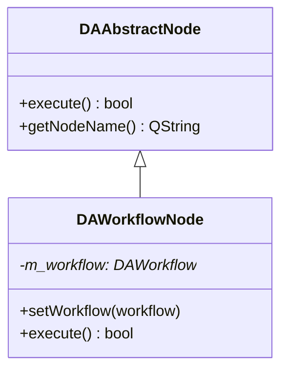
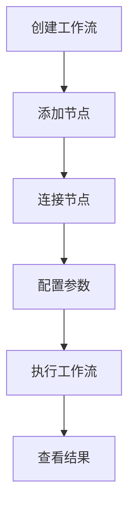
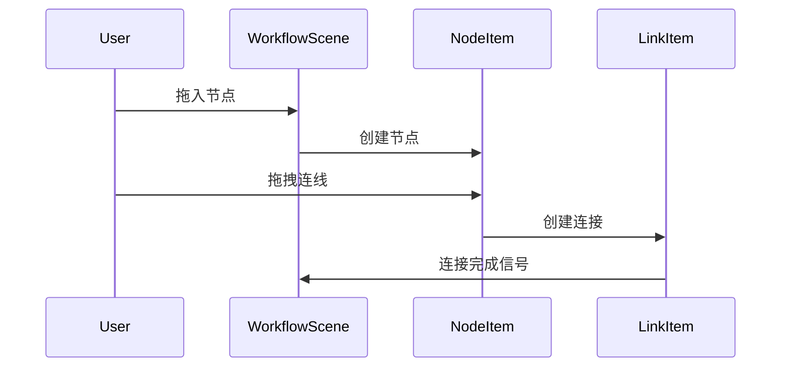

# DAWorkBench 文档撰写规范手册

本规范用于指导 DAWorkBench 项目中文文档的撰写，确保文档风格统一、内容完整、易于理解。

项目文档使用 mkdocs 组织，采用 [mkdocs-material](https://squidfunk.github.io/mkdocs-material/getting-started/) 主题。文档绘图优先考虑 `mermaid`。

## 文档结构规范

### 1. 标题层级

```markdown
# 模块名称/功能名称
## 主要功能特性
## 基本概念
## 使用方法
### 子功能模块
#### 具体功能点
## API 参考
## 注意事项
## 参考资料
```

### 2. 必备章节

每个功能文档应包含以下章节：

| 章节 | 必备程度 | 说明 |
|------|----------|------|
| 功能概述 | 必备 | 开头一句话说明模块用途和特点 |
| 主要功能特性 | 必备 | 列举核心功能，使用 ✅ 标记 |
| 使用方法 | 必备 | 详细使用步骤和代码示例 |
| API 参考 | 推荐 | 核心类、方法、属性的表格说明 |
| 注意事项 | 推荐 | 使用 `!!!` 格式标注重要信息 |
| 参考资料 | 可选 | 相关文档、示例路径链接 |

## 内容撰写原则

### 1. 文字说明要求

- **每个代码块前后必须有文字说明**：解释代码作用、关键步骤、输出效果
- **避免纯代码堆砌**：文字说明应占文档主体 60% 以上
- **逐步引导**：按照"是什么 → 为什么 → 怎么用"的逻辑顺序组织

### 2. 功能介绍格式

使用功能列表形式，每项功能前加 ✅ 标记：

```markdown
**特性**

- ✅ **功能名称**：简要说明
- ✅ **另一功能**：简要说明
```

### 3. 代码示例规范

代码示例必须包含：

1. **注释说明**：关键行必须有中文注释
2. **完整可运行**：示例代码应可直接编译运行
3. **效果说明**：代码后说明运行效果

```cpp
// 创建工作流节点
DAWorkflowNode* node = new DAWorkflowNode("数据处理");
node->setNodeType(DAWorkflowNode::DataProcess);  // 设置节点类型

// 添加输入输出端口
node->addInputPort("data_in", "输入数据");
node->addOutputPort("data_out", "输出数据");

// 效果：创建一个带输入输出端口的数据处理节点
```

### 4. 概念解释要求

对于复杂概念，使用以下方式辅助说明：

- **mermaid UML图**：展示类关系、继承结构
- **mermaid 流程图**：展示工作流程、数据流
- **mermaid 时序图**：展示交互过程
- **配图**：实际效果截图

### 5. 注意事项格式

使用 mkdocs-material 扩展语法标注重要信息：

```markdown
!!! warning "重要警告"
    可能导致严重问题的注意事项

!!! info "说明"
    补充说明信息

!!! tip "技巧"
    使用技巧和建议

!!! example "示例"
    示例代码路径：`examples/xxx`

!!! bug "已知问题"
    已知缺陷和规避方法

!!! note "Qt版本兼容性"
    Qt5 和 Qt6 的差异说明
```

### 6. 属性/方法说明格式

表格形式展示核心属性和方法：

```markdown
### 核心方法

| 方法 | 参数 | 返回值 | 说明 |
|------|------|--------|------|
| `setWorkflow(workflow)` | DAWorkflow* | void | 设置当前工作流 |
| `execute()` | 无 | bool | 执行工作流 |

### 核心属性

| 属性 | 类型 | 说明 |
|------|------|------|
| `workflowName` | QString | 工作流名称 |
| `modified` | bool | 是否已修改 |
```

## 图表使用规范

### 1. mermaid 类图

用于展示类的继承关系、组合关系：



### 2. mermaid 流程图

用于展示使用流程、工作流程：



### 3. mermaid 时序图

用于展示模块间交互、信号槽连接：



### 4. 效果截图

实际运行效果图片放在 `docs/assets/` 目录：

```markdown

```

效果截图前应说明对应的示例位置：

```markdown
工作流的示例位于 `examples/workflow/basic`，效果截图如下：


```

## mkdocs-material 语法

### 1. Admonition 格式

```markdown
!!! type "标题"
    内容内容内容
```

支持的类型：
- `note` - 备注
- `info` - 信息
- `tip` - 技巧
- `warning` - 警告
- `danger` - 危险
- `bug` - 已知问题
- `example` - 示例
- `quote` - 引用

### 2. 代码高亮

```markdown
```cpp
// C++ 代码
```

```python
# Python 代码
```

```cmake
# CMake 代码
```
```

### 3. 脚注

```markdown
这是一个脚注引用[^1]。

[^1]: 这是脚注内容。
```

### 4. 任务列表

```markdown
- [x] 已完成
- [ ] 未完成
```

## DAWorkBench 特有标准

### 1. 模块文档模板

每个模块文档应包含以下结构：

```markdown
# 模块名称

模块功能简要说明。

## 主要功能特性

**特性**

- ✅ **功能1**：说明
- ✅ **功能2**：说明

## 模块架构

### 类关系图

\`\`\`mermaid
classDiagram
    [类图]
\`\`\`

### 模块依赖

[说明模块间的依赖关系]

## 使用方法

### 基本使用

[代码示例和说明]

### 进阶配置

[配置选项说明]

## API 参考

[核心类、方法、属性表格]

## 注意事项

!!! warning "重要"
    重要提示信息

!!! note "Qt版本兼容性"
    Qt5/Qt6 差异说明
```

### 2. Qt 信号槽描述规范

描述信号槽时使用以下格式：

```markdown
### 信号

| 信号 | 参数 | 触发时机 |
|------|------|----------|
| `dataChanged()` | 无 | 数据发生变化时 |
| `nodeAdded(node)` | DAAbstractNode* | 添加节点时 |

### 槽函数

| 槽函数 | 参数 | 说明 |
|--------|------|------|
| `refreshData()` | 无 | 刷新数据显示 |
```

### 3. CMake 配置示例格式

```cmake
# 添加模块依赖
find_package(Qt6 REQUIRED COMPONENTS Core Widgets)

# 添加源文件
set(SOURCES
    src/main.cpp
    src/workflow.cpp
)

# 创建库
add_library(DAWorkflow ${SOURCES})
target_link_libraries(DAWorkflow
    PRIVATE
        Qt6::Core
        Qt6::Widgets
)
```

### 4. 版本兼容性说明格式

```cpp
#if QT_VERSION < QT_VERSION_CHECK(6, 0, 0)
    // Qt5 的实现
    QRegExp rx(pattern);
#else
    // Qt6 的实现
    QRegularExpression rx(pattern);
#endif
```

版本兼容性说明框：

```markdown
!!! note "Qt版本兼容性"
    此功能在 Qt5 和 Qt6 中实现方式不同：
    
    - **Qt5**: 使用 QRegExp
    - **Qt6**: 使用 QRegularExpression
```

### 5. PIMPL 模式说明格式

```markdown
### PIMPL 模式

本类使用 PIMPL（Pointer to Implementation）模式，相关宏定义：

| 宏 | 用途 |
|-----|------|
| `DA_DECLARE_PRIVATE` | 在类中声明私有数据指针 |
| `DA_DECLARE_PUBLIC` | 在 PrivateData 中声明公有类指针 |
| `DA_PIMPL_CONSTRUCT` | 在构造函数中初始化 PIMPL |
| `DA_D` | 获取私有数据指针 |
| `DA_DC` | 获取私有数据 const 指针 |
```

## 术语规范表

| 英文术语 | 中文翻译 | 说明 |
|----------|----------|------|
| Workflow | 工作流 | 有向图描述的数据处理流程 |
| Node | 节点 | 工作流中的处理单元 |
| Link | 连接 | 节点之间的数据连接 |
| Port | 端口 | 节点的输入输出接口 |
| Plugin | 插件 | 扩展模块 |
| Data Series | 数据序列 | 一组相关数据 |
| Figure | 图表 | 可视化图表 |
| Plot | 绑图 | 绑制图表的动作或图表区域 |
| Item | 图元 | 图形场景中的元素 |
| Scene | 场景 | 图形场景管理 |
| Workflow Item | 工作流节点 | 工作流场景中的可视化节点 |
| ETL | ETL | 提取、转换、加载 |
| pandas | pandas | Python 数据分析库，不翻译 |
| Qt | Qt | 跨平台框架，不翻译 |
| PIMPL | PIMPL | Pointer to Implementation 设计模式 |
| Signal/Slot | 信号/槽 | Qt 的事件机制 |

## 撰写流程建议

1. **收集信息**：阅读类头文件、源代码、示例代码、相关文档
2. **确定结构**：按照必备章节规划文档框架
3. **编写内容**：
   - 先写功能概述和特性列表
   - 再写使用方法，每个代码块配合文字说明
   - 补充 API 参考表格
   - 添加注意事项和参考资料
4. **添加图表**：绘制类图、流程图、时序图
5. **审阅修订**：检查代码可运行性、文字通顺度、格式一致性

## 文档模板示例

```markdown
# DAWorkflowNode 使用指南

DAWorkflowNode 是工作流中的核心节点类，用于封装数据处理逻辑。

## 主要功能特性

**特性**

- ✅ **节点管理**：支持节点的创建、删除、复制
- ✅ **端口连接**：支持多输入多输出端口
- ✅ **参数配置**：支持通过属性系统配置参数
- ✅ **状态追踪**：支持执行状态的追踪和通知

## 基本概念

### 节点类型

DAWorkflowNode 支持多种节点类型：

| 类型 | 说明 |
|------|------|
| DataSource | 数据源节点，用于读取数据 |
| DataProcess | 数据处理节点，用于数据转换 |
| DataOutput | 数据输出节点，用于输出结果 |

### 类关系图

\`\`\`mermaid
classDiagram
    class DAAbstractNode {
        +execute() bool
        +getNodeName() QString
    }
    class DAWorkflowNode {
        -m_workflow: DAWorkflow*
        +setWorkflow(workflow)
        +execute() bool
    }
    
    DAAbstractNode <|-- DAWorkflowNode
\`\`\`

## 使用方法

示例位于 `examples/workflow/basic`，效果截图如下：


### 1. 创建节点

创建一个数据处理节点：

\`\`\`cpp
// 创建节点
DAWorkflowNode* node = new DAWorkflowNode("数据处理");
node->setNodeType(DAWorkflowNode::DataProcess);

// 添加端口
node->addInputPort("data_in", "输入数据");
node->addOutputPort("data_out", "输出数据");

// 效果：创建一个带输入输出端口的数据处理节点
\`\`\`

### 2. 配置参数

使用 Q_PROPERTY 系统配置参数：

\`\`\`cpp
// 设置节点属性
node->setProperty("threshold", 0.5);
node->setProperty("method", "linear");

// 获取属性值
double threshold = node->property("threshold").toDouble();
\`\`\`

!!! note "Qt版本兼容性"
    属性系统在 Qt5 和 Qt6 中使用方式相同。

### 3. 执行节点

\`\`\`cpp
// 执行节点
if (node->execute()) {
    qDebug() << "执行成功";
} else {
    qDebug() << "执行失败";
}
\`\`\`

## API 参考

### 核心方法

| 方法 | 参数 | 返回值 | 说明 |
|------|------|--------|------|
| `setWorkflow(workflow)` | DAWorkflow* | void | 设置所属工作流 |
| `execute()` | 无 | bool | 执行节点逻辑 |
| `addInputPort(name, label)` | QString, QString | void | 添加输入端口 |
| `addOutputPort(name, label)` | QString, QString | void | 添加输出端口 |

### 核心属性

| 属性 | 类型 | 说明 |
|------|------|------|
| `nodeName` | QString | 节点名称 |
| `nodeType` | NodeType | 节点类型 |
| `enabled` | bool | 是否启用 |

### 信号

| 信号 | 参数 | 触发时机 |
|------|------|----------|
| `executionStarted()` | 无 | 开始执行时 |
| `executionFinished(success)` | bool | 执行完成时 |

## 注意事项

!!! warning "线程安全"
    DAWorkflowNode 不是线程安全的，请在主线程中使用。

!!! tip "性能优化"
    大量数据处理时，建议使用批量处理接口。

## 参考资料

- [工作流系统概述](workflow.md)
- [插件开发指南](plugin-development.md)
- 示例代码：`examples/workflow/basic`
```

---

本规范适用于 DAWorkBench 项目所有中文文档的撰写。