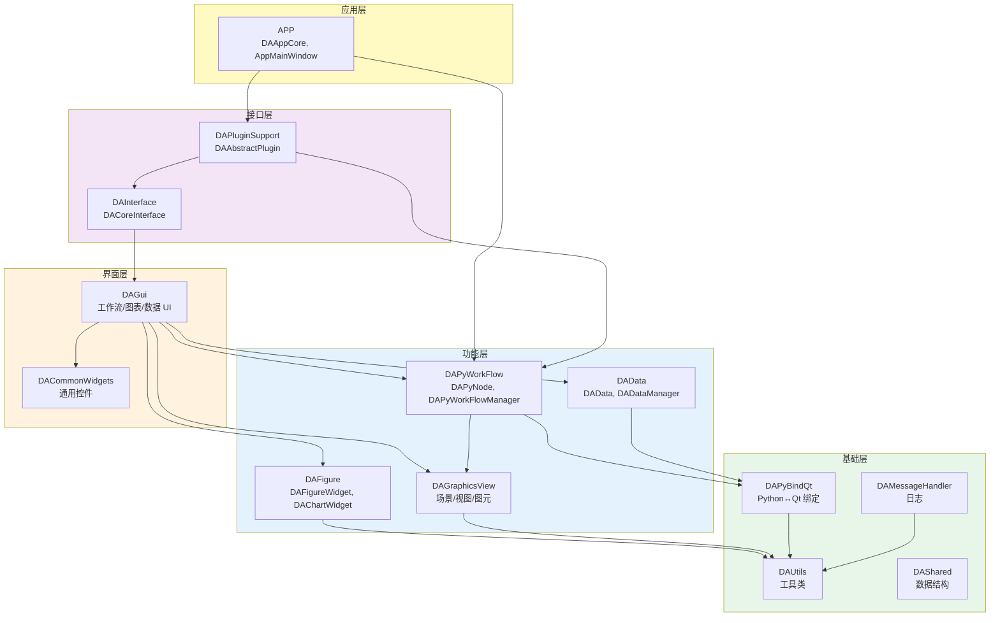
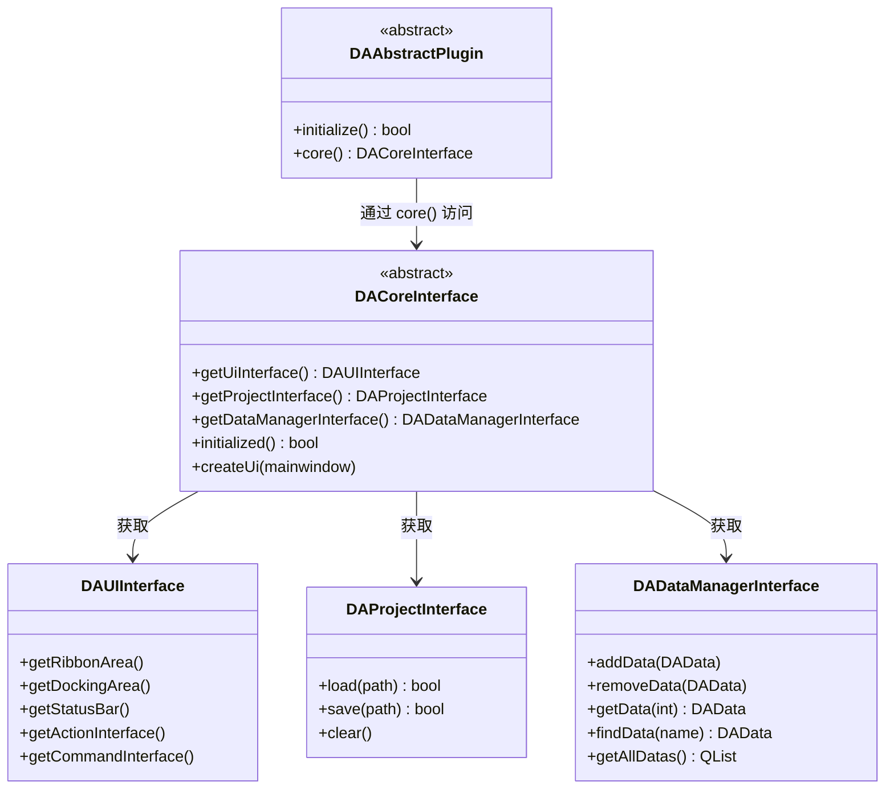

# API 总览

本页面提供 DAWorkBench API 文档的总览导航，展示模块关系图和各模块核心 API 入口。

## 主要功能特性

- ✅ **模块关系图**：一张图看清 15+ 模块的依赖关系和层次
- ✅ **核心 API 导航**：按功能域组织的 API 入口表
- ✅ **Doxygen 集成**：链接到完整的自动生成 API 文档
- ✅ **接口体系**：从 DACoreInterface 出发的完整接口树

---

## 模块关系图



上图展示了 DAWorkBench 的五层架构和模块依赖关系。箭头方向表示"依赖于"，依赖始终从上层指向下层。

---

## 接口体系

所有 API 通过 `DACoreInterface` 顶层接口统一访问。下图展示接口继承和获取关系：



插件通过 `DAAbstractPlugin::core()` 获取 `DACoreInterface` 实例，进而访问所有功能接口。

---

## 核心 API 导航

### 接口层 API

| 接口 | 文件 | 说明 |
|------|------|------|
| `DACoreInterface` | `src/DAInterface/DACoreInterface.h` | 顶层核心接口，获取所有其他接口 |
| `DAUIInterface` | `src/DAInterface/DAUIInterface.h` | UI 管理接口（Ribbon/Docking/StatusBar） |
| `DAProjectInterface` | `src/DAInterface/DAProjectInterface.h` | 工程文件管理接口 |
| `DADataManagerInterface` | `src/DAInterface/DADataManagerInterface.h` | 数据管理接口 |
| `DAActionsInterface` | `src/DAInterface/DAActionsInterface.h` | QAction 注册和查找接口 |
| `DACommandInterface` | `src/DAInterface/DACommandInterface.h` | 撤销/重做命令管理接口 |

### 工作流 API

| 类 | 文件 | 说明 |
|------|------|------|
| `DAPyWorkFlowManager` | `src/DAPyWorkFlow/DAPyWorkFlowManager.h` | 工作流中央调度器 |
| `DAPyNode` | `src/DAPyWorkFlow/DAPyNode.h` | Python 节点 C++ 代理 |
| `DAPyNodeFactory` | `src/DAPyWorkFlow/DAPyNodeFactory.h` | 节点工厂代理 |
| `DAPyNodeMetaData` | `src/DAPyWorkFlow/DAPyNodeMetaData.h` | 节点元数据结构 |
| `DAPyWorkFlowScene` | `src/DAPyWorkFlow/DAPyWorkFlowScene.h` | 工作流场景管理 |
| `DAPyNodeGraphicsItem` | `src/DAPyWorkFlow/DAPyNodeGraphicsItem.h` | 节点可视化图元 |

### 数据 API

| 类 | 文件 | 说明 |
|------|------|------|
| `DADataManager` | `src/DAData/DADataManager.h` | 数据管理器（注册表） |
| `DAData` | `src/DAData/DAData.h` | 数据包装器（隐式共享） |
| `DAAbstractData` | `src/DAData/DAAbstractData.h` | 抽象数据基类 |
| `DADataPyDataFrame` | `src/DAData/DADataPyDataFrame.h` | pandas DataFrame 包装 |

### 图表 API

| 类 | 文件 | 说明 |
|------|------|------|
| `DAFigureWidget` | `src/DAFigure/DAFigureWidget.h` | 画布容器（多图表布局） |
| `DAChartWidget` | `src/DAFigure/DAChartWidget.h` | 图表控件（QwtPlot 子类） |
| `DAChartDataInterface` | `src/DAFigure/DAChartDataInterface.h` | 数据操作接口 |
| `DAChartStyleInterface` | `src/DAFigure/DAChartStyleInterface.h` | 样式设置接口 |
| `DAChartInteractionInterface` | `src/DAFigure/DAChartInteractionInterface.h` | 交互控制接口 |

### 插件 API

| 类 | 文件 | 说明 |
|------|------|------|
| `DAAbstractPlugin` | `src/DAPluginSupport/DAAbstractPlugin.h` | 插件基类 |
| `DAAbstractNodePlugin` | `src/DAPluginSupport/DAAbstractNodePlugin.h` | 节点插件基类 |
| `DAPluginManager` | `src/DAPluginSupport/DAPluginManager.h` | 插件管理器 |

### 应用层 API

| 类 | 文件 | 说明 |
|------|------|------|
| `DAAppCore` | `src/APP/DAAppCore.h` | 核心单例（DACoreInterface 实现） |
| `AppMainWindow` | `src/APP/AppMainWindow.h` | 主窗口 |
| `DAAppController` | `src/APP/DAAppController.h` | MVC 控制器 |
| `DAAppProject` | `src/APP/DAAppProject.h` | 工程文件序列化 |
| `DAAppPluginManager` | `src/APP/DAAppPluginManager.h` | 插件管理器实现 |

---

## 日志 API

DAWorkBench 使用基于 spdlog 的日志系统，通过便捷宏输出日志：

```cpp
#include "DALogCategory.h"

daInfo  << "Processing node: " << nodeName;   // 信息级别，进 UI 窗口
daWarning << "Data size exceeds threshold";    // 警告级别，进 UI 窗口
daCritical << "Failed to load plugin";         // 严重级别，进 UI 窗口
```

!!! warning "日志消息不翻译"
    所有日志消息保持纯英文，不使用 `tr()`。详见 [日志系统文档](../dev-guide/logging.md)。

---

## Doxygen 完整文档

完整的 API 文档由 Doxygen 自动生成，包含所有类、函数、枚举的详细说明：

- [Doxygen API 首页](../../doxygen/index.html)
- [类索引](../../doxygen/classes.html)
- [文件列表](../../doxygen/files.html)

!!! tip "Markdown vs Doxygen"
    本 Markdown API 总览提供导航和关键 API 速查，完整的成员函数文档请参考 Doxygen 生成的内容。

---

## 模块列表

| 模块 | 层 | 说明 | 核心类 |
|------|-----|------|--------|
| DAShared | L1 | 纯头文件模板库 | 数据结构、宏定义 |
| DAUtils | L1 | 通用工具类 | XML序列化、CSV、目录管理 |
| DAMessageHandler | L1 | 日志基础设施 | DALogger、spdlog |
| DAPyBindQt | L1 | Python↔Qt 绑定 | 类型转换器、GIL 守卫 |
| DAPyScripts | L2 | Python 脚本包装 | I/O、DataFrame 操作 |
| DAPyCommonWidgets | L2 | Python 通用控件 | 列选择器、dtype 选择器 |
| DAPyWorkFlow | L2 | 工作流引擎 | DAPyNode, DAPyWorkFlowManager |
| DAData | L2 | 数据管理 | DAData, DADataManager |
| DAGraphicsView | L2 | 图形视图框架 | DAGraphicsScene, DAGraphicsView |
| DAFigure | L2 | 图表容器 | DAFigureWidget, DAChartWidget |
| DAGui | L3 | GUI 整合层 | 工作流 UI、图表设置 |
| DAInterface | L4 | 抽象接口定义 | DACoreInterface, DAUIInterface |
| DAPluginSupport | L4 | 插件框架 | DAAbstractPlugin, DAPluginManager |
| APP | L5 | 应用主程序 | DAAppCore, AppMainWindow |

---

## 相关文档

- [API 文档索引](../api-reference.md) — 核心 API 速查（含代码示例）
- [架构设计](../dev-guide/architecture.md) — 五层架构和设计决策
- [模块业务逻辑](../dev-guide/module-breakdown.md) — 各模块内部工作原理
- [插件开发指南](../plugin-development.md) — 插件和节点开发
