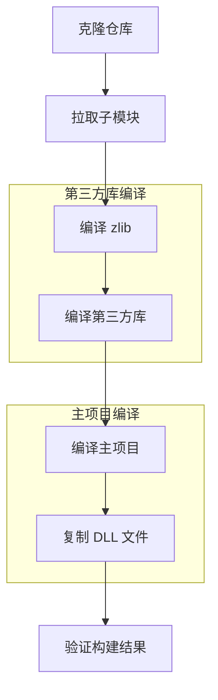

# 构建说明

本文档详细说明 data-workbench 项目的构建流程，包括环境要求、构建步骤和常见问题解决方案。

## 构建前置要求

### 环境依赖

| 依赖项 | 版本要求 | 说明 |
|--------|----------|------|
| CMake | ≥ 3.16 | 构建系统 |
| C++ 编译器 | C++17 兼容 | MSVC 2019+ / GCC 9+ / Clang 10+ |
| Qt | 5.14+ 或 Qt 6 | 跨平台 UI 框架 |
| Python | ≥ 3.7 | 数据处理后端 |
| Ninja | 推荐使用 | 快速构建工具 |

### Qt 版本说明

| Qt 版本 | 支持状态 | 说明 |
|---------|----------|------|
| Qt 5.14+ | ✅ 支持 | 需要手动处理部分兼容性问题 |
| Qt 5.15 | ✅ 推荐 | Qt5 系列最稳定版本 |
| Qt 6.x | ✅ 推荐 | 原生支持，推荐使用最新版本 |

!!! note "Qt版本兼容性"
    项目代码需兼容 Qt5 和 Qt6。部分 API 在 Qt6 中已移除，需要使用宏进行版本判断：

    ```cpp
    #if QT_VERSION < QT_VERSION_CHECK(6, 0, 0)
        // Qt5 实现代码
    #else
        // Qt6 实现代码
    #endif
    ```

### Python 依赖

项目依赖以下 Python 库：

| 库名 | 用途 |
|------|------|
| pandas | 数据处理核心 |
| numpy | 数值计算 |
| scipy | 科学计算 |

## 构建流程概览



整个构建过程需要执行 3 次 CMake 配置和编译：

1. **zlib 编译**：quazip 依赖 zlib，需先编译
2. **第三方库编译**：编译所有 `src/3rdparty` 下的库
3. **主项目编译**：编译 DataWorkbench 主程序

## 第三方库拉取

!!! warning "重要"
    编译前请确保已经拉取了所有第三方库，否则构建将失败。

项目使用 `git submodule` 管理第三方库，克隆仓库后需执行：

```shell
# 拉取所有子模块（包括嵌套子模块）
git submodule update --init --recursive
```

!!! tip "网络问题"
    第三方库 `SARibbon` 包含子模块 `QWindowKit`（托管在 GitHub）。如果网络无法访问 GitHub，可取消 `--recursive` 参数：
    
    ```shell
    git submodule update --init
    ```

也可以逐个拉取第三方库：

```shell
git submodule update src/3rdparty/zlib
git submodule update src/3rdparty/quazip
git submodule update src/3rdparty/spdlog
git submodule update src/3rdparty/SARibbon
git submodule update src/3rdparty/ADS
git submodule update src/3rdparty/pybind11
git submodule update src/3rdparty/QtPropertyBrowser
git submodule update src/3rdparty/ordered-map
```

## 命令行构建步骤

### 配置命令

构建项目**必须**使用 Qt 工具链文件，否则会出现 Windows SDK 头文件找不到的问题。

```powershell
# 配置项目（替换 Qt 安装路径）
cmake -S . -B build -G Ninja `
    -DCMAKE_BUILD_TYPE:STRING=Release `
    -DCMAKE_EXPORT_COMPILE_COMMANDS:BOOL=TRUE `
    -DCMAKE_TOOLCHAIN_FILE:FILEPATH="D:\Qt\6.7.3\msvc2019_64\lib\cmake\Qt6\qt.toolchain.cmake" `
    -DQT_QML_GENERATE_QMLLS_INI:STRING=ON `
    "-DCMAKE_CXX_FLAGS_DEBUG_INIT:STRING=-DQT_QML_DEBUG -DQT_DECLARATIVE_DEBUG" `
    "-DCMAKE_CXX_FLAGS_RELWITHDEBINFO_INIT:STRING=-DQT_QML_DEBUG -DQT_DECLARATIVE_DEBUG"
```

### CMake 参数说明

| 参数 | 必需 | 说明 |
|------|------|------|
| `-DCMAKE_TOOLCHAIN_FILE` | ✅ **必须** | 指定 Qt 工具链文件路径，否则无法找到 Windows SDK |
| `-DCMAKE_BUILD_TYPE` | ✅ 必须 | 构建类型：`Debug` 或 `Release` |
| `-G Ninja` | 推荐 | 使用 Ninja 生成器，构建速度更快 |
| `-DCMAKE_EXPORT_COMPILE_COMMANDS` | 可选 | 生成 `compile_commands.json` 供 IDE 使用 |
| `-DQT_QML_GENERATE_QMLLS_INI` | 可选 | QML 语言服务器配置 |

### 构建命令

```powershell
# 构建项目（使用所有 CPU 核心）
cmake --build build --config Release --parallel

# 构建并安装（生成到 bin 目录）
cmake --build build --config Release --target install

# 仅构建特定模块
cmake --build build --config Release --target DAFigure
cmake --build build --config Release --target DAData
```

### 完整构建流程

以下是完整的构建脚本示例：

```powershell
# 1. 配置项目
cmake -S . -B build -G Ninja `
    -DCMAKE_BUILD_TYPE:STRING=Release `
    -DCMAKE_EXPORT_COMPILE_COMMANDS:BOOL=TRUE `
    -DCMAKE_TOOLCHAIN_FILE:FILEPATH="D:\Qt\6.7.3\msvc2019_64\lib\cmake\Qt6\qt.toolchain.cmake"

# 2. 构建项目
cmake --build build --config Release --parallel

# 3. 安装（生成到 bin 目录）
cmake --build build --config Release --target install

# 4. 复制 zlib DLL 到 bin 目录（如需要）
copy build\src\3rdparty\zlib\zlib.dll bin_Release_qt6.7.3_MSVC_x64\
```

## 分步构建说明

### 第一步：编译 zlib 库

如果开发环境已经安装了 zlib，可以跳过此步骤。

```powershell
# 配置 zlib
cmake -S src/3rdparty/zlib -B build/zlib -G Ninja `
    -DCMAKE_BUILD_TYPE:STRING=Release `
    -DCMAKE_TOOLCHAIN_FILE:FILEPATH="D:\Qt\6.7.3\msvc2019_64\lib\cmake\Qt6\qt.toolchain.cmake"

# 构建并安装
cmake --build build/zlib --config Release --target install
```

### 第二步：编译第三方库

编译所有第三方依赖库：

```powershell
# 配置第三方库
cmake -S src/3rdparty -B build/3rdparty -G Ninja `
    -DCMAKE_BUILD_TYPE:STRING=Release `
    -DCMAKE_TOOLCHAIN_FILE:FILEPATH="D:\Qt\6.7.3\msvc2019_64\lib\cmake\Qt6\qt.toolchain.cmake"

# 构建并安装
cmake --build build/3rdparty --config Release --target install
```

!!! info "提示"
    第二步可以设置不构建 plugin。如果不构建 plugin，plugin 模块可以单独构建，前提是前两步已经完成且安装好。单独构建插件需运行 `plugins/CMakeLists.txt`。

### 第三步：编译主项目

```powershell
# 配置主项目
cmake -S . -B build -G Ninja `
    -DCMAKE_BUILD_TYPE:STRING=Release `
    -DCMAKE_TOOLCHAIN_FILE:FILEPATH="D:\Qt\6.7.3\msvc2019_64\lib\cmake\Qt6\qt.toolchain.cmake"

# 构建并安装
cmake --build build --config Release --target install
```

### 第四步：复制 DLL 文件

将 zlib 的 DLL 文件手动复制到 bin 目录：

```powershell
# 复制 zlib DLL（根据实际路径调整）
copy build\src\3rdparty\zlib\zlib.dll bin_Release_qt6.7.3_MSVC_x64\
```

## 构建输出目录说明

项目编译后的二进制文件统一生成到特定格式的目录中：

### 目录命名规则

```
bin_{BuildType}_qt{QtVersion}_{Compiler}_{Arch}
```

### 目录示例

| 构建配置 | 输出目录 |
|----------|----------|
| Qt 5.14.2, Debug, MSVC, x64 | `bin_Debug_qt5.14.2_MSVC_x64` |
| Qt 5.14.2, Release, MSVC, x64 | `bin_Release_qt5.14.2_MSVC_x64` |
| Qt 6.7.3, Debug, MSVC, x64 | `bin_Debug_qt6.7.3_MSVC_x64` |
| Qt 6.7.3, Release, MSVC, x64 | `bin_Release_qt6.7.3_MSVC_x64` |

### 自定义安装路径

用户可以自定义安装路径，在 CMake 配置时设置 `DA_AUTO_INSTALL_PREFIX` 参数：

```powershell
# 禁用自动安装路径，使用 CMAKE_INSTALL_PREFIX
cmake -S . -B build -G Ninja `
    -DCMAKE_BUILD_TYPE:STRING=Release `
    -DCMAKE_TOOLCHAIN_FILE:FILEPATH="D:\Qt\6.7.3\msvc2019_64\lib\cmake\Qt6\qt.toolchain.cmake" `
    -DDA_AUTO_INSTALL_PREFIX:BOOL=OFF `
    -DCMAKE_INSTALL_PREFIX:PATH="D:\my_install_path"
```

## 验证构建结果

### 检查输出文件

构建完成后，检查 bin 目录中的可执行文件：

```powershell
# 列出 bin 目录中的可执行文件
dir bin_Release_qt6.7.3_MSVC_x64\*.exe
```

预期输出应包含：

| 文件名 | 说明 |
|--------|------|
| `DataWorkbench.exe` | 主程序可执行文件 |
| `DAFigure.dll` | 图表模块动态库 |
| `DAData.dll` | 数据处理模块动态库 |
| `DAGui.dll` | GUI 模块动态库 |

### 运行程序

```powershell
# 运行主程序
.\bin_Release_qt6.7.3_MSVC_x64\DataWorkbench.exe
```

程序启动后应显示主窗口界面，表示构建成功。

### 常见问题排查

| 问题 | 原因 | 解决方案 |
|------|------|----------|
| 找不到 Windows SDK 头文件 | 未使用 Qt 工具链文件 | 添加 `-DCMAKE_TOOLCHAIN_FILE` 参数 |
| zlib 相关链接错误 | zlib 未编译或未安装 | 先编译 zlib 库 |
| 第三方库找不到 | 第三方库未编译或未安装 | 执行第二步编译第三方库 |
| 运行时缺少 DLL | DLL 未复制到 bin 目录 | 复制所需 DLL 到 bin 目录 |

## 注意事项

!!! warning "工具链文件必须使用"
    构建此项目**必须**使用 Qt 工具链文件（`qt.toolchain.cmake`），否则会出现 Windows SDK 头文件找不到的问题。这是 Qt 官方推荐的方式，确保编译器能正确找到所有依赖。

!!! warning "第三方库编译顺序"
    第三方库中的 `quazip` 依赖 `zlib`，因此必须按照以下顺序编译：
    
    1. 先编译 `zlib`
    2. 再编译其他第三方库
    3. 最后编译主项目

!!! tip "已有 zlib 环境"
    如果开发环境已经安装了 zlib 库，可以跳过 zlib 的编译步骤。但需要确保 CMake 能找到 zlib 的头文件和库文件。

!!! tip "Ninja 构建器"
    推荐使用 Ninja 构建器（`-G Ninja`），相比默认的 MSBuild 或 Make，Ninja 具有更快的构建速度和更好的增量构建支持。

## 参考资料

- [Qt CMake 手册](https://doc.qt.io/qt-6/cmake-manual.html)
- [Qt 工具链文件说明](https://doc.qt.io/qt-6/cmake-get-started.html)
- [SARibbon 文档](https://czyt1988.github.io/SARibbon/zh/)