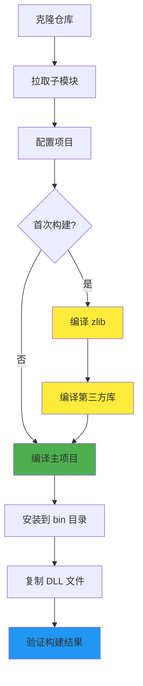

# 构建说明

本文档详细说明 DAWorkBench 项目的构建流程，帮助开发者快速搭建开发环境并成功编译项目。

## 主要功能特性

**特性**

- ✅ **跨平台支持**：支持 Windows、Linux 平台构建
- ✅ **多Qt版本兼容**：同时支持 Qt 5.14+ 和 Qt 6.x
- ✅ **模块化构建**：支持独立构建第三方库、主程序和插件
- ✅ **自动依赖管理**：通过 git submodule 管理第三方依赖

## 构建前置要求

### 必备工具

| 工具 | 版本要求 | 说明 |
|------|----------|------|
| CMake | ≥ 3.16 | 构建系统生成器 |
| C++ 编译器 | C++17 兼容 | MSVC 2019+ / GCC 9+ / Clang 10+ |
| Qt | 5.14+ 或 Qt 6 | 跨平台 UI 框架 |
| Python | ≥ 3.7 | 数据处理后端 |
| Ninja | 推荐 | 快速构建工具 |
| Git | 最新版 | 版本控制和子模块管理 |

### Qt 版本要求

| Qt 版本 | 支持状态 | 说明 |
|---------|----------|------|
| Qt 5.14+ | ✅ 支持 | 需手动处理部分兼容性问题 |
| Qt 5.15 | ✅ 推荐 | Qt5 系列最稳定版本 |
| Qt 6.x | ✅ 推荐 | 原生支持，推荐使用最新版本 |

!!! warning "Qt工具链文件必须"
    构建项目**必须**使用 Qt 工具链文件（`qt.toolchain.cmake`），否则会出现 Windows SDK 头文件找不到的问题。这是 Qt 官方推荐的方式。

### Python 依赖

项目依赖以下 Python 库：

| 库名 | 用途 |
|------|------|
| pandas | 数据处理核心 |
| numpy | 数值计算 |
| scipy | 科学计算 |

安装依赖：

```shell
pip install pandas numpy scipy
```

## 构建流程概览



构建过程分为三个阶段：

1. **依赖准备**：拉取 git 子模块，确保所有第三方库源码就绪
2. **第三方库编译**：zlib → quazip → 其他第三方库
3. **主项目编译**：编译核心模块和插件，生成可执行文件

## 第三方库拉取

!!! warning "重要：必须先拉取子模块"
    编译前请确保已经拉取所有第三方库，否则构建将失败。

项目使用 git submodule 管理第三方库，克隆仓库后需执行：

```shell
# 拉取所有子模块（包括嵌套子模块）
git submodule update --init --recursive
```

!!! tip "网络问题处理"
    第三方库 `SARibbon` 包含子模块 `QWindowKit`（托管在 GitHub）。如果网络无法访问 GitHub，可以逐个拉取：
    
    ```shell
    git submodule update --init src/3rdparty/zlib
    git submodule update --init src/3rdparty/quazip
    git submodule update --init src/3rdparty/spdlog
    git submodule update --init src/3rdparty/SARibbon
    git submodule update --init src/3rdparty/ADS
    git submodule update --init src/3rdparty/pybind11
    ```

## 命令行构建步骤（Windows）

### 完整构建流程

```powershell
# 步骤1：进入项目根目录
cd C:\path\to\data-workbench

# 步骤2：配置项目（必须指定 Qt 工具链文件）
cmake -S . -B build -G Ninja `
    -DCMAKE_BUILD_TYPE:STRING=Release `
    -DCMAKE_EXPORT_COMPILE_COMMANDS:BOOL=TRUE `
    -DCMAKE_TOOLCHAIN_FILE:FILEPATH="D:\Qt\6.7.3\msvc2019_64\lib\cmake\Qt6\qt.toolchain.cmake" `
    -DQT_QML_GENERATE_QMLLS_INI:STRING=ON

# 步骤3：构建项目（使用所有 CPU 核心）
cmake --build build --config Release --parallel

# 步骤4：安装到 bin 目录
cmake --build build --config Release --target install

# 步骤5：复制 zlib DLL（首次构建需要）
copy build\src\3rdparty\zlib\Release\zlib.dll bin_Release_qt6.7.3_MSVC_x64\
```

### CMake 参数说明

| 参数 | 必需 | 说明 |
|------|:----:|------|
| `-DCMAKE_TOOLCHAIN_FILE` | ✅ | Qt 工具链文件路径，**必须指定** |
| `-DCMAKE_BUILD_TYPE` | ✅ | 构建类型：`Debug` 或 `Release` |
| `-G Ninja` | 推荐 | 使用 Ninja 生成器，构建更快 |
| `-DCMAKE_EXPORT_COMPILE_COMMANDS` | 可选 | 生成 LSP 配置文件 |
| `-DQT_QML_GENERATE_QMLLS_INI` | 可选 | QML 语言服务器配置 |

### 分步构建

如果需要分步构建，按以下顺序执行：

```powershell
# 第一步：编译 zlib（首次构建需要）
cmake -S src/3rdparty/zlib -B build/zlib -G Ninja `
    -DCMAKE_BUILD_TYPE:STRING=Release `
    -DCMAKE_TOOLCHAIN_FILE:FILEPATH="D:\Qt\6.7.3\msvc2019_64\lib\cmake\Qt6\qt.toolchain.cmake"
cmake --build build/zlib --config Release --target install

# 第二步：编译第三方库
cmake -S src/3rdparty -B build/3rdparty -G Ninja `
    -DCMAKE_BUILD_TYPE:STRING=Release `
    -DCMAKE_TOOLCHAIN_FILE:FILEPATH="D:\Qt\6.7.3\msvc2019_64\lib\cmake\Qt6\qt.toolchain.cmake"
cmake --build build/3rdparty --config Release --target install

# 第三步：编译主项目
cmake -S . -B build -G Ninja `
    -DCMAKE_BUILD_TYPE:STRING=Release `
    -DCMAKE_TOOLCHAIN_FILE:FILEPATH="D:\Qt\6.7.3\msvc2019_64\lib\cmake\Qt6\qt.toolchain.cmake"
cmake --build build --config Release --target install
```

!!! note "构建顺序说明"
    第三方库 `quazip` 依赖 `zlib`，必须按顺序编译：zlib → 第三方库 → 主项目。

## 命令行构建步骤（Linux）

```bash
# 步骤1：配置项目
cmake -S . -B build -G Ninja \
    -DCMAKE_BUILD_TYPE:STRING=Release \
    -DCMAKE_EXPORT_COMPILE_COMMANDS:BOOL=TRUE \
    -DCMAKE_TOOLCHAIN_FILE:FILEPATH=/opt/Qt/6.7.3/gcc_64/lib/cmake/Qt6/qt.toolchain.cmake

# 步骤2：构建项目
cmake --build build --config Release --parallel

# 步骤3：安装到 bin 目录
cmake --build build --config Release --target install
```

## Qt Creator 构建步骤

### 打开项目

1. 启动 Qt Creator
2. 选择 **文件** → **打开文件或项目**
3. 选择项目根目录下的 `CMakeLists.txt`
4. 点击 **打开**

### 配置项目

1. Qt Creator 会自动检测 CMake 配置
2. 在 **配置项目** 页面选择 Qt 版本（Qt 5.15 或 Qt 6.x）
3. 选择构建类型（Debug 或 Release）
4. 点击 **配置项目**

!!! warning "手动指定工具链文件"
    如果 Qt Creator 无法正确检测 Windows SDK，需要手动配置 CMake 参数：
    
    1. 打开 **项目** → **构建设置**
    2. 在 **CMake** 配置中添加参数：
       ```
       -DCMAKE_TOOLCHAIN_FILE:FILEPATH=D:/Qt/6.7.3/msvc2019_64/lib/cmake/Qt6/qt.toolchain.cmake
       ```

### 构建运行

1. 选择构建配置（Debug 或 Release）
2. 点击左下角的 **构建** 按钮（锤子图标）或按 `Ctrl+B`
3. 构建完成后点击 **运行** 按钮（绿色三角形）或按 `Ctrl+R`

## 构建输出目录说明

### 目录命名规则

构建输出目录格式：

```
bin_{BuildType}_qt{QtVersion}_{Compiler}_{Arch}
```

### 示例目录

| 构建配置 | 输出目录 |
|----------|----------|
| Qt 5.15.2, Release, MSVC, x64 | `bin_Release_qt5.15.2_MSVC_x64` |
| Qt 6.7.3, Debug, MSVC, x64 | `bin_Debug_qt6.7.3_MSVC_x64` |
| Qt 6.7.3, Release, GCC, x64 | `bin_Release_qt6.7.3_GCC_x64` |

### 输出文件说明

| 文件 | 说明 |
|------|------|
| `DataWorkbench.exe` | 主程序可执行文件 |
| `DAFigure.dll` | 图表模块动态库 |
| `DAData.dll` | 数据处理模块动态库 |
| `DAGui.dll` | GUI 模块动态库 |
| `DACommonWidgets.dll` | 通用组件动态库 |

## 验证构建结果

### 检查输出文件

```powershell
# Windows
dir bin_Release_qt6.7.3_MSVC_x64\*.exe
dir bin_Release_qt6.7.3_MSVC_x64\*.dll

# Linux
ls bin_Release_qt6.7.3_GCC_x64/
```

### 运行程序

```powershell
# Windows
.\bin_Release_qt6.7.3_MSVC_x64\DataWorkbench.exe

# Linux
./bin_Release_qt6.7.3_GCC_x64/DataWorkbench
```

程序启动后应显示主窗口界面，表示构建成功。

## 常见问题

### 编译错误

| 问题 | 原因 | 解决方案 |
|------|------|----------|
| 找不到 Windows SDK 头文件 | 未使用 Qt 工具链文件 | 添加 `-DCMAKE_TOOLCHAIN_FILE` 参数 |
| zlib 相关链接错误 | zlib 未编译 | 先执行 zlib 编译步骤 |
| 第三方库找不到 | 第三方库未编译 | 执行第三方库编译步骤 |
| Python.h 找不到 | Python 开发包未安装 | 安装 Python 开发库 |

### 运行时错误

| 问题 | 原因 | 解决方案 |
|------|------|----------|
| 缺少 DLL 文件 | DLL 未复制到 bin 目录 | 复制所需 DLL 到输出目录 |
| Qt 库找不到 | Qt 环境变量未设置 | 添加 Qt bin 目录到 PATH |
| 插件加载失败 | 插件路径未配置 | 检查插件目录配置 |

!!! tip "缺少 DLL 解决方案"
    运行时提示缺少 DLL，可以使用 Qt 自带的 `windeployqt` 工具自动复制依赖：
    
    ```powershell
    cd bin_Release_qt6.7.3_MSVC_x64
    windeployqt DataWorkbench.exe
    ```

## 注意事项

!!! warning "工具链文件必须使用"
    构建此项目**必须**使用 Qt 工具链文件（`qt.toolchain.cmake`），否则会出现 Windows SDK 头文件找不到的问题。

!!! warning "第三方库编译顺序"
    第三方库中的 `quazip` 依赖 `zlib`，必须按顺序编译：
    1. 先编译 `zlib`
    2. 再编译其他第三方库
    3. 最后编译主项目

!!! tip "已有 zlib 环境"
    如果开发环境已安装 zlib，可跳过 zlib 编译，但需确保 CMake 能找到 zlib 的头文件和库文件。

!!! tip "Ninja 构建器"
    推荐使用 Ninja 构建器（`-G Ninja`），相比 MSBuild 或 Make，Ninja 具有更快的构建速度和更好的增量构建支持。

## 参考资料

- [Qt CMake 手册](https://doc.qt.io/qt-6/cmake-manual.html)
- [Qt 工具链文件说明](https://doc.qt.io/qt-6/cmake-get-started.html)
- [CMake 官方文档](https://cmake.org/documentation/)
- [Ninja 构建系统](https://ninja-build.org/)