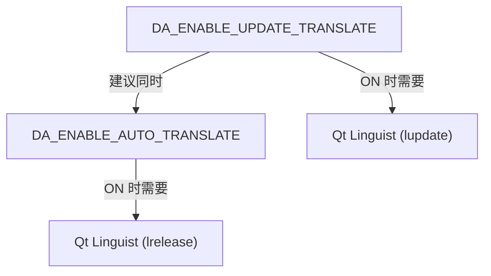

# 构建选项参考

本页面列出 DAWorkBench 项目的所有 CMake 构建选项，说明其作用、默认值和影响范围。

## 主要功能特性

- ✅ **完整选项列表**：6 个 CMake 选项的详细说明
- ✅ **影响范围**：每个选项影响的模块和构建行为
- ✅ **使用示例**：常见构建场景的选项组合
- ✅ **选项交互**：选项间的依赖和冲突关系

---

## 选项总览

| 选项 | 默认值 | 简述 | 影响范围 |
|------|:------:|------|---------|
| `DA_ENABLE_AUTO_INSTALL_PYTHON_ENV` | `ON` | 自动搜索并部署 Python DLL | APP（仅 Windows） |
| `DA_ENABLE_AUTO_TRANSLATE` | `ON` | 自动编译翻译文件（.ts → .qm） | i18n |
| `DA_ENABLE_UPDATE_TRANSLATE` | `OFF` | 自动更新翻译源文件 | i18n（仅翻译时使用） |
| `DA_AUTO_INSTALL_PREFIX` | `ON` | 自动安装到本地目录 | 所有模块的 install 行为 |
| `DA_AUTO_GENERATE_CONFIG_INFO` | `OFF` | 自动生成 DAConfig.h | 库开发者专用 |
| `DA_BUILD_PLUGINS` | `ON` | 构建 plugins/ 目录下的插件 | plugins/ 子目录 |

---

## 选项详解

!!! info "Python 为强制依赖"
    Python 不再是可选构建选项，而是强制依赖，始终参与编译，无法禁用。相关模块包括 DAPyBindQt、DAPyScripts、DAPyCommonWidgets、DAPyWorkFlow、DAData。如需配置 Python 环境，参见 [Python 环境配置](./python-environment.md)。

### DA_ENABLE_AUTO_INSTALL_PYTHON_ENV

- **默认值**：`ON`
- **作用**：构建完成后自动搜索 Python 环境，将必要的 DLL 复制到 `bin/` 目录
- **影响范围**：仅 Windows 平台，仅 APP 模块
- **适用场景**：Windows 用户未将 Python 目录设为系统环境变量时

```bash
# 启用自动部署（推荐 Windows 用户）
cmake -DDA_ENABLE_AUTO_INSTALL_PYTHON_ENV=ON ...

# 禁用自动部署（已配置 Python 环境变量时）
cmake -DDA_ENABLE_AUTO_INSTALL_PYTHON_ENV=OFF ...
```

!!! tip "Linux 用户"
    此选项在 Linux 上无效。Linux 通过系统包管理器或 virtualenv 管理 Python 环境。

### DA_ENABLE_AUTO_TRANSLATE

- **默认值**：`ON`
- **作用**：构建时自动调用 Qt Linguist 工具，将 `.ts` 翻译源文件编译为 `.qm` 二进制翻译文件
- **依赖**：需要安装 Qt Linguist 工具（`lrelease`）
- **影响范围**：i18n 翻译文件

```bash
# 启用自动翻译（默认）
cmake -DDA_ENABLE_AUTO_TRANSLATE=ON ...

# 禁用自动翻译（加速构建，无翻译需求时）
cmake -DDA_ENABLE_AUTO_TRANSLATE=OFF ...
```

### DA_ENABLE_UPDATE_TRANSLATE

- **默认值**：`OFF`
- **作用**：自动调用 `lupdate` 更新 `.ts` 翻译源文件（提取新增的 `tr()` 字符串）
- **适用场景**：仅在进行翻译工作时开启，日常开发保持关闭
- **影响范围**：i18n 翻译源文件

```bash
# 更新翻译源文件（翻译时使用）
cmake -DDA_ENABLE_UPDATE_TRANSLATE=ON ...
```

!!! warning "日常开发不要开启"
    此选项会修改 `.ts` 源文件内容，日常开发保持 `OFF`。仅当新增了需要翻译的字符串时临时开启。

### DA_AUTO_INSTALL_PREFIX

- **默认值**：`ON`
- **作用**：自动将构建结果安装到本地目录（`bin_<Config>_qt<Ver>_<Compiler>_<Arch>/`）
- **影响范围**：所有模块的 `install` 行为

```bash
# 启用自动安装（默认，推荐）
cmake -DDA_AUTO_INSTALL_PREFIX=ON ...

# 禁用自动安装，使用 CMAKE_INSTALL_PREFIX
cmake -DCMAKE_INSTALL_PREFIX=/custom/path -DDA_AUTO_INSTALL_PREFIX=OFF ...
```

### DA_AUTO_GENERATE_CONFIG_INFO

- **默认值**：`OFF`
- **作用**：自动生成 `DAConfig.h` 配置头文件，包含编译时信息
- **适用场景**：仅库开发者需要开启，库使用者保持默认 `OFF`
- **影响范围**：`DAConfig.h` 文件生成

```bash
# 库开发者构建时开启
cmake -DDA_AUTO_GENERATE_CONFIG_INFO=ON ...
```

### DA_BUILD_PLUGINS

- **默认值**：`ON`
- **作用**：是否构建 `plugins/` 目录下的插件
- **影响范围**：`plugins/` 子目录下的所有插件项目

```bash
# 构建插件（默认）
cmake -DDA_BUILD_PLUGINS=ON ...

# 仅构建主程序，跳过插件
cmake -DDA_BUILD_PLUGINS=OFF ...
```

---

## 选项交互关系

### 依赖关系



### 冲突与约束

| 组合 | 结果 |
|------|------|
| `DA_ENABLE_AUTO_TRANSLATE=ON` 但无 Qt Linguist | 构建报错，找不到 `lrelease` |
| `DA_ENABLE_UPDATE_TRANSLATE=ON` + 日常开发 | `.ts` 文件被意外修改 |

---

## 常见构建场景

### 场景 1：完整开发构建（推荐）

```bash
cmake -S . -B build -G "Visual Studio 16 2019" -A x64 \
  -DCMAKE_PREFIX_PATH="C:/Qt/6.7.3/msvc2019_64" \
  -DDA_ENABLE_AUTO_INSTALL_PYTHON_ENV=ON \
  -DDA_ENABLE_AUTO_TRANSLATE=ON \
  -DDA_BUILD_PLUGINS=ON
```

### 场景 2：快速构建（跳过翻译和插件）

```bash
cmake -S . -B build -G "Visual Studio 16 2019" -A x64 \
  -DCMAKE_PREFIX_PATH="C:/Qt/6.7.3/msvc2019_64" \
  -DDA_ENABLE_AUTO_TRANSLATE=OFF \
  -DDA_BUILD_PLUGINS=OFF
```

### 场景 3：翻译更新

```bash
cmake -S . -B build -G "Visual Studio 16 2019" -A x64 \
  -DCMAKE_PREFIX_PATH="C:/Qt/6.7.3/msvc2019_64" \
  -DDA_ENABLE_UPDATE_TRANSLATE=ON \
  -DDA_ENABLE_AUTO_TRANSLATE=ON
# 构建后会更新并编译 .ts 文件
```

---

## 相关文档

- [构建说明](./build-instructions.md) — 完整构建流程
- [第三方库构建](./third-party-build.md) — 第三方库编译
- [主程序构建](./main-program-build.md) — 主程序构建详解
- [Python 环境配置](./python-environment.md) — Python 环境说明
- [构建常见错误](./common-build-errors.md) — 构建问题排查
- [工程组织](../large-cmake-project-guide.md) — CMake 工程组织指南
