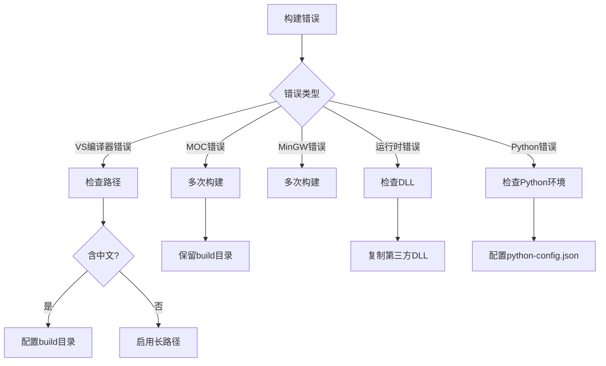

# 构建过程常见错误

本文档汇总 data-workbench 构建过程中的常见错误及解决方案，帮助开发者快速定位并解决构建问题。

本文档汇总data-workbench构建过程中的常见错误及解决方案，按错误类型分类便于快速定位。

## 主要功能特性

**特性**

- ✅ **错误分类索引**：按错误类型分类，便于快速定位问题
- ✅ **详细原因分析**：每个错误提供完整的原因分析表格
- ✅ **多种解决方案**：提供多种解决方案，适应不同场景
- ✅ **诊断流程图**：通过流程图引导错误排查步骤

## 错误分类概览

| 错误类型 | 常见原因 | 解决难度 |
|----------|----------|----------|
| 编译器错误 | VS路径问题、路径长度限制 | 中等 |
| MOC错误 | 批量MOC操作异常 | 低 |
| MinGW错误 | 线程数据空间不足 | 低 |
| 运行时错误 | DLL缺失、Python环境 | 中等 |

## VS2017编译器错误

### 错误现象

> error D8050: 无法执行 xxx/c1xx.dll 未能将命令行放入调试记录中

### 错误原因

| 原因 | 说明 |
|------|------|
| 构建目录中文路径 | 用户名为中文或构建目录含中文 |
| 操作系统路径长度限制 | 默认最大255字符限制 |

### 解决方案

#### 方案一：指定构建目录

避免中文路径，在项目根目录下的`CMakeSettings.json`中指定构建目录：

下面的代码展示了 CMakeSettings.json 的典型配置，用于指定构建目录并避免中文路径问题。关键参数说明见代码注释。

```json
{
  "configurations": [
    {
      "name": "x64-Debug",               // 配置名称，用于识别构建类型
      "generator": "Ninja",               // 使用 Ninja 生成器，构建更快
      "configurationType": "Debug",       // Debug 模式，便于调试
      "inheritEnvironments": [ "msvc_x64" ],  // 继承 MSVC x64 环境
      "buildRoot": "${workspaceRoot}\\build\\x64-Debug",  // 构建目录，使用英文路径
      "cmakeCommandArgs": "",
      "ctestCommandArgs": ""
    },
    {
      "name": "x64-Release",              // Release 配置
      "generator": "Ninja",
      "configurationType": "Release",     // Release 模式，性能优化
      "inheritEnvironments": [ "msvc_x64" ],
      "buildRoot": "${workspaceRoot}\\build\\x64-Release"  // Release 构建目录
    }
  ]
}
```

配置完成后，Visual Studio 将使用指定的构建目录，避免中文路径问题。

#### 方案二：启用长路径支持

修改组策略启用长路径支持：

```txt
操作步骤：
1. 按 Win + R 输入 gpedit.msc
2. 导航到：计算机配置 > 管理模板 > 系统 > 文件系统
3. 启用 "启用 Win32 长路径"
4. 重启系统
```

!!! tip "替代方案"
    如果以上方法都不生效，可以将项目移动到更短的路径下（如D盘或C盘根目录）。

## MOC相关错误

### 错误现象

编译过程中出现类似如下错误信息：

```txt
14:44:10: 为项目DAWorkbench执行步骤 ...
[3/173 2.1/sec] Automatic MOC and UIC for target DAGui
FAILED: src/DAGui/DAGui_autogen/timestamp
ninja: build stopped: subcommand failed.
Error while building/deploying project DAWorkbench
```

### 错误原因

批量MOC操作时，编译器可能出现临时异常，尤其在第一次构建时更容易发生。

### 解决方案

| 解决方法 | 操作 |
|----------|------|
| 再次构建 | 直接重新运行构建命令 |
| 保留build目录 | 不要删除build目录，继续构建 |

!!! tip "解决方案"
    此类MOC错误只需**多次重新构建**即可解决，无需删除build目录。保留build目录可避免重新生成所有MOC文件。

## MinGW编译错误

### 错误现象

```txt
[1/219 2.0/sec] Automatic MOC and UIC for target qwt
[6/218 2.8/sec] Automatic MOC and UIC for target QtPropertyBrowser

runtime error R6016
- not enough space for thread data
```

### 错误原因

MinGW编译器线程数据空间不足，属于编译器自身问题。

### 解决方案

处理方式与MOC错误一致：**多次构建**直到成功。

!!! note "说明"
    这是MinGW编译器的已知问题，不影响最终构建结果。

## 运行时DLL缺失错误

### 错误现象

编译成功但运行时立即报错，提示找不到DLL。

### 错误原因

编译完成后运行程序是在build目录下运行，第一次构建的build目录下没有第三方库DLL。

### 解决方案

需要复制以下DLL到build目录：

| DLL名称 | 来源 | 说明 |
|---------|------|------|
| `DALiteCtk.dll` | DALiteCtk库 | CTK扩展库 |
| `qt6advanceddocking.dll` | QtAdvancedDocking | Dock窗口库（Qt6） |
| `qt5advanceddocking.dll` | QtAdvancedDocking | Dock窗口库（Qt5） |
| `QtPropertyBrowser.dll` | QtPropertyBrowser | 属性浏览器 |
| `quazip1-qt6.dll` | QuaZip | ZIP压缩库（Qt6） |
| `quazip1-qt5.dll` | QuaZip | ZIP压缩库（Qt5） |
| `qwt.dll` | Qwt | 绑图库 |
| `SARibbonBar.dll` | SARibbonBar | Ribbon界面库 |
| `spdlog.dll` | spdlog | 日志库 |
| `zlib.dll` | zlib | QuaZip依赖库 |

!!! warning "注意"
    1. DLL名称与Qt版本相关，Qt6使用`qt6xxx.dll`，Qt5使用`qt5xxx.dll`
    2. `zlib.dll`是QuaZip的依赖，必须同时复制
    3. Debug模式下DLL名称会添加`d`后缀，如`SARibbonBard.dll`

!!! tip "自动化方案"
    可以编写脚本自动复制DLL，或使用CMake的install命令在构建后自动部署。

## Python环境错误

### 错误现象

软件启动时Python相关报错，无法加载Python库。

### 错误原因

| 原因 | 说明 |
|------|------|
| 未找到Python | `where python`找不到Python环境 |
| Python环境不匹配 | 找到了错误的Python环境 |
| 缺少Python包 | 未安装必需的Python依赖 |

### 解决方案

#### 方案一：配置python-config.json

通过配置文件指定Python环境：

下面的代码展示了 python-config.json 的配置格式，用于指定 Python 解释器路径。`${current-app-dir}` 变量代表程序安装目录。

```json
{
  "pythonPath": "D:/Python39/python.exe",   // Python 解释器完整路径
  "pythonHome": "D:/Python39"               // Python 安装根目录
}
```

将此文件放置在程序目录下，程序启动时会优先读取此配置。

#### 方案二：正确配置Python环境

详见[Python环境配置](./python-environment.md)，确保：

- 安装正确版本的Python（推荐Python 3.9+）
- 安装必需的Python包：pandas、numpy、scipy等

!!! info "Python依赖"
    data-workbench依赖以下Python包：
    - pandas - 数据处理
    - numpy - 数值计算
    - scipy - 科学计算

## 错误诊断流程

遇到构建错误时，按以下流程诊断。流程图展示了从错误类型判断到最终解决方案的完整排查路径。

下图展示了构建错误的诊断决策树，根据错误类型分支到相应的处理步骤：



流程图各节点含义说明：

| 节点 | 含义 |
|------|------|
| A-构建错误 | 构建过程的起始问题点 |
| B-错误类型 | 根据错误信息判断所属类型 |
| C-检查路径 | VS 编译器错误首先排查路径问题 |
| C1-含中文? | 判断路径是否包含中文字符 |
| C2-配置build目录 | 通过 CMakeSettings.json 指定纯英文路径 |
| C3-启用长路径 | 通过组策略启用 Windows 长路径支持 |
| D/E-多次构建 | MOC/MinGW 错误通过重复构建解决 |
| F-检查DLL | 运行时错误检查动态库依赖 |
| G-检查Python环境 | Python 相关错误检查环境配置 |

按照流程图指引，可以快速定位问题并执行相应的解决步骤。

## 构建检查清单

构建前请确认以下事项：

| 检查项 | 要求 |
|--------|------|
| Qt版本 | Qt 5.14+ 或 Qt 6.x |
| CMake版本 | CMake 3.16+ |
| 路径要求 | 无中文、无超长路径 |
| Python环境 | Python 3.7+，已安装pandas等 |
| Qt工具链 | 使用Qt官方工具链文件 |

!!! warning "工具链文件"
    构建**必须**使用Qt工具链文件，否则会出现Windows SDK头文件找不到的问题。以下是正确的 CMake 配置命令示例：
    
    ```powershell
    # 正确的配置命令示例
    cmake -S . -B build -G Ninja `
        -DCMAKE_TOOLCHAIN_FILE:FILEPATH="D:\Qt\6.7.3\msvc2019_64\lib\cmake\Qt6\qt.toolchain.cmake"
    ```

## 参考资料

- [构建指南](./build-guide.md)
- [Python环境配置](./python-environment.md)
- [Qt版本兼容性说明](./qt-compatibility.md)