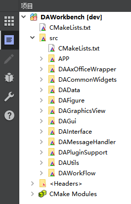
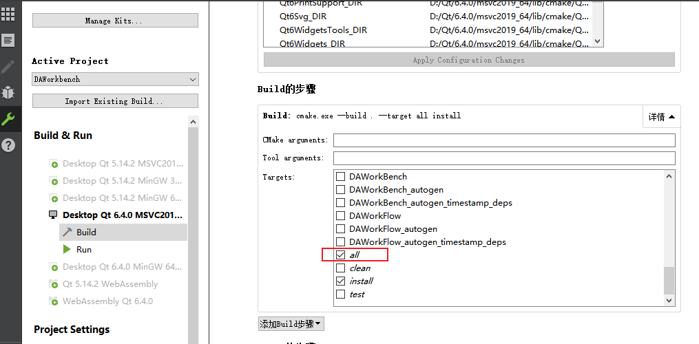

# 构建主程序

本文档介绍 DAWorkBench 主程序的构建方法，涵盖命令行和 Qt Creator 两种构建方式。

本文档介绍如何构建 DAWorkBench 主程序。构建前请确认已完成第三方库的构建，详见 [构建第三方库](./third-party-build.md)。

## 主要功能特性

**特性**

- ✅ **跨平台构建**：支持 Windows、Linux 平台
- ✅ **多 Qt 版本**：同时支持 Qt 5.14+ 和 Qt 6.x
- ✅ **命令行构建**：支持 CMake 命令行构建
- ✅ **IDE 构建**：支持 Qt Creator 图形化构建

---

## 命令行构建（推荐）

!!! warning "必须使用 Qt 工具链文件"
    构建项目**必须**指定 Qt 工具链文件（`qt.toolchain.cmake`），否则会出现 Windows SDK 头文件找不到的问题。

### Windows PowerShell

以下命令展示了 Windows 平台使用 PowerShell 构建主程序的完整流程。命令中包含详细的中文注释说明各参数的作用。

```powershell
# 进入项目根目录
# 所有构建命令需在项目根目录下执行
cd C:\path\to\data-workbench

# 配置项目（必须指定 Qt 工具链文件）
# -S 指定源码目录，-B 指定构建目录（build 目录可复用）
# CMAKE_TOOLCHAIN_FILE 用于正确识别 Windows SDK 和 Qt 环境
cmake -S . -B build -G Ninja `
    -DCMAKE_BUILD_TYPE:STRING=Release `
    -DCMAKE_EXPORT_COMPILE_COMMANDS:BOOL=TRUE `
    -DCMAKE_TOOLCHAIN_FILE:FILEPATH="D:\Qt\6.7.3\msvc2019_64\lib\cmake\Qt6\qt.toolchain.cmake"

# 构建项目（使用所有 CPU 核心）
# --parallel 启用并行编译，充分利用多核处理器
cmake --build build --config Release --parallel

# 安装到 bin 目录
# install 目标将编译产物复制到 bin_{配置信息} 输出目录
cmake --build build --config Release --target install
```

构建完成后，输出目录为 `bin_Release_qt6.7.3_MSVC_x64`，包含主程序可执行文件和所有依赖库。

### Linux Bash

Linux 平台的构建流程与 Windows 相似，主要差异在于路径格式和工具链文件位置。以下命令适用于 GCC 编译环境。

```bash
# 进入项目根目录
cd /path/to/data-workbench

# 配置项目
# Linux 下 Qt 通常安装在 /opt/Qt 或 ~/Qt 目录
cmake -S . -B build -G Ninja \
    -DCMAKE_BUILD_TYPE:STRING=Release \
    -DCMAKE_EXPORT_COMPILE_COMMANDS:BOOL=TRUE \
    -DCMAKE_TOOLCHAIN_FILE:FILEPATH=/opt/Qt/6.7.3/gcc_64/lib/cmake/Qt6/qt.toolchain.cmake

# 构建项目
cmake --build build --config Release --parallel

# 安装到 bin 目录
cmake --build build --config Release --target install
```

构建输出目录为 `bin_Release_qt6.7.3_GCC_x64`。

### CMake 参数说明

| 参数 | 必需 | 说明 |
|------|:----:|------|
| `-DCMAKE_TOOLCHAIN_FILE` | ✅ | Qt 工具链文件路径，**必须指定** |
| `-DCMAKE_BUILD_TYPE` | ✅ | 构建类型：`Debug` 或 `Release` |
| `-G Ninja` | 推荐 | 使用 Ninja 生成器，构建更快 |
| `-DCMAKE_EXPORT_COMPILE_COMMANDS` | 可选 | 生成 LSP 配置文件 |

---

## Qt Creator 构建

### 1. 打开项目

打开 Qt Creator，选择 **文件** → **打开文件或项目**（`Ctrl+O`），选择项目根目录下的 `CMakeLists.txt` 文件。



### 2. 选择构建模式

切换到项目模式（`Ctrl+5`），Build 步骤选择 `all`，如需安装可勾选 `install`。



### 3. 配置工具链文件

!!! warning "手动指定工具链文件"
    如果 Qt Creator 无法正确检测 Windows SDK，需要手动配置 CMake 参数：
    
    1. 打开 **项目** → **构建设置**
    2. 在 **CMake** 配置中添加参数：
       ```
       -DCMAKE_TOOLCHAIN_FILE:FILEPATH=D:/Qt/6.7.3/msvc2019_64/lib/cmake/Qt6/qt.toolchain.cmake
       ```

### 4. 编译和运行

点击运行（`Ctrl+R`）进行编译和安装。

!!! tip "首次运行提示"
    编译完的首次运行可能报错，因为第三方库的 DLL 未复制到构建目录。需要手动把第三方库的 DLL 复制到构建目录下的 bin 文件夹中，包括 `zlib.dll`（quazip 的依赖）。

---

## 第三方库路径设置

!!! info "默认配置"
    如果未修改第三方库安装路径，此步骤可省略。

主项目的 `CMakeLists.txt` 已预配置第三方库路径。以下代码展示了第三方库查找路径的定义方式，CMake 通过这些路径定位已安装的库：

```cmake
# 定义第三方库路径
# DA_INSTALL_LIB_CMAKE_PATH 是安装目录下的 cmake 配置路径
set(SARibbonBar_DIR ${DA_INSTALL_LIB_CMAKE_PATH}/SARibbonBar)
set(DALiteCtk_DIR ${DA_INSTALL_LIB_CMAKE_PATH}/DALiteCtk)
set(qwt_DIR ${DA_INSTALL_LIB_CMAKE_PATH}/qwt)
set(QtPropertyBrowser_DIR ${DA_INSTALL_LIB_CMAKE_PATH}/QtPropertyBrowser)
set(spdlog_DIR ${DA_INSTALL_LIB_CMAKE_PATH}/spdlog)
set(tsl-ordered-map_DIR ${DA_INSTALL_LIB_SHARE_PATH}/tsl-ordered-map)
# qt${QT_VERSION_MAJOR}advanceddocking 根据 Qt 版本自动选择 qt5 或 qt6
set(qt${QT_VERSION_MAJOR}advanceddocking_DIR ${DA_INSTALL_LIB_CMAKE_PATH}/qt${QT_VERSION_MAJOR}advanceddocking)
```

如修改了安装路径，需在构建时通过 CMake 参数指定正确位置。

---

## 构建输出目录

构建输出目录命名规则：

```
bin_{BuildType}_qt{QtVersion}_{Compiler}_{Arch}
```

| 构建配置 | 输出目录示例 |
|----------|-------------|
| Qt 6.7.3, Release, MSVC, x64 | `bin_Release_qt6.7.3_MSVC_x64` |
| Qt 5.15.2, Debug, MSVC, x64 | `bin_Debug_qt5.15.2_MSVC_x64` |
| Qt 6.7.3, Release, GCC, x64 | `bin_Release_qt6.7.3_GCC_x64` |

---

## 验证构建

以下命令用于检查构建产物是否正确生成。首先检查可执行文件和动态库是否存在，然后启动程序验证功能是否正常。

```powershell
# Windows - 检查输出文件
# 应显示 DataWorkbench.exe（或 DAWorkbench.exe）
dir bin_Release_qt6.7.3_MSVC_x64\*.exe

# Windows - 检查动态库
# 应显示 DAFigure.dll、DAData.dll 等核心模块
dir bin_Release_qt6.7.3_MSVC_x64\*.dll

# 运行程序
# 启动主程序验证构建结果
.\bin_Release_qt6.7.3_MSVC_x64\DAWorkbench.exe
```

程序启动后显示主窗口界面，表示构建成功。如果出现 DLL 缺失错误，请参考下一节解决。

---

## 常见问题

### DLL 缺失

运行时提示缺少 DLL，可使用 Qt 自带的 `windeployqt` 工具自动复制依赖。该工具会分析可执行文件的依赖并复制所需的 Qt 库。

```powershell
# 进入输出目录
cd bin_Release_qt6.7.3_MSVC_x64

# 使用 windeployqt 自动部署 Qt 依赖
# 此命令会复制 Qt 核心 DLL 和插件到当前目录
windeployqt DAWorkbench.exe
```

执行后，程序目录将包含所有必需的 Qt 依赖库。

### 第三方库找不到

确保第三方库已正确编译并安装。参考 [构建第三方库](./third-party-build.md)。

---

## 参考资料

- [构建说明](./build-instructions.md) - 完整构建指南
- [Python 环境配置](./python-environment.md) - Python 环境设置
- [Qt CMake 手册](https://doc.qt.io/qt-6/cmake-manual.html)