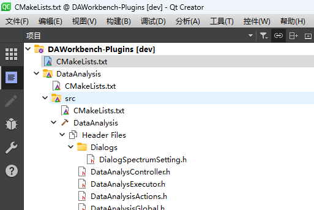

# 构建插件

`data-workbench`一切业务功能均通过plugin提供，如果不构建`plugins`,编译完的`data-workbench`无任何功能，在构建插件之前，请确认已经完成了主程序的构建，具体见：[构建主程序](./构建主程序.md)

## 基于CMake构建`data-workbench plugins`

1. 打开Qt Creator，文件->打开文件或项目（`Ctrl+O`），选择`plugins/CMakeLists.txt`文件

    

步骤和[构建主程序](./构建主程序.md)所演示的操作一致，这里不再赘述

最后编译完成后，在`bin_qt{version}_{MSVC/GNU}_x{64/32}`目录下生成plugins文件夹，里面是编译好的插件dll

