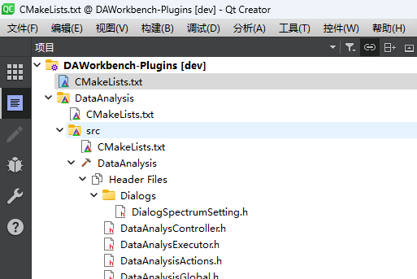

# 构建插件

`data-workbench` 的业务功能均通过插件提供，如果不构建 `plugins`，编译完成的 `data-workbench` 将无任何功能。在构建插件之前，请确认已经完成了主程序的构建，具体见：[构建主程序](./main-program-build.md)。

## 主要功能特性

**特性**

- ✅ **模块化构建**：支持独立构建单个或多个插件
- ✅ **自动安装**：构建完成后自动安装到指定目录
- ✅ **版本管理**：支持插件版本号定义
- ✅ **依赖管理**：自动处理插件与主程序、第三方库的依赖关系

## 插件构建前置条件

### 1. 主程序构建完成

插件构建依赖于主程序安装后生成的 CMake 配置文件，必须先完成主程序的构建和安装。主程序安装后会在安装目录生成以下必要文件：

```
{安装目录}/
├── bin/                          # 主程序可执行文件
├── lib/cmake/DAWorkbench/        # CMake 配置文件
│   ├── DAWorkbenchConfig.cmake
│   └── daworkbench_plugin_utils.cmake
└── ...
```

!!! warning "重要提示"
    如果主程序未安装，插件构建将无法找到 `DAWorkbenchConfig.cmake` 文件，导致 CMake 配置失败。

### 2. 第三方库已安装

插件依赖主程序使用的第三方库，确保已完成 [构建第三方库](./third-party-build.md)。

### 3. 开发环境要求

| 依赖项 | 版本要求 | 说明 |
|--------|----------|------|
| CMake | 3.10+ | 构建系统 |
| Qt | 5.14+ 或 Qt6 | 界面框架 |
| C++ 编译器 | C++17 支持 | MSVC 2019+ / GCC 7+ / Clang 5+ |

## 基于 Qt Creator 构建插件

### 1. 打开插件项目

打开 Qt Creator，选择 **文件 → 打开文件或项目**（快捷键 `Ctrl+O`），选择 `plugins/CMakeLists.txt` 文件：



### 2. 配置构建目录

在配置向导中，选择构建目录。建议将构建目录设置在 `plugins` 同级目录下，例如：

```
data-workbench/
├── build-plugins-Qt6-Release/    # 插件构建目录
├── plugins/
└── ...
```

### 3. 设置 CMake 参数

如果主程序安装路径非默认路径，需要设置 `DAWorkbench_INSTALL_PATH` 变量：

```cmake
# 指定 DAWorkbench 安装路径
-DDAWorkbench_INSTALL_PATH=/path/to/install/dir
```

### 4. 编译和安装

点击运行（`Ctrl+R`）进行编译，编译完成后执行安装步骤。

!!! info "提示"
    构建和安装的操作步骤与 [构建主程序](./main-program-build.md) 类似，可参考该文档了解详细操作。

## 基于命令行构建插件

### 使用 CMake 命令行

对于习惯使用命令行的开发者，可以使用以下命令构建插件：

```bash
# 进入插件目录
cd plugins

# 创建构建目录
mkdir build && cd build

# 配置项目（以 Qt6 + MSVC 为例）
cmake -G "Ninja" \
    -DCMAKE_BUILD_TYPE=Release \
    -DCMAKE_TOOLCHAIN_FILE=/path/to/Qt6/lib/cmake/Qt6/qt.toolchain.cmake \
    -DDAWorkbench_INSTALL_PATH=/path/to/install/dir \
    ..

# 构建插件
cmake --build . --config Release

# 安装插件
cmake --install .
```

## 插件安装位置

插件编译完成后，会自动安装到主程序安装目录下的 `plugins` 文件夹。

### 安装目录结构

```
{安装目录}/
├── bin/
│   ├── DAWorkbench.exe          # 主程序
│   └── plugins/                  # 插件目录
│       ├── DataAnalysis.dll      # 数据分析插件
│       └── ...
└── lib/
    └── cmake/
        └── DAWorkbench/
            └── daworkbench_plugin_utils.cmake
```

### 插件文件命名

| 文件类型 | 命名规则 | 说明 |
|----------|----------|------|
| Windows | `PluginName.dll` | 动态链接库 |
| Linux | `libPluginName.so` | 共享对象库 |
| macOS | `libPluginName.dylib` | 动态库 |

## 验证插件加载

### 1. 启动主程序

运行 `DAWorkbench.exe`（或 Linux/macOS 对应可执行文件），查看主界面是否加载插件功能。

### 2. 检查插件列表

通过菜单 **帮助 → 关于插件** 查看已加载的插件列表：


### 3. 验证插件功能

根据插件类型，验证相关功能是否可用：

- **DataAnalysis 插件**：检查数据分析菜单和工具栏是否出现
- **自定义插件**：检查插件注册的功能节点或界面是否正常显示

### 4. 常见问题排查

!!! warning "插件加载失败"
    如果插件未正常加载，请检查以下问题：

    1. **依赖库缺失**：确保所有第三方库 DLL 文件已复制到 `bin` 目录
    2. **版本不匹配**：插件与主程序版本需要兼容
    3. **路径问题**：确保插件位于正确的 `bin/plugins` 目录下
    4. **Qt 版本**：插件和主程序需使用相同版本的 Qt 编译

### 5. 日志查看

如果插件加载出现问题，可以查看运行日志：

```bash
# Windows
type %APPDATA%\DAWorkbench\logs\latest.log

# Linux/macOS
cat ~/.config/DAWorkbench/logs/latest.log
```

日志文件中会记录插件加载过程中的错误信息，便于问题定位。

## 插件开发相关

如果需要开发自定义插件，请参考以下文档：

- [创建插件项目](../dev-guide/plugin-project-create.md)：了解插件项目结构和 CMake 配置
- [插件与接口](../dev-guide/plugins-interfaces.md)：了解插件开发接口
- [插件开发创建 UI](../dev-guide/plugin-dev-create-ui.md)：了解如何为插件创建用户界面