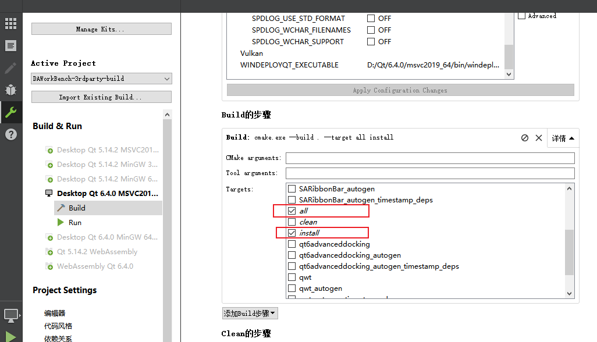

# 第三方库构建

第三方库的cmake文件位于:

```txt
src\3rdparty\CMakeLists.txt
```

此文件不属于上级工程，构建第三方库直接用cmake打开此文件构建即可，这里面已经把第三方库的基本设置配置好

构建后需要进行安装（`install`），安装完成后会在工程目录下生成`bin_qt{version}_{MSVC/GNU}_x{64/32}`的安装目录，`data-workbench`的主体构建需要依赖此目录

## CMake构建所有第三方库

1. 打开Qt Creator，文件->打开文件或项目（`Ctrl+O`），选择`src/3rdparty/CMakeLists.txt`文件


2. 切换到项目模式（`Ctrl+5`）,Build步骤选择all和install



3. 点击运行（`Ctrl+R`）进行编译和安装


编译完成后你能看到`bin_qt{version}_{MSVC/GNU}_x{64/32}`的安装目录，假如是用qt6.4+msvc,将生成`bin_qt6.4.0_MSVC_x64`这样的目录

目录里是所有第三方库的必要内容