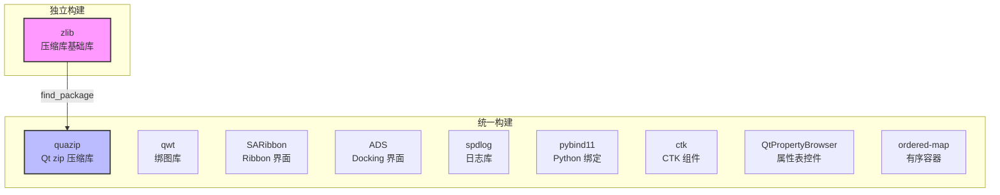

# 第三方库构建

本文档介绍 data-workbench 项目依赖的第三方库构建方法。第三方库使用 CMake 构建，需要按照特定顺序进行。

## 第三方库列表

项目依赖以下第三方库：

| 库名称 | 版本 | 用途 | 依赖关系 |
|--------|------|------|----------|
| zlib | - | 压缩库基础库 | 无依赖 |
| quazip | - | Qt zip 压缩库 | 依赖 zlib |
| qwt | - | 高效绑图库 | 无依赖 |
| SARibbon | - | Ribbon 界面库 | 无依赖 |
| ADS | - | Docking 界面库 | 无依赖 |
| spdlog | - | 高效日志库 | 无依赖 |
| pybind11 | - | Python 绑定库 | 无依赖 |
| ctk | - | 精简 CTK 组件库 | 无依赖 |
| QtPropertyBrowser | - | Qt 属性表控件 | 无依赖 |
| ordered-map | - | 有序 map 容器 | 无依赖 |

## 依赖关系图


```mermaid
flowchart TD
    subgraph 独立构建
        A[zlib<br/>压缩库基础库]
    end
    
    subgraph 统一构建
        B[quazip<br/>Qt zip 压缩库]
        C[qwt<br/>绑图库]
        D[SARibbon<br/>Ribbon 界面]
        E[ADS<br/>Docking 界面]
        F[spdlog<br/>日志库]
        G[pybind11<br/>Python 绑定]
        H[ctk<br/>CTK 组件]
        I[QtPropertyBrowser<br/>属性表控件]
        J[ordered-map<br/>有序容器]
    end
    
    A -->|find_package| B
    
    style A fill:#f9f,stroke:#333,stroke-width:2px
    style B fill:#bbf,stroke:#333,stroke-width:2px
```

!!! warning "构建顺序要求"
    由于 quazip 依赖 zlib，必须先独立构建并安装 zlib，然后再构建其他第三方库。

## 构建步骤

### 前置条件

- CMake 3.16+
- C++17 兼容编译器（MSVC 2019+ 或 GCC 9+）
- Qt 5.14+ 或 Qt 6
- Ninja 构建工具（推荐）

### 步骤一：构建 zlib

zlib 是纯 C 库，需要独立构建并安装到系统目录，以便后续构建能通过 `find_package` 找到。

```powershell
# 进入 zlib 目录
cd src/3rdparty/zlib

# 配置项目（使用 Qt 工具链文件）
cmake -S . -B build -G Ninja `
    -DCMAKE_BUILD_TYPE:STRING=Release `
    -DCMAKE_TOOLCHAIN_FILE:FILEPATH="D:\Qt\6.7.3\msvc2019_64\lib\cmake\Qt6\qt.toolchain.cmake"

# 构建
cmake --build build --config Release --parallel

# 安装到系统目录（需要管理员权限）
cmake --build build --config Release --target install
```

!!! tip "Qt 工具链文件路径"
    请根据实际 Qt 安装路径修改 `qt.toolchain.cmake` 的路径。常见路径格式：
    
    - Qt6: `D:\Qt\6.7.3\msvc2019_64\lib\cmake\Qt6\qt.toolchain.cmake`
    - Qt5: `D:\Qt\5.15.2\msvc2019_64\lib\cmake\Qt5\qt.toolchain.cmake`

!!! warning "管理员权限"
    安装到系统目录需要管理员权限。如果不想安装到系统目录，可以指定 `CMAKE_INSTALL_PREFIX`：
    
    ```powershell
    cmake -S . -B build -G Ninja `
        -DCMAKE_BUILD_TYPE:STRING=Release `
        -DCMAKE_INSTALL_PREFIX:PATH="C:\local\zlib" `
        -DCMAKE_TOOLCHAIN_FILE:FILEPATH="..."
    ```

### 步骤二：构建其他第三方库

zlib 安装完成后，使用项目提供的 CMakeLists.txt 构建其他第三方库。

```powershell
# 进入第三方库目录
cd src/3rdparty

# 配置项目
cmake -S . -B build -G Ninja `
    -DCMAKE_BUILD_TYPE:STRING=Release `
    -DCMAKE_EXPORT_COMPILE_COMMANDS:BOOL=TRUE `
    -DCMAKE_TOOLCHAIN_FILE:FILEPATH="D:\Qt\6.7.3\msvc2019_64\lib\cmake\Qt6\qt.toolchain.cmake"

# 构建所有第三方库
cmake --build build --config Release --parallel

# 安装到项目目录
cmake --build build --config Release --target install
```

!!! note "自动查找 zlib"
    CMake 会自动通过 `find_package(ZLIB)` 查找已安装的 zlib。如果找不到，请设置 `ZLIB_DIR` 环境变量：
    
    ```powershell
    $env:ZLIB_DIR = "C:\local\zlib"
    ```

### 步骤三：验证安装

安装完成后，检查安装目录：

```powershell
# 查看生成的安装目录
ls ..\bin_Release_qt*
```

安装目录命名格式：`bin_{BuildType}_qt{QtVersion}_{Compiler}_{Arch}`

例如：
- `bin_Release_qt6.7.3_MSVC_x64`
- `bin_Debug_qt5.15.2_GNU_x64`

## 安装目录结构

安装目录包含以下内容：

```
bin_Release_qt6.7.3_MSVC_x64/
├── bin/                    # 可执行文件和动态库
│   ├── qwt.dll
│   ├── SARibbon.dll
│   ├── qtpropertybrowser.dll
│   ├── quazip.dll
│   └── ...
├── lib/                    # 静态库和导入库
│   ├── qwt.lib
│   ├── SARibbon.lib
│   ├── spdlog.lib
│   └── ...
├── include/                # 头文件
│   ├── qwt/
│   ├── SARibbon/
│   ├── spdlog/
│   ├── pybind11/
│   └── ...
└── cmake/                  # CMake 配置文件
    ├── qwt/
    ├── SARibbon/
    └── ...
```

## 使用 Qt Creator 构建

除了命令行方式，也可以使用 Qt Creator 进行构建：

### 构建 zlib

1. 打开 Qt Creator，选择 **文件 → 打开文件或项目**（`Ctrl+O`）
2. 选择 `src/3rdparty/zlib/CMakeLists.txt`
3. 配置项目，选择合适的 Qt Kit
4. 切换到项目模式（`Ctrl+5`），Build 步骤选择 `all` 和 `install`
5. 点击运行（`Ctrl+R`）进行编译和安装

### 构建其他第三方库

1. 打开 Qt Creator，选择 **文件 → 打开文件或项目**（`Ctrl+O`）
2. 选择 `src/3rdparty/CMakeLists.txt`
3. 配置项目，选择合适的 Qt Kit
4. 切换到项目模式（`Ctrl+5`），Build 步骤选择 `all` 和 `install`
5. 点击运行（`Ctrl+R`）进行编译和安装

## 主项目构建

第三方库构建完成后，可以构建 data-workbench 主项目：

```powershell
# 返回项目根目录
cd ../..

# 配置主项目
cmake -S . -B build -G Ninja `
    -DCMAKE_BUILD_TYPE:STRING=Release `
    -DCMAKE_EXPORT_COMPILE_COMMANDS:BOOL=TRUE `
    -DCMAKE_TOOLCHAIN_FILE:FILEPATH="D:\Qt\6.7.3\msvc2019_64\lib\cmake\Qt6\qt.toolchain.cmake"

# 构建主项目
cmake --build build --config Release --parallel
```

!!! tip "自动链接第三方库"
    主项目的 CMakeLists.txt 会自动在 `bin_*` 目录下查找已安装的第三方库。

## 常见问题

### moc 程序异常退出

**现象**：首次构建时出现 moc 相关错误。

**解决方案**：重新运行构建命令，这是 Qt moc 程序在处理大量项目时的已知问题。

```powershell
# 重新构建
cmake --build build --config Release --parallel
```

### 找不到 zlib

**现象**：构建 quazip 时报错找不到 zlib。

**解决方案**：

1. 确认 zlib 已正确安装
2. 设置 `ZLIB_DIR` 环境变量指向 zlib 安装目录
3. 或在 CMake 配置时指定 `-DZLIB_ROOT=...`

```powershell
# 方式一：设置环境变量
$env:ZLIB_ROOT = "C:\local\zlib"

# 方式二：CMake 参数
cmake -S . -B build -DZLIB_ROOT="C:\local\zlib" ...
```

### Qt 工具链文件路径错误

**现象**：CMake 配置时找不到 Windows SDK 或 Qt 组件。

**解决方案**：确保使用正确的 Qt 工具链文件路径，路径格式为：

```
{Qt安装目录}/{Qt版本}/{编译器}/lib/cmake/Qt{主版本}/qt.toolchain.cmake
```

## 参数说明

| 参数 | 说明 |
|------|------|
| `-DCMAKE_BUILD_TYPE` | 构建类型：`Debug` 或 `Release` |
| `-DCMAKE_TOOLCHAIN_FILE` | Qt 工具链文件路径，**必须指定** |
| `-DCMAKE_INSTALL_PREFIX` | 安装路径，默认为项目根目录下的 `bin_*` 目录 |
| `-G Ninja` | 使用 Ninja 生成器，推荐 |
| `--parallel` | 并行构建，加速编译过程 |

## 参考资料

- [项目构建指南](build.md)
- [开发环境配置](dev-env.md)
- 第三方库目录：`src/3rdparty/`