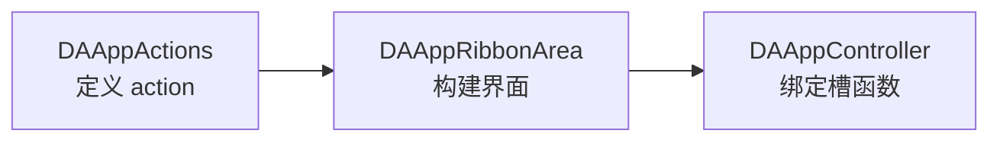

# Action 添加方法

Action 添加方法文档介绍如何在 DAWorkBench 主程序中添加新的菜单项和工具栏按钮。

## 主要功能特性

**特性**

- ✅ **集中管理**：所有内置 action 位于 `DAAppActions` 类统一管理
- ✅ **界面分离**：界面构建位于 `DAAppRibbonArea`，逻辑绑定位于 `DAAppController`
- ✅ **国际化支持**：所有文本通过 `retranslateUi()` 方法支持多语言
- ✅ **标准化流程**：三步完成 action 添加：定义、构建、绑定

!!! warning "适用范围"
    此文档针对主程序的 action 添加，非插件开发。如需开发插件，请参考[插件开发指南](./plugin-project-create.md)。

## 添加流程概述

一个 action 的添加需要在三个类中操作：



| 步骤 | 类 | 职责 |
|------|-----|------|
| 1 | `DAAppActions` | 定义和初始化 action |
| 2 | `DAAppRibbonArea` | 将 action 添加到界面（Ribbon） |
| 3 | `DAAppController` | 绑定 action 的信号槽 |

## 完整示例：添加"打开"功能

### 步骤 1：在 `DAAppActions` 中定义 action

**头文件 (DAAppActions.h)**

```cpp
class DAAppActions
{
public:
    QAction* actionOpen;  ///< 打开
    // ...
};
```

**源文件 (DAAppActions.cpp)**

```cpp
void DAAppActions::buildMainAction()
{
    // 创建 action
    actionOpen = createAction("actionOpen", ":/app/bright/Icon/file.svg");
    // ...
}

void DAAppActions::retranslateUi()
{
    // 设置文本（支持国际化）
    actionOpen->setText(tr("Open"));                     // cn:打开
    actionOpen->setToolTip(tr("Open file or project"));  // cn:打开文件或项目
    // ...
}
```

!!! tip "文本国际化"
    所有文本相关的操作都放在 `retranslateUi()` 函数中，这样可以根据语言进行翻译。

### 步骤 2：在 `DAAppRibbonArea` 中构建界面

**源文件 (DAAppRibbonArea.cpp)**

```cpp
/**
 * @brief 构建主页标签
 * 主页的 category objname = da-ribbon-category-main
 */
void DAAppRibbonArea::buildRibbonMainCategory()
{
    // 创建面板
    m_pannelMainFileOpt = new SARibbonPannel(m_categoryMain);
    m_pannelMainFileOpt->setObjectName(QStringLiteral("da-ribbon-pannel-main.common"));
    
    // 添加 action 到面板
    m_pannelMainFileOpt->addLargeAction(m_actions->actionOpen);
    // ...
}
```

### 步骤 3：在 `DAAppController` 中绑定槽函数

**头文件 (DAAppController.h)**

```cpp
class DAAppController : public QObject
{
    Q_OBJECT
    
public Q_SLOTS:
    // 打开文件
    void open();
    // ...
};
```

**源文件 (DAAppController.cpp)**

```cpp
void DAAppController::initConnection()
{
    // 绑定信号槽
    connect(mActions->actionOpen, &QAction::triggered, 
            this, &DAAppController::open);
    // ...
}

void DAAppController::open()
{
    // 实现打开逻辑
    QString fileName = QFileDialog::getOpenFileName(
        mMainWindow,
        tr("Open Project"),
        QString(),
        tr("DA Project (*.dapro)")
    );
    
    if (!fileName.isEmpty()) {
        mProject->load(fileName);
    }
}
```

## createAction 方法说明

`DAAppActions` 提供 `createAction` 方法简化 action 创建：

```cpp
QAction* DAAppActions::createAction(const QString& objName, const QString& iconPath)
{
    QAction* action = new QAction(this);
    action->setObjectName(objName);
    
    if (!iconPath.isEmpty()) {
        action->setIcon(QIcon(iconPath));
    }
    
    return action;
}
```

| 参数 | 说明 |
|------|------|
| `objName` | action 的 objectName，用于样式和查找 |
| `iconPath` | 图标资源路径 |

## SARibbonPannel 添加方式

SARibbonPannel 提供多种添加 action 的方法：

| 方法 | 说明 |
|------|------|
| `addLargeAction(action)` | 大按钮（主要功能） |
| `addMediumAction(action)` | 中等按钮 |
| `addSmallAction(action)` | 小按钮 |
| `addAction(action, size)` | 指定大小添加 |

```cpp
// 大按钮 - 占一整行
pannel->addLargeAction(actionOpen);

// 中等按钮 - 两列布局
pannel->addMediumAction(actionSave);
pannel->addMediumAction(actionSaveAs);

// 小按钮 - 三列布局
pannel->addSmallAction(actionCut);
pannel->addSmallAction(actionCopy);
pannel->addSmallAction(actionPaste);
```

## 添加分隔符

```cpp
// 添加分隔符
pannel->addSeparator();

// 添加菜单按钮
QMenu* menu = new QMenu(pannel);
menu->addAction(actionNew);
menu->addAction(actionOpen);
pannel->addLargeActionButton(actionRecent, menu);
```

## 注意事项

!!! warning "初始化顺序"
    - action 创建在 `DAAppActions::buildMainAction()` 中
    - 界面构建在 `DAAppRibbonArea` 中
    - 信号绑定在 `DAAppController::initConnection()` 中
    必须按正确顺序执行，否则可能出现空指针问题。

!!! tip "资源管理"
    action 由 `DAAppActions` 管理，无需手动删除。使用 `setObjectName` 设置唯一标识，便于调试。

!!! note "图标路径"
    图标路径使用 Qt 资源系统格式：`:/prefix/path/icon.svg`

## 参考资料

- [SARibbon 使用指南](https://github.com/czyt1988/SARibbon)
- [Qt QAction 文档](https://doc.qt.io/qt-5/qaction.html)
- [插件开发指南](./plugin-project-create.md)