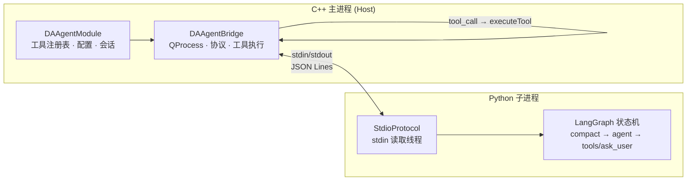
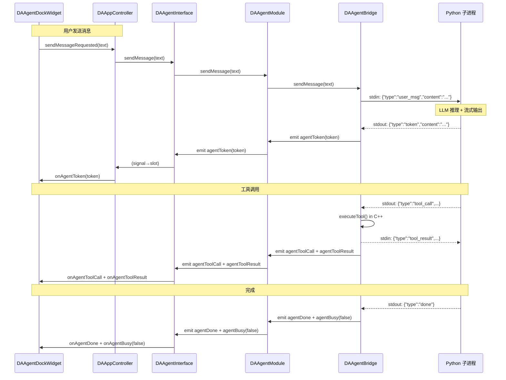
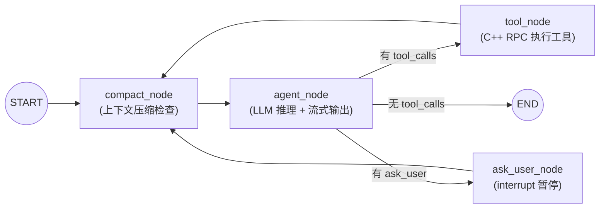

# 架构设计

Agent 模块采用 C++ + Python 双进程架构，通过 stdin/stdout 管道的 JSON Lines 协议实现进程间通信。本文档详细阐述架构设计、模块职责、信号链路和核心设计决策。

---

## 双进程模型

Agent 的核心设计理念是**进程隔离**：LLM 推理运行在独立 Python 子进程中，C++ 主进程管理工具执行与会话持久化。这种设计带来三个关键优势：

1. **故障隔离**：Python 子进程崩溃或 LLM API 超时不会影响 C++ 主程序的稳定性
2. **技术栈解耦**：LLM 生态（LangChain/LangGraph）在 Python 侧原生运行，无需 C++ 封装
3. **资源管理**：子进程可随时重启恢复，主进程状态不受影响



### C++ 侧职责

C++ 主进程承担全部业务逻辑和资源管理：

- **工具执行**：LLM 只拿到工具 schema（OpenAI function 格式），工具的实际执行由 `DAAgentBridge::executeTool()` 在主进程完成，结果经 stdin 回传
- **会话持久化**：`DAAgentSessionStore` 以 JSONL 格式管理对话历史，支持多会话切换、工程导出导入
- **LLM 配置管理**：`DAAgentModule` 读写 `agent-config.ini`，API Key 通过 Windows DPAPI 加密存储
- **UI 通信**：通过 `DAAgentInterface` 的 14 个信号与 `DAAgentDockWidget` 通信

### Python 侧职责

Python 子进程专注于 LLM 推理：

- **LLM 交互**：通过 `langchain-openai` 的 `ChatOpenAI` 客户端调用 LLM API（兼容 OpenAI 接口的任意模型）
- **LangGraph 状态机**：驱动 agent 循环（compact → agent → tools/ask_user），管理对话状态
- **上下文管理**：Token 估算、上下文压缩、工具结果截断
- **重试逻辑**：指数退避重试，支持用户中断

---

## 模块职责

### DAAgent 模块（`src/DAAgent/`）

DAAgent 位于五层架构的接口层（Layer 4），是**纯 agent 框架库**，不依赖任何 GUI 模块（无 DAGui/DAFigure/qwt/ADS）。

| 文件 | 类 | 职责 |
|------|-----|------|
| `DAAgentInterface.h` | `DAAgentInterface` | 公共接口（抽象基类）：14 个信号 + 工具/提示词注册 + LLM 配置 + 会话管理 |
| `DAAgentModule.h/.cpp` | `DAAgentModule` | 接口实现：工具注册表、系统提示词组装、懒启动、配置读写（agent-config.ini + DPAPI 加密） |
| `DAAgentBridge.h/.cpp` | `DAAgentBridge` | QProcess 生命周期管理、JSON Lines 协议解析、工具执行、崩溃恢复、看门狗 |
| `DAAgentSessionStore.h/.cpp` | `DAAgentSessionStore` | 会话持久化层（非 QObject，PIMPL）：JSONL 读写、索引、清理、标题 |
| `DAAbstractAgentTool.h` | `DAAbstractAgentTool` | 工具抽象基类（纯虚）：`getToolSpec` / `execute` / `getOwnerModule` |
| `DAAgentToolBase.h/.cpp` | `DAAgentToolBase` | 瘦工具基类（`DAAgent_API` 导出）：数据访问 + 响应方法，供插件跨 DLL 继承 |
| `system_prompt.md` | — | 外部可编辑的系统提示词（运行时由 `assembleSystemPrompt()` 读取） |

### DAGui 模块（`src/DAGui/Agent/`）

聊天 UI 属于 DAGui 模块，与 DAAgent 互不依赖。

| 文件 | 类 | 职责 |
|------|-----|------|
| `DAAgentDockWidget.h/.cpp` | `DAAgentDockWidget` | 聊天面板（继承 QWidget，非 QDockWidget），持有 QWebEngineView + 输入框 + 会话下拉 |
| `DAAgentWebChannel.h/.cpp` | `DAAgentWebChannel` | C++↔JS 桥（QObject），注册名 `chatBridge`，JS↔C++ 双向调用 |
| `resources/` | — | 前端资源：`chat.html` + `chat.js` + `chat.css` + markdown-it + highlight.js |

### Python 子进程（`src/PyScripts/DAWorkbench/agent/`）

| 文件 | 职责 |
|------|------|
| `agent_runner.py` | 唯一入口脚本（912 行）：协议收发、LLM 配置、LangGraph 图构建、agent 循环 |
| `context_manager.py` | Token 估算（tiktoken/char-based）、工具结果截断、上下文压缩（head/tail + 中间摘要） |
| `error_classifier.py` | LLM API 异常分类（可重试/不可重试），提取 Retry-After 头 |
| `retry_wrapper.py` | 指数退避重试，支持 stop_event 中断、retryable_check 回调 |

---

## 信号链路

> 决策 D3b：DAGui 与 DAAgent 互不依赖，Dock 的信号↔槽由 APP 层 `DAAppController::initialize()` 直接 connect。



### 接口↔Dock 连接清单

**接口信号 → Dock 槽（13 条）**：在 `DAAppController::initialize()` 中 connect。

| 接口信号 | Dock 槽 | 用途 |
|---------|---------|------|
| `agentToken` | `onAgentToken` | 流式 token 渲染 |
| `agentMessageComplete` | `onAgentMessageComplete` | 消息完成 |
| `agentToolCall` | `onAgentToolCall` | 工具调用显示 |
| `agentToolResult` | `onAgentToolResult` | 工具结果显示 |
| `agentQuestion` | `onAgentQuestion` | HITL 提问渲染 |
| `agentError` | `onAgentError` | 错误显示 |
| `agentReady` | `onAgentReady` | 就绪状态 |
| `agentBusy` | `onAgentBusy` | 忙碌状态切换 |
| `agentSessionLoaded` | `onAgentSessionLoaded` | 会话加载完成 |
| `tokenUsageUpdated` | `onAgentUsage` | Token 用量更新 |
| `sessionSwitched` | `onSessionSwitched` | 会话切换 |
| `sessionListChanged` | `onSessionListChanged` | 会话列表刷新 |
| `sessionCreated` | `onSessionCreated` | 新建会话 |

**Dock 信号 → 接口方法（7 条）**：

| Dock 信号 | 接口方法 | 用途 |
|-----------|---------|------|
| `sendMessageRequested` | `sendMessage` | 发送用户消息 |
| `stopRequested` | `stop` | 停止推理 |
| `userAnswerSelected` | `sendUserAnswer` | 用户回答 HITL 提问 |
| `sessionSwitchRequested` | `switchSession` | 切换会话 |
| `sessionDeleteRequested` | `deleteSession` | 删除会话 |
| `sessionRenameRequested` | `renameSession` | 重命名会话 |
| `sessionCreateRequested` | `newSession` | 新建会话（emit `sessionCreated` 触发 UI clearChat） |

---

## 核心设计决策

| 编号 | 决策 | 理由 |
|------|------|------|
| D1 | **子进程模型** | agent 推理在独立 Python 进程（QProcess），C++ 主进程崩溃/无响应不影响子进程 |
| D2 | **工具执行在 C++** | LLM 只拿到工具 schema，实际执行在主进程完成，避免 Python 侧重复实现 C++ 功能 |
| D3 | **懒启动** | 首次 `sendMessage()` 才启动子进程，减少启动开销 |
| D4 | **HITL 提问** | LangGraph `interrupt()/resume()` + 注入的 `ask_user` 工具实现人机交互 |
| D5 | **流式输出** | `llm.astream()` 逐 chunk 把 token 推给 UI 实时渲染 |
| D6 | **Windows asyncio 兼容** | 强制 `WindowsSelectorEventLoopPolicy`，stdin 用后台线程 `read1()` 读取 |
| D3b | **Dock 信号在 APP 层 connect** | DAGui 与 DAAgent 互不依赖，由 `DAAppController` 作为中介连接 |
| C | **工具插件化** | 16 个内置工具放独立插件 `plugins/DAAgentTools/`，通过 `registerTool` 注册 |
| E1 | **设置页在 APP 层** | 与其他设置页一致，经 `setAgentInterface` 注入接口持久化 |
| G2 | **工具基类拆分** | 瘦 `DAAgentToolBase`（数据+响应）留 DAAgent，图表方法搬插件 |

---

## 层级定位

DAAgent 位于五层架构的接口层（Layer 4）：

```
┌─────────────────────────────────────────┐
│ Layer 5: APP                            │
│  DAAppController (信号连接)              │
│  DAAgentSettingsWidget (设置页)          │
├─────────────────────────────────────────┤
│ Layer 4: 接口层                          │
│  DAAgent (纯框架库, 无 GUI 依赖)         │
│  DAInterface, DAPluginSupport           │
├─────────────────────────────────────────┤
│ Layer 3: 界面层                          │
│  DAGui/Agent (DAAgentDockWidget)        │
├─────────────────────────────────────────┤
│ Layer 2: 功能层                          │
│  DAData, DAPyBindQt, DAPyScripts        │
├─────────────────────────────────────────┤
│ Layer 1: 基础层                          │
│  DAUtils, DAShared                      │
└─────────────────────────────────────────┘
```

!!! note "DAGui 与 DAAgent 互不依赖"
    DAGui 不 link DAAgent，DAAgent 不 link DAGui。两者由 APP 层 `DAAppController::initialize()` 通过 `connect()` 协调。这使得 agent 框架可以独立于 UI 使用（如未来支持命令行 agent 模式）。

---

## LangGraph 状态机

Python 侧的 agent 推理由 LangGraph 状态机驱动：



| 节点 | 职责 |
|------|------|
| `compact_node` | 在每轮 agent 推理前检查上下文是否需要压缩；不需要时返回空消息列表（零开销）；有 3 次熔断器 |
| `agent_node` | 插入系统提示词，流式调用 LLM，根据返回的 `tool_calls` 路由到不同节点；有溢出恢复 |
| `tool_node` | 对每个 tool_call，通过 JSON Lines RPC 回调 C++ 执行工具，构造 `ToolMessage` 入状态 |
| `ask_user_node` | 调用 LangGraph `interrupt()` 暂停图执行，等待用户回答后 `resume()` 继续 |

---

## 参见

- [通信协议](protocol.md) — JSON Lines 协议的完整规范
- [上下文管理](context-management.md) — compact_node 的压缩机制详解
- [崩溃恢复与重连](crash-recovery.md) — 进程生命周期与自动重启
- [工具开发指南](tool-development.md) — 工具基类与注册机制
- `src/DAAgent/AGENTS.md` — 模块 AI 开发必读指南
