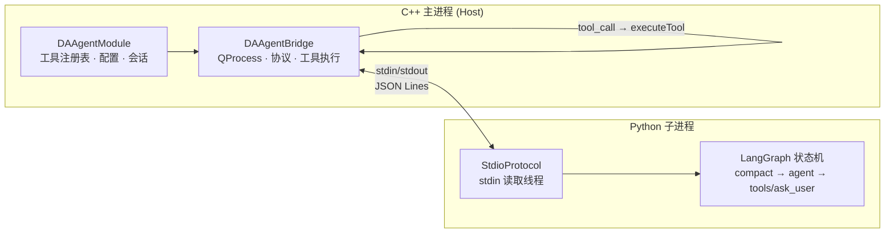
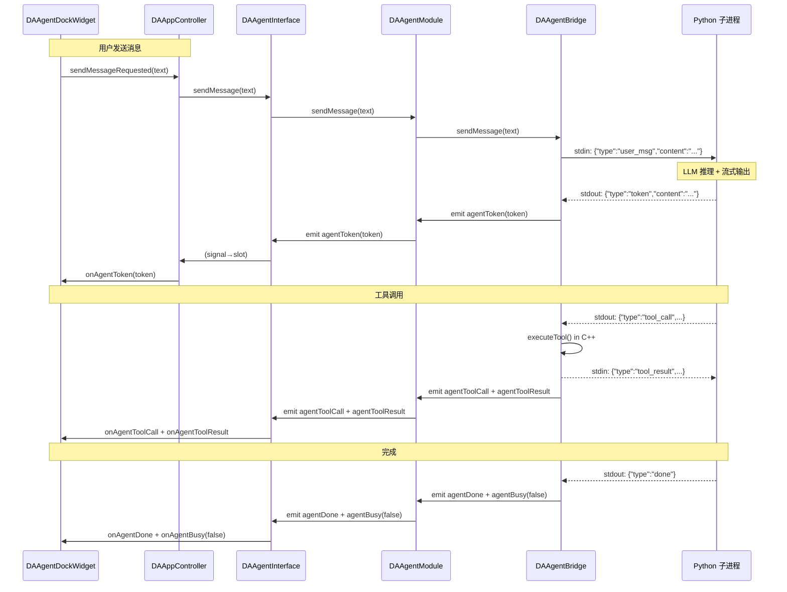
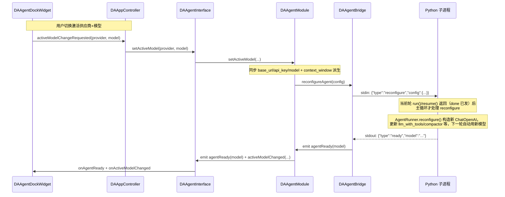
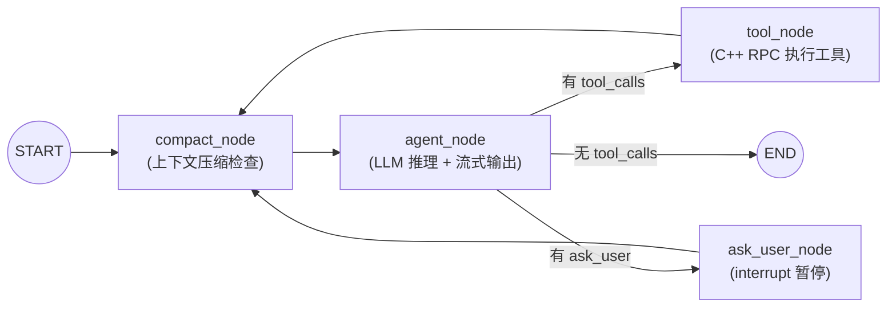

# 架构设计

Agent 模块采用 C++ + Python 双进程架构，通过 stdin/stdout 管道的 JSON Lines 协议实现进程间通信。本文档详细阐述架构设计、模块职责、信号链路和核心设计决策。

---

## 双进程模型

Agent 的核心设计理念是**进程隔离**：LLM 推理运行在独立 Python 子进程中，C++ 主进程管理工具执行与会话持久化。这种设计带来三个关键优势：

1. **故障隔离**：Python 子进程崩溃或 LLM API 超时不会影响 C++ 主程序的稳定性
2. **技术栈解耦**：LLM 生态（LangChain/LangGraph）在 Python 侧原生运行，无需 C++ 封装
3. **资源管理**：子进程可随时重启恢复，主进程状态不受影响



### C++ 侧职责

C++ 主进程承担全部业务逻辑和资源管理：

- **工具执行**：LLM 只拿到工具 schema（OpenAI function 格式），工具的实际执行由 `DAAgentBridge::executeTool()` 在主进程完成，结果经 stdin 回传
- **会话持久化**：`DAAgentSessionStore` 以 JSONL 格式管理对话历史，支持多会话切换、工程导出导入
- **LLM 配置管理**：`DAAgentConfig`（agent-config.json，含旧 ini 一次性迁移）读写配置，API Key 在序列化边界经 Windows DPAPI 加密存储；多供应商多模型 CRUD，激活供应商+模型热替换（`reconfigureAgent`）
- **UI 通信**：通过 `DAAgentInterface` 的 28 个信号与 `DAAgentDockWidget` 通信

### Python 侧职责

Python 子进程专注于 LLM 推理：

- **LLM 交互**：通过 `langchain-openai` 的 `ChatOpenAI` 客户端调用 LLM API（兼容 OpenAI 接口的任意模型）
- **LangGraph 状态机**：驱动 agent 循环（compact → agent → tools/ask_user），管理对话状态
- **上下文管理**：Token 估算、上下文压缩、工具结果截断
- **重试逻辑**：指数退避重试，支持用户中断

---

## 模块职责

### DAAgent 模块（`src/DAAgent/`）

DAAgent 位于五层架构的接口层（Layer 4），是**纯 agent 框架库**，不依赖任何 GUI 模块（无 DAGui/DAFigure/qwt/ADS）。

| 文件 | 类 | 职责 |
|------|-----|------|
| `DAAgentInterface.h` | `DAAgentInterface` | 公共接口（抽象基类）：28 个信号 + 工具/提示词注册 + 多供应商多模型管理（CRUD、激活切换、热替换）+ 提示词库 API + 会话管理 |
| `DAAgentModule.h/.cpp` | `DAAgentModule` | 接口实现：工具注册表、系统提示词组装、预启动/懒启动、配置读写（DAAgentConfig：agent-config.json + DPAPI 加密）、token 会话累计统计 |
| `DAAgentBridge.h/.cpp` | `DAAgentBridge` | QProcess 生命周期管理、JSON Lines 协议解析、工具执行、`reconfigureAgent` 热替换、崩溃恢复、看门狗 |
| `DAAgentSessionStore.h/.cpp` | `DAAgentSessionStore` | 会话持久化层（非 QObject，PIMPL）：JSONL 读写、索引、清理、标题 |
| `DAAgentManager.h/.cpp` | `DAAgentManager` | 提示词库管理：内置 agent 注入、按标题执行、CRUD（实现 `DAAgentPromptOps`） |
| `DAAgentPromptOps.h/.cpp` | `DAAgentPromptOps` | 提示词库操作回调接口（供 DAGui 对话框执行 CRUD） |
| `DAAgentPrompt.h/.cpp` | `DAAgentPrompt` | 单条提示词模型（标题、内容、元数据） |
| `DAAbstractAgentTool.h` | `DAAbstractAgentTool` | 工具抽象基类（纯虚）：`getToolSpec` / `execute` / `getOwnerModule` |
| `DAAgentToolBase.h/.cpp` | `DAAgentToolBase` | 瘦工具基类（`DAAgent_API` 导出）：数据访问 + 响应方法，供插件跨 DLL 继承 |
| `system_prompt.md` | — | 外部可编辑的系统提示词（运行时由 `assembleSystemPrompt()` 读取） |
| `default-agent.md` | — | 内置 agent 提示词模板（`registerBuiltinAgent` 仅在用户无同名文件时写入） |
| `da_agent.qrc` | — | Qt 资源文件，将 `system_prompt.md` / `default-agent.md` 等嵌入二进制 |

### DAGui 模块（`src/DAGui/Agent/`）

聊天 UI 属于 DAGui 模块，与 DAAgent 互不依赖。

| 文件 | 类 | 职责 |
|------|-----|------|
| `DAAgentDockWidget.h/.cpp` | `DAAgentDockWidget` | 聊天面板（继承 QWidget，非 QDockWidget），持有 QWebEngineView + 输入框 + 会话下拉 |
| `DAAgentWebChannel.h/.cpp` | `DAAgentWebChannel` | C++↔JS 桥（QObject），注册名 `chatBridge`，JS↔C++ 双向调用 |
| `resources/` | — | 前端资源：`chat.html` + `chat.js` + `chat.css` + markdown-it + highlight.js |

### Python 子进程（`src/PyScripts/DAWorkbench/agent/`）

| 文件 | 职责 |
|------|------|
| `agent_runner.py` | 唯一入口脚本（1236 行）：协议收发、LLM 配置、LangGraph 图构建、agent 循环、`reconfigure()` 热替换 |
| `context_manager.py` | Token 估算（tiktoken/char-based）、工具结果截断、上下文压缩（head/tail + 中间摘要） |
| `error_classifier.py` | LLM API 异常分类（可重试/不可重试），提取 Retry-After 头 |
| `retry_wrapper.py` | 指数退避重试，支持 stop_event 中断、retryable_check 回调 |

---

## 信号链路

> 决策 D3b：DAGui 与 DAAgent 互不依赖，Dock 的信号↔槽由 APP 层 `DAAppController::initialize()` 直接 connect。



### 模型热替换信号链

用户在 Dock 下拉切换激活模型时，不重启子进程、不丢 MemorySaver 会话状态，而是在两轮之间热替换 `ChatOpenAI`：



!!! note "reconfigure 不发 done"
    `reconfigure` 与 `load_session` 同构，不是一轮对话：不发 `done`，仅发 `ready` 确认。下一轮节点执行自动用新模型。失败安全：先构造新 `ChatOpenAI`，成功后才更新 `self.*`，构造失败发 `error` 不破坏旧 LLM。

### 预启动 vs 懒启动

子进程的启动时机由 `auto_prestart` 配置开关（默认 `true`）控制：

- **预启动（默认）**：`DAAgentModule::prestartAgent()` 在程序启动时调用，立即创建子进程并下发 `init`。启动前发射 `agentStarting` 信号令 UI 进入"启动中"过渡态，`agentReady` 后转为"就绪"态。预启动可避免用户首次发消息时承受约 16 秒的 LangChain 冷启动延迟。
- **懒启动（关闭预启动时）**：首次 `sendMessage()` 才通过 `startAgentInternal()` 创建子进程。

无论哪种路径，启动时 C++ 侧一次性下发 `init` 消息（含 LLM 配置、工具规格、系统提示词），Python 侧导入前先发 `booting` 心跳以重置就绪超时计时器。

### 接口↔Dock 连接清单

**接口信号 → Dock 槽（18 条）**：在 `DAAppController::initialize()` 中 connect（见 `DAAppController.cpp:252-270`）。

| 接口信号 | Dock 槽 | 用途 |
|---------|---------|------|
| `agentToken` | `onAgentToken` | 流式 token 渲染 |
| `agentMessageComplete` | `onAgentMessageComplete` | 消息完成 |
| `agentToolCall` | `onAgentToolCall` | 工具调用显示 |
| `agentToolResult` | `onAgentToolResult` | 工具结果显示 |
| `agentQuestion` | `onAgentQuestion` | HITL 提问渲染 |
| `agentError` | `onAgentError` | 错误显示 |
| `agentRetrying` | `onAgentRetrying` | 退避重试进度 |
| `agentReady` | `onAgentReady` | 就绪状态 |
| `agentStarting` | `onAgentStarting` | 启动中过渡态 |
| `agentBusy` | `onAgentBusy` | 忙碌状态切换 |
| `agentSessionLoaded` | `onAgentSessionLoaded` | 会话加载完成 |
| `tokenUsageUpdated` | `onAgentUsage` | Token 用量更新 |
| `sessionSwitched` | `onSessionSwitched` | 会话切换 |
| `sessionListChanged` | `onSessionListChanged` | 会话列表刷新 |
| `sessionCreated` | `onSessionCreated` | 新建会话 |
| `sessionCleared` | `onSessionCleared` | 清空游离会话聊天区 + 复位 token 统计 |
| `availableModelsChanged` | `onAvailableModelsChanged` | 可用模型列表变化（填充下拉） |
| `activeModelChanged` | `onActiveModelChanged` | 激活模型变化（选中下拉项） |

**Dock 信号 → 接口方法（8 条）**（见 `DAAppController.cpp:271,277-283`）：

| Dock 信号 | 接口方法 | 用途 |
|-----------|---------|------|
| `sendMessageRequested` | `sendMessage` | 发送用户消息 |
| `stopRequested` | `stop` | 停止推理 |
| `userAnswerSelected` | `sendUserAnswer` | 用户回答 HITL 提问 |
| `sessionSwitchRequested` | `switchSession` | 切换会话 |
| `sessionDeleteRequested` | `deleteSession` | 删除会话 |
| `sessionRenameRequested` | `renameSession` | 重命名会话 |
| `sessionCreateRequested` | `newSession` | 新建会话（emit `sessionCreated` 触发 UI clearChat） |
| `activeModelChangeRequested` | `setActiveModel` | 切换激活供应商+模型（运行期热替换） |

---

## 核心设计决策

| 编号 | 决策 | 理由 |
|------|------|------|
| D1 | **子进程模型** | agent 推理在独立 Python 进程（QProcess），C++ 主进程崩溃/无响应不影响子进程 |
| D2 | **工具执行在 C++** | LLM 只拿到工具 schema，实际执行在主进程完成，避免 Python 侧重复实现 C++ 功能 |
| D3 | **预启动 / 懒启动** | 默认 `auto_prestart=true` 启动即预热子进程；关闭则回退到首次 `sendMessage()` 才启动 |
| D4 | **HITL 提问** | LangGraph `interrupt()/resume()` + 注入的 `ask_user` 工具实现人机交互 |
| D5 | **流式输出** | `llm.astream()` 逐 chunk 把 token 推给 UI 实时渲染 |
| D6 | **Windows asyncio 兼容** | 强制 `WindowsSelectorEventLoopPolicy`，stdin 用后台线程 `read1()` 读取 |
| D3b | **Dock 信号在 APP 层 connect** | DAGui 与 DAAgent 互不依赖，由 `DAAppController` 作为中介连接 |
| C | **工具插件化** | 内置工具放独立插件（`plugins/DAAgentTools/` 21 个 + `plugins/DAPaperAgent/` 2 个文献工具），通过 `registerTool` 注册 |
| E1 | **设置页在 APP 层** | 与其他设置页一致，经 `setAgentInterface` 注入接口持久化 |
| G2 | **工具基类拆分** | 瘦 `DAAgentToolBase`（数据+响应）留 DAAgent，图表方法搬插件 |
| M | **多供应商多模型 + 热替换** | 多供应商 CRUD + 激活切换，运行期 `reconfigure` 热替换 LLM 不重启子进程、不丢 MemorySaver |

---

## 层级定位

DAAgent 位于五层架构的接口层（Layer 4）：

```
┌─────────────────────────────────────────┐
│ Layer 5: APP                            │
│  DAAppController (信号连接)              │
│  DAAgentSettingsWidget (设置页)          │
├─────────────────────────────────────────┤
│ Layer 4: 接口层                          │
│  DAAgent (纯框架库, 无 GUI 依赖)         │
│  DAInterface, DAPluginSupport           │
├─────────────────────────────────────────┤
│ Layer 3: 界面层                          │
│  DAGui/Agent (DAAgentDockWidget)        │
├─────────────────────────────────────────┤
│ Layer 2: 功能层                          │
│  DAData, DAPyBindQt, DAPyScripts        │
├─────────────────────────────────────────┤
│ Layer 1: 基础层                          │
│  DAUtils, DAShared                      │
└─────────────────────────────────────────┘
```

!!! note "DAGui 与 DAAgent 互不依赖"
    DAGui 不 link DAAgent，DAAgent 不 link DAGui。两者由 APP 层 `DAAppController::initialize()` 通过 `connect()` 协调。这使得 agent 框架可以独立于 UI 使用（如未来支持命令行 agent 模式）。

---

## LangGraph 状态机

Python 侧的 agent 推理由 LangGraph 状态机驱动：



| 节点 | 职责 |
|------|------|
| `compact_node` | 在每轮 agent 推理前检查上下文是否需要压缩；不需要时返回空消息列表（零开销）；有 3 次熔断器 |
| `agent_node` | 插入系统提示词，流式调用 LLM，根据返回的 `tool_calls` 路由到不同节点；有溢出恢复；连续 3 次相同完整 tool_calls 签名触发硬终止（剥离 `tool_calls` 直达 END） |
| `tool_node` | 对每个 tool_call，通过 JSON Lines RPC 回调 C++ 执行工具，构造 `ToolMessage` 入状态；本轮已执行过的相同签名走软引导而非重复执行 |
| `ask_user_node` | 调用 LangGraph `interrupt()` 暂停图执行，等待用户回答后 `resume()` 继续 |

!!! note "防死循环三重兜底"
    - **`recursion_limit`**（默认 150 步，配置键 `agent/recursion_limit`）：限制图最大迭代步数，`GraphRecursionError` 被捕获并报为 `error_type="recursion_limit"`。
    - **软引导**：`tool_node` 用 `_executed_call_sigs`（`deque(maxlen=8)`）记录本轮已执行签名，重复时返回引导性 `ToolMessage` 而非重复执行（不同参数不受影响）。
    - **硬终止**：`agent_node` 跟踪 `_last_full_sig` / `_full_sig_repeat_count`，连续 3 次相同完整 tool_calls 签名（阈值 `_repeat_terminate_threshold=3`）则强制剥离 `tool_calls` 并以最终回复结束（router → END）。

---

## 参见

- [通信协议](./protocol.md) — JSON Lines 协议的完整规范
- [上下文管理](./context-management.md) — compact_node 的压缩机制详解
- [崩溃恢复与重连](./crash-recovery.md) — 进程生命周期与自动重启
- [工具开发指南](./tool-development.md) — 工具基类与注册机制
- `src/DAAgent/AGENTS.md` — 模块 AI 开发必读指南
