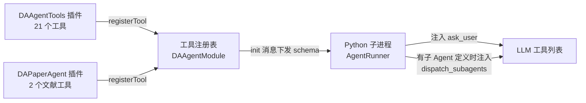

# 工具与内置 Agent 总览

本文完整列举 DAWorkbench 平台向 Agent（LLM）提供的**全部工具**与**内置 Agent / 内置子 Agent**，说明每个工具的作用与参数。工具清单是 Agent 能力的权威参考——写提示词、排查"agent 为什么做不了某事"、规划新工具时都应先对照本文。

---

## 主要功能特性

- ✅ **23 个 C++ 工具**：`DAAgentTools` 插件 21 个（数据 5 + 绘图 11 + 文件/报告 3 + 代码执行 2）+ `DAPaperAgent` 插件 2 个（文献检索/DOI 验证）
- ✅ **2 个平台注入工具**：`ask_user`（人机交互提问）与 `dispatch_subagents`（子 Agent 委派），由 Python 子进程动态注入，不经过插件注册
- ✅ **2 个内置 Agent**：「数据分析助手」（平台默认）与「论文撰写助手」（DAPaperAgent 插件注入）
- ✅ **1 个内置子 Agent**：`explore`（只读数据探索），主 Agent 经 `dispatch_subagents` 委派
- ✅ **每个工具标注权限分级**：read / inapp_mutate / file_write / code_exec，权限门按分级 + 模式执法

---

## 工具来源与注入机制

工具从三个来源进入 LLM 的工具列表（OpenAI function schema）：

| 来源 | 注入方式 | 工具数 |
|------|---------|--------|
| `plugins/DAAgentTools/` | 插件 `initialize()` 调用 `DAAgentInterface::registerTool`，schema 经 `init` 消息下发给 Python 子进程，**真实执行在 C++ 主进程** | 21 |
| `plugins/DAPaperAgent/` | 同上（文献工具 + 内置论文 agent 一起注册） | 2 |
| Python 子进程（`agent_runner.py`） | `build_tool_schemas()` 动态注入：`ask_user` 始终注入主图；`dispatch_subagents` 仅当存在子 Agent 定义时由编排器动态生成 schema 注入 | 2 |

!!! note "工具名即协议"
    工具 `name`（snake_case）参与 LLM 工具调用匹配与已存对话引用，**不可翻译、不可改名**。本文列出的参数表与各工具 `getToolSpec()` 的实现一一对应，改动 schema 时同步更新本文。

---

## 工具总览（25 个）

| # | 工具名 | 提供者 | 权限分级 | 一句话作用 |
|---|--------|--------|----------|-----------|
| 1 | `list_data` | DAAgentTools | read | 列出工作区所有已加载数据集 |
| 2 | `get_data_info` | DAAgentTools | read | 查看数据集结构与前 N 行预览 |
| 3 | `query_data` | DAAgentTools | read | 按 pandas query 表达式过滤行 |
| 4 | `get_column_stats` | DAAgentTools | read | 查看单列描述性统计与缺失值 |
| 5 | `export_data` | DAAgentTools | file_write | 导出数据集为 CSV/Excel |
| 6 | `create_chart` | DAAgentTools | inapp_mutate | 从数据列创建图表 |
| 7 | `add_curve` | DAAgentTools | inapp_mutate | 向已有图表追加曲线 |
| 8 | `set_chart_style` | DAAgentTools | inapp_mutate | 设置标题/标签/图例/网格/背景等样式 |
| 9 | `set_axis` | DAAgentTools | inapp_mutate | 配置坐标轴类型/范围/外观 |
| 10 | `update_curve_style` | DAAgentTools | inapp_mutate | 修改已有曲线的颜色/线型/标记/填充 |
| 11 | `remove_chart_item` | DAAgentTools | inapp_mutate | 删除曲线/标注/区域 |
| 12 | `add_annotation` | DAAgentTools | inapp_mutate | 添加文本/箭头/点/区域标注 |
| 13 | `create_subplots` | DAAgentTools | inapp_mutate | 创建子图网格 |
| 14 | `save_chart_image` | DAAgentTools | file_write | 保存图表为 PNG/PDF/SVG |
| 15 | `list_figures` | DAAgentTools | read | 列出所有 figure 与内部 chart |
| 16 | `list_chart_items` | DAAgentTools | unknown | 列出 chart 内曲线/标注/区域明细 |
| 17 | `read_file` | DAAgentTools | read | 读取文本文件 |
| 18 | `write_file` | DAAgentTools | file_write | 写文本文件 |
| 19 | `save_report` | DAAgentTools | file_write | 保存 Markdown 报告为 md/pdf/docx |
| 20 | `run_code` | DAAgentTools | code_exec | 在共享命名空间执行内联 Python |
| 21 | `run_script` | DAAgentTools | code_exec | 执行脚本工作区内的 .py |
| 22 | `search_literature` | DAPaperAgent | unknown | CrossRef/OpenAlex 学术文献检索 |
| 23 | `verify_doi` | DAPaperAgent | unknown | 验证 DOI 真伪并取回元数据 |
| 24 | `ask_user` | 平台注入 | —（人机交互） | 向用户提问获取澄清/确认 |
| 25 | `dispatch_subagents` | 平台注入 | —（本地编排） | 批量委派子 Agent 并行调研 |

!!! note "unknown 分级的含义"
    `list_chart_items` / `search_literature` / `verify_doi` 未列入权限引擎的内置分级表（`DAAgentPermissionManager` 的 `builtinTierTable` 收录 20 个工具），按参数约定回退推导：参数含 `file_path`/`path`/`output_path`/`report_path` → `file_write`，否则 → `unknown`。三者均无路径参数，故为 `unknown`。

---

## 数据工具（DAAgentTools，5 个）

数据工具直接操作工作区数据管理器中的 `DAData`（DataFrame 封装），是分析流程的第一步。

### list_data

列出当前所有已加载数据集。每个数据集返回：名称、类型、行数、列数。无参数。

Agent 的标准开场动作：先 `list_data` 了解有哪些数据，再用 `get_data_info` 查看感兴趣的数据集。

### get_data_info

获取数据集的结构信息（行数、列数、列名、各列 dtype）及前 N 行数据预览。

| 参数 | 类型 | 必填 | 说明 |
|------|------|------|------|
| `data_name` | string | ✅ | 数据集名称 |
| `preview_rows` | integer | | 预览行数，默认 10 |

### query_data

按 pandas query 表达式过滤数据集的行并返回预览，如 `col > 100`、`a > 1 and b < 5`。

| 参数 | 类型 | 必填 | 说明 |
|------|------|------|------|
| `data_name` | string | ✅ | 数据集名称 |
| `expr` | string | ✅ | pandas query 表达式，如 `'col > 100'` |
| `preview_rows` | integer | | 预览行数，默认 10 |

### get_column_stats

获取单列的描述性统计（count/mean/std/min/四分位/max）及缺失值计数。

| 参数 | 类型 | 必填 | 说明 |
|------|------|------|------|
| `data_name` | string | ✅ | 数据集名称 |
| `column` | string | ✅ | 列名 |

### export_data

把数据集导出为 CSV 或 Excel 文件。

| 参数 | 类型 | 必填 | 说明 |
|------|------|------|------|
| `data_name` | string | ✅ | 数据集名称 |
| `file_path` | string | ✅ | 输出文件路径 |
| `format` | string | | `csv` 或 `excel`，默认 `csv` |

---

## 绘图工具（DAAgentTools，11 个）

绘图工具在平台的 figure/chart 体系（`DAFigureWidget` + `DAChartWidget`，基于 Qwt）上创建和修改图表。除 `create_chart`/`create_subplots`/`list_figures` 外，绘图工具通过可选的 `figure_name` + `chart_id` 组合定位目标图表：

- `figure_name`：figure 的 tab 标题；空 = 当前活动 figure
- `chart_id`：chart 的标题或索引；空或 `'current'` = 当前活动 chart
- 定位前可用 `list_figures` 发现 figure 与 chart，用 `list_chart_items` 查看元素明细

### create_chart

从数据集的列创建图表（折线/散点/柱状/直方图/箱线图），返回 `figure_id`/`figure_name`（可用于 `da-figure:` 超链接，用户点击可直达 figure）。**若 `figure_name` 与已有 figure 同名，则在该 figure 内追加 chart**（可借此拼子图）；X 列为 datetime 类型时自动切换时间轴；`y` 传数组可一次画多条曲线。

| 参数 | 类型 | 必填 | 说明 |
|------|------|------|------|
| `type` | string | ✅ | 图表类型：`line` / `scatter` / `bar` / `hist` / `box` |
| `data_name` | string | ✅ | 数据集名称 |
| `x` | string | ✅ | X 轴列名 |
| `y` | array of string | ✅ | Y 轴列名数组；单元素画一条曲线，多元素画多条 |
| `title` | string | | 图表标题（`figure_name` 为空时兼作 figure 名） |
| `figure_name` | string | | figure 名；同名已存在则在其中加 chart，否则新建 |
| `x_label` / `y_label` | string | | 坐标轴标签 |

### add_curve

向已有图表追加一条曲线。

| 参数 | 类型 | 必填 | 说明 |
|------|------|------|------|
| `data_name` | string | ✅ | 数据集名称 |
| `x_column` | string | ✅ | X 轴列名 |
| `y_column` | string | ✅ | Y 轴列名 |
| `chart_id` | string | | 图表标识（标题或索引），空/`'current'` 为当前 chart |
| `figure_name` | string | | 目标 figure 名，空为当前 figure |
| `name` | string | | 曲线显示名 |
| `color` | string | | 颜色（hex 或名称，如 `'#FF0000'`、`'red'`） |
| `width` | number | | 线宽 |
| `style` | string | | 线型：`solid` / `dash` / `dot` / `dashdot` |

### set_chart_style

设置图表的标题、轴标签、图例、网格、背景等样式，全部参数可选，只改传入的项。

| 参数 | 类型 | 必填 | 说明 |
|------|------|------|------|
| `chart_id` / `figure_name` | string | | 定位目标图表（见上文约定） |
| `title` / `x_label` / `y_label` | string | | 标题与轴标签 |
| `legend` / `grid` | boolean | | 是否显示图例/网格 |
| `x_axis_type` | string | | X 轴类型：`'datetime'`（刻度格式化为日期）或 `'normal'`；省略不变 |
| `x_date_format` | string | | 时间轴日期格式，如 `'yyyy-MM-dd'`；默认 `'yyyy-MM-dd hh:mm:ss'` |
| `background_color` / `border_color` | string | | 绘图区背景色/边框色 |
| `grid_major_color` / `grid_major_style` | string | | 主网格颜色/线型（`solid`/`dash`/`dot`） |
| `legend_position` | string | | 图例位置：`top` / `bottom` / `left` / `right` |
| `legend_background_color` / `legend_text_color` | string | | 图例背景色/文字色 |
| `figure_background_color` | string | | figure 外框背景色（区别于绘图区背景） |

### set_axis

配置单个坐标轴的刻度类型、范围与外观。

| 参数 | 类型 | 必填 | 说明 |
|------|------|------|------|
| `axis` | string | ✅ | `'x'` 或 `'y'` |
| `chart_id` / `figure_name` | string | | 定位目标图表 |
| `scale_type` | string | | `'normal'`（线性）或 `'datetime'`；省略不变 |
| `date_format` | string | | 时间轴日期格式（`scale_type` 为 `datetime` 时生效） |
| `min` / `max` | number | | 轴范围（仅线性轴） |
| `color` | string | | 轴颜色 |
| `label_rotation` | number | | 轴标签旋转角度 |

### update_curve_style

修改已有曲线的外观。先用 `list_chart_items`（`item_type='curve'`）发现曲线的图例名与索引。

| 参数 | 类型 | 必填 | 说明 |
|------|------|------|------|
| `curve_name` | string | ✅ | 曲线图例名或 0 基索引 |
| `chart_id` / `figure_name` | string | | 定位目标图表 |
| `color` | string | | 线颜色 |
| `width` | number | | 线宽 |
| `style` | string | | 线型：`solid` / `dash` / `dot` / `dashdot` / `dashdotdot` |
| `symbol` | string | | 标记：`none`/`ellipse`/`rect`/`diamond`/`triangle`/`dtriangle`/`utriangle`/`cross`/`xcross`/`star1` |
| `symbol_size` | integer | | 标记大小（像素），默认 8 |
| `fill_color` | string | | 曲线下方填充色（支持半透明，如 `'#0000FF80'`） |

### remove_chart_item

从图表中删除曲线、标注或区域。

| 参数 | 类型 | 必填 | 说明 |
|------|------|------|------|
| `item_name` | string | ✅ | 元素图例名或 0 基索引 |
| `chart_id` / `figure_name` | string | | 定位目标图表 |
| `item_type` | string | | 过滤类型：`curve` / `annotation` / `region` / `any`（默认） |

### add_annotation

向图表添加标注。文本/点用 `position`；箭头用 `start`+`end`；区域（竖直条带）用 `start_x`+`end_x`。时间轴下 x 坐标接受 Unix 秒、Unix 毫秒或 ISO 日期字符串（如 `"2026-05-15"`），工具自动归一化为轴单位。

| 参数 | 类型 | 必填 | 说明 |
|------|------|------|------|
| `type` | string | ✅ | 标注类型：`text` / `arrow` / `point` / `region` |
| `chart_id` / `figure_name` | string | | 定位目标图表 |
| `position` | array | | `[x, y]` 数据坐标（text/point 用） |
| `start` / `end` | array | | 箭头起止点 `[x, y]`（arrow 用） |
| `start_x` / `end_x` | number/string | | 区域起止 x（region 用） |
| `text` | string | | 标注文本（text 的内容/箭头尖端标签/区域标签） |
| `color` | string | | 标注颜色 |

### create_subplots

创建子图网格 figure。**每次调用都新建 figure**（与 `create_chart` 的复用语义不同），返回 `figure_id`/`figure_name`。子图内再加内容用 `add_curve`/`create_chart` 按 `figure_name` + `chart_id` 定位。

| 参数 | 类型 | 必填 | 说明 |
|------|------|------|------|
| `layout` | string | ✅ | 网格布局，如 `'2x2'`（2 行 2 列） |
| `figure_name` | string | | figure 名（tab 标题），空则自动生成 |

### save_chart_image

把图表导出为图片文件（png/pdf/svg），满足论文级矢量输出需求。

| 参数 | 类型 | 必填 | 说明 |
|------|------|------|------|
| `file_path` | string | ✅ | 输出文件路径 |
| `chart_id` / `figure_name` | string | | 定位目标图表 |
| `format` | string | | `png` / `pdf` / `svg`，默认 `png` |
| `width` / `height` | integer | | 输出尺寸：PNG 为像素，PDF/SVG 为点 |

### list_figures

无参数。列出所有 figure 及其内部 chart（figure 名、chart 标题、chart 索引）。修改图表前的标准动作：先 `list_figures` 拿到定位信息。

### list_chart_items

列出某个 chart 内的全部元素（曲线/标注/区域）：索引、图例名（`title`）、显示名、类型、可见性、颜色、数据点数。索引口径与 `remove_chart_item` 对同一 `item_type` 的过滤一致。

| 参数 | 类型 | 必填 | 说明 |
|------|------|------|------|
| `chart_id` / `figure_name` | string | | 定位目标图表 |
| `item_type` | string | | 过滤类型：`curve` / `annotation` / `region` / `any`（默认） |

---

## 文件与报告工具（DAAgentTools，3 个）

!!! warning "路径安全由权限门统一执法"
    工具内部不做路径检查。系统目录（如 `C:\Windows`）硬 deny 在所有权限模式下生效；工作区外的写入按权限模式（yolo/auto/manual）决策。详见 `src/DAAgent/AGENTS.md` 铁律 T16。

### read_file

读取文本文件内容。

| 参数 | 类型 | 必填 | 说明 |
|------|------|------|------|
| `file_path` | string | ✅ | 文件路径 |

### write_file

把文本内容写入文件。

| 参数 | 类型 | 必填 | 说明 |
|------|------|------|------|
| `file_path` | string | ✅ | 文件路径 |
| `content` | string | ✅ | 文本内容 |

### save_report

把 Markdown 内容保存为报告文件并（默认）在查看器中打开：md 用内置 Markdown 查看器（`DAMarkdownView`），pdf/docx 用系统默认程序打开。

| 参数 | 类型 | 必填 | 说明 |
|------|------|------|------|
| `content` | string | ✅ | Markdown 格式的报告内容 |
| `file_path` | string | ✅ | 输出文件路径 |
| `format` | string | | `md` / `pdf` / `docx`，默认 `md` |
| `open_after_save` | boolean | | 保存后是否打开，默认 `true` |

!!! note "docx 仅 Windows"
    docx 导出走 `DAAxOfficeWrapper`（Word COM），仅 Windows 可用；pdf 走 `QPrinter`+`QTextDocument`。打开失败不影响保存结果——返回消息附带说明。

---

## 代码执行工具（DAAgentTools，2 个）

### run_code

在**共享持久命名空间**（Jupyter 风格）中执行内联 Python 代码。这是 agent 突破固定工具能力边界的主力：pandas/scipy/statsmodels 均可用，一次调用定义的变量（如 `df`）可在后续 `run_code`/`run_script` 调用中直接引用。

| 参数 | 类型 | 必填 | 说明 |
|------|------|------|------|
| `code` | string | ✅ | Python 代码 |
| `args` | object | | 可选参数，注入为命名空间中的 `args` 字典 |

关键行为：

- 预导入 `da_app` / `da_interface` / `da_data` 三个模块；经 `da_app.getCore().getDataManagerInterface().getAllDataframes()` 取得 `{名称: dataframe}` 字典访问内存数据
- 返回值约定：设置 `__result__` 变量作为返回值；`result` 字段只是给 LLM 阅读的文本摘要，不是可操作的 Python 对象
- stdout/stderr 被捕获并回传
- **代码在主线程执行，运行期间 UI 冻结**；默认 300s 超时注入 `KeyboardInterrupt`
- 打开带脚本工作区的工程时，CWD 为工作区根目录

### run_script

执行当前工程脚本工作区内的 `.py` 脚本，与 `run_code` 共享同一持久命名空间。典型链路：先用 `write_file` 把脚本写入工作区，再 `run_script` 执行。

| 参数 | 类型 | 必填 | 说明 |
|------|------|------|------|
| `path` | string | ✅ | 相对脚本工作区根的路径，如 `"scripts/analyze.py"` |
| `args` | object | | 注入为脚本内的 `args` 字典 |

行为约定与 `run_code` 相同（预导入模块、`__result__`、stdout 捕获、主线程、300s 超时）；脚本必须 UTF-8 编码，工具内有工作区越界防护。

!!! note "代码内容判定"
    `run_code`/`run_script` 属 `code_exec` 分级，代码内容在 Python 侧（`permission_judge.py`）静态规则+判官先判定，裁决附 `safety` 字段下发，由 C++ 权限门在 `DAAgentBridge::executeTool` 前置消费（唯一执法点）。

---

## 文献工具（DAPaperAgent，2 个）

### search_literature

经 **CrossRef / OpenAlex** 免费 API 检索真实学术文献（论文/书籍/会议论文），返回规范化条目：DOI、标题、作者、期刊、年份、类型。

| 参数 | 类型 | 必填 | 说明 |
|------|------|------|------|
| `query` | string | ✅ | 检索关键词，如 `"linear regression air quality"` |
| `max_results` | integer | | 最大返回数，默认 8，上限 20 |
| `source` | string | | `auto`（默认，先 CrossRef 失败回退 OpenAlex）/ `crossref` / `openalex` |

需直连 `api.crossref.org` 与 `api.openalex.org`（支持 `https_proxy`/`http_proxy` 环境变量指定的 http:// 代理）；网络失败时返回错误，agent 应回退到用户提供的文献。

### verify_doi

验证一个 DOI 是否真实存在，并从 CrossRef 取回其精确元数据（标题、期刊、年份、作者）。用途：**引用进参考文献列表前逐一验真，杜绝编造引用**。

| 参数 | 类型 | 必填 | 说明 |
|------|------|------|------|
| `doi` | string | ✅ | 待验证 DOI，如 `"10.1038/s41586-020-2649-2"`；接受 `https://doi.org/` 前缀（自动剥离） |

---

## 平台注入工具（2 个）

这两个工具不在 C++ 工具注册表中，由 Python 子进程（`agent_runner.py` / `subagent_orchestrator.py`）动态注入。

### ask_user

向用户提问以获取澄清或确认，实现人机交互（HITL）。LLM 以 `tool_call` 形式调用，C++ 侧经 `agentQuestion` 信号在聊天界面弹出问题卡片（支持选项点选与自由输入），用户回答后以 `user_answer` 消息回传继续推理。

| 参数 | 类型 | 必填 | 说明 |
|------|------|------|------|
| `question` | string | ✅ | 问题文本 |
| `options` | array of string | | 可选项列表 |
| `multi_select` | boolean | | 是否允许多选，默认 `false` |

!!! note "子 Agent 没有 ask_user"
    `ask_user` 仅注入主图；子 Agent 子图（`include_ask_user=False`）不注入——子 Agent 幻觉出的 `ask_user` 调用会得到未知工具错误。

### dispatch_subagents

把一批子任务委派给子 Agent **并行**调研并汇总结论。仅当平台存在子 Agent 定义（`<exe>/daAgent/subagents/*.md`）时注入；schema 的 description 动态列出当前可用的子 Agent 类型。子任务由编排器（`subagent_orchestrator.py`）并发限流执行（`subagent_batch_limit` / `subagent_max_concurrency` / `subagent_timeout_sec` / `subagent_recursion_limit` 配置约束），进度经 `subagent_progress` 消息上报 UI 进度卡片。

| 参数 | 类型 | 必填 | 说明 |
|------|------|------|------|
| `tasks` | array | ✅ | 任务数组，每项含 `subagent_type`（string，必填——子 Agent 类型名）与 `prompt`（string，必填——自包含的完整任务指令，子 Agent 看不到其它上下文）。批次保持小（建议数个以内），各任务独立运行 |

---

## 内置 Agent

内置 Agent 以 Markdown 提示词文件形式落在 `<exe>/daAgent/` 目录，用户可在「AI 分析」→ Agent 管理对话框中运行、编辑、删除；播种均为"仅文件不存在时写入"，用户的编辑/删除永远被尊重。

| Agent | 提供者 | 提示词源 | 定位 |
|-------|--------|---------|------|
| 数据分析助手 | 平台（DAAgentManager） | `src/DAAgent/default-agent.md`（qrc 内嵌） | 通用数据分析 |
| 论文撰写助手 | DAPaperAgent 插件 | `plugins/DAPaperAgent/resources/paper-agent.md`（qrc 内嵌） | 学术论文端到端撰写 |

### 数据分析助手（平台默认）

**注入方式**：`DAAgentManager::ensureDefaultAgent()` 在程序启动时检查 `<exe>/daAgent/` 目录——**目录内没有任何 `.md` 时**才从 qrc 播种 `数据分析助手.md`（用户已有内容则不播种）。

**作用**：通用数据分析助手，覆盖"查询 → 统计 → 可视化 → 标注 → 报告"的标准流程：

1. 先用 `list_data` 了解已加载数据集，用 `get_data_info` 查看字段与类型
2. 用 `query_data` 取数、`get_column_stats` 做统计，必要时 `create_chart`/`add_curve` 可视化
3. 用 `add_annotation`（含 `type: region` 区域高亮）标记关键点/区间
4. 需要澄清时用 `ask_user` 提问
5. 输出 Markdown 格式结论，引用图表时插入 `da-figure:` 链接

### 论文撰写助手（DAPaperAgent 插件）

**注入方式**：插件 `initialize()` 调用 `agent->registerBuiltinAgent("论文撰写助手", <qrc 内容>)`，仅当 `daAgent/论文撰写助手.md` 不存在时写入。详见[通过插件注册内置 Agent](./register-builtin-agent-via-plugin.md)。

**作用**：基于用户加载的数据，端到端协助完成一篇结构完整（IMRaD）、统计严谨、引用真实的学术论文。核心特色：

- **六阶段门禁流程**：数据理解 → 统计建模与结果锁定 → 图表规划与生成 → 文献与大纲 → 分节写作 → 评审定稿；每阶段以 `ask_user` 确认为门禁，审批标记（`.approved/P1.md` ~ `P6.md`）落盘
- **结果包锁定机制**：阶段 2 产出 `results.json`/`results.md`，用户确认"锁定"后只读；阶段 4-6 禁止重算统计、禁止修改任何统计量——**数据的客观性绝不被论文叙事需求干扰**
- **引用保真**：任何引用必须来自 `search_literature` 结果、用户材料或 `verify_doi` 验证，绝不编造 DOI/作者/期刊
- **跨会话恢复**：`daPaper/<论文名>/progress.md` 记录进度与配置，重启会话后从第一个未完成阶段续作
- **降级路径**：statsmodels 缺失降级 scipy/手工实现；文献 API 不可达切离线模式（只用用户文献并标注"待人工验证"）

---

## 内置子 Agent

子 Agent 定义以 frontmatter + Markdown 正文形式存放在 `<exe>/daAgent/subagents/`，由主 Agent 经 `dispatch_subagents` 委派。子 Agent 与主图同进程、共享当前激活 LLM 与权限配置，但拥有独立会话历史，且**没有 `ask_user`**（不能向用户提问）。

### explore（只读数据探索）

**注入方式**：`DAAgentSubagentManager::ensureDefaultSubagents()` 启动时播种（仅 `explore.md` 缺失时），之后归用户所有。

**作用**：受主 Agent 委派对工作区数据做**只读探索**并输出结构化总结。特点：

- 工具白名单 6 个只读工具：`list_data`、`get_data_info`、`query_data`、`get_column_stats`、`read_file`、`list_figures`——不写文件、不改图表、不执行代码
- 控制查询次数（单任务工具调用一般不超过 15 次）
- 所有数值必须来自工具返回，注明数据集名与列名，不编造
- 输出四段式总结：数据集概览 / 字段说明 / 数据质量发现（缺失值、重复行、异常值）/ 建议后续分析方向

插件可经 `registerBuiltinSubagent` 注入领域子 Agent（机制同内置 Agent，见 `src/DAAgent/AGENTS.md` § 五 + T17）。

---

## 系统提示词片段

两个插件还各自注册了系统提示词片段（`DAAgentInterface::registerSystemPrompt`），随系统提示词一起下发给**所有** agent：

| 片段名 | 提供者 | 内容 |
|--------|--------|------|
| `figure_reference` | DAAgentTools | 教 agent 在回复中用 `da-figure:<figure_name>` / `da-figure:id=<figure_id>` 超链接引用创建的绘图（用户点击可 raise 定位 figure）；用 `list_figures`/`list_chart_items` 先发现再修改 |
| `literature_tools` | DAPaperAgent | 文献工具用法铁律：绝不编造引用，引用必须来自 `search_literature`/用户输入；DOI 进参考文献前必经 `verify_doi`；双 API 不可达时诚实说明并切离线模式 |

---

## 权限分级速查

权限引擎（`DAAgentPermissionManager`）按工具分级 + 权限模式（yolo/auto/manual）在 `DAAgentBridge::executeTool` 前置执法。内置分级表（20 个工具）：

| 分级 | 工具 | 含义 |
|------|------|------|
| `read`（6） | `list_data`、`get_data_info`、`query_data`、`get_column_stats`、`list_figures`、`read_file` | 只读，风险最低 |
| `inapp_mutate`（8） | `create_chart`、`create_subplots`、`add_curve`、`update_curve_style`、`set_axis`、`set_chart_style`、`remove_chart_item`、`add_annotation` | 应用内可逆变更 |
| `file_write`（4） | `write_file`、`export_data`、`save_report`、`save_chart_image` | 写文件系统 |
| `code_exec`（2） | `run_code`、`run_script` | 执行任意代码 |

未入表工具（含 `list_chart_items`、`search_literature`、`verify_doi` 及未来插件工具）按参数约定推导：含 `file_path`/`path`/`output_path`/`report_path` 参数 → `file_write`，否则 → `unknown`。用户可在权限设置页用 `tier_overrides` 覆盖任意工具的分级。

!!! note "默认模式为全自动"
    权限默认模式为 yolo（全自动），未配置即静默放行；系统目录硬 deny 在**所有**模式生效。详见 `src/DAAgent/AGENTS.md` 铁律 T16。

---

## 注意事项

!!! warning "本文与代码同步"
    工具数量（C++ 23 + 平台注入 2）、参数表、权限分级必须与实现保持一致：新增/修改工具时，同步更新本文与 `plugins/DAAgentTools/AGENTS.md` § 三的速查表。

!!! tip "给提示词写作者的参考"
    编写 agent 提示词（如 `paper-agent.md` 这类领域提示词）时，可用工具清单直接从本文抄录；`ask_user` 是平台内置能力无需声明即可使用。

!!! info "扩展入口"
    新增 C++ 工具见[工具开发指南](./tool-development.md)；通过插件注入 agent/工具/提示词的整体模式见[通过插件注册内置 Agent](./register-builtin-agent-via-plugin.md)。

---

## 参考资料

- [工具开发指南](./tool-development.md) — 工具基类、注册机制、自定义工具开发
- [通过插件注册内置 Agent](./register-builtin-agent-via-plugin.md) — DAPaperAgent 参考实现
- [Agent 模块概述](./index.md) — 双进程架构与核心概念
- `plugins/DAAgentTools/` — 21 个内置工具实现源码
- `plugins/DAPaperAgent/` — 论文 agent 与文献工具实现源码
- `src/DAAgent/AGENTS.md` — DAAgent 模块开发铁律（含权限层 T16、子 Agent T17）
