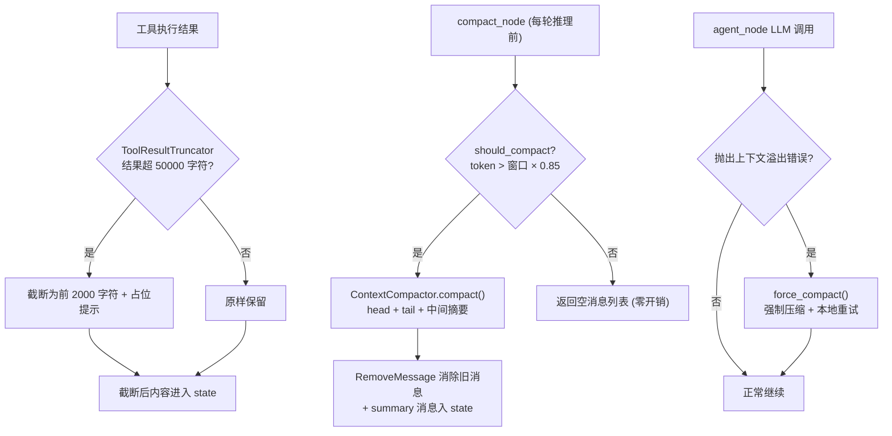
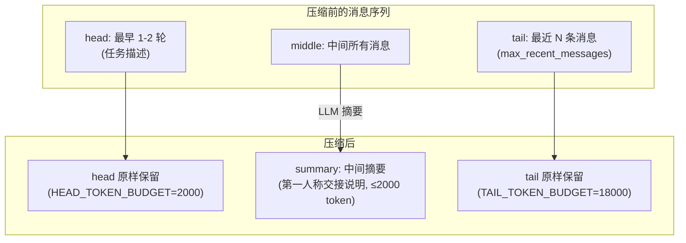
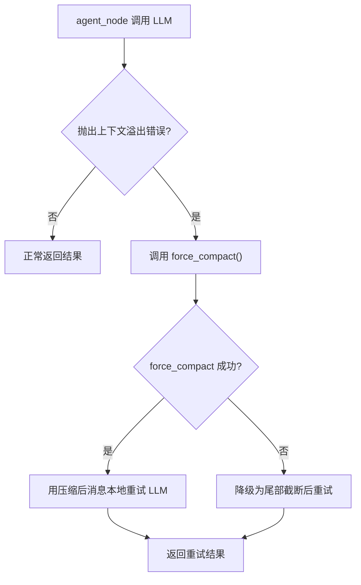

# 上下文管理

Agent 在多轮对话中需要管理 LLM 的上下文窗口，避免对话历史超出模型的最大 token 限制。本项目采用多层防御策略：工具结果截断 → 主动上下文压缩 → 反应式溢出恢复，确保长对话不会因上下文溢出而中断。

---

## 设计理念

上下文管理采用"宁可早压缩，不要晚溢出"的策略，通过三层防线逐层兜底：



| 防线 | 触发时机 | 机制 | 文件 |
|------|---------|------|------|
| 第一层：工具结果截断 | 工具执行后 | 超长结果截断为预览 + 占位提示 | `context_manager.py` `ToolResultTruncator` |
| 第二层：主动上下文压缩 | 每轮推理前 | token 超阈值时 head/tail + 中间摘要 | `context_manager.py` `ContextCompactor` |
| 第三层：反应式溢出恢复 | LLM 返回溢出错误 | 强制压缩 + 本地重试一次 | `agent_runner.py` `agent_node` |

---

## Token 估算

`TokenEstimator` 负责估算当前对话历史的 token 数量，用于判断是否需要触发上下文压缩。

### 估算策略

| 方式 | 条件 | 精度 |
|------|------|------|
| tiktoken 精确计数 | `tiktoken` 可用且模型已知 | 高 |
| tiktoken 近似计数 | `tiktoken` 可用但模型未知，回退 `cl100k_base` | 中 |
| 字符数估算 | `tiktoken` 不可用 | 低（偏向早触发） |

字符数估算的启发式规则：

- ASCII 字符：约 4 字符/token
- CJK 字符：约 1 字符/token
- 每条消息额外加约 4 token（角色开销）
- tool_call 参数额外加开销

!!! note "估算只用于提前触发"
    Token 估算故意偏向早触发（宁可早压缩不要晚溢出），不用于"跳过压缩"判断。精确的 token 用量由 LLM 返回的 `usage_metadata` 提供，通过 `usage` 协议消息回传。

---

## 工具结果截断

`ToolResultTruncator` 在工具执行结果进入 LangGraph state 之前进行截断，避免单次工具返回的大数据集占满上下文窗口。

### 截断逻辑

```
如果 tool_result 字符数 > max_chars (默认 50000):
    保留前 preview_chars 字符 (默认 2000)
    + 占位提示: "[结果已截断，原长度 X 字符。如需完整数据，请使用更具体的查询参数重新调用工具。]"
```

截断后的内容直接进入 state 的 `ToolMessage`，后续轮次自动受益——不需要在每轮重新截断。

### 配置参数

| 参数 | 配置键 | 默认值 | 说明 |
|------|--------|--------|------|
| 截断阈值 | `tool_result_max_chars` | 50000 | 超此字符数的结果触发截断 |
| 预览长度 | `tool_result_preview_chars` | 2000 | 截断后保留的前缀长度 |

---

## 上下文压缩

`ContextCompactor` 是上下文管理的核心组件，负责在对话历史过长时进行智能压缩。

### 压缩策略：head/tail + 中间摘要



#### head（头部保留）

保留最早的 1-2 轮对话（通常是用户的原始任务描述），token 预算为 `HEAD_TOKEN_BUDGET = 2000`。这部分消息原样保留，不参与摘要。

#### tail（尾部保留）

保留最近的 N 条消息（由 `max_recent_messages` 控制，默认 10），token 预算为 `TAIL_TOKEN_BUDGET = 18000`。尾部从最近的 `HumanMessage` 开始保留，确保当前对话上下文完整。

#### middle（中间摘要）

head 和 tail 之间的所有消息，由 LLM 生成第一人称"交接说明"摘要（最大 2000 token 输出）。摘要使用不绑定工具的 `ChatOpenAI.ainvoke()` 调用（摘要不需要工具调用）。

摘要消息以 `HumanMessage` 形式构建，附带 `additional_kwargs={"da_type": "summary"}` 标记，用于前向兼容。

### compact() 方法

`compact()` 方法返回 `RemoveMessage` 列表 + 摘要 `HumanMessage`，由 `compact_node` 写入 LangGraph state：

```python
def compact(self, messages):
    # 1. 分割 head / middle / tail
    head, middle, tail = self._split_messages(messages)

    # 2. 对 middle 生成摘要
    summary = await self._generate_summary(middle)

    # 3. 构建 RemoveMessage 列表 (移除被摘要替代的旧消息)
    remove_msgs = [RemoveMessage(id=m.id) for m in middle]

    # 4. 返回: 移除旧消息 + 添加摘要
    return remove_msgs + [summary_message]
```

### force_compact() 方法

`force_compact()` 用于反应式溢出恢复，与 `compact()` 的区别：

| 特性 | `compact()` | `force_compact()` |
|------|------------|-------------------|
| 触发条件 | `should_compact()` 返回 True | 跳过 `should_compact` 检查 |
| 熔断器 | 检查 3 次熔断 | 跳过熔断器检查 |
| 写回 state | 通过 `compact_node` 写回 | **不写回 state**，仅用于本地重试 |
| 摘要失败 | 返回空列表（不压缩） | 降级为简单尾部截断 |

---

## 熔断器

为防止摘要 LLM 调用反复失败导致无意义的重试，`ContextCompactor` 实现了 3 次熔断器：

```
连续摘要失败次数 < 3: should_compact() 正常返回 True/False
连续摘要失败次数 ≥ 3: should_compact() 返回 False (停止压缩尝试)
摘要成功一次: _consecutive_failures 重置为 0
```

熔断后，`compact_node` 返回空消息列表（不压缩），agent 继续使用未压缩的上下文。这是"尽力而为"策略——如果摘要服务不可用，宁可带着风险继续对话，也不要因压缩失败而阻塞。

---

## 反应式溢出恢复

当 Token 估算不准导致上下文实际溢出时，LLM API 会返回上下文溢出错误。`agent_node` 捕获此错误并执行反应式恢复：



!!! note "溢出恢复是局部的"
    `force_compact()` 生成的压缩消息列表**仅用于本次 LLM 重试**，不写回 LangGraph state。下一轮 `compact_node` 会执行持久化压缩（`RemoveMessage` 写回 state），确保状态一致性。

### 溢出错误检测

`is_context_overflow_error(exc)` 通过关键词匹配检测上下文溢出错误，覆盖：

- OpenAI `BadRequestError`（含 "context length" / "maximum context" 等关键词）
- litellm `ContextWindowExceededError`

---

## 摘要输入安全

为防止摘要请求本身导致上下文溢出，`_generate_summary()` 对输入进行截断：

| 保护措施 | 限制 | 说明 |
|---------|------|------|
| 历史消息总字符数上限 | `MAX_HISTORY_CHARS_FOR_SUMMARY = 200000` | 超出时截断最旧的消息 |
| 单条消息字符数上限 | `MAX_SINGLE_MSG_CHARS = 5000` | 超出时截断该消息内容 |
| 摘要 LLM 重试 | `retry_with_backoff(max_retries=3)` | 最多重试 3 次，不发送 retrying 消息（摘要对用户不可见） |

---

## compact_node 工作流

`compact_node` 在每轮 agent 推理前执行，是主动上下文压缩的入口：

```python
async def compact_node(state):
    messages = state["messages"]

    # 1. 检查是否需要压缩
    if not compactor.should_compact(messages):
        return {"messages": []}  # 零开销，不压缩

    # 2. 执行压缩 (可能抛异常，被 try/except 捕获)
    try:
        result = await compactor.compact(messages)
        compactor._consecutive_failures = 0  # 重置熔断器
        # 3. 摘要用量独立上报
        if summary_usage:
            protocol.send_usage(source="summary", ...)
        return {"messages": result}
    except Exception:
        compactor._consecutive_failures += 1
        return {"messages": []}  # 失败不阻塞，继续推理
```

---

## 配置参数汇总

所有上下文管理参数通过 `agent-config.ini` 配置，在 `init` 消息中下发给 Python 侧：

| 参数 | 配置键 | 默认值 | 范围 | 说明 |
|------|--------|--------|------|------|
| 上下文窗口 | `context_window` | 1048576 | 8192-2097152 | 模型上下文窗口大小（tokens） |
| 压缩阈值 | `compaction_threshold` | 0.85 | 0.50-1.0 | 窗口占比达到此比例时触发压缩 |
| 保留消息数 | `max_recent_messages` | 10 | 4-50 | 压缩后保留的最近消息条数 |
| 工具结果截断阈值 | `tool_result_max_chars` | 50000 | 1000-500000 | 超此字符数的工具结果被截断 |
| 工具结果预览长度 | `tool_result_preview_chars` | 2000 | 100-10000 | 截断后保留的前缀长度 |

---

## 参见

- [架构设计](architecture.md) — compact_node 在 LangGraph 中的位置
- [通信协议](protocol.md) — usage 消息的协议规范
- `src/PyScripts/DAWorkbench/agent/context_manager.py` — 上下文管理实现
- `src/PyScripts/DAWorkbench/agent/agent_runner.py` — compact_node 和 agent_node 实现
