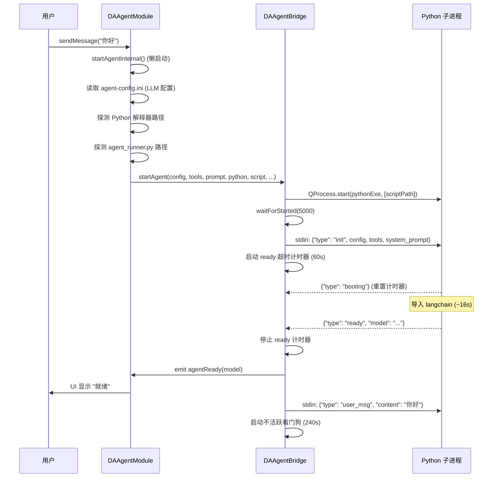
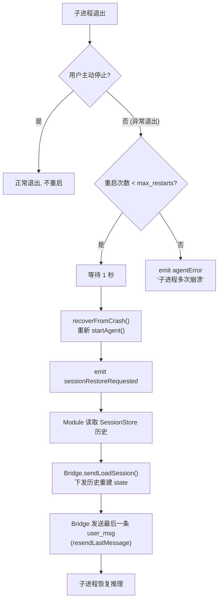
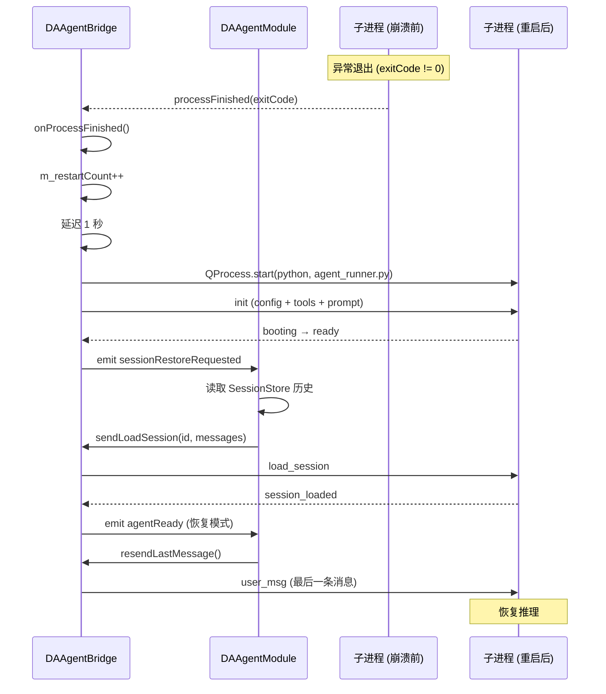

# 崩溃恢复与重连机制

Agent 子进程可能因 LLM API 超时、Python 异常、内存不足等原因崩溃。本文档描述子进程的生命周期管理、自动重启机制、会话恢复策略以及重试退避逻辑，确保 agent 在异常情况下能够自动恢复，不影响用户体验。

---

## 进程生命周期

### 启动流程



### 停止流程

| 方式 | 方法 | 行为 |
|------|------|------|
| 优雅停止 | `requestStop()` | 写 `stop` JSON → 启动超时计时器(5s) → 超时后 `kill()` → `onProcessFinished` 发 `agentBusy(false)` |
| 阻塞停止 | `stopAgent()` | 写 `stop` JSON → `waitForFinished(stopTimeout)` → 必要时 `kill()` |
| 析构 | `~DAAgentBridge()` | 自动调用 `stopAgent()` |

### 退出码含义

| 退出码 | 含义 |
|--------|------|
| 0 | 正常退出（收到 stop 消息） |
| 非 0 | 异常退出（触发崩溃恢复） |
| 62097 | `TerminateProcess` 杀死（通常因 ready 超时，无 stderr 输出） |

---

## 不活跃看门狗

`DAAgentBridge` 内置不活跃看门狗（Inactivity Watchdog），检测子进程是否卡死。

| 属性 | 默认值 | 说明 |
|------|--------|------|
| 超时时间 | 240 秒 (4 分钟) | 可通过 `inactivity_timeout_sec` 配置 |
| 暂停条件 | 工具执行中 | `ToolExecGuard` RAII 暂停/恢复 |
| 暂停条件 | 等待用户回答 | 收到 `question` 时暂停，收到 `user_answer` 恢复 |

看门狗超时后，C++ 侧会主动 `kill()` 子进程，触发崩溃恢复流程。

```cpp
// ToolExecGuard RAII 模式暂停/恢复看门狗
void DAAgentBridge::executeTool(...) {
    ToolExecGuard guard(this);  // 构造时暂停看门狗
    // ... 执行工具 ...
    // 析构时自动恢复看门狗
}
```

---

## 自动重启机制

当子进程异常退出（非用户主动停止）时，`DAAgentBridge` 自动重启子进程。



### 重启参数

| 参数 | 配置键 | 默认值 | 说明 |
|------|--------|--------|------|
| 最大重启次数 | `max_subprocess_restarts` | 3 | 超过后不再重启，报错给用户 |
| 重启延迟 | 硬编码 | 1 秒 | 避免立即重启导致雪崩 |

### 会话恢复

重启后，`DAAgentModule` 通过以下步骤恢复会话状态：

1. `DAAgentBridge` 发出 `sessionRestoreRequested` 信号
2. `DAAgentModule` 收到信号后，从 `DAAgentSessionStore` 读取当前会话的历史消息
3. 调用 `m_bridge->sendLoadSession(sessionId, messages)` 下发历史重建 LangGraph state
4. 等待 `session_loaded` 确认后，重发最后一条用户消息（`resendLastMessage`）

```cpp
// DAAgentModule 中的崩溃恢复连接
connect(m_bridge, &DAAgentBridge::sessionRestoreRequested,
        this, [this]() {
    // 读取当前会话历史
    auto messages = m_sessionStore->readMessagesForLoad(m_currentSessionId);
    // 下发给新子进程重建 state
    m_bridge->sendLoadSession(m_currentSessionId, messages);
    // 标记待恢复，agentReady 后重发最后消息
    m_pendingCrashRecovery = true;
});
```

---

## 重试与退避

LLM API 调用可能因网络波动、服务端过载等原因失败。Agent 子进程实现了完善的错误分类与指数退避重试机制。

### 错误分类

`error_classifier.py` 将 LLM API 异常分为可重试和不可重试两类：

| ErrorType | 可重试 | 触发条件 |
|-----------|--------|---------|
| `CONTEXT_OVERFLOW` | ❌ | 上下文长度超限 |
| `USER_CANCEL` | ❌ | 用户主动取消 / `asyncio.CancelledError` |
| `QUOTA_EXHAUSTED` | ❌ | `RateLimitError` 含 `insufficient_quota` |
| `AUTH_ERROR` | ❌ | `AuthenticationError` 或 HTTP 401/403 |
| `BAD_REQUEST` | ❌ | `BadRequestError`（非溢出类） |
| `RATE_LIMIT_EXHAUSTED` | ✅ | `RateLimitError`（非配额类） |
| `SERVER_ERROR_EXHAUSTED` | ✅ | 服务端 5xx 错误 |
| `NETWORK_EXHAUSTED` | ✅ | 网络超时 / 连接中断 |
| `STREAM_INTERRUPTED` | ✅ | 流式输出中断（`httpx.ReadError` 等） |
| `UNKNOWN` | ❌ | 未分类错误 |

### 指数退避算法

`retry_wrapper.py` 实现纯标准库的指数退避（无 `tenacity`/`backoff` 依赖）：

```
delay = min(base * factor^(attempt-1), max_delay) * (1 ± jitter)

base = 1000ms
factor = 2.0
max_delay = 30000ms
jitter = ±25%
max_retries = 7 (默认)
```

| 重试次数 | 基础延迟 | 含 ±25% 抖动后范围 |
|---------|---------|-------------------|
| 1 | 1000ms | 750-1250ms |
| 2 | 2000ms | 1500-2500ms |
| 3 | 4000ms | 3000-5000ms |
| 4 | 8000ms | 6000-10000ms |
| 5 | 16000ms | 12000-20000ms |
| 6 | 30000ms (封顶) | 22500-30000ms |
| 7 | 30000ms | 22500-30000ms |

!!! note "服务端 Retry-After 优先"
    如果 LLM API 返回了 `Retry-After` HTTP 头（整数秒或 HTTP-date 格式），退避延迟使用服务端指定值，不使用计算值。

### 重试中断

退避 sleep 期间支持用户中断：

```python
async def sleep_with_abort(seconds, stop_event):
    """退避 sleep，用户 stop 时立即返回 False"""
    try:
        await asyncio.wait_for(stop_event.wait(), timeout=seconds)
        return False  # stop_event 被 set，中断
    except asyncio.TimeoutError:
        return True   # 正常超时，继续重试
```

### 首 token 前重试规则

!!! warning "首 token 后不重试"
    流式输出开始后（已向 UI 推送 token），不再重试。这是为了避免部分输出重复——用户已经看到了部分回复，重试会产生重复内容。

    只有在**首 token 之前**发生错误才重试。首 token 之后的错误直接抛出，由用户决定是否重新发送。

```python
async def _stream_llm(self, messages):
    stream_yielded = False  # 闭包变量跟踪是否已推送 token

    async def _call():
        nonlocal stream_yielded
        async for chunk in self.llm.astream(messages):
            stream_yielded = True  # 标记已开始输出
            # ... 推送 token ...

    # retryable_check: 首 token 后不重试
    await retry_with_backoff(
        _call,
        retryable_check=lambda exc: not stream_yielded
    )
```

### 重试通知

每次重试前通过 `on_retry` 回调发送 `retrying` 协议消息，UI 显示重试状态：

```json
{
    "type": "retrying",
    "attempt": 2,
    "max_attempts": 7,
    "delay_ms": 4000,
    "error_type": "network_exhausted",
    "error_message": "Connection timeout"
}
```

---

## 恢复时序图

### 子进程崩溃恢复



### LLM API 失败重试


---

## 配置参数汇总

| 参数 | 配置键 | 默认值 | 说明 |
|------|--------|--------|------|
| 就绪超时 | `ready_timeout_sec` | 60 | 子进程启动后等待 ready 的超时 |
| 停止超时 | `stop_timeout_sec` | 5 | stop 后等待退出的超时 |
| 请求超时 | `request_timeout_sec` | 120 | LLM API 单次请求超时 |
| 不活跃超时 | `inactivity_timeout_sec` | 240 | 子进程无响应的超时 |
| 最大重试 | `max_retries` | 7 | LLM API 调用最大重试次数 |
| 最大重启 | `max_subprocess_restarts` | 3 | 子进程崩溃最大重启次数 |

---

## 参见

- [通信协议](protocol.md) — retrying/error/done 消息的协议规范
- [上下文管理](context-management.md) — 溢出恢复与 force_compact 机制
- [会话持久化](session-management.md) — 崩溃后恢复会话历史的机制
- `src/DAAgent/DAAgentBridge.cpp` — 进程管理与崩溃恢复实现
- `src/PyScripts/DAWorkbench/agent/retry_wrapper.py` — 指数退避重试实现
- `src/PyScripts/DAWorkbench/agent/error_classifier.py` — 错误分类实现
