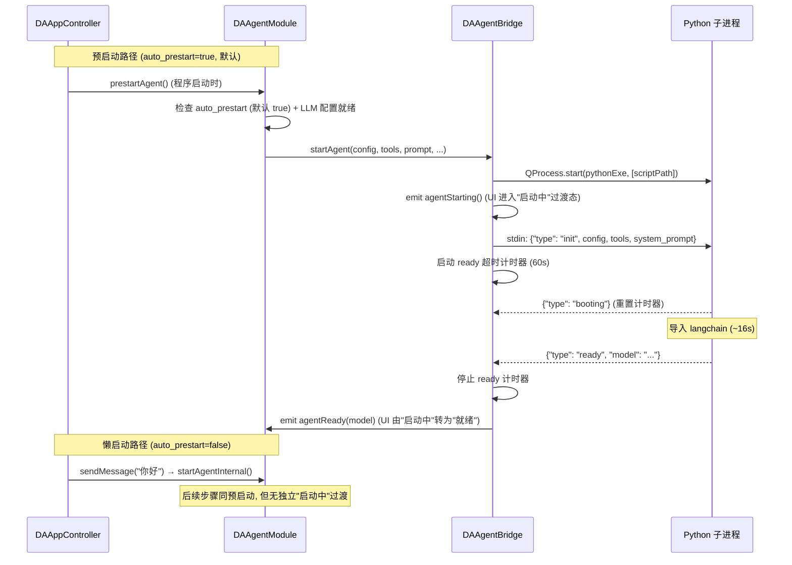
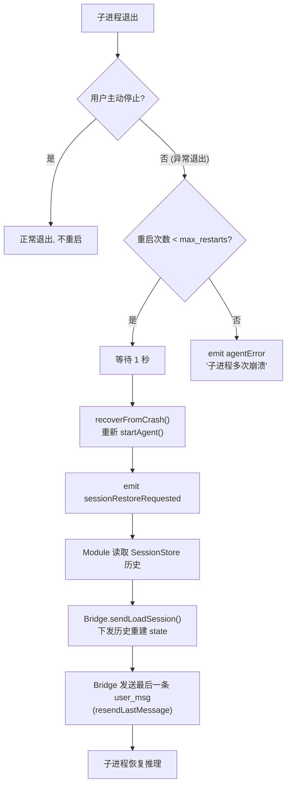
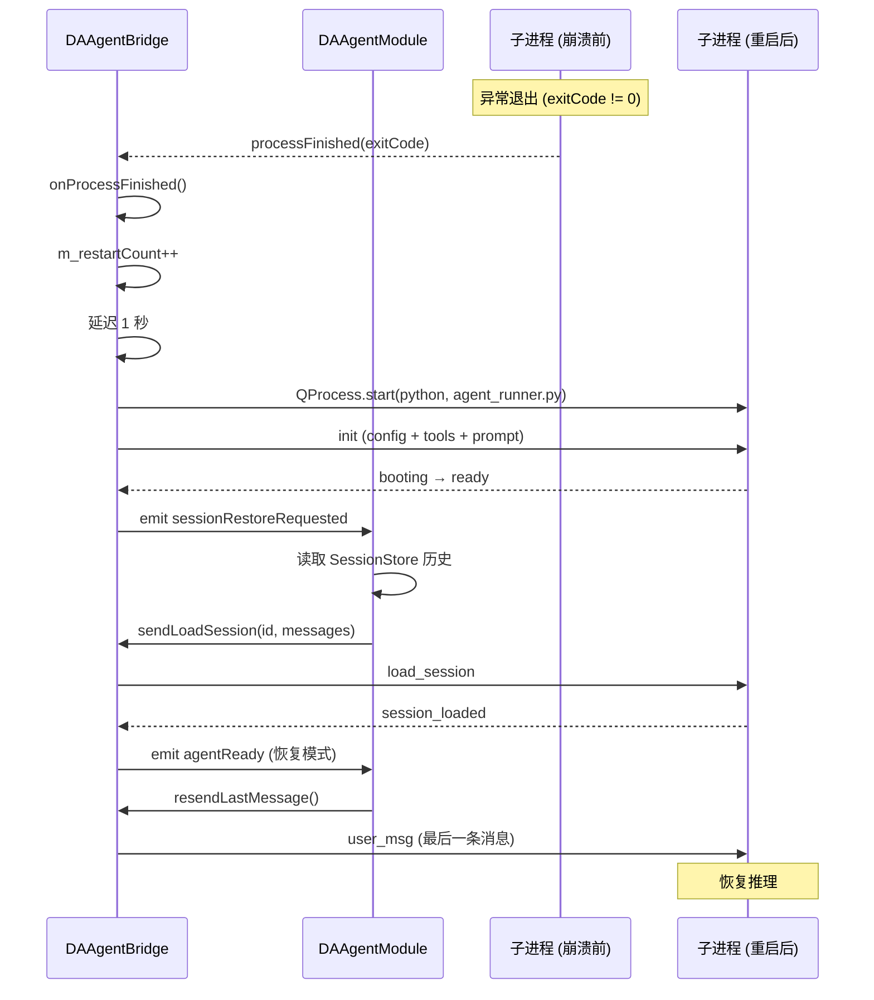
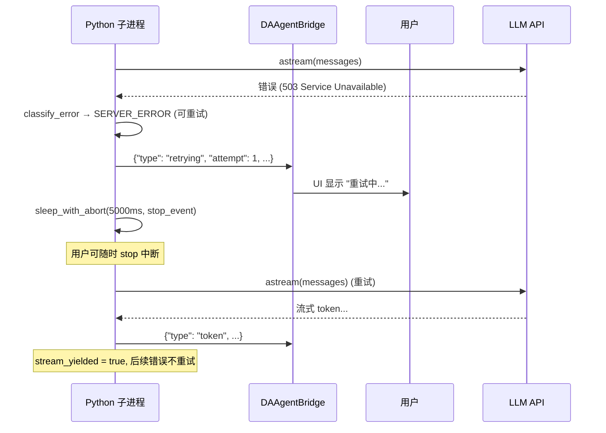

# 崩溃恢复与重连机制

Agent 子进程可能因 LLM API 超时、Python 异常、内存不足等原因崩溃。本文档描述子进程的生命周期管理、自动重启机制、会话恢复策略以及重试退避逻辑，确保 agent 在异常情况下能够自动恢复，不影响用户体验。

---

## 进程生命周期

### 启动流程

子进程启动有两条路径，由 `auto_prestart` 配置开关（默认 `true`）决定：



!!! note "agentStarting 与 agentBusy 区分"
    `agentStarting` 信号在子进程启动时立即发射，令 UI 进入"启动中"过渡态，与 `agentBusy(thinking)`（推理中）区分——避免冷启动期间（约 16 秒 langchain 导入）被误显示为"思考中"。`agentReady` / `agentBusy(false)` / 进程退出后清除该状态。预启动、懒启动、崩溃重启三条路径均触发 `agentStarting`。

### 停止流程

| 方式 | 方法 | 行为 |
|------|------|------|
| 优雅停止 | `requestStop()` | 写 `stop` JSON → 启动超时计时器(5s) → 超时后 `kill()` → `onProcessFinished` 发 `agentBusy(false)` |
| 阻塞停止 | `stopAgent()` | 写 `stop` JSON → `waitForFinished(stopTimeout)` → 必要时 `kill()` |
| 析构 | `~DAAgentBridge()` | 自动调用 `stopAgent()` |

### 退出码含义

| 退出码 | 含义 |
|--------|------|
| 0 | 正常退出（收到 stop 消息） |
| 非 0 | 异常退出（触发崩溃恢复） |
| 62097 | `TerminateProcess` 杀死（通常因 ready 超时，无 stderr 输出） |

---

## 不活跃看门狗

`DAAgentBridge` 内置不活跃看门狗（Inactivity Watchdog），检测子进程是否卡死。

| 属性 | 默认值 | 说明 |
|------|--------|------|
| 超时时间 | 240 秒 (4 分钟) | 可通过 `inactivity_timeout_sec` 配置 |
| 暂停条件 | 工具执行中 | `ToolExecGuard` RAII 暂停/恢复 |
| 暂停条件 | 等待用户回答 | 收到 `question` 时暂停，收到 `user_answer` 恢复 |

看门狗超时后，C++ 侧会主动 `kill()` 子进程，触发崩溃恢复流程。

```cpp
// ToolExecGuard RAII 模式暂停/恢复看门狗
void DAAgentBridge::executeTool(...) {
    ToolExecGuard guard(this);  // 构造时暂停看门狗
    // ... 执行工具 ...
    // 析构时自动恢复看门狗
}
```

---

## 自动重启机制

当子进程异常退出（非用户主动停止）时，`DAAgentBridge` 自动重启子进程。



### 重启参数

| 参数 | 配置键 | 默认值 | 说明 |
|------|--------|--------|------|
| 最大重启次数 | `max_subprocess_restarts` | 3 | 超过后不再重启，报错给用户 |
| 重启延迟 | 硬编码 | 1 秒 | 避免立即重启导致雪崩 |

### 会话恢复

重启后，`DAAgentModule` 通过以下步骤恢复会话状态：

1. `DAAgentBridge` 发出 `sessionRestoreRequested` 信号
2. `DAAgentModule` 收到信号后，从 `DAAgentSessionStore` 读取当前会话的历史消息
3. 调用 `m_bridge->sendLoadSession(sessionId, messages)` 下发历史重建 LangGraph state
4. 等待 `session_loaded` 确认后，重发最后一条用户消息（`resendLastMessage`）

```cpp
// DAAgentModule 中的崩溃恢复连接
connect(m_bridge, &DAAgentBridge::sessionRestoreRequested,
        this, [this]() {
    // 读取当前会话历史
    auto messages = m_sessionStore->readMessagesForLoad(m_currentSessionId);
    // 下发给新子进程重建 state
    m_bridge->sendLoadSession(m_currentSessionId, messages);
    // 标记待恢复，agentReady 后重发最后消息
    m_pendingCrashRecovery = true;
});
```

### 模型热替换：不重启的容错替代路径

当需要切换 LLM 配置（供应商 / 模型 / API Key）时，不必走"杀子进程 → 重启 → 恢复会话"的崩溃恢复路径。`DAAgentModule::setActiveModel()` → `DAAgentBridge::reconfigureAgent()` 下发 `reconfigure` 消息，Python 端 `AgentRunner.reconfigure()` 在两轮之间热替换 `ChatOpenAI` 实例——不重启子进程、不丢 `MemorySaver` 会话状态。失败安全：先构造新 LLM，成功后才更新，构造失败发 `error` 不破坏旧模型。详见 [通信协议 - reconfigure](./protocol.md#reconfigure--模型热替换)。

### 死循环防护

除无活动看门狗外，Python 侧还有两重防死循环机制，避免 agent 陷入工具调用循环最终拖垮子进程：

- **`recursion_limit`**（默认不限制，-1）：限制 LangGraph 图最大迭代步数（`compact → agent → tools → ...`，单回合内计数）。超出抛 `GraphRecursionError`，被 `main()` 捕获并报为 `error_type="recursion_limit"`，随后发 `done` 结束本轮。
- **重复工具调用硬终止**：`AgentRunner` 用 `_last_full_sig` / `_full_sig_repeat_count` 跟踪连续相同的完整 `tool_calls` 签名，连续 3 次相同签名（阈值 `_repeat_terminate_threshold=3`）则 `agent_node` 强制剥离 `tool_calls` 并以最终回复结束（router → END）。配合 `tool_node` 的软引导（已执行签名重复时返回引导性 `ToolMessage` 而非重复执行），在撞到 `recursion_limit` 之前优雅终止死循环。

---

## 重试与退避

LLM API 调用可能因网络波动、服务端过载等原因失败。Agent 子进程实现了完善的错误分类与线性退避重试机制，覆盖所有服务器波动类错误（400/429/5xx/网络），避免长任务因瞬时故障中断。

### 错误分类

`error_classifier.py` 将 LLM API 异常分为可重试和不可重试两类：

| ErrorType | 可重试 | 触发条件 |
|-----------|--------|---------|
| `CONTEXT_OVERFLOW` | ❌ | 上下文长度超限（由 `agent_node` 的 force_compact 专用恢复，盲目重试超大请求无意义） |
| `USER_CANCEL` | ❌ | 用户主动取消 / `asyncio.CancelledError` |
| `QUOTA_EXHAUSTED` | ❌ | `RateLimitError` 含 `insufficient_quota`（配置类错误，快速失败） |
| `AUTH_ERROR` | ❌ | `AuthenticationError` 或 HTTP 401/403（配置类错误，快速失败） |
| `BAD_REQUEST` | ✅ | `BadRequestError`（非溢出类；网关瞬时 400 可自愈，悬空 tool_calls 类结构性 400 已由 `agent_node` 请求前主动修复） |
| `RATE_LIMIT_EXHAUSTED` | ✅ | `RateLimitError`（非配额类） |
| `SERVER_ERROR_EXHAUSTED` | ✅ | 服务端 5xx 错误 |
| `NETWORK_EXHAUSTED` | ✅ | 网络超时 / 连接中断 |
| `STREAM_INTERRUPTED` | ✅ | 流式输出中断（`httpx.ReadError` 等） |
| `UNKNOWN` | 视情况 | 带 API/HTTP 特征（`openai.APIError` 实例或含 `status_code`）时可重试；纯本地异常（代码 bug 等）快速失败 |

!!! warning "溢出关键词表禁止加入通用包装词"
    `is_context_overflow_error` 的关键词表（`error_classifier.py` 与 `context_manager.py` 两处同步维护）只允许特异性短语（"context length"、"maximum context" 等）。litellm 对**所有**上游 400 都包装 "The request is invalid" 前缀——把这类通用词加入关键词表会把悬空 tool_calls 等无关的 `BadRequestError` 误判为上下文溢出，UI 显示误导性的「上下文窗口超限且压缩失败」标题。

### 线性退避算法

`retry_wrapper.py` 实现纯标准库的线性退避（无 `tenacity`/`backoff` 依赖），三个参数均可在「设置 → Agent 设置」页配置（持久化于 `agent-config.json` llm 分组，经 init/reconfigure 协议下发）：

```
delay(k) = retry_interval_sec + (k - 1) * retry_interval_increment_sec

max_retries (m) = 5 (默认)
retry_interval_sec (n) = 5 (默认)
retry_interval_increment_sec (p) = 1 (默认)
```

默认参数下各次重试前的等待：

| 重试次数 k | 等待 |
|---------|------|
| 1 | 5s |
| 2 | 6s |
| 3 | 7s |
| 4 | 8s |
| 5 | 9s |

无抖动——进度条（`retrying` 消息）显示的等待与用户配置完全一致。最坏总等待 35s，远小于看门狗无活动超时（默认 240s），且每次重试前的 `retrying` 消息会刷新看门狗。

!!! note "服务端 Retry-After 优先"
    如果 LLM API 返回了 `Retry-After` HTTP 头（整数秒或 HTTP-date 格式），退避延迟使用服务端指定值，不使用计算值。

### 重试中断

退避 sleep 期间支持用户中断：

```python
async def sleep_with_abort(seconds, stop_event):
    """退避 sleep，用户 stop 时立即返回 False"""
    try:
        await asyncio.wait_for(stop_event.wait(), timeout=seconds)
        return False  # stop_event 被 set，中断
    except asyncio.TimeoutError:
        return True   # 正常超时，继续重试
```

### 首 token 前重试规则

!!! warning "首 token 后不重试"
    流式输出开始后（已向 UI 推送 token），不再重试。这是为了避免部分输出重复——用户已经看到了部分回复，重试会产生重复内容。

    只有在**首 token 之前**发生错误才重试。首 token 之后的错误直接抛出，由用户决定是否重新发送。

```python
async def _stream_llm(self, messages):
    stream_yielded = False  # 闭包变量跟踪是否已推送 token

    async def _call():
        nonlocal stream_yielded
        async for chunk in self.llm.astream(messages):
            stream_yielded = True  # 标记已开始输出
            # ... 推送 token ...

    # retryable_check: 首 token 后不重试
    await retry_with_backoff(
        _call,
        retryable_check=lambda exc: not stream_yielded
    )
```

### 重试通知

每次重试前通过 `on_retry` 回调发送 `retrying` 协议消息，UI 显示重试状态：

```json
{
    "type": "retrying",
    "attempt": 2,
    "max_attempts": 5,
    "delay_ms": 6000,
    "error_type": "network_exhausted",
    "error_message": "Connection timeout"
}
```

---

## 恢复时序图

### 子进程崩溃恢复



### LLM API 失败重试



---

## 配置参数汇总

| 参数 | 配置键 | 默认值 | 说明 |
|------|--------|--------|------|
| 就绪超时 | `ready_timeout_sec` | 60 | 子进程启动后等待 ready 的超时 |
| 停止超时 | `stop_timeout_sec` | 5 | stop 后等待退出的超时 |
| 请求超时 | `request_timeout_sec` | 120 | LLM API 单次请求超时 |
| 不活跃超时 | `inactivity_timeout_sec` | 240 | 子进程无响应的超时 |
| 最大重试 | `max_retries` | 5 | LLM API 调用最大重试次数（m） |
| 重试间隔 | `retry_interval_sec` | 5 | 首次重试前等待秒数（n） |
| 重试间隔递增 | `retry_interval_increment_sec` | 1 | 每次重试失败后等待递增秒数（p） |
| 最大重启 | `max_subprocess_restarts` | 3 | 子进程崩溃最大重启次数 |
| 图最大迭代步数 | `recursion_limit` | -1（不限制） | LangGraph 图最大迭代步数（单回合内计数），防死循环；`GraphRecursionError` 报为 `error_type="recursion_limit"`；有限值建议 150 |
| 预启动开关 | `auto_prestart` | true | 程序启动时是否自动预热 agent 子进程（关闭则回退到懒启动） |

---

## 参见

- [通信协议](./protocol.md) — retrying/error/done 消息的协议规范
- [上下文管理](./context-management.md) — 溢出恢复与 force_compact 机制
- [会话持久化](./session-management.md) — 崩溃后恢复会话历史的机制
- `src/DAAgent/DAAgentBridge.cpp` — 进程管理与崩溃恢复实现
- `src/PyScripts/DAWorkbench/agent/retry_wrapper.py` — 线性退避重试实现
- `src/PyScripts/DAWorkbench/agent/error_classifier.py` — 错误分类实现
