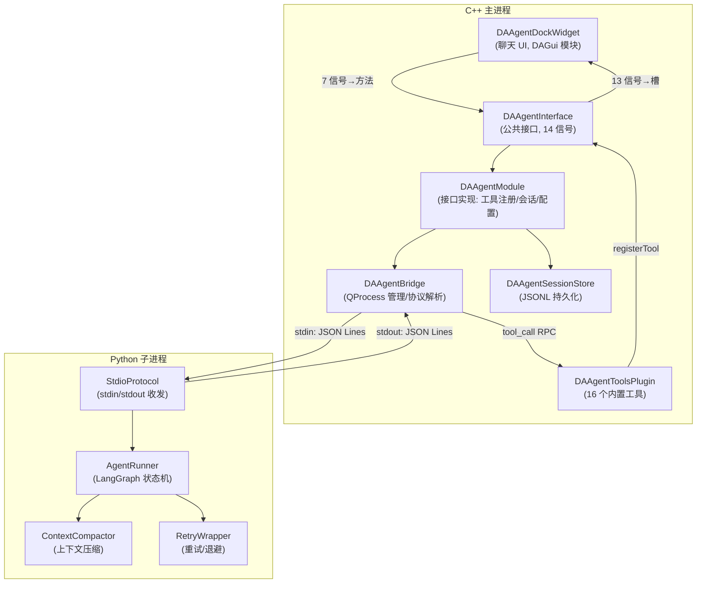

# Agent 模块概述

DAWorkbench 的 AI Agent 助手模块为平台提供内嵌 LLM 聊天与数据分析工具调用能力。Agent 能够理解用户的自然语言指令，自动调用平台的数据查询、绘图、文件操作等工具完成任务，并通过流式输出实时展示推理过程。

---

## 主要功能特性

- ✅ **双进程架构**：C++ 主进程管理工具执行与会话持久化，Python 子进程运行 LLM 推理，两者通过 stdin/stdout 管道以 JSON Lines 协议通信，互不影响
- ✅ **流式输出**：LLM 生成的 token 实时流式推送到聊天界面，用户无需等待完整回复即可看到推理过程
- ✅ **工具调用**：内置 16 个工具（数据查询 5 个、绘图 8 个、文件/报告 3 个），覆盖数据分析全流程；支持插件扩展自定义工具
- ✅ **上下文管理**：自动检测上下文窗口占用，超过阈值时智能压缩历史对话（保留头部任务描述 + 尾部近期消息 + 中间摘要），避免上下文溢出
- ✅ **人机交互提问**：Agent 在需要额外信息时主动向用户提问，支持选项选择与自由输入，实现 human-in-the-loop 协作
- ✅ **会话持久化**：对话历史以 JSONL 格式持久化到磁盘，支持多会话切换、工程内会话导出/导入、自动清理过期会话
- ✅ **崩溃恢复**：子进程异常退出时自动重启（最多 3 次），恢复会话状态并重发最后一条用户消息
- ✅ **重试与退避**：网络波动、服务端 5xx 等可重试错误自动指数退避重试，支持用户随时中断
- ✅ **API Key 加密存储**：LLM API Key 通过 Windows DPAPI 加密后存储，设置页面只处理明文

---

## 核心概念

### 双进程模型

Agent 采用 C++ + Python 双进程架构。C++ 主进程持有工具注册表、会话持久化层和 QProcess 管理器；Python 子进程运行 LangGraph 状态机驱动 LLM 推理。工具的 schema（OpenAI function schema 格式）在启动时一次性下发给 Python 侧，但工具的实际执行始终在 C++ 主进程中完成——LLM 只看到工具的接口描述，不直接执行工具代码。

### 懒启动

子进程不在程序启动时创建，而是在用户首次发送消息时才启动（`startAgentInternal()`）。启动时 C++ 侧一次性下发 `init` 消息，包含 LLM 配置、工具规格和系统提示词。由于 LangChain 冷启动导入约需 16 秒，Python 侧在导入前先发送 `booting` 心跳以重置 C++ 侧的就绪超时计时器。

### JSON Lines 协议

两个进程通过 QProcess 的匿名管道以 JSON Lines 协议通信——每行一条 JSON 消息，stdout 专用于协议通信，所有日志输出走 stderr。协议定义了 6 种 C++→Python 消息和 11 种 Python→C++ 消息，覆盖用户消息、工具调用、流式 token、会话切换等全部交互场景。

---

## 架构总览

> 图中 DAGui 与 DAAgent 互不依赖，两者的信号↔槽由 APP 层 `DAAppController` 直接 connect。

---

## 模块组成

### 源码目录

| 目录 | 模块 | 职责 |
|------|------|------|
| `src/DAAgent/` | DAAgent (L4 接口层) | Agent 框架库：接口定义、子进程管理、会话持久化、工具基类 |
| `src/DAGui/Agent/` | DAGui (L3 界面层) | 聊天 UI：DockWidget、WebChannel、前端资源 |
| `src/APP/SettingPages/` | APP (L5 应用层) | LLM 设置页 |
| `src/PyScripts/DAWorkbench/agent/` | Python 脚本 | 子进程入口：LLM 推理、上下文管理、重试逻辑 |
| `plugins/DAAgentTools/` | 插件 | 16 个内置工具实现 |

### 关键类

| 类名 | 模块 | 职责 |
|------|------|------|
| `DAAgentInterface` | DAAgent | 公共接口：14 个信号 + 工具/提示词注册 + LLM 配置 + 会话管理 |
| `DAAgentModule` | DAAgent | 接口实现：工具注册表、系统提示词组装、懒启动、配置读写、DPAPI 加密 |
| `DAAgentBridge` | DAAgent | QProcess 生命周期管理、JSON Lines 协议解析、工具执行、崩溃恢复 |
| `DAAgentSessionStore` | DAAgent | JSONL 会话持久化：读写、索引、清理、标题、导出导入 |
| `DAAbstractAgentTool` | DAAgent | 工具抽象基类（纯虚）：`getToolSpec` / `execute` / `getOwnerModule` |
| `DAAgentToolBase` | DAAgent | 瘦工具基类：数据访问 + 响应方法（`DAAgent_API` 导出供插件继承） |
| `DAAgentDockWidget` | DAGui | 聊天面板（QWebEngine + 输入框 + 会话下拉） |
| `DAAgentWebChannel` | DAGui | C++↔JS 桥（QWebChannel） |
| `DAAgentSettingsWidget` | APP | LLM 设置页（经 `setAgentInterface` 注入接口） |
| `DAAgentToolsPlugin` | 插件 | 注册 16 个内置工具 + `figure_reference` 系统提示词 |
| `DAAgentChartToolBase` | 插件 | 图表工具基类（继承瘦 `DAAgentToolBase`，提供图表访问方法） |
| `StdioProtocol` | Python | JSON Lines 协议收发（后台线程读 stdin → asyncio.Queue） |
| `AgentRunner` | Python | LangGraph 状态机：compact → agent → {ask_user \| tools \| END} |
| `ContextCompactor` | Python | 上下文压缩：head/tail 保留 + 中间 LLM 摘要 + 熔断 |
| `TokenEstimator` | Python | Token 估算：tiktoken 优先，char-based 兜底 |

---

## 文档索引

| 文档 | 内容 |
|------|------|
| [架构设计](architecture.md) | 双进程模型、模块职责、信号链、核心设计决策 |
| [通信协议](protocol.md) | JSON Lines 协议规范、消息类型、启动握手、工具 RPC |
| [上下文管理](context-management.md) | Token 估算、上下文压缩、工具结果截断、溢出恢复 |
| [崩溃恢复与重连](crash-recovery.md) | 进程生命周期、自动重启、会话恢复、重试退避 |
| [工具开发指南](tool-development.md) | 工具基类、注册机制、内置工具、自定义工具开发 |
| [会话持久化](session-management.md) | JSONL 格式、会话索引、导出导入、自动清理 |

---

## 参考资料

- `src/DAAgent/AGENTS.md` — DAAgent 模块 AI 开发必读指南（579 行，含铁律 15 条）
- `DAAgentDecouplePlan.md` — DAAgent 解耦重构方案（从 DAGui 依赖到纯框架库的演进）
- `src/DAAgent/system_prompt.md` — 系统提示词（外部可编辑 markdown）
- `src/PyScripts/DAWorkbench/agent/agent_runner.py` — Python 子进程入口脚本
- `docs/zh/dev-guide/agent-runtime-watchdog.md` — Agent 运行时看门狗诊断文档
