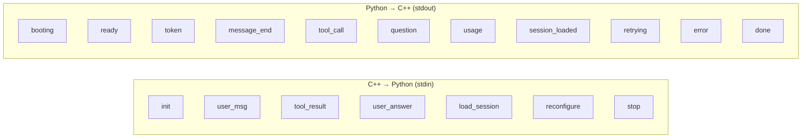
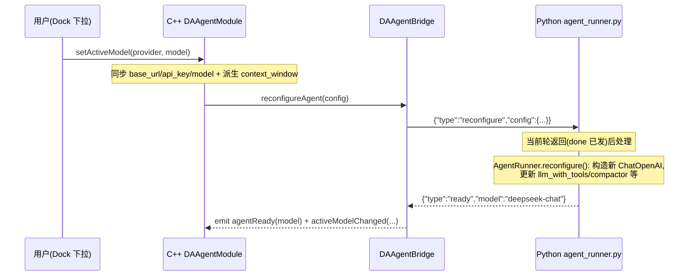
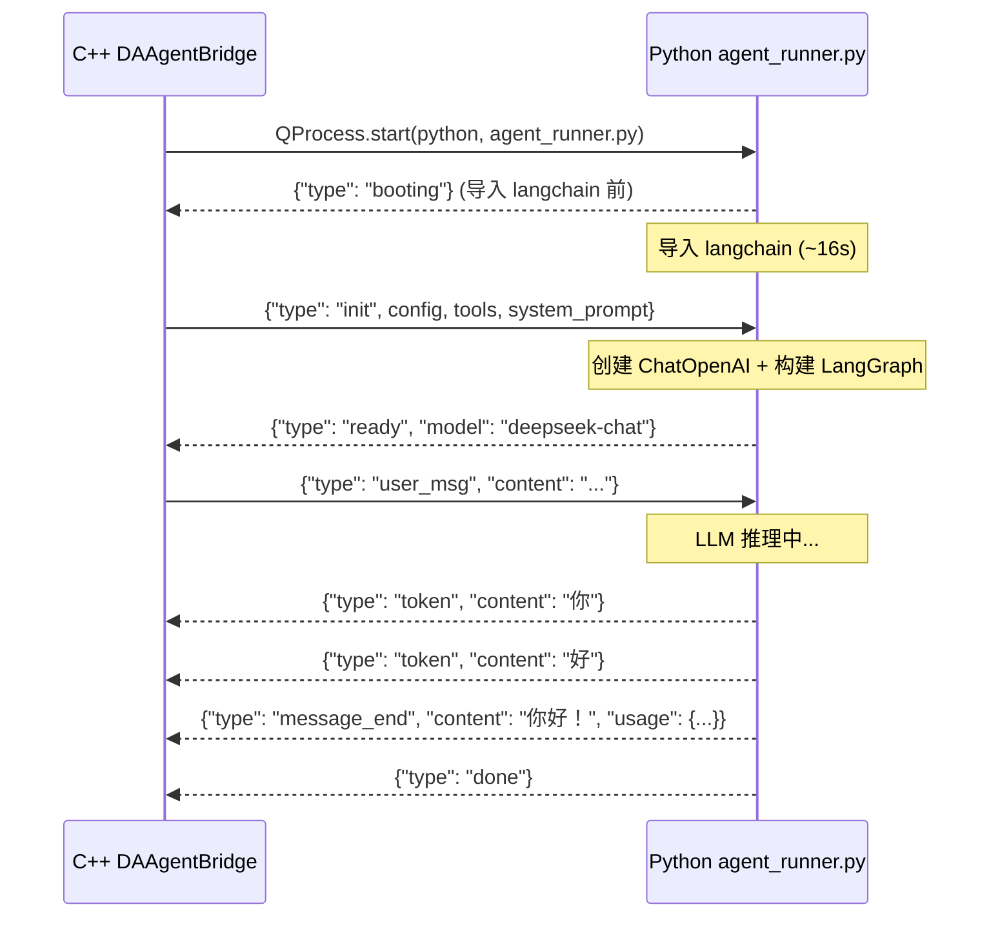
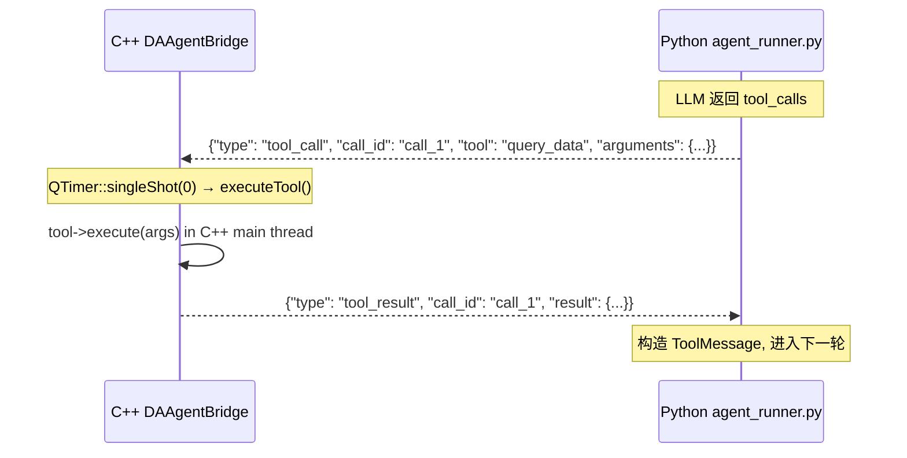
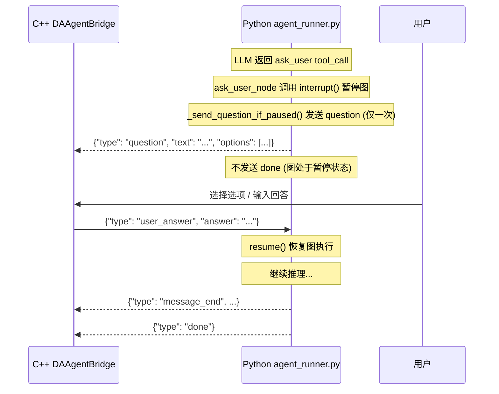
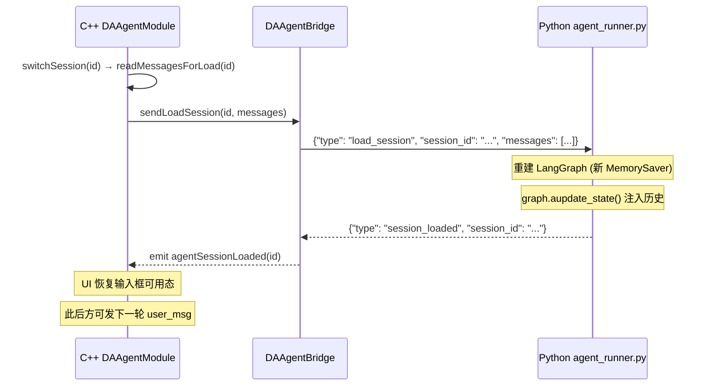

# JSON Lines 通信协议

C++ 主进程与 Python 子进程通过 QProcess 的匿名管道以 JSON Lines 协议通信。**stdout 专用于协议通信**，所有日志/调试输出必须走 stderr。每行一条 JSON 消息，UTF-8 编码，行尾 `\n`。

---

## 协议总览



---

## C++ → Python（stdin）

### init — 启动配置

子进程启动后，C++ 一次性下发 LLM 配置、工具规格和系统提示词。

```json
{
    "type": "init",
    "config": {
        "base_url": "https://api.deepseek.com/v1",
        "api_key": "sk-...",
        "model": "deepseek-chat",
        "context_window": 262144,
        "max_output_tokens": 8192,
        "compaction_threshold": 0.85,
        "max_recent_messages": 10,
        "tool_result_max_chars": 20000,
        "tool_result_preview_chars": 2000,
        "request_timeout_sec": 120,
        "max_retries": 7,
        "recursion_limit": -1,
        "inactivity_timeout_sec": 240,
        "max_subprocess_restarts": 3,
        "auto_prestart": true,
        "ready_timeout_sec": 60,
        "stop_timeout_sec": 5,
        "max_sessions": 20,
        "session_retention_days": 30
    },
    "tools": [
        {
            "type": "function",
            "function": {
                "name": "list_data",
                "description": "List all loaded data",
                "parameters": {
                    "type": "object",
                    "properties": {},
                    "required": []
                }
            }
        }
    ],
    "system_prompt": "You are a data analysis assistant..."
}
```

!!! warning "config 必填字段"
    `config` 中 `base_url`/`api_key`/`model` 三项缺一不可，子进程会报错退出。上下文管理参数有默认值兜底。

!!! note "context_window / max_output_tokens 按激活模型派生"
    `context_window`（默认 262144）与 `max_output_tokens`（默认 8192）不再是一个全局固定值，而是由激活供应商 + 激活模型条目派生（见 `DAAgentModule.cpp` 的 `setActiveModel` / `syncActiveConnection`）。切换激活模型时，经 `reconfigure` 消息把新值热下发给运行中的子进程。

### user_msg — 用户消息

触发一轮 agent 推理。

```json
{"type": "user_msg", "content": "帮我查看当前有哪些数据"}
```

### tool_result — 工具执行结果

C++ 执行工具后，将结果回传给 Python（RPC 应答）。

```json
{
    "type": "tool_result",
    "call_id": "call_abc123",
    "result": {
        "success": true,
        "data": {"rows": 100, "cols": 5, "columns": ["A", "B"]}
    }
}
```

### user_answer — 用户回答

用户对 HITL 提问的回答，触发 LangGraph `resume()`。

```json
{"type": "user_answer", "answer": "使用折线图"}
```

### load_session — 会话切换

切换会话时下发历史消息，重建 LangGraph state（不重启子进程）。

```json
{
    "type": "load_session",
    "session_id": "uuid-xxxx",
    "messages": [
        {"role": "human", "content": "你好"},
        {"role": "ai", "content": "你好！有什么可以帮你的？"}
    ]
}
```

### reconfigure — 模型热替换

运行中热替换 LLM 配置（base_url/api_key/model/max_output_tokens 等），不重启子进程、不重建图、不丢 MemorySaver 会话状态。

```json
{
    "type": "reconfigure",
    "config": {
        "base_url": "https://api.deepseek.com/v1",
        "api_key": "sk-...",
        "model": "deepseek-chat",
        "max_output_tokens": 8192,
        "request_timeout_sec": 120,
        "context_window": 262144
    }
}
```

!!! note "reconfigure 不发 done"
    `reconfigure` 与 `load_session` 同构，不是一轮对话：消息在 stdin 缓冲区排队，当前轮 `run()`/`resume()` 返回（`done` 已发）后主循环才处理它——当前轮用旧模型跑完，下一轮用新模型。成功由 Python 端 `AgentRunner.reconfigure()` 内部发 `ready` 确认（不发 `done`）。失败安全：先构造新 `ChatOpenAI`，成功后才更新 `self.*`，构造失败发 `error` 不破坏旧 LLM。



### stop — 停止

优雅停止，子进程退出主循环。

```json
{"type": "stop"}
```

---

## Python → C++（stdout）

### booting — 启动心跳

**必须在导入 LangChain 之前发送**。C++ 收到后重置 ready 超时计时器。

```json
{"type": "booting"}
```

!!! danger "省略 booting 会导致静默崩溃"
    LangChain 冷启动导入约 16 秒。若不发送 booting 心跳，C++ 的 60 秒 ready 超时计时器会在导入期间 `kill()` 子进程。`TerminateProcess` 不会 flush Python 的块缓冲 stderr，导致**静默崩溃**（exitCode=62097，无任何 stderr 输出）。

### ready — 就绪

初始化完成，C++ 停止 ready 超时计时器。

```json
{"type": "ready", "model": "deepseek-chat"}
```

### token — 流式 token

LLM 生成的 token 逐个推送。

```json
{"type": "token", "content": "当前"}
```

### message_end — 消息结束

本轮 LLM 最终回复，附带 LLM 返回的 token 用量统计。

```json
{
    "type": "message_end",
    "content": "当前已加载 3 个数据集...",
    "usage": {
        "input_tokens": 1500,
        "output_tokens": 80,
        "total_tokens": 1580
    }
}
```

!!! note "message_end.usage 是每轮权威锚点"
    `message_end` 附带的 `usage` 是本轮 LLM 返回的真实 token 用量，作为权威锚点（与独立的 `usage` 消息互补）。C++ 侧将其**累加进会话累计统计**（`mCumulativeIn/Out/TotalTokens`），上下文压缩不再重置这些累计值——UI 展示的是会话级累计用量，切换会话时从持久化 `usage` 记录重放累计。

### tool_call — 工具调用

请求 C++ 执行工具。Python 端会阻塞等待匹配 `call_id` 的 `tool_result`。

```json
{
    "type": "tool_call",
    "call_id": "call_abc123",
    "tool": "list_data",
    "arguments": {}
}
```

### question — HITL 提问

向用户提问，**只发送一次**。

```json
{
    "type": "question",
    "text": "你想使用哪种图表类型？",
    "options": ["折线图", "柱状图", "散点图"],
    "multi_select": false
}
```

### usage — Token 用量

独立的 token 统计回传（如上下文摘要的用量）。

```json
{
    "type": "usage",
    "input_tokens": 5000,
    "output_tokens": 500,
    "total_tokens": 5500,
    "source": "summary"
}
```

`source` 字段标识用量来源，取值：

| `source` 值 | 含义 |
|------------|------|
| `agent`（默认） | 普通对话轮的用量（含 `message_end.usage` 经 `agentUsage` 转发的 `source="agent"`） |
| `summary` | 上下文摘要（compact）生成产生的用量 |
| `streaming_estimate` | 流式过程中的 token 估算（`message_end.usage` 到达前的预估） |

### session_loaded — 会话加载完成

`load_session` 后 Python 重建 state 完成的确认。

```json
{"type": "session_loaded", "session_id": "uuid-xxxx"}
```

!!! warning "收到 session_loaded 前禁止发 user_msg"
    在收到 `session_loaded` 之前发送 `user_msg` 会导致 state 未重建完毕，历史消息丢失。

### retrying — 重试通知

指数退避重试期间的通知。

```json
{
    "type": "retrying",
    "attempt": 2,
    "max_attempts": 7,
    "delay_ms": 4000,
    "error_type": "network_exhausted",
    "error_message": "Connection timeout"
}
```

### error — 错误

子进程侧的不可恢复错误。

```json
{
    "type": "error",
    "message": "Authentication failed",
    "error_type": "auth_error",
    "detail": "Invalid API key"
}
```

### done — 本轮结束

本轮处理结束。暂停于 `interrupt()` 期间**不发送** done。

```json
{"type": "done"}
```

---

## 启动握手时序



---

## 工具调用 RPC 时序



!!! note "工具执行通过 QTimer::singleShot(0) 投递"
    工具执行通过 `QTimer::singleShot(0)` 投递回主线程事件循环，避免在 stdout 读取回调中长时间阻塞管道（管道阻塞会死锁子进程）。

---

## HITL 提问时序



---

## 会话切换时序



---

## 协议细节与陷阱

### stdout 编码

Python 侧在启动时固定 stdout/stderr 编码：

```python
sys.stdout.reconfigure(encoding="utf-8", newline="\n")  # 协议通道，UTF-8 + LF
sys.stderr.reconfigure(encoding="utf-8")                  # 日志通道
```

Windows 默认 cp936 编码会导致中文乱码，`QJsonDocument::fromJson` 解析失败。

### Windows 行尾处理

C++ 端 `onReadyReadStandardOutput` 解析每行前必须裁掉 `\r`：

```cpp
// Windows 文本模式行尾是 \r\n，chop(1) 裁掉 \r
if (line.endsWith('\r')) {
    line.chop(1);
}
QJsonDocument doc = QJsonDocument::fromJson(line.toUtf8());
```

### stdin 读取方式

Python 侧使用 `sys.stdin.buffer.read1(4096)` 而非 `read(n)`：

- `read(n)` 会等待满 n 字节，对 QProcess 管道永久卡死
- `read1(n)` 读取可用字节立即返回，最多读 n 字节

### stop 消息的内联扫描

stdin 读取线程在将数据推入 asyncio.Queue 之前，先扫描完整行中的 `{"type":"stop"}`，立即设置 `stop_event`。这确保在指数退避 sleep 期间（`main()` 阻塞在 `runner.run()` 中）也能立即响应停止请求。

### ToolMessage.content 必须是字符串

```python
# 正确：content 必须是 JSON 字符串
content = json.dumps(result, ensure_ascii=False)
msg = ToolMessage(content=content, tool_call_id=call_id)

# 错误：传 dict 会导致 langgraph 报错
msg = ToolMessage(content=result, tool_call_id=call_id)  # TypeError
```

### token 流必须累积后再读 tool_calls

```python
# 正确：累加 AIMessageChunk 后读 tool_calls
collected = None
async for chunk in llm.astream(messages):
    collected = collected + chunk if collected else chunk
    # 流式推送 token...
tool_calls = collected.tool_calls  # 从完整消息上读

# 错误：逐 chunk 读 tool_calls 拿到的是增量 delta（多为 None）
async for chunk in llm.astream(messages):
    if chunk.tool_calls:  # 大多为 None
```

---

## 参见

- [架构设计](./architecture.md) — 双进程模型与信号链
- [崩溃恢复与重连](./crash-recovery.md) — 进程异常退出后的协议恢复
- [会话持久化](./session-management.md) — load_session 机制的完整流程
- `src/DAAgent/DAAgentBridge.cpp` — C++ 侧协议解析实现
- `src/PyScripts/DAWorkbench/agent/agent_runner.py` — Python 侧协议收发实现
