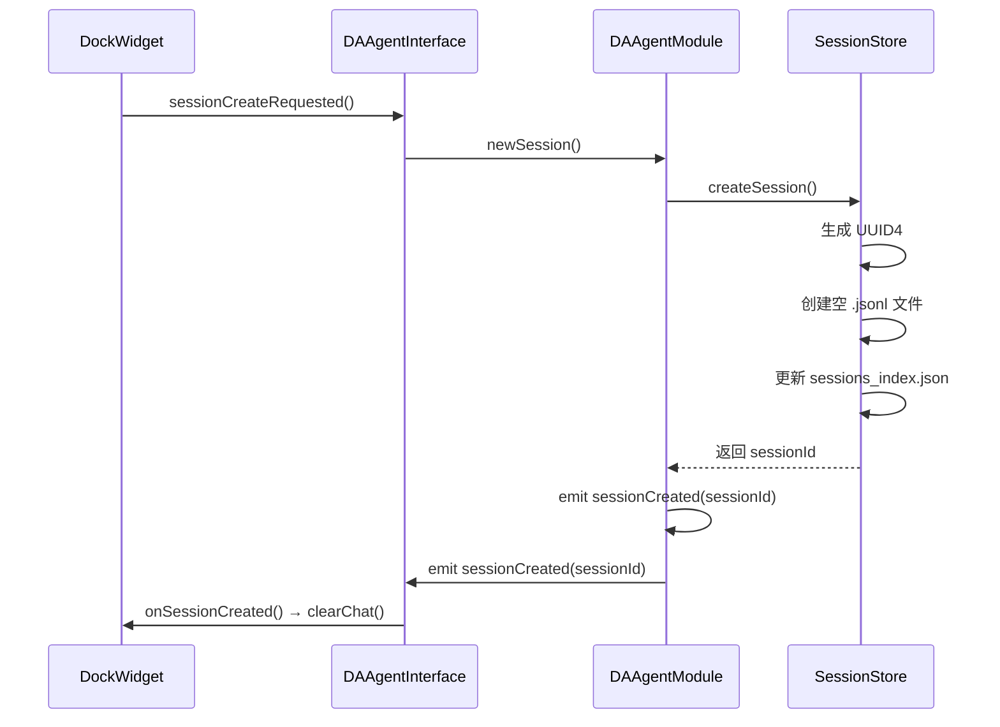
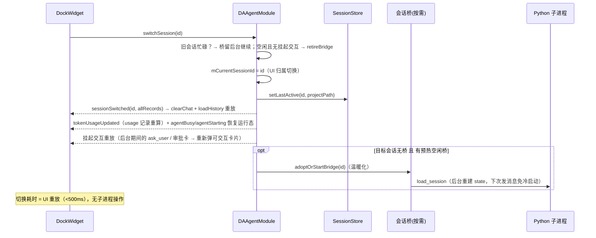
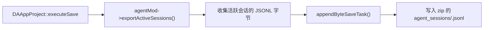
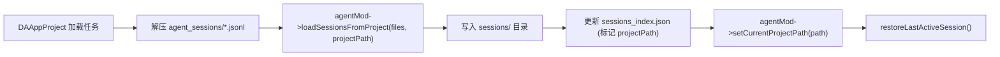

# 会话持久化

Agent 对话历史以 JSONL 格式持久化到磁盘，支持多会话管理、工程内会话导出/导入、自动清理过期会话。本文档描述会话持久化的设计要点、文件格式、生命周期管理和崩溃安全机制。

---

## 设计要点

| 原则 | 说明 |
|------|------|
| **C++ 主导持久化** | C++ 负责全部 JSONL 读写 / 索引 / 清理，Python 子进程只负责推理与 state 重建 |
| **双存储** | 自由会话存配置目录 `sessions/`；保存工程时活跃会话复制进 zip 的 `agent_sessions/` |
| **并发会话（多子进程）** | 每个运行中会话独占一个 `DAAgentBridge`/Python 子进程；切换会话不触碰任何子进程（纯 UI 重放），state 重建推迟到该会话下次 `sendMessage`（`init → load_session → user_msg` stdin 管道序）。桥存在当且仅当：会话 == 活跃会话（任意状态）∨ 后台忙碌（turn 进行中）∨ 等待用户输入（ask_user/审批挂起） |
| **崩溃安全** | JSONL append-only + 每条即写 flush，崩溃后最多丢最后一两行 |
| **自动恢复** | 启动程序自动填充上次活跃会话下拉；打开工程自动加载工程内会话 |

---

## 文件布局

```
<appData>/sessions/
├── <sessionId>.jsonl          # 每个会话一个 JSONL 文件 (append-only)
├── sessions_index.json        # 全局索引 (原子写 tmp+rename)
└── last_active.json           # 上次活跃会话指针 (sessionId + projectPath)
```

> Windows 路径展开为 `%APPDATA%/DAWorkBench/DAWorkBench/sessions/`。路径由 `DADir::getAppDataPath("sessions")` 决定。

### 会话文件（JSONL）

每行一条 JSON 记录，append-only 追加：

```json
{
    "uuid": "550e8400-e29b-41d4-a716-446655440000",
    "parent_uuid": null,
    "session_id": "session-uuid-xxxx",
    "timestamp": "2026-08-10T14:30:00.000Z",
    "type": "user",
    "message": {
        "role": "human",
        "content": "帮我分析这组数据"
    }
}
```

### 记录类型

| type | message.role | 说明 | 含 tool_calls | 含 tool_call_id |
|------|-------------|------|:---:|:---:|
| `user` | `human` | 用户消息 | — | — |
| `assistant` | `ai` | LLM 回复 | 可能 | — |
| `tool_result` | `tool` | 工具执行结果 | — | 是 |
| `usage` | — | Token 用量记录（每轮 `message_end.usage` 与独立 `usage` 消息均落盘） | — | — |

!!! note "usage 记录的累计重放"
    `usage` 记录用于会话级 token 累计统计的持久化。切换会话时 `DAAgentModule::emitTokenUsageForSession()` 读取目标会话的全部 `usage` 记录，先清零 `mCumulativeIn/Out/TotalTokens` 再逐条累加，重新 emit `tokenUsageUpdated`——UI 立即显示该会话的累计用量与进度条，不会拘留上一会话的数值。上下文压缩不再重置这些累计值。

!!! note "question/answer 复用 tool_call/tool_result 语义"
    HITL 提问（`ask_user` 工具）在 JSONL 中存储为 `assistant` 类型（含 `tool_calls`），用户回答存储为 `tool_result` 类型。一期不单独区分 question/answer 记录类型。

### 全局索引（sessions_index.json）

```json
[
    {
        "id": "uuid-xxxx",
        "title": "数据分析对话",
        "createdAt": "2026-08-10T14:00:00.000Z",
        "updatedAt": "2026-08-10T14:30:00.000Z",
        "messageCount": 10,
        "projectPath": ""
    }
]
```

索引文件通过 **tmp + rename** 原子写入，避免写入中途崩溃导致索引损坏。

### 上次活跃指针（last_active.json）

```json
{
    "sessionId": "uuid-xxxx",
    "projectPath": ""
}
```

`projectPath` 为空表示自由会话，非空表示工程绑定会话。`lastActiveSession()` 按工程路径精确匹配返回。

---

## 会话生命周期

### 创建会话



!!! note "newSession() vs createSession()"
    `newSession()` 会 emit `sessionCreated` 信号触发 UI clearChat，用于用户点击"+"按钮。`createSession()` 不 emit 信号，用于 `sendMessage()` 自动创建会话——避免清除刚显示的用户消息。

### 切换会话

切换会话**不触碰任何子进程**（concurrent-sessions）：仅做 UI 重放与归属切换；旧会话忙碌时其桥留在后台继续执行，state 重建推迟到该会话下次 `sendMessage`：



!!! note "state 重建时机（init → load_session → user_msg 管道序）"
    空闲会话下次 `sendMessage` 时：`DAAgentBridge::startAgent` 内部 `waitForStarted` 后依次写 stdin——`init` → `load_session`（该会话全量历史）→ `user_msg`。Python 主循环 `await` 逐条顺序消费（`agent_runner.py` main loop），`user_msg` 必然在 state 重建完成后处理——铁律 T15 的时序约束由管道序结构性保证，C++ 侧无需额外门控。

!!! note "桥生命周期与退役"
    会话桥存在当且仅当：**活跃会话**（任意状态）∨ **后台忙碌**（turn 进行中）∨ **等待用户输入**（ask_user/审批挂起）。退役触发点：后台会话跑完（`agentDone` 且非活跃）、切离空闲会话、删除会话、`sendMessage` 防御性重建（桥已死不再自愈）。退役 = `disconnect` 全部路由 + `requestStop()`（非阻塞）+ `processExited → deleteLater`。另有至多 1 个**预热未绑定桥**（`auto_prestart`），首次 `sendMessage` 时被接管。

!!! danger "崩溃自愈路径不可在 processExited 清理会话映射"
    `DAAgentBridge::onProcessFinished` 中 `processExited` 信号**先于** `recoverFromCrash`（1s 延迟重启）发射。若 Module 在 `processExited` 中移除会话→桥映射，会孤儿化正在自愈的桥（其信号仍连接、持久化仍写盘，但 `bridgeForSession` 查不到 → `sendMessage` 会为同一会话再建一个桥，出现双进程写同一会话）。死亡且不再自愈的桥由 `sendMessage` 的 `isRunning()` 防御分支惰性清理。

### 删除会话

```
deleteSession(id)
  → SessionStore: 删除 <id>.jsonl 文件
  → SessionStore: 从 sessions_index.json 移除
  → 如果删的是当前会话: emit sessionCleared()
  → emit sessionListChanged() (刷新下拉)
```

### 重命名会话

```
renameSession(id, title)
  → SessionStore: 更新 sessions_index.json 的 title + updatedAt
  → emit sessionListChanged()
```

### 自动标题

`ensureTitle(sessionId)` 在用户首次发送消息后，取消息内容前 30 个字符作为会话标题。如果会话已有非空标题则不覆盖。

---

## 工程导入/导出

### 保存工程时导出



`exportActiveSessions()` 返回 `QHash<QString, QByteArray>`——每个活跃会话的 ID 到 JSONL 字节内容的映射。在主线程收集（不碰 UI），子线程写入 zip。

### 打开工程时导入



---

## 自动清理

`DAAgentModule::cleanupSessions()` 在程序启动时执行，基于两个维度清理自由会话（不影响工程绑定会话）：

| 清理维度 | 配置键 | 默认值 | 逻辑 |
|---------|--------|--------|------|
| 数量上限 | `max_sessions` | 20 | 超出时按 `updatedAt` 倒序删除最旧的 |
| 时间上限 | `session_retention_days` | 30 | 早于此天数的会话被删除 |

```cpp
// cleanupOldSessions 入口已加 qMax 防护
int maxCount = qMax(1, config.maxSessions);       // 防止 ini 手改为 0
int retentionDays = qMax(0, config.retentionDays); // 防止负值
```

!!! warning "保护活跃会话"
    `cleanupOldSessions` 跳过当前活跃会话（`skipSessionId`）和 `lastActive` 指针指向的会话，避免清理正在使用的会话。

---

## 崩溃安全

### JSONL 写入

- **Append-only**：每条记录追加到文件末尾，不修改已有内容
- **每条即写 flush**：`appendRecord()` 写入后立即 flush，崩溃后最多丢最后一两行
- **容忍损坏行**：`parseLineTolerant` 跳过损坏行/空行，不整体丢弃会话

### 索引原子写

`sessions_index.json` 通过 tmp + rename 原子写入：

```cpp
// 1. 写入临时文件
QFile tmp(sessionsDir + "/sessions_index.json.tmp");
tmp.write(json);
tmp.flush();
tmp.close();

// 2. 原子 rename
QFile::rename(sessionsDir + "/sessions_index.json.tmp",
              sessionsDir + "/sessions_index.json");
```

### last_active 精确匹配

`lastActiveSession(filter)` 按 `projectPath` 精确匹配：

- 空 filter：只返回 `projectPath` 为空的自由会话
- 非空 filter：精确匹配工程路径

避免启动恢复时把工程绑定会话当自由会话恢复。

---

## 会话恢复时序

### 启动程序

```
DAAppController::initialize()
  → agentMod->cleanupSessions()           // 清理超限/过期会话
  → (singleShot 延迟到事件循环空闲)
    → restoreLastActiveSession()          // 填充会话下拉
      → listSessions() → 填充 UI 下拉
      → mCurrentSessionId.clear() + resetCumulativeTokens()
      → emit sessionCleared() → UI clearChat + 复位 token 控件
      → 不自动恢复（始终以全新对话开始）
    → pushModelSelection()                // 推送供应商/模型列表 + 激活选择到 Dock 下拉
    → prestartAgent()                     // 预热子进程 (auto_prestart=true 时)
    → 用户可通过下拉手动切换到历史会话
```

### 打开工程

```
DAAppProject 加载任务
  → 解压 agent_sessions/*.jsonl
  → agentMod->loadSessionsFromProject(files, projectPath)
  → agentMod->setCurrentProjectPath(path)
  → restoreLastActiveSession()
    → listSessions(projectPath) → 填充工程会话下拉
    → mCurrentSessionId.clear() + resetCumulativeTokens()
    → emit sessionCleared() → UI clearChat + 复位 token 控件 + 下拉不选中
    → 不自动恢复（始终以全新对话开始）
```

!!! note "sessionCleared 清空游离会话残留"
    `restoreLastActiveSession()` 始终 emit `sessionCleared()`（`DAAgentInterface.h`），用于在启动 / 打开工程后清空上一会话残留的聊天区、复位 token 统计控件、清空标题，并清空 `m_currentSessionId`——之后用户发消息由 `sendMessage` 懒创建绑定当前工程的新会话。打开一个无内嵌会话的工程时，此信号尤为重要（清掉此前自由会话的游离残留）。

### 保存工程

```
DAAppProject::executeSave
  → agentMod->setCurrentProjectPath(path)
  → agentMod->setSessionProjectPathForCurrent(path)
  → agentMod->exportActiveSessions() → 收集活跃会话字节
  → 写入 zip 的 agent_sessions/
```

### SaveAs 工程

```
setCurrentProjectPath(newPath)       // 同步新路径
setSessionProjectPath(newPath)       // 更新 index 中的 projectPath
setLastActive(sessionId, newPath)    // 更新指针的 projectPath
```

---

## 配置参数

| 参数 | 配置键 | 默认值 | 说明 |
|------|--------|--------|------|
| 最大会话数 | `max_sessions` | 20 | 自由会话保留上限 |
| 保留天数 | `session_retention_days` | 30 | 自由会话保留天数 |
| 预启动开关 | `auto_prestart` | true | 程序启动时是否自动预热 agent 子进程（关闭则回退到懒启动，影响会话下拉填充后是否立即预热） |

!!! note "`max_sessions` / `session_retention_days` 默认值须一致"
    这两项的默认值在以下三处须保持一致：
    1. 设置页 spin range/setValue（`DAAgentSettingsWidget`）
    2. `DAAgentModule::getLLMConfig` / `setLLMConfig` 的默认值
    3. `DAAgentModule::cleanupSessions` 的 QSettings 读取

!!! note "`context_window` / `max_output_tokens` 已移出 Agent 设置页"
    `context_window`（默认 262144）与 `max_output_tokens`（默认 8192）不再是 Agent 设置页的全局可编辑项，已移至**按模型派生**的属性：设置页的模型信息表只读展示每个模型的这两值，实际值由激活供应商 + 激活模型条目决定（`setActiveModel` / `syncActiveConnection` 写入），随 `init` / `reconfigure` 下发给子进程。`DAAgentSettingsWidget.cpp` 的保存逻辑显式跳过这两项（`不含 context_window/max_output_tokens，由激活模型派生`）。

---

## 单元测试

`src/tst/DAAgentSessionStoreTest/` 提供 5 个 C++ 测试用例（不链接 Python）：

| 用例 | 覆盖内容 |
|------|---------|
| `testAppendAndRead` | appendRecord + readMessagesForLoad（usage 被过滤，messageCount 只计对话消息） |
| `testParseTolerant` | JSONL 含损坏行/空行时跳过坏行返回有效记录 |
| `testIndexAtomicWrite` | listSessions 倒序，renameSession 更新 index + title |
| `testCleanup` | 数量上限删最旧、时间上限删超期、skipSessionId 保护活跃、qMax 边界防护 |
| `testLastActive` | last_active 往返 + projectPath 精确匹配 |

测试隔离：`main()` 起手 `QStandardPaths::setTestModeEnabled(true)` 重定向 AppData 到临时目录，不污染真实 `%APPDATA%`。

```powershell
# 构建
cmake -S . -B build -D DA_ENABLE_TESTING=ON
cmake --build build --target DAAgentSessionStoreTest --config Release

# 运行 (Windows Qt Test stdout 不可见，须用 -o)
.\build\bin\DAAgentSessionStoreTest.exe -o result.txt
```

---

## 参见

- [崩溃恢复与重连](./crash-recovery.md) — 崩溃后通过 SessionStore 恢复会话
- [通信协议](./protocol.md) — load_session / session_loaded 协议消息
- [架构设计](./architecture.md) — DAAgentSessionStore 在架构中的位置
- `src/DAAgent/DAAgentSessionStore.h/.cpp` — 持久化层实现
- `src/tst/DAAgentSessionStoreTest/main.cpp` — 单元测试
