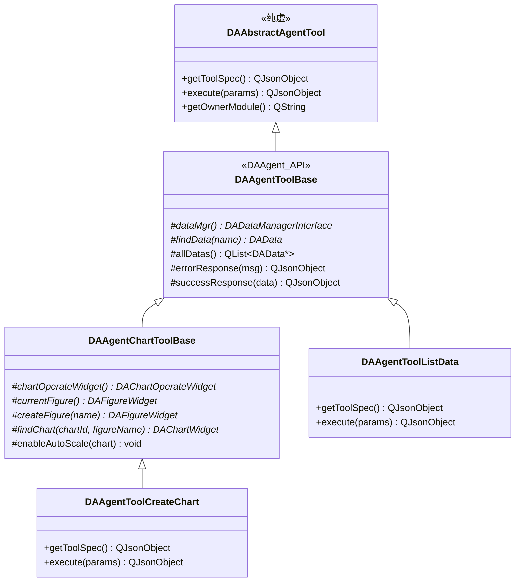
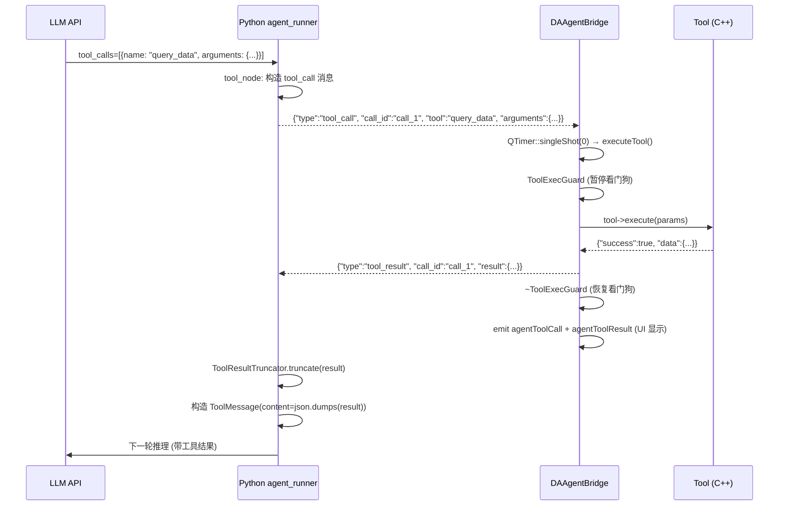

# 工具开发指南

Agent 工具是 LLM 可以调用的函数，用于执行数据分析、绘图、文件操作等任务。本文档描述工具的抽象基类、注册机制、内置工具清单，以及如何开发自定义工具。

---

## 工具体系架构



### 类层级说明

| 类 | 模块 | 导出 | 职责 |
|-----|------|------|------|
| `DAAbstractAgentTool` | DAAgent | `DAAgent_API` | 纯虚基类，定义三个必须实现的接口 |
| `DAAgentToolBase` | DAAgent | `DAAgent_API` | 瘦工具基类，提供数据访问 + 响应构建方法 |
| `DAAgentChartToolBase` | 插件 (DAAgentTools) | 无 | 图表工具基类，提供图表操作方法 |
| 具体工具类 | 插件 (DAAgentTools) | 无 | 16 个内置工具的具体实现 |

!!! note "为什么 DAAgentToolBase 是"瘦"基类"
    在解耦重构前，`DAAgentToolBase` 同时包含数据访问方法和图表访问方法，导致 DAAgent 模块依赖 DAGui。重构后将图表方法搬到插件的 `DAAgentChartToolBase`，`DAAgentToolBase` 只保留只依赖 DAData/DAInterface 的方法。这样未来写数据工具插件只需继承瘦基类，无需拉 DAGui 依赖。

---

## 工具接口

### getToolSpec() — 工具规格

返回 OpenAI function schema 格式的 JSON，描述工具的名称、用途和参数：

```cpp
QJsonObject DAAgentToolQueryData::getToolSpec() const
{
    return {
        {"type", "function"},
        {"function", QJsonObject{
            {"name", "query_data"},
            {"description", "Query data with pandas-like syntax. "
                            "Supports filtering, selection, and aggregation."},
            {"parameters", QJsonObject{
                {"type", "object"},
                {"properties", QJsonObject{
                    {"data_name", QJsonObject{
                        {"type", "string"},
                        {"description", "Name of the data to query"}
                    }},
                    {"query", QJsonObject{
                        {"type", "string"},
                        {"description", "Pandas query expression, e.g. 'A > 100 and B < 50'"}
                    }}
                }},
                {"required", QJsonArray{"data_name"}}
            }}
        }}
    };
}
```

### execute() — 工具执行

接收 LLM 传来的参数，执行工具逻辑，返回结果 JSON：

```cpp
QJsonObject DAAgentToolQueryData::execute(const QJsonObject& params)
{
    try {
        QString dataName = params["data_name"].toString();
        QString query    = params["query"].toString();

        auto* data = findData(dataName);
        if (!data) {
            return errorResponse(QString("Data '%1' not found").arg(dataName));
        }

        // 使用 DAPyGILGuard + DAPyDataFrame 执行 pandas 查询
        DAPyGILGuard guard;
        DAPyDataFrame df = data->toDataFrame();
        DAPyDataFrame result = df.query(query);

        return successResponse(QJsonObject{
            {"rows", result.rowCount()},
            {"cols", result.columnCount()},
            {"columns", result.columnNames()},
            {"preview", result.head(10).toJson()}
        });
    } catch (const std::exception& e) {
        return errorResponse(e.what());
    }
}
```

!!! warning "execute() 必须内部 try/catch"
    工具抛出未捕获异常会导致 `DAAgentBridge` 崩溃，子进程收不到 `tool_result` 永久挂起。`executeTool()` 有外层兜底，但工具内部应自行捕获并返回 `errorResponse`。

### getOwnerModule() — 归属模块

返回工具所属的模块名（用于日志和诊断）：

```cpp
QString DAAgentToolQueryData::getOwnerModule() const
{
    return "DAAgentTools";
}
```

---

## 响应格式

`DAAgentToolBase` 提供两个便捷方法构建标准响应：

### 成功响应

```cpp
// 带数据的成功响应
QJsonObject successResponse(const QJsonObject& data);

// 带消息的成功响应
QJsonObject successResponse(const QString& message);
```

返回格式：

```json
{
    "success": true,
    "data": { ... }
}
```

### 错误响应

```cpp
QJsonObject errorResponse(const QString& message);
```

返回格式：

```json
{
    "success": false,
    "error": "Data 'xxx' not found"
}
```

!!! note "未设置 success 字段时自动补 true"
    `DAAgentBridge::executeTool()` 在工具返回结果中检测 `success` 字段，不存在时自动补 `true`。

---

## 工具注册

### 内置工具注册

16 个内置工具由 `DAAgentToolsPlugin` 在 `initialize()` 中注册：

```cpp
bool DAAgentToolsPlugin::initialize()
{
    auto* c = core();
    auto* agent = c->getAgentInterface();

    // 数据工具 (5 个)
    agent->registerTool(new DAAgentToolListData(c, this));
    agent->registerTool(new DAAgentToolDataInfo(c, this));
    agent->registerTool(new DAAgentToolQueryData(c, this));
    agent->registerTool(new DAAgentToolColumnStats(c, this));
    agent->registerTool(new DAAgentToolExportData(c, this));

    // 图表工具 (8 个)
    agent->registerTool(new DAAgentToolCreateChart(c, this));
    agent->registerTool(new DAAgentToolAddCurve(c, this));
    agent->registerTool(new DAAgentToolSetChartStyle(c, this));
    agent->registerTool(new DAAgentToolAddAnnotation(c, this));
    agent->registerTool(new DAAgentToolAddRegion(c, this));
    agent->registerTool(new DAAgentToolCreateSubplots(c, this));
    agent->registerTool(new DAAgentToolSaveChartImage(c, this));
    agent->registerTool(new DAAgentToolListFigures(c, this));

    // 文件/报告工具 (3 个)
    agent->registerTool(new DAAgentToolReadFile(c, this));
    agent->registerTool(new DAAgentToolWriteFile(c, this));
    agent->registerTool(new DAAgentToolSaveReport(c, this));

    // 注册系统提示词片段
    agent->registerSystemPrompt("figure_reference",
        "When referencing charts, use da-figure: hyperlinks. "
        "Format: [chart title](da-figure:figure_name)");

    return true;
}
```

### 注册流程

```
插件 initialize()
  → DAAgentInterface::registerTool(tool)
  → DAAgentModule::registerTool(tool)
    → m_tools[toolName] = tool
    → m_bridge->setTools(m_tools)  // 更新 Bridge 的工具查找表
```

注册时机保证：插件 `initialize()` 在程序启动时执行，懒启动在首次 `sendMessage()` 才触发，因此工具注册必然先于子进程启动。

---

## 内置工具清单

### 数据工具（5 个）

| 工具名 | 用途 | 关键参数 |
|--------|------|---------|
| `list_data` | 列出所有已加载的数据集 | 无 |
| `get_data_info` | 获取数据集的详细信息（行列数、数据类型、统计摘要） | `data_name` |
| `query_data` | 使用 pandas 语法查询数据 | `data_name`, `query` |
| `get_column_stats` | 获取列的统计信息（均值、标准差、分位数等） | `data_name`, `column` |
| `export_data` | 导出数据到文件 | `data_name`, `file_path`, `format` |

### 绘图工具（8 个）

| 工具名 | 用途 | 关键参数 |
|--------|------|---------|
| `create_chart` | 创建新图表（每次调用创建新 figure） | `title`, `figure_name?` |
| `add_curve` | 向图表添加曲线 | `data_name`, `x_column`, `y_column`, `figure_name?`, `chart_id?` |
| `set_chart_style` | 设置图表样式（线型、颜色、标记等） | `figure_name?`, `chart_id`, `style` |
| `add_annotation` | 添加注释文本 | `figure_name?`, `chart_id`, `text`, `position` |
| `add_region` | 添加区域标注 | `figure_name?`, `chart_id`, `x_range`, `color` |
| `create_subplots` | 创建子图布局 | `rows`, `cols`, `figure_name?` |
| `save_chart_image` | 保存图表为图片 | `figure_name?`, `file_path`, `format` |
| `list_figures` | 列出所有 figure 及其 chart | 无 |

!!! note "图表工具的 figure_name 参数"
    所有绘图工具都支持可选的 `figure_name` 参数，用于在指定 figure 中操作。`create_chart` 和 `create_subplots` 的 `figure_name` 用于命名新创建的 figure。

!!! warning "坐标轴自动缩放"
    `DAAgentChartToolBase::enableAutoScale(chart)` 在添加数据后必须调用，因为 `DAFigureWidget::createChart()` 会锁定坐标轴范围。不恢复 auto-scale 会导致数据显示在可见范围外而显示空白。

### 文件/报告工具（3 个）

| 工具名 | 用途 | 关键参数 |
|--------|------|---------|
| `read_file` | 读取文本文件内容 | `file_path`, `encoding?` |
| `write_file` | 写入文本文件 | `file_path`, `content`, `encoding?` |
| `save_report` | 保存分析报告（支持 docx/xlsx 导出） | `file_path`, `format`, `content` |

---

## 开发自定义工具

### 步骤 1：选择基类

| 工具类型 | 继承基类 | 所在位置 |
|---------|---------|---------|
| 数据工具（只访问数据管理器） | `DAAgentToolBase` | 你的插件 `tools/` 目录 |
| 图表工具（需要操作图表） | `DAAgentChartToolBase` | 你的插件 `tools/` 目录 |

### 步骤 2：实现工具类

```cpp
// MyAgentTool.h
#pragma once
#include "DAAgentToolBase.h"  // DAAgent 模块的瘦基类

class MyAgentTool : public DA::DAAgentToolBase
{
    Q_OBJECT
public:
    explicit MyAgentTool(DA::DACoreInterface* core, QObject* parent = nullptr)
        : DA::DAAgentToolBase(core, parent) {}

    QJsonObject getToolSpec() const override;
    QJsonObject execute(const QJsonObject& params) override;
    QString getOwnerModule() const override { return "MyPlugin"; }
};
```

```cpp
// MyAgentTool.cpp
#include "MyAgentTool.h"

QJsonObject MyAgentTool::getToolSpec() const
{
    return {
        {"type", "function"},
        {"function", QJsonObject{
            {"name", "my_tool"},
            {"description", "Description of what this tool does"},
            {"parameters", QJsonObject{
                {"type", "object"},
                {"properties", QJsonObject{
                    {"param1", QJsonObject{
                        {"type", "string"},
                        {"description", "Description of param1"}
                    }}
                }},
                {"required", QJsonArray{"param1"}}
            }}
        }}
    };
}

QJsonObject MyAgentTool::execute(const QJsonObject& params)
{
    try {
        QString param1 = params["param1"].toString();

        // 你的工具逻辑
        // ...

        return successResponse(QJsonObject{
            {"result", "operation completed"}
        });
    } catch (const std::exception& e) {
        return errorResponse(e.what());
    }
}
```

### 步骤 3：在插件中注册

```cpp
bool MyPlugin::initialize()
{
    auto* agent = core()->getAgentInterface();
    if (!agent) return false;

    agent->registerTool(new MyAgentTool(core(), this));
    return true;
}
```

### 步骤 4：CMake 配置

```cmake
# 你的插件 CMakeLists.txt
find_package(DAWorkbench COMPONENTS DAAgent DAData DAInterface DAPluginSupport)

target_link_libraries(${PLUGIN_NAME} PRIVATE
    DAWorkbench::DAAgent    # 继承 DAAgentToolBase
    DAWorkbench::DAData     # 数据访问
)
```

---

## 工具执行流程



---

## 参见

- [架构设计](architecture.md) — 工具系统在整体架构中的位置
- [通信协议](protocol.md) — tool_call/tool_result 消息的协议规范
- [上下文管理](context-management.md) — 工具结果截断机制
- `plugins/DAAgentTools/` — 16 个内置工具的完整实现
- `src/DAAgent/DAAbstractAgentTool.h` — 工具抽象基类定义
- `src/DAAgent/DAAgentToolBase.h` — 瘦工具基类定义
