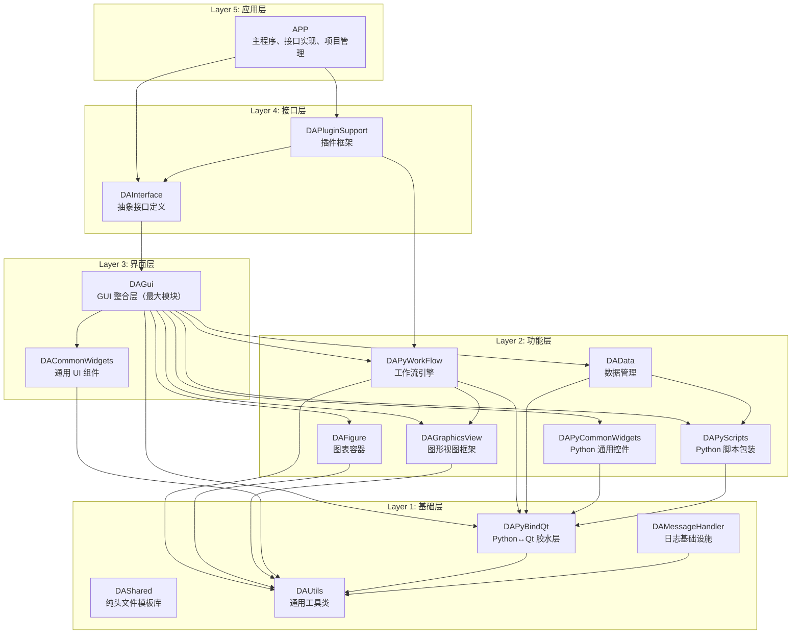
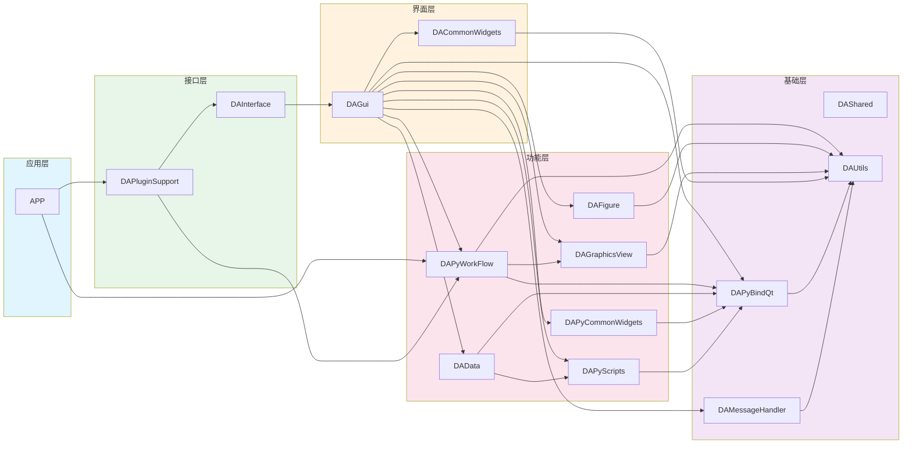
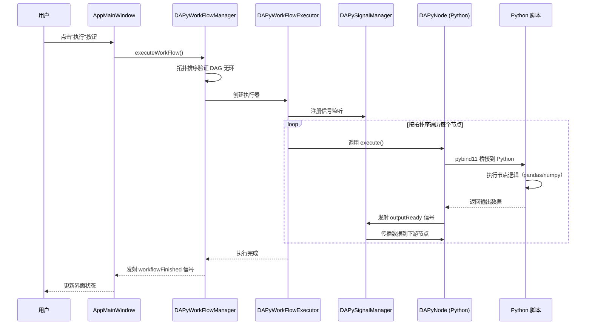
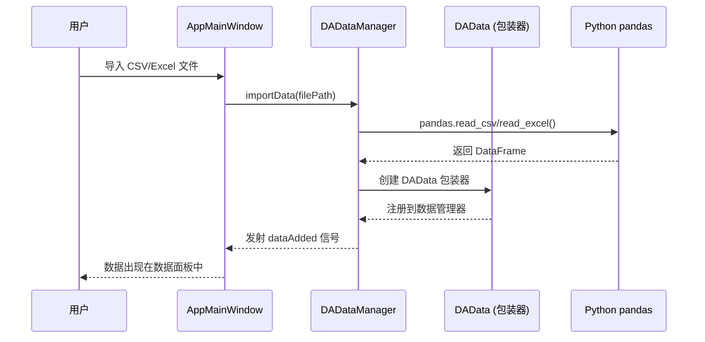
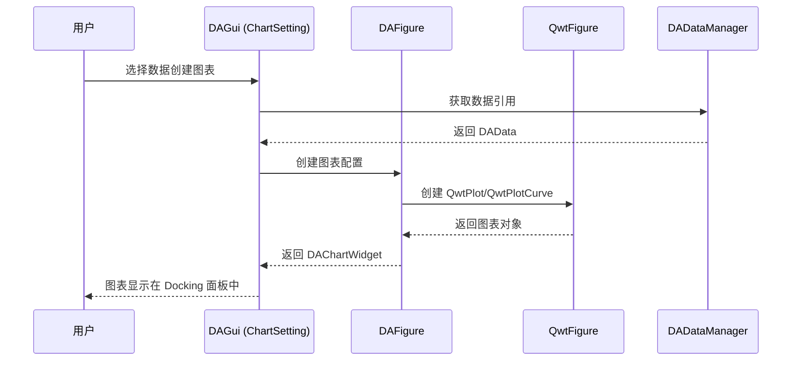

# 架构设计与模块划分

- **分层架构**：5 层架构设计，基础层→功能层→界面层→接口层→应用层，职责清晰
- **模块关系图**：一目了然的 15+ 模块依赖关系和数据流
- **设计决策记录**：PIMPL、Python-first 工作流、DAG 模型、插件架构等关键选择的原因和权衡
- **扩展点设计**：节点、插件、图表类型等预留扩展点说明

## 整体架构

### 架构总览图



data-workbench 采用严格的 5 层架构，**上层可以依赖下层，下层绝不能依赖上层**。这条铁律确保了模块间的依赖方向清晰可控，避免了循环依赖和架构腐化。

### Layer 5：应用层（APP）

- **职责**：可执行程序入口，所有接口的具体实现
- **包含模块**：APP（190 文件）
- **核心类**：`DAAppCore`（单例核心）、`AppMainWindow`（主窗口）、`DAAppUI`（Ribbon/Docking 布局）、`DAAppController`（MVC 控制器）、`DAAppProject`（工程文件序列化）、`DAAppPluginManager`（插件生命周期）
- **向下依赖**：DAPluginSupport、DAPyWorkFlow

应用层是整个系统的入口点。`main.cpp` 负责初始化 QApplication、Python 解释器和命令行参数解析，然后创建 `AppMainWindow` 主窗口。`DAAppCore` 作为单例持有所有子系统的实例，通过 `DACoreInterface` 接口对外暴露。

### Layer 4：接口层（DAInterface + DAPluginSupport）

- **职责**：定义抽象接口，隔离应用层与功能层；提供插件框架
- **包含模块**：DAInterface（28 文件）、DAPluginSupport（10 文件）
- **核心类**：`DACoreInterface`、`DAUIInterface`、`DADataManagerInterface`、`DAProjectInterface`、`DAAbstractPlugin`、`DAPluginManager`、`DAAbstractNodePlugin`
- **向下依赖**：DAGui（PUBLIC 依赖，传递所有 DAGui 依赖给消费者）

接口层的关键设计是 **DAInterface 以 PUBLIC 方式依赖 DAGui**，这意味着所有消费 DAInterface 的模块（如插件）都自动获得了 DAGui 及其下层的全部能力。这是有意为之的设计——插件需要访问完整的 UI 和数据能力。

### Layer 3：界面层（DAGui + DACommonWidgets）

- **职责**：GUI 整合、用户交互、Model/View 模型
- **包含模块**：DAGui（334 文件，最大模块）、DACommonWidgets（82 文件）
- **核心子目录**：`ChartSetting/`（图表属性面板）、`NodeSetting/`（节点设置面板，基于 DAFormSpec 统一表单）、`Commands/`（QUndoCommand）、`Dialog/`、`Models/`
- **向下依赖**：所有 L1/L2 模块 + SARibbon/ADS/qwt/DALiteCtk/quazip

DAGui 是项目中最庞大的模块，承担了工作流 UI、图表设置、数据管理 UI 等所有界面整合工作。为避免过度膨胀，内部按功能划分为多个子目录，其中 `NodeSetting/` 采用三层架构（基类→面板→具体面板 + 单例工厂 + QStackedWidget 调度器）。

### Layer 2：功能层

- **职责**：核心业务功能实现——数据管理、图表、工作流、图形视图
- **包含模块**：DAData、DAFigure、DAPyWorkFlow、DAGraphicsView、DAPyScripts、DAPyCommonWidgets
- **关键特点**：Python 相关模块（DAPyWorkFlow、DAPyScripts、DAPyCommonWidgets）为强制依赖，始终参与编译

功能层是系统的核心引擎。DAPyWorkFlow 采用 **Python-first** 设计——Python 定义节点逻辑，C++ 负责可视化渲染和执行调度。DAFigure 基于 Qwt 提供论文级图表能力。DAData 提供抽象数据基类和 Python DataFrame 封装。

### Layer 1：基础层

- **职责**：纯基础能力——数据结构、工具类、日志、Python 绑定
- **包含模块**：DAShared（纯头文件）、DAUtils、DAMessageHandler、DAPyBindQt
- **特殊说明**：DAShared 是纯头文件库（19 文件），无需显式 CMake 链接，提供 Table/Vector 数据结构、枚举↔字符串映射宏、Qt5/Qt6 兼容宏、并发容器

基础层是所有上层模块的基石。DAPyBindQt 是 Python↔Qt 的胶水层，提供 pybind11 类型转换器（`DAPybind11QtCaster.hpp`）、Python 解释器生命周期管理、GIL RAII 守卫等关键能力。

---

## 模块划分

### 模块总览

| 模块 | 层 | 核心职责 | 关键类 | 文件数 |
|------|-----|----------|--------|:------:|
| DAShared | L1 | 纯头文件模板库 | 宏定义、模板 | 19 |
| DAUtils | L1 | 通用工具类 | XML序列化、CSV读写、目录管理 | 40 |
| DAMessageHandler | L1 | 日志基础设施 | DALogger、spdlog | 9 |
| DAPyBindQt | L1 | Python↔Qt 绑定 | 类型转换器、GIL守卫 | 28 |
| DAPyScripts | L2 | Python 脚本包装 | I/O、DataFrame 操作 | 12 |
| DAPyCommonWidgets | L2 | Python 通用控件 | 列选择器、dtype选择器 | 13 |
| DAPyWorkFlow | L2 | 工作流引擎 | DAPyNode、DAPyWorkFlowManager | 50 |
| DAData | L2 | 数据管理 | DAAbstractData、DADataManager | 22 |
| DAGraphicsView | L2 | 图形视图框架 | DAGraphicsView、DAGraphicsScene | 54 |
| DAFigure | L2 | 图表容器 | QwtFigure、DAChartWidget | 103 |
| DACommonWidgets | L3 | 通用 UI 组件 | 属性面板、颜色选择器 | 82 |
| DAGui | L3 | GUI 整合层 | 工作流UI、图表设置、Model/View | 334 |
| DAInterface | L4 | 抽象接口定义 | DACoreInterface、DAUIInterface | 28 |
| DAPluginSupport | L4 | 插件框架 | DAAbstractPlugin、DAPluginManager | 10 |
| APP | L5 | 可执行程序 | DAAppCore、AppMainWindow | 190 |

### 模块依赖关系图



**依赖方向规则（铁律）**：

1. **上层可以依赖下层，下层绝不能依赖上层**（✅ DAGui → DAUtils；❌ DAUtils → DAGui）
2. **同层模块尽量减少直接依赖**，通过上层整合模块（DAGui）协调
3. **Python 相关模块**为强制依赖，始终参与编译
4. **DAShared 是纯头文件库**，无需显式 CMake 链接

---

## 核心数据流

### 工作流执行流程

这是系统最核心的数据流——用户点击"执行工作流"后的完整调用链：



工作流执行的核心流程如下：

1. **触发执行**：用户通过 Ribbon 按钮或快捷键触发 `DAAppController` 中的执行动作，最终调用 `DAPyWorkFlowManager::executeWorkFlow()`
2. **DAG 验证**：管理器对工作流场景中的所有节点和连接构建有向图，执行拓扑排序验证无环性
3. **逐节点执行**：按拓扑序依次调用每个 `DAPyNode` 的 `execute()` 方法，通过 pybind11 桥接到 Python 层的 `@NodeDef` 定义的 `execute(self, inputs, params)` 函数
4. **数据传播**：每个节点执行完毕后，通过 `DAPySignalManager` 将输出数据传播到下游节点的输入端口
5. **结果通知**：所有节点执行完毕后，发射 `workflowFinished` 信号，更新界面状态

### 数据导入流程



数据导入流程展示了 Python 与 C++ 的深度集成。导入操作通过 `DADataManager` 发起，实际的数据读取由 Python 的 pandas 完成（支持 CSV、Excel、HDF5 等格式），返回的 DataFrame 被 `DAData` 包装器封装为 C++ 可操作的对象，注册到数据管理器后通过信号通知 UI 更新。

### 图表创建流程



图表创建流程涉及 DAGui 的 `ChartSetting/` 子模块和 DAFigure 模块的协作。用户在 ChartSetting 面板中选择数据和图表类型后，DAFigure 模块创建 `QwtFigure` 容器（类似 matplotlib 的 Figure），内部使用 Qwt 的 `QwtPlot`、`QwtPlotCurve` 等组件绘制图表，最终包装为 `DAChartWidget` 嵌入到 Docking 面板中。

图表窗口在 `DAChartOperateWidget` 中以 ADS 嵌套停靠区管理（多窗口自由分屏、隔离在绘图区内），其设计与一个 `FocusHighlighting` 焦点跨管理器陷阱详见 [绘图窗口停靠布局](chart-dock-nesting.md)。

---

## 关键设计决策

### 决策 1：PIMPL 模式全覆盖

- **背景**：项目需要在保持 ABI 兼容性的同时频繁迭代内部实现
- **方案选择**：传统头文件暴露私有成员 vs PIMPL 隐藏实现
- **最终选择**：所有核心类统一使用 PIMPL 模式
- **原因**：减少头文件依赖、加速编译、保持二进制兼容
- **实现**：通过 `src/DAGlobals.h` 中定义的宏简化 PIMPL 使用：
  - `DA_DECLARE_PRIVATE` — 在公共类中声明
  - `DA_DECLARE_PUBLIC` — 在 PrivateData 中声明
  - `DA_PIMPL_CONSTRUCT` — 在构造函数中初始化
  - `DA_D()` / `DA_DC()` — 获取私有数据指针

```cpp
// MyClass.h
class MyClass {
    DA_DECLARE_PRIVATE(MyClass)
public:
    MyClass();
    void doSomething();
};

// MyClass.cpp
class MyClass::PrivateData {
    DA_DECLARE_PUBLIC(MyClass)
public:
    int mValue { 0 };
};

MyClass::MyClass() : DA_PIMPL_CONSTRUCT(MyClass) {}

void MyClass::doSomething() {
    DA_D(MyClass);
    d->mValue++; // 通过 d 指针访问私有数据
}
```

- **权衡**：增加一层间接调用的开销，但对于大型项目来说，编译速度和 ABI 稳定性的收益远大于微小的运行时开销

### 决策 2：Python-first 工作流设计

- **背景**：工作流节点需要频繁迭代逻辑，C++ 编译周期长
- **方案选择**：纯 C++ 节点 vs Python 节点 + C++ 渲染 vs 纯 Python
- **最终选择**：Python 定义节点逻辑，C++ 负责可视化渲染和执行调度
- **原因**：
  - Python 生态（pandas/numpy/scipy）天然适合数据处理
  - 节点逻辑修改无需重新编译 C++，开发效率高
  - C++ 层保证了图形渲染性能和交互体验
- **实现**：`DAPyWorkFlow` 模块，Python 使用 `@NodeDef` 装饰器定义节点，C++ 通过 pybind11 桥接调用

```python
@NodeDef(name="数据过滤", category="数据处理")
class DataFilter:
    class Inputs:
        data = Input("DataFrame", required=True)
    class Outputs:
        filtered = Output("DataFrame")

    def execute(self, inputs, params):
        df = inputs["data"]
        return {"filtered": df[df["value"] > 0]}
```

- **权衡**：引入 Python 运行时依赖，增加了 GIL 管理和类型转换的复杂度

### 决策 3：DAG 工作流模型

- **背景**：需要一种直观的方式描述数据处理流水线
- **方案选择**：线性流水线 vs 有向无环图（DAG）vs 通用图
- **最终选择**：有向无环图（DAG）
- **原因**：
  - DAG 天然支持并行分支和汇合，表达能力强于线性流水线
  - 无环约束保证了执行不会死循环，可自动拓扑排序
  - 通用图允许环路，增加了验证和调试复杂度
- **权衡**：不支持循环依赖（如迭代反馈），需要通过特殊节点（如 Delay 节点）间接实现

### 决策 4：插件架构

- **背景**：需要支持第三方扩展节点和功能
- **方案选择**：静态编译 vs 动态库插件 vs Python entry_points
- **最终选择**：C++ 动态库插件 + Python entry_points 双模式
- **原因**：
  - C++ 插件适合需要高性能或深度集成的功能
  - Python entry_points 适合轻量级节点扩展，发布到 PyPI 即可使用
  - 双模式覆盖了不同场景的需求
- **实现**：`DAPluginSupport` 模块提供 `DAAbstractPlugin` 基类和 `DAPluginManager` 管理器

---

## 扩展点设计

### 如何新增一个工作流节点

新增 Python 工作流节点是最常见的扩展方式：

1. **创建 Python 文件**：在节点包目录下创建 `.py` 文件
2. **使用 `@NodeDef` 装饰器**：声明节点名称、分类、参数
3. **定义 Inputs/Outputs 内部类**：声明输入输出端口
4. **实现 `execute()` 方法**：编写节点逻辑
5. **注册节点**：通过 `__init__.py` 或 entry_points 注册

详细步骤参见 [Python 节点开发指南](./workflow-python-node-dev.md)。

### 如何新增一个 C++ 插件

1. **创建插件项目**：使用 `plugins/plugin-template/` 脚手架
2. **实现 `DAAbstractPlugin` 子类**：重写 `initialize()` 等方法
3. **实现 `DAAbstractNodePlugin` 子类**（如需注册节点）
4. **构建和部署**：编译为动态库，放入插件目录

详细步骤参见 [插件项目创建指南](./plugin-project-create.md)。

### 如何新增图表类型

1. **继承 `QwtPlotItem`**：在 `src/DAFigure/` 中创建新的图表项
2. **实现序列化和反序列化**
3. **在 `ChartSetting/` 中添加属性面板**
4. **注册到图表工厂**

注意：QwtPlotItem 子类**不继承 QObject**，不能使用信号槽机制和 `Q_OBJECT` 宏。

### 如何新增节点设置面板

1. **创建面板类**：继承 `DANodeParamSettingPanel`，基于 `DAPropertyFormWidget` 渲染
2. **注册到工厂**：在 `DANodeParamSettingPanelFactory` 中注册 qualifiedName 到面板的映射

详细步骤参见 [创建设置面板指南](./creating-setting-panel.md)。

---

## 构建系统架构

### 构建文件结构

```
data-workbench/
├── CMakeLists.txt              # 根构建文件（版本定义、项目声明）
├── cmake/
│   ├── daworkbench_utils.cmake        # 工具函数
│   ├── daworkbench_3rdparty.cmake     # 第三方库查找
│   └── daworkbench_plugin_utils.cmake # 插件构建工具
├── src/
│   ├── 3rdparty/CMakeLists.txt    # 第三方库编译（独立构建）
│   ├── DAShared/CMakeLists.txt    # 各模块构建文件
│   ├── DAUtils/CMakeLists.txt
│   └── ...
├── plugins/
│   └── DataAnalysis/CMakeLists.txt # 插件构建
└── scripts/
    └── build.ps1                   # Windows 构建脚本
```

### 构建选项与影响范围

| 选项 | 默认值 | 影响的模块 | 说明 |
|------|--------|-----------|------|
| `DA_ENABLE_AUTO_INSTALL_PYTHON_ENV` | `ON` | 顶层 install（复制 Python DLL 到 bin/） | Windows 下自动搜索 Python 环境并复制 DLL |
| `DA_ENABLE_AUTO_TRANSLATE` | `ON` | i18n | 自动调用 Linguist 编译翻译文件（.ts → .qm） |
| `DA_BUILD_PLUGINS` | `ON` | plugins/ 目录 | 是否构建插件 |

完整的构建选项说明见 [构建选项参考](../build/build-options.md)。

### 构建依赖顺序

```
第一阶段：编译第三方库（仅首次）
  src/3rdparty/CMakeLists.txt → bin_<Config>_qt<Ver>_<Compiler>_<Arch>/

第二阶段：编译主程序
  CMakeLists.txt → 按模块依赖顺序编译
  
第三阶段：编译插件（可选）
  plugins/*/CMakeLists.txt
```

!!! tip "Windows 构建提示"
    Windows 上推荐使用 `scripts/build.ps1` 脚本，它会自动探测 Qt 和 Visual Studio 路径。
    **禁止使用 Ninja 生成器**，必须使用 Visual Studio 生成器。

---

## 参见

- [开发指引](./developer-guide.md) — 开发者入门完整指南
- [模块业务逻辑详解](./module-breakdown.md) — 各模块内部工作原理
- [模块依赖关系](./module-dependency.md) — 详细的依赖矩阵和职责边界
- [编码规范](./coding-standard.md) — 命名、注释、代码风格规范
