# 各模块业务逻辑详解

!!! note "文档定位"
    本文档逐模块拆解 data-workbench 的内部业务逻辑，覆盖核心类关系、关键流程、API 速查和修改指南。适合需要深入理解某个模块内部运作的开发者。

- ✅ **逐模块解析**：覆盖 7 个核心模块的完整业务逻辑分析
- ✅ **类关系图**：每个模块包含 mermaid 类关系图
- ✅ **业务流程图**：关键操作的详细流程图
- ✅ **API 速查表**：核心方法签名和调用时机
- ✅ **修改指南**：明确标注可修改与不可修改的边界

---

## 目录

1. [DAPyWorkFlow — Python 工作流核心](#dapyworkflow--python-工作流核心)
2. [DAData — 数据管理](#dadata--数据管理)
3. [DAFigure — 图表容器](#dafigure--图表容器)
4. [DAGui — GUI 整合层](#dagui--gui-整合层)
5. [DAInterface — 抽象接口层](#dainterface--抽象接口层)
6. [DAPluginSupport — 插件框架](#dapluginsupport--插件框架)
7. [DAAgent — AI Agent 框架](#daagent--ai-agent-框架)
8. [APP — 主程序](#app--主程序)
9. [模块间交互矩阵](#模块间交互矩阵)

---

## DAPyWorkFlow — Python 工作流核心

### 模块概述

- **职责**：Python-first 工作流引擎核心——节点代理、工厂、场景管理、执行调度、信号传播、图形渲染、序列化
- **在系统中的位置**：L2 功能层，被 DAGui（L3）、DAPluginSupport（L4）、APP（L5）直接依赖
- **关键文件**：52 个文件，是功能层中最大的模块

### 文件结构

```
src/DAPyWorkFlow/
├── DAPyWorkFlowManager.h/.cpp       # 工作流管理器（QObject，中央调度器）
├── DAPyWorkFlowExecutor.h/.cpp      # 执行器代理（DAPyObjectWrapper）
├── DAPyWorkFlowScene.h/.cpp         # 场景管理（继承 DAGraphicsScene）
├── DAPyWorkFlow.h/.cpp              # DAWorkflow 的 C++ 代理（DAG 操作）
├── DAPyNode.h/.cpp                  # Python 节点的 C++ 代理
├── DAPyNodeFactory.h/.cpp           # 节点工厂代理（节点发现）
├── DAPyNodeMetaData.h/.cpp          # 节点元数据结构体
├── DAPyNodeParameter.h/.cpp         # 参数代理
├── DAPyNodeConnection.h/.cpp        # 连接描述符代理
├── DAPyNodeGraphicsItem.h/.cpp      # 节点可视化图元
├── DAPyLinkGraphicsItem.h/.cpp      # 连接线可视化图元
├── DAPyLinkPointStyle.h/.cpp        # 连接点样式（PortShape 枚举）
├── DAPySignalManager.h/.cpp         # 信号管理器代理
├── DAPyNodeStyle.h/.cpp             # 节点样式（NodeRenderTemplate）
├── DAPyExecutorState.h              # 执行器状态枚举
├── DAPyNodeState.h                  # 节点状态枚举
├── DAPyWorkFlowState.h              # 工作流运行状态枚举
├── DAPyModuleWorkflow.h/.cpp        # Python 模块封装（获取 Python 对象入口）
├── DAPyWorkFlowSceneSerializer.h/.cpp  # 场景布局序列化
├── DAPyWorkFlowSerializer.h/.cpp    # 工作流逻辑序列化
├── DAPyWorkFlowCommandsFactory.h/.cpp  # 撤销命令工厂
├── DAPyWorkFlowUndoCommands.h       # 4 个撤销命令实现
├── DAPyWorkFlowEnumStringUtils.h/.cpp  # 枚举-字符串映射
└── DAPyPainterProxy.h/.cpp          # QPainter-Python 桥接
```

Python 层源文件位于 `src/PyScripts/DAWorkbench/DAWorkFlowPy/`：

```
DAWorkFlowPy/
├── __init__.py          # 公开类导出
├── node_def.py          # @NodeDef 装饰器、NodeDisplay、DAWorkflowNode
├── types.py             # Input、Output、Parameter 声明类
├── workflow.py          # DAWorkflow DAG 模型
├── connection.py        # DAConnection 连接描述
├── node_registry.py     # DANodeRegistry 节点注册表
├── node_factory.py      # DANodeFactory 节点工厂
├── executor.py          # DAWorkflowExecutor 执行引擎
├── signal_manager.py    # DASignalManager 信号管理器
├── serializer.py        # DAWorkflowSerializer 序列化
└── syntax.py            # NodeProxy/NodeOutputProxy 语法辅助
```

### 核心类关系

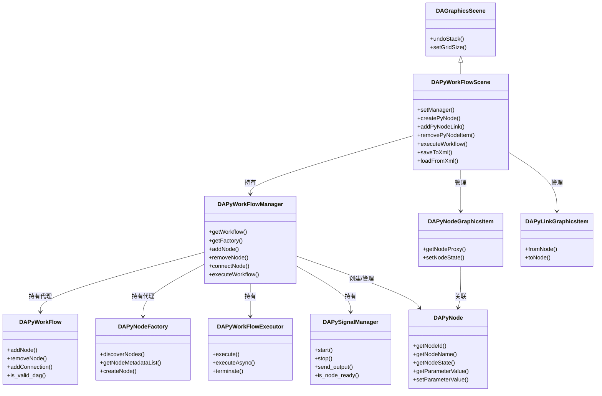

`DAPyWorkFlowScene` 继承 `DAGraphicsScene` 作为场景管理层，持有 `DAPyWorkFlowManager` 作为中央调度器。Manager 内部组合了工作流代理（DAPyWorkFlow）、节点工厂代理（DAPyNodeFactory）、执行器代理（DAPyWorkFlowExecutor）和信号管理器代理（DAPySignalManager），所有这些都是 Python 对象的 C++ 包装。

### 业务逻辑流程

#### 节点发现与创建

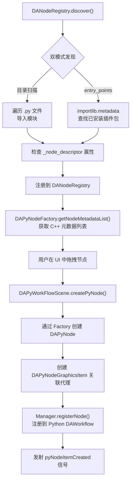

节点发现采用**双模式并行**策略：目录扫描模式遍历指定路径下的 `.py` 文件，动态导入模块并检查 `_node_descriptor` 属性；入口点模式通过 `importlib.metadata.entry_points(group='data_workbench.plugin')` 查找已安装的 Python 包。

#### 流程 2：工作流执行

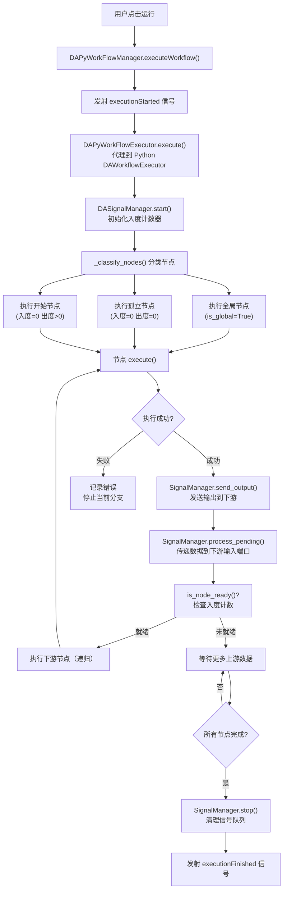

执行流程的核心是**拓扑排序 + 信号传播**。`DAWorkflowExecutor` 使用 Kahn 算法进行拓扑排序，将节点分为三类：全局节点（执行但不传递数据）、孤立节点（入度和出度都为 0）、开始节点（入度为 0 但出度大于 0）。

#### 序列化双轨制

工作流的序列化分为两个独立轨道：

- **逻辑数据**（`DAPyWorkFlowSerializer`）：保存节点拓扑、参数值、连接关系到 `workflow-data.xml`
- **视图数据**（`DAPyWorkFlowSceneSerializer`）：保存节点位置、图元属性、连接线布局到场景 XML

!!! warning "持久化铁律"
    Python 逻辑数据必须先于 C++ 视图数据加载。加载时先通过 `DAWorkflowSerializer` 恢复节点实例和参数，再通过 `DAPyWorkFlowScene` 创建视图图元。

### 核心 API

| API | 签名 | 用途 | 调用时机 |
|-----|------|------|----------|
| `createPyNode` | `DAPyWorkFlowScene::createPyNode(DAPyNodeMetaData, QPointF) -> DAPyNodeGraphicsItem*` | 在场景中创建可视化节点 | 用户拖放或文件加载 |
| `addPyNodeLink` | `DAPyWorkFlowScene::addPyNodeLink(fromItem, output, toItem, input) -> DAPyLinkGraphicsItem*` | 创建连接线 | 用户连线操作 |
| `addNode` | `DAPyWorkFlowManager::addNode(QString qualifiedName) -> DAPyNode` | 通过工厂创建节点并注册 | 场景创建节点后同步调用 |
| `connectNode` | `DAPyWorkFlowManager::connectNode(srcProxy, srcOutput, dstProxy, dstInput)` | 在工作流中建立连接 | 场景创建连线后同步调用 |
| `executeWorkflow` | `DAPyWorkFlowManager::executeWorkflow() -> bool` | 启动工作流执行 | 用户点击运行按钮 |
| `discoverNodes` | `DAPyNodeFactory::discoverNodes(scanPaths, useEntryPoints) -> void` | 扫描发现可用节点类型 | 应用启动或插件加载 |
| `getParameterValue` | `DAPyNode::getParameterValue(QString name) -> pybind11::object` | 读取节点参数值 | 属性面板刷新 |
| `setParameterValue` | `DAPyNode::setParameterValue(QString name, QVariant value) -> void` | 设置节点参数值 | 用户在属性面板修改参数时 |

### 修改指南

!!! tip "修改此模块时"
    - **可以修改**：新增 `DAPyNodeStyle` 的 `NodeRenderTemplate` 枚举值；在 `DAPyWorkFlowScene` 中新增自定义 `createLinkItem()` 工厂方法；修改 `DAPyWorkFlowCommandsFactory` 添加新的撤销命令类型；在 `DAPyNodeGraphicsItem` 中调整节点绘制逻辑
    - **不可修改**：`DAPyWorkFlowManager` 的信号签名（`nodeAdded`、`nodeRemoved` 等，被 DAGui/APP 大量连接）；`DAPyNode` 的 `DAPyObjectWrapper` 继承关系；Python 侧 `DAWorkflowExecutor` 的拓扑排序算法核心逻辑
    - **修改后需同步更新**：`plugins/DASystemNodes/` 中受影响的节点、相关测试

---

## DAData — 数据管理

### 模块概述

- **职责**：数据容器抽象、数据生命周期管理、Python DataFrame 的 C++ 封装
- **在系统中的位置**：L2 功能层，被 DAGui（L3）直接使用，依赖 DAPyBindQt（L1）
- **关键文件**：21 个文件

### 文件结构

```
src/DAData/
├── DAAbstractData.h/.cpp            # 数据抽象基类（6 种 DataType）
├── DAData.h/.cpp                    # 数据包装器（隐式共享，轻量值类型）
├── DADataManager.h/.cpp             # 数据管理器（QObject，含 QUndoStack）
├── DADataPyObject.h/.cpp            # Python 对象通用包装
├── DADataPyDataFrame.h/.cpp         # pandas DataFrame 包装
├── DADataPySeries.h/.cpp            # pandas Series 包装
├── DADataObjectSwapUndoCommand.h/.cpp  # 数据值替换撤销命令
├── DADataObjectPersistUndoCommand.h/.cpp # 数据持久化撤销命令
├── DACommandDataManagerAdd.h/.cpp   # 添加数据撤销命令
├── DACommandDataManagerRemove.h/.cpp # 删除数据撤销命令
└── DACommandDataManagerRename.h/.cpp # 重命名数据撤销命令
```

### 核心类关系

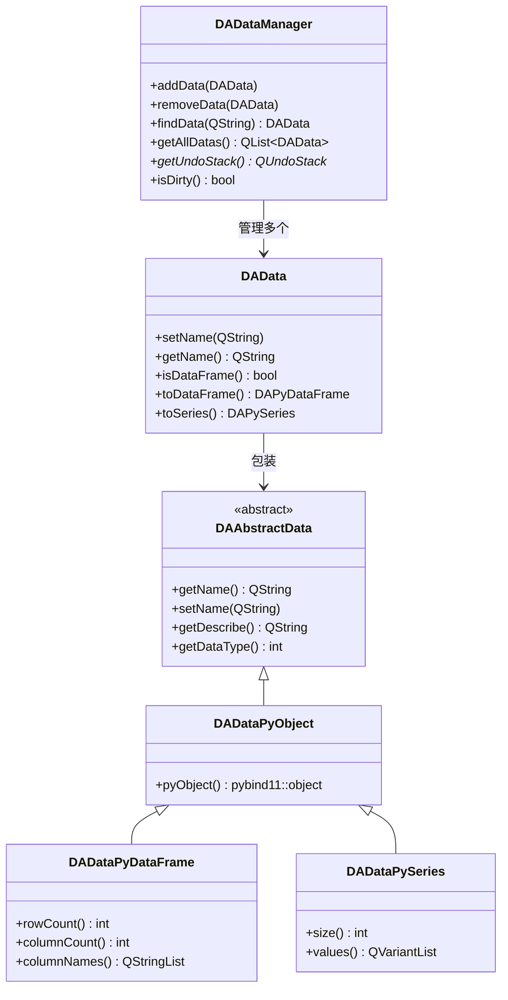

`DAData` 使用隐式共享设计，可安全地进行值传递。`DADataManager` 是 QObject 子类，持有所有数据对象并提供撤销/重做支持。

### 业务逻辑流程

#### 数据添加流程

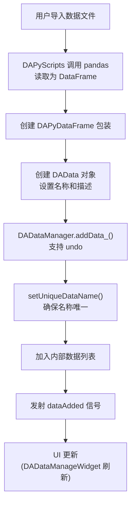

#### 数据在工作流中的流动

在工作流执行过程中，节点间的数据流动**不经过** DADataManager，而是通过 `DASignalManager` 的信号队列直接传递 Python 对象。DADataManager 主要用于用户手动管理的数据（导入、导出、查看），工作流节点间的数据传递由执行器内部完成。

### 核心 API

| API | 签名 | 用途 | 调用时机 |
|-----|------|------|----------|
| `addData_` | `DADataManager::addData_(DAData&) -> void` | 添加数据（支持 undo） | 用户导入数据 |
| `removeData_` | `DADataManager::removeData_(DAData&) -> void` | 移除数据（支持 undo） | 用户删除数据 |
| `findData` | `DADataManager::findData(QString name) -> DAData` | 按名称精确查找 | 节点获取输入数据 |
| `findDatas` | `DADataManager::findDatas(QString pattern) -> QList<DAData>` | 按通配符查找 | 批量数据操作 |
| `isDataFrame` | `DAData::isDataFrame() -> bool` | 检查是否为 DataFrame | 类型判断前置检查 |
| `toDataFrame` | `DAData::toDataFrame() -> DAPyDataFrame` | 转换为 DataFrame | 数据操作前获取实际对象 |

### 修改指南

!!! tip "修改此模块时"
    - **可以修改**：在 `DAAbstractData` 的 `DataType` 枚举中新增数据类型；添加新的撤销命令类
    - **不可修改**：`DAData` 的隐式共享机制（值语义核心）；`DADataManager` 的信号签名（`dataAdded`、`dataRemoved`、`dataChanged`、`datasCleared`，被 40+ 文件连接）
    - **修改后需同步更新**：DAGui 中的数据管理 UI、工作流节点中的数据处理

---

## DAFigure — 图表容器

### 模块概述

- **职责**：基于 Qwt 的图表容器、图表编辑器、数据探针、图表序列化
- **在系统中的位置**：L2 功能层，被 DAGui（L3）使用，依赖 DAUtils（L1）和 Qwt
- **关键文件**：85 个文件

### 文件结构

```
src/DAFigure/
├── DAFigureWidget.h/.cpp           # 画布容器（QScrollArea + QwtFigure）
├── DAChartWidget.h/.cpp            # 图表控件（QwtPlot + 3 个接口 Mixin）
├── DAChartDataInterface.h          # 数据操作接口
├── DAChartStyleInterface.h         # 样式设置接口
├── DAChartInteractionInterface.h   # 交互控制接口
├── DAChartSerialize.h/.cpp         # 15+ QwtPlotItem 类型序列化
├── DAChartAxisRangeBinder.h/.cpp   # 多图表轴范围同步绑定
├── DAChartFactory.h/.cpp           # 图表工厂
├── DAChartUtil.h/.cpp                # 图表工具函数
├── DADataProbeMarker.h/.cpp        # 数据探针标记
├── DAFigureTreeView.h/.cpp         # 图表树视图
├── DAFigureTreeModels.h/.cpp       # 图表树模型
├── DAAbstractChartEditor.h/.cpp    # 图表编辑器基类
├── DAAbstractTwoPointEditor.h/.cpp # 两点编辑器基类
└── DAAbstractRegionSelectEditor.h/.cpp # 区域选择编辑器基类
```

### 核心类关系

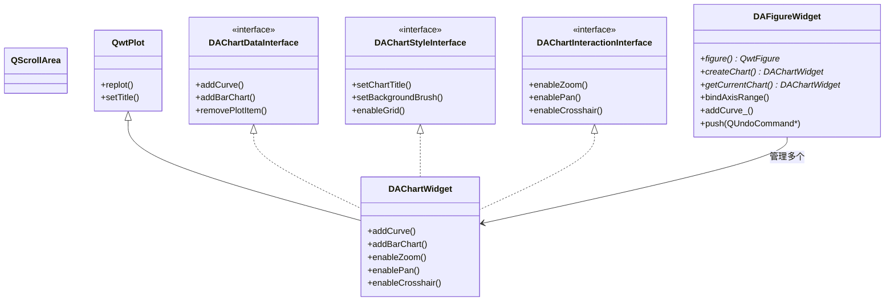

`DAChartWidget` 通过实现三个接口（`DAChartDataInterface`、`DAChartStyleInterface`、`DAChartInteractionInterface`）将数据管理、样式设置、用户交互三个方面的功能分离。

### 业务逻辑流程

#### 图表创建与数据绑定

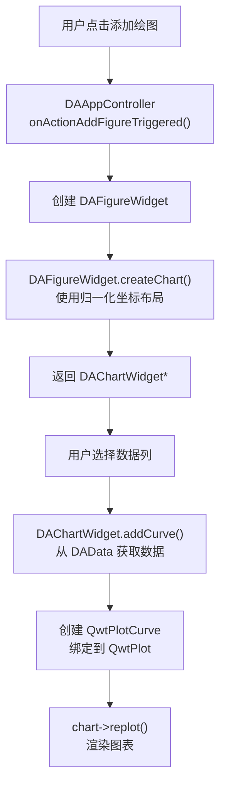

#### Undo/Redo 双接口模式

DAFigure 提供两套接口：

- **直接操作**：`addCurve()`、`addItem()` 等不带下划线后缀的方法，直接修改图表，不记录到撤销栈
- **撤销操作**：`addCurve_()`、`addItem_()` 等带下划线后缀的方法，自动将操作记录到 `QUndoStack`

!!! warning "接口选择"
    用户交互操作必须使用带 `_` 后缀的方法以支持撤销。程序内部初始化或批量操作可使用不带后缀的方法以提高性能。

### 核心 API

| API | 签名 | 用途 | 调用时机 |
|-----|------|------|----------|
| `createChart` | `DAFigureWidget::createChart(QRectF) -> DAChartWidget*` | 创建图表并指定归一化布局 | 用户添加图表 |
| `addCurve_` | `DAFigureWidget::addCurve_(QVector<QPointF>) -> QwtPlotCurve*` | 添加曲线（支持 undo） | 用户绑定数据 |
| `bindAxisRange` | `DAFigureWidget::bindAxisRange(source, follower, axisId) -> bool` | 绑定两个图表的轴范围联动 | 多图表同步分析 |
| `createVerticalProbe` | `DAFigureWidget::createVerticalProbe(double x, QString name) -> DADataProbeMarker*` | 创建垂直数据探针 | 用户标注数据点 |
| `enableZoom` | `DAChartWidget::enableZoom(bool) -> void` | 启用/禁用缩放交互 | 图表初始化 |

### 修改指南

!!! tip "修改此模块时"
    - **可以修改**：新增 `DAAbstractChartEditor` 的子类；在 `DAChartSerialize` 中注册新的 `QwtPlotItem` 类型序列化支持；扩展 `DAFigureWidget::ChartEditorType` 枚举（`UserDefineEditor = 1000` 起步）
    - **不可修改**：`DAChartWidget` 对 `QwtPlot` 的继承关系；`QwtPlotItem` 相关类不能继承 QObject；三个接口（Data/Style/Interaction）的方法签名
    - **修改后需同步更新**：`DAGui/ChartSetting/` 中对应的属性面板

---

## DAGui — GUI 整合层

### 模块概述

- **职责**：整合所有 UI 功能——工作流 UI、图表设置面板、节点设置面板、数据管理 UI、Model/View、对话框、撤销命令
- **在系统中的位置**：L3 界面层，被 DAInterface（L4）以 PUBLIC 方式依赖
- **关键文件**：405 个文件（项目最大模块）

### 文件结构

```
src/DAGui/
├── Chart/ (12 文件)
│   └── 图表管理容器：DAChartOperateWidget/DAChartManageWidget/DAChartSettingWidget + DAChartItemsManager
│
├── ChartAddItem/ (89 文件)
│   └── 图表添加向导面板体系：2D/3D/Stats 三组抽象基类 + 27 个 DAChartAdd* 派生 Widget + 序列选择器
│      注：不可整目录 GLOB，应显式列出源文件，否则会改变构建行为
│
├── ChartSetting/ (64 文件)
│   ├── DAAbstractChartItemSettingWidget.h   # 图表项设置基类（d_cast/s_cast）
│   ├── DAChartItemSettingPanel.h/.cpp       # ChartItem 面板基类（Qwt 专有方法）
│   ├── DAChartCurveSettingPanel.h/.cpp      # 曲线设置面板
│   ├── DAChartBarSettingPanel.h/.cpp        # 柱状图设置面板
│   ├── DAChartGridSettingPanel.h/.cpp       # 网格设置面板
│   ├── DAChartLegendSettingPanel.h/.cpp     # 图例设置面板
│   ├── DAChartAxisSettingPanel.h/.cpp       # 坐标轴设置面板
│   └── DAChartItemSettingPanelFactory.h/.cpp # 面板工厂（RTTI 注册）
│
├── Chart3DSetting/ (26 文件)
│   └── 3D 图表属性设置面板
│
├── NodeSetting/ (8 文件, Python only)
│   ├── DANodeParamSettingPanel.h/.cpp        # 通用节点参数面板
│   ├── DANodeParamSettingPanelFactory.h     # 参数面板工厂
│   ├── DANodeParamSettingPanelWidget.h       # QStackedWidget 调度器
│   ├── DANodeParameterFormAdapter.h           # DAPyNodeParameter -> DAFormSpec 适配器
│   └── ParameterDescriptor.h                # 参数描述符
│
├── Commands/ (10 文件)
│   └── 工作流/DataFrame 撤销命令
│
├── Dialog/ (31 文件)
│   ├── DAChartWizardDialog                  # 图表向导
│   ├── DADataImportDialog                     # 数据导入
│   └── ... (其他对话框)
│
├── MimeData/ (3 文件)
│   └── 拖放 MIME 数据类型
│
├── Models/ (22 文件)
│   ├── DADataTreeModel                      # 数据树模型
│   ├── DAMessageLogsModel                   # 消息日志模型
│   └── ... (其他 Model/View)
│
├── Agent/ (4 文件, Python only)
│   └── DAAgentDockWidget                    # Agent 聊天 UI（与 DAAgent 接口信号链对接）
│
├── MarkdownView/ (2 文件, Python only)
│   └── Markdown 预览视图
│
├── (根级 134 文件)
│   ├── DAPyWorkFlowEditWidget.h/.cpp         # 工作流编辑控件
│   ├── DAPyWorkFlowGraphicsView.h/.cpp       # 工作流图形视图
│   ├── DAPyWorkFlowGraphicsScene.h/.cpp      # 工作流图形场景
│   ├── DAChartOperateWidget.h/.cpp           # 图表操作窗口
│   ├── DAChartManageWidget.h/.cpp            # 图表管理窗口
│   ├── DADataManageWidget.h/.cpp             # 数据管理窗口
│   ├── DADataOperateWidget.h/.cpp            # 数据操作窗口
│   ├── DAPyDataFrameTableView.h/.cpp        # DataFrame 表格视图
│   ├── DAAbstractNodeSettingWidget.h         # 节点设置抽象基类
│   ├── DASplashScreen.h/.cpp                 # 启动画面
│   ├── DAZipArchive.h/.cpp                   # ZIP 存档
│   └── DARecentFilesManager.h/.cpp          # 最近文件管理
```

### 核心类关系

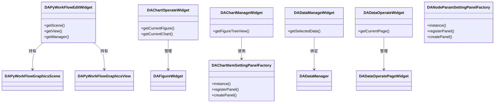

!!! info "DAChartOperateWidget 的停靠实现"
    `DAChartOperateWidget` 基于 ADS 的 dockindock 嵌套停靠区管理多个 `DAFigureWidget`（隔离在绘图区内、自由分屏、布局随工程持久化）。该机制有一个隐蔽的 `FocusHighlighting` 焦点跨管理器陷阱，修改停靠相关逻辑前必读 [绘图窗口停靠布局](../graphics/chart-dock-nesting.md)。

### 业务逻辑流程

#### 图表设置面板的创建与使用

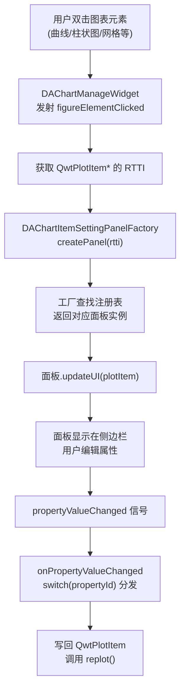

#### 节点参数面板创建与使用

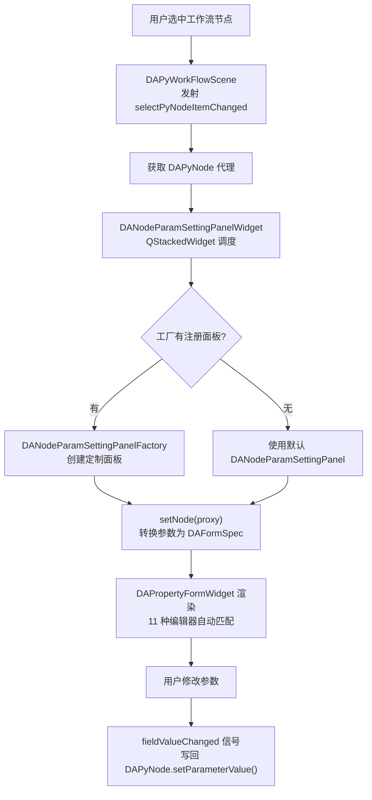

**NodeSetting 三层架构**：

1. **基类层**：`DAAbstractNodeSettingWidget` 定义接口（`readFromNode`/`writeToNode`），持有 `DAPyNode*`
2. **面板层**：`DANodeParamSettingPanel` 基于 `DAPropertyFormWidget` + `DAFormSpec` 统一渲染；专用面板继承基类实现自定义 UI
3. **调度层**：`DANodeParamSettingPanelWidget`（QStackedWidget）+ `DANodeParamSettingPanelFactory`（单例工厂）+ 惰性加载缓存

### 核心 API

| API | 签名 | 用途 | 调用时机 |
|-----|------|------|----------|
| `registerPanel` | `DAChartItemSettingPanelFactory::registerPanel(int rtti, Creator lambda) -> void` | 注册图表面板类型 | 模块初始化或插件注册 |
| `registerPanel` | `DANodeParamSettingPanelFactory::registerPanel(QString qualifiedName, Creator) -> void` | 注册节点参数面板 | 插件提供自定义面板 |
| `getScene` | `DAPyWorkFlowEditWidget::getScene() -> DAPyWorkFlowScene*` | 获取当前工作流场景 | 控制器连接信号槽 |
| `getCurrentFigure` | `DAChartOperateWidget::getCurrentFigure() -> DAFigureWidget*` | 获取当前画布 | 添加图表元素 |
| `getSelectedData` | `DADataManageWidget::getSelectedData() -> QList<DAData>` | 获取用户选中的数据 | 数据操作前置获取 |

### 修改指南

!!! tip "修改此模块时"
    - **可以修改**：在 `ChartSetting/` 中新增面板类；在 `NodeSetting/` 中注册自定义节点参数面板；在 `Models/` 中新增 Model/View 模型；在 `Dialog/` 中新增对话框
    - **不可修改**：`DAChartItemSettingPanel` 的 `buildPropertyPanel()` 纯虚函数签名；`DAAbstractChartItemSettingWidget` 的 `d_cast()`/`s_cast()`/`checkItemRTTI()` 机制
    - **修改后需同步更新**：翻译文件（`.ts`）中的新增 tr() 字符串

!!! danger "endGroup 遗漏 (P0 级 Bug)"
    每个 `addCollapsibleGroup()` 必须立即配对一个 `endGroup()`。遗漏会导致后续所有分组变成前一分组的子嵌套分组，面板布局完全破坏。

---

## DAInterface — 抽象接口层

### 模块概述

- **职责**：定义系统核心抽象接口，隔离应用层与功能层
- **在系统中的位置**：L4 接口层，被 DAPluginSupport（L4）和 APP（L5）依赖
- **关键文件**：29 个文件

### 文件结构

```
src/DAInterface/
├── DACoreInterface.h/.cpp           # 核心接口（所有接口的根）
├── DAUIInterface.h/.cpp             # UI 接口（Ribbon/Docking/StatusBar）
├── DAUIExtendInterface.h           # UI 扩展接口基类
├── DAProjectInterface.h/.cpp        # 工程管理接口
├── DADataManagerInterface.h/.cpp    # 数据管理接口
├── DAActionsInterface.h/.cpp     # Action 管理接口
├── DACommandInterface.h/.cpp        # QUndoGroup 管理接口
├── DADockingAreaInterface.h/.cpp    # 停靠区域管理接口（8 个 dock 区域）
├── DARibbonAreaInterface.h/.cpp     # Ribbon 栏管理接口
├── DAStatusBarInterface.h/.cpp      # 状态栏管理接口
├── DABaseInterface.h                # 所有接口的基类
├── DAInterfaceHelper.h/.cpp         # 一站式便捷访问
└── DAInterfacePythonBinding.h       # Python 绑定
```

### 核心类关系

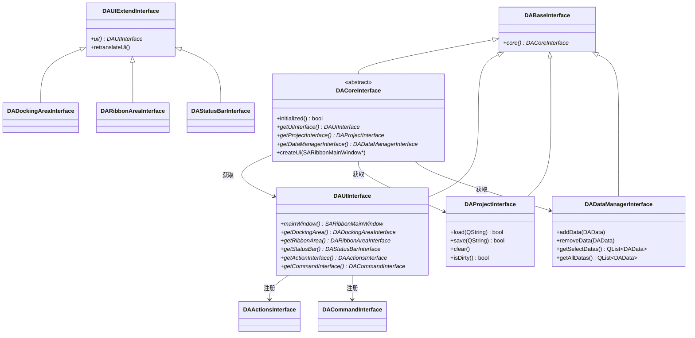

### 业务逻辑流程

#### 接口创建顺序

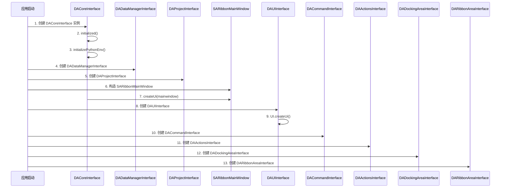

!!! warning "接口创建顺序铁律"
    在接口构造过程中，必须严格遵循创建顺序。例如在 `DADataManagerInterface` 的构造函数中不能调用 `DAUIInterface` 的方法，因为 UI 接口此时尚未创建。

### 核心 API

| API | 签名 | 用途 | 调用时机 |
|-----|------|------|----------|
| `getUiInterface` | `DACoreInterface::getUiInterface() -> DAUIInterface*` | 获取 UI 管理接口 | 插件初始化 |
| `getProjectInterface` | `DACoreInterface::getProjectInterface() -> DAProjectInterface*` | 获取工程管理接口 | 项目操作 |
| `getDataManagerInterface` | `DACoreInterface::getDataManagerInterface() -> DADataManagerInterface*` | 获取数据管理接口 | 数据操作 |
| `initialized` | `DACoreInterface::initialized() -> bool` | 初始化核心接口 | 应用启动第一步 |
| `createUi` | `DACoreInterface::createUi(SARibbonMainWindow*) -> void` | 创建 UI 接口 | 主窗口构造过程中 |

### 修改指南

!!! tip "修改此模块时"
    - **可以修改**：在 `DAUIInterface` 中新增虚方法；添加新的 `DAUIExtendInterface` 子类
    - **不可修改**：`DACoreInterface` 的纯虚方法签名（所有实现类和消费方都需要同步修改）；`DABaseInterface::core()` 方法；接口创建顺序（步骤 1-13 不可变更）
    - **修改后需同步更新**：`src/APP/` 中对应的实现类、所有插件

---

## DAPluginSupport — 插件框架

### 模块概述

- **职责**：提供插件基类和插件管理器，支持动态加载/卸载插件
- **在系统中的位置**：L4 接口层，被 APP（L5）使用，PUBLIC 依赖 DAInterface
- **关键文件**：9 个文件

### 文件结构

```
src/DAPluginSupport/
├── DAAbstractPlugin.h/.cpp          # 插件基类（纯虚接口）
├── DAAbstractNodePlugin.h/.cpp      # 节点基类
├── DAPluginManager.h/.cpp           # 插件发现/加载/卸载管理器
└── DAPluginOption.h/.cpp            # 插件元数据
```

### 核心类关系

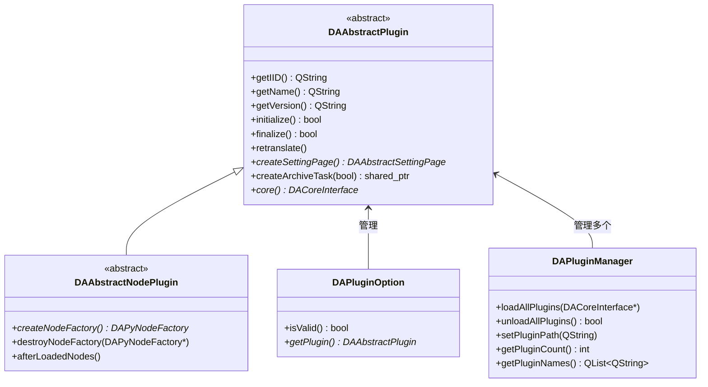

### 业务逻辑流程

#### 插件加载流程

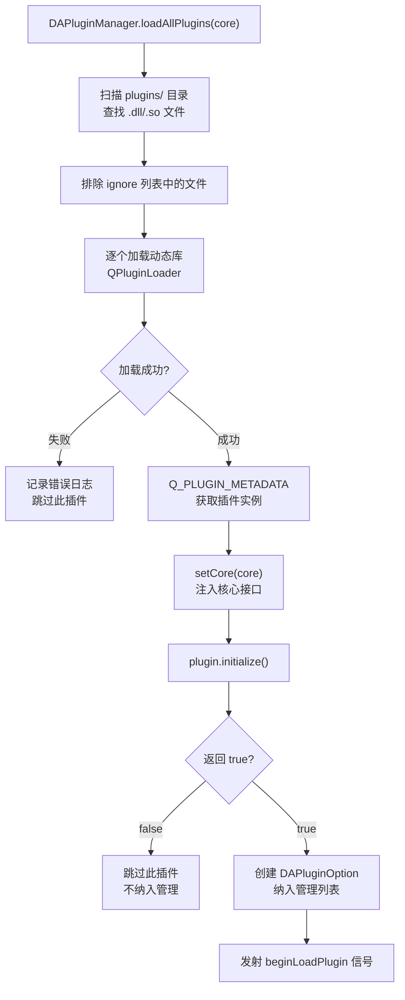

#### 节点插件的工厂创建

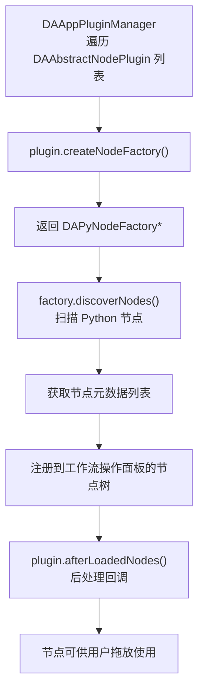

### 核心 API

| API | 签名 | 用途 | 调用时机 |
|-----|------|------|----------|
| `initialize` | `DAAbstractPlugin::initialize() -> bool` | 初始化插件 | 插件加载时由 Manager 调用 |
| `finalize` | `DAAbstractPlugin::finalize() -> bool` | 释放插件 | 插件卸载时由 Manager 调用 |
| `core` | `DAAbstractPlugin::core() -> DACoreInterface*` | 获取核心接口 | 插件内部需要与主程序交互时 |
| `createNodeFactory` | `DAAbstractNodePlugin::createNodeFactory() -> DAPyNodeFactory*` | 创建节点工厂 | 应用启动加载插件 |
| `loadAllPlugins` | `DAPluginManager::loadAllPlugins(DACoreInterface*) -> void` | 加载所有插件 | 应用启动 |
| `unloadAllPlugins` | `DAPluginManager::unloadAllPlugins() -> bool` | 卸载所有插件 | 应用退出 |

### 修改指南

!!! tip "修改此模块时"
    - **可以修改**：新增 `DAAbstractPlugin` 的子类；在 `DAPluginManager` 中添加插件优先级或依赖解析逻辑
    - **不可修改**：`DAAbstractPlugin` 的 IID 字符串 `"org.da.abstract.plugin"`（影响所有已有插件兼容性）；`createNodeFactory()`/`destroyNodeFactory()` 的"谁创建谁删除"原则
    - **修改后需同步更新**：所有插件重新编译

---

## DAAgent — AI Agent 框架

### 模块概述

- **职责**：纯 agent 框架库——多供应商 LLM 调用、提示词库、工具注册机制、agent 生命周期信号链、会话持久化。**不依赖任何 GUI 模块**（无 DAGui/DAFigure/qwt/ADS）：工具注册、聊天 UI 接线、LLM 设置页持久化全部由插件 / APP 层决定，DAGui 与 DAAgent 为兄弟模块互不依赖
- **在系统中的位置**：L4 接口层，被 APP（L5）与 `plugins/DAAgentTools/` 消费，依赖 DAInterface/DAData/DAPyBindQt/DAPyScripts
- **关键文件**：17 个文件

### 文件结构

```
src/DAAgent/
├── DAAgentInterface.h              # 公共接口契约（14 个生命周期/会话信号 + registerTool/registerSystemPrompt + LLM 配置读写 + 会话管理纯虚方法）
├── DAAgentModule.h/.cpp            # 接口实现：工具注册表、系统提示词组装、懒启动、Bridge 信号转发（不持有 Dock）；agent-config.ini 持久化（api_key 内部 DPAPI 加解密）
├── DAAgentManager.h/.cpp           # agent 管理调度
├── DAAgentBridge.h/.cpp            # QProcess 子进程管理 + JSON Lines 协议解析
├── DAAgentPrompt.h/.cpp            # 提示词库
├── DAAgentPromptOps.h/.cpp         # 提示词操作集
├── DAAgentSessionStore.h/.cpp      # 会话持久化层（JSONL 读写/索引/清理）
├── DAAgentToolBase.h/.cpp          # 瘦工具基类（DAAgent_API 导出，供插件跨 DLL 继承）
├── DAAbstractAgentTool.h           # 工具抽象基类
└── DAAgentAPI.h                    # 导出宏
```

### 核心类关系

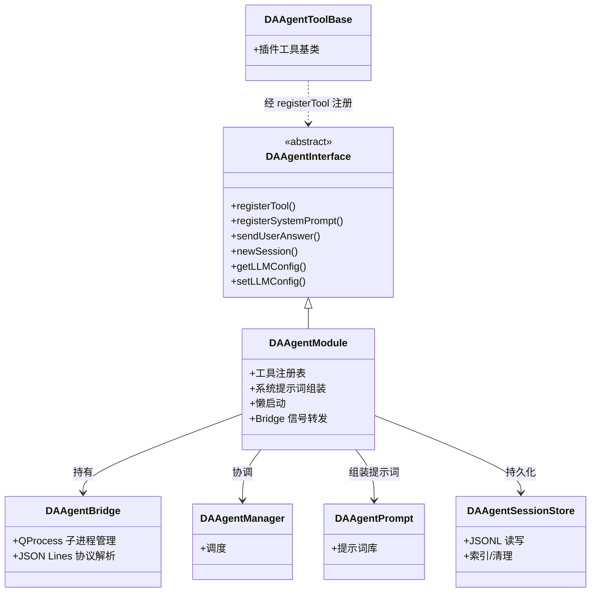

### 业务逻辑流程

#### 工具注册与对话

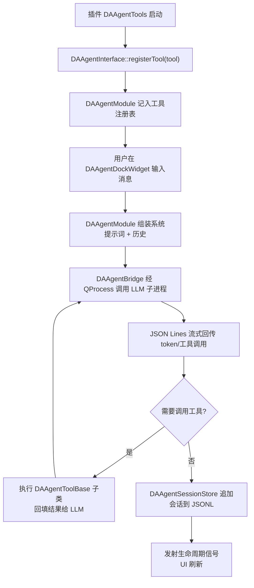

#### 会话持久化

会话以 `agent_sessions/<id>.jsonl` 形式持久化（详见 [项目文件结构](./project-file-structure.md)）。`DAAgentSessionStore` 负责 JSONL 的读写、按 id 索引与过期清理；工程打包/加载时由 `src/APP/DAAppProject.cpp` 的 `DAZipArchiveTask_LoadAgentSessions` 在 worker 线程解压 `agent_sessions/*.jsonl`。

### 核心 API

| API | 签名 | 用途 | 调用时机 |
|-----|------|------|----------|
| `registerTool` | `DAAgentInterface::registerTool(DAAgentToolBase*) -> void` | 注册 agent 工具 | 插件 `initialize()` |
| `registerSystemPrompt` | `DAAgentInterface::registerSystemPrompt(name, content) -> void` | 注册系统提示词片段 | 插件初始化 |
| `sendUserAnswer` | `DAAgentInterface::sendUserAnswer(QString) -> void` | 提交用户输入 | 聊天 UI 发送 |
| `newSession` | `DAAgentInterface::newSession() -> QString` | 新建会话并返回 id | 用户新建会话 |
| `getLLMConfig`/`setLLMConfig` | `DAAgentInterface::get/setLLMConfig(...) ` | 读写 LLM 配置 | 设置页持久化 |

### 修改指南

!!! tip "修改此模块时"
    - **可以修改**：在 `DAAgentPrompt` 中扩展提示词模板；新增 agent 生命周期信号（接口侧需同步）
    - **不可修改**：`DAAgentInterface` 的纯虚方法签名（被 APP 与所有 agent 工具插件依赖）；`DAAgentBridge` 的 JSON Lines 协议格式（与子进程端契约绑定）
    - **修改后需同步更新**：`plugins/DAAgentTools/` 中受影响的工具、APP 的 Dock↔接口信号链接线

!!! info "更深入的 Agent 文档"
    本节为模块级摘要。Agent 框架的完整架构、生命周期、工具开发与协议细节见 [:octicons-copilot-24: Agent 开发指南](../agent/index.md)。

---

## APP — 主程序

### 模块概述

- **职责**：可执行程序入口，所有接口的具体实现，项目管理，插件管理
- **在系统中的位置**：L5 应用层，依赖 DAPluginSupport 和 DAPyWorkFlow
- **关键文件**：92 个文件

### 文件结构

```
src/APP/
├── main.cpp                    # 程序入口（QApplication + Python + 命令行）
├── DAAppCore.h/.cpp                 # 核心单例（DACoreInterface 实现）
├── AppMainWindow.h/.cpp             # 主窗口（SARibbonMainWindow 子类）
├── DAAppUI.h/.cpp                   # UI 聚合接口实现（DAUIInterface 实现）
├── DAAppController.h/.cpp           # MVC 控制器（信号槽对接）
├── DAAppProject.h/.cpp              # 工程文件序列化（DAProjectInterface 实现）
├── DAAppDataManager.h/.cpp          # 数据管理接口实现
├── DAAppDockingArea.h/.cpp          # Dock 区域接口实现
├── DAAppRibbonArea.h/.cpp           # Ribbon 栏接口实现
├── DAAppStatusBar.h/.cpp            # 状态栏接口实现
├── DAAppCommand.h/.cpp              # 命令接口实现（QUndoGroup）
├── DAAppActions.h/.cpp              # Action 管理接口实现
├── DAAppPluginManager.h/.cpp        # 插件管理器具体实现
├── DAAppConfig.h/.cpp               # 应用配置
├── PythonBinding/                   # pybind11 应用绑定
├── SettingPages/                    # 设置页面
├── Dialog/                          # 应用级对话框（关于、PNG 导出等）
└── Icon/                            # 图标资源
```

### 核心类关系

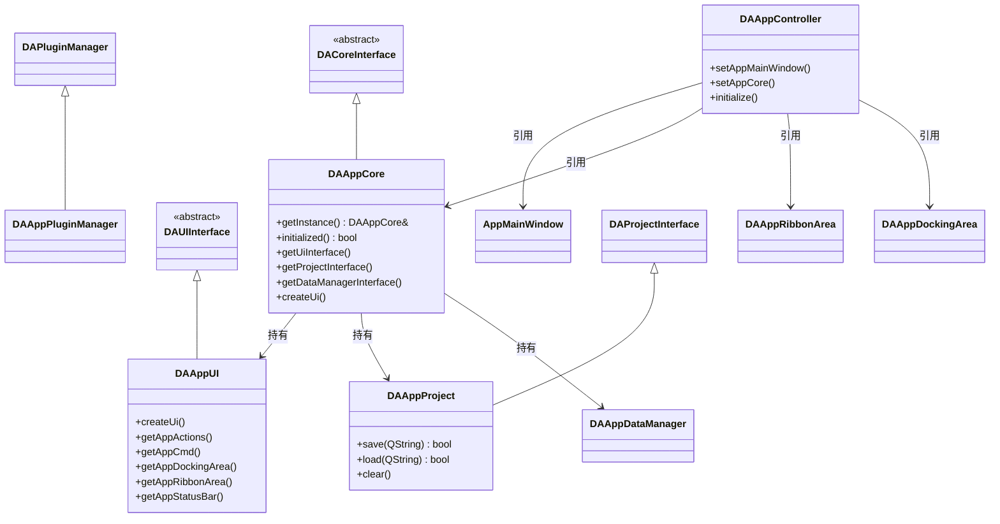

### 业务逻辑流程

#### 应用启动流程

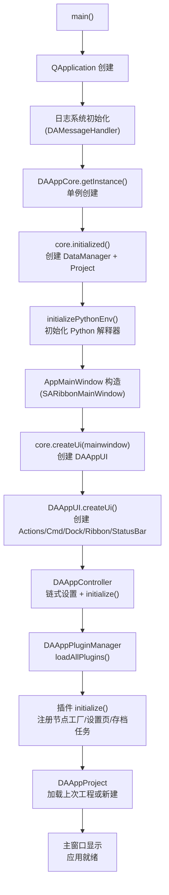

#### 工程保存流程

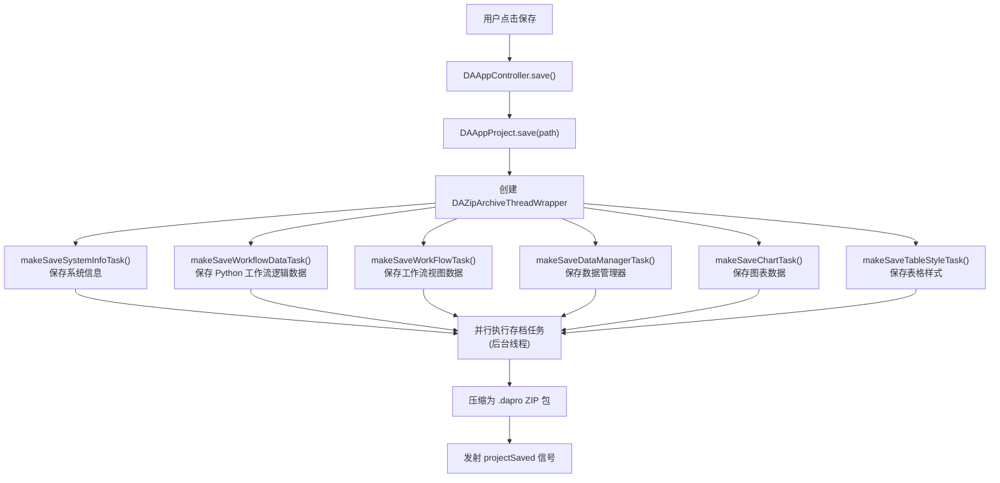

!!! note "存档任务扩展"
    插件可以通过 `DAAbstractPlugin::createArchiveTask(isSave)` 创建自定义存档任务，在工程保存/加载时执行自定义的序列化/反序列化逻辑。

### 核心 API

| API | 签名 | 用途 | 调用时机 |
|-----|------|------|----------|
| `getInstance` | `DAAppCore::getInstance() -> DAAppCore&` | 获取全局核心单例 | 应用 `DA_APP_CORE` 宏 |
| `initialized` | `DAAppCore::initialized() -> bool` | 初始化核心组件 | 应用启动 |
| `createUi` | `DAAppCore::createUi(SARibbonMainWindow*) -> void` | 创建 UI 子系统 | 主窗口构造 |
| `initialize` | `DAAppController::initialize() -> void` | 建立所有信号槽连接 | 所有组件创建完成后 |
| `save` | `DAAppProject::save(QString path) -> bool` | 保存工程文件 | 用户点击保存 |
| `load` | `DAAppProject::load(QString path) -> bool` | 加载工程文件 | 用户打开工程 |
| `importData` | `DAAppController::importData(QString filePath, QVariantMap args) -> bool` | 导入数据文件 | 用户导入数据 |

### 修改指南

!!! tip "修改此模块时"
    - **可以修改**：在 `SettingPages/` 中新增应用级设置页面；在 `Dialog/` 中新增应用级对话框；在 `DAAppController` 中添加新的槽函数处理新 Action；在 `DAAppRibbonArea` 中添加新的 Ribbon 按钮和上下文标签
    - **不可修改**：`DAAppCore` 的单例模式和 `getInstance()` 静态方法；`DAAppCore::initialized()` 中 DataManager 和 Project 的创建顺序；`DAAppUI` 中五个子组件的创建顺序；`DAAppProject` 的 ZIP 存档格式
    - **修改后需同步更新**：命令行参数文档、设置页面翻译

---

## 模块间交互矩阵

下表展示各模块之间的主要交互方式和数据流向。行表示调用方（消费者），列表示被调用方（提供者）。

| 消费者 \ 提供者 | DAPyWorkFlow | DAData | DAFigure | DAGui | DAInterface | DAPluginSupport | APP |
|:---|:---|:---|:---|:---|:---|:---|:---|
| **DAPyWorkFlow** | - | 读取数据 | — | — | — | — | — |
| **DAData** | — | - | — | — | — | — | — |
| **DAFigure** | — | 读取数据 | - | — | — | — | — |
| **DAGui** | 场景管理、节点创建、工作流编辑 | 数据管理、数据面板 | 图表容器、设置面板 | - | — | — | — |
| **DAInterface** | 通过 DAGui 传递 | 通过 DAGui 传递 | 通过 DAGui 传递 | PUBLIC 链接 | - | — | — |
| **DAPluginSupport** | DAPyNodeFactory | 通过 DAInterface | 通过 DAInterface | 通过 DAInterface | PUBLIC 链接 | - | — |
| **DAAgent** | — | 读取数据（DADataPyObject） | — | —（兄弟模块，不依赖 GUI） | PUBLIC 链接（DAAgentInterface） | — | — |
| **APP** | DAPyWorkFlowScene、执行控制 | DAAppDataManager 实现 | DAAppProject 图表存档 | DAAppUI/DAAppController | 实现所有接口 | DAAppPluginManager | - |

### 关键交互路径说明

| 交互方式 | 使用场景 | 示例 |
|----------|----------|------|
| **Qt 信号槽** | 同进程异步通知 | 数据导入完成 → UI 刷新 |
| **直接方法调用** | 同层或上下层同步操作 | DAGui 调用 DAData 的 getData() |
| **接口抽象** | 跨层调用、插件与主程序通信 | 插件通过 DACoreInterface 访问系统能力 |
| **QUndoCommand** | 需要撤销/重做的操作 | 节点移动、属性修改 |

---

## 参见

- [开发指引](../developer-guide.md) — 开发者入门完整指南
- [架构设计](./architecture.md) — 5 层架构和设计决策
- [模块依赖关系](./module-dependency.md) — 详细的 CMake 依赖矩阵
- [编码规范](../general/coding-standard.md) — 命名、注释、代码风格规范
