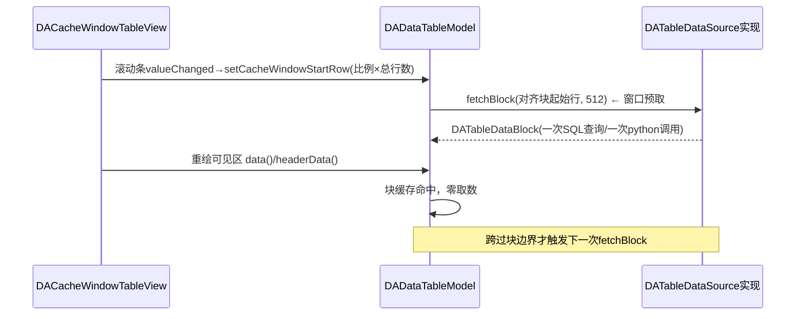

# 表格数据源抽象层（DATableDataSource）

表格数据源抽象层是 DAData 模块中位于 `DAAbstractData` 与消费者（表格模型、工程持久化、undo 体系）之间的统一取数接口，它把"数据 = 内存中的 pandas 对象"这一隐含假设解开，使**不全量驻留内存的惰性数据**（如数据库超大表）能够注册进 `DADataManager`、在数据页中分页显示、并以"引用"形式随工程持久化。

## 主要功能特性

- ✅ **schema 与数据分离**：行列数、列名、列类型是低开销元信息，取数据本体走独立的块级接口
- ✅ **块级批量取数（fetchBlock）**：一次调用取一段连续行区间；pandas 实现为单次 python 调用取整块（不再逐 cell 进解释器），数据库实现为 `LIMIT/OFFSET` 分页查询
- ✅ **能力位虚函数**：`isLazyLoaded` / `isTableEditable` / `isReferenceData` / `supportsUndoSnapshot` / `typeIdentifier`，消费端按能力分派而非按 DataType 枚举 switch，**新增数据类型不需要修改 DAData/DAGui 核心代码**
- ✅ **视图侧统一块缓存**：`DADataTableModel` 对任何表格数据源做滑动窗+块缓存（默认 512 行/块），滚动条驱动的动态取数由既有 `DACacheWindowTableView` 比例映射机制承接
- ✅ **引用式工程持久化**：`DADataFactory` 类型注册表 + `write/read(QDataStream)`，工程文件只存连接/查询/schema 等引用 payload，不存数据本体
- ✅ **undo 分级**：不支持整表物化的数据源可声明 `supportsUndoSnapshot()==false`，快照式 undo 命令自动跳过

## 基本概念

### 类关系

`DATableDataSource` 是刻意**不继承** `DAAbstractData` 的 mixin 接口：数据类通过多继承同时获得"受管理数据"与"表格数据源"两种身份，避免与 `DADataPyObject` 等中间基类形成菱形继承。消费者统一经 `DAAbstractData::tableSource()` 取得接口指针，返回非空即代表表格型数据（`DAData::isTable()`）。

```mermaid
classDiagram
    class DAAbstractData {
        <<abstract>>
        +tableSource() DATableDataSource*
        +isReferenceData() bool
        +supportsUndoSnapshot() bool
        +typeIdentifier() QString
        +write(QDataStream)
        +read(QDataStream) bool
    }
    class DATableDataSource {
        <<interface>>
        +tableRowCount() size_t
        +tableColumnCount() size_t
        +tableColumnName(col) QString
        +tableColumnType(col) int
        +fetchBlock(startRow, rowCount) DATableDataBlock
        +isLazyLoaded() bool
        +isTableEditable() bool
    }
    class DATableDataBlock {
        +startRow() size_t
        +rowCount() size_t
        +cell(actualRow, col) QVariant
        +rowHeader(actualRow) QVariant
        +isValid() bool
    }
    class DADataPyObject
    class DADataPyDataFrame
    class DADataPySeries
    class 数据库惰性表(插件自定义) {
        +fetchBlock() LIMIT/OFFSET查询
        +write() 连接名+SQL
    }
    DAAbstractData <|-- DADataPyObject
    DADataPyObject <|-- DADataPyDataFrame
    DADataPyObject <|-- DADataPySeries
    DATableDataSource <|.. DADataPyDataFrame : 实现
    DATableDataSource <|.. DADataPySeries : 实现
    DAAbstractData <|-- 数据库惰性表(插件自定义)
    DATableDataSource <|.. 数据库惰性表(插件自定义) : 实现
    DATableDataSource ..> DATableDataBlock : fetchBlock返回
```

### 取数时序（滚动驱动）

视图侧不需要为新数据源写任何滚动逻辑，既有滑动窗机制自动生效：



## 使用方法

### 新增一个惰性表格数据源

以数据库表为例（完整可运行样板见 `src/tst/DATableDataTest/DASqliteLazyTable.h/.cpp`），继承两个基类并实现纯虚接口：

```cpp
class DAMyPluginTable : public DA::DAAbstractData, public DA::DATableDataSource
{
public:
    // ---- DAAbstractData ----
    DA::DAAbstractData::DataType getDataType() const override
    {
        return DA::DAAbstractData::TypeInnerData;  // 枚举无法表达的类型统一用TypeInnerData
    }
    QVariant toVariant(std::size_t r, std::size_t c) const override;  // cell级兜底
    bool setValue(std::size_t, std::size_t, const QVariant&) override { return false; }  // 只读
    DA::DATableDataSource* tableSource() override { return this; }
    const DA::DATableDataSource* tableSource() const override { return this; }
    bool isReferenceData() const override { return true; }        // 工程只存引用
    bool supportsUndoSnapshot() const override { return false; }  // 不参与整表快照undo
    QString typeIdentifier() const override { return QStringLiteral("MyPlugin.DbTable"); }

    // ---- DATableDataSource ----
    std::size_t tableRowCount() const override;    // COUNT(*)，带缓存
    std::size_t tableColumnCount() const override; // schema探针，带缓存
    QString tableColumnName(std::size_t c) const override;
    DA::DATableDataBlock fetchBlock(std::size_t startRow, std::size_t rowCount) override
    {
        // SELECT * FROM (子查询) LIMIT rowCount OFFSET startRow
        // 逐行 appendRow，不提供行头时模型自动回退显示序号
    }
    bool isLazyLoaded() const override { return true; }
    bool isTableEditable() const override { return false; }
};
```

实现后注册进数据管理器即可在数据页显示（`DADataOperateWidget::showData` 对所有 `isTable()` 数据打开数据页）：

```cpp
DA::DAAbstractData::Pointer p = std::make_shared<DAMyPluginTable>();
DA::DAData d(p);
d.setName(QStringLiteral("sales_2024"));
dataManagerInterface->addData_(d);   // 走既有undo/信号体系
```

### 引用式持久化与工厂注册

实现 `write/read(QDataStream)` 序列化"重建所需的最小引用"（连接配置、SQL、schema 缓存等），并在插件 `initialize()` 中注册工厂，工程加载时按 `typeIdentifier` 重建：

```cpp
// 插件initialize()
DA::DADataFactory::registerCreator(QStringLiteral("MyPlugin.DbTable"), []() {
    return DA::DAAbstractData::Pointer(new DAMyPluginTable());
});
// 插件卸载时
DA::DADataFactory::unregisterCreator(QStringLiteral("MyPlugin.DbTable"));
```

保存工程时 `DAAppProject` 检测到 `isReferenceData()` 会把 `write()` 的 payload 以 base64 存入 `data-manager.xml` 的 `<ref>` 节点（数据本体不进 zip）；加载时经工厂 `create()` + `read()` 恢复。工厂未注册（插件未加载）时该条数据被跳过并告警，工程其余部分正常打开。

### 消费端按能力位分派

不要对 `DataType` 枚举做 switch 来判断新类型，使用能力位：

```cpp
if (d.isTable()) {                              // 是否表格型（含dataframe/series/惰性表）
    DA::DATableDataSource* ts = d.tableSource();
    if (ts->isLazyLoaded()) { /* 避免高频小块取数 */ }
    if (!ts->isTableEditable()) { /* 隐藏编辑入口 */ }
}
if (!d.supportsUndoSnapshot()) { /* 跳过整表快照命令 */ }
```

## API 参考

### DATableDataSource（src/DAData/DATableDataSource.h）

| 方法 | 说明 |
|------|------|
| `tableRowCount()` | 总行数（纯虚，应低开销/带缓存） |
| `tableColumnCount()` | 总列数（纯虚） |
| `tableColumnName(col)` | 列名（纯虚） |
| `tableColumnType(col)` | 列类型 QMetaType id，默认 `UnknownType` |
| `fetchBlock(startRow, rowCount)` | 块级取数（纯虚，同步）；startRow 越界返回**无效块**，尾部自动截断 |
| `isLazyLoaded()` | 默认 false；true 提示消费端缓存块数据 |
| `isTableEditable()` | 默认 true；false 时模型去掉 `ItemIsEditable` 并拒绝 `setData` |

### DAAbstractData 新增虚函数

| 方法 | 默认 | 说明 |
|------|------|------|
| `tableSource()` / const 版 | nullptr | 表格数据源接口指针 |
| `isReferenceData()` | false | 工程持久化只保存引用 |
| `supportsUndoSnapshot()` | true | 是否可整表物化快照（pickle） |
| `typeIdentifier()` | DataType 枚举文本 | 工厂重建键；扩展类型必须重写为全局唯一字符串 |

### DAData 包装层新增

| 方法 | 说明 |
|------|------|
| `isTable()` | `tableSource() != nullptr` |
| `tableSource()` / const 版 | 转发到内部对象 |
| `isReferenceData()` / `supportsUndoSnapshot()` / `typeIdentifier()` | 转发 |
| `shape()` | **优先走 tableSource 路由**，任何表格数据源都能返回正确尺寸 |

### DADataFactory（src/DAData/DADataFactory.h）

| 方法 | 说明 |
|------|------|
| `registerCreator(typeIdentifier, creator)` | 注册创建函数（互斥保护，重复注册覆盖） |
| `unregisterCreator(typeIdentifier)` | 注销 |
| `create(typeIdentifier)` | 重建实例，未注册返回空指针 |
| `contains` / `registeredTypeIdentifiers` | 查询 |

### DATableDataBlock（src/DAData/DATableDataBlock.h）

块数据值类型：`startRow/rowCount/columnCount` + `QVector<QVariantList> cells` + `QVariantList rowHeaders`。行寻址用**绝对行号**（`cell(actualRow, col)`），越界返回无效 `QVariant`；默认构造为无效块（`isValid()==false`），表示一次失败的取数。

## 注意事项

!!! warning "缓存新鲜度依赖通知通道"
    `DADataTableModel` 对表格数据源缓存 schema 与数据块。python 侧对 DataFrame 做 inplace 修改后**必须**调用 `notifyDataChangedSignal(data, DataChangeType.Value)`（或经 undo 命令回调触发 `notify*`），否则界面读到旧缓存。`plugins/DASystemNodes` 的 `data_to_manager.py` 是正确示范。

!!! warning "fetchBlock 在 GUI 线程同步调用"
    与既有逐 cell 取数一致，块取数仍发生在模型 `data()` 回调（GUI 线程）。惰性源需保证单次查询延迟可接受（本地/局域网数据库的分页查询通常为毫秒级）；块大小可经 `DADataTableModel::setBlockFetchRowCount` 调优。异步化留作后续扩展。

!!! warning "分页 SELECT 必须带确定性排序"
    数据库实现的 SELECT 语句必须包含稳定的 `ORDER BY`（如主键），否则 `OFFSET` 分页在并发写入下结果不稳定，块缓存与滚动映射会出现跳变。

!!! info "新类型不要扩展 DataType 枚举"
    `DataType` 保持既有 6 个值以兼容工程文件；新数据类型统一使用 `TypeInnerData`（或不关心的值）+ 重写的 `typeIdentifier()` + 能力位虚函数表达。消费端新增分派逻辑一律基于 `isTable()/isReferenceData()` 等能力查询，不要再增加对枚举的 switch。

!!! info "pandas 块取数的类型语义"
    `DAPyDataFrame::rowsToVariantList` 按列 `to_numpy()` 后 zip 迭代，保持 numpy 标量形态，与逐 cell `iat()` 的 QVariant caster 转换结果**类型严格一致**（pandas 3.0 的 `itertuples`/Series 迭代会退化为 python 原生类型，bool 会变 int，不可使用）。等价性由 `src/tst/DATableDataTest` 逐 cell 断言。

!!! tip "只读惰性表的第一阶段边界"
    当前惰性数据源约定只读（`isTableEditable()==false`、`supportsUndoSnapshot()==false`）：数据页自动去掉编辑标志，结构性操作（插删行列等）被 dataframe 门卫拦截，`beginDataOperateCommand` 对其返回 `nullptr`（调用方需判空）。后续如需编辑，应实现 cell 级 `setValue` + 数据库端事务，而非快照式 undo。

## 参考资料

- 完整样板实现：`src/tst/DATableDataTest/DASqliteLazyTable.h/.cpp`（SQLite 百万行惰性表）
- 测试与行为契约：`src/tst/DATableDataTest/main.cpp`
- [数据模块 DAData](data-module.md)
- [模块依赖关系](module-dependency.md)
- [工程序列化架构](project-serialization-architecture.md)
