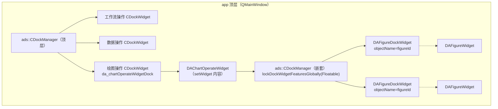

# 绘图窗口停靠布局（ADS 嵌套停靠区）

本文档说明 `DAChartOperateWidget` 的多绘图窗口管理机制：基于 Qt-Advanced-Docking-System（ADS）的 **dockindock 嵌套停靠区**，让每个 `DAFigureWidget` 以独立停靠窗口的形式自由分屏/并栏，同时**严格隔离在 DAChartOperateWidget 内部**。

!!! warning "修改前必读"
    本模块踩过一个隐蔽的 ADS 陷阱（`FocusHighlighting` + 嵌套 `CDockManager` 的焦点控制器跨管理器混淆），曾导致新绘图逃逸到 app 顶层中心区。**修改停靠相关逻辑前务必先阅读 [关键陷阱](#关键陷阱focushighlighting-嵌套管理器的焦点跨管理器混淆) 一节**，避免重蹈覆辙。

## 设计目标

- ✅ **隔离**：`DAFigureDockWidget` 只能在 `DAChartOperateWidget` 内停靠与改变布局，不能逃逸到 app 顶层停靠区，也不能浮成独立窗口
- ✅ **自由布局**：用户可随意分屏、并栏、拖拽每个绘图窗口，实现最大自由度（禁浮动，保留 movable）
- ✅ **默认标签**：新绘图默认以标签形式加入当前所在 dock area（顶部标签，ADS 原生）
- ✅ **持久化**：绘图布局随工程文件保存/恢复；旧工程向后兼容（回退默认标签顺序）

## 架构

`DAChartOperateWidget` 本身是 app 顶层 `ads::CDockManager` 中心区的一个停靠标签页（`da_chartOperateWidgetDock`），其内部再持有一个**嵌套的 `ads::CDockManager`**。每个绘图包成 `DAFigureDockWidget`（纯 `QWidget`）后由 `ads::CDockWidget` 包装，加入这个嵌套管理器。嵌套管理器是一个独立的停靠宇宙——其 dock widget 无法逃逸到 app 顶层管理器。



关键点：

- 顶层 `CDockManager` 与嵌套 `CDockManager` 是**两个独立的停靠容器**（两个 `CDockContainerWidget`），各自管理自己的 dock widget
- `DAFigureDockWidget` 是**纯 `QWidget`**（不继承 `ads::CDockWidget` / `QDockWidget`），由 `ads::CDockWidget` 包装后加入嵌套管理器——遵循 `DAAgentDockWidget` 的项目约定（继承 `QDockWidget`/`ads::CDockWidget` 再交给停靠管理器会出现双标题栏、拖拽冲突）
- 嵌套管理器在构造时调用 `lockDockWidgetFeaturesGlobally(DockWidgetFloatable)`，**全局禁止所有 figure dock 浮动**（`CDockManager.cpp:564` 的 `features()` 会按全局锁掩码，对所有当前及后续 dock 生效），保留 `DockWidgetMovable` 实现分屏/并栏/拖拽

## 关键实现要点

### 1. dock 的 objectName = figureId

```cpp
ads::CDockWidget* dock = new ads::CDockWidget(d_ptr->mDockManager, t);  // 走管理器组件工厂
dock->setObjectName(fig->getFigureId());   // 稳定唯一，restoreState 按此匹配
```

`objectName` 用于 `restoreState` 按 objectName 重新挂接布局。`figureId` 是 `DAFigureWidget` 构造时生成的 UUID（`DAFigureWidget.cpp:80`），稳定且唯一，是布局持久化匹配的依据。**不要**用可变的绘图名称作 objectName（重名会破坏 `dockWidgetsMap`）。

### 2. 默认以标签加入当前 area

```cpp
ads::CDockAreaWidget* area = d_ptr->targetAreaForNewFigure();
if (area) {
    d_ptr->mDockManager->addDockWidgetTabToArea(dock, area);  // 已有 figure：作为标签加入
} else {
    d_ptr->mDockManager->addDockWidget(ads::CenterDockWidgetArea, dock);  // 首个：容器根建 area
}
```

`targetAreaForNewFigure()` 的取值规则见下节陷阱——**绝对不能**用 `focusedDockWidget()`。

### 3. 关闭按钮 → 确认 → 删除

```cpp
dock->setFeature(ads::CDockWidget::CustomCloseHandling, true);  // 关闭按钮只发 closeRequested，不自动隐藏
connect(dock, &ads::CDockWidget::closeRequested, this, [this, fig]() {
    onFigureCloseRequested(fig);  // 弹确认框 → removeFigure(fig, true)
});
```

`CustomCloseHandling`（`DockWidget.h:159`）让关闭按钮触发 `closeRequested()` 信号而非自动隐藏，便于弹确认框后再删除，避免遗留隐藏的 dock。

### 4. 序列化（布局持久化）

`DAChartOperateWidget` 暴露 `saveChartLayout()` / `restoreChartLayout(QByteArray)`，`DAXmlHelper` 在工程序列化时：

- `makeElement`：遍历 `getFigureList()` 写每个 figure 内容，附加 `<chart-layout>` 子元素（`saveChartLayout()` 的 base64）
- `loadElement`：用 figure 的 `id` 属性调 `createFigure(name, id)` 重建（objectName=figureId），全部创建后 `restoreChartLayout()`

!!! note "顶层 saveState 不捕获嵌套管理器"
    ADS 的 `CDockManager::saveState()` 只序列化自身容器，**不递归嵌套管理器**。所以 figure 布局必须由 DAChartOperateWidget 单独保存，不能依赖 app 顶层的 `saveState`。详见 ADS 的 `dockindock` 示例（`examples/dockindock/`）的 `savePerspectivesRec` 递归封装。

!!! warning "加载前必须 clear"
    `DAAppProject::load()` 在加载前调用 `clear()`（`DAAppProject.cpp:612`）。`clear()` 逐个 `removeFigure`（同步从 `dockWidgetsMap` 移除），保证加载时 objectName 从干净状态开始，`restoreState` 才能按 objectName 正确匹配。**改动加载流程时不要省略 clear**。

## 关键陷阱：FocusHighlighting + 嵌套管理器的焦点跨管理器混淆

!!! danger "曾导致绘图逃逸到顶层中心区"
    这是最容易踩的坑。修改 `DAChartOperateWidget` 停靠逻辑前，务必理解本节。

### 现象

开启 `FocusHighlighting` 后，用户点过 app 顶层停靠窗口（如"工作流操作"）后，新增的绘图没有停留在 `DAChartOperateWidget` 内部，而是和"工作流操作/绘图操作/数据操作"并列为**顶层中心区的标签**——逃逸出 DAChartOperateWidget。

### 根因（ADS 源码级）

ADS 的 `CDockFocusController` 把"当前聚焦 dock"存为**窗口级属性** `FocusedDockWidgetProperty`（`DockFocusController.cpp:36/133`），且 `onApplicationFocusChanged`（`DockFocusController.cpp:268-305`）从焦点控件找到所属 `CDockWidget` 后直接 `updateDockWidgetFocus`，**不校验该 dock 是否属于本管理器**：

```cpp
// DockFocusController.cpp:286-304（节选）
CDockWidget* DockWidget = qobject_cast<CDockWidget*>(focusedNow);
if (!DockWidget) DockWidget = internal::findParent<CDockWidget*>(focusedNow);
// ⚠️ 没有 if (DockWidget->dockManager() != d->DockManager) return; 的过滤
d->updateDockWidgetFocus(DockWidget);  // 直接设置本管理器的 FocusedDockWidget
```

后果：app 顶层 `CDockManager` 与 `DAChartOperateWidget` 内的嵌套 `CDockManager` 共享同一个 `QMainWindow`，二者各自创建的 `CDockFocusController` 都监听 `QApplication::focusChanged`。用户聚焦顶层 dock 时，**嵌套管理器的 `focusedDockWidget()` 也会返回那个顶层 dock**。

### 复现证据

最小复现（顶层 `CDockManager` 为 QMainWindow 中央部件 + 嵌套管理器在中心标签页内容里 + `FocusHighlighting` 开）：

```
[after focus wf] nested->focusedDockWidget()=workflow belongsToNested?0
[fig2 OLD] landed: TOP-LEVEL(BLEED!)   # 用 focusedDockWidget 作 target → 逃逸
[fig3 NEW] landed: NESTED               # 用 mFigures 作 target → 留在嵌套区
```

### 修复（当前实现）

两处都避开了会跨管理器混淆的 `focusedDockWidget`：

1. **`targetAreaForNewFigure()` 不用 `focusedDockWidget()`**，改从嵌套管理器自身的 figure 列表（`mFigures`）取 area：

    ```cpp
    // DAChartOperateWidget.cpp
    for (int i = mFigures.size() - 1; i >= 0; --i) {
        if (ads::CDockWidget* d = mFigToDock.value(mFigures.at(i), nullptr)) {
            if (ads::CDockAreaWidget* a = d->dockAreaWidget()) return a;
        }
    }
    return nullptr;  // 首个 figure：容器根
    ```

2. **`onFocusedDockChanged` 按 `dockManager()` 过滤**，丢弃非本管理器的 dock 回调：

    ```cpp
    if (nowDock && nowDock->dockManager() != d_ptr->mDockManager) {
        return;  // 顶层 dock 的跨管理器回调，忽略
    }
    ```

3. `getCurrentFigure()` 回退改为 `mFigures.last()`，不再用会混淆的 `focusedDockWidget`。

## 反模式（不要做）

修改本模块时，以下做法会重新引入逃逸/混淆问题：

- ❌ **用 `nestedManager->focusedDockWidget()` 决定新 dock 的目标 area** —— 焦点控制器跨管理器，会返回顶层 dock，导致新 figure 加到顶层中心区
- ❌ **连接 `ads::CDockManager::focusedDockWidgetChanged` 而不过滤 `dockManager()`** —— 顶层 dock 聚焦时会回调到嵌套管理器，把 `mCurrentFigure` 误置空/误切换，发射错误的 `currentFigureChanged`
- ❌ **让 `DAFigureDockWidget` 继承 `ads::CDockWidget` 或 `QDockWidget`** —— 与项目约定冲突（双标题栏、拖拽冲突，见 `DAAgentDockWidget` 头注释）；应作为纯 `QWidget` 由 `ads::CDockWidget` 包装
- ❌ **用可变的绘图名称作 dock `objectName`** —— 重名会破坏 `dockWidgetsMap` 与 `restoreState` 匹配；必须用稳定的 `figureId`
- ❌ **依赖 app 顶层 `CDockManager::saveState()` 保存 figure 布局** —— 顶层不递归嵌套管理器，必须用 `DAChartOperateWidget::saveChartLayout()` 单独保存
- ❌ **加载工程时省略 `clear()`** —— `dockWidgetsMap` 不干净会导致 `restoreState` 匹配失败

## 涉及文件

| 文件 | 说明 |
|------|------|
| `src/DAGui/Chart/DAChartOperateWidget.h/.cpp` | 嵌套 `CDockManager` 宿主，figure 生命周期/布局/序列化 |
| `src/DAGui/Chart/DAFigureDockWidget.h/.cpp` | figure 的停靠封装层（纯 `QWidget`） |
| `src/DAGui/Chart/DAChartManageWidget.cpp` | 图表管理面板，通过信号观察 `DAChartOperateWidget`（不依赖停靠布局 index） |
| `src/DAGui/DAXmlHelper.cpp` | `makeElement`/`loadElement` 保存/恢复 figure 内容 + `<chart-layout>` 布局 |
| `src/APP/DAAppChartOperateWidget.h/.cpp` | App 特化，`createFigure(name, id)` 转发 id 供反序列化 |
| `src/3rdparty/ADS/` | ADS 4.4.1 源码，`dockindock` 示例位于 `examples/dockindock/` |

## 参考资料

- [绘图模块概述](figure-abstract.md) —— `DAFigureWidget`/`DAChartWidget` 本身（绘图渲染）
- [架构设计](architecture.md) —— 整体停靠与 MVC 结构
- [模块业务逻辑](module-breakdown.md) —— DAGui 中 `DAChartOperateWidget` 的类关系
- ADS 源码：`src/3rdparty/ADS/src/DockFocusController.cpp`、`DockManager.cpp`、`FloatingDragPreview.cpp`
- ADS 嵌套示例：`src/3rdparty/ADS/examples/dockindock/`
