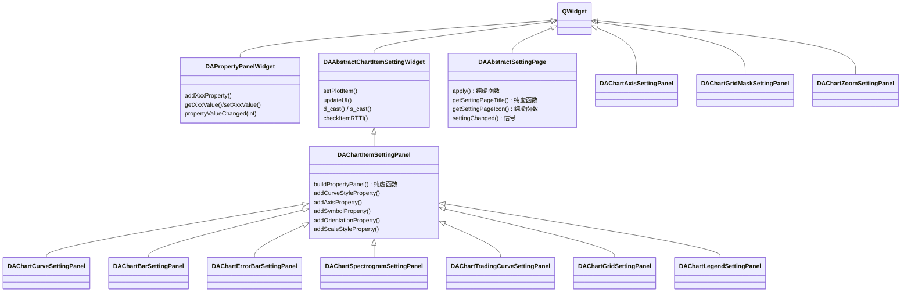

# 创建属性设置面板

本文档讲解如何在 data-workbench 中创建属性设置面板，覆盖图表项级面板、非 Item 级面板、应用级设置页面三类场景。面板的核心构建工具是 `DAPropertyPanelWidget`，它提供了一套 add/set 便捷方法，让你快速搭建属性编辑界面。

## 概述

属性设置面板分布在三个层次：

| 层次 | 模块 | 说明 |
|------|------|------|
| 通用层 | DACommonWidgets | `DAPropertyPanelWidget`、`DAAbstractSettingPage`，提供属性项管理和通用 UI |
| 图表层 | DAGui | `DAChartItemSettingPanel`、`DAAbstractChartItemSettingWidget`，叠加 Qwt 专有方法 |
| 应用层 | APP | 组合使用上述组件，管理具体的面板实例和工厂注册 |

本文聚焦**如何创建面板子类**，不涉及 [设置类窗口规范](settingwidget-standard.md) 中的 6 函数生命周期（setTarget/getTarget/bindTarget/unbindTarget/updateUI/applySetting），那套规范适用于按需应用模式。属性面板采用的是**即时应用模式**，每次属性变化立即写回并刷新图表。

!!! info "超出范围"
    `DACommonPropertySettingDialog` 是另一套基于 JSON 驱动和 QtPropertyBrowser 的属性编辑机制，不在本文讨论范围内。

## 类体系



上图中，`DAChartItemSettingPanel` 持有一个 `DAPropertyPanelWidget`（mPanel），在此基础上叠加了 Qwt 类型专有的 add/get/set 方法。非 Item 级面板（如 `DAChartAxisSettingPanel`）直接继承 QWidget，自行持有 `DAPropertyPanelWidget` 并管理信号链。应用级设置页面继承 `DAAbstractSettingPage`，用于全局偏好配置。

## 三类面板创建指南

=== "ChartItemSettingPanel"

    #### 适用场景

    当你需要为 `QwtPlotItem` 的某种具体类型（如曲线、柱状图、网格）创建属性编辑面板时，继承 `DAChartItemSettingPanel`。基类已经持有 `DAPropertyPanelWidget` 并管理 `propertyValueChanged` 信号转发，你只需实现 `buildPropertyPanel()` 和业务逻辑。

    #### 骨架代码

    ```cpp
    // MyItemSettingPanel.h
    #pragma once
    #include "DAChartItemSettingPanel.h"

    namespace DA {
    class DAGUI_API MyItemSettingPanel : public DAChartItemSettingPanel
    {
        Q_OBJECT
    public:
        enum PropertyID {
            PID_Title = 1,
            PID_ZValue = 2,
            PID_CustomStyle = 3
        };
        explicit MyItemSettingPanel(QWidget* parent = nullptr);
        ~MyItemSettingPanel() override;
        void updateUI(QwtPlotItem* item) override;
    private:
        void buildPropertyPanel() override;
    private Q_SLOTS:
        void onMyPropertyValueChanged(int propertyId);
    };
    } // namespace DA
    ```

    ```cpp
    // MyItemSettingPanel.cpp
    #include "MyItemSettingPanel.h"
    #include "DAPropertyPanelWidget.h"
    #include <QSignalBlocker>

    namespace DA {
    MyItemSettingPanel::MyItemSettingPanel(QWidget* parent)
        : DAChartItemSettingPanel(parent)
    {
        connect(this, &DAChartItemSettingPanel::propertyValueChanged,
                this, &MyItemSettingPanel::onMyPropertyValueChanged);
        buildPropertyPanel();  // 纯虚函数，子类构造函数末尾自行调用
    }

    void MyItemSettingPanel::buildPropertyPanel()
    {
        DAPropertyPanelWidget* pp = propertyPanel();
        pp->addGroupLabel(tr("General"));
        pp->addStringProperty(PID_Title, tr("Title"));
        pp->addDoubleProperty(PID_ZValue, tr("Z Value"), 0.0, -9999.0, 9999.0, 1);
        pp->addGroupLabel(tr("Custom"));
        addCurveStyleProperty(PID_CustomStyle, tr("Style"));
    }

    void MyItemSettingPanel::updateUI(QwtPlotItem* item)
    {
        DAAbstractChartItemSettingWidget_ReturnWhenItemNull;
        if (!checkItemRTTI(QwtPlotItem::Rtti_PlotCurve)) return;
        auto* obj = d_cast<QwtPlotCurve*>();
        if (!obj) return;
        DAChartItemSettingPanel::updateUI(item);  // 先调基类
        QSignalBlocker blocker(propertyPanel());
        propertyPanel()->setStringValue(PID_Title, obj->title().text());
        propertyPanel()->setDoubleValue(PID_ZValue, obj->z());
        setCurveStyleValue(PID_CustomStyle, obj->style());
    }

    void MyItemSettingPanel::onMyPropertyValueChanged(int propertyId)
    {
        DAAbstractChartItemSettingWidget_ReturnWhenItemNull;
        if (!checkItemRTTI(QwtPlotItem::Rtti_PlotCurve)) return;
        auto* obj = d_cast<QwtPlotCurve*>();
        if (!obj) return;
        switch (propertyId) {
        case PID_Title: obj->setTitle(propertyPanel()->getStringValue(PID_Title)); break;
        case PID_ZValue: obj->setZ(propertyPanel()->getDoubleValue(PID_ZValue)); break;
        case PID_CustomStyle: obj->setStyle(getCurveStyleValue(PID_CustomStyle)); break;
        default: break;
        }
        replot();
    }
    } // namespace DA
    ```

    !!! warning "buildPropertyPanel() 调用约定"
        `DAChartItemSettingPanel::buildPropertyPanel()` 是**纯虚函数**，基类构造函数不会调用它。你必须在子类构造函数末尾自行调用 `buildPropertyPanel()`，否则面板为空。

    #### 关键模式

    **buildPropertyPanel 模式**：获取 `propertyPanel()` 指针，按分区调用 `addGroupLabel()` → `addXxxProperty()` → 基类 Qwt 专有方法。

    **updateUI 模式**：`QSignalBlocker` 全局 block → `checkItemRTTI` 类型检查 → `d_cast` 安全转换 → 逐项 `setXxxValue`。

    **onPropertyValueChanged 模式**：`ReturnWhenItemNull` 宏 → `checkItemRTTI` → `d_cast` → `switch(propertyId)` 逐项写回 → `replot()`。

    #### 工厂注册

    新面板需要在 `DAChartItemSettingPanelFactory` 中注册，才能通过 RTTI 自动创建：

    ```cpp
    DAChartItemSettingPanelFactory::instance().registerPanel(
        QwtPlotItem::Rtti_PlotCurve,
        []() { return new DAChartCurveSettingPanel(); }
    );
    ```

    内置面板在 `registerAllKnownPanels()` 中集中注册。自定义面板可在插件初始化时单独调用 `registerPanel()`。

=== "非Item级面板"

    #### 适用场景

    当编辑目标不是 `QwtPlotItem`（如坐标轴 `QwtScaleWidget`、网格遮罩区域、缩放偏好）时，直接继承 QWidget，自行持有 `DAPropertyPanelWidget` 并构建信号链。这类面板不参与工厂机制。

    #### 骨架代码

    ```cpp
    // MyNonItemSettingPanel.h
    #pragma once
    #include <QWidget>
    #include <QPointer>
    #include "qwt_axis.h"

    namespace DA {
    class DAPropertyPanelWidget;
    class DAGUI_API MyNonItemSettingPanel : public QWidget
    {
        Q_OBJECT
    public:
        enum PropertyID { PID_Enable = 1, PID_Label = 2, PID_Margin = 3 };
        explicit MyNonItemSettingPanel(QwtAxis::Position axisId, QWidget* parent = nullptr);
        ~MyNonItemSettingPanel() override;
        DAPropertyPanelWidget* propertyPanel() const;
        void setTarget(QwtPlot* plot);
        QwtPlot* target() const;
        void updateUI();
        void replot();
    Q_SIGNALS:
        void propertyValueChanged(int propertyId);
    protected Q_SLOTS:
        void buildPropertyPanel();
        void onPanelPropertyValueChanged(int propertyId);
        void onPropertyValueChanged(int propertyId);
    private:
        DAPropertyPanelWidget* mPanel;
        QPointer<QwtPlot> mPlot;
        QwtAxis::Position mAxisId;
    };
    } // namespace DA
    ```

    ```cpp
    // MyNonItemSettingPanel.cpp
    #include "MyNonItemSettingPanel.h"
    #include "DAPropertyPanelWidget.h"
    #include <QVBoxLayout>
    #include <QSignalBlocker>

    namespace DA {
    MyNonItemSettingPanel::MyNonItemSettingPanel(QwtAxis::Position axisId, QWidget* parent)
        : QWidget(parent), mPanel(nullptr), mPlot(nullptr), mAxisId(axisId)
    {
        mPanel = new DAPropertyPanelWidget(this);
        auto* layout = new QVBoxLayout(this);
        layout->setContentsMargins(0, 0, 0, 0);
        layout->addWidget(mPanel);
        setLayout(layout);
        // 3-hop信号链：详见下文说明
        connect(mPanel, &DAPropertyPanelWidget::propertyValueChanged,
                this, &MyNonItemSettingPanel::onPanelPropertyValueChanged);
        connect(this, &MyNonItemSettingPanel::propertyValueChanged,
                this, &MyNonItemSettingPanel::onPropertyValueChanged);
        buildPropertyPanel();  // protected slot，构造函数中直接调用
    }

    void MyNonItemSettingPanel::buildPropertyPanel()
    {
        auto* pp = propertyPanel();
        pp->addGroupLabel(tr("Enable"));
        pp->addBoolProperty(PID_Enable, tr("Enable"));
        pp->addGroupLabel(tr("Label"));
        pp->addStringProperty(PID_Label, tr("Label Text"));
        pp->addIntProperty(PID_Margin, tr("Margin"), 0, -20, 100);
    }

    void MyNonItemSettingPanel::onPanelPropertyValueChanged(int propertyId)
    {
        emit propertyValueChanged(propertyId);
    }

    void MyNonItemSettingPanel::onPropertyValueChanged(int propertyId)
    {
        if (!mPlot) return;
        auto* pp = propertyPanel();
        switch (propertyId) {
        case PID_Enable: mPlot->enableAxis(mAxisId, pp->getBoolValue(PID_Enable)); break;
        case PID_Label: { /* 写回 */ break; }
        case PID_Margin: { /* 写回 */ break; }
        default: break;
        }
        replot();
    }
    } // namespace DA
    ```

    !!! warning "buildPropertyPanel() 调用约定"
        非 Item 级面板的 `buildPropertyPanel()` 是 **protected slot**，不是纯虚函数。基类构造函数中直接调用。如果你忘了在构造函数中调用它，面板同样为空，但不像 ChartItem 面板那样编译器不会提醒你。

    !!! danger "信号链必连"
        构造函数中必须连接 `this->propertyValueChanged → this->onPropertyValueChanged`。漏掉这条连接会导致属性变化不写回目标，这是已确认的 P0 级 Bug。

    #### 3-hop 信号链

    非 Item 级面板的属性变化经过三步传递：

    ```
    mPanel→propertyValueChanged  ──①──→  onPanelPropertyValueChanged  ──emit──→
    this→propertyValueChanged    ──②──→  onPropertyValueChanged  ──③──→  写回目标 + replot()
    ```

    ① `DAPropertyPanelWidget` 发出原始信号 → ② `onPanelPropertyValueChanged` 转发为 `this->propertyValueChanged` → ③ `onPropertyValueChanged` 执行业务逻辑（写回 + replot）。

    为什么需要两段？`mPanel` 的信号是内部机制信号，`this` 的信号是外部接口信号。中间转发让外层容器也能监听 `propertyValueChanged`，而内部处理逻辑在 `onPropertyValueChanged` 中统一管理。

    #### 构造函数参数

    某些非 Item 面板需要构造参数。例如 `DAChartAxisSettingPanel` 需要 `QwtAxis::Position axisId` 来标识编辑哪条坐标轴。这个参数在构造时固定，不可后续更改。

=== "应用级设置页面"

    #### 适用场景

    全局偏好配置（如语言、主题、默认路径）使用 `DAAbstractSettingPage`。这些页面被 `DASettingWidget` 管理，用户点击"应用"或"确定"时统一调用 `apply()`。

    #### 骨架代码

    ```cpp
    // MySettingPage.h
    #pragma once
    #include "DAAbstractSettingPage.h"
    #include "DAPropertyPanelWidget.h"

    namespace DA {
    class MySettingPage : public DAAbstractSettingPage
    {
        Q_OBJECT
    public:
        explicit MySettingPage(QWidget* parent = nullptr);
        void apply() override;
        QString getSettingPageTitle() const override;
        QIcon getSettingPageIcon() const override;
    private Q_SLOTS:
        void onPanelValueChanged(int propertyId);
    private:
        DAPropertyPanelWidget* mPanel;
    };
    } // namespace DA
    ```

    ```cpp
    // MySettingPage.cpp
    #include "MySettingPage.h"
    #include <QVBoxLayout>

    namespace DA {
    MySettingPage::MySettingPage(QWidget* parent)
        : DAAbstractSettingPage(parent)
    {
        mPanel = new DAPropertyPanelWidget(this);
        auto* layout = new QVBoxLayout(this);
        layout->setContentsMargins(0, 0, 0, 0);
        layout->addWidget(mPanel);
        // UI变化时通知外层标记dirty
        connect(mPanel, &DAPropertyPanelWidget::propertyValueChanged,
                this, [this]() { emit settingChanged(); });
    }

    QString MySettingPage::getSettingPageTitle() const { return tr("My Config"); }
    QIcon MySettingPage::getSettingPageIcon() const { return QIcon(); }

    void MySettingPage::apply()
    {
        // 将面板值持久化到配置文件或全局状态
    }
    } // namespace DA
    ```

    应用级页面通过 `emit settingChanged()` 标记自己为 dirty。只有在 dirty 状态下，`DASettingWidget` 才会在用户点击"确定"或"应用"时调用 `apply()`。如果页面从未发出 `settingChanged`，`apply()` 不会被调用。

## 关键差异对比表

| 对比项 | ChartItemSettingPanel | 非Item级面板 | 应用级设置页面 |
|--------|----------------------|-------------|--------------|
| `buildPropertyPanel()` | 纯虚函数，子类ctor末尾自行调用 | protected slot，ctor中直接调用 | 无此方法 |
| 属性变化应用方式 | 即时写回 + replot() | 即时写回 + replot() | apply() 按需调用 |
| 信号链 | 2-hop（mPanel→转发→子类slot） | 3-hop（mPanel→转发→emit→自身slot） | 1-hop（mPanel→settingChanged） |
| 目标管理 | setPlotItem() + QwtPlotItem* | 自行管理（如 setTarget(QwtPlot*)） | 无目标，持久化到配置 |
| 注册机制 | DAChartItemSettingPanelFactory | 手动创建实例 | DASettingWidget 管理 |
| 基类 | DAAbstractChartItemSettingWidget | QWidget | DAAbstractSettingPage |
| 构造参数 | QWidget* parent only | 可能需要额外参数（如 axisId） | QWidget* parent only |

## PropertyId 枚举约定

每个面板子类定义自己的 `PropertyID` 枚举，ID 从 **1** 开始递增。0 由 `DAPropertyPanelWidget` 内部保留（自动分配 ID 的场景）。

```cpp
enum PropertyID {
    PID_Title = 1,   // 第一个属性
    PID_ZValue = 2,  // 第二个属性
    PID_CurveStyle = 3,
    // ...
};
```

这些 ID 在两个地方使用：

1. `addXxxProperty(PID_Xxx, ...)` 注册属性项
2. `onPropertyValueChanged(int propertyId)` 的 `switch` 分支分发

!!! warning "不要用裸 int"
    使用枚举值而非裸 int 作为 propertyId。裸 int 缺乏语义，容易在 switch 中写错分支，且无法利用编译器检查重复值。

## DAPropertyPanelWidget 便捷方法速查

### addXxxProperty 方法

| 方法 | 参数 | 编辑器控件 | 说明 |
|------|------|-----------|------|
| `addStringProperty(id, name)` | id, 名称 | QLineEdit | 文本输入 |
| `addBoolProperty(id, name)` | id, 名称 | QCheckBox | 开关选择 |
| `addIntProperty(id, name, val, min, max)` | id, 名称, 默认值, 范围 | QSpinBox | 整数输入 |
| `addDoubleProperty(id, name, val, min, max, dec)` | id, 名称, 默认值, 范围, 精度 | QDoubleSpinBox | 浮点输入 |
| `addColorProperty(id, name)` | id, 名称 | DAColorPickerButton | 颜色选择 |
| `addFontProperty(id, name)` | id, 名称 | QFontComboBox + 按钮 | 字体选择 |
| `addPenProperty(id, name)` | id, 名称 | DAPenEditWidget | 画笔编辑 |
| `addBrushProperty(id, name)` | id, 名称 | DABrushEditWidget | 画刷编辑 |
| `addEnumProperty(id, name, items, dataValues, idx)` | id, 名称, 选项列表, 数据值列表, 默认索引 | QComboBox | 枚举下拉 |
| `addAlignmentProperty(id, name)` | id, 名称 | 对齐选择控件 | Qt::Alignment |
| `addAlignmentPositionProperty(id, name)` | id, 名称 | 位置对齐控件 | 对齐位置 |
| `addFilePathProperty(id, name, filter)` | id, 名称, 文件过滤器 | 文件路径选择 | 文件路径 |

所有 `addXxxProperty` 都有无需 id 的重载版本（如 `addStringProperty(name)`），此时面板自动分配 ID。但在属性面板中推荐使用带枚举 id 的版本，方便后续 `switch` 分发。

### getXxxValue / setXxxValue 方法

| get 方法 | set 方法 | 返回/参数类型 |
|----------|----------|-------------|
| `getStringValue(id)` | `setStringValue(id, QString)` | QString |
| `getBoolValue(id)` | `setBoolValue(id, bool)` | bool |
| `getIntValue(id)` | `setIntValue(id, int)` | int |
| `getDoubleValue(id)` | `setDoubleValue(id, double)` | double |
| `getColorValue(id)` | `setColorValue(id, QColor)` | QColor |
| `getFontValue(id)` | `setFontValue(id, QFont)` | QFont |
| `getPenValue(id)` | `setPenValue(id, QPen)` | QPen |
| `getBrushValue(id)` | `setBrushValue(id, QBrush)` | QBrush |
| `getEnumValue(id)` | `setEnumValue(id, int)` | int（下拉框索引） |
| `getAlignmentValue(id)` | `setAlignmentValue(id, Qt::Alignment)` | Qt::Alignment |
| `getAlignmentPositionValue(id)` | `setAlignmentPositionValue(id, Qt::Alignment)` | Qt::Alignment |
| `getFilePathValue(id)` | `setFilePathValue(id, QString)` | QString |

### DAChartItemSettingPanel Qwt 专有方法

| 方法 | 说明 |
|------|------|
| `addCurveStyleProperty(id, name)` | 添加曲线样式（Lines/Sticks/Steps/Dots/NoCurve） |
| `addOrientationProperty(id, name)` | 添加方向属性（Horizontal/Vertical RadioButton） |
| `addAxisProperty(id, name, isYAxis)` | 添加坐标轴属性（ComboBox，Y轴或X轴） |
| `addSymbolProperty(id, name)` | 添加标记属性（DAChartSymbolEditWidget，BelowLayout） |
| `addScaleStyleProperty(id, name)` | 添加刻度样式（Normal/DateTime RadioButton） |
| `getCurveStyleValue(id)` / `setCurveStyleValue(id, style)` | QwtPlotCurve::CurveStyle |
| `getOrientationValue(id)` / `setOrientationValue(id, orientation)` | Qt::Orientation |
| `getAxisValue(id)` / `setAxisValue(id, axisId)` | QwtAxis::Position |
| `getSymbolWidget(id)` | 获取 DAChartSymbolEditWidget* |
| `getScaleStyleValue(id)` / `setScaleStyleValue(id, style)` | int（NormalScale/DateTimeScale） |

### 分组与分隔工具

| 方法 | 说明 |
|------|------|
| `addGroupLabel(text)` | 添加分组标题标签 |
| `addSeparator()` | 添加水平分隔线 |
| `addSpacer(height)` | 添加空白间距（默认 8px） |
| `setPropertyVisible(id, visible)` | 控制属性项可见性 |
| `setPropertyEnabled(id, enabled)` | 控制属性项启用/禁用 |

## 即时应用 vs 按需应用

属性面板采用**即时应用模式**：

```
用户修改 → propertyValueChanged → switch分发 → 写回目标对象 → replot()
```

每次属性变化都立即写回目标并刷新图表，用户所见即所得。这与 [设置类窗口规范](settingwidget-standard.md) 中的**按需应用模式**不同：

```
用户修改 → 标记dirty → 用户点击"应用" → applySetting() → 批量写回
```

两种模式的区别：

| 模式 | 适用场景 | 用户体验 | 实现方式 |
|------|---------|---------|---------|
| 即时应用 | 图表属性（颜色、线宽等） | 实时预览效果 | onPropertyValueChanged + replot() |
| 按需应用 | 全局偏好、不可逆操作 | 有"确认"缓冲 | settingChanged → apply() |

!!! tip "何时用哪种模式"
    图表可视化属性用即时应用（用户需要实时看到效果变化），全局配置用按需应用（需要确认后才生效）。`DAAbstractSettingPage` 的 `apply()` 就是按需应用的入口。

## 参考文件索引

| 文件路径 | 功能说明 |
|---------|---------|
| `src/DACommonWidgets/DAPropertyPanelWidget.h` | 属性面板核心控件，所有 add/set 便捷方法 |
| `src/DACommonWidgets/DAAbstractSettingPage.h` | 应用级设置页面基类 |
| `src/DAGui/ChartSetting/DAAbstractChartItemSettingWidget.h` | 图表项设置基类，d_cast/s_cast/ReturnWhenItemNull |
| `src/DAGui/ChartSetting/DAChartItemSettingPanel.h` | ChartItem 面板基类，Qwt 专有方法，纯虚 buildPropertyPanel |
| `src/DAGui/ChartSetting/DAChartItemSettingPanel.cpp` | ChartItem 面板基类实现 |
| `src/DAGui/ChartSetting/DAChartCurveSettingPanel.h/.cpp` | 曲线面板完整示例 |
| `src/DAGui/ChartSetting/DAChartAxisSettingPanel.h/.cpp` | 非 Item 面板完整示例（3-hop 信号链） |
| `src/DAGui/ChartSetting/DAChartItemSettingPanelFactory.h/.cpp` | 工厂类，RTTI 注册与创建 |
| `docs/zh/dev-guide/settingwidget-standard.md` | 设置类窗口规范（6 函数生命周期） |