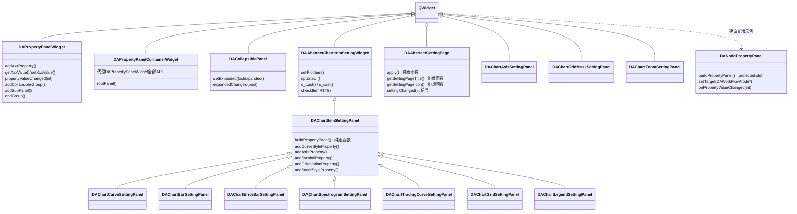

# 创建属性设置面板

本文档讲解如何在 data-workbench 中基于 `DAPropertyPanelWidget` 创建属性设置面板，适用于任何需要属性编辑的场景（图表、工作流节点、数据过滤器等）。面板的核心构建工具是 `DAPropertyPanelWidget`，它提供了一套 add/set 便捷方法，让你快速搭建属性编辑界面。

## 概述

属性设置面板分布在三个层次：

| 层次 | 模块 | 说明 |
|------|------|------|
| 通用层 | DACommonWidgets | `DAPropertyPanelWidget`、`DAPropertyPanelContainerWidget`、`DACollapsiblePanel`、`DAAbstractSettingPage`，提供属性项管理、分组折叠和通用 UI |
| 图表层 | DAGui | `DAChartItemSettingPanel`、`DAAbstractChartItemSettingWidget`，叠加 Qwt 专有方法 |
| 应用层 | APP | 组合使用上述组件，管理具体的面板实例和工厂注册 |

本文聚焦**如何创建面板子类**，不涉及 [设置类窗口规范](settingwidget-standard.md) 中的 6 函数生命周期（setTarget/getTarget/bindTarget/unbindTarget/updateUI/applySetting），那套规范适用于按需应用模式。属性面板采用的是**即时应用模式**，每次属性变化立即写回并刷新目标对象。

!!! info "超出范围"
    `DACommonPropertySettingDialog` 是另一套基于 JSON 驱动和 QtPropertyBrowser 的属性编辑机制，不在本文讨论范围内。

## 类体系



上图中，`DAChartItemSettingPanel` 持有一个 `DAPropertyPanelContainerWidget`（它内部封装了 `DAPropertyPanelWidget` 和 `QScrollArea`），在此基础上叠加了 Qwt 类型专有的 add/get/set 方法。独立属性面板（如 `DAChartAxisSettingPanel`，以及建议新增的 `DANodePropertyPanel`）直接继承 QWidget，自行持有 `DAPropertyPanelWidget` 或 `DAPropertyPanelContainerWidget` 并管理信号链。`DACollapsiblePanel` 是轻量级折叠容器，由 `DAPropertyPanelWidget` 的 `addCollapsibleGroup()` 内部创建。应用级设置页面继承 `DAAbstractSettingPage`，用于全局偏好配置。

!!! note "DANodePropertyPanel 是建议新增示例"
    `DANodePropertyPanel` 在当前代码库中并不存在。工作流节点设置目前使用 `DANodeSettingWidget`（PIMPL + QWidget 组合，不基于 `DAPropertyPanelWidget`）。这里将其作为示范，展示如何为非图表目标创建独立属性面板。

## 三类面板创建指南

=== "ChartItem面板（绘图示例）"

    #### 适用场景

    当你需要为 `QwtPlotItem` 的某种具体类型（如曲线、柱状图、网格）创建属性编辑面板时，继承 `DAChartItemSettingPanel`。基类已经持有 `DAPropertyPanelWidget` 并管理 `propertyValueChanged` 信号转发，你只需实现 `buildPropertyPanel()` 和业务逻辑。

    !!! note "绘图域示例"
        以下骨架代码是图表域的典型用法。同样的模式适用于任何 `QwtPlotItem` 目标类型，不限于曲线。

    #### 骨架代码

    ```cpp
    // MyItemSettingPanel.h
    #pragma once
    #include "DAChartItemSettingPanel.h"

    namespace DA {
    class DAGUI_API MyItemSettingPanel : public DAChartItemSettingPanel
    {
        Q_OBJECT
    public:
        enum PropertyID {
            PID_Title = 1,
            PID_ZValue = 2,
            PID_CustomStyle = 3
        };
        explicit MyItemSettingPanel(QWidget* parent = nullptr);
        ~MyItemSettingPanel() override;
        void updateUI(QwtPlotItem* item) override;
    private:
        void buildPropertyPanel() override;
    private Q_SLOTS:
        void onMyPropertyValueChanged(int propertyId);
    };
    } // namespace DA
    ```

    ```cpp
    // MyItemSettingPanel.cpp
    #include "MyItemSettingPanel.h"
    #include "DAPropertyPanelWidget.h"
    #include <QSignalBlocker>

    namespace DA {
    MyItemSettingPanel::MyItemSettingPanel(QWidget* parent)
        : DAChartItemSettingPanel(parent)
    {
        connect(this, &DAChartItemSettingPanel::propertyValueChanged,
                this, &MyItemSettingPanel::onMyPropertyValueChanged);
        buildPropertyPanel();  // 纯虚函数，子类构造函数末尾自行调用
    }

    void MyItemSettingPanel::buildPropertyPanel()
    {
        DAPropertyPanelContainerWidget* pp = propertyPanel();
        pp->addCollapsibleGroup(tr("General"));
        pp->addStringProperty(PID_Title, tr("Title"));
        pp->addDoubleProperty(PID_ZValue, tr("Z Value"), 0.0, -9999.0, 9999.0, 1);
        pp->endGroup();
        pp->addCollapsibleGroup(tr("Custom"));
        addCurveStyleProperty(PID_CustomStyle, tr("Style"));
        pp->endGroup();
    }

    void MyItemSettingPanel::updateUI(QwtPlotItem* item)
    {
        DAAbstractChartItemSettingWidget_ReturnWhenItemNull;
        if (!checkItemRTTI(QwtPlotItem::Rtti_PlotCurve)) return;
        auto* obj = d_cast<QwtPlotCurve*>();
        if (!obj) return;
        DAChartItemSettingPanel::updateUI(item);  // 先调基类
        QSignalBlocker blocker(propertyPanel());
        propertyPanel()->setStringValue(PID_Title, obj->title().text());
        propertyPanel()->setDoubleValue(PID_ZValue, obj->z());
        setCurveStyleValue(PID_CustomStyle, obj->style());
    }

    void MyItemSettingPanel::onMyPropertyValueChanged(int propertyId)
    {
        DAAbstractChartItemSettingWidget_ReturnWhenItemNull;
        if (!checkItemRTTI(QwtPlotItem::Rtti_PlotCurve)) return;
        auto* obj = d_cast<QwtPlotCurve*>();
        if (!obj) return;
        switch (propertyId) {
        case PID_Title: obj->setTitle(propertyPanel()->getStringValue(PID_Title)); break;
        case PID_ZValue: obj->setZ(propertyPanel()->getDoubleValue(PID_ZValue)); break;
        case PID_CustomStyle: obj->setStyle(getCurveStyleValue(PID_CustomStyle)); break;
        default: break;
        }
        replot();
    }
    } // namespace DA
    ```

    !!! warning "buildPropertyPanel() 调用约定"
        `DAChartItemSettingPanel::buildPropertyPanel()` 是**纯虚函数**，基类构造函数不会调用它。你必须在子类构造函数末尾自行调用 `buildPropertyPanel()`，否则面板为空。

    #### 关键模式

    **buildPropertyPanel 模式**：获取 `propertyPanel()` 指针，按分区调用 `addCollapsibleGroup()` → `addXxxProperty()` → `endGroup()` → 基类 Qwt 专有方法。每个可折叠分组形成一个独立的 `DACollapsiblePanel`，后续属性自动归入当前分组。

    **updateUI 模式**：`QSignalBlocker` 全局 block → `checkItemRTTI` 类型检查 → `d_cast` 安全转换 → 逐项 `setXxxValue`。

    **onPropertyValueChanged 模式**：`ReturnWhenItemNull` 宏 → `checkItemRTTI` → `d_cast` → `switch(propertyId)` 逐项写回 → `replot()`。

    #### 工厂注册

    新面板需要在 `DAChartItemSettingPanelFactory` 中注册，才能通过 RTTI 自动创建：

    ```cpp
    DAChartItemSettingPanelFactory::instance().registerPanel(
        QwtPlotItem::Rtti_PlotCurve,
        []() { return new DAChartCurveSettingPanel(); }
    );
    ```

    内置面板在 `registerAllKnownPanels()` 中集中注册。自定义面板可在插件初始化时单独调用 `registerPanel()`。

=== "独立属性面板（Standalone Panel）"

    #### 适用场景

    适用于任何非 `QwtPlotItem` 目标对象（工作流节点、数据过滤器、一维仿真参数等），以下以工作流节点属性为例。这类面板直接继承 QWidget，自行持有 `DAPropertyPanelWidget` 并构建信号链，不参与工厂机制。

    #### 骨架代码

    ```cpp
    // DANodePropertyPanel.h
    #pragma once
    #include <QWidget>
    #include <QPointer>

    namespace DA {
    class DAPropertyPanelWidget;
    class DAWorkFlowNode;

    class DANodePropertyPanel : public QWidget
    {
        Q_OBJECT
    public:
        enum PropertyID { PID_Name = 1, PID_Color = 2 };
        explicit DANodePropertyPanel(QWidget* parent = nullptr);
        ~DANodePropertyPanel() override;

        DAPropertyPanelWidget* propertyPanel() const;

        // 目标管理
        void setTarget(DAWorkFlowNode* node);
        DAWorkFlowNode* target() const;
        void updateUI();

    Q_SIGNALS:
        void propertyValueChanged(int propertyId);
        void nodeChanged();  // 非绘图目标的通知信号

    protected Q_SLOTS:
        void buildPropertyPanel();
        void onPanelPropertyValueChanged(int propertyId);
        void onPropertyValueChanged(int propertyId);

    private:
        DAPropertyPanelWidget* mPanel;
        QPointer<DAWorkFlowNode> mNode;
    };
    } // namespace DA
    ```

    ```cpp
    // DANodePropertyPanel.cpp
    #include "DANodePropertyPanel.h"
    #include "DAPropertyPanelWidget.h"
    #include "DAWorkFlowNode.h"
    #include <QVBoxLayout>
    #include <QSignalBlocker>

    namespace DA {
    DANodePropertyPanel::DANodePropertyPanel(QWidget* parent)
        : QWidget(parent), mPanel(nullptr), mNode(nullptr)
    {
        mPanel = new DAPropertyPanelWidget(this);
        auto* layout = new QVBoxLayout(this);
        layout->setContentsMargins(0, 0, 0, 0);
        layout->addWidget(mPanel);
        setLayout(layout);

        // 3-hop信号链：详见下文说明
        connect(mPanel, &DAPropertyPanelWidget::propertyValueChanged,
                this, &DANodePropertyPanel::onPanelPropertyValueChanged);
        // P0: 此连接不可省略
        connect(this, &DANodePropertyPanel::propertyValueChanged,
                this, &DANodePropertyPanel::onPropertyValueChanged);
        buildPropertyPanel();  // protected slot，构造函数中直接调用
    }

    void DANodePropertyPanel::buildPropertyPanel()
    {
        auto* pp = propertyPanel();
        int groupId = pp->addCollapsibleGroup(tr("Node Info"));
        pp->addStringProperty(PID_Name, tr("Name"));
        pp->addColorProperty(PID_Color, tr("Color"));
        pp->endGroup();
    }

    void DANodePropertyPanel::setTarget(DAWorkFlowNode* node)
    {
        if (mNode == node) return;
        mNode = node;
        updateUI();
    }

    DAWorkFlowNode* DANodePropertyPanel::target() const
    {
        return mNode.data();
    }

    void DANodePropertyPanel::updateUI()
    {
        if (!mNode) return;
        QSignalBlocker blocker(mPanel);
        mPanel->setStringValue(PID_Name, mNode->getName());
        mPanel->setColorValue(PID_Color, mNode->getColor());
    }

    void DANodePropertyPanel::onPanelPropertyValueChanged(int propertyId)
    {
        emit propertyValueChanged(propertyId);
    }

    void DANodePropertyPanel::onPropertyValueChanged(int propertyId)
    {
        if (!mNode) return;
        auto* pp = propertyPanel();
        switch (propertyId) {
        case PID_Name: mNode->setName(pp->getStringValue(PID_Name)); break;
        case PID_Color: mNode->setColor(pp->getColorValue(PID_Color)); break;
        default: break;
        }
        // 非绘图目标不调用replot()，而是调用自己的刷新/通知机制
        emit nodeChanged();
    }
    } // namespace DA
    ```

    !!! warning "buildPropertyPanel() 调用约定"
        独立属性面板的 `buildPropertyPanel()` 是 **protected slot**，不是纯虚函数。构造函数中直接调用。如果你忘了在构造函数中调用它，面板同样为空，但不像 ChartItem 面板那样编译器不会提醒你。

!!! info "信号冒泡转发机制"
    当使用 `addSubPanel()` 创建嵌套子面板时，子面板的 `propertyValueChanged` 信号会自动转发（冒泡）到父面板。这意味着无论属性项位于根面板还是嵌套子面板中，`propertyValueChanged` 信号始终从根面板发出，外部监听者无需关心属性的嵌套层级。这条规则同样适用于 `addCollapsibleGroup()` 创建的分组面板：分组内的属性变化通过分组面板冒泡到根面板，再从根面板发出。

!!! danger "信号链必连（P0 级 Bug）"
    构造函数中必须连接 `this->propertyValueChanged → this->onPropertyValueChanged`。漏掉这条连接会导致属性变化不写回目标，这是已确认的 P0 级 Bug。

!!! info "非绘图目标的刷新方式"
        非 `QwtPlotItem` 目标不调用 `replot()`。属性写回后，通过自己的刷新或通知机制触发更新，例如 `emit nodeChanged()` 通知外部监听者，或 `target->refresh()` 让目标对象自行刷新。具体方式取决于目标对象的接口设计。

    #### 3-hop 信号链

    独立属性面板的属性变化经过三步传递：

    ```
    mPanel→propertyValueChanged  ──①──→  onPanelPropertyValueChanged  ──emit──→
    this→propertyValueChanged    ──②──→  onPropertyValueChanged  ──③──→  写回目标 + emit nodeChanged()
    ```

    ① `DAPropertyPanelWidget` 发出原始信号 → ② `onPanelPropertyValueChanged` 转发为 `this->propertyValueChanged` → ③ `onPropertyValueChanged` 执行业务逻辑（写回 + 通知刷新）。

    为什么需要两段？`mPanel` 的信号是内部机制信号，`this` 的信号是外部接口信号。中间转发让外层容器也能监听 `propertyValueChanged`，而内部处理逻辑在 `onPropertyValueChanged` 中统一管理。

    #### 构造函数参数

    某些独立面板需要构造参数。例如 `DAChartAxisSettingPanel` 需要 `QwtAxis::Position axisId` 来标识编辑哪条坐标轴。这个参数在构造时固定，不可后续更改。

=== "应用级设置页面"

    #### 适用场景

    全局偏好配置（如语言、主题、默认路径）使用 `DAAbstractSettingPage`。这些页面被 `DASettingWidget` 管理，用户点击"应用"或"确定"时统一调用 `apply()`。

    #### 骨架代码

    ```cpp
    // MySettingPage.h
    #pragma once
    #include "DAAbstractSettingPage.h"
    #include "DAPropertyPanelWidget.h"

    namespace DA {
    class MySettingPage : public DAAbstractSettingPage
    {
        Q_OBJECT
    public:
        explicit MySettingPage(QWidget* parent = nullptr);
        void apply() override;
        QString getSettingPageTitle() const override;
        QIcon getSettingPageIcon() const override;
    private Q_SLOTS:
        void onPanelValueChanged(int propertyId);
    private:
        DAPropertyPanelWidget* mPanel;
    };
    } // namespace DA
    ```

    ```cpp
    // MySettingPage.cpp
    #include "MySettingPage.h"
    #include <QVBoxLayout>

    namespace DA {
    MySettingPage::MySettingPage(QWidget* parent)
        : DAAbstractSettingPage(parent)
    {
        mPanel = new DAPropertyPanelWidget(this);
        auto* layout = new QVBoxLayout(this);
        layout->setContentsMargins(0, 0, 0, 0);
        layout->addWidget(mPanel);
        // UI变化时通知外层标记dirty
        connect(mPanel, &DAPropertyPanelWidget::propertyValueChanged,
                this, [this]() { emit settingChanged(); });
    }

    QString MySettingPage::getSettingPageTitle() const { return tr("My Config"); }
    QIcon MySettingPage::getSettingPageIcon() const { return QIcon(); }

    void MySettingPage::apply()
    {
        // 将面板值持久化到配置文件或全局状态
    }
    } // namespace DA
    ```

    应用级页面通过 `emit settingChanged()` 标记自己为 dirty。只有在 dirty 状态下，`DASettingWidget` 才会在用户点击"确定"或"应用"时调用 `apply()`。如果页面从未发出 `settingChanged`，`apply()` 不会被调用。

## 关键差异对比表

| 对比项 | ChartItem面板 | 独立属性面板 | 应用级设置页面 |
|--------|-------------|-------------|--------------|
| 适用目标 | QwtPlotItem | 任意对象 | 无目标（持久化配置） |
| 面板容器 | DAPropertyPanelContainerWidget | DAPropertyPanelWidget / DAPropertyPanelContainerWidget | DAPropertyPanelWidget |
| 分组方式 | addCollapsibleGroup + endGroup | addCollapsibleGroup + endGroup | addGroupLabel（简单场景） |
| Qwt专有方法 | 有（addCurveStyleProperty等） | 无 | 无 |
| `buildPropertyPanel()` | 纯虚函数，子类ctor末尾自行调用 | protected slot，ctor中直接调用 | 无此方法 |
| 属性变化应用方式 | 即时写回 + replot() | 即时写回 + 自定义通知机制 | apply() 按需调用 |
| 信号链 | 2-hop（mPanel→转发→子类slot） | 3-hop（mPanel→转发→emit→自身slot） | 1-hop（mPanel→settingChanged） |
| 目标管理 | setPlotItem() + QwtPlotItem* | 自行管理（如 setTarget(T*)） | 无目标，持久化到配置 |
| 注册机制 | DAChartItemSettingPanelFactory | 手动创建实例 | DASettingWidget 管理 |
| 基类 | DAAbstractChartItemSettingWidget | QWidget | DAAbstractSettingPage |
| 构造参数 | QWidget* parent only | 可能需要额外参数（如 axisId） | QWidget* parent only |

## PropertyId 枚举约定

每个面板子类定义自己的 `PropertyID` 枚举，ID 从 **1** 开始递增。0 由 `DAPropertyPanelWidget` 内部保留（自动分配 ID 的场景）。

```cpp
enum PropertyID {
    PID_Title = 1,   // 第一个属性
    PID_ZValue = 2,  // 第二个属性
    PID_CurveStyle = 3,
    // ...
};
```

这些 ID 在两个地方使用：

1. `addXxxProperty(PID_Xxx, ...)` 注册属性项
2. `onPropertyValueChanged(int propertyId)` 的 `switch` 分支分发

!!! warning "不要用裸 int"
    使用枚举值而非裸 int 作为 propertyId。裸 int 缺乏语义，容易在 switch 中写错分支，且无法利用编译器检查重复值。

## DAPropertyPanelWidget 便捷方法速查

### addXxxProperty 方法

| 方法 | 参数 | 编辑器控件 | 说明 |
|------|------|-----------|------|
| `addStringProperty(id, name)` | id, 名称 | QLineEdit | 文本输入 |
| `addBoolProperty(id, name)` | id, 名称 | QCheckBox | 开关选择 |
| `addIntProperty(id, name, val, min, max)` | id, 名称, 默认值, 范围 | QSpinBox | 整数输入 |
| `addDoubleProperty(id, name, val, min, max, dec)` | id, 名称, 默认值, 范围, 精度 | QDoubleSpinBox | 浮点输入 |
| `addColorProperty(id, name)` | id, 名称 | DAColorPickerButton | 颜色选择 |
| `addFontProperty(id, name)` | id, 名称 | QFontComboBox + 按钮 | 字体选择 |
| `addPenProperty(id, name)` | id, 名称 | DAPenEditWidget | 画笔编辑 |
| `addBrushProperty(id, name)` | id, 名称 | DABrushEditWidget | 画刷编辑 |
| `addEnumProperty(id, name, items, dataValues, idx)` | id, 名称, 选项列表, 数据值列表, 默认索引 | QComboBox | 枚举下拉 |
| `addAlignmentProperty(id, name)` | id, 名称 | 对齐选择控件 | Qt::Alignment |
| `addAlignmentPositionProperty(id, name)` | id, 名称 | 位置对齐控件 | 对齐位置 |
| `addFilePathProperty(id, name, filter)` | id, 名称, 文件过滤器 | 文件路径选择 | 文件路径 |

所有 `addXxxProperty` 都有无需 id 的重载版本（如 `addStringProperty(name)`），此时面板自动分配 ID。但在属性面板中推荐使用带枚举 id 的版本，方便后续 `switch` 分发。

### getXxxValue / setXxxValue 方法

| get 方法 | set 方法 | 返回/参数类型 |
|----------|----------|-------------|
| `getStringValue(id)` | `setStringValue(id, QString)` | QString |
| `getBoolValue(id)` | `setBoolValue(id, bool)` | bool |
| `getIntValue(id)` | `setIntValue(id, int)` | int |
| `getDoubleValue(id)` | `setDoubleValue(id, double)` | double |
| `getColorValue(id)` | `setColorValue(id, QColor)` | QColor |
| `getFontValue(id)` | `setFontValue(id, QFont)` | QFont |
| `getPenValue(id)` | `setPenValue(id, QPen)` | QPen |
| `getBrushValue(id)` | `setBrushValue(id, QBrush)` | QBrush |
| `getEnumValue(id)` | `setEnumValue(id, int)` | int（下拉框索引） |
| `getAlignmentValue(id)` | `setAlignmentValue(id, Qt::Alignment)` | Qt::Alignment |
| `getAlignmentPositionValue(id)` | `setAlignmentPositionValue(id, Qt::Alignment)` | Qt::Alignment |
| `getFilePathValue(id)` | `setFilePathValue(id, QString)` | QString |

### DAChartItemSettingPanel Qwt 专有方法

!!! note "仅 ChartItem 面板可用"
    以下方法仅存在于 `DAChartItemSettingPanel`，独立属性面板和应用级页面不可使用。

| 方法 | 说明 |
|------|------|
| `addCurveStyleProperty(id, name)` | 添加曲线样式（Lines/Sticks/Steps/Dots/NoCurve） |
| `addOrientationProperty(id, name)` | 添加方向属性（Horizontal/Vertical RadioButton） |
| `addAxisProperty(id, name, isYAxis)` | 添加坐标轴属性（ComboBox，Y轴或X轴） |
| `addSymbolProperty(id, name)` | 添加标记属性（DAChartSymbolEditWidget，BelowLayout） |
| `addScaleStyleProperty(id, name)` | 添加刻度样式（Normal/DateTime RadioButton） |
| `getCurveStyleValue(id)` / `setCurveStyleValue(id, style)` | QwtPlotCurve::CurveStyle |
| `getOrientationValue(id)` / `setOrientationValue(id, orientation)` | Qt::Orientation |
| `getAxisValue(id)` / `setAxisValue(id, axisId)` | QwtAxis::Position |
| `getSymbolWidget(id)` | 获取 DAChartSymbolEditWidget* |
| `getScaleStyleValue(id)` / `setScaleStyleValue(id, style)` | int（NormalScale/DateTimeScale） |

### 分组与分隔工具

| 方法 | 说明 |
|------|------|
| `addCollapsibleGroup(title)` | 添加可折叠分组，后续 `addXxxProperty` 自动归入该分组，返回分组ID |
| `endGroup()` | 结束当前分组，后续属性回到根面板 |
| `addSubPanel(id, groupName)` | 添加嵌套子面板（带ID映射和信号冒泡转发），返回子面板指针 |
| `getSubPanel(id)` | 根据ID获取子面板指针 |
| `getSubPanelId(subPanel)` | 获取子面板对应的ID，不存在返回 -1 |
| `getGroupPanel(groupId)` | 获取分组对应的内部面板指针 |
| `isGroupExpanded(groupId)` | 获取分组展开状态 |
| `setGroupExpanded(groupId, expanded)` | 设置分组展开/收起 |
| `addGroupLabel(text)` | ⚠️ **已废弃**，建议使用 `addCollapsibleGroup` 代替，此方法仅创建装饰性标签不具备折叠功能 |
| `addSeparator()` | 添加水平分隔线 |
| `addSpacer(height)` | 添加空白间距（默认 8px） |
| `setPropertyVisible(id, visible)` | 控制属性项可见性 |
| `setPropertyEnabled(id, enabled)` | 控制属性项启用/禁用 |

## DACollapsiblePanel 介绍

`DACollapsiblePanel` 是基于 QWidget 的轻量级折叠容器，使用 `setVisible` + `sizeHint` 实现展开/收起机制，不依赖 `QGroupBox`，不提供动画效果。

### 核心特性

- 点击头部区域切换展开/收起状态
- 头部带有箭头指示器（展开时 ▼，收起时 ▶）
- `expanded` 属性通过 `Q_PROPERTY` 暴露，支持样式表和动画绑定
- `getContentWidget()` 返回内容区域 QWidget，可自由添加子控件
- 发出 `expandedChanged(bool)` 信号，可用于联动控制

### 基本用法

```cpp
// 直接创建折叠面板（通常不需要手动创建，addCollapsibleGroup会自动创建）
DACollapsiblePanel* panel = new DACollapsiblePanel("数据设置", parent);

// 获取内容区域并添加子控件
QWidget* content = panel->getContentWidget();
QVBoxLayout* layout = new QVBoxLayout(content);
layout->addWidget(someWidget);

// 程序化控制展开/收起
panel->setExpanded(false);  // 收起
panel->setExpanded(true);   // 展开
```

!!! note "通常无需手动创建"
    `DACollapsiblePanel` 由 `DAPropertyPanelWidget::addCollapsibleGroup()` 内部自动创建和管理。大多数场景下你只需调用 `addCollapsibleGroup()` 即可，不需要手动实例化 `DACollapsiblePanel`。

## 可折叠分组使用指南

### addCollapsibleGroup + endGroup 模式

`addCollapsibleGroup(title)` 创建一个可折叠分组，后续调用的 `addXxxProperty()` 自动归入当前分组，直到调用 `endGroup()` 结束分组。

```cpp
// buildPropertyPanel() 中的典型用法
DAPropertyPanelContainerWidget* pp = propertyPanel();

// 创建"通用属性"分组
pp->addCollapsibleGroup(tr("General"));
pp->addStringProperty(PID_Title, tr("Title"));
pp->addDoubleProperty(PID_ZValue, tr("Z Value"), 0.0, -9999.0, 9999.0, 1);
addAxisProperty(PID_XAxis, tr("X Axis"), false);
addAxisProperty(PID_YAxis, tr("Y Axis"), true);
pp->endGroup();

// 创建"画笔"分组
pp->addCollapsibleGroup(tr("Pen"));
pp->addPenProperty(PID_Pen, tr("Pen"));
pp->endGroup();

// 创建"标记"分组
pp->addCollapsibleGroup(tr("Marker"));
pp->addBoolProperty(PID_EnableMarker, tr("Enable Marker"));
addSymbolProperty(PID_Symbol, tr("Symbol"));
pp->endGroup();
```

!!! warning "endGroup() 调用约定"
    每个 `addCollapsibleGroup()` 必须配套一个 `endGroup()`。忘记调用 `endGroup()` 会导致后续所有属性都被归入最后一个分组，破坏面板布局。建议采用"创建分组 → 添加属性 → 立即 endGroup"的紧凑写法。

### 分组ID与状态控制

`addCollapsibleGroup()` 返回分组 ID（从 1 开始递增），可用于后续控制分组状态：

```cpp
int generalGroup = pp->addCollapsibleGroup(tr("General"));
pp->addStringProperty(PID_Title, tr("Title"));
pp->endGroup();

// 程序化控制展开/收起
pp->setGroupExpanded(generalGroup, false);  // 收起分组
bool expanded = pp->isGroupExpanded(generalGroup);  // 查询状态

// 获取分组内部面板指针（高级用法）
DAPropertyPanelWidget* groupPanel = pp->getGroupPanel(generalGroup);
```

### 迁移 addGroupLabel → addCollapsibleGroup

已有的 `addGroupLabel()` 代码可按以下模式迁移：

```cpp
// 旧写法（装饰性标签，不可折叠）
pp->addGroupLabel(tr("General"));
pp->addStringProperty(PID_Title, tr("Title"));

// 新写法（可折叠分组）
pp->addCollapsibleGroup(tr("General"));
pp->addStringProperty(PID_Title, tr("Title"));
pp->endGroup();
```

迁移要点：

1. 将 `addGroupLabel(text)` 替换为 `addCollapsibleGroup(text)`
2. 在分组最后一个属性后添加 `endGroup()`
3. 如果多个分组紧邻，每个分组都要有独立的 `endGroup()`
4. 所有 11 个 ChartSetting 面板已完成此迁移，可参考 `DAChartCurveSettingPanel.cpp`

## 嵌套子面板使用指南

### addSubPanel 创建嵌套子面板

`addSubPanel(id, groupName)` 在当前面板中创建一个嵌套的子 `DAPropertyPanelWidget`，子面板本身包装在 `DACollapsiblePanel` 中，具备折叠功能。

```cpp
// 在根面板中创建一个嵌套子面板
DAPropertyPanelWidget* subPanel = pp->addSubPanel(100, tr("Advanced Settings"));

// 在子面板中添加属性（子面板有自己的命名空间，ID可与根面板不冲突）
subPanel->addIntProperty(PID_AdvancedOption1, tr("Option 1"));
subPanel->addDoubleProperty(PID_AdvancedOption2, tr("Option 2"));
subPanel->addColorProperty(PID_AdvancedColor, tr("Highlight Color"));

// 获取子面板
DAPropertyPanelWidget* retrieved = pp->getSubPanel(100);
int subId = pp->getSubPanelId(subPanel);  // 返回 100
```

!!! info "子面板的 ID 映射"
    `addSubPanel(id, groupName)` 的 `id` 参数是子面板的映射 ID，与属性项的 PropertyID 是不同的概念。子面板 ID 用于 `getSubPanel(id)` 和 `getSubPanelId(subPanel)` 的查找，而属性项 ID 用于 `getXxxValue(id)` / `setXxxValue(id, ...)` 的读写。

### 信号冒泡转发

子面板的 `propertyValueChanged` 信号自动转发到父面板。无论属性项位于哪一层嵌套，根面板始终会发出 `propertyValueChanged` 信号：

```
子面板 propertyValueChanged  ──冒泡──→  分组面板 propertyValueChanged  ──冒泡──→  根面板 propertyValueChanged
```

这意味着外部监听者只需连接根面板的信号，无需关心属性的嵌套层级。

!!! warning "冒泡转发不可关闭"
    信号冒泡是内部自动连接的，没有开关。如果你需要阻止某个子面板的信号冒泡，需要用 `QSignalBlocker` 在特定场景下临时阻断。

## DAPropertyPanelContainerWidget 介绍

`DAPropertyPanelContainerWidget` 是属性面板的顶层容器控件，封装了 `QScrollArea` 和根 `DAPropertyPanelWidget`。

### 为什么需要容器

属性面板可能包含大量属性项和多个折叠分组，总高度远超可视区域。容器提供单一滚动条策略：

- 容器持有 `QScrollArea`，负责整体滚动
- 根 `DAPropertyPanelWidget` 不再包含内部滚动区域
- 所有分组和子面板都在同一个滚动区域内展开/收起
- 用户不需要在多个嵌套滚动条之间操作

### API 代理

`DAPropertyPanelContainerWidget` 将 `DAPropertyPanelWidget` 的全部公共 API 代理到根面板。这意味着你可以用完全相同的接口操作容器，就像直接操作 `DAPropertyPanelWidget`：

```cpp
// 通过容器操作（API完全相同）
DAPropertyPanelContainerWidget* container = new DAPropertyPanelContainerWidget(this);
int id = container->addColorProperty(PID_Color, tr("线条颜色"), Qt::red);
container->addCollapsibleGroup(tr("外观设置"));
container->addIntProperty(PID_Width, tr("线条宽度"), 1, 1, 10);
container->endGroup();

// 连接信号（同样与DAPropertyPanelWidget一致）
connect(container, &DAPropertyPanelContainerWidget::propertyValueChanged,
        this, &MyClass::onPropertyChanged);

// 如果需要直接访问根面板
DAPropertyPanelWidget* root = container->rootPanel();
```

### ChartItem 面板使用容器

从迁移版本开始，`DAChartItemSettingPanel` 的 `propertyPanel()` 返回类型已从 `DAPropertyPanelWidget*` 变为 `DAPropertyPanelContainerWidget*`。子类的 `buildPropertyPanel()` 中通过容器指针操作，接口不变：

```cpp
void DAChartCurveSettingPanel::buildPropertyPanel()
{
    DAPropertyPanelContainerWidget* pp = propertyPanel();  // 返回容器指针
    pp->addCollapsibleGroup(tr("General"));  // 与DAPropertyPanelWidget接口一致
    pp->addStringProperty(PID_Title, tr("Title"));
    pp->endGroup();
    // ...
}
```

!!! note "独立面板选择"
    独立属性面板可以选择直接使用 `DAPropertyPanelWidget`（无滚动区域，适合少量属性），或者使用 `DAPropertyPanelContainerWidget`（有滚动区域，适合多分组场景）。ChartItem 面板统一使用容器版本。

## 即时应用 vs 按需应用

属性面板采用**即时应用模式**：

```
用户修改 → propertyValueChanged → switch分发 → 写回目标对象 → 刷新通知
```

每次属性变化都立即写回目标并触发刷新，用户所见即所得。这与 [设置类窗口规范](settingwidget-standard.md) 中的**按需应用模式**不同：

```
用户修改 → 标记dirty → 用户点击"应用" → applySetting() → 批量写回
```

两种模式的区别：

| 模式 | 适用场景 | 用户体验 | 实现方式 |
|------|---------|---------|---------|
| 即时应用 | 对象属性（颜色、线宽、名称等） | 实时预览效果 | onPropertyValueChanged + 通知刷新 |
| 按需应用 | 全局偏好、不可逆操作 | 有"确认"缓冲 | settingChanged → apply() |

!!! tip "何时用哪种模式"
    对象的可视属性用即时应用（用户需要实时看到效果变化），全局配置用按需应用（需要确认后才生效）。`DAAbstractSettingPage` 的 `apply()` 就是按需应用的入口。

## 参考文件索引

| 文件路径 | 功能说明 |
|---------|---------|
| `src/DACommonWidgets/DAPropertyPanelWidget.h` | 属性面板核心控件，所有 add/set 便捷方法，分组与子面板管理 |
| `src/DACommonWidgets/DAPropertyPanelContainerWidget.h` | 属性面板容器控件，QScrollArea + API 代理 |
| `src/DACommonWidgets/DACollapsiblePanel.h` | 可折叠面板控件，展开/收起机制 |
| `src/DACommonWidgets/DAAbstractSettingPage.h` | 应用级设置页面基类 |
| `src/DAGui/ChartSetting/DAAbstractChartItemSettingWidget.h` | 图表项设置基类，d_cast/s_cast/ReturnWhenItemNull |
| `src/DAGui/ChartSetting/DAChartItemSettingPanel.h` | ChartItem 面板基类，Qwt 专有方法，纯虚 buildPropertyPanel |
| `src/DAGui/ChartSetting/DAChartItemSettingPanel.cpp` | ChartItem 面板基类实现 |
| `src/DAGui/ChartSetting/DAChartCurveSettingPanel.h/.cpp` | 曲线面板完整示例 |
| `src/DAGui/ChartSetting/DAChartAxisSettingPanel.h/.cpp` | 独立属性面板完整示例（3-hop 信号链） |
| `src/DAGui/ChartSetting/DAChartItemSettingPanelFactory.h/.cpp` | 工厂类，RTTI 注册与创建 |
| `src/DAGui/DAWorkFlowNodeItemSettingWidget.h` | 工作流节点设置参考（当前不使用 DAPropertyPanelWidget） |
| `docs/zh/dev-guide/settingwidget-standard.md` | 设置类窗口规范（6 函数生命周期） |