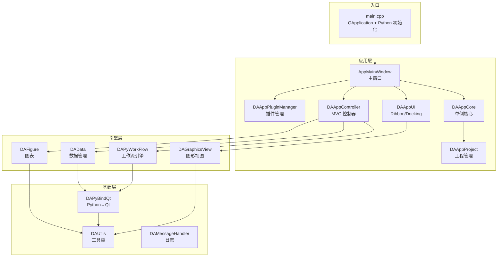
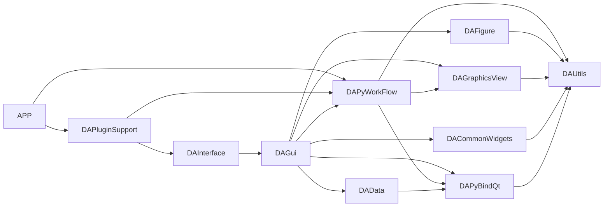
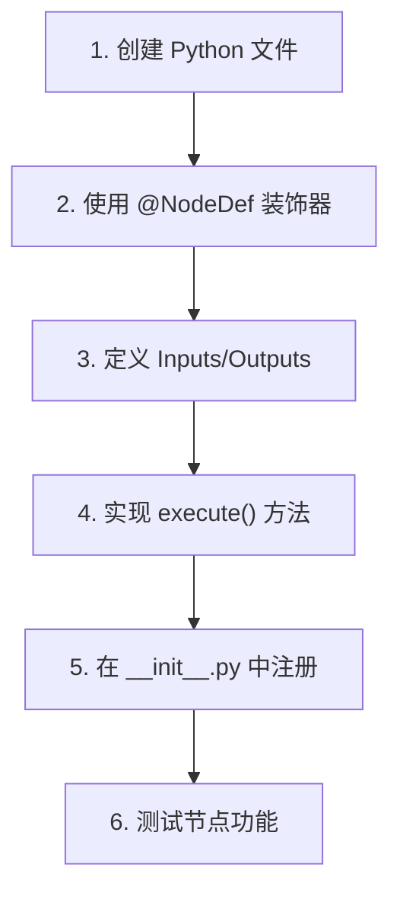
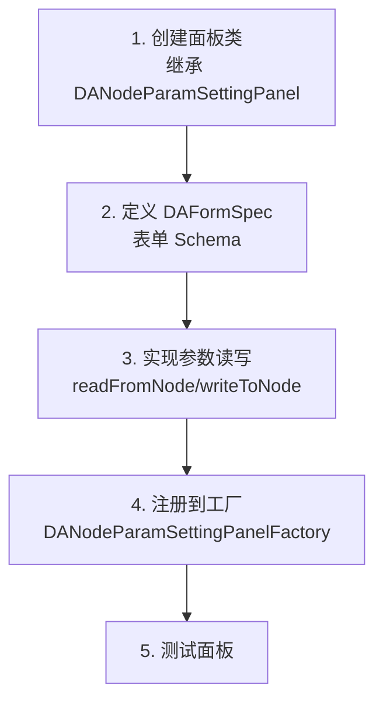
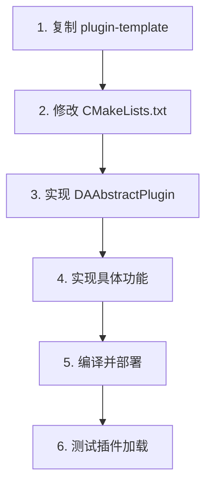
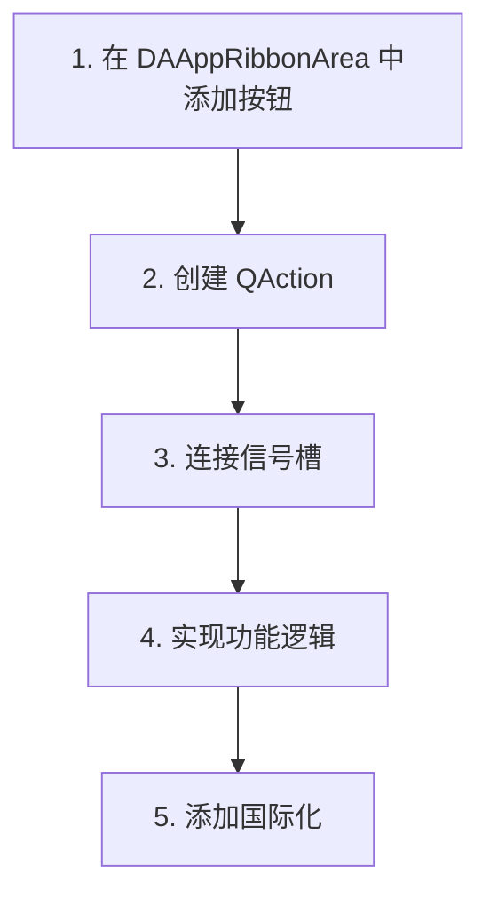

# 开发指引

- **项目全景**：快速理解项目定位、核心价值和整体架构
- **模块地图**：一张图看清各模块的关系和职责边界
- **开发流程**：从环境搭建到提交代码的完整工作流
- **新增功能指南**：在哪里加代码、遵循什么模式、改哪些文件

## 项目概述

**data-workbench** 是一个 AI Agent 驱动的下一代数据分析工作平台，基于 C++17 和 Qt 框架构建。它的核心价值在于将「智能体编排 + 数据处理 + 可视化」三大能力整合到一个统一的桌面应用中。

项目解决的核心问题是：科研和工程领域中大量重复性数据处理工作需要编程能力（尤其是 pandas/numpy），但许多领域专家并不具备编程背景。data-workbench 通过 GUI 封装 pandas 核心功能、可视化工作流引擎和交互式图表编辑，让用户无需编程即可完成复杂的数据分析流程。同时，内嵌的 Python 环境和 AI Agent 支持使得高级用户可以无缝对接 crewAI、LangChain 等主流 AI 框架。

技术栈选型理由：Qt 提供跨平台 GUI 和成熟的信号槽机制；C++17 保证了图形渲染和大规模数据操作的性能；pybind11 实现了 C++/Python 双向调用的零开销桥接；Qwt 提供了论文级别的图表绘制能力。

## 快速搭建开发环境

### 前置依赖

| 依赖 | 版本要求 | 安装方式 | 说明 |
|------|----------|----------|------|
| CMake | ≥ 3.16 | [cmake.org](https://cmake.org) | 构建系统生成器 |
| C++ 编译器 | C++17 | MSVC 2019+ / GCC 9+ | Windows 推荐 MSVC |
| Qt | 5.14+ 或 6.x | [qt.io](https://www.qt.io) | 推荐 Qt 5.15 或 Qt 6.7 |
| Python | ≥ 3.7 | [python.org](https://www.python.org) | 数据处理后端 |
| Git | 最新版 | [git-scm.com](https://git-scm.com) | 版本控制和子模块管理 |

### 构建并运行

**Windows（推荐方式）**：

```bash
# 1. 克隆项目（含子模块）
git clone https://github.com/czyt1988/data-workbench.git
cd data-workbench
git submodule update --init --recursive

# 2. 编译第三方库（仅首次）
cmake -S src/3rdparty -B build-3rdparty -G "Visual Studio 16 2019" -A x64 -DCMAKE_PREFIX_PATH="C:/Qt/6.7.3/msvc2019_64"
cmake --build build-3rdparty --config Release --parallel
cmake --install build-3rdparty --config Release

# 3. 使用构建脚本编译主程序
.\scripts\build.ps1 -Full
```

**Linux / WSL**：

```bash
# 1. 克隆和子模块
git clone https://github.com/czyt1988/data-workbench.git
cd data-workbench
git submodule update --init --recursive

# 2. 编译第三方库（仅首次）
cmake -S src/3rdparty -B build-linux-3rdparty -G Ninja -DCMAKE_BUILD_TYPE=Release
cmake --build build-linux-3rdparty --parallel
cmake --install build-linux-3rdparty

# 3. 编译主程序
cmake -S . -B build-linux -G Ninja -DCMAKE_BUILD_TYPE=Release
cmake --build build-linux --parallel
```

!!! warning "Windows 构建注意事项"
    - **禁止使用 Ninja 生成器**，必须使用 Visual Studio 生成器
    - 如果 `build/` 目录已存在且是用 Ninja 配置的，使用 `.\scripts\build.ps1 -Clean` 清理后重新配置
    - 本指南推荐使用 `build.ps1` 或 `-DCMAKE_PREFIX_PATH` 方式；`qt.toolchain.cmake` 仅在使用 Ninja + `CMAKE_TOOLCHAIN_FILE` 方式构建时需要

**安装 Python 依赖**：

```bash
pip install -r requirements.txt
```

构建成功后运行主程序，将看到带有 Ribbon 工具栏和 Docking 面板的主界面。

### 运行测试

**Windows**：

```powershell
# 使用构建脚本
.\scripts\build.ps1 -Target DAPyWorkFlow -Test

# 手动运行（Qt Test 在 Windows 上 stdout 不可见，必须用 -o）
.\build\src\tst\<测试模块>\Release\<测试模块>.exe -o test_result.txt
Get-Content test_result.txt
```

**Linux / WSL**：

```bash
./build-linux/src/tst/<测试模块>/<测试模块> -o test_result.txt
cat test_result.txt
```

### 编译指定模块

日常开发中通常只需要编译特定模块：

```powershell
# Windows
.\scripts\build.ps1 -Target DAPyWorkFlow       # 编译指定模块
.\scripts\build.ps1 -Target DAGui              # 编译 GUI 模块
```

```bash
# Linux
cmake --build build-linux --target DAPyWorkFlow --parallel
```

---

## 项目目录结构

```
data-workbench/
├── .github/workflows/     # CI (build.yml, page.yml)
├── cmake/                 # CMake 工具链模块
│   ├── daworkbench_utils.cmake        # 工具函数
│   ├── daworkbench_3rdparty.cmake     # 第三方库查找
│   ├── daworkbench_plugin_utils.cmake # 插件构建工具
│   ├── create_win32_resource_version.cmake # Windows 资源版本生成
│   └── DAWorkbenchConfig.cmake.in     # 包配置模板（供 find_package）
├── docs/                  # 文档
│   ├── zh/                # 中文文档
│   └── assets/            # 截图和资源
├── plugins/               # 插件目录
│   ├── DataAnalysis/      # 数据分析插件（最完整的参考）
│   ├── DASystemNodes/     # 系统内置节点（流程控制/数据展示，Python-first）
│   ├── DAAgentTools/      # Agent 内置工具插件（19 个 LLM 工具）
│   └── plugin-template/   # 插件脚手架
├── scripts/               # 构建脚本
│   └── build.ps1          # Windows 构建脚本
├── src/                   # 源代码（核心开发区域）
│   ├── 3rdparty/          # 第三方库（git submodule）
│   ├── DAShared/          # L1: 纯头文件模板库
│   ├── DAUtils/           # L1: 通用工具类
│   ├── DAMessageHandler/  # L1: 日志基础设施
│   ├── DAPyBindQt/        # L1: Python↔Qt 绑定
│   ├── DAPyScripts/       # L2: Python 脚本包装
│   ├── DAPyCommonWidgets/ # L2: Python 通用控件
│   ├── DAPyWorkFlow/      # L2: 工作流引擎
│   ├── DAData/            # L2: 数据管理
│   ├── DAGraphicsView/    # L2: 图形视图框架
│   ├── DAFigure/          # L2: 图表容器
│   ├── DACommonWidgets/   # L3: 通用 UI 组件
│   ├── DAGui/             # L3: GUI 整合层（最大模块）
│   ├── DAInterface/       # L4: 抽象接口定义
│   ├── DAPluginSupport/   # L4: 插件框架
│   ├── APP/               # L5: 应用主程序
│   ├── PyScripts/         # 内置 Python 脚本
│   ├── i18n/              # 国际化翻译
│   └── tst/               # 测试
├── CMakeLists.txt         # 根构建文件
├── mkdocs.yml             # 文档站点配置
├── requirements.txt       # Python 依赖
└── AGENTS.md              # AI Agent 开发指南
```

### 各目录职责说明

| 目录 | 职责 | 谁会改这里 |
|------|------|-----------|
| `src/DAPyWorkFlow/` | 工作流引擎核心 | 新增节点类型、修改执行逻辑 |
| `src/DAGui/` | GUI 整合，所有界面面板 | 新增设置面板、修改 UI 布局 |
| `src/DAFigure/` | 图表绘制和编辑 | 新增图表类型、修改图表属性 |
| `src/DAData/` | 数据容器和管理 | 新增数据类型、修改数据导入 |
| `src/DAPyBindQt/` | Python 绑定和类型转换 | 新增 Python 可调用接口 |
| `src/APP/` | 主程序入口和接口实现 | 新增全局功能、修改主窗口 |
| `plugins/` | 插件扩展 | 开发新插件或节点包 |
| `src/tst/` | 测试 | 新增/修改功能后 |
| `src/3rdparty/` | 第三方库 | ⚠️ 仅 submodule 更新时 |

### 禁止修改的文件/目录

!!! danger "禁止触碰"
    - `src/3rdparty/` — 第三方库通过 git submodule 管理，直接修改会在更新时丢失
    - `src/3rdparty/qwt/` — Qwt 有自己的 AGENTS.md 和修改规范
    - 自动生成的 moc 文件 — 由 Qt MOC 编译器自动生成
    - 原因：这些目录的内容由外部管理，本地修改会被覆盖或导致合并冲突

---

## 核心架构概览



系统的控制流从 `main.cpp` 进入，创建 `QApplication` 并初始化 Python 解释器，然后构造 `AppMainWindow` 主窗口。主窗口在初始化过程中创建 `DAAppCore` 单例（持有所有子系统实例）、`DAAppUI`（管理 Ribbon 和 Docking 布局）、`DAAppController`（MVC 控制器，协调工作流/数据/图表三大功能域）。插件在窗口构造完成后通过 `DAAppPluginManager` 加载。

## 模块关系图



底层模块（DAUtils、DAShared、DAPyBindQt）被所有上层模块依赖。DAPyWorkFlow 是功能层中最核心的模块，被 DAGui 和 APP 直接使用。DAInterface 以 PUBLIC 方式依赖 DAGui，确保插件能获得完整的 UI 和数据能力。

---

## 新增功能开发流程

### 场景 1：新增一个 Python 工作流节点

这是最常见的扩展方式，无需编写 C++ 代码。



**具体步骤**：

1. **创建 Python 文件**：在节点包目录（如 `plugins/DASystemNodes/PyScripts/`）中创建 `.py` 文件
2. **使用 `@NodeDef` 装饰器**：声明节点名称（不翻译！参与序列化）、分类（可翻译）
3. **定义 Inputs/Outputs 内部类**：声明输入输出端口及其数据类型
4. **实现 `execute(self, inputs, params)` 方法**：编写节点逻辑，使用 pandas/numpy
5. **注册节点**：在包的 `__init__.py` 中导入节点模块
6. **测试**：在工作流中拖入节点，连接数据，验证执行结果

!!! warning "@NodeDef(name=...) 禁止翻译"
    `name` 参与 `qualified_name` 序列化（如 `DASystemNodes.Delay`），翻译会破坏已存工程的节点匹配。
    `category` 和 `description` 可以翻译。

详细规范参见 [Python 节点开发指南](./workflow/workflow-python-node-dev.md)。

### 场景 2：新增一个节点设置面板

当节点的参数需要自定义 UI 时使用。



**具体步骤**：

1. **创建面板类**：在 `src/DAGui/NodeSetting/` 中创建面板类，继承 `DANodeParamSettingPanel`
2. **定义 DAFormSpec**：使用 `DAFormSpec` 描述表单结构（字段、分组、联动规则）
3. **实现参数读写**：`readFromNode()` 从 `DAPyNode` 读取参数到表单，`writeToNode()` 将表单值写回节点
4. **注册到工厂**：在 `DANodeParamSettingPanelFactory` 中添加 qualifiedName → 面板类的映射
5. **测试**：选中节点，确认右侧面板正确显示和更新参数

详细规范参见 [创建设置面板指南](./ui/creating-setting-panel.md)。

### 场景 3：新增一个 C++ 插件



**具体步骤**：

1. **复制脚手架**：`cp -r plugins/plugin-template plugins/MyPlugin`
2. **修改 CMakeLists.txt**：更新目标名称和依赖
3. **实现插件类**：继承 `DAAbstractPlugin`，重写 `initialize()` 方法
4. **实现功能**：注册节点、添加工具栏按钮、提供数据处理器等
5. **编译部署**：编译为动态库，输出到插件目录
6. **测试**：启动程序，在"插件管理"中确认插件已加载

详细规范参见 [插件项目创建指南](../plugin/plugin-development.md)。

### 场景 4：新增一个 Ribbon 工具栏按钮



**具体步骤**：

1. **添加按钮**：在 `src/APP/DAAppRibbonArea.cpp` 中找到对应的 Ribbon Page，添加按钮
2. **创建 QAction**：在 `DAAppUI` 或 `DAAppController` 中创建 QAction
3. **连接信号槽**：将按钮的 `triggered()` 信号连接到控制器的槽函数
4. **实现逻辑**：在 Controller 中实现具体功能
5. **添加国际化**：使用 `tr("English text") //cn:中文文本` 模式

详细步骤参见 [Action 添加方法](./ui/adding-action-methods.md)。

---

## 设计模式与约定

### 项目使用的核心设计模式

| 模式 | 使用位置 | 为什么用 | 关键宏/类 |
|------|----------|----------|-----------|
| **PIMPL** | 所有核心类 | 减少头文件依赖、保持 ABI 兼容 | `DA_DECLARE_PRIVATE`, `DA_D()`, `DA_DC()` |
| **单例** | DAAppCore | 全局唯一的子系统管理器 | `DAAppCore::getInstance()` |
| **工厂** | DAPyNodeFactory, DANodeParamSettingPanelFactory | 根据类型标识动态创建对象 | qualifiedName 路由 |
| **观察者** | 全项目（Qt 信号槽） | 模块间松耦合通讯 | `Q_SIGNALS`, `Q_SLOT`, `connect()` |
| **命令** | DAGui/Commands/ | 支持撤销/重做操作 | QUndoCommand 子类 |
| **MVC** | DAAppController + Models/ | 分离数据和视图 | DAGui/Models/ |
| **适配器** | DANodeParameterFormAdapter | DAPyNodeParameter → DAFormSpec | 接口转换 |

### 命名约定速查

| 类别 | 约定 | 示例 |
|------|------|------|
| 类名 | `DA` 前缀 + 大驼峰 | `DAPyNode`, `DAAppCore` |
| 文件名 | 与类名一致 | `DAPyNode.h`, `DAPyNode.cpp` |
| 命名空间 | `DA` | `namespace DA { ... }` |
| 私有成员 | `m` 前缀 + 小驼峰 | `mResultValue` |
| 公有成员 | 小驼峰，无前缀 | `publicMemberValue` |
| 全局变量 | `g_` 前缀 + 下划线 | `g_total_count` |
| 宏 | 全大写 + 下划线 | `DA_DECLARE_PRIVATE` |
| 信号/槽 | `Q_SIGNALS` / `Q_SLOT` | 禁止使用 `signals`/`slot` |

### 新增类模板

```cpp
// DAMyNewClass.h
#ifndef DAMYNEWCLASS_H
#define DAMYNEWCLASS_H

#include "DAXxxAPI.h"  // 如有导出宏
#include <QObject>

namespace DA
{
/// 类的简要说明
class DAMyNewClass : public QObject
{
    Q_OBJECT
    DA_DECLARE_PRIVATE(DAMyNewClass)
public:
    explicit DAMyNewClass(QObject* parent = nullptr);
    ~DAMyNewClass();

    // 公有接口（头文件只保留单行中文注释）
    void doSomething(int param);
    int getValue() const;

Q_SIGNALS:
    // 信号的 Doxygen 注释可以写在头文件
    void valueChanged(int newValue);
};
}  // namespace DA

#endif  // DAMYNEWCLASS_H
```

```cpp
// DAMyNewClass.cpp
#include "DAMyNewClass.h"

namespace DA
{
class DAMyNewClass::PrivateData
{
    DA_DECLARE_PUBLIC(DAMyNewClass)
public:
    int mValue { 0 };
};

/**
 * @brief 构造函数
 * @param parent 父对象
 */
DAMyNewClass::DAMyNewClass(QObject* parent)
    : QObject(parent)
    , DA_PIMPL_CONSTRUCT(DAMyNewClass)
{
}

DAMyNewClass::~DAMyNewClass() = default;

/**
 * @brief 执行某操作
 * @param param 参数说明
 *
 * 详细的 Doxygen 注释写在 cpp 文件中
 */
void DAMyNewClass::doSomething(int param)
{
    DA_D(DAMyNewClass);
    d->mValue = param;
    Q_EMIT valueChanged(d->mValue);
}

int DAMyNewClass::getValue() const
{
    DA_DC(DAMyNewClass);
    return d->mValue;
}
}  // namespace DA
```

---

## 调试指南

### 常见调试场景

| 场景 | 调试方法 |
|------|----------|
| 工作流节点执行失败 | 使用日志宏 `daInfo`/`daWarning`/`daCritical`，检查 `DAMessageHandler` 输出 |
| Python 节点异常 | 检查 `dealException()` 是否吞掉了异常；在 Python 代码中添加 `print()` 调试 |
| 插件未加载 | 检查插件动态库是否在正确目录，查看启动日志中的插件加载信息 |
| 图表渲染异常 | 检查 QwtPlot 数据范围、坐标轴配置，使用数据探针验证数据 |
| pybind11 类型转换失败 | 确认 `.cpp` 文件已 `#include "DAPybind11QtCaster.hpp"` |
| UI 面板不更新 | 检查信号槽连接是否正确，使用 `connect()` 的返回值验证 |

### 日志系统

项目使用 `DAMessageHandler` 模块提供日志基础设施，基于 spdlog：

```cpp
#include "DALogger.h"

// 便捷宏（推荐）
daInfo("Processing node: %s", qPrintable(nodeName));
daWarning("Data size exceeds threshold: %d", dataSize);
daCritical("Failed to load plugin: %s", qPrintable(errorMsg));

// 带分类的日志
DA_LOG_CATEGORY(MyCategory);
daInfoC(MyCategory, "Detailed message for my module");
```

!!! warning "日志消息不翻译"
    所有日志消息保持纯英文，便于跨语言环境检索。不要对日志字符串使用 `tr()`。

### pybind11 类型转换陷阱

!!! danger "必须包含 DAPybind11QtCaster.hpp"
    每个 `.cpp` 文件只要出现 Qt↔Python 类型转换（`attr(...)(QString)`, `cast<QString>()` 等），
    **必须**在文件顶部 `#include "DAPybind11QtCaster.hpp"`。遗漏不会编译报错，但运行时会静默失败。

---

## 提交代码规范

### Git 工作流

项目使用 `dev` 分支作为主要开发分支，`master` 为稳定分支。

```bash
# 从 dev 分支创建功能分支
git checkout dev
git checkout -b feature/my-new-feature

# 开发完成后合并回 dev
git checkout dev
git merge feature/my-new-feature
```

### 提交信息格式

提交信息应包含以下内容：

```
<类型>: <简要描述>

详细说明（可选）

- 修改的文件列表
- 关联信息
```

类型包括：`feat`（新功能）、`fix`（修复）、`docs`（文档）、`refactor`（重构）、`build`（构建）、`test`（测试）。

---

## 常见问题（开发者视角）

### Q：我想添加新的数据处理功能，应该改哪里？

如果功能可以作为工作流节点，**优先创建 Python 节点**（`plugins/DASystemNodes/`），无需修改 C++ 代码。如果需要深度集成（如新的数据类型或 UI 面板），则在 `src/DAData/` 添加数据类，在 `src/DAGui/` 添加 UI。

### Q：为什么代码中大量使用 PIMPL 模式？

PIMPL 模式减少了头文件的依赖传播，修改内部实现不需要重新编译依赖方。对于 300+ 文件的大型项目（如 DAGui），这能显著加速增量编译。详见 [架构设计](./architecture/architecture.md#决策-1pimpl-模式全覆盖)。

### Q：构建失败了怎么办？

1. 首先阅读 [构建常见错误](../build/common-build-errors.md)
2. 检查第三方库是否已正确编译和安装（`bin_*` 目录是否存在）
3. 使用 `.\scripts\build.ps1 -Clean` 清理后重新构建
4. 确认 Qt 版本和编译器版本匹配

### Q：如何在 Python 节点中调用 C++ 的 Qt 对象？

通过 `DACoreInterface` 获取所需接口。所有全局接口都可以通过 `DA_APP_CORE` 宏访问：

```python
# Python 节点中获取数据管理器
from DAWorkbench import core
data_mgr = core.getDataManagerInterface()
```

---

## 延伸阅读

- [架构设计详解](./architecture/architecture.md) — 5 层架构、设计决策、扩展点
- [模块业务逻辑详解](./architecture/module-breakdown.md) — 各模块内部工作原理
- [模块依赖关系](./architecture/module-dependency.md) — 详细的依赖矩阵和职责边界
- [编码规范](./general/coding-standard.md) — 命名、注释、代码风格规范
- [图标与 UI 设计规范](./general/icon-ui-design-guide.md) — SVG 图标画布/色板、UI 控件配色映射（涉及图标设计必读）
- [贡献指南](../reference/contribution-guide.md) — 代码评审和协作流程
