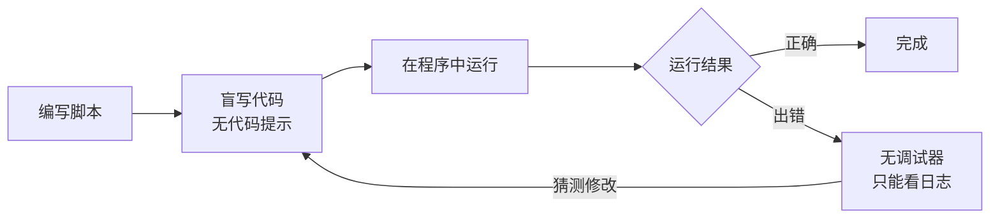
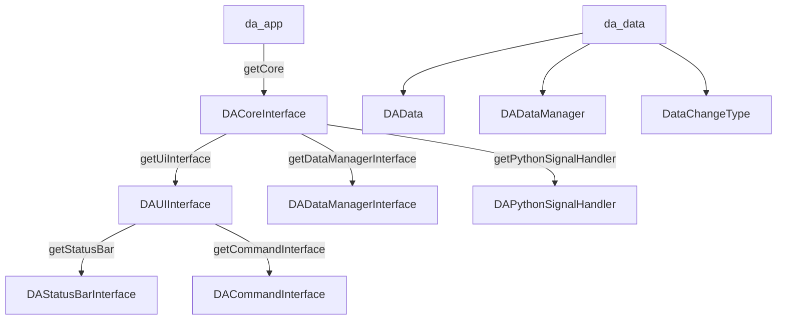
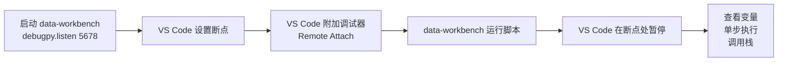
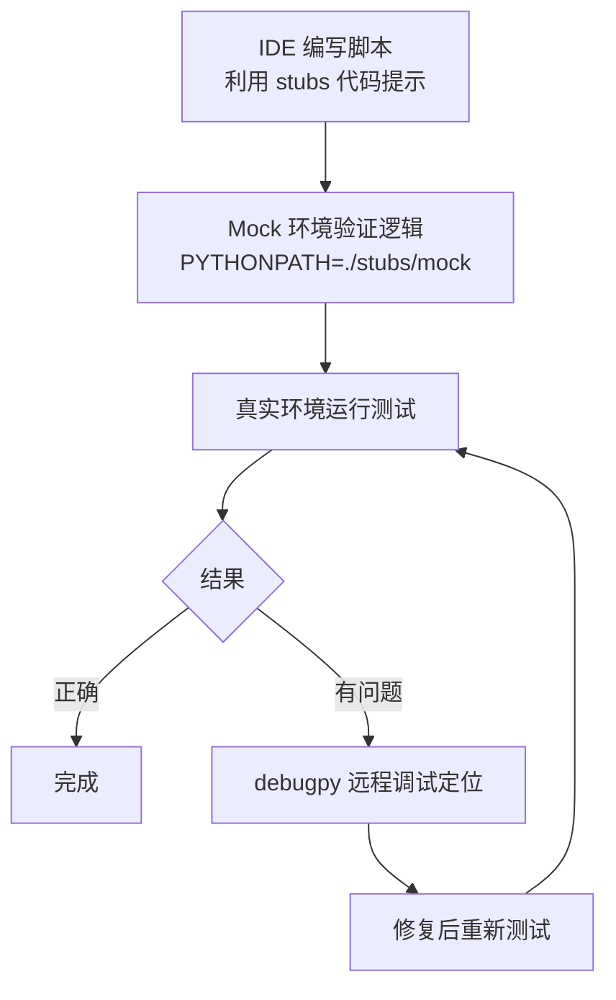

# 嵌入式 Python 调试与代码提示指南

data-workbench 通过 pybind11 将 C++ 功能导出为 Python 模块，使脚本能够操作数据、调用 UI 接口等。但由于这些模块是嵌入式导出（`PYBIND11_EMBEDDED_MODULE`），**只能在程序内部运行**，无法在外部 Python 环境中直接 `import`，导致脚本开发面临调试困难、无代码提示等问题。

本文档介绍如何利用 `stubs/` 目录下的 `.pyi` 文件实现 IDE 代码提示，以及三种调试方案。

**特性**

- ✅ **IDE 代码提示**：通过 `.pyi` stub 文件，在 VS Code / PyCharm 中获得完整的类型提示和参数信息
- ✅ **Mock 逻辑验证**：通过 mock 模块，在标准 Python 环境中验证脚本逻辑
- ✅ **debugpy 远程调试**：在真实嵌入式环境中实现断点调试
- ✅ **日志调试**：利用已导出的日志函数快速定位问题

---

## 第一部分：嵌入式 Python 的特殊性

data-workbench 的 Python 模块只能在程序内部运行，这意味着：

- **无法使用标准 Python 调试器**：pdb、VS Code 调试器等无法直接附加到嵌入式环境
- **无法获得 IDE 代码提示**：PyCharm、VS Code 等 IDE 无法分析这些模块的 API
- **脚本开发体验差**：只能"盲写"代码，运行时才能发现错误

!!! info "什么是嵌入式 Python 模块？"
    pybind11 的 `PYBIND11_EMBEDDED_MODULE` 宏在 C++ 程序内部创建 Python 模块，这些模块只在程序运行时存在。与 `PYBIND11_MODULE`（创建可被外部 Python `import` 的扩展模块）不同，嵌入式模块无法脱离宿主程序独立使用。详见 [Python/C++ 集成](./python-binding/cpp-calling-python.md)。

下图展示了嵌入式环境中脚本开发的困境：



---

## 第二部分：三大导出模块概览

data-workbench 导出了三个 Python 模块：

| 模块名 | 源码位置 | 主要内容 |
|---------|----------|----------|
| `da_interface` | `src/DAInterface/DAInterfacePythonBinding.cpp` | 核心接口类：DACoreInterface、DAUIInterface、DADataManagerInterface、DAStatusBarInterface、DACommandInterface、DAPythonSignalHandler |
| `da_data` | `src/DAData/DADataPythonBinding.cpp` | 数据类型：DAData、DADataManager、DataChangeType 枚举 |
| `da_app` | `src/APP/PythonBinding/DAAppPythonBinding.cpp` | 全局入口：getCore()、addInfoLogMessage()、addWarningLogMessage()、addCriticalLogMessage() |

### 模块之间的关系



典型的脚本使用流程：

```python title="典型脚本示例"
import da_app
import da_data

# 获取核心接口（da_app 模块）
core = da_app.getCore()

# 通过核心接口获取子接口（da_interface 模块中的类）
ui = core.getUiInterface()               # -> DAUIInterface
data_mgr_iface = core.getDataManagerInterface()  # -> DADataManagerInterface

# 操作数据（da_data 模块中的类）
data = da_data.DAData(df)                # -> DAData
data_mgr_iface.addData(data)             # 通过接口管理数据
```

---

## 第三部分：使用 stubs 文件实现代码提示

### 3.1 stubs 目录结构

```
stubs/
├── da_interface/        # da_interface 模块的 stub
│   ├── __init__.pyi     # 接口类的类型定义
│   └ __init__.pyi
├── da_data/             # da_data 模块的 stub
│   └ __init__.pyi       # 数据类的类型定义
└── da_app/              # da_app 模块的 stub
    └ __init__.pyi       # 入口函数的类型定义
```

每个 `.pyi` 文件对应一个 pybind11 导出模块，只包含该模块导出的类型定义，跨模块引用通过 `import` 解决。例如 `da_interface/__init__.pyi` 中引用 `DAData` 类型时，使用 `from da_data import DAData`。

!!! tip "为什么使用包结构而不是单文件？"
    使用包结构（每个模块一个目录 + `__init__.pyi`）而非单个 `.pyi` 文件，可以让跨模块引用通过 `import` 正确关联，避免类型重复定义。IDE 在分析 `from da_data import DAData` 时能正确定位到 `da_data/__init__.pyi` 中的定义，从而提供精确的类型提示。

### 3.2 配置 IDE 代码提示

=== "VS Code"

    在 `.vscode/settings.json` 中添加：

    ```json
    {
      "python.analysis.extraPaths": ["./stubs"]
    }
    ```

    配置后，Pylance/Pyright 会将 `stubs/` 目录作为额外的类型定义搜索路径，在编写脚本时提供完整的代码提示。

=== "PyCharm"

    将 `stubs/` 目录标记为 Sources Root：

    1. 在项目视图中右键 `stubs/` 目录
    2. 选择 **Mark Directory As** → **Sources Root**
    3. 目录图标变为蓝色源码根标记

    PyCharm 会自动识别 `.pyi` 文件并提供类型提示。

### 3.3 stub 文件的使用示例

配置完成后，在 IDE 中编写脚本时将获得完整的代码提示：

```python title="代码提示效果演示"
import da_app
import da_data
import da_interface

# IDE 会提示 getCore() 函数及其返回类型 DACoreInterface
core = da_app.getCore()

# IDE 会提示 DACoreInterface 的所有方法
ui = core.getUiInterface()           # 返回类型提示：DAUIInterface
data_mgr = core.getDataManagerInterface()  # 返回类型提示：DADataManagerInterface

# IDE 会提示 DAUIInterface 的所有方法及参数
ui.addInfoLogMessage("处理开始")      # 参数提示：msg: str, showInStatusBar: bool = True
status_bar = ui.getStatusBar()       # 返回类型提示：DAStatusBarInterface

# IDE 会提示 DAStatusBarInterface 的所有方法
status_bar.showMessage("正在处理数据...", timeout=5000)  # timeout 默认值提示：15000
status_bar.showProgressBar()
status_bar.setProgress(50)

# IDE 会提示 da_data 模块的所有类和方法
import pandas as pd
df = pd.read_csv("data.csv")
data = da_data.DAData(df)            # 构造函数提示：obj: Union[pd.DataFrame, pd.Series]
data.setName("实验数据")              # 方法提示：setName(name: str) -> None

# IDE 会提示 DADataManagerInterface 的方法及参数类型
data_mgr.addData(data)               # 参数提示：data: DAData
all_data = data_mgr.getAllDatas()    # 返回类型提示：List[DAData]
```

---

## 第四部分：调试方案

### 4.1 方案一：Mock 模块（轻量级逻辑验证）

在 `stubs/mock/` 中提供 mock 实现，让脚本可以在标准 Python 中运行，验证逻辑正确性。

!!! info "Mock 模块的工作原理"
    Mock 模块用纯 Python 实现了与嵌入式模块相同的 API 接口。`DAData` 真实包装 pandas 对象，`DADataManager` 用 Python list 模拟数据存储，UI 接口类则只打印日志不执行 Qt 操作。这样脚本的数据处理逻辑可以在标准 Python 中验证。

```python title="Mock 环境使用示例"
# 方式一：通过 PYTHONPATH 环境变量
# 运行：PYTHONPATH=./stubs/mock python my_script.py

# 方式二：在脚本中手动设置
import sys
sys.path.insert(0, './stubs/mock')

import da_app
import da_data

# 获取 mock 核心接口
core = da_app.getCore()
data_mgr = core.getDataManagerInterface()

# 创建真实 pandas 数据（mock 中 DAData 真实包装 pandas）
import pandas as pd
df = pd.DataFrame({'a': [1, 2, 3]})
data = da_data.DAData(df)
data.setName("测试数据")

# 添加数据并验证
data_mgr.addData(data)
assert data_mgr.getDataCount() == 1
assert data_mgr.getData(0).getName() == "测试数据"
```

**适用场景**：
- 验证脚本逻辑（数据处理流程、条件分支等）
- 单元测试
- 不依赖 Qt UI 的纯数据操作

!!! warning "Mock 的限制"
    - Mock **无法模拟 Qt UI 交互**（对话框、进度条等），UI 接口类的方法仅打印日志
    - Mock 的 DADataManager **不具备撤销/重做功能**（`addData_`、`removeData_` 等方法等同于无撤销版本）
    - Mock **不会触发真实的数据变更信号**，`notifyDataChangedSignal` 仅打印日志

### 4.2 方案二：debugpy 远程调试（真实环境断点调试）

在嵌入式 Python 初始化时集成 debugpy，实现 VS Code 远程附加调试：



#### 启用 debugpy

在程序的 Python 初始化代码中添加：

```python title="启用 debugpy"
import debugpy
debugpy.listen(5678)                  # 监听调试端口
# debugpy.wait_for_client()           # 可选：等待调试器连接后再继续执行
```

!!! tip "建议将 debugpy 设为可选功能"
    通过配置文件或命令行参数控制是否启用 debugpy，避免影响正常性能。未启用时不应加载 debugpy 模块。

#### VS Code 配置

在 `.vscode/launch.json` 中添加：

```json title=".vscode/launch.json - 远程附加配置"
{
  "name": "Python: Remote Attach",
  "type": "debugpy",
  "request": "attach",
  "connect": {
    "host": "localhost",
    "port": 5678
  },
  "pathMappings": [
    {
      "localRoot": "${workspaceFolder}",
      "remoteRoot": "."
    }
  ]
}
```

#### 调试流程

1. 启动 data-workbench 程序（debugpy 已在端口 5678 监听）
2. 在 VS Code 中打开脚本文件，设置断点
3. 在 VS Code 中执行 **"Python: Remote Attach"** 调试配置
4. 在 data-workbench 中运行脚本，VS Code 将在断点处暂停
5. 可以查看变量、调用栈、单步执行等

**适用场景**：
- 调试与 Qt UI 的交互问题
- 调试数据变更信号不触发的问题
- 调试线程相关问题
- 定位只有真实环境才出现的 bug

!!! warning "debugpy 远程调试注意事项"
    - 调试器连接后，脚本执行速度会明显降低，断点处尤其明显
    - `wait_for_client()` 模式下程序会阻塞等待调试器连接，适合调试启动阶段的脚本
    - 如果断点不在脚本文件中（如第三方库），需要在 `pathMappings` 中正确映射路径

### 4.3 方案三：日志调试（最简单）

利用已导出的日志函数进行打印调试：

```python title="日志调试示例"
import da_app

da_app.addInfoLogMessage("步骤1：读取数据完成")
da_app.addWarningLogMessage("数据中有缺失值")
da_app.addCriticalLogMessage("处理失败！")

# 日志也会在状态栏显示（默认行为）
# 如果不想在状态栏显示，使用 UI 接口：
ui = da_app.getCore().getUiInterface()
ui.addInfoLogMessage("仅日志面板显示", showInStatusBar=False)
```

日志会在程序的主窗口日志面板中显示，也可在状态栏中显示（通过 `showInStatusBar` 参数控制）。

**适用场景**：
- 快速定位问题范围
- 不需要断点调试的简单场景
- 确认脚本执行到哪个步骤

---

## 第五部分：最佳实践

### 5.1 推荐开发流程



### 5.2 stubs 维护

当 pybind11 绑定代码有新增/修改时，需要同步更新对应的 `.pyi` 文件：

!!! warning "stubs 必须与绑定源码同步"
    - 在修改绑定代码的 PR 中，**同时更新 stub 文件**
    - stub 文件的函数签名必须与绑定源码**完全一致**（参数名、类型、默认值）
    - 如果绑定源码使用 lambda 包装（如 `std::string` → `QString` 转换），stub 文件应标注 Python 侧的类型（`str`），而非 C++ 侧的类型
    - 使用包结构（每个模块一个目录 + `__init__.pyi`），跨模块引用通过 `import` 解决

### 5.3 调试技巧

!!! tip "调试技巧清单"
    - [ ] **先 Mock 验证逻辑，再真实环境验证行为**：大部分数据处理逻辑可以在 Mock 中验证
    - [ ] **使用 `da_app.addInfoLogMessage` 增加关键节点日志**：在真实环境中快速定位问题范围
    - [ ] **debugpy 的 `wait_for_client()` 模式**：确保调试器连接后再执行，不会错过启动阶段的断点
    - [ ] **在脚本入口处设置断点**：远程调试时，脚本入口是最可靠的断点位置
    - [ ] **Mock 中使用 `assert` 语句**：在 Mock 环境中用断言验证关键逻辑，相当于轻量级单元测试

---

## 第六部分：各模块 API 参考

详细的 API 签名请参阅各 stub 文件（每个文件包含完整的中文 docstring）：

| 模块 | stub 文件 | 主要类/函数 |
|------|-----------|-------------|
| `da_interface` | [`stubs/da_interface/__init__.pyi`](../../stubs/da_interface/__init__.pyi) | DAPythonSignalHandler、DADataManagerInterface、DAStatusBarInterface、DACommandInterface、DAUIInterface、DACoreInterface |
| `da_data` | [`stubs/da_data/__init__.pyi`](../../stubs/da_data/__init__.pyi) | DAData、DataChangeType 枚举、DADataManager |
| `da_app` | [`stubs/da_app/__init__.pyi`](../../stubs/da_app/__init__.pyi) | getCore()、addInfoLogMessage()、addWarningLogMessage()、addCriticalLogMessage() |

---

## 第七部分：常见问题

### Q: 为什么 `import da_interface` 在外部 Python 环境中报错？

这些模块是 pybind11 嵌入式导出的（`PYBIND11_EMBEDDED_MODULE`），只在 data-workbench 程序内部存在。外部 Python 无法直接导入。要获得代码提示，需要使用 `stubs/` 目录下的 `.pyi` 文件并配置 IDE 的 `extraPaths`。

### Q: Mock 环境和真实环境的行为不一致怎么办？

Mock 主要是验证逻辑流程，不保证与真实环境完全一致。不一致的地方通常是涉及 Qt UI 或信号机制的部分，这些需要通过 debugpy 远程调试在真实环境中验证。

### Q: debugpy 会影响程序性能吗？

`debugpy.listen()` 只在调试器连接时才有性能影响。未连接时开销极小。建议默认不启用，通过配置项控制是否开启。

### Q: stub 文件中的类型和实际运行时的类型不一致怎么办？

pybind11 的类型转换可能导致 stub 中的类型标注与实际运行时类型有细微差异（如 `std::string` 参数实际接受 `str`）。遇到这种情况，优先以绑定源码中的 `pybind11::arg` 注释为准，stub 中标注 Python 侧的类型。

---

## 参考资料

| 文档 | 说明 |
|------|------|
| [Python/C++ 集成](./python-binding/cpp-calling-python.md) | pybind11 使用详解 |
| [数据模块](./data-module.md) | DAData 数据模块详解 |
| [接口模块](./interface-module.md) | DAInterface 接口模块 |
| [pybind11 官方文档](https://pybind11.readthedocs.io/) | pybind11 绑定框架参考 |
| [debugpy 官方文档](https://debugpy.readthedocs.io/) | debugpy 远程调试参考 |