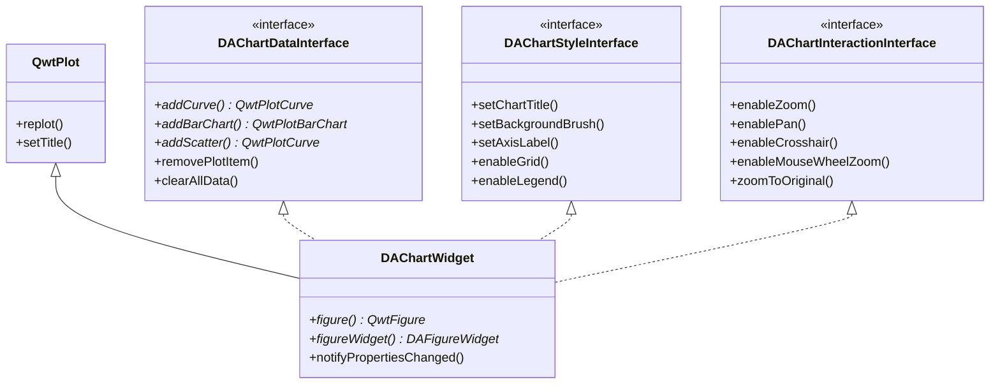

# 绘图模块概述

绘图模块`DAFigure`基于`Qwt`绘图库，封装了绑图功能，主要在Qwt基础上，集成扩展了`redo/undo`功能、区域选择功能、缩放平移等交互功能。

## 主要功能特性

**特性**

- ✅ **多图表管理**：支持在单一画布中管理多个图表，通过归一化坐标灵活布局
- ✅ **Undo/Redo**：内置命令栈，支持所有图表操作的撤销和重做
- ✅ **数据探针**：提供水平和垂直数据探针，方便数据分析和标注
- ✅ **区域选择**：支持矩形、椭圆、多边形等多种区域选择模式
- ✅ **轴范围绑定**：多图表坐标轴联动，实现同步缩放
- ✅ **交互编辑**：缩放、平移、十字线、数据拾取等多种交互模式

## 命名约定

绘图模块的命名约定如下：

- `Figure`代表画布，它是顶层的绘图窗口容器，能容纳多个绘图（`Chart`）
- `Chart`代表绘图，它是一个具体的绘图窗口，能容纳多个绘图元素(`Item`)
- `Item`代表绘图元素，比如曲线、网格等，实际是Qwt的`QwtPlotItem`的实例

绘图模块`DAFigure`的类以`DAChart*`或者`DAFigure*`开头。

!!! tip "说明"
    绘图模块的属性设置窗口位于`DAGui`模块，主要也是以`DAChart*`开头。

## 模块架构

### 类关系图

绘图模块的核心类通过接口分离模式组织，`DAChartWidget`继承三个功能接口：



### 核心类层次

绘图模块的核心类层次如下：

```
DAFigureWidget (画布容器)
├── DAChartWidget (图表控件，基于QwtPlot)
│   ├── QwtPlotCurve (曲线)
│   ├── QwtPlotGrid (网格)
│   ├── QwtPlotMarker (标记)
│   ├── QwtPlotBarChart (柱状图)
│   ├── QwtPlotIntervalCurve (误差曲线)
│   └── QwtPlotSpectrogram (热力图)
└── Undo/Redo 命令栈
```

### DAFigureWidget

`DAFigureWidget` 是绘图模块的顶层容器，继承自 `QScrollArea`，主要功能：

- 管理多个 `DAChartWidget` 图表实例
- 提供 undo/redo 命令栈支持
- 管理图表的布局和显示
- 支持颜色主题管理

### DAChartWidget

`DAChartWidget` 是具体的图表控件，在 `QwtPlot` 基础上扩展了交互功能，通过三个接口分离不同方面的功能：

| 接口 | 功能 |
|------|------|
| `DAChartDataInterface` | 数据管理和图表添加 |
| `DAChartStyleInterface` | 样式设置和显示配置 |
| `DAChartInteractionInterface` | 用户交互控制 |

支持以下编辑模式：

| 编辑模式 | 编号 | 说明 |
|---------|------|------|
| SubChartEditor | 0 | 子图表编辑 |
| RectSelectEditor | 1 | 矩形区域选择 |
| EllipseSelectEditor | 2 | 椭圆区域选择 |
| PolygonSelectEditor | 3 | 多边形区域选择 |
| UserDefineEditor | 1000+ | 用户自定义编辑器 |

## 支持的数据系列类型

绘图模块支持以下数据系列类型：

| 系列类型 | 说明 |
|---------|------|
| XY曲线 | 基础的二维数据曲线 |
| XYE系列 | 带误差条的数据曲线 |
| OHLC系列 | K线图（开高低收） |
| 柱状图 | 柱状数据可视化 |
| 区间曲线 | 带上下界的区间显示 |
| 网格栅格数据 | 热力图等二维分布 |

## 使用方法

### 基本使用：创建图表和曲线

以下示例演示如何创建图表并添加曲线：

```cpp
// 创建画布
DA::DAFigureWidget* figure = new DA::DAFigureWidget(parentWidget);

// 创建图表（使用归一化坐标）
DA::DAChartWidget* chart = figure->createChart(QRectF(0.1, 0.1, 0.8, 0.8));

// 设置图表标题
chart->setChartTitle("数据分析图表");

// 启用网格
chart->enableGrid(true);

// 添加曲线数据
QVector<double> xData = {1.0, 2.0, 3.0, 4.0, 5.0};
QVector<double> yData = {10.0, 25.0, 18.0, 32.0, 28.0};
QwtPlotCurve* curve = chart->addCurve(xData, yData, "数据曲线");

// 启用交互功能
chart->enableZoom(true);
chart->enableCrosshair(true);
```

### 多图表布局

使用归一化坐标创建多个图表：

```cpp
// 创建画布
DA::DAFigureWidget* figure = new DA::DAFigureWidget();

// 创建上下两个图表，占据不同区域
DA::DAChartWidget* topChart = figure->createChart(QRectF(0.05, 0.05, 0.9, 0.4));
DA::DAChartWidget* bottomChart = figure->createChart(QRectF(0.05, 0.55, 0.9, 0.4));

// 设置标题
topChart->setChartTitle("温度变化");
bottomChart->setChartTitle("压力变化");
```

### 坐标轴范围绑定

多个图表的坐标轴可以绑定联动：

```cpp
// 绑定两个图表的X轴范围
figure->bindAxisRange(topChart, bottomChart, QwtAxisId::xBottom);

// 效果：缩放任一图表的X轴，另一图表自动同步
```

### 数据探针使用

数据探针用于标记特定位置的数据：

```cpp
// 创建垂直数据探针，在x=2.5位置
DA::DADataProbeMarker* probe = figure->createVerticalProbe(2.5, "关键点");

// 获取所有探针
QList<DA::DADataProbeMarker*> probes = figure->getProbes();

// 删除所有探针
figure->removeAllProbes();
```

### Undo/Redo 操作

所有支持undo/redo的操作使用带`_`后缀的函数：

```cpp
// 使用支持undo的接口添加曲线
QwtPlotCurve* curve = figure->addCurve_(xyData);

// 使用undo栈撤销操作
figure->getUndoStack()->undo();

// 重做操作
figure->getUndoStack()->redo();
```

!!! note "Undo/Redo 说明"
    带`_`后缀的函数（如`addCurve_`、`addItem_`）会自动记录到undo栈，支持撤销。不带`_`的函数为直接操作。

## 关键文件说明

| 文件 | 功能 |
|------|------|
| `DAFigureWidget.h/cpp` | 画布容器，管理多个图表 |
| `DAChartWidget.h/cpp` | 图表控件，核心绑图组件 |
| `DAChartUtil.h/cpp` | 图表工具函数 |
| `DAChartSerialize.h/cpp` | 图表序列化/反序列化 |
| `DAChartAxisRangeBinder.h/cpp` | 多图表轴范围同步绑定 |
| `DAChartDataInterface.h` | 数据操作接口定义 |
| `DAChartStyleInterface.h` | 样式设置接口定义 |
| `DAChartInteractionInterface.h` | 交互控制接口定义 |

## 与其他模块的关系

绘图模块的依赖关系：

- 依赖 `DAUtils` 模块提供的基础工具类
- 依赖第三方库 `Qwt` 提供绑图基础
- 依赖 `Qt::Concurrent` 实现异步绑图
- 依赖 `Qt::PrintSupport` 实现图表打印和导出
- 绘图模块的属性设置窗口（如轴设置、曲线样式等）位于 `DAGui` 模块中

## API 参考

### DAFigureWidget 核心方法

| 方法 | 参数 | 返回值 | 说明 |
|------|------|--------|------|
| `createChart(rect)` | QRectF | DAChartWidget* | 创建图表 |
| `getCurrentChart()` | 无 | DAChartWidget* | 获取当前图表 |
| `bindAxisRange()` | QwtPlot*, QwtPlot*, QwtAxisId | bool | 绑定轴范围 |
| `push(cmd)` | QUndoCommand* | void | 推送命令到undo栈 |
| `createVerticalProbe()` | double, QString | DADataProbeMarker* | 创建垂直探针 |

### DAChartWidget 核心方法

| 方法 | 参数 | 返回值 | 说明 |
|------|------|--------|------|
| `addCurve()` | QVector, QString | QwtPlotCurve* | 添加曲线 |
| `addBarChart()` | QVector, QString | QwtPlotBarChart* | 添加柱状图 |
| `enableZoom()` | bool | void | 启用缩放 |
| `enableCrosshair()` | bool | void | 启用十字线 |
| `setChartTitle()` | QString | void | 设置标题 |

## 注意事项

!!! warning "QwtPlotItem 继承限制"
    QwtPlotItem 相关的类不继承 QObject，不要使用 Qt 的信号槽机制。继承 Qwt 非 QObject 类时**不能使用 Q_OBJECT 宏**。

!!! tip "归一化坐标"
    图表布局使用归一化坐标（0-1范围），便于实现灵活的多图表布局和响应式调整。

!!! note "Qt版本兼容性"
    DAFigureWidget 使用 Qt 的 QScrollArea，在 Qt5 和 Qt6 中行为一致。