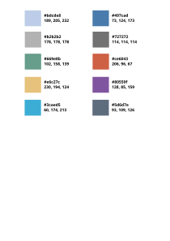

# 图标与 UI 设计规范

> **用途**：本文档是 data-workbench 项目的**图标设计规范**与 **UI 设计规范**的统一基准。它源自 `src/DAGui/icon/` 目录的图标设计实践，并向上扩展为整个项目的视觉语言标准。
>
> **色系唯一权威源**：[`docs/assets/PIC/palette.svg`](../../assets/PIC/palette.svg)（即 §3.1 图 1）。所有图标与界面用色必须取自该色板；任何色值调整必须先更新该图，再在本文档登记（见 §13 变更流程）。
>
> **阅读对象**：AI Agent、UI 设计 contributor、前端界面开发者。
>
> **适用范围**：
>
> - 新增 / 替换 `src/DAGui/icon/` 及 `src/APP/Icon/` 下的 SVG 图标资源
> - DAGui / DACommonWidgets / APP 任意界面模块新增面板、按钮、状态指示等可视元素
> - 插件界面（`plugins/*/`）需要与主程序视觉风格保持一致时

!!! warning "AI 开发强制阅读"
    **如果涉及 SVG 图标的设计（新增、替换、修改任意 `.svg` 图标资源），必须先阅读本文档**，并按 §10 Checklist 逐项核对。未遵循本规范的图标会导致主界面视觉割裂、语义混乱，且无法通过工具栏等比缩放正确渲染。

    涉及图标设计时，源码目录下的 [`src/DAGui/icon/AGENTS.md`](../../../src/DAGui/icon/AGENTS.md) 仅作为目录级入口指引，**完整规范以本文档为准**。

---

## 1. 整体风格定位

data-workbench 的视觉语言围绕「**科研工程工具**」的定位展开，强调精确、克制、信息密度，避免消费级应用的装饰性元素。

### 1.1 设计原则

- **扁平化（Flat Design）**：禁用渐变、阴影、高光、模糊。允许使用 `opacity` / `fill-opacity` 表达层次（如 `expand-all.svg` 用 `fill-opacity="0.7"`）。
- **几何简洁**：线条干净、转角方正，不使用手绘感笔触。
- **线条 + 填充混合**：大多数图标采用「灰色轮廓 + 主色填充」的双层结构。
- **语义化配色**：颜色本身传递含义（绿=确认、红=删除、蓝=主操作、黄=收藏），详见 §3。UI 控件配色沿用同一套语义色板。
- **无文字**：图标中不嵌入任何文字字符（数据类型图标中的 `I/F/T/O` 等是字形图形化绘制的，不是 `<text>` 元素）。
- **边缘紧凑**：图标内容应贴近画布边缘，只保留少量间隙，使其在工具栏中尽量占满显示区域。例如 `32×32` 的图标，绘制区域应在 `30×30` 或 `28×28` 范围内，四周留 1~2 的间隙即可。

### 1.2 UI 一致性原则

图标与界面控件共享同一套色板与几何语言，这意味着：

- 工具栏按钮的图标主色应与该操作的语义色一致（删除按钮的图标用红，确认按钮的图标用绿）。
- 容器型面板的边框、卡片底色与同名图标采用相同的蓝/灰层级（见 §4.1）。
- 状态指示（消息级别、数据类型标记）在图标与 UI 文字配色中保持统一语义。

---

## 2. 画布规格（viewBox）

项目图标混用了多种画布尺寸，按场景选择：

| 场景 | viewBox | 示例 |
|------|---------|------|
| 通用功能图标（200×200） | `0 0 200 200` | `chart.svg`、`setting.svg`、`copy.svg`、`cut.svg` |
| 图表类型图标（64×64） | `0 0 64 64` | `chart-type/*.svg`（DAGui 与 APP 目录）、`axisLeftBottom.svg` |
| 状态/消息图标（32×32） | `0 0 32 32` | `messageType/*`、`accept.svg`、`cancel.svg` |
| iconfont 系图标（1024×1024） | `0 0 1024 1024` | `delete.svg`、`favorite.svg`、`select-all.svg`、`setting-common.svg` |
| 数据类型图标（200×200） | `0 0 200 200` | `data-type/*.svg` |

**新增图标建议**：

- 通用功能图标统一采用 **200×200**（与现有大多数图标一致）
- 图表类小图标采用 **64×64**
- 消息状态类采用 **32×32**
- 不要再引入新的画布尺寸规格（历史遗留的 `chart-spectrocurve.svg` 为 `66.125×64`，仅作现状保留，新增图标不得沿用）

> ⚠️ 即使 `viewBox` 不同，`width`/`height` 属性通常设为 `200` 或 `64`（显示尺寸），由 Qt 渲染时按 `viewBox` 等比缩放。新增图标保留 `width="200" height="200"` 即可。

---

## 3. 核心色系（语义化配色）

> **关键**：颜色不是随意的，每种颜色都承担语义。新增图标或 UI 控件必须按语义从官方色板选色，不要引入新的色值，也不要使用 §3.9 登记的遗留色。色板同时约束图标与界面控件，保证全平台视觉统一。

### 3.1 官方色板（唯一权威源）

官方色板定义在 [`docs/assets/PIC/palette.svg`](../../assets/PIC/palette.svg)，是本项目一切视觉用色的唯一权威来源：



*图 1：官方色板（`docs/assets/PIC/palette.svg`）*

| 色值 | RGB | 名称 | 语义角色 |
|------|-----|------|---------|
| `#5280C1` | 82, 128, 193 | **主蓝（Primary Blue）** | 主操作轮廓、强调元素、数据类型卡片边框；UI 主操作按钮、选中态边框 |
| `#497CAD` | 73, 124, 173 | **深蓝（Secondary Blue）** | 单色图标、链接、工作流连线、轴向标记；图表数据系列首选色 |
| `#BDCDE8` | 189, 205, 232 | **浅蓝（Light Blue）** | 容器背景、次级填充、卡片底色；UI 列表 hover/选中底色 |
| `#727272` | 114, 114, 114 | **中灰（Primary Gray）** | 图标主轮廓线、中性容器边框、未激活元素；UI 普通边框、分隔线 |
| `#B2B2B2` | 178, 178, 178 | **浅灰（Light Gray）** | 次要轮廓、禁用态、副图层；UI 禁用态控件 |
| `#5D6D7E` | 93, 109, 126 | **深蓝灰（Slate）** | 深色中性色：正文文字、深色边框与深色线条 |
| `#669E8B` | 102, 158, 139 | **绿（Success Green）** | 确认、添加、正向操作、成功状态 |
| `#CE6043` | 206, 96, 67 | **橙红（Danger Red）** | 删除、取消、危险操作、错误状态 |
| `#E6C27C` | 230, 194, 124 | **金黄（Favorite Yellow）** | 收藏、文件夹、标记 |
| `#80559F` | 128, 85, 159 | **紫（Series Purple）** | 图表数据系列分类色 |
| `#3CAED5` | 60, 174, 213 | **青蓝（Series Cyan）** | 图表数据系列/强调色 |

基础中性色 **白 `#FFFFFF`**（图标内部留白、卡片与面板底色）为色板隐含色，无需登记即可使用。

三级蓝构成主色系梯度：**深蓝 `#497CAD`（单色/连线）→ 主蓝 `#5280C1`（轮廓/强调）→ 浅蓝 `#BDCDE8`（背景/填充）**。新增任何颜色前必须先更新色板图，见 §13 变更流程。

### 3.2 蓝色系 — 主操作 / 数据 / 链接

| 色值 | 角色 | 典型用途 |
|------|------|---------|
| `#5280C1` | **主蓝（Primary Blue）** | 主操作轮廓、强调元素、数据类型卡片边框；UI 中主操作按钮、选中态边框 |
| `#497CAD` | **深蓝（Secondary Blue）** | iconfont 类单色图标、链接、工作流连线、轴向标记；UI 中次级链接、连线 |
| `#BDCDE8` | **浅蓝（Light Blue Fill）** | 容器背景、次级填充、卡片底色；UI 中列表项 hover/选中底色 |

**用法示例**：

- `data-type/*.svg`：`#5280C1` 画外框 + 字符，`#FFFFFF` 填充内部
- `chart.svg`：`#BDCDE8` 填充绘图区背景，`#5280C1` 绘制曲线
- `setting-link.svg`、`setting-common.svg`：全图单色 `#497CAD`

### 3.3 中性灰系 — 轮廓 / 容器 / 禁用态

| 色值 | 角色 | 典型用途 |
|------|------|---------|
| `#727272` | **中灰（Primary Gray）** | 图标主轮廓线、中性容器边框、未激活元素；UI 中普通边框、分隔线 |
| `#B2B2B2` | **浅灰（Light Gray）** | 次要轮廓、禁用态、副图层；UI 中禁用态控件 |
| `#5D6D7E` | **深蓝灰（Slate）** | 深色中性色：正文文字、深色边框、深色线条（如 `APP/Icon/chart-zoomer.svg`） |

**用法示例**：

- `data-table.svg`：整体 `#727272` 网格线
- `copy.svg`：源对象用 `#727272`，新对象用 `#5280C1`
- `zoomIn.svg`/`zoomOut.svg`：放大镜外圈 `#727272`，内部加号用语义色

### 3.4 语义色 — 绿（确认 / 添加 / 正向操作）

| 色值 | 角色 |
|------|------|
| `#669E8B` | **绿色（Success Green）** |

**典型用途**：

- `accept.svg`：对勾 ✓
- `zoomIn.svg`：放大镜中的「+」
- `right-add.svg`：右下角的「+」
- `copy.svg`：复制出的「+」标记
- `chart-bar.svg`、`chart-OHLC.svg`：图表中的数据系列之一
- `messageTypeInfo.svg`：信息圆圈内的 `i` 字符
- `data-type/datetime.svg`：时钟分针（绿色长针）
- UI 中：成功状态提示、添加/新增操作按钮

### 3.5 语义色 — 红（删除 / 取消 / 危险 / 错误）

| 色值 | 角色 |
|------|------|
| `#CE6043` | **橙红（Danger Red）** — 删除、取消等危险操作与错误状态的统一用色 |

**典型用途**：

- `delete.svg`、`cancel.svg`、`left-remove.svg`：删除/移除按钮
- `zoomOut.svg`：放大镜中的「−」（与 `zoomIn` 的绿色 + 形成对比）
- `chart-bar.svg`、`chart-multibar.svg`：图表中的数据系列之一
- `data-type/datetime.svg`：时钟时针（红色短针）
- `figure-setting.svg`：图表中的柱状元素
- UI 中：删除/危险操作按钮、错误状态文字与图标

> 现有 `messageTypeError.svg` 使用的深红 `#CF3736` 是历史例外色，仅作存量保留，见 §3.9。新增错误状态一律使用 `#CE6043`。

### 3.6 语义色 — 黄（收藏 / 文件夹 / 标记）

| 色值 | 角色 |
|------|------|
| `#E6C27C` | **金黄（Favorite Yellow）** — 收藏星标、文件夹 |

**典型用途**：

- `favorite.svg`：五角星
- `folder.svg`：文件夹主体
- `chart-scatter.svg`：散点图中的某一类点
- `APP/Icon/chart-type/stats-*`：统计数据系列之一
- UI 中：收藏/标记操作、文件夹导航项

### 3.7 语义色 — 紫与青（图表系列分类色）

| 色值 | 角色 | 现状 |
|------|------|------|
| `#80559F` | **紫（Series Purple）** — 图表数据系列分类色 | `chart-scatter.svg` 散点分类、`APP/Icon/chart-type/stats-*` 系列 |
| `#3CAED5` | **青蓝（Series Cyan）** — 图表数据系列/强调色 | `APP/Icon/file.svg`、`APP/Icon/markdown.svg` |

这两个颜色只用于**图表系列分类**或**强调点缀**场景，不得替代主蓝用于通用功能图标的轮廓与主体。

### 3.8 白色

| 色值 | 角色 |
|------|------|
| `#FFFFFF` | **白色** — 图标内部留白、卡片背景填充；UI 面板/卡片底色 |

几乎所有「容器型」图标（`data-type/*`、`question.svg` 的问号、`messageTypeInfo.svg` 的信息点）都用 `#FFFFFF` 作为内部填充，让主色轮廓更突出。

### 3.9 遗留色（不属于官方色板，仅存量保留）

以下色值存在于现有图标中，但**不属于官方色板**。处理规则：

- **新增图标一律禁止使用**；
- 标注「注册例外」的色块是整体引入的历史成套配色，允许该套图标内部延续使用；
- 其余遗留色在下次修订对应图标时，应收敛到右侧列出的官方色。

| 遗留色 | 现存位置 | 处理方式 |
|--------|---------|---------|
| `#CF3736` | `messageTypeError.svg` | 注册例外（messageType 成套，见 §4.5），存量保留 |
| `#FFDE33` / `#FFBC33` | `messageTypeWarning.svg` 黄色三角 | 注册例外（messageType 成套），存量保留 |
| `#495A79` / `#42516D` | `messageTypeWarning.svg` 边框与叹号 | 注册例外（messageType 成套），语义上可由 `#5D6D7E` 替代 |
| `#AD925D` | `folder.svg` 阴影面 | 存量保留，新图标不再引入暗金 |
| `#BFD1EB` | 部分列表/项填充 | 修订时统一为 `#BDCDE8` |
| `#515151` | `data.svg` 表头等 3 处 | 修订时收敛为 `#5D6D7E` |
| `#BFBFBF` / `#7F7F7F` | 个别禁用/次要轮廓 | 修订时收敛为 `#B2B2B2` / `#727272` |
| `#D1D1D1` / `#000000` | 缩放系图标（`zoomIn`/`zoomOut`/`viewAll`）及部分 APP 图标 | 修订时收敛为 `#B2B2B2` / `#727272` |
| `#333333` | iconfont 系（`setting-item`、`setting-link`、`delete`、`castTo*` 等 12 处） | 修订时收敛为 `#497CAD` 或 `#727272` |
| `#575869` / `#64FF6C` / `#27A2DF` / `#E4C651` / `#C7D0DA` / `#808FA1` / `#B3B3B3` | 个别 APP 图标（`item-set-group`、`itemLinkageMove`、`chart-zoomer`、`file`/`markdown`、`removeRow`/`removeColumn` 等） | 修订时收敛为最接近的官方色 |

### 3.10 色板速查（hex 一览）

**官方色板（新增图标只允许使用这些色值 + 白色）**：

| 语义 | 色值 |
|------|------|
| 主蓝 | `#5280C1` |
| 深蓝 | `#497CAD` |
| 浅蓝 | `#BDCDE8` |
| 中灰 | `#727272` |
| 浅灰 | `#B2B2B2` |
| 深蓝灰（深色文字/线） | `#5D6D7E` |
| 绿（成功） | `#669E8B` |
| 橙红（危险/错误） | `#CE6043` |
| 金黄（收藏） | `#E6C27C` |
| 紫（系列分类） | `#80559F` |
| 青蓝（系列/强调） | `#3CAED5` |
| 白 | `#FFFFFF` |

**遗留色（禁止新增使用，见 §3.9）**：`#CF3736`、`#FFDE33`、`#FFBC33`、`#495A79`、`#42516D`、`#AD925D`、`#BFD1EB`、`#515151`、`#BFBFBF`、`#7F7F7F`、`#D1D1D1`、`#000000`、`#333333` 等。

---

## 4. 色彩组合规则

### 4.1 容器型图标（卡片/面板/窗口）

```
外框轮廓：#5280C1（主蓝） 或 #727272（中灰）
内部填充：#FFFFFF（白）
次级元素：#BDCDE8（浅蓝）
```

示例：`data-type/int.svg`、`data.svg`、`question.svg`

> 对应 UI：卡片型面板（数据预览、属性面板）遵循相同的「主蓝/中灰边框 + 白底 + 浅蓝次级块」结构。

### 4.2 功能操作图标（复制/粘贴/剪切等）

```
源对象/中性结构：#727272（中灰）
目标对象/主操作：#5280C1（主蓝）
正向结果标记：#669E8B（绿）
负向结果标记：#CE6043（橙红）
```

示例：`copy.svg`（灰源 + 蓝目标 + 绿加号）、`left-remove.svg`（红箭头 + 金叉）

### 4.3 图表类型图标（chart-type/）

```
数据系列取色池（按优先顺序）：
  #CE6043（橙红）→ #497CAD（深蓝）→ #669E8B（绿）
  → #80559F（紫）→ #E6C27C（金黄）→ #3CAED5（青蓝）
轴线/边框：#727272（中灰）
```

- `DAGui/icon/chart-type/`（14 个）历史上使用系列池前 3 色；`chart-scatter.svg` 因散点分类需要使用 `#80559F`（紫）、`#E6C27C`（金）。
- `APP/Icon/chart-type/`（23 个，含 `stats-*` 统计图表系列）已按系列池取色，且全部落在官方色板内，是新增图表图标的参考范本。
- **图表系列色必须从官方色板取色，不得引入新色**。

**chart-type 子目录强制使用 64×64 viewBox。**

> 对应 UI：图表绘制区曲线/柱状默认按上述系列色顺序取色，保证图标预览与实际渲染一致。

### 4.4 数据类型图标（data-type/）

```
卡片外框：#5280C1（主蓝，宽边框）
卡片背景：#FFFFFF（白）
类型字符：#5280C1（主蓝）
```

所有 `data-type/*.svg`（dataframe/int/float/str/obj/datetime）都遵循这一统一模板，仅中心字符不同。`datetime.svg` 额外用 `#CE6043`（红时针）+ `#669E8B`（绿分针）表达「时间」语义。

### 4.5 消息类型图标（messageType/）

```
Info：    #497CAD（蓝圆圈） + #669E8B（绿 i 字）
Error：   #CF3736（红圆圈） + 白色 X（镂空）
Warning： #FFDE33/#FFBC33（黄三角） + #495A79（深蓝边框/叹号）
Debug：   #497CAD（蓝虫子，单色）
```

> 这套配色来自 iconfont 第三方图标库，是本项目唯一的「官方色板外注册例外」（见 §3.9）。新增同系列消息图标沿用此套色系；其他场景不得引用这些色值。UI 消息队列中 Info/Warning/Error 的文字配色应对齐 §5.1 的官方语义色。

---

## 5. UI 设计规范

本节将上述图标设计语言映射到界面控件，确保图标与 UI 同源。

### 5.1 配色映射

| UI 元素 | 推荐色 | 语义来源 |
|---------|--------|---------|
| 主操作按钮（执行/确认） | `#5280C1` | 主蓝 |
| 危险操作按钮（删除/移除） | `#CE6043` | 橙红 |
| 成功状态文字/图标 | `#669E8B` | 绿 |
| 错误状态文字/图标 | `#CE6043` | 橙红（存量 `messageTypeError` 的 `#CF3736` 为历史例外） |
| 普通边框 / 分隔线 | `#727272` | 中灰 |
| 正文文字 | `#5D6D7E` | 深蓝灰 |
| 禁用态控件 | `#B2B2B2` | 浅灰 |
| 列表项 hover/选中底色 | `#BDCDE8` | 浅蓝 |
| 面板/卡片底色 | `#FFFFFF` | 白 |
| 收藏/标记操作 | `#E6C27C` | 金黄 |

### 5.2 控件风格约定

- **按钮**：扁平化，无渐变/阴影；主操作用主蓝边框或主蓝填充，危险操作用橙红。
- **面板/卡片**：白底 + 中灰或主蓝细边框，圆角与现有 `DACommonWidgets` 保持一致，不自行引入新的圆角半径。
- **列表/树**：选中项底色用浅蓝（`#BDCDE8`），文字用深蓝灰；禁用项用浅灰。
- **状态指示**：与 `messageType/` 图标语义一一对应——Info 蓝、Warning 黄、Error 红、Debug 蓝。
- **图标按钮**：图标主色即操作语义色；hover/pressed 态通过 `opacity` 而非新增色值表达。

### 5.3 图标与 UI 的对应关系

新增 UI 控件时，若该控件带图标，图标配色必须遵循 §3 语义色板，并与控件本身的语义色（按钮色、状态色）一致。例如：

- 一个「删除行」按钮：按钮边框/文字用 `#CE6043`，配套图标 `delete.svg` 同色系。
- 一个「确认」对话框按钮：用 `#5280C1`，配套 `accept.svg` 的对勾用 `#669E8B`。

---

## 6. 图标来源与文件特征

项目图标有三个来源，文件特征略有差异：

### 6.1 Adobe Illustrator 导出（主体）

- 文件头：`<!-- Generator: Adobe Illustrator 16.0.0/21.0.0, SVG Export Plug-In -->`
- 颜色采用 `fill="#XXXXXX"` 内联属性
- 部分使用 `<style>` + `class="stN"` 模式（如 `data.svg`、`workflow.svg`、`question.svg`、`showDataInList.svg`）
- `id="图层_1"` 中文图层名

**新增图标推荐用此风格**，颜色直接用 `fill="#XXXXXX"` 属性形式，便于检索与修改。

### 6.2 iconfont 图标库（少量）

- 文件头含 `class="icon"` 与 `t="时间戳"` 属性
- viewBox 多为 `0 0 1024 1024`
- 颜色用 `fill="#XXXXXX"`，通常整图单色（`#497CAD` 居多，部分历史文件为 `#333333`，属遗留色）
- 含 `p-id="数字"` 属性
- 部分含 `@font-face` 的 `<defs><style>` 残留（可忽略）

代表：`delete.svg`、`favorite.svg`、`node.svg`、`setting-common.svg`、`setting-link.svg`、`setting-node.svg`、`setting-item.svg`、`select-all.svg`、`view-*-marker.svg`、`messageTypeError.svg`、`messageTypeWarning.svg`、`picture.svg`、`node-settting.svg`、`renameColumns.svg`

### 6.3 Inkscape 导出（极少量）

- 文件含 `xmlns:inkscape`、`xmlns:sodipodi`、`<sodipodi:namedview>` 等命名空间
- 代表：`zoomIn.svg`、`zoomOut.svg`

---

## 7. 命名规范

- **文件名**：小驼峰（`camelCase`），如 `axisLeftBottom.svg`、`insertColumnRight.svg`、`zoomIn.svg`
- **子目录**：小写连字符（`kebab-case`），如 `chart-type/`、`data-type/`（注：`messageType` 未采用连字符，是历史遗留，新增子目录请用 `kebab-case`）
- **语义前缀**：
  - `axis*` — 坐标轴方位
  - `chart*` / `chart-type/chart-*` — 图表类型与图表工具
  - `stats-*` — 统计图表类型（`APP/Icon/chart-type/stats-*`）
  - `view-*-marker` — 视图标记（十字线、水平线、垂直线）
  - `setting-*` — 各类设置入口
  - `left/right/top/bottomSide*` — 方向性操作
  - `showDataIn*` — 数据展示方式
  - `session-*` — 会话管理

> 注：`node-settting.svg` 为历史拼写错误的文件名，因资源已被代码引用而保留，新增图标不得沿用此类拼写。

---

## 8. SVG 文件结构要求

新增 SVG 图标应满足以下结构约束，以保证 Qt 渲染兼容与可维护性：

- 根 `<svg>` 必须含 `xmlns="http://www.w3.org/2000/svg"`、`viewBox`、`width`、`height`。
- 颜色优先用 `fill="#XXXXXX"` 内联属性，避免 `<style>` + class（除非复用 Illustrator 的 `stN` 模式）。
- 不引用 `@font-face`、外部图片、`xlink:href`；所有图形用 `<path>`/`<rect>`/`<circle>` 等原生元素绘制。
- 字形（`I/F/T/O` 等）用 `<path>` 绘制，禁止 `<text>` 元素。
- 文件保持静态，不含 `<animate>`、`<animateTransform>` 等动画。

---

## 9. 与项目其他规范的关系

- **官方色板**：`docs/assets/PIC/palette.svg` 是本项目色系的唯一权威源文件，本文档 §3 是其登记与解读；两者不一致时以色板图为准，并应立即修订本文档。
- **编码规范**：UI 控件代码遵循 [coding-standard.md](coding-standard.md) 的命名与注释规则；本文档约束其视觉表现。
- **设置面板**：新增设置面板（`src/DAGui/NodeSetting/`、`ChartSetting/`）的图标与配色遵循本文档，面板结构遵循 [creating-setting-panel.md](creating-setting-panel.md)。
- **国际化**：图标内不含文字，因此无需翻译；但 UI 控件上的文字仍须遵循 [i18n.md](i18n.md) 的 `tr("English") //cn:中文` 模式。
- **模块归属**：通用 SVG 图标资源放在 `src/DAGui/icon/`（界面层 L3）；应用级图标资源放在 `src/APP/Icon/`（应用层 L5）。详见 [module-dependency.md](module-dependency.md)。

---

## 10. AI 生成图标 Checklist

新增或替换图标时，**逐项核对**：

- [ ] **色系权威源**：色值全部取自 §3.1 官方色板（含白色），未引入新色值，未使用 §3.9 遗留色
- [ ] **画布**：通用图标用 `viewBox="0 0 200 200"`，图表小图标用 `0 0 64 64`，消息状态用 `0 0 32 32`
- [ ] **扁平化**：无 `<linearGradient>`、`<radialGradient>`、`<filter>`（阴影/模糊）
- [ ] **语义选色**：
  - 主操作/数据轮廓 → `#5280C1`，单色图标/连线 → `#497CAD`
  - 确认/添加/正向 → `#669E8B`
  - 删除/取消/危险/错误 → `#CE6043`
  - 收藏/文件夹 → `#E6C27C`
  - 中性轮廓 → `#727272`，深色文字/线 → `#5D6D7E`
  - 图表系列分类 → `#80559F` / `#3CAED5`
- [ ] **内部留白**：容器型图标用 `#FFFFFF` 填充内部，不要留空（透明）
- [ ] **无文字**：不使用 `<text>` 元素，字形用 `<path>` 绘制
- [ ] **颜色属性形式**：优先用 `fill="#XXXXXX"` 内联属性，避免 `<style>` + class（除非是复用 Illustrator 的 `stN` 模式）
- [ ] **无外部依赖**：不引用 `@font-face`、外部图片、`xlink:href`
- [ ] **文件名**：`camelCase`，语义清晰
- [ ] **`width`/`height`**：设为 `200`（或对应显示尺寸），`viewBox` 决定缩放

---

## 11. 禁止事项

- ❌ 引入官方色板（`docs/assets/PIC/palette.svg`）之外的新色值（如确有必要，先按 §13 变更流程登记）
- ❌ 新增图标使用 §3.9 登记的遗留色
- ❌ 引入渐变、阴影、发光效果
- ❌ 使用 `<text>` 元素表达图标内容
- ❌ 在 `chart-type/` 子目录引入非 64×64 画布
- ❌ 在 `data-type/` 子目录改变「蓝框白底」的统一容器样式
- ❌ 修改 `messageType/` 的语义色（蓝/红/黄/蓝是稳定的用户认知）
- ❌ 引入动画（`<animate>`、`<animateTransform>` 等）—— 所有图标均为静态
- ❌ UI 控件配色与配套图标语义色不一致（如删除按钮用蓝色图标）

---

## 12. 文件清单速查

### 12.1 `src/DAGui/icon/` 根目录（功能性图标）

| 类别 | 文件 |
|------|------|
| 操作类 | `accept.svg`、`cancel.svg`、`copy.svg`、`cut.svg`、`paste.svg`、`delete.svg`、`renameColumns.svg`、`insertColumnRight.svg` |
| 视图缩放 | `zoomIn.svg`、`zoomOut.svg`、`viewAll.svg` |
| 展开/折叠 | `expand-all.svg`、`collapse.svg` |
| 选择 | `select-all.svg`、`showDataInList.svg`、`showDataInTree.svg` |
| 数据 | `data.svg`、`data-table.svg`、`favorite.svg`、`removeFavorite.svg`、`folder.svg`、`picture.svg` |
| 图表/绘图 | `chart.svg`、`figure-setting.svg`、`plot-setting.svg`、`plot-item-setting.svg`、`data-picker-setting.svg` |
| 节点/工作流 | `node.svg`、`workflow.svg`、`node-settting.svg`、`setting-node.svg` |
| 设置类 | `setting.svg`、`setting-common.svg`、`setting-item.svg`、`setting-link.svg`、`setting-advanced.svg`、`setting-agent.svg`、`setting-log.svg`、`setting-python.svg` |
| 会话 | `session-manager.svg`、`session-new.svg` |
| 坐标轴 | `axisLeftBottom.svg`、`axisLeftTop.svg`、`axisRightBottom.svg`、`axisRightTop.svg`、`axisXBottom.svg`、`axisXTop.svg`、`axisYLeft.svg`、`axisYRight.svg` |
| 方向性 | `leftSideIn.svg`、`leftSideOut.svg`、`rightSideIn.svg`、`rightSideOut.svg`、`topSideIn.svg`、`topSideOut.svg`、`bottomSideIn.svg`、`bottomSideOut.svg`、`right-add.svg`、`left-remove.svg` |
| 标记 | `view-corss-marker.svg`、`view-hline-marker.svg`、`view-vline-marker.svg`、`view-none-marker.svg` |
| 其他 | `clear-message.svg`、`question.svg` |

### 12.2 子目录

| 子目录 | 内容 |
|--------|------|
| `src/DAGui/icon/chart-type/` | 14 个图表类型图标（柱/曲/直方/区间曲/多柱/OHLC/散点/散点 2D/光谱曲/光谱图/矢量场/3D 柱/3D 曲/3D 曲面），统一 64×64 |
| `src/DAGui/icon/data-type/` | 6 个数据类型图标（DataFrame/DateTime/Float/Int/Obj/Str），统一 200×200 蓝框白底 |
| `src/DAGui/icon/messageType/` | 4 个消息级别图标（Debug/Info/Warning/Error），统一 32×32 |
| `src/APP/Icon/chart-type/` | 23 个：14 个 `chart-*`（与 DAGui 对应）+ 9 个 `stats-*` 统计图表（barplot/boxplot/ecdfplot/heatmap/histplot/kdeplot/kdeplot-2d/regplot/scatterplot），统一 64×64，用色全部符合官方色板 |

> `src/APP/Icon/` 根目录还包含大量应用级图标（图表工具 `chart-*`、数据转换 `castTo*`、缩放 `zoomIn/zoomOut` 等），此处不逐一列出；其配色与画布同样受本文档约束。

---

## 13. 变更流程

修改本规范时：

1. 任何新增色值必须**先由项目负责人确认并更新官方色板图 `docs/assets/PIC/palette.svg`**（Inkscape 打开，按现有色块样式追加），再在本文档 §3 登记语义角色，最后才能用于图标或 UI。
2. 画布规格、语义映射的变更须同步更新本文档 §2/§5。
3. 目录级入口指引 [`src/DAGui/icon/AGENTS.md`](../../../src/DAGui/icon/AGENTS.md) 保持精简，仅指向本文档，不重复规范细节。
4. 涉及现有图标批量改色或新增图标的改动，应同步更新 §12 文件清单与 §4 组合规则中的示例；存量遗留色（§3.9）被清理后，应从对应表格中移除记录。
