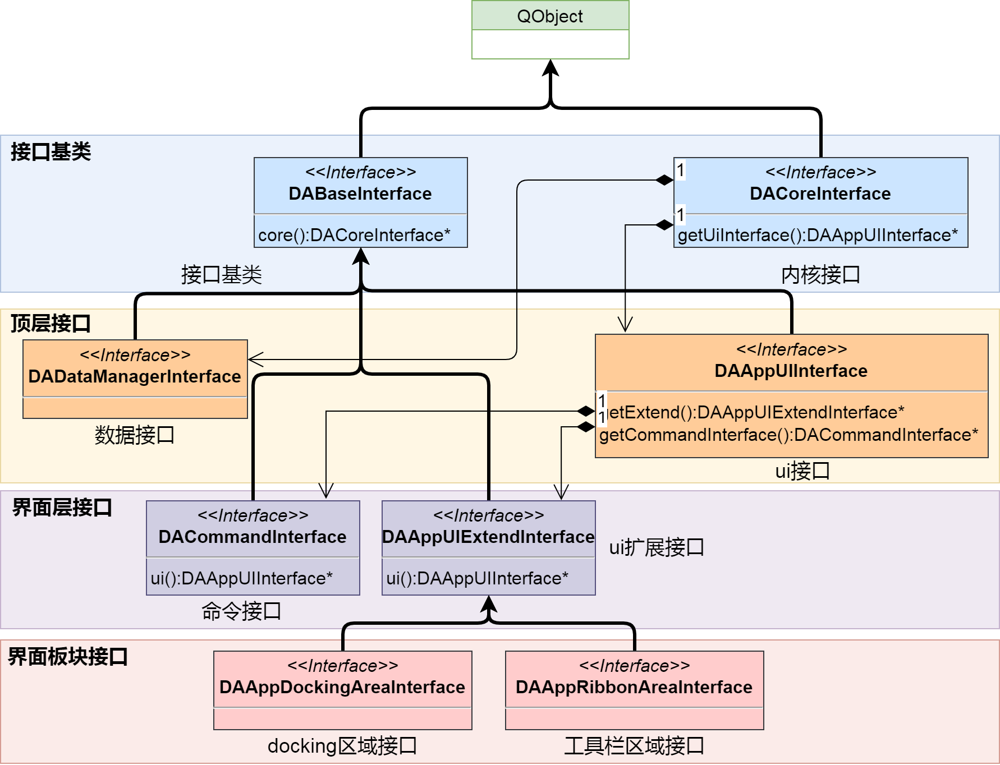
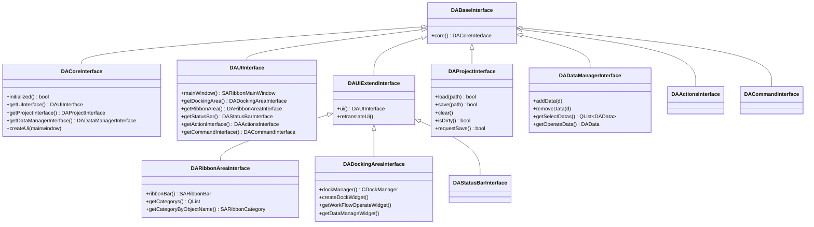
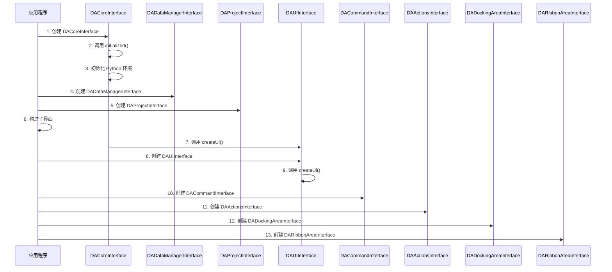
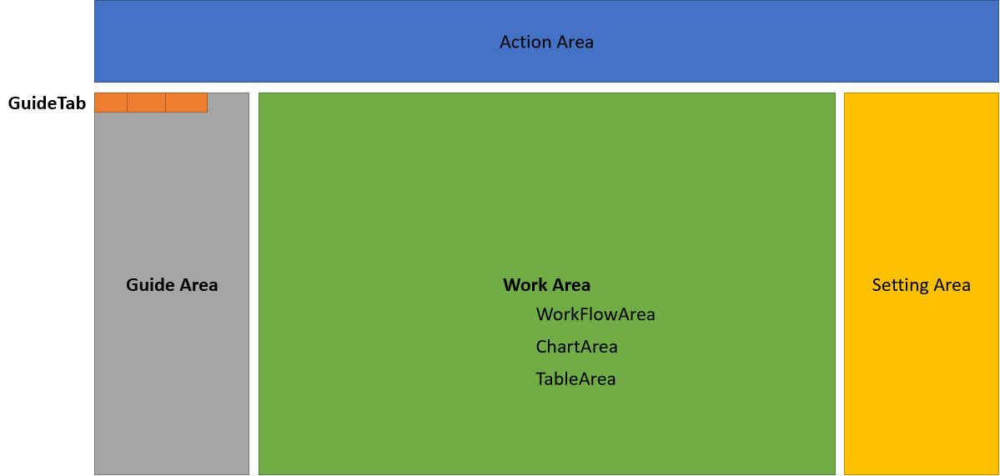

# 接口模块 DAInterface

接口模块 `DAInterface` 是插件系统的核心，提供了一组抽象接口类，使得插件能够与主程序进行解耦交互。所有插件通过接口获取主程序功能，实现松耦合设计。

## 主要功能特性

**特性**

- ✅ **接口抽象**：提供核心接口类，实现主程序与插件的解耦
- ✅ **层次架构**：接口具有清晰的层次关系，便于扩展和获取
- ✅ **生命周期管理**：定义了接口的创建顺序，确保依赖关系正确
- ✅ **Python 支持**：接口支持 Python 绑定，可在 Python 脚本中使用

## 接口层次架构

接口的 UML 类图如下：



### 接口继承关系



### 接口层次说明

| 层次 | 接口类 | 说明 |
|------|--------|------|
| 核心层 | `DACoreInterface` | 顶层核心接口，可获取所有其他接口 |
| 功能层 | `DAUIInterface`, `DAProjectInterface`, `DADataManagerInterface` | 三大功能接口，分别管理界面、工程、数据 |
| 扩展层 | `DARibbonAreaInterface`, `DADockingAreaInterface`, `DAStatusBarInterface` | UI 扩展接口，由 `DAUIInterface` 管理 |
| 辅助层 | `DAActionsInterface`, `DACommandInterface` | 辅助功能接口，提供 Action 管理和命令管理 |

## DACoreInterface 详解

`DACoreInterface` 是接口体系的核心入口，所有其他接口都可以通过此接口获取。

### 核心方法

| 方法 | 返回值 | 说明 |
|------|--------|------|
| `initialized()` | bool | 初始化接口，构造其他接口实例 |
| `getUiInterface()` | DAUIInterface* | 获取界面管理接口 |
| `getProjectInterface()` | DAProjectInterface* | 获取工程管理接口 |
| `getDataManagerInterface()` | DADataManagerInterface* | 获取数据管理接口 |
| `createUi(mainwindow)` | void | 创建界面，在主窗口构造过程中调用 |
| `isProjectDirty()` | bool | 检查工程是否有未保存的更改 |
| `setProjectDirty(bool)` | void | 设置工程的脏标志 |
| `getTempDir()` | QDir | 获取工程的临时目录 |

### 使用示例

```cpp
// 通过核心接口获取其他接口
DA::DACoreInterface* core = getCoreInterface();

// 获取 UI 接口
DA::DAUIInterface* ui = core->getUiInterface();

// 获取工程接口
DA::DAProjectInterface* project = core->getProjectInterface();

// 获取数据管理接口
DA::DADataManagerInterface* dataMgr = core->getDataManagerInterface();

// 检查工程是否有未保存更改
if (core->isProjectDirty()) {
    // 提示用户保存
}
```

## DAUIInterface 详解

`DAUIInterface` 负责管理所有界面相关的功能，包括 Ribbon 界面、Dock 窗口、状态栏等。

### 核心方法

| 方法 | 返回值 | 说明 |
|------|--------|------|
| `mainWindow()` | SARibbonMainWindow* | 获取主窗口指针 |
| `getDockingArea()` | DADockingAreaInterface* | 获取 Dock 区域管理接口 |
| `getRibbonArea()` | DARibbonAreaInterface* | 获取 Ribbon 区域管理接口 |
| `getStatusBar()` | DAStatusBarInterface* | 获取状态栏管理接口 |
| `getActionInterface()` | DAActionsInterface* | 获取 Action 管理接口 |
| `getCommandInterface()` | DACommandInterface* | 获取命令管理接口 |
| `addInfoLogMessage(msg, showInStatusBar)` | void | 添加信息日志 |
| `addWarningLogMessage(msg, showInStatusBar)` | void | 添加警告日志 |
| `addCriticalLogMessage(msg, showInStatusBar)` | void | 添加错误日志 |
| `setColorTheme(theme)` | void | 设置颜色主题 |
| `getColorTheme()` | DAColorTheme | 获取当前颜色主题 |

### 使用示例

```cpp
// 获取 UI 接口
DA::DAUIInterface* ui = core->getUiInterface();

// 获取主窗口
SARibbonMainWindow* mainWindow = ui->mainWindow();

// 显示日志信息
ui->addInfoLogMessage(tr("操作成功完成"), true);

// 获取 Dock 区域接口
DA::DADockingAreaInterface* dockArea = ui->getDockingArea();

// 创建自定义 Dock 窗口
QWidget* myWidget = new QWidget(mainWindow);
ads::CDockWidget* dock = dockArea->createDockWidget(
    myWidget, 
    ads::RightDockWidgetArea, 
    tr("我的窗口")
);
```

## DADataManagerInterface 详解

`DADataManagerInterface` 负责管理所有数据对象，提供数据的增删查改操作。

### 核心方法

| 方法 | 返回值 | 说明 |
|------|--------|------|
| `dataManager()` | DADataManager* | 获取底层数据管理器 |
| `addData(d)` | void | 添加数据 |
| `removeData(d)` | void | 移除数据 |
| `getDataCount()` | int | 获取数据数量 |
| `getSelectDatas()` | QList<DAData> | 获取当前选中的数据 |
| `getOperateData()` | DAData | 获取当前正在操作的数据 |
| `getOperateDataSeries()` | QList<int> | 获取当前操作数据的选中列 |
| `findData(name)` | DAData | 按名称查找数据 |
| `findDatas(pattern)` | QList<DAData> | 按通配符查找数据 |
| `getAllDatas()` | QList<DAData> | 获取所有数据 |

### 信号

| 信号 | 参数 | 触发时机 |
|------|------|----------|
| `dataAdded(d)` | DAData | 数据添加时 |
| `dataBeginRemove(d, index)` | DAData, int | 数据准备删除时 |
| `dataRemoved(d, oldIndex)` | DAData, int | 数据删除后 |
| `dataChanged(d, type)` | DAData, ChangeType | 数据信息改变时 |

### 使用示例

```cpp
// 获取数据管理接口
DA::DADataManagerInterface* dataMgr = core->getDataManagerInterface();

// 添加数据
DAData data = createDataFrame();
dataMgr->addData(data);

// 获取选中的数据
QList<DAData> selectedDatas = dataMgr->getSelectDatas();

// 获取当前操作的数据
DAData operateData = dataMgr->getOperateData();

// 按名称查找数据
DAData foundData = dataMgr->findData("my_data");

// 监听数据变化
connect(dataMgr, &DA::DADataManagerInterface::dataAdded,
        this, &MyClass::onDataAdded);
```

## DAProjectInterface 详解

`DAProjectInterface` 负责工程文件的加载、保存和管理。

### 核心方法

| 方法 | 返回值 | 说明 |
|------|--------|------|
| `load(path)` | bool | 加载工程文件 |
| `save(path)` | bool | 保存工程文件 |
| `clear()` | void | 清空工程 |
| `isEmpty()` | bool | 检查工程是否为空 |
| `isDirty()` | bool | 检查工程是否有未保存更改 |
| `setModified(bool)` | void | 设置工程修改标志 |
| `requestSave()` | bool | 请求保存，弹出保存对话框 |
| `getProjectBaseName()` | QString | 获取工程文件基础名 |
| `getProjectDir()` | QString | 获取工程目录 |
| `getProjectFilePath()` | QString | 获取工程文件完整路径 |
| `isBusy()` | bool | 检查工程是否繁忙（正在保存） |

### 信号

| 信号 | 参数 | 触发时机 |
|------|------|----------|
| `projectBeginLoad(path)` | QString | 工程开始加载时 |
| `projectLoaded(path)` | QString | 工程加载完成时 |
| `projectBeginSave(path)` | QString | 工程开始保存时 |
| `projectSaved(path)` | QString | 工程保存完成时 |
| `dirtyStateChanged(on)` | bool | 工程脏状态改变时 |
| `projectIsCleaned()` | 无 | 工程被清空时 |

### 使用示例

```cpp
// 获取工程接口
DA::DAProjectInterface* project = core->getProjectInterface();

// 加载工程
if (project->load("/path/to/project.dapro")) {
    qDebug() << "工程加载成功";
}

// 保存工程
if (project->save("/path/to/project.dapro")) {
    qDebug() << "工程保存成功";
}

// 获取工程信息
QString projectDir = project->getProjectDir();
QString projectName = project->getProjectBaseName();

// 监听工程状态变化
connect(project, &DA::DAProjectInterface::projectSaved,
        this, &MyClass::onProjectSaved);
```

## 接口获取方法

### 从插件获取接口

插件开发中，通常通过 `DACoreInterface` 获取其他接口：

```cpp
// 插件初始化时获取核心接口
void MyPlugin::initialize(DA::DACoreInterface* core)
{
    mCore = core;
    
    // 获取 UI 接口
    mUI = core->getUiInterface();
    
    // 获取 Dock 区域接口
    mDockArea = mUI->getDockingArea();
    
    // 获取数据管理接口
    mDataMgr = core->getDataManagerInterface();
    
    // 获取工程接口
    mProject = core->getProjectInterface();
}
```

### 从子接口获取核心接口

所有继承自 `DABaseInterface` 的接口都可以通过 `core()` 方法获取核心接口：

```cpp
// 在扩展接口中获取核心接口
DA::DACoreInterface* core = uiInterface->core();

// 获取其他接口
DA::DAProjectInterface* project = core->getProjectInterface();
```

### 从 UI 扩展接口获取 UI 接口

继承自 `DAUIExtendInterface` 的接口可以通过 `ui()` 方法获取 UI 接口：

```cpp
// 在 Ribbon 或 Dock 接口中获取 UI 接口
DA::DAUIInterface* ui = ribbonArea->ui();

// 然后获取其他接口
DA::DAStatusBarInterface* statusBar = ui->getStatusBar();
```

## 接口创建顺序

接口创建过程有严格的先后顺序，以避免在一个接口中调用尚未创建的接口。



### 详细创建顺序

1. **DACoreInterface** - 首先创建核心接口
2. **initialized()** - 调用初始化方法
3. **initializePythonEnv()** - 初始化 Python 环境
4. **DADataManagerInterface** - 创建数据管理接口
5. **DAProjectInterface** - 创建工程管理接口
6. **主界面构造** - 构造 SARibbonMainWindow
7. **createUi()** - 调用核心接口的 createUi 方法
8. **DAUIInterface** - 创建 UI 接口
9. **DAUIInterface::createUi()** - 调用 UI 接口的 createUi 方法
10. **DACommandInterface** - 创建命令接口
11. **DAActionsInterface** - 创建 Action 管理接口
12. **DADockingAreaInterface** - 创建 Dock 区域接口
13. **DARibbonAreaInterface** - 创建 Ribbon 区域接口

## App 区域划分

整个 App 的区域划分如下图所示：



| 区域 | 接口 | 说明 |
|------|------|------|
| Action Area | `DARibbonAreaInterface` | Ribbon 工具栏区域，包含各种操作按钮 |
| Data Area | `DADockingAreaInterface` | 数据管理区域，包含数据管理和操作窗口 |
| Chart Area | `DADockingAreaInterface` | 图表区域，包含图表管理和操作窗口 |
| Workflow Area | `DADockingAreaInterface` | 工作流区域，包含工作流节点列表和编辑窗口 |
| Status Area | `DAStatusBarInterface` | 状态栏区域，显示状态信息和进度条 |

## 注意事项

!!! warning "接口创建顺序"
    在接口构造过程中，必须严格遵循创建顺序。在早期创建的接口中不能调用尚未创建的接口，否则会导致空指针异常。

!!! warning "线程安全"
    所有接口方法应在主线程中调用。如需在后台线程操作数据，应使用信号槽机制将操作转发到主线程执行。

!!! info "Python 支持"
    接口模块支持 Python 绑定，可以在 Python 脚本中使用这些接口。Python 绑定定义在 `DAInterfacePythonBinding.h` 中。

!!! tip "获取接口"
    推荐在插件初始化时保存接口指针，避免重复获取。所有继承自 `DABaseInterface` 的接口都可以通过 `core()` 方法获取核心接口。

## 参考资料

- [插件开发指南](plugin-project-create.md)
- [插件与接口](plugins-interfaces.md)
- [模块依赖关系](module-dependency.md)