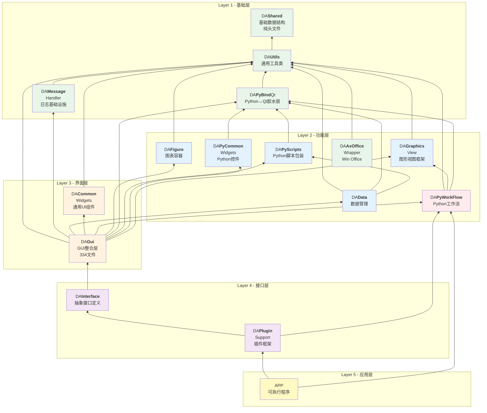

# 模块依赖关系说明

data-workbench采用分层模块化架构，各模块之间有明确的依赖关系。本文档详细说明模块的层次结构、职责边界和依赖配置。

---

## 主要模块概览

| 模块 | 层 | 类型 | 简述 | 文件数 |
|------|---|------|------|:------:|
| **DAShared** | L1 基础层 | 纯头文件 | 基础数据结构、枚举↔字符串映射、Qt5/Qt6兼容、并发容器 | 19 |
| **DAUtils** | L1 基础层 | 共享库 | XML序列化、字符串转换、CSV读写、目录管理、颜色主题、翻译管理 | 40 |
| **DAMessageHandler** | L1 基础层 | 共享库 | spdlog初始化、Qt消息路由、线程安全日志队列 | 9 |
| **DAPyBindQt** | L1 基础层 | 共享库 | pybind11类型转换器、Python解释器生命周期、numpy/pandas绑定 | 28 |
| **DAPyScripts** | L2 功能层 | 共享库 | Python脚本I/O、DataFrame操作、信号处理函数C++包装 | 12 |
| **DAPyCommonWidgets** | L2 功能层 | 共享库 | DataFrame列选择器、dtype下拉框 | 13 |
| **DAPyWorkFlow** | L2 功能层 | 共享库 | Python工作流节点代理、工厂、场景、执行引擎、图形项 | 43 |
| **DAData** | L2 功能层 | 共享库 | 抽象数据基类、DAData包装器、数据管理器、Python数据封装、撤销命令 | 22 |
| **DACommonWidgets** | L3 界面层 | 共享库 | 属性面板、颜色选择器、样式编辑器、设置对话框、对齐/文件编辑 | 82 |
| **DAGraphicsView** | L2 功能层 | 共享库 | QGraphicsView框架（场景、视图、图元、连线、动作、撤销命令） | 54 |
| **DAFigure** | L2 功能层 | 共享库 | Qwt图表容器、图表编辑器、数据探针、序列化 | 103 |
| **DAGui** | L3 界面层 | 共享库 | 工作流UI、图表设置面板、数据管理UI、Model/View、对话框 | 334 |
| **DAInterface** | L4 接口层 | 共享库 | 抽象接口定义（Core/UI/Docking/Ribbon/Actions/Command/DataManager/Project） | 28 |
| **DAPluginSupport** | L4 接口层 | 共享库 | 插件框架（DAAbstractPlugin/DAPluginManager/DAAbstractNodePlugin） | 10 |
| **APP** | L5 应用层 | 可执行程序 | 主程序、接口具体实现、项目文件管理、插件管理 | 190 |
| **DAAxOfficeWrapper** | L1 基础层 | 共享库 | Windows Office自动化封装（仅Win） | 10 |

---

## 五层架构图

```
┌──────────────────────────────────────────────────────────┐
│ Layer 5: 应用层          │ APP                           │
├──────────────────────────────────────────────────────────┤
│ Layer 4: 接口层          │ DAInterface, DAPluginSupport  │
├──────────────────────────────────────────────────────────┤
│ Layer 3: 界面层          │ DAGui, DACommonWidgets        │
├──────────────────────────────────────────────────────────┤
│ Layer 2: 功能层          │ DAData, DAFigure, DAPyWorkFlow│
│                          │ DAGraphicsView, DAPyScripts,  │
│                          │ DAPyCommonWidgets             │
├──────────────────────────────────────────────────────────┤
│ Layer 1: 基础层          │ DAShared, DAUtils,            │
│                          │ DAMessageHandler, DAPyBindQt  │
└──────────────────────────────────────────────────────────┘
```

---

## 模块构建依赖顺序

```
基础层: DAShared → DAUtils
       ├──→ DAAxOfficeWrapper (仅 Win)
       └──→ DAMessageHandler
Python层: DAPyBindQt → DAPyScripts → DAPyCommonWidgets → DAPyWorkFlow
功能层: DAData (→DAUtils, DAPyBindQt, DAPyScripts)
       DACommonWidgets (→DAUtils)
       DAGraphicsView (→DAUtils)
       DAFigure (→DAUtils + Qwt)
界面层: DAGui (→ 上述所有模块 + SARibbon/ADS/qwt/DALiteCtk/quazip)
接口层: DAInterface (→DAGui)
       DAPluginSupport (→DAInterface + DAPyWorkFlow)
应用层: APP (→DAPluginSupport + DAPyWorkFlow)
```

---

## 模块依赖矩阵

下表列出每个模块的**直接**依赖（CMake `target_link_libraries`）：

| 模块 | PUBLIC 直接依赖 | PRIVATE 直接依赖 | 外部关键依赖 |
|------|----------------|-----------------|-------------|
| **DAShared** | — | — | Qt::Core |
| **DAUtils** | Qt::Core/Gui/Widgets/Xml | — | — |
| **DAAxOfficeWrapper** | DAUtils, Qt::Core/Gui/Widgets/AxContainer | — | Windows only |
| **DAMessageHandler** | Qt::Core/Gui/Widgets/Xml | DAUtils | spdlog |
| **DAPyBindQt** | Qt::Core, pybind11::headers | DAUtils, Python3 | numpy, pandas |
| **DAPyScripts** | Qt::Core, DAPyBindQt, pybind11 | — | Python3 |
| **DAPyCommonWidgets** | Qt::Core/Gui/Widgets, DAPyBindQt, pybind11 | — | Python3 |
| **DAPyWorkFlow** | DAUtils, DAGraphicsView, DAPyBindQt | Qt::Core/Gui/Widgets | Python3, pybind11 |
| **DAData** | Qt::Core/Gui/Widgets, DAPyBindQt, DAPyScripts | DAUtils | Python3, pybind11 |
| **DACommonWidgets** | Qt::Core/Gui/Widgets/Xml, DALiteCtk, SARibbon, QtPropertyBrowser | DAUtils | — |
| **DAGraphicsView** | Qt::Core/Gui/Widgets/Xml/Svg | DAUtils | — |
| **DAFigure** | Qt::Core/Gui/Widgets/PrintSupport/Concurrent/OpenGL, Qwt | DAUtils | — |
| **DAGui** | DAUtils, DAMessageHandler, DAData, DACommonWidgets, DAPyWorkFlow, DAFigure, DAPyBindQt, DAPyScripts, DAPyCommonWidgets, Qt, SARibbon, QtAdvancedDocking, qwt, DALiteCtk, quazip | Qt6::Core5Compat (if Qt6) | Python3, pybind11 |
| **DAInterface** | **DAGui** (PUBLIC → 传递至所有消费者) | Qt, SARibbon, QtAdvancedDocking, qwt, DALiteCtk | Python3, pybind11 |
| **DAPluginSupport** | **DAInterface** (PUBLIC), **DAPyWorkFlow** (PUBLIC), Qt | QtAdvancedDocking | Python3, pybind11 |
| **APP** | **DAPluginSupport**, DAPyWorkFlow, Qt, DALiteCtk, SARibbon, QtAdvancedDocking, qwt | — | Dbghelp (Win) |

---

## 依赖方向规则（铁律）

### 规则

1. **上层可以依赖下层，下层绝不能依赖上层。**
   - ✅ DAGui → DAUtils（界面层依赖基础层）
   - ❌ DAUtils → DAGui（基础层绝不能依赖界面层）
2. **同层模块尽量减少直接依赖**，通过上层整合模块（DAGui）协调。
3. **Python 相关模块**（DAPyBindQt/DAPyScripts/DAPyCommonWidgets/DAPyWorkFlow）仅在 `DA_ENABLE_PYTHON=ON` 时编译。
4. **DAShared 是纯头文件库**，所有模块可通过 include path 直接使用其头文件，无需显式 CMake 链接。

### 模块依赖关系图



---

## 各模块职责详解

### 基础层 (L1)

#### DAShared — 纯头文件模板库

职责：提供全项目通用的基础数据结构和工具模板，**纯头文件，无 .cpp 编译单元**。

提供内容：
- 数据结构：`DAVector`（命名向量）、`DAAutoincrementSeries`（等差数列）、6种二维表格（固定/稀疏/稠密/列式/行式）、并发容器
- 工具宏/模板：`DAEnumStringUtils`（枚举↔字符串映射）、`da_qt5qt6_compat`（Qt5/Qt6兼容层）、`da_qstring_cast`（类型转换）
- 其他：`DASignalBlockers`（批量信号阻塞）、`DAQtContainerUtil`（QSet↔QList转换）、`DAGenericIndexedContainer`（环形索引容器）

外部依赖：仅 `Qt::Core`

#### DAUtils — 通用工具模块

职责：为所有上层模块提供通用工具类。

提供内容：
- XML序列化：`DAXMLFileInterface`（序列化基类）、`DAXMLConfig`、`DAXMLProtocol`
- 字符串/类型：`DAStringUtil`、`DAQtEnumTypeStringUtils`（Qt枚举↔字符串映射）
- 文件/IO：`DACsvStream`、`DATextReadWriter`、`DADir`（应用目录管理）
- 其他：`DAColorTheme`（30+调色板）、`DATranslatorManeger`（国际化）、`DAProperties`（键值属性）、`DATree/DATreeItem`、`DAUniqueIDGenerater`、`DAProcess`

外部依赖：Qt::Core/Gui/Widgets/Xml

#### DAMessageHandler — 日志基础设施

职责：基于 spdlog 的应用级日志系统，Qt 消息路由。

提供内容：
- `daRegisterRotatingMessageHandler()` / `daRegisterConsolMessageHandler()` — 安装 Qt→spdlog 消息处理
- `DAMessageQueueProxy` — 线程安全消息队列（QObject，有信号）
- `DAMessageLogItem` — 单条日志消息数据结构

外部依赖：Qt::Core/Gui/Widgets/Xml, DAUtils (PRIVATE), spdlog

消费者：DAGui（`DAMessageLogsModel` 用于日志面板）、APP（main.cpp 注册日志处理器）

#### DAPyBindQt — Python↔Qt 胶水层

职责：pybind11 类型转换器、Python 解释器管理、numpy/pandas 绑定。**所有 Python 相关代码的基础**。

提供内容：
- 类型转换器（`DAPybind11QtCaster.hpp`）：QString↔str、QDateTime↔datetime、QVariant↔Any、QList/Vector/Set/Map/Hash↔list/dict/set 双向转换
- Python 环境：`DAPyInterpreter`（解释器生命周期）
- py::object 包装：`DAPyObjectWrapper`、`DAPyModule`（模块管理）
- JSON 转换：`DAPyJsonCast`（QJsonObject↔py::dict 双向）
- 线程安全：`DAPythonSignalHandler`（Python线程→Qt主线程）
- NumPy：`DAPyModuleNumpy`、`DAPyDType`（dtype 包装+类型检查）
- Pandas：`DAPyModulePandas`、`DAPyDataFrame`、`DAPySeries`、`DAPyIndex`

外部依赖：Qt::Core, DAUtils (PRIVATE), Python3, pybind11::headers (PUBLIC)

---

### 功能层 (L2)

#### DAPyScripts — Python 脚本包装

职责：将 `DAWorkbench` Python 模块的 I/O/DataFrame/信号处理 函数暴露为 C++ API。

提供内容：
- `DAPyScripts`（门面单例）→ `DAPyWorkBench`（包装 Python `DAWorkbench` 模块）
  - `DAPyScriptsIO` — 文件读写（CSV/TXT/PKL）
  - `DAPyScriptsDataFrame` — DataFrame 操作（插入/删除/排序/查询/透视表/异常值检测，35+方法）
  - `DAPyScriptsDataProcess` — 信号处理（频谱/滤波/峰值/STFT/小波）

外部依赖：DAPyBindQt (PUBLIC), Python3

消费者：DAData, DAGui, APP, plugins

#### DAPyCommonWidgets — Python 通用控件

职责：与 pandas DataFrame/Series 相关的基础 UI 控件。

提供内容：
- `DAPyDataframeColumnsListWidget` — DataFrame 列名列表（带 dtype 图标）
- `DAPyDTypeComboBox` — numpy/pandas dtype 选择下拉框（含 nullable 扩展类型）

外部依赖：DAPyBindQt (PUBLIC), Python3, pybind11

消费者：DAGui (PUBLIC link), APP (传递依赖)

#### DAPyWorkFlow — Python 工作流节点 ⚠️

职责：Python 工作流核心 — 节点代理、工厂、场景、执行引擎、图形项、序列化。

**⚠️ 注意：此模块由 AI 编写，存在类放置错误（见下方§反模式警告）。**

提供内容：
- 节点核心：`DAPyNodeProxy`（C++↔Python节点桥接）、`DAPyNodeFactory`（Python节点发现）
- 可视化：`DAPyNodeGraphicsItem`、`DAPyLinkGraphicsItem`、`DAPyLinkPoint`
- 场景/执行：`DAPyWorkFlowScene`、`DAPyWorkFlowExecuter`（拓扑排序+QThread执行）
- 序列化：`DAPyWorkFlowSceneSerializer`、撤销命令工厂
- 样式系统：`DAPyNodeStyle`、`DAPyNodeStyleDefine`、`DAPyNodePalette`

外部依赖：DAUtils, DAGraphicsView, DAPyBindQt (all PUBLIC), Python3, pybind11

消费者：DAGui (PUBLIC link), DAPluginSupport (PUBLIC link), APP (传递)

#### DAData — 数据管理

职责：数据抽象层，管理数据对象和操作。

提供内容：
- 抽象数据基类：`DAAbstractData`（6种 DataType 枚举）
- 数据包装器：`DAData`（轻量值类型，引用语义），`DADataPyObject/DataFrame/Series`（Python数据封装）
- 数据管理器：`DADataManager`（QObject，含 QUndoStack）
- 撤销命令：`DACommandDataManagerAdd/Remove/Rename`、`DADataObjectSwapUndoCommand/PersistUndoCommand`

外部依赖：DAUtils (PRIVATE), DAPyBindQt + DAPyScripts (PUBLIC, Python时)

消费者：DAGui (PUBLIC link → 40+文件)，DAInterface (传递)，APP (传递)

#### DAGraphicsView — 图形视图框架

职责：通用 QGraphicsView/QGraphicsScene 框架，提供基类但不含业务图元。

提供内容：
- 核心：`DAGraphicsView`（含缩放/平移/标记）、`DAGraphicsScene`（含网格/链接模式/撤销栈）
- 图元：`DAGraphicsItem`（基类）→ `DAGraphicsResizeableItem`（可缩放）→ `DAGraphicsRectItem/TextItem/PixmapItem`
  - `DAGraphicsLinkItem`（连线图元，贝塞尔/直线/折线）
  - `DAGraphicsItemGroup`、`DAGraphicsStandardTextItem`、`DAGraphicsMarkItem` 等
- 动作：`DAAbstractGraphicsSceneAction`（场景动作）、`DAAbstractGraphicsViewAction`
- 撤销命令：14个 QUndoCommand 子类（增删移动缩放旋转分组等）
- 工厂：`DAGraphicsItemFactory`（反射工厂）

外部依赖：DAUtils (PRIVATE), Qt::Core/Gui/Widgets/Xml/Svg

消费者：DAPyWorkFlow (PUBLIC link → 通过继承实现业务图元)，DAGui (传递)

#### DAFigure — 图表容器

职责：基于 Qwt 的纯 C++ 图表系统（无 Python 依赖）。

提供内容：
- 容器：`DAFigureWidget`（QScrollArea，QwtFigure布局）、`DAChartWidget`（QwtPlot + 3个接口Mixin）
- 编辑器：`DAAbstractChartEditor`→`DAAbstractTwoPointEditor`（→`DAChartArrowEditor`）、`DAAbstractRegionSelectEditor`（→三个区域选择子类）
- 探针：`DADataProbeMarker`（数据点探针）
- 序列化：`DAChartSerialize`（15+ QwtPlotItem 类型二进制序列化）
- 树视图：`DAFigureTreeView` + Models（图/子图/图元/轴 层级导航）
- 撤销命令：`DAFigureWidgetCommands`（创建/删除/调整大小/附加图元）

外部依赖：DAUtils (PRIVATE), Qwt (PUBLIC), Qt OpenGL/PrintSupport/Concurrent

消费者：DAGui (PUBLIC link → 图表设置面板)，APP (传递 → 主窗口集成)

---

### 界面层 (L3)

#### DACommonWidgets — 通用 UI 组件

职责：通用 UI 控件和编辑器，不绑定任何业务特定功能。

提供内容：
- 属性面板：`DAPropertyPanelWidget/ContainerWidget/ItemWidget`、`DACollapsiblePanel/GroupBox`
- 样式编辑器：`DAColorPickerButton`、`DABrushEditWidget/StyleComboBox`、`DAPenEditWidget/StyleComboBox`、`DAFontEditPannelWidget`、`DAShapeEditPannelWidget`
- 对齐/位置：`DAAligmentEditWidget`、`DAAligmentPositionEditWidget`（9宫格定位）
- 文件/路径：`DAFilePathEditWidget`、`DAPathLineEdit`
- 设置对话框：`DASettingDialog/Widget`、`DAAbstractSettingPage`、`DACommonPropertySettingDialog`
- 工具：`DAWaitCursorScoped`、`DACursorScoped`、`DAScrollArea`

外部依赖：DAUtils (PRIVATE), DALiteCtk, SARibbon, QtPropertyBrowser (PUBLIC)

消费者：DAGui (PUBLIC link)，APP + DAPluginSupport (传递依赖)

#### DAGui — GUI 整合层（最大模块，334 文件）

职责：整合所有模块的 GUI 组件，提供完整用户界面。

子目录：
- `ChartSetting/` (36文件) — 每种图表类型的属性设置面板 + 工厂
- `NodeSetting/` (8文件，Python only) — 通用节点参数面板系统（参数类型注册+SceneB模式）
- `Commands/` (8文件) — 工作流/DataFrame 撤销命令
- `Dialog/` (23文件) — 对话框（图表向导、导入、列类型转换、Python参数等）
- `MimeData/` (3文件) — 拖放 MIME 数据类型
- `Models/` (22文件) — Qt Model/View 模型（数据树、表格、消息日志、Python数据）

根级 (116+ 文件)：
- 工作流 UI：`DAPyWorkFlowEditWidget/GraphicsView/Scene` 等
- 图表 UI：`DAChartOperateWidget/ManageWidget`、12种图表添加Widget
- 数据 UI：`DADataManageWidget/OperateWidget`、`DAPyDataFrameTableView` 等
- 工具：`DASplashScreen`、`DAZipArchive`、`DARecentFilesManager`

外部依赖：**所有下层模块** + SARibbon/ADS/qwt/DALiteCtk/quazip

消费者：DAInterface (PUBLIC link → 传递至所有消费者)

---

### 接口层 (L4)

#### DAInterface — 抽象接口定义

职责：定义抽象接口契约，解耦插件和 APP 具体实现。

提供内容：
- `DACoreInterface` — 核心单例入口
- `DAUIInterface` — UI 聚合接口
  - `DAActionsInterface` — QAction 注册/查找
  - `DACommandInterface` — QUndoGroup 管理
  - `DADockingAreaInterface` — 停靠区域管理（8个dock区域）
  - `DARibbonAreaInterface` — Ribbon 栏管理
  - `DAStatusBarInterface` — 状态栏管理
  - `DADataManagerInterface` — 数据管理器包装
- `DAProjectInterface` — 项目文件读写
- `DAInterfaceHelper` — 所有接口的一站式便捷访问

外部依赖：**DAGui** (PUBLIC → 传递所有 DAGui 依赖给消费者)

消费者：DAPluginSupport (PUBLIC link), APP (传递)

#### DAPluginSupport — 插件框架

职责：插件加载/卸载管理和插件基类定义。

提供内容：
- `DAAbstractPlugin` — 插件基类（纯虚接口）
- `DAAbstractNodePlugin` — 工作流节点插件基类
- `DAPluginManager` — 插件发现/加载/卸载管理器
- `DAPluginOption` — 插件元数据

外部依赖：DAInterface + DAPyWorkFlow (both PUBLIC)

消费者：APP (PUBLIC link), plugins/ 目录下所有插件

---

### 应用层 (L5)

#### APP — 主程序

职责：可执行程序，所有抽象接口的具体实现，整合所有模块。

提供内容：
- `DAAppCore` — 核心单例，初始化所有子系统
- `AppMainWindow` — 主窗口（SARibbonMainWindow 子类）
- `DAAppUI` — Ribbon/Docking 布局管理
- `DAAppController` — MVC 控制器
- `DAAppPluginManager` — 插件管理器具体实现
- `DAAppProject` — 项目文件序列化
- `DAAppDataManager/DockingArea/RibbonArea/StatusBar/Command/Actions` — 各 Interface 的具体实现
- `SettingPages/` — 设置页面（通用设置、应用配置）
- `Dialog/` — 应用级对话框（关于、PNG导出）
- `PythonBinding/` — pybind11 应用绑定（Python触发UI操作）

外部依赖：DAPluginSupport + DAPyWorkFlow (PUBLIC), Qt全组件, 所有第三方库

---

## ⚠️ 反模式警告：DAPyWorkFlow 的类放置错误

`src/DAPyWorkFlow` 模块（43文件）由 AI 编写，**多个类放错了位置**。这导致了不合理依赖和代码复用障碍。

| 错放类 | 当前位置 | 应该放在 | 原因 |
|-------|---------|---------|------|
| `DAPyGILGuard` / `DAPyGILRelease` / `DAPySafePyObjectHolder` | `DAPyWorkFlow/DAPyGILGuard.*` | **`DAPyBindQt/`** | 通用 pybind11 GIL RAII 工具，零工作流逻辑。DAPyBindQt 已有类似 `DAPyObjectWrapper`。当前导致：其他需要 GIL 的模块无法使用。 |
| `DAParameterDescriptor` | `DAPyWorkFlow/DAParameterDescriptor.h` | **`DAPyBindQt/`** 或 **`DAShared/`** | 纯 JSON 数据描述符。当前导致 **DAGui → DAPyWorkFlow** 反向依赖（DAGui/NodeSetting 引入 `DAPyWorkFlow/DAParameterDescriptor.h`）。（注：DAGui/NodeSetting/ 下有同名 `ParameterDescriptor.h`） |
| `DAPortDescriptor` | `DAPyWorkFlow/DAPortDescriptor.h` | **`DAPyBindQt/`** 或 **`DAShared/`** | 同上。纯数据描述符，无工作流逻辑。 |
| `DAPyPainterProxy` | `DAPyWorkFlow/DAPyPainterProxy.*` | 可考虑 **`DAPyBindQt/`** | QPainter↔Python 桥接，无工作流逻辑。但仅用于节点绘制回调，可保留。 |

**将来重构时**：应将上述类移至正确模块，并清理相关 #include 和 CMake 依赖。这将：
1. 让 `DAPyGILGuard` 可被所有 Python 模块使用
2. 消除 `DAGui → DAPyWorkFlow` 的不合理反向依赖
3. 降低 DAPyWorkFlow 模块的耦合度

---

## AI 开发检查清单

在创建新类/文件时，**必须**依次回答以下问题：

1. **这个类的功能属于哪个模块的职责范围？** → 对照§各模块职责详解
2. **放在这个模块是否会引入违反依赖方向的依赖？** → 下层不能依赖上层
3. **这个类能否被其他不依赖当前模块的模块复用？** → 如果是，应该下沉到更低层模块
4. **这个类是通用工具/基础类型吗？** → DAShared（纯头文件）或 DAUtils
5. **这个类涉及 Python 绑定吗？** → DAPyBindQt（基础绑定）还是 DAPyWorkFlow（工作流特定）

### 典型放置指南

| 如果你要创建一个... | 放在... | 原因 |
|-------------------|---------|------|
| 通用模板、算法、数据结构 | DAShared | 纯头文件，零编译依赖 |
| 通用工具类（字符串、文件、进程） | DAUtils | 全项目通用 |
| Python↔Qt 类型转换、py::object 包装 | DAPyBindQt | Python 基础设施 |
| 通用 UI 控件（颜色选择器、属性面板） | DACommonWidgets | 界面层通用组件 |
| 工作流节点可视化（图形项、场景） | DAPyWorkFlow | 工作流专用 |
| 图表系统组件（编辑器、序列化） | DAFigure | 图表专用 |
| 数据管理（DAData包装、管理器） | DAData | 数据抽象层 |

---

## 注意事项

!!! warning "依赖顺序"
    模块链接顺序很重要，上层模块必须在下层模块之后链接。错误的链接顺序会导致编译失败。

!!! warning "模块隔离"
    功能层模块之间尽量减少直接依赖，通过接口层（DAInterface）进行通信。

!!! warning "DAPyWorkFlow 警告"
    DAPyWorkFlow 模块存在类放置错误（见上方§反模式警告）。创建新类前先判断是否属于 DAPyBindQt 或 DAShared。

!!! note "Python模块"
    Python相关模块需要Python环境和pybind11支持。未启用 Python (DA_ENABLE_PYTHON=OFF) 时，DAPyBindQt/DAPyScripts/DAPyCommonWidgets/DAPyWorkFlow 不会构建，DAData/DAGui/DAInterface/DAPluginSupport/APP 中的 Python 相关代码也会跳过编译。

!!! note "平台差异"
    DAAxOfficeWrapper 仅在 Windows 平台构建，使用 Qt::AxContainer 组件。

---

## 参考资料

- [项目构建指南](../build/build-guide.md)
- [插件模块DAPluginSupport](./plugin-module.md)
- [绘图模块概述](./figure-abstract.md)
- [枚举/字符串转换工具](./da-enum-string-utils.md)
