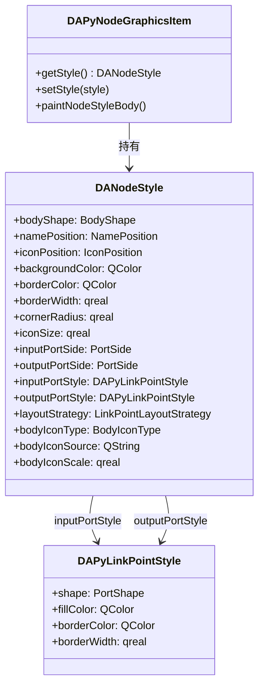

# 节点渲染配置指南

本文档详细介绍 Python 工作流节点的渲染配置系统，包括样式结构体 `DANodeStyle` 的所有字段、枚举类型说明、Python 和 C++ 使用示例以及常见问题。

## 导航

本系列文档包含以下章节：

- [DAPyWorkFlow 模块概述](./workflow-overview.md)
- [插件与节点发现机制](./workflow-plugin-discovery.md)
- [Python 节点开发指南](./workflow-python-node-dev.md)
- [工作流生命周期](./workflow-lifecycle.md)
- [C++ 集成指南](./workflow-cpp-integration.md)
- [场景操作指南](./workflow-scene-operation.md)
- [节点渲染配置指南](./node-rendering-settings.md) ← 当前页

## 概述

DAPyWorkFlow 的节点渲染系统采用 **DANodeStyle 统一控制** 的架构。所有节点的视觉表现（形状、颜色、端口、图标等）都由 `DANodeStyle` 结构体管理。

### 架构演变

早期版本使用 `render_template` 参数区分渲染模式（`"rect"`、`"svg"`、`"widget"`），通过不同的绘制函数实现视觉差异。从 T7 版本开始，渲染模板简化为两种：

| 模板类型 | 说明 |
|----------|------|
| `NodeStyleTemplate` | 使用 `DANodeStyle` 中的样式配置进行绘制，支持 BodyShape/PortShape 等丰富配置 |
| `WidgetTemplate` | 嵌入自定义 Qt Widget |

旧版参数 `"rect"` 和 `"svg"` 自动映射到 `NodeStyleTemplate`，无需修改现有代码。

### 核心类关系



- **DANodeStyle**: 节点整体样式配置结构体，通过 `@NodeDef` 装饰器的 `style` 参数传入
- **DAPyLinkPointStyle**: 端口样式配置，作为 `DANodeStyle` 的嵌套字段
- **DAPyNodeGraphicsItem**: 场景图元，读取 `DANodeStyle` 进行绘制

### 数据流

```
Python @NodeDef(style=...) → DANodeStyle.toJson() → QJsonObject → C++ DAPyNodeGraphicsItem.setStyle()
                                                                     → paintNodeStyleBody() 绘制
```

Python 侧通过 `DANodeStyle` 的 `toJson()` 方法序列化为稀疏 JSON（仅包含与默认值不同的字段），C++ 侧解析后应用到图元的 `DANodeStyle` 实例进行绘制。

## DANodeStyle 字段表

### 主体样式

| 字段 | 类型 | 默认值 | 说明 |
|------|------|--------|------|
| `bodyShape` | `BodyShape` | `RoundedRect` | 节点体形状，可选圆角矩形或椭圆 |
| `namePosition` | `NamePosition` | `Inside` | 节点名称位置，内部或下方 |
| `iconPosition` | `IconPosition` | `LeftOfText` | 图标相对文本的位置，左侧或上方 |
| `backgroundColor` | `QColor` | `(240, 240, 240)` | 节点背景颜色 |
| `borderColor` | `QColor` | `(180, 180, 180)` | 节点边框颜色 |
| `borderWidth` | `qreal` | `1.0` | 边框宽度 |
| `cornerRadius` | `qreal` | `4.0` | 圆角半径（仅 `RoundedRect` 生效） |
| `iconSize` | `qreal` | `24.0` | 图标尺寸（像素） |

### 端口配置

| 字段 | 类型 | 默认值 | 说明 |
|------|------|--------|------|
| `inputPortSide` | `PortSide` (alias `AspectDirection`) | `West` | 输入端口方位 |
| `outputPortSide` | `PortSide` (alias `AspectDirection`) | `East` | 输出端口方位 |
| `inputPortStyle` | `DAPyLinkPointStyle` | 默认构造 | 输入端口样式（形状/颜色） |
| `outputPortStyle` | `DAPyLinkPointStyle` | 默认构造 | 输出端口样式（形状/颜色） |
| `layoutStrategy` | `LinkPointLayoutStrategy` | `Auto` | 连接点布局策略 |

### 节点体图标

| 字段 | 类型 | 默认值 | 说明 |
|------|------|--------|------|
| `bodyIconType` | `BodyIconType` | `None` | 节点体图标类型 |
| `bodyIconSource` | `QString` | `""` | 图标源路径（SVG 文件路径或资源路径） |
| `bodyIconScale` | `qreal` | `0.8` | 图标缩放比例（相对于 bodyRect） |

### DAPyLinkPointStyle 字段表

| 字段 | 类型 | 默认值 | 说明 |
|------|------|--------|------|
| `shape` | `PortShape` | `Rect` | 端口形状 |
| `fillColor` | `QColor` | 无效 | 填充颜色（无效时输入=白色，输出=深灰色） |
| `borderColor` | `QColor` | 无效 | 边框颜色（无效时默认黑色） |
| `borderWidth` | `qreal` | `1.0` | 边框宽度 |

## 枚举说明

### BodyShape — 节点体形状

```cpp
enum class BodyShape
{
    RoundedRect = 0,  ///< 圆角矩形（默认）
    Ellipse     = 1   ///< 椭圆形
};
```

圆角矩形是默认形状，适用于大多数场景。椭圆形状适用于流程开始/结束节点或特殊标识节点。

### NamePosition — 节点名称位置

```cpp
enum class NamePosition
{
    Inside = 0,  ///< 名称在节点内部（默认）
    Below  = 1   ///< 名称在节点下方
};
```

`Inside` 将名称绘制在节点主体内部。`Below` 将名称绘制在节点主体下方，适合节点内需要更多空间或椭圆形状。

### IconPosition — 图标位置

```cpp
enum class IconPosition
{
    LeftOfText = 0,  ///< 图标在文本左侧（默认）
    AboveText  = 1   ///< 图标在文本上方
};
```

### PortShape — 端口形状

```cpp
enum class PortShape
{
    Rect    = 0,  ///< 矩形端口（默认）
    Circle  = 1,  ///< 圆形端口
    Diamond = 2   ///< 菱形端口
};
```

矩形为默认形状，圆形端口常用于数据流节点，菱形端口可区分特殊数据类型。

### PortSide — 端口方位

```cpp
// PortSide 是 AspectDirection 的类型别名
enum class AspectDirection
{
    East  = 0,  ///< 东（右侧）
    South = 1,  ///< 南（下方）
    West  = 2,  ///< 西（左侧）
    North = 3   ///< 北（上方）
};
using PortSide = AspectDirection;
```

端口方位复用 `DAGraphicsViewGlobal.h` 中定义的 `AspectDirection` 枚举。默认输入端口在 `West`（左侧），输出端口在 `East`（右侧）。

### BodyIconType — 节点体图标类型

```cpp
enum class BodyIconType
{
    None   = 0,  ///< 无图标（默认）
    Pixmap = 1,  ///< 位图图标（QIcon/QPixmap）
    Svg    = 2   ///< SVG 矢量图标
};
```

`Pixmap` 类型从 `bodyIconSource` 路径加载位图。`Svg` 类型使用 `QSvgRenderer` 渲染矢量图形，支持缩放不失真。

### LinkPointLayoutStrategy — 连接点布局策略

```cpp
enum class LinkPointLayoutStrategy
{
    Auto   = 0,  ///< 自动布局，系统根据端口数量计算位置（默认）
    Manual = 1   ///< 手动布局，用户指定位置
};
```

### RenderTemplate — 渲染模板类型（简化版）

```cpp
enum class RenderTemplate
{
    NodeStyleTemplate = 0,  ///< 节点样式模板（使用 DANodeStyle 配置绘制）
    WidgetTemplate    = 1   ///< 嵌入 Widget 模板
};
```

旧版 `"rect"` 和 `"svg"` 均映射到 `NodeStyleTemplate`，无需修改现有 `@NodeDef` 装饰器。

## Python 示例

### 基本用法

通过 `@NodeDef` 装饰器的 `style` 参数传入 `DANodeStyle` 实例：

```python
from DAWorkbench.DAWorkFlowPy import NodeDef, Input, Output

import da_py_workflow

# 创建样式实例
style = da_py_workflow.DANodeStyle()
style.bodyShape = da_py_workflow.BodyShape.Ellipse
style.namePosition = da_py_workflow.NamePosition.Below

@NodeDef(name="椭圆节点", category="示例", style=style)
class EllipseNode:
    """椭圆形状演示节点"""

    class Inputs:
        data = Input("any")

    class Outputs:
        result = Output("any")

    def execute(self, inputs, params):
        return True
```

### 椭圆体 + 名称下方 + 圆形端口

```python
import da_py_workflow

style = da_py_workflow.DANodeStyle()
style.bodyShape = da_py_workflow.BodyShape.Ellipse
style.namePosition = da_py_workflow.NamePosition.Below
style.iconPosition = da_py_workflow.IconPosition.AboveText
style.inputPortSide = da_py_workflow.AspectDirection.North
style.outputPortSide = da_py_workflow.AspectDirection.South
style.inputPortStyle.shape = da_py_workflow.PortShape.Circle
style.outputPortStyle.shape = da_py_workflow.PortShape.Circle

@NodeDef(name="椭圆演示", category="Style Demo", style=style)
class EllipseDemoNode:
    """椭圆体 + 名称下方 + 圆形端口"""
    class Inputs:
        data = Input("any")
    class Outputs:
        result = Output("any")
    def execute(self, inputs, params):
        return True
```

### 自定义颜色

```python
import da_py_workflow

style = da_py_workflow.DANodeStyle()
style.setBackgroundColor(255, 200, 200)  # 浅红色背景
style.setBorderColor(0, 0, 255)           # 蓝色边框

@NodeDef(name="自定义颜色", category="Style Demo", style=style)
class CustomColorNode:
    """自定义颜色演示节点"""
    class Inputs:
        data = Input("any")
    class Outputs:
        result = Output("any")
    def execute(self, inputs, params):
        return True
```

### 菱形端口 + 彩色端口填充

```python
import da_py_workflow

style = da_py_workflow.DANodeStyle()
style.inputPortStyle.shape = da_py_workflow.PortShape.Diamond
style.outputPortStyle.shape = da_py_workflow.PortShape.Diamond
style.inputPortStyle.setFillColor(255, 200, 200)   # 浅红色输入端口
style.outputPortStyle.setFillColor(200, 200, 255)  # 浅蓝色输出端口

@NodeDef(name="菱形端口", category="Style Demo", style=style)
class DiamondPortsNode:
    """菱形端口 + 彩色填充"""
    class Inputs:
        data = Input("any")
    class Outputs:
        result = Output("any")
    def execute(self, inputs, params):
        return True
```

### 大圆角

```python
import da_py_workflow

style = da_py_workflow.DANodeStyle()
style.cornerRadius = 12.0

@NodeDef(name="大圆角", category="Style Demo", style=style)
class CornerRadiusNode:
    """大圆角演示节点"""
    class Inputs:
        data = Input("any")
    class Outputs:
        result = Output("any")
    def execute(self, inputs, params):
        return True
```

### 使用色号字符串（#RRGGBB）

`setBackgroundColor` 和 `setBorderColor` 方法接受 RGB 分量（0-255）。如果需要使用十六进制色号，可以直接操作 `QColor`：

```python
import da_py_workflow
# Python 侧: QColor 在 pybind11 中绑定
from DAWorkbench.DAWorkFlowPy import QColor

style = da_py_workflow.DANodeStyle()
style.backgroundColor = QColor("#FF8800")
style.borderColor = QColor("#CC4400")
```

### 完整样式演示节点

项目中提供了 7 个样式演示节点，位于 `src/PyScripts/DAWorkbench/DAWorkFlowPy/nodes/style_demo_nodes.py`：

| 节点名 | 特性 |
|--------|------|
| `EllipseDemoNode` | 椭圆体 + 名称下方 + 圆形端口 |
| `DefaultRectNode` | 默认样式（无 style 参数） |
| `CirclePortsNode` | 矩形体 + 圆形端口 + 南北布局 |
| `DiamondPortsNode` | 矩形体 + 菱形端口 + 彩色填充 |
| `CustomColorNode` | 红色背景 + 蓝色边框 |
| `MixedLayoutNode` | 椭圆体 + 名称下方 + 菱形端口 + 蓝色边框 |
| `CornerRadiusNode` | 矩形体 + 大圆角 |

## C++ 示例

### 通过图元设置样式

```cpp
#include "DAPyNodeGraphicsItem.h"
#include "DAPyNodeStyle.h"

// 获取图元的样式引用并修改
DA::DAPyNodeGraphicsItem* item = scene->findNodeItemById(nodeId);
if (item) {
    DA::DANodeStyle& style = item->getStyle();
    style.setBodyShape(DA::BodyShape::Ellipse);
    style.setBackgroundColor(QColor(255, 200, 200));
    style.setBorderColor(QColor(0, 0, 255));
    style.setCornerRadius(8.0);
    // 图元会自动重绘
    item->update();
}
```

### 设置完整样式

```cpp
#include "DAPyNodeStyle.h"
#include "DAPyNodeGraphicsItem.h"

// 创建样式配置
DA::DANodeStyle nodeStyle;
nodeStyle.bodyShape = DA::BodyShape::Ellipse;
nodeStyle.namePosition = DA::NamePosition::Below;
nodeStyle.backgroundColor = QColor(240, 240, 255);
nodeStyle.borderColor = QColor(100, 100, 200);
nodeStyle.borderWidth = 2.0;
nodeStyle.cornerRadius = 6.0;

// 端口配置
nodeStyle.inputPortSide = DA::PortSide::North;
nodeStyle.outputPortSide = DA::PortSide::South;
nodeStyle.inputPortStyle.shape = DA::PortShape::Circle;
nodeStyle.outputPortStyle.shape = DA::PortShape::Circle;

// 应用到图元
item->setStyle(nodeStyle);
item->update();
```

### 样式序列化

```cpp
#include "DAPyNodeStyle.h"
#include <QJsonDocument>

// 样式 → JSON（稀疏策略，仅含非默认字段）
DA::DANodeStyle style;
style.bodyShape = DA::BodyShape::Ellipse;
QJsonObject json = DA::DANodeStyleToJson(style);

// 输出: {"bodyShape": "Ellipse"}

// JSON → 样式
DA::DANodeStyle restored = DA::DANodeStyleFromJson(json);
// restored.bodyShape == DA::BodyShape::Ellipse
// 其余字段使用默认值
```

### 渲染模板设置

```cpp
// 设置渲染模板（高优先级，决定整体绘制策略）
item->setRenderTemplate(DA::DAPyNodeGraphicsItem::RectTemplate);
// 或使用字符串
item->setRenderTemplate("nodestyle");

// 获取当前模板
auto tmpl = item->getRenderTemplate();
```

## 颜色配置说明

### 默认颜色值

| 属性 | 默认值 | RGB |
|------|--------|-----|
| 背景色 | 浅灰色 | `(240, 240, 240)` |
| 边框色 | 中灰色 | `(180, 180, 180)` |
| 输入端口默认填充 | 白色 | `(255, 255, 255)` |
| 输出端口默认填充 | 深灰色 | `(128, 128, 128)` |
| 端口默认边框 | 黑色 | `(0, 0, 0)` |

### 颜色格式

Python 侧通过 `setBackgroundColor(r, g, b)` 和 `setBorderColor(r, g, b)` 方法设置。各分量取值范围 0-255：

```python
style.setBackgroundColor(255, 200, 200)  # 浅红
style.setBorderColor(50, 50, 200)        # 深蓝
```

C++ 侧使用 `QColor`，支持所有 QColor 构造函数：

```cpp
style.backgroundColor = QColor(255, 200, 200);     // RGB
style.backgroundColor = QColor("#FFC8C8");          // #RRGGBB
style.backgroundColor = QColor(Qt::lightGray);      // Qt 预定义颜色
```

### 端口颜色默认行为

当 `DAPyLinkPointStyle` 的 `fillColor` 为无效颜色（default constructed）时，绘制系统自动选择默认值：

- 输入端口：白色（`Qt::white`）
- 输出端口：深灰色（`Qt::darkGray`）

可通过 `isFillColorValid()` / `isBorderColorValid()` 检查颜色是否有效。

## JSON 序列化策略

`DANodeStyleToJson` 采用 **稀疏策略**：仅序列化与默认值不同的字段。

```json
// 仅修改了 bodyShape 时的序列化结果：
{
    "bodyShape": "Ellipse"
}
```

这种策略的优势：
- 减少数据传输量
- 默认行为清晰可见
- 向前兼容性好（新增字段不影响现有序列化数据）

对应地，`DANodeStyleFromJson` 先构造默认实例，再覆盖 JSON 中存在的字段，确保缺失字段使用合理的默认值。

## 常见问题

### 端口过多导致重叠

当节点有大量输入/输出端口时，默认 `Auto` 布局可能导致端口重叠。

**解决方案**：

1. 调整端口方位，使用南北布局获得更多空间：

```python
style.inputPortSide = da_py_workflow.AspectDirection.North
style.outputPortSide = da_py_workflow.AspectDirection.South
```

2. 增大节点尺寸，为端口预留更多空间。

3. 切换为 `Manual` 布局策略，手动指定端口位置。

### 颜色设置不生效

**原因1**：使用了无效的颜色格式。确保 RGB 分量在 0-255 范围内。

```python
# 正确
style.setBackgroundColor(255, 200, 200)

# 错误：分量超出范围
# style.setBackgroundColor(300, 200, 200)
```

**原因2**：端口颜色使用了默认构造的 `QColor`。检查 `isFillColorValid()` 返回值。

```python
# 正确设置端口颜色
style.inputPortStyle.setFillColor(255, 200, 200)
```

### 旧版兼容性

旧版代码使用 `render_template="rect"` 或 `render_template="svg"`：

```python
# 旧版写法（仍有效）
@NodeDef(name="旧版节点", render_template="rect")
class OldStyleNode:
    ...
```

这些参数自动映射到 `NodeStyleTemplate`，行为与 `style=DANodeStyle()` 一致。建议新代码统一使用 `style` 参数进行精细控制。

### 椭圆体 + 名称位置

椭圆体配合 `NamePosition::Below` 效果最佳。使用 `NamePosition::Inside` 时，名称可能显示在椭圆顶部区域，可读性降低。

```python
style.bodyShape = da_py_workflow.BodyShape.Ellipse
style.namePosition = da_py_workflow.NamePosition.Below  # 推荐
```

### SVG 图标显示异常

使用 `bodyIconType = BodyIconType::Svg` 时，确保 `bodyIconSource` 指向有效的 SVG 文件路径或 Qt 资源路径：

```python
style.bodyIconType = da_py_workflow.BodyIconType.Svg
style.bodyIconSource = ":/icons/my_node.svg"  # Qt 资源路径
style.bodyIconScale = 0.8  # 适当缩放
```

SVG 渲染使用 `QSvgRenderer`，支持标准 SVG 1.2 子集。

## 参考资料

### 核心源码文件

| 模块 | 文件 | 说明 |
|------|------|------|
| C++ 枚举定义 | `src/DAPyWorkFlow/DAPyNodeStyleDefine.h` | BodyShape、PortShape、NamePosition 等枚举 |
| C++ 样式结构体 | `src/DAPyWorkFlow/DAPyNodeStyle.h` | DANodeStyle、DAPyLinkPointStyle 结构体 |
| C++ 样式序列化 | `src/DAPyWorkFlow/DAPyNodeStyle.cpp` | JSON 序列化/反序列化实现 |
| C++ 图元类 | `src/DAPyWorkFlow/DAPyNodeGraphicsItem.h` | 绘制入口 paintNodeStyleBody() |
| Python 绑定 | `src/DAPyWorkFlow/PythonBinding/DAPyWorkFlowPythonBinding.cpp` | pybind11 绑定代码 |
| Python 样式演示 | `src/PyScripts/DAWorkbench/DAWorkFlowPy/nodes/style_demo_nodes.py` | 7 个样式演示节点 |
| Python NodeDef | `src/PyScripts/DAWorkbench/DAWorkFlowPy/node_def.py` | 装饰器 style 参数处理 |

### 相关文档

- [Python 节点开发指南](./workflow-python-node-dev.md) — 节点定义和使用
- [工作流生命周期](./workflow-lifecycle.md) — 节点状态与执行
- [场景操作指南](./workflow-scene-operation.md) — 可视化场景操作
- [DAGraphicsView 模块](../../DAGraphicsView/) — 图形视图框架
