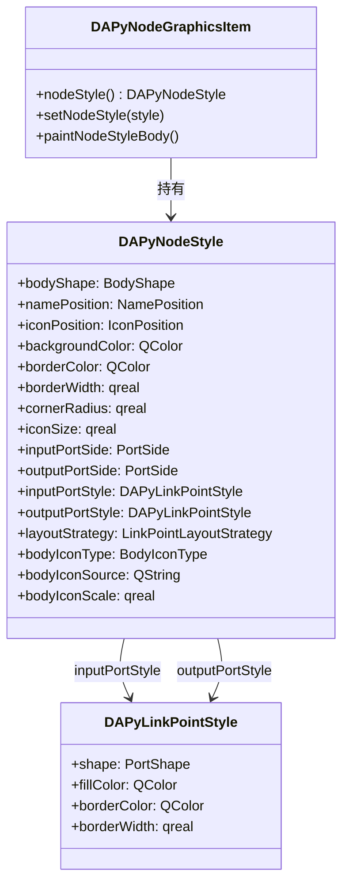

# 节点渲染配置指南

本文档详细介绍 Python 工作流节点的渲染配置系统，包括样式结构体 `DAPyNodeStyle` 的所有字段、枚举类型说明、Python 和 C++ 使用示例以及常见问题。

## 导航

本系列文档包含以下章节：

- [DAPyWorkFlow 模块概述](./workflow-overview.md)
- [插件与节点发现机制](./workflow-plugin-discovery.md)
- [Python 节点开发指南](./workflow-python-node-dev.md)
- [工作流生命周期](./workflow-lifecycle.md)
- [C++ 集成指南](./workflow-cpp-integration.md)
- [场景操作指南](./workflow-scene-operation.md)
- [节点渲染配置指南](./node-rendering-settings.md) ← 当前页

## 概述

DAPyWorkFlow 的节点渲染系统采用 **DAPyNodeStyle 统一控制** 的架构。所有节点的视觉表现（形状、颜色、端口、图标等）都由 `DAPyNodeStyle` 结构体管理。

### 架构演变

早期版本使用 `render_template` 参数区分渲染模式（`"rect"`、`"svg"`、`"widget"`），通过不同的绘制函数实现视觉差异。从 T7 版本开始，渲染模板简化为两种：

| 模板类型 | 说明 |
|----------|------|
| `RenderDefaultTemplate` | 使用 `DAPyNodeStyle` 中的样式配置进行绘制，支持 BodyShape/PortShape 等丰富配置 |
| `RenderWidgetTemplate` | 嵌入自定义 Qt Widget |

旧版参数 `"rect"` 和 `"svg"` 自动映射到 `RenderDefaultTemplate`，无需修改现有代码。

### 核心类关系


```mermaid
classDiagram
    class DAPyNodeStyle {
        +bodyShape: BodyShape
        +namePosition: NamePosition
        +iconPosition: IconPosition
        +backgroundColor: QColor
        +borderColor: QColor
        +borderWidth: qreal
        +cornerRadius: qreal
        +iconSize: qreal
        +inputPortSide: PortSide
        +outputPortSide: PortSide
        +inputPortStyle: DAPyLinkPointStyle
        +outputPortStyle: DAPyLinkPointStyle
        +layoutStrategy: LinkPointLayoutStrategy
        +bodyIconType: BodyIconType
        +bodyIconSource: QString
        +bodyIconScale: qreal
    }

    class DAPyLinkPointStyle {
        +shape: PortShape
        +fillColor: QColor
        +borderColor: QColor
        +borderWidth: qreal
    }

    class DAPyNodeGraphicsItem {
        +nodeStyle() DAPyNodeStyle
        +setNodeStyle(style)
        +paintNodeStyleBody()
    }

    DAPyNodeStyle --> DAPyLinkPointStyle : inputPortStyle
    DAPyNodeStyle --> DAPyLinkPointStyle : outputPortStyle
    DAPyNodeGraphicsItem --> DAPyNodeStyle : 持有
```

- **DAPyNodeStyle**: 节点整体样式配置结构体，Python 侧通过 `NodeDisplay` dataclass 传递样式到 C++
- **DAPyLinkPointStyle**: 端口样式配置，作为 `DAPyNodeStyle` 的嵌套字段
- **DAPyNodeGraphicsItem**: 场景图元，读取 `DAPyNodeStyle` 进行绘制

### 数据流

```
Python @NodeDef(style=NodeDisplay(...)) → C++ PY::toNodeStyle(obj) → DAPyNodeStyle
                                                                      → DAPyNodeGraphicsItem.setNodeStyle()
                                                                      → paintNodeStyleBody() 绘制
```

Python 侧通过 `NodeDisplay` dataclass 声明样式属性（所有字段为 Optional，None 表示使用 C++ 默认值），C++ 侧通过 `PY::toNodeStyle()` 函数从 Python 对象属性读取样式字段并构造 `DAPyNodeStyle` 实例，应用到图元进行绘制。

## DAPyNodeStyle 字段表

### 主体样式

| 字段 | 类型 | 默认值 | 说明 |
|------|------|--------|------|
| `bodyShape` | `BodyShape` | `RoundedRectShape` | 节点体形状，可选圆角矩形或椭圆 |
| `namePosition` | `NamePosition` | `NameInsideBody` | 节点名称位置，内部或下方 |
| `iconPosition` | `IconPosition` | `IconLeftOfText` | 图标相对文本的位置，左侧或上方 |
| `backgroundColor` | `QColor` | `(240, 240, 240)` | 节点背景颜色 |
| `borderColor` | `QColor` | `(180, 180, 180)` | 节点边框颜色 |
| `borderWidth` | `qreal` | `1.0` | 边框宽度 |
| `cornerRadius` | `qreal` | `4.0` | 圆角半径（仅 `RoundedRectShape` 生效） |
| `iconSize` | `qreal` | `24.0` | 图标尺寸（像素） |

### 端口配置

| 字段 | 类型 | 默认值 | 说明 |
|------|------|--------|------|
| `inputPortSide` | `PortSide` (alias `DAAspectDirection`) | `West` | 输入端口方位 |
| `outputPortSide` | `PortSide` (alias `DAAspectDirection`) | `East` | 输出端口方位 |
| `inputPortStyle` | `DAPyLinkPointStyle` | 默认构造 | 输入端口样式（形状/颜色） |
| `outputPortStyle` | `DAPyLinkPointStyle` | 默认构造 | 输出端口样式（形状/颜色） |
| `layoutStrategy` | `LinkPointLayoutStrategy` | `AutoLayoutLinkPoint` | 连接点布局策略 |

### 节点体图标

| 字段 | 类型 | 默认值 | 说明 |
|------|------|--------|------|
| `bodyIconType` | `BodyIconType` | `NoneBodyIcon` | 节点体图标类型 |
| `bodyIconSource` | `QString` | `""` | 图标源路径（SVG 文件路径或资源路径） |
| `bodyIconScale` | `qreal` | `0.8` | 图标缩放比例（相对于 bodyRect） |

### DAPyLinkPointStyle 字段表

| 字段 | 类型 | 默认值 | 说明 |
|------|------|--------|------|
| `shape` | `PortShape` | `Rect` | 端口形状 |
| `fillColor` | `QColor` | 无效 | 填充颜色（无效时输入=白色，输出=深灰色） |
| `borderColor` | `QColor` | 无效 | 边框颜色（无效时默认黑色） |
| `borderWidth` | `qreal` | `1.0` | 边框宽度 |

## 枚举说明

### BodyShape — 节点体形状

```cpp
// 嵌套在 DAPyNodeStyle 类内部
enum BodyShape
{
    RoundedRectShape = 0,  ///< 圆角矩形（默认）
    EllipseShape     = 1   ///< 椭圆形
};
```

圆角矩形是默认形状，适用于大多数场景。椭圆形状适用于流程开始/结束节点或特殊标识节点。

### NamePosition — 节点名称位置

```cpp
// 嵌套在 DAPyNodeStyle 类内部
enum NamePosition
{
    NameInsideBody = 0,  ///< 名称在节点内部（默认）
    NameBelowBody  = 1   ///< 名称在节点下方
};
```

`NameInsideBody` 将名称绘制在节点主体内部。`NameBelowBody` 将名称绘制在节点主体下方，适合节点内需要更多空间或椭圆形状。

### IconPosition — 图标位置

```cpp
// 嵌套在 DAPyNodeStyle 类内部
enum IconPosition
{
    IconLeftOfText = 0,  ///< 图标在文本左侧（默认）
    IconAboveText  = 1   ///< 图标在文本上方
};
```

### PortShape — 端口形状

```cpp
// 嵌套在 DAPyLinkPointStyle 类内部
enum PortShape
{
    Rect    = 0,  ///< 矩形端口（默认）
    Circle  = 1,  ///< 圆形端口
    Diamond = 2   ///< 菱形端口
};
```

矩形为默认形状，圆形端口常用于数据流节点，菱形端口可区分特殊数据类型。

### PortSide — 端口方位

```cpp
// PortSide 是 DAAspectDirection 的类型别名，定义在 DAGraphicsViewGlobal.h 中
enum class DAAspectDirection
{
    East  = 0,  ///< 东（右侧）
    South = 1,  ///< 南（下方）
    West  = 2,  ///< 西（左侧）
    North = 3   ///< 北（上方）
};
// 在 DAPyNodeStyle 中：
using PortSide = DAAspectDirection;
```

端口方位复用 `DAGraphicsViewGlobal.h` 中定义的 `DAAspectDirection` 枚举。默认输入端口在 `West`（左侧），输出端口在 `East`（右侧）。

### BodyIconType — 节点体图标类型

```cpp
// 嵌套在 DAPyNodeStyle 类内部
enum BodyIconType
{
    NoneBodyIcon   = 0,  ///< 无图标（默认）
    PixmapBodyIcon = 1,  ///< 位图图标（QIcon/QPixmap）
    SvgBodyIcon    = 2   ///< SVG 矢量图标
};
```

`PixmapBodyIcon` 类型从 `bodyIconSource` 路径加载位图。`SvgBodyIcon` 类型使用 `QSvgRenderer` 渲染矢量图形，支持缩放不失真。

### LinkPointLayoutStrategy — 连接点布局策略

```cpp
// 嵌套在 DAPyNodeStyle 类内部
enum LinkPointLayoutStrategy
{
    AutoLayoutLinkPoint   = 0,  ///< 自动布局，系统根据端口数量计算位置（默认）
    ManualLayoutLinkPoint = 1   ///< 手动布局，用户指定位置
};
```

### NodeRenderTemplate — 渲染模板类型（简化版）

```cpp
// 嵌套在 DAPyNodeStyle 类内部
enum NodeRenderTemplate
{
    RenderDefaultTemplate = 0,  ///< 节点样式模板（使用 DAPyNodeStyle 配置绘制）
    RenderWidgetTemplate  = 1   ///< 嵌入 Widget 模板
};
```

旧版 `"rect"` 和 `"svg"` 均映射到 `RenderDefaultTemplate`，无需修改现有 `@NodeDef` 装饰器。

## Python 示例

### 基本用法

通过 `@NodeDef` 装饰器的 `style` 参数传入 `NodeDisplay` dataclass 实例：

```python
from DAWorkbench.DAWorkFlowPy import NodeDef, NodeDisplay, Input, Output

# 创建样式实例（使用 NodeDisplay dataclass，字段为 Optional，None 表示使用 C++ 默认值）
@NodeDef(name="椭圆节点", category="示例", style=NodeDisplay(
    body_shape="Ellipse",
    name_position="Below",
))
class EllipseNode:
    """椭圆形状演示节点"""

    class Inputs:
        data = Input("any")

    class Outputs:
        result = Output("any")

    def execute(self):
        return True
```

### 椭圆体 + 名称下方 + 圆形端口

```python
from DAWorkbench.DAWorkFlowPy import NodeDef, NodeDisplay, LinkPointStyle, Input, Output

@NodeDef(name="椭圆演示", category="Style Demo", style=NodeDisplay(
    body_shape="Ellipse",
    name_position="Below",
    icon_position="AboveText",
    input_port_side="North",
    output_port_side="South",
    input_port_style=LinkPointStyle(shape="Circle"),
    output_port_style=LinkPointStyle(shape="Circle"),
))
class EllipseDemoNode:
    """椭圆体 + 名称下方 + 圆形端口"""
    class Inputs:
        data = Input("any")
    class Outputs:
        result = Output("any")
    def execute(self):
        return True
```

### 自定义颜色

```python
from DAWorkbench.DAWorkFlowPy import NodeDef, NodeDisplay, Input, Output

# 颜色支持 hex 字符串 "#rrggbb" 或 RGB 元组 (r, g, b)
@NodeDef(name="自定义颜色", category="Style Demo", style=NodeDisplay(
    background_color="#FFC8C8",  # 浅红色背景
    border_color=(0, 0, 255),    # 蓝色边框
))
class CustomColorNode:
    """自定义颜色演示节点"""
    class Inputs:
        data = Input("any")
    class Outputs:
        result = Output("any")
    def execute(self):
        return True
```

### 菱形端口 + 彩色端口填充

```python
from DAWorkbench.DAWorkFlowPy import NodeDef, NodeDisplay, LinkPointStyle, Input, Output

@NodeDef(name="菱形端口", category="Style Demo", style=NodeDisplay(
    input_port_style=LinkPointStyle(shape="Diamond", fill_color=(255, 200, 200)),   # 浅红色输入端口
    output_port_style=LinkPointStyle(shape="Diamond", fill_color=(200, 200, 255)),  # 浅蓝色输出端口
))
class DiamondPortsNode:
    """菱形端口 + 彩色填充"""
    class Inputs:
        data = Input("any")
    class Outputs:
        result = Output("any")
    def execute(self):
        return True
```

### 大圆角

```python
from DAWorkbench.DAWorkFlowPy import NodeDef, NodeDisplay, Input, Output

@NodeDef(name="大圆角", category="Style Demo", style=NodeDisplay(
    corner_radius=12.0,
))
class CornerRadiusNode:
    """大圆角演示节点"""
    class Inputs:
        data = Input("any")
    class Outputs:
        result = Output("any")
    def execute(self):
        return True
```

### 使用色号字符串（#RRGGBB）

`NodeDisplay` 的颜色字段支持十六进制色号字符串和 RGB 元组两种格式：

```python
from DAWorkbench.DAWorkFlowPy import NodeDef, NodeDisplay, Input, Output

@NodeDef(name="色号演示", category="Style Demo", style=NodeDisplay(
    background_color="#FF8800",  # 十六进制色号
    border_color="#CC4400",
    # 也可以使用 RGB 元组
    # background_color=(255, 136, 0),
))
class HexColorNode:
    """色号字符串演示"""
    class Inputs:
        data = Input("any")
    class Outputs:
        result = Output("any")
    def execute(self):
        return True
```

### 完整样式演示节点

项目中提供了 7 个样式演示节点，位于 `src/PyScripts/DAWorkbench/DAWorkFlowPy/nodes/style_demo_nodes.py`：

| 节点名 | 特性 |
|--------|------|
| `EllipseDemoNode` | 椭圆体 + 名称下方 + 圆形端口 |
| `DefaultRectNode` | 默认样式（无 style 参数） |
| `CirclePortsNode` | 矩形体 + 圆形端口 + 南北布局 |
| `DiamondPortsNode` | 矩形体 + 菱形端口 + 彩色填充 |
| `CustomColorNode` | 红色背景 + 蓝色边框 |
| `MixedLayoutNode` | 椭圆体 + 名称下方 + 菱形端口 + 蓝色边框 |
| `CornerRadiusNode` | 矩形体 + 大圆角 |

## C++ 示例

### 通过图元设置样式

```cpp
#include "DAPyNodeGraphicsItem.h"
#include "DAPyNodeStyle.h"

// 获取图元的样式引用并修改
DA::DAPyNodeGraphicsItem* item = scene->findNodeItemById(nodeId);
if (item) {
    DA::DAPyNodeStyle& style = item->nodeStyle();
    style.bodyShape = DA::DAPyNodeStyle::EllipseShape;
    style.backgroundColor = QColor(255, 200, 200);
    style.borderColor = QColor(0, 0, 255);
    style.cornerRadius = 8.0;
    // 图元会自动重绘
    item->update();
}
```

### 设置完整样式

```cpp
#include "DAPyNodeStyle.h"
#include "DAPyNodeGraphicsItem.h"

// 创建样式配置
DA::DAPyNodeStyle nodeStyle;
nodeStyle.bodyShape = DA::DAPyNodeStyle::EllipseShape;
nodeStyle.namePosition = DA::DAPyNodeStyle::NameBelowBody;
nodeStyle.backgroundColor = QColor(240, 240, 255);
nodeStyle.borderColor = QColor(100, 100, 200);
nodeStyle.borderWidth = 2.0;
nodeStyle.cornerRadius = 6.0;

// 端口配置
nodeStyle.inputPortSide = DA::DAPyNodeStyle::PortSide::North;
nodeStyle.outputPortSide = DA::DAPyNodeStyle::PortSide::South;
nodeStyle.inputPortStyle.shape = DA::DAPyLinkPointStyle::Circle;
nodeStyle.outputPortStyle.shape = DA::DAPyLinkPointStyle::Circle;

// 应用到图元
item->setNodeStyle(nodeStyle);
item->update();
```

### 样式枚举与字符串转换

`DAPyNodeStyle` 的枚举类型通过 `DA_ENUM_STRING_DECLARE_EXPORT` / `DA_ENUM_STRING_INSENSITIVE_DEFINE` 宏注册了枚举↔字符串映射（定义在 `DAPyNodeStyle.cpp` 中），用于 Python 属性名与 C++ 枚举值之间的双向转换：

```cpp
#include "DAPyNodeStyle.h"
#include "DAPyWorkFlowEnumStringUtils.h"

// 枚举 → 字符串（字符串与 Python NodeDisplay 属性名一致）
DA::DAPyNodeStyle style;
style.bodyShape = DA::DAPyNodeStyle::EllipseShape;
QString str = DA::enumToString(style.bodyShape);  // "ellipse"

// 字符串 → 枚举
DA::DAPyNodeStyle::BodyShape shape = DA::stringToEnum< DA::DAPyNodeStyle::BodyShape >(str);
// shape == DA::DAPyNodeStyle::EllipseShape
```

样式的持久化通过 `DAPyNodeGraphicsItem::saveToXml()` / `loadFromXml()` 实现，图元在保存时将样式字段序列化为 XML 属性。

### 渲染模板设置

```cpp
// 设置渲染模板（决定整体绘制策略）
item->setRenderTemplate(DA::DAPyNodeStyle::RenderDefaultTemplate);
// 嵌入 Widget 模板
item->setRenderTemplate(DA::DAPyNodeStyle::RenderWidgetTemplate);

// 也可以通过样式结构体设置
DA::DAPyNodeStyle style = item->nodeStyle();
style.renderTemplate = DA::DAPyNodeStyle::RenderDefaultTemplate;
item->setNodeStyle(style);
```

## 颜色配置说明

### 默认颜色值

| 属性 | 默认值 | RGB |
|------|--------|-----|
| 背景色 | 浅灰色 | `(240, 240, 240)` |
| 边框色 | 中灰色 | `(180, 180, 180)` |
| 输入端口默认填充 | 白色 | `(255, 255, 255)` |
| 输出端口默认填充 | 深灰色 | `(128, 128, 128)` |
| 端口默认边框 | 黑色 | `(0, 0, 0)` |

### 颜色格式

Python 侧通过 `NodeDisplay` dataclass 的 `background_color` 和 `border_color` 字段设置，支持 hex 字符串和 RGB 元组两种格式：

```python
from DAWorkbench.DAWorkFlowPy import NodeDisplay

# hex 字符串
NodeDisplay(background_color="#FFC8C8", border_color="#3232C8")

# RGB 元组（各分量取值范围 0-255）
NodeDisplay(background_color=(255, 200, 200), border_color=(50, 50, 200))
```

C++ 侧使用 `QColor`，支持所有 QColor 构造函数：

```cpp
style.backgroundColor = QColor(255, 200, 200);     // RGB
style.backgroundColor = QColor("#FFC8C8");          // #RRGGBB
style.backgroundColor = QColor(Qt::lightGray);      // Qt 预定义颜色
```

### 端口颜色默认行为

当 `DAPyLinkPointStyle` 的 `fillColor` 为无效颜色（default constructed）时，绘制系统自动选择默认值：

- 输入端口：白色（`Qt::white`）
- 输出端口：深灰色（`Qt::darkGray`）

可通过 `isFillColorValid()` / `isBorderColorValid()` 检查颜色是否有效。

## Python → C++ 样式传递策略

`NodeDisplay` dataclass 采用 **稀疏传递策略**：所有字段为 `Optional`，`None` 表示使用 C++ 默认值。C++ 侧的 `PY::toNodeStyle()` 函数先构造带默认值的 `DAPyNodeStyle` 实例，再仅覆盖 Python 端非 `None` 的字段。

```python
# 仅修改 body_shape 时，其余字段使用 C++ 默认值
NodeDisplay(body_shape="Ellipse")
```

这种策略的优势：
- 减少数据传输量（仅传递用户显式设置的字段）
- 默认行为清晰可见（`None` = C++ 默认值）
- 向前兼容性好（新增字段不影响现有代码）

C++ 侧 `PY::toNodeStyle()` 的读取流程：先调用 `DAPyNodeStyle::setDefaults()` 初始化所有默认值，再通过 `readEnumAttr()` / `readColorAttr()` / `readCastAttr()` 逐个读取 Python 属性，属性不存在或为 `None` 时保留默认值。

## 常见问题

### 端口过多导致重叠

当节点有大量输入/输出端口时，默认 `AutoLayoutLinkPoint` 布局可能导致端口重叠。

**解决方案**：

1. 调整端口方位，使用南北布局获得更多空间：

```python
from DAWorkbench.DAWorkFlowPy import NodeDisplay

NodeDisplay(input_port_side="North", output_port_side="South")
```

2. 增大节点尺寸，为端口预留更多空间。

3. 切换为 `ManualLayoutLinkPoint` 布局策略，手动指定端口位置。

### 颜色设置不生效

**原因1**：使用了无效的颜色格式。确保 RGB 分量在 0-255 范围内。

```python
# 正确
NodeDisplay(background_color=(255, 200, 200))
NodeDisplay(background_color="#FFC8C8")

# 错误：无效的 hex 字符串
# NodeDisplay(background_color="#ZZZ")
```

**原因2**：端口颜色未正确传递。确保使用 `LinkPointStyle` dataclass：

```python
from DAWorkbench.DAWorkFlowPy import NodeDisplay, LinkPointStyle

# 正确设置端口颜色
NodeDisplay(input_port_style=LinkPointStyle(fill_color=(255, 200, 200)))
```

### 旧版兼容性

旧版代码使用 `render_template="rect"` 或 `render_template="svg"`：

```python
# 旧版写法（仍有效）
@NodeDef(name="旧版节点", style=NodeDisplay(render_template="nodestyle"))
class OldStyleNode:
    ...
```

这些参数自动映射到 `RenderDefaultTemplate`，行为与 `style=NodeDisplay()` 一致。建议新代码统一使用 `NodeDisplay` 的显式字段进行精细控制。

### 椭圆体 + 名称位置

椭圆体配合 `DAPyNodeStyle::NameBelowBody` 效果最佳。使用 `DAPyNodeStyle::NameInsideBody` 时，名称可能显示在椭圆顶部区域，可读性降低。

```python
from DAWorkbench.DAWorkFlowPy import NodeDisplay

NodeDisplay(body_shape="Ellipse", name_position="Below")  # 推荐
```

### SVG 图标显示异常

使用 `body_icon_type = "Svg"` 时，确保 `body_icon_source` 指向有效的 SVG 文件路径或 Qt 资源路径：

```python
from DAWorkbench.DAWorkFlowPy import NodeDisplay

NodeDisplay(
    body_icon_type="Svg",
    body_icon_source=":/icons/my_node.svg",  # Qt 资源路径
    body_icon_scale=0.8,  # 适当缩放
)
```

SVG 渲染使用 `QSvgRenderer`，支持标准 SVG 1.2 子集。

## 参考资料

### 核心源码文件

| 模块 | 文件 | 说明 |
|------|------|------|
| C++ 样式结构体 | `src/DAPyWorkFlow/DAPyNodeStyle.h` | DAPyNodeStyle 结构体及嵌套枚举（BodyShape、NamePosition 等） |
| C++ 样式实现 | `src/DAPyWorkFlow/DAPyNodeStyle.cpp` | 枚举↔字符串映射定义（`DA_ENUM_STRING_INSENSITIVE_DEFINE`） |
| C++ 端口样式 | `src/DAPyWorkFlow/DAPyLinkPointStyle.h` | DAPyLinkPointStyle 结构体及 PortShape 枚举（独立头文件） |
| C++ 端口样式实现 | `src/DAPyWorkFlow/DAPyLinkPointStyle.cpp` | PortShape 枚举↔字符串映射 |
| C++ 枚举字符串转换 | `src/DAPyWorkFlow/DAPyWorkFlowEnumStringUtils.h` | 枚举↔字符串映射宏定义 |
| C++ 图元类 | `src/DAPyWorkFlow/DAPyNodeGraphicsItem.h` | 绘制入口 paintNodeStyleBody()，nodeStyle()/setNodeStyle() |
| C++ 节点代理 | `src/DAPyWorkFlow/DAPyNode.h` | getNodeStyle() 从 Python 对象读取样式 |
| Python 绑定 | `src/DAPyWorkFlow/PythonBinding/DAPyWorkFlowPythonBinding.cpp` | PY::toNodeStyle() 从 NodeDisplay 属性读取样式 |
| Python 样式演示 | `src/PyScripts/DAWorkbench/DAWorkFlowPy/nodes/style_demo_nodes.py` | 7 个样式演示节点 |
| Python NodeDef | `src/PyScripts/DAWorkbench/DAWorkFlowPy/node_def.py` | NodeDisplay/LinkPointStyle dataclass 定义 |

### 相关文档

- [Python 节点开发指南](./workflow-python-node-dev.md) — 节点定义和使用
- [工作流生命周期](./workflow-lifecycle.md) — 节点状态与执行
- [场景操作指南](./workflow-scene-operation.md) — 可视化场景操作
- [DAGraphicsView 模块](../../DAGraphicsView/) — 图形视图框架
