# 插件化架构设计

## 概述

本文档详细说明 **DAWorkBench** 的插件化架构设计，包括设计原则、接口规范、Python 脚本调用机制、UI 操作方式以及模块间通信协议。通过本文档，开发者可以：

- 理解插件化架构的设计原则和实现方式
- 掌握主程序和插件调用 Python 脚本的标准方法
- 学会如何从 Python 脚本安全地操作 UI 组件
- 了解模块间的接口规范和通信协议

!!! info "为什么选择插件化架构？"
    - **可扩展性**：新增功能无需修改主程序，降低维护成本
    - **模块化**：功能独立封装，便于团队协作开发
    - **灵活性**：用户可按需加载插件，定制化工作环境
    - **稳定性**：插件崩溃不影响主程序运行

在现代软件开发中，插件化架构已经成为构建可扩展应用程序的主流模式之一。DAWorkBench 作为一个数据工作流设计器，需要支持各种数据处理、分析和可视化功能的扩展。如果将所有功能都内置到主程序中，不仅会导致主程序体积庞大、启动缓慢，还会增加维护的复杂度。通过插件化架构，我们可以将核心功能与扩展功能分离，让主程序专注于基础框架的运行，而将具体的数据处理逻辑交给插件来实现。

---

## 第一部分：架构设计原则

### 1.1 设计原则概述

良好的架构设计是软件可维护性和可扩展性的基础。DAWorkBench 的插件化架构遵循面向对象设计的 SOLID 原则，这些原则指导我们如何组织代码、定义接口以及管理模块间的依赖关系。

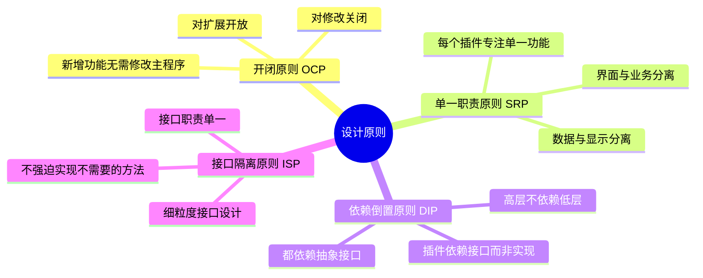

### 1.2 核心设计理念

在插件化架构中，设计理念的选择直接影响到系统的灵活性和可维护性。以下是 DAWorkBench 遵循的核心设计理念的详细说明。

=== "开闭原则 (OCP)"

    **开闭原则（Open-Closed Principle）** 是插件化架构最重要的设计原则之一。它的核心思想是：软件实体应该对扩展开放，对修改关闭。这意味着当我们需要添加新功能时，应该通过扩展现有代码来实现，而不是修改已有的代码。
    
    在 DAWorkBench 中，这一原则体现在以下几个方面：
    
    - **主程序稳定性**：主程序的核心逻辑一旦稳定，就不应该因为新功能的添加而频繁修改。所有新功能都通过插件的形式引入。
    - **接口稳定性**：定义良好的接口一旦发布，就应该保持向后兼容。新功能可以通过扩展接口来实现，而不是修改现有接口。
    - **版本兼容性**：旧版本的插件应该能够在新版本的主程序中运行，这要求主程序的接口保持稳定。
    
    ```cpp
    // 主程序不依赖具体插件实现
    // 主程序只知道 DACoreInterface 接口，不知道具体的插件类
    DACoreInterface* core = getCore();
    core->getDataManagerInterface()->addData(data);
    ```
    
    通过遵循开闭原则，我们可以确保系统的稳定性不会因为功能的增加而降低。每次添加新功能时，只需要开发新的插件，而无需担心破坏现有的功能。

=== "依赖倒置原则 (DIP)"

    **依赖倒置原则（Dependency Inversion Principle）** 是实现插件化架构的关键。传统的软件设计中，高层模块往往直接依赖低层模块，这导致当低层模块发生变化时，高层模块也需要修改。依赖倒置原则要求：
    
    1. 高层模块不应该依赖低层模块，两者都应该依赖其抽象
    2. 抽象不应该依赖细节，细节应该依赖抽象
    
    在 DAWorkBench 中，主程序是高层模块，插件是低层模块。主程序不直接依赖具体的插件实现，而是依赖一组抽象接口（如 `DACoreInterface`、`DAUIInterface` 等）。插件同样依赖这些接口来访问主程序的功能。
    
    ```cpp
    // 插件依赖接口，而非主程序实现
    // 这样插件可以在不同版本的主程序中运行
    class DataAnalysisPlugin : public DAAbstractPlugin {
        DACoreInterface* m_core;  // 依赖接口，而非具体实现
    };
    ```
    
    这种设计带来的好处是：
    - **解耦合**：主程序和插件之间通过接口解耦，可以独立开发和测试
    - **可替换性**：可以轻松替换插件的实现，只要遵循相同的接口规范
    - **可测试性**：可以创建模拟对象来测试主程序或插件的逻辑

=== "单一职责原则 (SRP)"

    **单一职责原则（Single Responsibility Principle）** 要求每个类或模块只负责一个特定的功能领域。在插件化架构中，这一原则尤为重要：
    
    - **插件职责单一**：每个插件应该专注于一个特定的功能领域。例如，`DataAnalysis` 插件专注于数据分析功能，`DataIO` 插件专注于数据导入导出功能。
    - **接口职责单一**：每个接口应该只定义一类相关的方法。例如，`DADataManagerInterface` 只定义数据管理相关的方法，不包含 UI 操作方法。
    - **类职责单一**：每个类应该只有一个引起它变化的原因。
    
    遵循单一职责原则的好处是：
    - **降低复杂度**：每个模块只关注一件事，代码更容易理解和维护
    - **提高内聚性**：相关功能集中在一起，模块内部联系紧密
    - **减少耦合**：不同职责的代码分离，修改一个不会影响另一个

=== "接口隔离原则 (ISP)"

    **接口隔离原则（Interface Segregation Principle）** 要求接口应该细粒度化，不应该强迫客户依赖它们不使用的方法。在 DAWorkBench 中：
    
    - 我们将核心功能拆分为多个专门的接口，如 `DAUIInterface`（界面操作）、`DADataManagerInterface`（数据管理）、`DAProjectInterface`（项目管理）等。
    - 插件只需要依赖它实际使用的接口，而不需要依赖所有接口。
    - 当接口需要扩展时，可以通过定义新的接口来扩展，而不是修改现有接口。
    
    这种设计避免了"胖接口"问题，使得系统更加灵活和可维护。

### 1.3 模块依赖关系

理解模块间的依赖关系对于维护系统的稳定性至关重要。下图展示了 DAWorkBench 各模块之间的依赖关系：

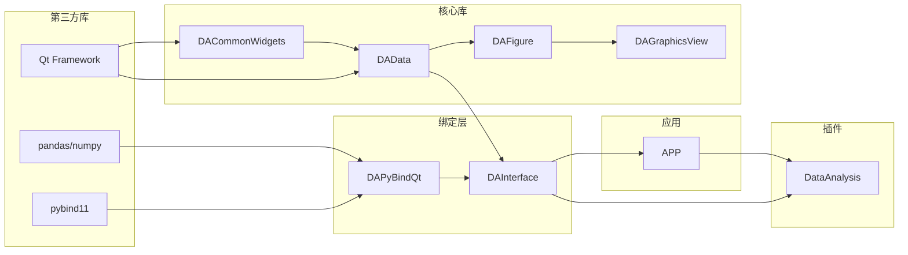

**依赖关系说明：**

1. **第三方库层**：Qt Framework 提供基础的 GUI 功能，pandas/numpy 提供数据处理能力，pybind11 提供 C++ 与 Python 的绑定能力。这些是整个系统的基础设施。

2. **核心库层**：这些库提供 DAWorkBench 的核心功能，不依赖于具体的应用程序。它们可以被独立测试和复用。

3. **绑定层**：`DAPyBindQt` 负责将 Qt 类型与 Python 类型进行转换，`DAInterface` 定义了核心接口。绑定层是主程序与插件、C++ 与 Python 之间的桥梁。

4. **应用层**：`APP` 模块是主程序，它协调各个模块的工作，管理应用程序的生命周期。

5. **插件层**：插件依赖于 `DAInterface` 定义的接口，通过接口访问主程序的功能。插件之间不应该有直接依赖关系。

!!! warning "依赖方向原则"
    依赖关系应该始终从高层指向低层，从具体指向抽象。避免循环依赖，否则会导致代码难以理解和维护。

---

## 第二部分：接口规范

### 2.1 核心接口层次结构

接口是插件化架构的核心，它们定义了主程序与插件之间的契约。良好的接口设计应该具备以下特点：

- **稳定性**：接口一旦发布，就应该保持向后兼容
- **清晰性**：接口的方法命名清晰，职责明确
- **最小化**：接口应该只包含必要的方法，避免膨胀

DAWorkBench 定义了一组核心接口，它们之间的关系如下：

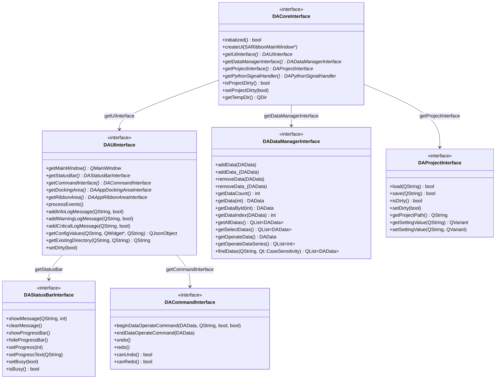

**接口职责说明：**

| 接口 | 职责 | 主要使用者 |
|------|------|-----------|
| `DACoreInterface` | 核心控制器接口，提供访问其他接口的入口 | 所有插件 |
| `DAUIInterface` | 界面操作接口，提供日志输出、对话框显示等功能 | 需要与用户交互的插件 |
| `DADataManagerInterface` | 数据管理接口，提供数据的增删改查功能 | 数据处理插件 |
| `DAProjectInterface` | 项目管理接口，提供项目保存、加载、设置等功能 | 需要持久化数据的插件 |
| `DAStatusBarInterface` | 状态栏接口，提供消息显示、进度条控制等功能 | 需要显示状态的插件 |
| `DACommandInterface` | 命令接口，提供撤销/重做功能 | 需要支持撤销的插件 |

### 2.2 接口创建顺序

!!! warning "创建顺序至关重要"
    接口之间存在依赖关系，必须按照正确顺序创建，否则会导致空指针异常。

在应用程序启动过程中，各个接口的创建顺序必须严格遵循依赖关系。下图展示了正确的初始化顺序：

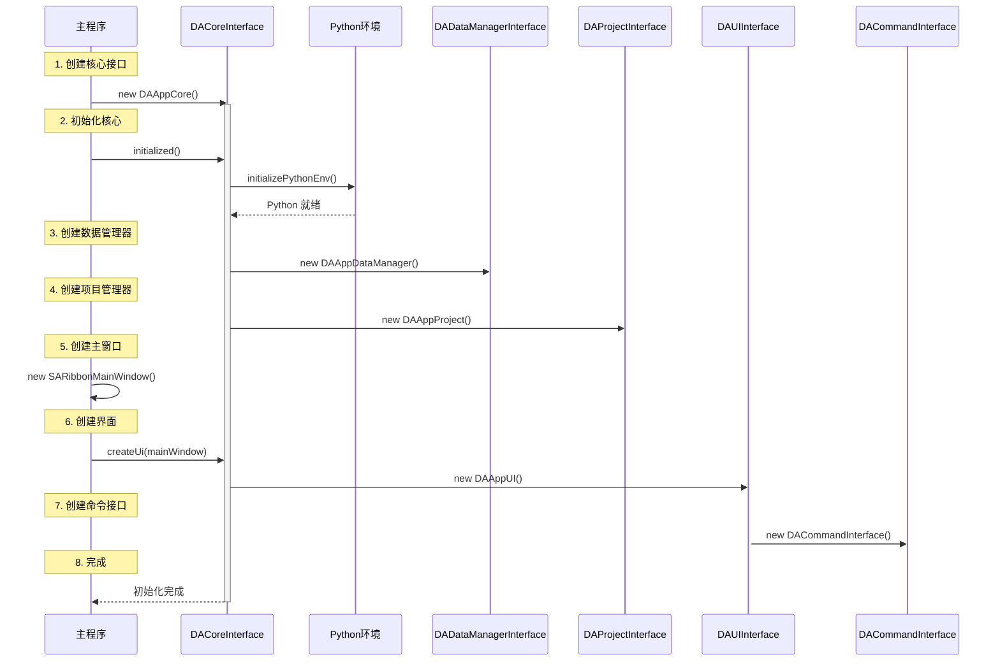

**初始化顺序详解：**

1. **创建核心接口**：首先创建 `DAAppCore` 实例，它是整个应用的核心控制器。此时其他接口尚未创建，因此不应该调用依赖其他接口的方法。

2. **初始化核心**：调用 `initialized()` 方法，这会初始化 Python 环境。Python 环境必须在其他模块使用 Python 功能之前初始化。

3. **创建数据管理器**：数据管理器负责管理所有数据对象，它不依赖于 UI，可以在 UI 创建之前初始化。

4. **创建项目管理器**：项目管理器负责项目的加载和保存，它依赖于数据管理器。

5. **创建主窗口**：创建 Qt 主窗口，这是所有 UI 组件的容器。

6. **创建界面接口**：创建 `DAAppUI` 实例，它封装了所有 UI 相关的操作。

7. **创建命令接口**：命令接口依赖于 UI 接口，用于实现撤销/重做功能。

8. **完成初始化**：所有核心组件都已创建，应用程序可以开始运行。

### 2.3 接口访问方式

插件和 Python 脚本需要通过统一的方式访问主程序提供的接口。以下是两种环境下的接口访问方式：

=== "C++ 插件中访问"

    在 C++ 插件中，接口通过插件基类的 `core()` 方法获取。这是最直接和高效的方式。
    
    ```cpp
    // 通过插件基类获取核心接口
    class MyPlugin : public DAAbstractPlugin
    {
    public:
        bool initialize() override
        {
            // 1. 获取核心接口
            // core() 方法由 DAAbstractPlugin 基类提供
            // 返回指向 DACoreInterface 的指针
            DACoreInterface* core = this->core();
            
            // 2. 获取子接口
            // 通过核心接口获取其他专用接口
            DAUIInterface* ui = core->getUiInterface();
            DADataManagerInterface* dm = core->getDataManagerInterface();
            DAProjectInterface* proj = core->getProjectInterface();
            
            // 3. 使用接口
            // 在使用接口前，应该检查指针是否有效
            if (ui) {
                ui->addInfoLogMessage("插件初始化成功");
            }
            
            // 4. 保存接口引用
            // 通常会将常用的接口保存为成员变量，避免重复获取
            m_ui = ui;
            m_dataManager = dm;
            
            return true;
        }
        
    private:
        DA::DAUIInterface* m_ui;
        DA::DADataManagerInterface* m_dataManager;
    };
    ```
    
    **注意事项：**
    - 接口指针由主程序管理，插件不应该删除这些指针
    - 在使用接口前，始终检查指针是否为空
    - 避免在构造函数中访问接口，此时接口可能尚未初始化

=== "Python 脚本中访问"

    在 Python 脚本中，接口通过导入的模块获取。DAWorkBench 导出了三个主要模块供 Python 脚本使用：
    
    - `da_app`：应用级别的功能，如获取核心接口
    - `da_interface`：接口相关的类型定义
    - `da_data`：数据相关的类型定义
    
    ```python
    # 导入主程序导出的模块
    import da_app, da_interface, da_data
    
    def get_interfaces():
        """
        获取所有主要接口的辅助函数
        
        这是一个常用的模式，将接口获取逻辑封装在函数中，
        方便在脚本的多个地方复用。
        """
        # 1. 获取核心接口
        # da_app.getCore() 返回 DACoreInterface 的 Python 包装
        core = da_app.getCore()
        
        # 2. 获取子接口
        # 通过核心接口获取其他专用接口
        ui = core.getUiInterface()
        data_mgr = core.getDataManagerInterface()
        project = core.getProjectInterface()
        
        # 3. 使用接口
        # Python 中的接口调用会自动处理类型转换
        if ui:
            ui.addInfoLogMessage("Python 脚本加载成功")
        
        return core, ui, data_mgr, project
    
    # 使用示例
    def example_usage():
        core, ui, data_mgr, _ = get_interfaces()
        
        # 获取选中的数据
        selected = data_mgr.getSelectDatas()
        if selected:
            print(f"选中了 {len(selected)} 个数据")
        
        # 显示消息
        ui.addInfoLogMessage("操作完成", True)
    ```
    
    **Python 接口访问的特点：**
    - 自动类型转换：Qt 类型会自动转换为 Python 类型
    - 异常处理：Python 异常会被转换为 C++ 异常，反之亦然
    - 引用管理：Python 端的引用计数会自动管理对象生命周期

---

## 第三部分：插件系统设计

### 3.1 插件基类设计

DAWorkBench 的插件系统基于 Qt 的插件机制实现。所有插件都必须继承自 `DAAbstractPlugin` 基类，该基类定义了插件的基本接口和生命周期方法。

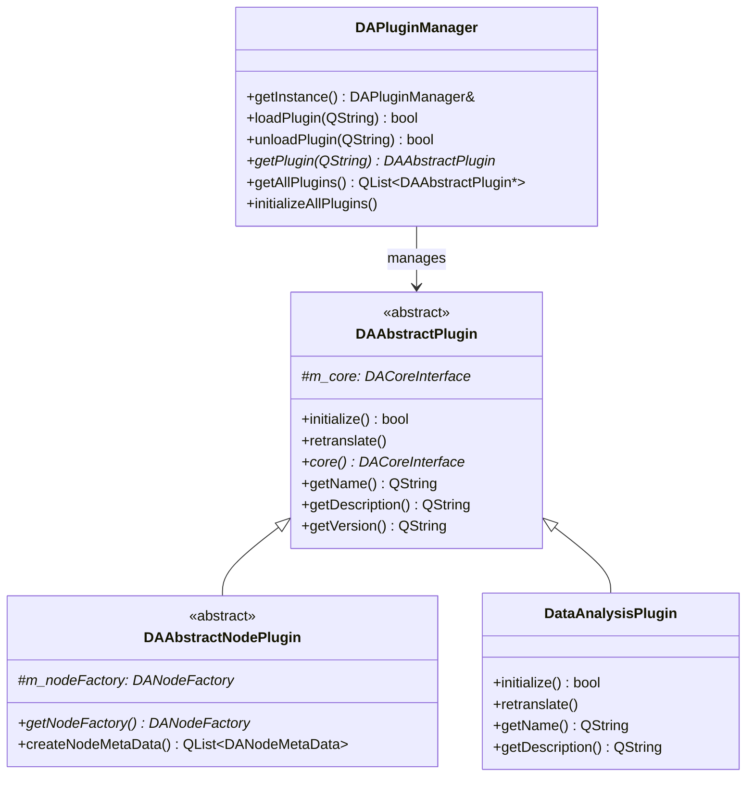

**类设计说明：**

- **`DAAbstractPlugin`**：所有插件的基类，定义了插件的基本接口。包含一个指向 `DACoreInterface` 的指针，插件通过它访问主程序功能。

- **`DAAbstractNodePlugin`**：工作流节点插件的基类，继承自 `DAAbstractPlugin`。如果插件需要提供工作流节点，应该继承此类。

- **`DAPluginManager`**：插件管理器，负责插件的加载、卸载和生命周期管理。使用单例模式，确保全局只有一个实例。

- **`DataAnalysisPlugin`**：具体插件的示例，展示了如何实现一个数据分析插件。

### 3.2 插件生命周期

理解插件的生命周期对于正确实现插件至关重要。下图展示了插件从加载到卸载的完整生命周期：

```mermaid
stateDiagram-v2
    [*] --> Unloaded: 插件编译完成
    
    Unloaded --> Loading: loadPlugin()
    
    Loading --> Validating: QPluginLoader::load()
    
    Validating --> Initializing: 接口验证通过
    Validating --> Error: 接口验证失败
    
    Initializing --> Active: initialize() 返回 true
    Initializing --> Error: initialize() 返回 false
    
    Active --> Running: 正常运行
    
    Running --> Unloading: unloadPlugin()
    Error --> Unloading: unloadPlugin()
    
    Unloading --> Unloaded: 清理完成
    
    Active --> Retranslating: 语言变更
    Retranslating --> Active: retranslate() 完成
```

**生命周期状态详解：**

| 状态 | 说明 | 插件应做的操作 |
|------|------|---------------|
| **Unloaded** | 插件尚未加载到内存 | 无 |
| **Loading** | 正在加载动态库 | 无 |
| **Validating** | 正在验证插件接口是否正确 | 无 |
| **Initializing** | 正在调用 `initialize()` 方法 | 初始化资源、注册功能、连接信号槽 |
| **Active** | 插件已激活，准备就绪 | 等待用户操作 |
| **Running** | 插件正在执行功能 | 处理业务逻辑 |
| **Retranslating** | 正在处理语言变更 | 更新界面文本 |
| **Error** | 加载或初始化失败 | 记录错误信息 |
| **Unloading** | 正在卸载插件 | 释放资源、断开连接 |

**生命周期方法说明：**

1. **`initialize()`**：这是最重要的生命周期方法，在插件加载后调用。插件应该在此方法中：
   - 获取并保存接口引用
   - 创建工作对象
   - 注册菜单项、工具栏按钮
   - 连接信号槽

2. **`retranslate()`**：当应用程序语言变更时调用。插件应该在此方法中更新所有用户可见的文本。

### 3.3 插件开发规范

!!! example "插件项目结构"

    一个典型的 DAWorkBench 插件项目应该遵循以下目录结构：
    
    ```
    plugins/DataAnalysis/
    ├── CMakeLists.txt              # 构建配置
    ├── DataAnalysisPlugin.h        # 插件主类头文件
    ├── DataAnalysisPlugin.cpp      # 插件主类实现
    ├── DataAnalysisBaseWorker.h    # 工作类基类头文件
    ├── DataAnalysisBaseWorker.cpp  # 工作类基类实现
    ├── DataAnalysisNodeFactory.h   # 节点工厂头文件（如需）
    ├── DataAnalysisNodeFactory.cpp # 节点工厂实现（如需）
    ├── Dialogs/                    # 对话框目录
    │   ├── SomeDialog.h
    │   ├── SomeDialog.cpp
    │   └── SomeDialog.ui
    ├── PyScripts/                  # Python 脚本目录
    │   └── DADataAnalysis/
    │       ├── __init__.py         # 模块初始化
    │       ├── dataframe_cleaner.py # 数据清洗脚本
    │       ├── dataframe_io.py     # 数据导入导出脚本
    │       └── utils.py            # 工具函数
    └── icon/                       # 图标资源目录
        ├── icon1.svg
        └── icon2.png
    ```

**目录结构说明：**

- **CMakeLists.txt**：定义插件的构建配置，包括源文件列表、依赖库、输出目录等。
- **插件主类**：实现 `DAAbstractPlugin` 接口，是插件的入口点。
- **工作类**：封装具体的业务逻辑，与插件主类分离，便于测试和复用。
- **节点工厂**：如果插件提供工作流节点，需要实现节点工厂。
- **对话框**：用户交互界面，使用 Qt Designer 设计。
- **Python 脚本**：业务逻辑的 Python 实现，可以被 C++ 代码调用。
- **图标资源**：插件使用的图标文件。

=== "插件头文件"

    插件头文件定义了插件的主类。以下是 `DataAnalysisPlugin` 的头文件示例：
    
    ```cpp title="DataAnalysisPlugin.h"
    #ifndef DATAANALYSISPLUGIN_H
    #define DATAANALYSISPLUGIN_H
    
    #include "DAAbstractPlugin.h"
    #include "DataAnalysisGlobal.h"
    
    class DataAnalysisBaseWorker;
    
    /**
     * @brief 数据分析插件主类
     * 
     * 此插件提供数据清洗、转换和分析功能。
     * 继承自 DAAbstractPlugin，实现插件的基本接口。
     */
    class DATAANALYSIS_API DataAnalysisPlugin : public DA::DAAbstractPlugin
    {
        Q_OBJECT
        // Qt 插件元数据，定义插件 ID 和配置文件
        Q_PLUGIN_METADATA(IID DAABSTRACTPLUGIN_IID FILE "DataAnalysis.json")
        // 声明实现的接口
        Q_INTERFACES(DA::DAAbstractPlugin)
        
    public:
        DataAnalysisPlugin();
        ~DataAnalysisPlugin();
        
        // 插件信息方法
        QString getName() const override;
        QString getDescription() const override;
        QString getVersion() const override;
        
        // 生命周期方法
        bool initialize() override;
        void retranslate() override;
        
    private:
        DataAnalysisBaseWorker* m_worker;  // 工作对象
    };
    
    #endif
    ```
    
    **关键点说明：**
    - `Q_PLUGIN_METADATA` 宏定义了插件的元数据，包括接口 ID 和配置文件
    - `Q_INTERFACES` 宏声明了插件实现的接口
    - 插件类应该导出符号（使用 `DATAANALYSIS_API` 宏）

=== "插件实现文件"

    插件实现文件包含了插件的具体逻辑。以下是 `DataAnalysisPlugin` 的实现示例：
    
    ```cpp title="DataAnalysisPlugin.cpp"
    #include "DataAnalysisPlugin.h"
    #include "DataAnalysisBaseWorker.h"
    #include <QDebug>
    
    DataAnalysisPlugin::DataAnalysisPlugin()
        : m_worker(nullptr)
    {
        // 构造函数中不应该访问主程序接口
        // 因为此时主程序可能尚未完全初始化
    }
    
    DataAnalysisPlugin::~DataAnalysisPlugin()
    {
        // 析构函数中清理资源
        if (m_worker) {
            delete m_worker;
            m_worker = nullptr;
        }
    }
    
    QString DataAnalysisPlugin::getName() const
    {
        return tr("Data Analysis");
    }
    
    QString DataAnalysisPlugin::getDescription() const
    {
        return tr("Provides data cleaning, transformation and analysis functions");
    }
    
    QString DataAnalysisPlugin::getVersion() const
    {
        return "1.0.0";
    }
    
    bool DataAnalysisPlugin::initialize()
    {
        // 1. 获取核心接口
        DA::DACoreInterface* core = this->core();
        if (!core) {
            qCritical() << "Failed to get core interface";
            return false;
        }
        
        // 2. 创建工作对象
        m_worker = new DataAnalysisBaseWorker(this);
        if (!m_worker->initialize(core)) {
            qCritical() << "Failed to initialize worker";
            delete m_worker;
            m_worker = nullptr;
            return false;
        }
        
        // 3. 注册菜单项和工具栏按钮
        // ... 具体实现 ...
        
        // 4. 连接信号槽
        // ... 具体实现 ...
        
        qDebug() << "DataAnalysis plugin initialized successfully";
        return true;
    }
    
    void DataAnalysisPlugin::retranslate()
    {
        // 处理语言变更
        // 更新所有用户可见的文本
        if (m_worker) {
            m_worker->retranslate();
        }
    }
    ```
    
    **实现要点：**
    - 构造函数中不要访问主程序接口
    - `initialize()` 方法返回 `true` 表示初始化成功，`false` 表示失败
    - 失败时应该清理已分配的资源
    - 使用 `qDebug()`/`qCritical()` 输出日志信息

---

## 第四部分：Python 脚本调用规范

### 4.1 脚本调用架构

DAWorkBench 支持在 C++ 代码中调用 Python 脚本，这使得业务逻辑可以用 Python 实现，充分利用 Python 丰富的数据处理库。下图展示了脚本调用的架构：

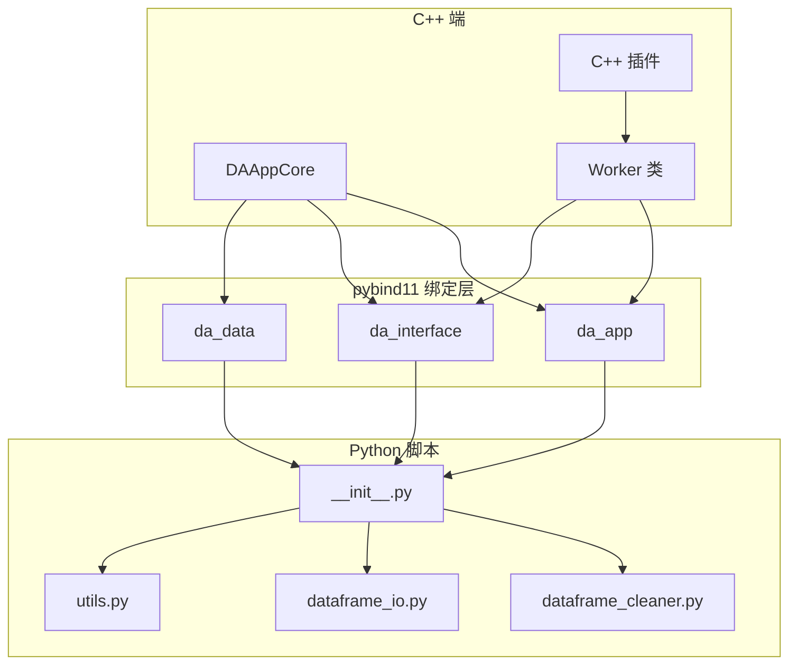

**架构说明：**

1. **C++ 端**：包括主程序核心、插件和工作类。工作类负责封装对 Python 脚本的调用。

2. **pybind11 绑定层**：将 C++ 接口暴露给 Python，包括三个主要模块：
   - `da_app`：应用级别的功能
   - `da_interface`：接口类型定义
   - `da_data`：数据类型定义

3. **Python 脚本**：业务逻辑的实现，通过导入绑定模块访问主程序功能。

### 4.2 主程序调用 Python 脚本

!!! tip "标准调用模式"

    从 C++ 调用 Python 脚本需要遵循一定的模式，确保线程安全和正确性。

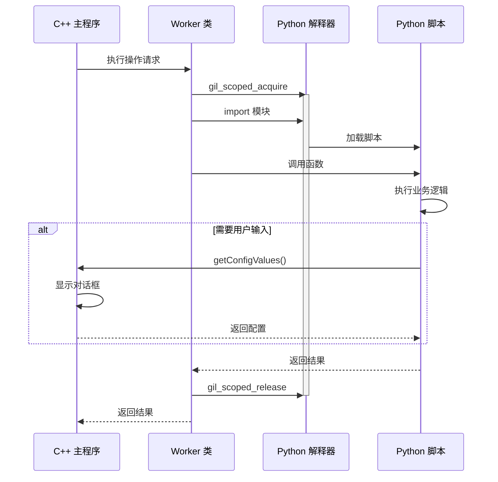

**调用流程详解：**

1. **获取 GIL**：在调用任何 Python 代码之前，必须获取全局解释器锁（GIL）。使用 `py::gil_scoped_acquire` RAII 类可以自动管理 GIL 的获取和释放。

2. **导入模块**：使用 `py::module::import()` 导入 Python 模块。模块会被缓存，后续导入会更快。

3. **获取函数**：使用 `module.attr()` 获取模块中的函数对象。

4. **调用函数**：使用函数调用语法或 `py::function` 的 `operator()` 调用 Python 函数。

5. **处理结果**：将 Python 返回值转换为 C++ 类型。使用 `py::object::cast<T>()` 进行类型转换。

6. **释放 GIL**：当 `gil_scoped_acquire` 对象析构时，GIL 会自动释放。

=== "C++ 调用 Python 函数"

    以下代码展示了如何在 C++ 中调用 Python 函数：
    
    ```cpp title="DataAnalysisBaseWorker.cpp"
    #include <pybind11/pybind11.h>
    #include <pybind11/functional.h>
    
    namespace py = pybind11;
    
    bool DataAnalysisBaseWorker::callPythonFunction(
        const QString& moduleName,
        const QString& functionName,
        const py::dict& args)
    {
        // 1. 获取 GIL
        // gil_scoped_acquire 在构造时获取 GIL，析构时释放
        // 这是 RAII 模式，确保异常安全
        py::gil_scoped_acquire acquire;
        
        try {
            // 2. 导入模块
            // 如果模块已经导入，会返回缓存的模块对象
            py::module module = py::module::import(
                moduleName.toStdString().c_str());
            
            // 3. 获取函数
            // attr() 返回模块中的属性，这里获取的是函数
            py::function func = module.attr(
                functionName.toStdString().c_str());
            
            // 4. 调用函数
            // 使用 **args 语法传递关键字参数
            py::object result = func(**args);
            
            // 5. 处理结果
            // 检查返回值是否为 None
            if (result.is_none()) {
                return false;
            }
            
            // 将 Python 对象转换为 C++ 类型
            return result.cast<bool>();
            
        } catch (const py::error_already_set& e) {
            // Python 异常会被转换为 error_already_set
            QString err = QString::fromStdString(e.what());
            m_ui->addCriticalLogMessage(err);
            return false;
        } catch (const std::exception& e) {
            // 其他 C++ 异常
            m_ui->addCriticalLogMessage(QString::fromStdString(e.what()));
            return false;
        }
    }
    ```
    
    **异常处理说明：**
    - `py::error_already_set`：Python 异常被捕获后抛出的 C++ 异常
    - 应该捕获所有异常，避免异常传播到 Python 端
    - 使用 `e.what()` 获取异常信息

=== "Python 脚本实现"

    以下是 Python 脚本的典型实现模式：
    
    ```python title="dataframe_cleaner.py"
    import da_app, da_interface, da_data
    import pandas as pd
    from typing import Optional
    
    def dropna() -> Optional[int]:
        """
        删除缺失值
        
        这是典型的 Python 脚本函数模式：
        1. 获取接口
        2. 获取数据
        3. 获取用户配置
        4. 执行操作
        5. 更新数据
        6. 返回结果
        
        Returns:
            删除的行数，失败返回 None
        """
        # 1. 获取接口
        # 通过 da_app 模块获取核心接口
        core = da_app.getCore()
        ui = core.getUiInterface()
        data_mgr = core.getDataManagerInterface()
        
        # 2. 获取选中数据
        # 从数据管理器获取用户选中的数据
        select_datas = data_mgr.getSelectDatas()
        if not select_datas:
            ui.addWarningLogMessage("请先选择数据")
            return None
        
        # 获取第一个选中的数据
        dadata = select_datas[0]
        
        # 3. 获取用户配置
        # 使用配置构建器创建配置对话框
        import DAWorkbench.property_config_builder as cfgBuilder
        
        builder = cfgBuilder.PropertyConfigBuilder("删除缺失值")
        builder.add_enum(
            name="how",
            display_name="删除条件",
            default_value="any",
            enum_items=["any", "all"],
            enum_descriptions=["任意值为空", "所有值为空"]
        )
        
        # 显示对话框并获取用户输入
        config = ui.getConfigValues(builder.to_json(), "dropna")
        if not config:
            return None  # 用户取消
        
        # 4. 执行操作
        # 使用 pandas 处理数据
        df = dadata.toDataFrame()
        old_len = len(df)
        df = df.dropna(how=config.get("how", "any"))
        
        # 5. 更新数据
        # 将处理后的数据写回
        dadata.setPyObject(df)
        
        # 6. 返回结果
        removed = old_len - len(df)
        ui.addInfoLogMessage(f"删除了 {removed} 行")
        
        return removed
    ```

### 4.3 Python 脚本发起 UI 操作

!!! warning "线程安全要求"
    Python 脚本可能在后台线程执行，UI 操作必须通过 `DAPythonSignalHandler` 投递到主线程。

Qt 框架要求所有 UI 操作必须在主线程中执行。如果 Python 脚本在后台线程中运行，直接调用 UI 方法会导致未定义行为，甚至程序崩溃。DAWorkBench 提供了 `DAPythonSignalHandler` 来解决这个问题。

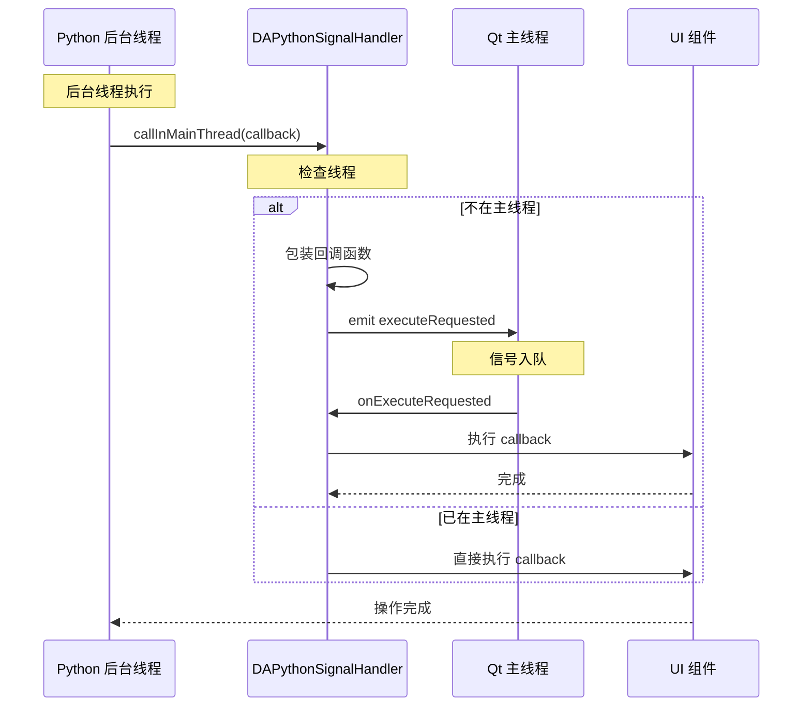

**线程安全机制说明：**

1. **线程检测**：`DAPythonSignalHandler` 会检测当前是否在主线程中。

2. **直接执行**：如果已在主线程，回调函数会直接执行，避免不必要的开销。

3. **信号投递**：如果不在主线程，回调函数会被包装并通过 Qt 信号槽机制投递到主线程。

4. **异步执行**：回调函数在主线程的事件循环中被执行，不会阻塞调用线程。

=== "安全的 UI 操作"

    以下代码展示了如何在后台线程中安全地更新 UI：
    
    ```python title="安全的 UI 操作示例"
    import da_app
    
    def background_task():
        """
        后台线程中的任务
        
        演示如何在后台线程中执行耗时操作，
        并安全地更新 UI。
        """
        import threading
        import time
        
        def worker():
            # 执行耗时计算
            # 这部分代码在后台线程中运行
            # 不会阻塞 UI
            time.sleep(5)
            result = "计算完成"
            
            # 安全地更新 UI
            # 必须通过 callInMainThread 投递到主线程
            update_ui_safely(result)
        
        # 启动后台线程
        thread = threading.Thread(target=worker, daemon=True)
        thread.start()
    
    def update_ui_safely(message: str):
        """
        安全地更新 UI（自动处理线程问题）
        
        此函数会自动检测当前线程，
        如果不在主线程，会将操作投递到主线程。
        """
        core = da_app.getCore()
        handler = core.getPythonSignalHandler()
        
        def update():
            """此函数将在主线程执行"""
            # 在这里可以安全地操作 UI 组件
            ui = core.getUiInterface()
            ui.addInfoLogMessage(message)
            
            # 可以安全地操作状态栏
            status_bar = ui.getStatusBar()
            if status_bar:
                status_bar.showMessage(message, 5000)
        
        # 投递到主线程
        # 如果已在主线程，会直接执行
        # 如果不在主线程，会通过信号槽投递
        handler.callInMainThread(update)
    ```

=== "显示对话框"

    配置对话框是用户输入参数的主要方式。以下代码展示了如何构建和显示配置对话框：
    
    ```python title="显示配置对话框"
    def show_config_dialog():
        """
        显示配置对话框并获取用户输入
        
        注意：此函数必须在主线程调用，
        因为对话框是 UI 组件。
        """
        import DAWorkbench.property_config_builder as pcb
        
        core = da_app.getCore()
        ui = core.getUiInterface()
        
        # 构建配置
        # PropertyConfigBuilder 提供了声明式的配置构建方式
        builder = pcb.PropertyConfigBuilder("参数设置")
        
        # 添加分组
        builder.begin_group("基本设置")
        
        # 添加字符串输入
        builder.add_string(
            name="name",
            display_name="名称",
            default_value="",
            description="输入名称"
        )
        
        # 添加整数输入
        builder.add_int(
            name="count",
            display_name="数量",
            default_value=10,
            min_value=1,
            max_value=100
        )
        
        builder.end_group()
        
        # 添加另一个分组
        builder.begin_group("高级设置")
        
        # 添加布尔值
        builder.add_bool(
            name="advanced",
            display_name="启用高级模式",
            default_value=False
        )
        
        builder.end_group()
        
        # 显示对话框
        # 第二个参数是缓存键，用于记住上次设置
        config = ui.getConfigValues(
            builder.to_json(),
            "my_plugin.config"  # 缓存键
        )
        
        if config:
            # 用户点击确定
            name = config.get("name", "")
            count = config.get("count", 10)
            advanced = config.get("advanced", False)
            
            return config
        else:
            # 用户取消
            return None
    ```
    
    **配置对话框的特点：**
    - 支持多种输入类型：字符串、整数、浮点数、布尔值、枚举等
    - 支持分组组织
    - 自动记住上次设置（通过缓存键）
    - 支持输入验证

---

## 第五部分：模块间通信协议

### 5.1 通信方式概览

DAWorkBench 提供了多种模块间通信方式，每种方式适用于不同的场景：

| 通信方式 | 适用场景 | 线程安全 | 性能 | 使用复杂度 |
|----------|----------|----------|------|-----------|
| 直接接口调用 | 同步操作、获取数据 | 需注意 | 高 | 低 |
| 信号槽 | 事件通知、松耦合通信 | 安全 | 中 | 中 |
| DAPythonSignalHandler | 跨线程 UI 操作 | 安全 | 中 | 中 |
| 数据管理器 | 数据传递、共享数据 | 需注意 | 高 | 低 |

**通信方式选择指南：**

- **直接接口调用**：当需要同步获取数据或执行操作时使用。注意在跨线程调用时需要适当的同步机制。

- **信号槽**：当需要事件通知或松耦合通信时使用。Qt 的信号槽机制自动处理跨线程通信。

- **DAPythonSignalHandler**：当 Python 脚本需要从后台线程操作 UI 时使用。确保 UI 操作在主线程执行。

- **数据管理器**：当需要在模块间传递数据时使用。数据管理器提供了统一的数据存储和访问接口。

### 5.2 数据传递协议

数据管理器是模块间数据传递的核心组件。它提供了数据的存储、检索和通知功能。

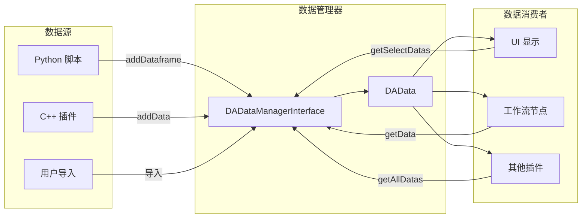

**数据传递流程说明：**

1. **数据生产者**（Python 脚本、C++ 插件、用户导入）将数据添加到数据管理器。

2. **数据管理器**存储数据，并通知所有监听者数据已变更。

3. **数据消费者**（UI 显示、工作流节点、其他插件）从数据管理器获取数据。

这种设计实现了数据生产者和消费者的解耦，生产者不需要知道谁会使用数据，消费者也不需要知道数据来自哪里。

=== "Python 添加数据"

    Python 脚本可以通过数据管理器添加数据：
    
    ```python
    def add_dataframe_to_manager(df, name: str):
        """
        将 DataFrame 添加到数据管理器
        
        这是 Python 脚本向主程序传递数据的标准方式。
        
        Args:
            df: pandas DataFrame
            name: 数据名称
        """
        core = da_app.getCore()
        data_mgr = core.getDataManagerInterface()
        
        # 方式1：使用便捷方法
        # addDataframe 方法会自动创建 DAData 对象并设置名称
        data_mgr.addDataframe(df, name)
        
        # 方式2：创建 DAData 对象
        # 这种方式更灵活，可以设置更多属性
        # data = da_data.DAData(df)
        # data.setName(name)
        # data_mgr.addData(data)
        
        # 标记项目为已修改
        # 这会触发主窗口标题更新，显示未保存状态
        core.setProjectDirty(True)
    ```

=== "C++ 获取数据"

    C++ 代码可以从数据管理器获取数据：
    
    ```cpp
    void processData(DACoreInterface* core)
    {
        DADataManagerInterface* dm = core->getDataManagerInterface();
        
        // 获取所有数据
        // 返回数据列表，可能为空
        QList<DAData> allData = dm->getAllDatas();
        
        // 获取选中数据
        // 返回用户在界面中选中的数据
        QList<DAData> selectData = dm->getSelectDatas();
        
        // 获取当前操作数据
        // 返回当前正在编辑的数据
        DAData operateData = dm->getOperateData();
        
        // 检查数据类型并处理
        if (operateData.isDataFrame()) {
            DAPyDataFrame df = operateData.toDataFrame();
            // 处理 DataFrame
            // ...
        }
    }
    ```

### 5.3 事件通知机制

事件通知是模块间通信的重要方式。DAWorkBench 提供了多种事件通知机制：

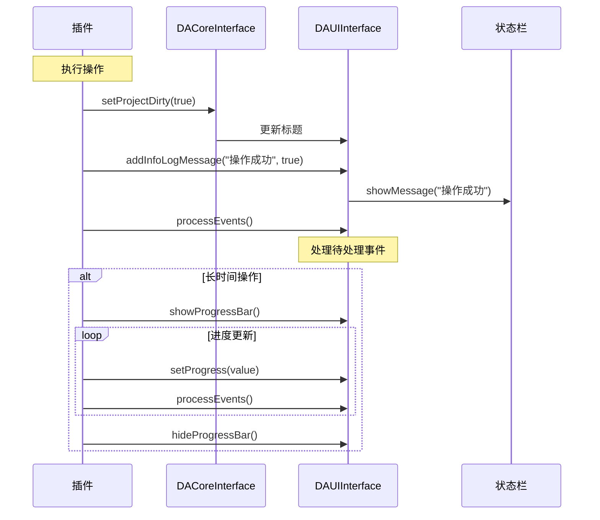

**事件通知类型：**

1. **项目状态变更**：通过 `setProjectDirty()` 通知主程序项目已修改。

2. **日志消息**：通过 `addInfoLogMessage()` 等方法输出日志，同时可选地显示在状态栏。

3. **进度报告**：通过状态栏接口显示进度条和进度文本。

4. **事件处理**：通过 `processEvents()` 处理待处理的 UI 事件，保持界面响应。

=== "进度报告"

    长时间运行的任务应该向用户报告进度：
    
    ```python
    def long_running_task():
        """
        长时间任务，带进度报告
        
        演示如何在长时间任务中保持 UI 响应，
        并向用户报告进度。
        """
        core = da_app.getCore()
        ui = core.getUiInterface()
        status = ui.getStatusBar()
        
        # 显示进度条
        status.showProgressBar()
        status.setProgressText("处理中...")
        
        total = 100
        for i in range(total):
            # 执行工作
            do_work(i)
            
            # 更新进度
            progress = int((i + 1) / total * 100)
            status.setProgress(progress)
            
            # 处理 UI 事件
            # 这很重要，否则界面会无响应
            ui.processEvents()
        
        # 隐藏进度条
        status.hideProgressBar()
        status.clearProgressText()
        
        ui.addInfoLogMessage("任务完成")
    ```
    
    **进度报告的注意事项：**
    - 在循环中定期调用 `processEvents()` 保持 UI 响应
    - 进度更新不要太频繁，避免性能问题
    - 任务完成后隐藏进度条

---

## 第六部分：完整示例

### 6.1 数据分析插件完整流程

以下是一个完整的数据分析插件工作流程，展示了从用户点击按钮到操作完成的全过程：

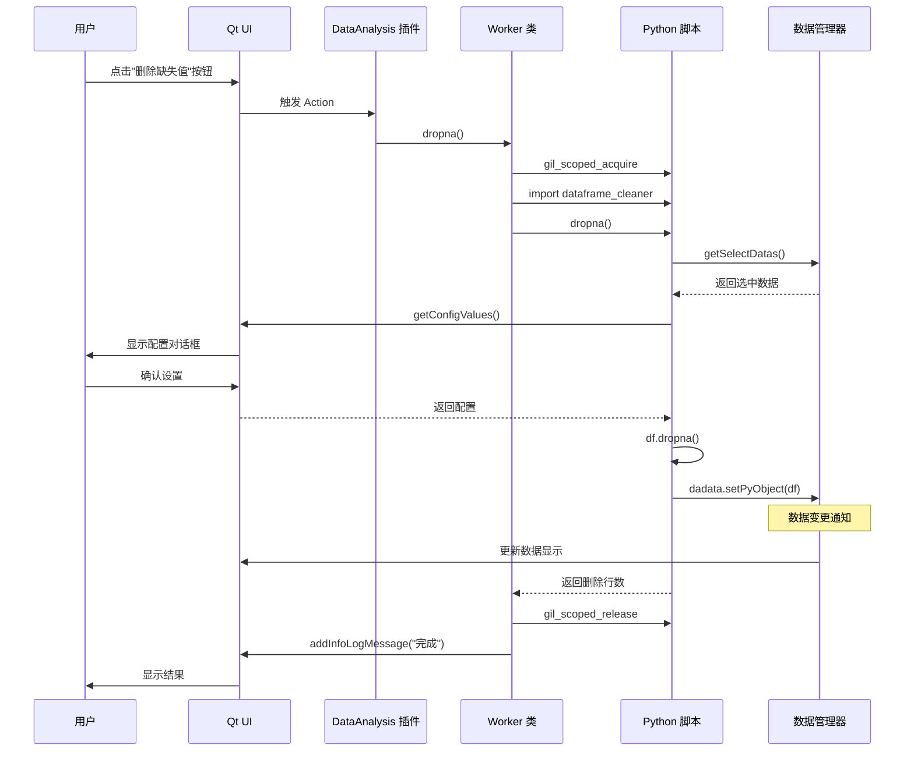

**流程详解：**

1. **用户触发**：用户在界面上点击"删除缺失值"按钮。

2. **插件响应**：插件接收到按钮点击事件，调用 Worker 类的 `dropna()` 方法。

3. **Python 调用**：Worker 类获取 GIL，导入 Python 模块，调用 Python 函数。

4. **数据获取**：Python 脚本从数据管理器获取用户选中的数据。

5. **用户配置**：Python 脚本请求显示配置对话框，用户输入参数。

6. **数据处理**：Python 脚本使用 pandas 处理数据。

7. **数据更新**：处理后的数据写回数据管理器，触发 UI 更新。

8. **结果返回**：Python 脚本返回结果，Worker 类释放 GIL。

9. **结果展示**：Worker 类通知 UI 显示结果消息。

### 6.2 完整代码示例

以下是实现上述流程的完整代码：

=== "C++ Worker 类"

    Worker 类是插件的核心，负责协调 C++ 和 Python 代码：
    
    ```cpp title="DataframeCleanerWorker.h"
    #ifndef DATAFRAMECLEANERWORKER_H
    #define DATAFRAMECLEANERWORKER_H
    
    #include <QObject>
    #include "DAInterfaceHelper.h"
    
    /**
     * @brief 数据清洗工作类
     * 
     * 封装数据清洗相关的业务逻辑，
     * 负责调用 Python 脚本执行具体操作。
     */
    class DataframeCleanerWorker : public QObject
    {
        Q_OBJECT
        
    public:
        explicit DataframeCleanerWorker(QObject* parent = nullptr);
        
        /**
         * @brief 初始化工作类
         * @param core 核心接口指针
         */
        void initialize(DA::DACoreInterface* core);
        
    public Q_SLOTS:
        /**
         * @brief 删除缺失值
         * 调用 Python 的 dropna 函数
         */
        void dropna();
        
        /**
         * @brief 删除重复值
         * 调用 Python 的 drop_duplicates 函数
         */
        void dropDuplicates();
        
        /**
         * @brief 填充缺失值
         * 调用 Python 的 fillna 函数
         */
        void fillna();
        
    private:
        DA::DACoreInterface* m_core;
        DA::DAUIInterface* m_ui;
        DA::DADataManagerInterface* m_dataManager;
    };
    
    #endif
    ```

=== "Python 脚本"

    Python 脚本实现具体的业务逻辑：
    
    ```python title="dataframe_cleaner.py"
    # -*- coding: utf-8 -*-
    """
    DataFrame 数据清洗工具集
    
    此模块提供数据清洗相关的功能，
    包括删除缺失值、删除重复值、填充缺失值等。
    """
    import da_app, da_interface, da_data
    import pandas as pd
    from typing import Optional, List, Dict, Any
    
    def _get_interfaces():
        """
        获取所有接口的辅助函数
        
        将接口获取逻辑封装在函数中，
        方便在脚本的多个地方复用。
        
        Returns:
            tuple: (core, ui, data_manager)
        """
        core = da_app.getCore()
        return (
            core,
            core.getUiInterface(),
            core.getDataManagerInterface()
        )
    
    def _get_selected_dataframe():
        """
        获取选中的 DataFrame
        
        从数据管理器获取用户选中的数据，
        并转换为 pandas DataFrame。
        
        Returns:
            tuple: (dadata, df) 或 (None, None) 如果没有选中数据
        """
        core, ui, data_mgr = _get_interfaces()
        
        select_datas = data_mgr.getSelectDatas()
        if not select_datas:
            ui.addWarningLogMessage("请先选择数据")
            return None, None
        
        dadata = select_datas[0]
        df = dadata.toDataFrame()
        
        return dadata, df
    
    def dropna() -> Optional[int]:
        """
        删除包含缺失值的行
        
        显示配置对话框让用户选择删除条件，
        然后执行删除操作。
        
        Returns:
            删除的行数，失败返回 None
        """
        dadata, df = _get_selected_dataframe()
        if dadata is None:
            return None
        
        core, ui, data_mgr = _get_interfaces()
        
        # 构建配置对话框
        import DAWorkbench.property_config_builder as pcb
        
        builder = pcb.PropertyConfigBuilder("删除缺失值设置")
        
        builder.add_enum(
            name="how",
            display_name="删除条件",
            default_value="any",
            enum_items=["any", "all"],
            enum_descriptions=[
                "行中任意值为空时删除",
                "行中所有值为空时删除"
            ]
        )
        
        builder.add_bool(
            name="reindex",
            display_name="重置行号",
            default_value=True
        )
        
        # 获取用户配置
        config = ui.getConfigValues(builder.to_json(), "cleaner.dropna")
        if not config:
            return None
        
        # 执行操作
        how = config.get("how", "any")
        reindex = config.get("reindex", True)
        
        old_len = len(df)
        df = df.dropna(how=how)
        
        if reindex:
            df = df.reset_index(drop=True)
        
        # 更新数据
        dadata.setPyObject(df)
        
        # 报告结果
        removed = old_len - len(df)
        ui.addInfoLogMessage(f"已删除 {removed} 行包含缺失值的数据")
        
        return removed
    
    def drop_duplicates() -> Optional[int]:
        """
        删除重复行
        
        显示配置对话框让用户选择保留策略，
        然后执行删除操作。
        
        Returns:
            删除的行数，失败返回 None
        """
        dadata, df = _get_selected_dataframe()
        if dadata is None:
            return None
        
        core, ui, data_mgr = _get_interfaces()
        
        # 构建配置对话框
        import DAWorkbench.property_config_builder as pcb
        
        builder = pcb.PropertyConfigBuilder("删除重复行设置")
        
        builder.add_enum(
            name="keep",
            display_name="保留策略",
            default_value="first",
            enum_items=["first", "last", "none"],
            enum_descriptions=[
                "保留首次出现",
                "保留最后出现",
                "删除所有重复项"
            ]
        )
        
        config = ui.getConfigValues(builder.to_json(), "cleaner.drop_duplicates")
        if not config:
            return None
        
        keep = config.get("keep", "first")
        if keep == "none":
            keep = False
        
        old_len = len(df)
        df = df.drop_duplicates(keep=keep)
        
        dadata.setPyObject(df)
        
        removed = old_len - len(df)
        ui.addInfoLogMessage(f"已删除 {removed} 个重复行")
        
        return removed
    ```

---

## 第七部分：最佳实践

### 7.1 插件开发检查清单

!!! tip "开发检查清单"
    
    在开发插件时，请确保完成以下检查项：
    
    === "架构设计"
        - [ ] 插件职责单一，功能边界清晰
        - [ ] 通过接口访问主程序功能，不直接依赖实现
        - [ ] Python 脚本与 C++ 代码职责分离
        - [ ] 遵循项目目录结构规范
    
    === "线程安全"
        - [ ] 所有 Python 调用都有 GIL 管理
        - [ ] UI 操作通过 `DAPythonSignalHandler` 投递
        - [ ] 共享数据访问有适当的锁保护
        - [ ] 避免在后台线程直接操作 UI
    
    === "错误处理"
        - [ ] 捕获并处理所有可能的异常
        - [ ] 向用户提供有意义的错误信息
        - [ ] 记录详细的调试日志
        - [ ] 错误时正确清理资源
    
    === "用户体验"
        - [ ] 长时间操作显示进度
        - [ ] 操作可撤销（使用 Command 接口）
        - [ ] 配置有合理的默认值
        - [ ] 提供操作成功的反馈

### 7.2 性能优化建议

性能优化是插件开发中的重要考虑因素。以下是一些关键的性能优化建议：

1. **减少跨语言调用**
    
    跨语言调用（C++ 调用 Python 或 Python 调用 C++）有一定的开销。应该尽量减少调用次数：
    
    - 批量处理数据，避免频繁的单条操作
    - 在 Python 端完成复杂计算，减少 C++/Python 边界跨越
    - 缓存常用的 Python 模块和函数引用

2. **合理使用 GIL**
    
    GIL（全局解释器锁）是 Python 多线程的主要限制。合理使用 GIL 可以提高性能：
    
    ```python
    # 在 Python 端释放 GIL 进行 C++ 计算
    def heavy_computation():
        # Python 准备数据
        data = prepare_data()
        
        # 调用 C++ 计算（C++ 端应释放 GIL）
        # 这样其他 Python 线程可以并行执行
        result = cpp_module.compute(data)
        
        return result
    ```

3. **缓存模块引用**
    
    避免重复导入模块和获取接口：
    
    ```python
    # 在模块级别缓存
    _cached_interfaces = None
    
    def get_interfaces():
        global _cached_interfaces
        if _cached_interfaces is None:
            core = da_app.getCore()
            _cached_interfaces = (core, core.getUiInterface(), ...)
        return _cached_interfaces
    ```

### 7.3 调试技巧

调试插件和 Python 脚本时，以下技巧可以帮助快速定位问题：

=== "Python 调试"

    ```python
    # 启用详细日志
    import logging
    logging.basicConfig(level=logging.DEBUG)
    
    # 使用调试器
    import pdb
    
    def problematic_function():
        pdb.set_trace()  # 断点
        # ...
    
    # 打印调用栈
    import traceback
    traceback.print_stack()
    
    # 打印详细异常信息
    try:
        # ...
    except Exception as e:
        import traceback
        traceback.print_exc()
    ```

=== "C++ 调试"

    ```cpp
    // 启用 Python 调试输出
    void enablePythonDebug() {
        PyGILState_STATE gil = PyGILState_Ensure();
        
        PyRun_SimpleString(
            "import sys\n"
            "sys.stdout = sys.stderr\n"
        );
        
        PyGILState_Release(gil);
    }
    
    // 打印 Python 异常
    void printPythonError() {
        PyObject *type, *value, *traceback;
        PyErr_Fetch(&type, &value, &traceback);
        
        if (value) {
            PyObject* str = PyObject_Str(value);
            qDebug() << "Python error:" << PyUnicode_AsUTF8(str);
            Py_XDECREF(str);
        }
        
        Py_XDECREF(type);
        Py_XDECREF(value);
        Py_XDECREF(traceback);
    }
    
    // 使用 Qt 日志
    qDebug() << "Debug message";
    qInfo() << "Info message";
    qWarning() << "Warning message";
    qCritical() << "Critical message";
    ```

---

## 相关模块

| 模块 | 说明 |
|------|------|
| `DAPluginSupport` | 插件支持模块，提供插件基类和管理器 |
| `DAInterface` | 接口模块，定义核心接口 |
| `DAPyBindQt` | Python 绑定模块 |
| `DAData` | 数据处理模块 |

## 参考资料

- [插件与接口说明](./plugins-interfaces.md)
- [插件模块详解](./plugin-module.md)
- [接口模块详解](./interface-module.md)
- [C++ 与 Python 集成](./python-in-cpp.md)
