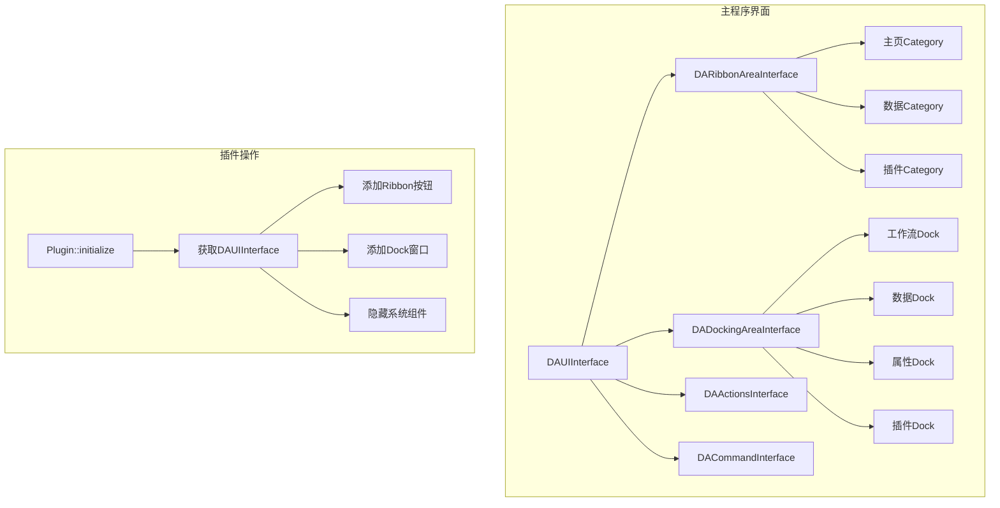

# 插件界面开发

插件的入口函数是`Plugin::initialize`，在调用此函数时，主程序的界面已经创建完成，此时可以进行插件界面的初始化。

## 主要功能特性

**特性**

- ✅ **界面组件访问**：通过核心接口获取Ribbon、DockingArea等界面组件
- ✅ **界面扩展**：添加自定义Dock窗口、Ribbon按钮、菜单项
- ✅ **界面隐藏**：隐藏不需要的系统界面组件
- ✅ **Action管理**：统一管理界面中的所有Action
- ✅ **命令接口**：通过命令接口执行系统命令

## 获取界面的主要组件

插件的核心函数是`core()`函数，此函数返回核心对象，`data-workbench`的所有可开放对象都可以通过`core()`获取。

其中ui相关的接口对象通过`DACoreInterface::getUiInterface`函数获取，此函数返回`DAUIInterface`对象。

### DAUIInterface 关键函数

```cpp
//获取界面的docking区域
virtual DADockingAreaInterface* getDockingArea() = 0;
//获取界面的ribbon区域
virtual DARibbonAreaInterface* getRibbonArea() = 0;
//获取action管理器
DAActionsInterface* getActionInterface() const;
//获取命令接口，如果没有注册命令接口，返回nullptr，当前设计为一个命令接口
DACommandInterface* getCommandInterface() const;
```

### 各接口功能说明

| 接口 | 获取函数 | 功能说明 |
|------|----------|----------|
| DockingArea | `getDockingArea()` | Dock窗口区域，可添加/隐藏Dock控件 |
| RibbonArea | `getRibbonArea()` | Ribbon界面区域，可添加Ribbon控件 |
| Actions | `getActionInterface()` | Action管理器，管理所有界面Action |
| Command | `getCommandInterface()` | 命令接口，执行系统命令 |

## 界面架构图

插件界面开发涉及主程序的多个 UI 组件，下图展示了主程序界面结构与插件操作的关系：



上图说明了插件界面开发的两个层面：
- **主程序界面**：展示了 UI 接口管理的 Ribbon、DockingArea、Actions、Command 四大组件及其子结构
- **插件操作流程**：展示了插件初始化时获取 UI 接口，然后进行 Ribbon 按钮、Dock 窗口、隐藏组件等操作的流程

## 插件操作界面

### 隐藏系统窗口

插件可以隐藏主程序中不需要的系统窗口，实现定制化界面。以下示例演示如何隐藏工作流相关的界面组件：

```cpp
void MyPlugin::initialize()
{
    // 获取UI接口
    DA::DAUIInterface* ui = core()->getUiInterface();
    
    // 获取各个界面区域接口
    DA::DADockingAreaInterface* dockArea    = ui->getDockingArea();
    DA::DAActionsInterface* actionInterface = ui->getActionInterface();
    DA::DARibbonAreaInterface* ribbonArea   = ui->getRibbonArea();
    
    // 隐藏不需要的Dock窗口，如工作流操作窗口和节点列表窗口
    dockArea->hideDockWidget(dockArea->getWorkFlowOperateWidget());
    dockArea->hideDockWidget(dockArea->getWorkflowNodeListWidget());
    
    // 隐藏不需要的Ribbon面板，如工作流面板
    safeHideRibbonPanel(ribbonArea, "da-pannel-main.workflow");
}
```

执行上述代码后，工作流相关的 Dock 窗口和 Ribbon 面板被隐藏，用户界面更加简洁。

### 添加自定义Dock窗口

创建并添加自定义 Dock 窗口是插件扩展界面的常用方式。Dock 窗口可以停靠在主窗口的任意边缘区域。以下示例展示创建和添加 Dock 窗口的流程：

```cpp
bool MyPlugin::initialize()
{
    DA::DAUIInterface* ui = core()->getUiInterface();
    DA::DADockingAreaInterface* dockArea = ui->getDockingArea();
    
    // 创建自定义Dock窗口，设置标题和父窗口
    QDockWidget* myDock = new QDockWidget("数据分析", core()->getMainWindow());
    // 设置窗口内容控件
    myDock->setWidget(new MyDataAnalysisWidget(myDock));
    
    // 添加到右侧Dock区域，用户可拖动调整位置
    dockArea->addDockWidget(myDock, DA::DADockingAreaInterface::RightDockArea);
    
    // 效果：在右侧Dock区域显示自定义数据分析窗口
    return true;
}
```

执行上述代码后，右侧 Dock 区域出现"数据分析"窗口，用户可拖动到其他位置或隐藏。

### 添加Ribbon按钮

添加自定义 Ribbon 按钮和面板是插件扩展 Ribbon 界面的常用方式。Ribbon 面板按 Category（标签页）和 Panel（功能组）组织。以下示例展示添加 Ribbon 按钮的完整流程：

```cpp
bool MyPlugin::initialize()
{
    DA::DAUIInterface* ui = core()->getUiInterface();
    DA::DARibbonAreaInterface* ribbonArea = ui->getRibbonArea();
    DA::DAActionsInterface* actionMgr = ui->getActionInterface();
    
    // 在主页Category下创建自定义Panel（功能组）
    SARibbonPanel* myPanel = ribbonArea->addPanelInCategory(
        "主页",           // Category名称（已有标签页）
        "自定义工具"      // Panel名称（新建功能组）
    );
    
    // 创建Action并设置图标
    QAction* action1 = actionMgr->createAction("数据导入", this);
    QAction* action2 = actionMgr->createAction("数据导出", this);
    
    // 连接信号槽，处理按钮点击事件
    connect(action1, &QAction::triggered, this, &MyPlugin::onDataImport);
    connect(action2, &QAction::triggered, this, &MyPlugin::onDataExport);
    
    // 添加到Ribbon面板，指定按钮大小
    myPanel->addAction(action1, SARibbonActionButtonOption::LargeButtonWithText);
    myPanel->addAction(action2, SARibbonActionButtonOption::SmallButtonWithText);
    
    // 效果：在主页的自定义工具面板中显示两个按钮
    return true;
}
```

执行上述代码后，主页 Ribbon 标签页出现"自定义工具"面板，包含大号"数据导入"按钮和小号"数据导出"按钮。

### 完整界面开发示例

以下是一个完整的插件界面开发示例，包含 Dock 窗口、Ribbon 按钮和菜单项的创建。该示例展示了插件界面开发的典型结构：

**头文件声明**（定义插件类和成员变量）：

```cpp
// MyPlugin.h
class MyPlugin : public QObject, public DA::DAAbstractNodePlugin
{
    Q_OBJECT
    Q_PLUGIN_METADATA(IID DAABSTRACTNODEPLUGIN_IID)
    Q_INTERFACES(DA::DAAbstractNodePlugin)
    
public:
    bool initialize() override;
    
private slots:
    void onDataImport();
    void onDataExport();
    void onSettings();
    
private:
    void setupDockWindows();
    void setupRibbonButtons();
    void setupMenuItems();
    
    QDockWidget* m_dataDock;
    QAction* m_actionImport;
    QAction* m_actionExport;
};
```

**源文件实现**（分步骤完成界面初始化）：

```cpp
// MyPlugin.cpp
bool MyPlugin::initialize()
{
    // 获取UI接口
    DA::DAUIInterface* ui = core()->getUiInterface();
    if (!ui) {
        return false;
    }
    
    // 设置各个界面组件
    setupDockWindows();
    setupRibbonButtons();
    setupMenuItems();
    
    return true;
}

void MyPlugin::setupDockWindows()
{
    DA::DAUIInterface* ui = core()->getUiInterface();
    DA::DADockingAreaInterface* dockArea = ui->getDockingArea();
    
    // 创建数据分析Dock窗口
    m_dataDock = new QDockWidget(tr("数据分析工具"), core()->getMainWindow());
    QWidget* dataWidget = new MyDataAnalysisWidget(m_dataDock);
    m_dataDock->setWidget(dataWidget);
    m_dataDock->setObjectName("plugin.dataAnalysis.dock");  // 设置唯一标识
    
    // 添加到右侧Dock区域
    dockArea->addDockWidget(m_dataDock, DA::DADockingAreaInterface::RightDockArea);
}

void MyPlugin::setupRibbonButtons()
{
    DA::DAUIInterface* ui = core()->getUiInterface();
    DA::DARibbonAreaInterface* ribbonArea = ui->getRibbonArea();
    DA::DAActionsInterface* actionMgr = ui->getActionInterface();
    
    // 获取或创建Category（标签页）
    SARibbonCategory* category = ribbonArea->category("数据分析");
    if (!category) {
        category = ribbonArea->addCategory("数据分析");
    }
    
    // 创建Panel（功能组）
    SARibbonPanel* panel = category->panel("导入导出");
    if (!panel) {
        panel = category->addPanel("导入导出");
    }
    
    // 创建Actions并设置图标
    m_actionImport = actionMgr->createAction(tr("导入数据"), this);
    m_actionImport->setIcon(QIcon(":/icons/import.png"));
    
    m_actionExport = actionMgr->createAction(tr("导出数据"), this);
    m_actionExport->setIcon(QIcon(":/icons/export.png"));
    
    QAction* actionSettings = actionMgr->createAction(tr("设置"), this);
    actionSettings->setIcon(QIcon(":/icons/settings.png"));
    
    // 连接信号槽
    connect(m_actionImport, &QAction::triggered, this, &MyPlugin::onDataImport);
    connect(m_actionExport, &QAction::triggered, this, &MyPlugin::onDataExport);
    connect(actionSettings, &QAction::triggered, this, &MyPlugin::onSettings);
    
    // 添加到Ribbon面板，设置按钮大小
    panel->addAction(m_actionImport, SARibbonActionButtonOption::LargeButtonWithText);
    panel->addAction(m_actionExport, SARibbonActionButtonOption::LargeButtonWithText);
    panel->addAction(actionSettings, SARibbonActionButtonOption::SmallButtonWithText);
}

void MyPlugin::setupMenuItems()
{
    // 获取Action管理器添加菜单项
    DA::DAUIInterface* ui = core()->getUiInterface();
    DA::DAActionsInterface* actionMgr = ui->getActionInterface();
    
    // 将Action添加到系统菜单的"工具"菜单下
    actionMgr->addActionToMenu("工具", m_actionImport);
    actionMgr->addActionToMenu("工具", m_actionExport);
}

void MyPlugin::onDataImport()
{
    // 处理数据导入逻辑，弹出文件选择对话框
    QString fileName = QFileDialog::getOpenFileName(
        nullptr,
        tr("选择数据文件"),
        QString(),
        tr("CSV Files (*.csv);;All Files (*)")
    );
    
    if (!fileName.isEmpty()) {
        // 执行导入操作，加载文件到数据管理器
    }
}

void MyPlugin::onDataExport()
{
    // 处理数据导出逻辑
}

void MyPlugin::onSettings()
{
    // 显示设置对话框
}
```

执行上述完整代码后，插件界面包含：
- 右侧 Dock 区域的"数据分析工具"窗口
- Ribbon 的"数据分析"标签页和"导入导出"面板
- "工具"菜单下的导入/导出菜单项

## Dock窗口布局策略

### Dock区域划分

data-workbench 的 Dock 区域划分为四个主要区域，每个区域有典型的用途。下表列出了各区域的位置和推荐用途：

| 区域 | 常用位置 | 典型用途 |
|------|----------|----------|
| LeftDockArea | 左侧 | 工作流节点列表、数据管理 |
| RightDockArea | 右侧 | 属性面板、数据分析 |
| TopDockArea | 顶部 | 工具栏扩展 |
| BottomDockArea | 底部 | 输出日志、状态信息 |

### Dock窗口示例

以下示例展示如何创建一个可停靠的数据分析窗口，包含数据选择和分析结果显示功能：

```cpp
// 创建可停靠的数据分析窗口
class MyDataAnalysisWidget : public QWidget
{
    Q_OBJECT
public:
    explicit MyDataAnalysisWidget(QWidget* parent = nullptr)
        : QWidget(parent)
    {
        setupUI();
    }
    
private:
    void setupUI()
    {
        QVBoxLayout* layout = new QVBoxLayout(this);
        
        // 添加数据选择下拉框
        QComboBox* dataSelector = new QComboBox(this);
        layout->addWidget(dataSelector);
        
        // 添加分析结果显示区域（只读文本框）
        QTextEdit* resultView = new QTextEdit(this);
        resultView->setReadOnly(true);
        layout->addWidget(resultView);
        
        // 添加分析按钮
        QPushButton* analyzeBtn = new QPushButton(tr("开始分析"), this);
        layout->addWidget(analyzeBtn);
    }
};
```

执行上述代码后，创建了一个包含数据选择、结果显示和分析按钮的 Dock 窗口控件，可添加到 Dock 区域中使用。

## API 参考

### DAUIInterface 核心方法

| 方法 | 参数 | 返回值 | 说明 |
|------|------|--------|------|
| `getDockingArea()` | 无 | DADockingAreaInterface* | 获取Dock区域接口 |
| `getRibbonArea()` | 无 | DARibbonAreaInterface* | 获取Ribbon区域接口 |
| `getActionInterface()` | 无 | DAActionsInterface* | 获取Action管理器 |
| `getCommandInterface()` | 无 | DACommandInterface* | 获取命令接口 |

### DADockingAreaInterface 核心方法

| 方法 | 参数 | 返回值 | 说明 |
|------|------|--------|------|
| `addDockWidget()` | QDockWidget*, DockArea | void | 添加Dock窗口 |
| `hideDockWidget()` | QWidget* | void | 隐藏Dock窗口 |
| `getWorkFlowOperateWidget()` | 无 | QWidget* | 获取工作流操作窗口 |
| `getWorkflowNodeListWidget()` | 无 | QWidget* | 获取节点列表窗口 |

### DARibbonAreaInterface 核心方法

| 方法 | 参数 | 返回值 | 说明 |
|------|------|--------|------|
| `addCategory()` | QString | SARibbonCategory* | 添加Category |
| `category()` | QString | SARibbonCategory* | 获取Category |
| `addPanelInCategory()` | QString, QString | SARibbonPanel* | 在Category中添加Panel |

## 注意事项

!!! warning "界面操作时机"
    所有界面操作必须在`initialize()`函数中进行，在构造函数中界面尚未创建完成。

!!! tip "Dock窗口命名"
    为Dock窗口设置唯一的objectName，便于后续管理和查找。

!!! note "Qt版本兼容性"
    SARibbonBar和QtAdvancedDocking在Qt5和Qt6中的API基本一致，但库文件名不同。

## 参考资料

- [插件模块DAPluginSupport](./plugin-module.md)
- [插件与接口](./plugins-interfaces.md)
- [创建插件项目](./plugin-project-create.md)