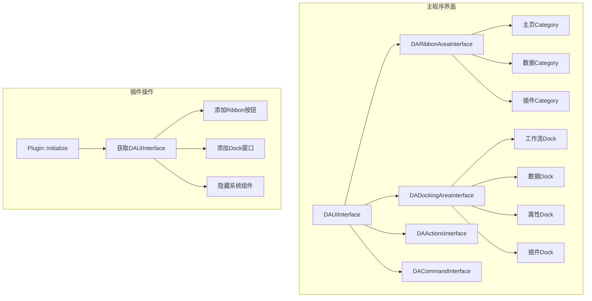

# 插件界面开发

插件的入口函数是`Plugin::initialize`，在调用此函数时，主程序的界面已经创建完成，此时可以进行插件界面的初始化。

## 主要功能特性

**特性**

- ✅ **界面组件访问**：通过核心接口获取Ribbon、DockingArea等界面组件
- ✅ **界面扩展**：添加自定义Dock窗口、Ribbon按钮、菜单项
- ✅ **界面隐藏**：隐藏不需要的系统界面组件
- ✅ **Action管理**：统一管理界面中的所有Action
- ✅ **命令接口**：通过命令接口执行系统命令

## 获取界面的主要组件

插件的核心函数是`core()`函数，此函数返回核心对象，`data-workbench`的所有可开放对象都可以通过`core()`获取。

其中ui相关的接口对象通过`DACoreInterface::getUiInterface`函数获取，此函数返回`DAUIInterface`对象。

### DAUIInterface 关键函数

```cpp
//获取界面的docking区域
virtual DADockingAreaInterface* getDockingArea() = 0;
//获取界面的ribbon区域
virtual DARibbonAreaInterface* getRibbonArea() = 0;
//获取action管理器
DAActionsInterface* getActionInterface() const;
//获取命令接口，如果没有注册命令接口，返回nullptr，当前设计为一个命令接口
DACommandInterface* getCommandInterface() const;
```

### 各接口功能说明

| 接口 | 获取函数 | 功能说明 |
|------|----------|----------|
| DockingArea | `getDockingArea()` | Dock窗口区域，可添加/隐藏Dock控件 |
| RibbonArea | `getRibbonArea()` | Ribbon界面区域，可添加Ribbon控件 |
| Actions | `getActionInterface()` | Action管理器，管理所有界面Action |
| Command | `getCommandInterface()` | 命令接口，执行系统命令 |

## 界面架构图

插件界面开发涉及主程序的多个 UI 组件，下图展示了主程序界面结构与插件操作的关系：


```mermaid
flowchart TD
    subgraph "主程序界面"
        A[DAUIInterface] --> B[DARibbonAreaInterface]
        A --> C[DADockingAreaInterface]
        A --> D[DAActionsInterface]
        A --> E[DACommandInterface]
        
        B --> B1[主页Category]
        B --> B2[数据Category]
        B --> B3[插件Category]
        
        C --> C1[工作流Dock]
        C --> C2[数据Dock]
        C --> C3[属性Dock]
        C --> C4[插件Dock]
    end
    
    subgraph "插件操作"
        F[Plugin::initialize] --> G[获取DAUIInterface]
        G --> H[添加Ribbon按钮]
        G --> I[添加Dock窗口]
        G --> J[隐藏系统组件]
    end
```

上图说明了插件界面开发的两个层面：
- **主程序界面**：展示了 UI 接口管理的 Ribbon、DockingArea、Actions、Command 四大组件及其子结构
- **插件操作流程**：展示了插件初始化时获取 UI 接口，然后进行 Ribbon 按钮、Dock 窗口、隐藏组件等操作的流程

## 插件操作界面

### 隐藏系统窗口

插件可以隐藏主程序中不需要的系统窗口，实现定制化界面。以下示例演示如何隐藏工作流相关的界面组件：

```cpp
void MyPlugin::initialize()
{
    // 获取UI接口
    DA::DAUIInterface* ui = core()->getUiInterface();
    
    // 获取各个界面区域接口
    DA::DADockingAreaInterface* dockArea    = ui->getDockingArea();
    DA::DAActionsInterface* actionInterface = ui->getActionInterface();
    DA::DARibbonAreaInterface* ribbonArea   = ui->getRibbonArea();
    
    // 隐藏不需要的Dock窗口，如工作流操作窗口和节点列表窗口
    dockArea->hideDockWidget(dockArea->getWorkFlowOperateWidget());
    dockArea->hideDockWidget(dockArea->getWorkflowNodeListWidget());
    
    // 隐藏不需要的Ribbon面板，如工作流面板
    safeHideRibbonPanel(ribbonArea, "da-pannel-main.workflow");
}
```

执行上述代码后，工作流相关的 Dock 窗口和 Ribbon 面板被隐藏，用户界面更加简洁。

### 添加自定义Dock窗口

创建并添加自定义 Dock 窗口是插件扩展界面的常用方式。Dock 窗口可以停靠在主窗口的任意边缘区域。以下示例展示创建和添加 Dock 窗口的流程：

```cpp
#include "ads_globals.h"  // ads::DockWidgetArea

bool MyPlugin::initialize()
{
    DA::DAUIInterface* ui = core()->getUiInterface();
    DA::DADockingAreaInterface* dockArea = ui->getDockingArea();

    // 创建自定义 Dock 窗口内容（DADockingAreaInterface::createDockWidget 接收 QWidget*）
    QWidget* content = new MyDataAnalysisWidget();
    // cn:createDockWidget(QWidget*, ads::DockWidgetArea, const QString& widgetName, ...)
    // 注意：没有 addDockWidget，也没有 RightDockArea；停靠区域用 ads::DockWidgetArea
    dockArea->createDockWidget(content, ads::DockWidgetArea::RightDockWidgetArea, tr("数据分析"));

    // 效果：在右侧 Dock 区域显示自定义数据分析窗口
    return true;
}
```

执行上述代码后，右侧 Dock 区域出现"数据分析"窗口，用户可拖动到其他位置或隐藏。

### 添加Ribbon按钮

添加自定义 Ribbon 按钮和面板是插件扩展 Ribbon 界面的常用方式。Ribbon 面板按 Category（标签页）和 Panel（功能组）组织。以下示例展示添加 Ribbon 按钮的完整流程：

```cpp
bool MyPlugin::initialize()
{
    DA::DAUIInterface* ui = core()->getUiInterface();
    DA::DARibbonAreaInterface* ribbonArea = ui->getRibbonArea();
    DA::DAActionsInterface* actionMgr = ui->getActionInterface();

    // DARibbonAreaInterface 没有 addPanelInCategory；先 ribbonBar()->addCategory 创建/取 Category
    // 这里通过 getCategoryByObjectName 取主页（objectName 由主程序定义）
    SARibbonCategory* category = ribbonArea->getCategoryByObjectName("da-ribbon-category-main");
    SARibbonPanel* myPanel = (category ? category->addPanel(tr("自定义工具")) : nullptr);  // cn:新建功能组

    // createAction(const char* objname) —— 参数是 object name，不是显示文本
    QAction* action1 = actionMgr->createAction("myplugin.action.import");
    action1->setText(tr("数据导入"));  // cn:显示文本单独设
    QAction* action2 = actionMgr->createAction("myplugin.action.export");
    action2->setText(tr("数据导出"));  // cn:显示文本单独设

    // 连接信号槽，处理按钮点击事件
    connect(action1, &QAction::triggered, this, &MyPlugin::onDataImport);
    connect(action2, &QAction::triggered, this, &MyPlugin::onDataExport);

    // 添加到 Ribbon 面板，指定按钮大小
    if (myPanel) {
        myPanel->addAction(action1, SARibbonActionButtonOption::LargeButtonWithText);
        myPanel->addAction(action2, SARibbonActionButtonOption::SmallButtonWithText);
    }

    // 效果：在主页的自定义工具面板中显示两个按钮
    return true;
}
```

执行上述代码后，主页 Ribbon 标签页出现"自定义工具"面板，包含大号"数据导入"按钮和小号"数据导出"按钮。

### 完整界面开发示例

以下是一个完整的插件界面开发示例，包含 Dock 窗口、Ribbon 按钮和菜单项的创建。该示例展示了插件界面开发的典型结构：

**头文件声明**（定义插件类和成员变量）：

```cpp
// MyPlugin.h
class MyPlugin : public QObject, public DA::DAAbstractNodePlugin
{
    Q_OBJECT
    Q_PLUGIN_METADATA(IID DAABSTRACTNODEPLUGIN_IID)
    Q_INTERFACES(DA::DAAbstractNodePlugin)
    
public:
    bool initialize() override;
    
private slots:
    void onDataImport();
    void onDataExport();
    void onSettings();
    
private:
    void setupDockWindows();
    void setupRibbonButtons();
    void setupMenuItems();
    
    QDockWidget* m_dataDock;
    QAction* m_actionImport;
    QAction* m_actionExport;
};
```

**源文件实现**（分步骤完成界面初始化）：

```cpp
// MyPlugin.cpp
bool MyPlugin::initialize()
{
    // 获取UI接口
    DA::DAUIInterface* ui = core()->getUiInterface();
    if (!ui) {
        return false;
    }
    
    // 设置各个界面组件
    setupDockWindows();
    setupRibbonButtons();
    setupMenuItems();
    
    return true;
}

void MyPlugin::setupDockWindows()
{
    DA::DAUIInterface* ui = core()->getUiInterface();
    DA::DADockingAreaInterface* dockArea = ui->getDockingArea();

    // 创建数据分析 Dock 窗口内容（createDockWidget 接收 QWidget*）
    QWidget* dataWidget = new MyDataAnalysisWidget();
    // cn:createDockWidget(QWidget*, ads::DockWidgetArea, const QString& widgetName, ...)
    // 没有 addDockWidget / RightDockArea
    ads::CDockWidget* dockWidget = dockArea->createDockWidget(
        dataWidget, ads::DockWidgetArea::RightDockWidgetArea, tr("数据分析工具"));
    dockWidget->setObjectName("plugin.dataAnalysis.dock");  // 设置唯一标识
}

void MyPlugin::setupRibbonButtons()
{
    DA::DAUIInterface* ui = core()->getUiInterface();
    DA::DARibbonAreaInterface* ribbonArea = ui->getRibbonArea();
    DA::DAActionsInterface* actionMgr = ui->getActionInterface();

    // 获取或创建 Category（标签页）
    // DARibbonAreaInterface 没有 category()/addCategory()；用 getCategoryByObjectName 取已有，
    // 新建则 ribbonBar()->addCategory(...)
    SARibbonCategory* category = ribbonArea->getCategoryByObjectName("da-ribbon-category-myplugin");
    if (!category) {
        category = ribbonArea->ribbonBar()->addCategory(tr("数据分析"));
        category->setObjectName("da-ribbon-category-myplugin");
    }

    // 创建 Panel（功能组）—— SARibbonCategory::addPanel
    SARibbonPanel* panel = ribbonArea->getPanelByObjectName("myplugin.panel.io");
    if (!panel) {
        panel = category->addPanel(tr("导入导出"));
        panel->setObjectName("myplugin.panel.io");
    }

    // createAction(const char* objname) —— 参数是 object name，显示文本单独 setText
    m_actionImport = actionMgr->createAction("myplugin.action.import");
    m_actionImport->setText(tr("导入数据"));  // cn:显示文本
    m_actionImport->setIcon(QIcon(":/icons/import.png"));

    m_actionExport = actionMgr->createAction("myplugin.action.export");
    m_actionExport->setText(tr("导出数据"));  // cn:显示文本
    m_actionExport->setIcon(QIcon(":/icons/export.png"));

    QAction* actionSettings = actionMgr->createAction("myplugin.action.settings");
    actionSettings->setText(tr("设置"));  // cn:显示文本
    actionSettings->setIcon(QIcon(":/icons/settings.png"));

    // 连接信号槽
    connect(m_actionImport, &QAction::triggered, this, &MyPlugin::onDataImport);
    connect(m_actionExport, &QAction::triggered, this, &MyPlugin::onDataExport);
    connect(actionSettings, &QAction::triggered, this, &MyPlugin::onSettings);

    // 添加到 Ribbon 面板，设置按钮大小
    panel->addAction(m_actionImport, SARibbonActionButtonOption::LargeButtonWithText);
    panel->addAction(m_actionExport, SARibbonActionButtonOption::LargeButtonWithText);
    panel->addAction(actionSettings, SARibbonActionButtonOption::SmallButtonWithText);
}

void MyPlugin::setupMenuItems()
{
    // DAActionsInterface 没有 addActionToMenu；它只暴露 createAction/recordAction/findAction
    // 导入/导出 Action 已在 setupRibbonButtons() 中通过 createAction(objname) 创建并托管
    // 如需在自定义菜单中复用，用 findAction(objname) 取出放入 QMenu：
    DA::DAUIInterface* ui = core()->getUiInterface();
    DA::DAActionsInterface* actionMgr = ui->getActionInterface();
    QAction* importAct = actionMgr->findAction("myplugin.action.import");
    QAction* exportAct = actionMgr->findAction("myplugin.action.export");
    // 然后在目标控件的 contextMenuEvent 中把 importAct / exportAct 加入 QMenu
}

void MyPlugin::onDataImport()
{
    // 处理数据导入逻辑，弹出文件选择对话框
    QString fileName = QFileDialog::getOpenFileName(
        nullptr,
        tr("选择数据文件"),
        QString(),
        tr("CSV Files (*.csv);;All Files (*)")
    );
    
    if (!fileName.isEmpty()) {
        // 执行导入操作，加载文件到数据管理器
    }
}

void MyPlugin::onDataExport()
{
    // 处理数据导出逻辑
}

void MyPlugin::onSettings()
{
    // 显示设置对话框
}
```

执行上述完整代码后，插件界面包含：
- 右侧 Dock 区域的"数据分析工具"窗口
- Ribbon 的"数据分析"标签页和"导入导出"面板
- 导入/导出 Action 已通过 `createAction(objname)` 注册到 Action 管理器，可通过 `findAction()` 在自定义菜单中复用

## Dock窗口布局策略

### Dock区域划分

data-workbench 的 Dock 区域由 Qt Advanced Docking System（ads）管理，停靠位置用 `ads::DockWidgetArea` 枚举指定（如 `ads::DockWidgetArea::LeftDockWidgetArea` / `RightDockWidgetArea` / `TopDockWidgetArea` / `BottomDockWidgetArea`）。下表列出各区域的典型用途：

| ads 区域 | 常用位置 | 典型用途 |
|----------|----------|----------|
| LeftDockWidgetArea | 左侧 | 工作流节点列表、数据管理 |
| RightDockWidgetArea | 右侧 | 属性面板、数据分析 |
| TopDockWidgetArea | 顶部 | 工具栏扩展 |
| BottomDockWidgetArea | 底部 | 输出日志、状态信息 |

> 内置固定 dock 还可用 `DADockingAreaInterface::DockingArea` 枚举（如 `DockingAreaWorkFlowOperate`）定位，通过 `dockingAreaToDockWidget()` / `raiseDockingArea()` 操作。

### Dock窗口示例

以下示例展示如何创建一个可停靠的数据分析窗口，包含数据选择和分析结果显示功能：

```cpp
// 创建可停靠的数据分析窗口
class MyDataAnalysisWidget : public QWidget
{
    Q_OBJECT
public:
    explicit MyDataAnalysisWidget(QWidget* parent = nullptr)
        : QWidget(parent)
    {
        setupUI();
    }
    
private:
    void setupUI()
    {
        QVBoxLayout* layout = new QVBoxLayout(this);
        
        // 添加数据选择下拉框
        QComboBox* dataSelector = new QComboBox(this);
        layout->addWidget(dataSelector);
        
        // 添加分析结果显示区域（只读文本框）
        QTextEdit* resultView = new QTextEdit(this);
        resultView->setReadOnly(true);
        layout->addWidget(resultView);
        
        // 添加分析按钮
        QPushButton* analyzeBtn = new QPushButton(tr("开始分析"), this);
        layout->addWidget(analyzeBtn);
    }
};
```

执行上述代码后，创建了一个包含数据选择、结果显示和分析按钮的 Dock 窗口控件，可添加到 Dock 区域中使用。

## API 参考

### DAUIInterface 核心方法

| 方法 | 参数 | 返回值 | 说明 |
|------|------|--------|------|
| `getDockingArea()` | 无 | DADockingAreaInterface* | 获取Dock区域接口 |
| `getRibbonArea()` | 无 | DARibbonAreaInterface* | 获取Ribbon区域接口 |
| `getActionInterface()` | 无 | DAActionsInterface* | 获取Action管理器 |
| `getCommandInterface()` | 无 | DACommandInterface* | 获取命令接口 |

### DADockingAreaInterface 核心方法

| 方法 | 参数 | 返回值 | 说明 |
|------|------|--------|------|
| `createDockWidget()` | QWidget*, ads::DockWidgetArea, QString, ads::CDockAreaWidget*=nullptr | ads::CDockWidget* | 创建停靠窗体 |
| `createDockWidgetAsTab()` | QWidget*, QString, ads::CDockAreaWidget* | ads::CDockWidget* | 作为标签页添加到指定 dockArea |
| `createFloatingDockWidget()` | QWidget*, QString, QPoint | ads::CDockWidget* | 创建浮动窗体 |
| `hideDockWidget()` | QWidget* | void | 隐藏 Dock 窗口 |
| `raiseDockByWidget()` | QWidget* | void | 唤起某 widget 对应的 dock |
| `getWorkFlowOperateWidget()` | 无 | DAPyWorkFlowOperateWidget* | 获取工作流操作窗口 |
| `getWorkflowNodeListWidget()` | 无 | DAPyWorkFlowNodeListWidget* | 获取节点列表窗口 |

> 停靠区域用 `ads::DockWidgetArea` 枚举（来自 Qt Advanced Docking System），不是 `Qt::LeftDockWidgetArea` 等。固定内置区域用 `DADockingAreaInterface::DockingArea` 枚举（如 `DockingAreaWorkFlowOperate`）。

### DARibbonAreaInterface 核心方法

| 方法 | 参数 | 返回值 | 说明 |
|------|------|--------|------|
| `ribbonBar()` | 无 | SARibbonBar* | 获取 RibbonBar，添加 Category 通过它的 `addCategory()` |
| `getCategories()` | 无 | QList&lt;SARibbonCategory*&gt; | 获取所有标签 |
| `getCategoryByObjectName()` | QString objname | SARibbonCategory* | 通过 objectName 获取 Category |
| `getPanelByObjectName()` | QString objname | SARibbonPanel* | 通过 objectName 获取 Panel |

> `DARibbonAreaInterface` 自身没有 `addCategory()` / `category()` / `addPanelInCategory()`；添加 Category 要通过 `ribbonBar()->addCategory(...)`，获取已有 Category/Panel 用 `getCategoryByObjectName()` / `getPanelByObjectName()`。

## 注意事项

!!! warning "界面操作时机"
    所有界面操作必须在`initialize()`函数中进行，在构造函数中界面尚未创建完成。

!!! tip "Dock窗口命名"
    为Dock窗口设置唯一的objectName，便于后续管理和查找。

!!! note "Qt版本兼容性"
    SARibbonBar和QtAdvancedDocking在Qt5和Qt6中的API基本一致，但库文件名不同。

## 参考资料

- [插件模块DAPluginSupport](./plugin-module.md)
- [插件与接口](./plugins-interfaces.md)
- [创建插件项目](./plugin-project-create.md)