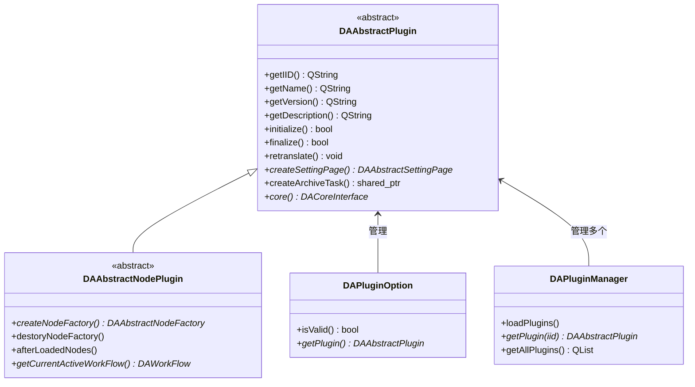

# 插件模块DAPluginSupport

插件支持模块`DAPluginSupport`提供了完整的插件系统基础设施，包括插件基类定义、插件管理器以及节点插件扩展接口。

## 主要功能特性

**特性**

- ✅ **插件生命周期管理**：提供初始化、运行、释放的完整生命周期控制
- ✅ **核心接口访问**：通过`core()`函数获取`DACoreInterface`，访问所有系统功能
- ✅ **多语言支持**：通过`retranslate()`函数支持语言切换
- ✅ **设置页面扩展**：支持插件自定义设置页面
- ✅ **存档任务支持**：提供项目保存/加载时的自定义存档任务

## 模块架构

### 类继承关系图


```mermaid
classDiagram
    class DAAbstractPlugin {
        <<abstract>>
        +getIID() QString
        +getName() QString
        +getVersion() QString
        +getDescription() QString
        +initialize() bool
        +finalize() bool
        +retranslate() void
        +createSettingPage() DAAbstractSettingPage*
        +createArchiveTask() shared_ptr
        +core() DACoreInterface*
    }
    
    class DAAbstractNodePlugin {
        <<abstract>>
        +createNodeFactory() DAAbstractNodeFactory*
        +destoryNodeFactory()
        +afterLoadedNodes()
        +getCurrentActiveWorkFlow() DAWorkFlow*
    }
    
    class DAPluginManager {
        +loadPlugins()
        +getPlugin(iid) DAAbstractPlugin*
        +getAllPlugins() QList
    }
    
    class DAPluginOption {
        +isValid() bool
        +getPlugin() DAAbstractPlugin*
    }
    
    DAAbstractPlugin <|-- DAAbstractNodePlugin
    DAAbstractPlugin <-- DAPluginOption : 管理
    DAAbstractPlugin <-- DAPluginManager : 管理多个
```

### 核心类说明

| 类 | 说明 |
|-----|------|
| `DAAbstractPlugin` | 插件基类，所有插件必须继承此类 |
| `DAAbstractNodePlugin` | 节点插件基类，用于提供工作流节点 |
| `DAPluginManager` | 插件管理器单例，负责插件加载和管理 |
| `DAPluginOption` | 插件选项封装，管理单个插件实例 |

## 插件基类详解

### DAAbstractPlugin

`DAAbstractPlugin`是插件的基类，其中有个非常关键的函数`core`:

```cpp
DACoreInterface* core() const;
```

此函数获取了基础接口`DACoreInterface`，`data-workbench`的所有接口基于此接口都可以获取，由此，插件实现和界面以及核心逻辑的交互。

### 关键虚函数

插件最关键有如下虚函数：

| 函数 | 说明 | 默认行为 |
|------|------|----------|
| `initialize()` | 初始化插件 | 返回true |
| `finalize()` | 释放插件 | 返回true |
| `retranslate()` | 语言变更回调 | 无操作 |

```cpp
/**
 * @brief 发生语言变更事件的时候调用此函数
 * 默认没有实现，如果插件有涉及翻译，需要重载此函数
 */
virtual void retranslate();

/**
 * @brief 初始化
 * @return 如果初始化返回false，将不会把插件放入管理中，默认返回true
 */
virtual bool initialize();
```

其中`initialize`函数用于插件的初始化，如果初始化过程返回false，系统将跳过这个插件。

`retranslate`是在语言发生变化时调用，对于多语言的处理，可以在继承此函数。

## 插件开发完整示例

### 创建节点插件

以下是一个完整的节点插件实现示例：

**头文件 MyNodePlugin.h：**

```cpp
#include <QObject>
#include "DAAbstractNodePlugin.h"

class MyNodePlugin : public QObject, public DA::DAAbstractNodePlugin
{
    Q_OBJECT
    Q_PLUGIN_METADATA(IID DAABSTRACTNODEPLUGIN_IID)
    Q_INTERFACES(DA::DAAbstractNodePlugin)
    
public:
    MyNodePlugin();
    ~MyNodePlugin();
    
    // 插件信息
    QString getIID() const override { return DAABSTRACTNODEPLUGIN_IID; }
    QString getName() const override { return "MyNodePlugin"; }
    QString getVersion() const override { return "1.0.0"; }
    QString getDescription() const override { return "自定义节点插件"; }
    
    // 初始化
    bool initialize() override;
    void retranslate() override;
    
    // 节点工厂
    DA::DAAbstractNodeFactory* createNodeFactory() override;
    void destoryNodeFactory(DA::DAAbstractNodeFactory* p) override;
};
```

**源文件 MyNodePlugin.cpp：**

```cpp
#include "MyNodePlugin.h"
#include "MyNodeFactory.h"

MyNodePlugin::MyNodePlugin()
{
}

MyNodePlugin::~MyNodePlugin()
{
}

bool MyNodePlugin::initialize()
{
    // 获取核心接口进行初始化操作
    DA::DACoreInterface* core = this->core();
    if (!core) {
        return false;
    }
    
    // 获取UI接口添加自定义界面元素
    DA::DAUIInterface* ui = core->getUiInterface();
    if (ui) {
        // 可以在这里添加ribbon按钮、dock窗口等
    }
    
    return true;
}

void MyNodePlugin::retranslate()
{
    // 处理多语言翻译
}

DA::DAAbstractNodeFactory* MyNodePlugin::createNodeFactory()
{
    return new MyNodeFactory();
}

void MyNodePlugin::destoryNodeFactory(DA::DAAbstractNodeFactory* p)
{
    delete p;
}
```

### CMake 配置

插件的CMake配置示例：

```cmake
# 创建插件库
add_library(MyNodePlugin SHARED
    MyNodePlugin.cpp
    MyNodePlugin.h
    MyNodeFactory.cpp
    MyNodeFactory.h
)

# 链接DAPluginSupport模块
target_link_libraries(MyNodePlugin
    PRIVATE
        DA::DAPluginSupport
        Qt6::Core
)

# 设置插件输出目录
set_target_properties(MyNodePlugin PROPERTIES
    LIBRARY_OUTPUT_DIRECTORY "${CMAKE_BINARY_DIR}/plugins"
)
```

!!! tip "插件继承顺序"
    创建插件类时，`QObject`必须是第一个继承类，然后继承插件基类。这是因为 Qt 的元对象系统要求。

## 通用插件类型

### 工作流节点插件

`DAAbstractNodePlugin`负责生成工作流的节点，可以通过编写此插件提供不同功能的节点。

节点插件需要实现节点工厂`DAAbstractNodeFactory`，具体详见[工作流](./workflow.md)。

### 其他插件类型

data-workbench支持多种插件扩展点：

| 插件类型 | 基类 | 用途 |
|----------|------|------|
| 节点插件 | DAAbstractNodePlugin | 提供工作流节点 |
| 设置页面插件 | DAAbstractPlugin + createSettingPage | 提供设置界面 |
| 存档任务插件 | DAAbstractPlugin + createArchiveTask | 自定义项目存档 |

## API 参考

### DAAbstractPlugin 核心方法

| 方法 | 参数 | 返回值 | 说明 |
|------|------|--------|------|
| `getIID()` | 无 | QString | 获取插件IID |
| `getName()` | 无 | QString | 获取插件名称 |
| `getVersion()` | 无 | QString | 获取插件版本 |
| `initialize()` | 无 | bool | 初始化插件 |
| `finalize()` | 无 | bool | 释放插件 |
| `core()` | 无 | DACoreInterface* | 获取核心接口 |

### DAAbstractNodePlugin 核心方法

| 方法 | 参数 | 返回值 | 说明 |
|------|------|--------|------|
| `createNodeFactory()` | 无 | DAAbstractNodeFactory* | 创建节点工厂 |
| `destoryNodeFactory()` | DAAbstractNodeFactory* | void | 销毁节点工厂 |
| `afterLoadedNodes()` | 无 | void | 节点加载完成回调 |
| `getCurrentActiveWorkFlow()` | 无 | DAWorkFlow* | 获取当前激活的工作流 |

## 注意事项

!!! warning "插件导出宏"
    必须使用 `Q_PLUGIN_METADATA` 和 `Q_INTERFACES` 宏声明插件，否则插件无法被系统识别。

!!! tip "界面操作时机"
    所有针对界面的操作都应该在 `initialize()` 里调用，这样能保证系统的基本界面框架都已经建立完成。

!!! note "Qt版本兼容性"
    插件系统在 Qt5 和 Qt6 中使用方式相同，但插件库名称可能不同（如 `qt5advanceddocking.dll` vs `qt6advanceddocking.dll`）。

## 参考资料

- [创建插件项目](./plugin-project-create.md)
- [插件与接口](./plugins-interfaces.md)
- [插件开发创建UI](./plugin-dev-create-ui.md)