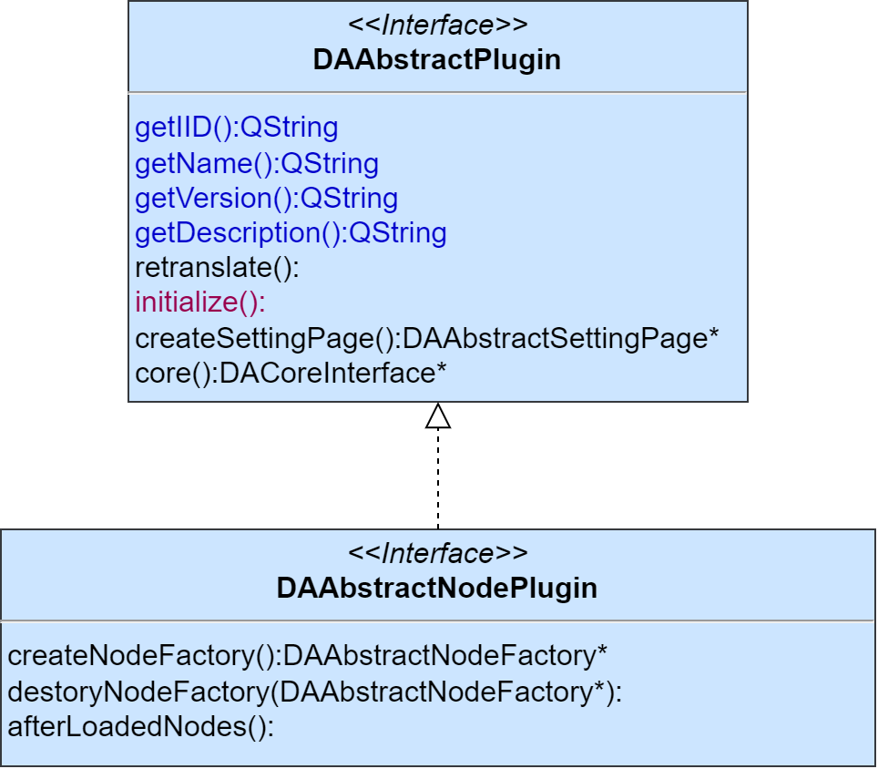

# 插件模块DAPluginSupport

插件的支持模块为DAPluginSupport

`DAAbstractPlugin`是插件的基类，其中有个非常关键的函数`core`:

```cpp
DACoreInterface* core() const;
```

这个函数是插件和框架的沟通基础，此函数获取了基础接口`DACoreInterface`，`data-workbench`的所有接口基于此接口都可以获取，由此，插件实现和界面以及核心逻辑的交互

`data-workbench`的插件使用Qt的插件系统实现，`DAAbstractPlugin`通过`Q_DECLARE_INTERFACE`声明为插件，而插件的管理提供了单例`DAPluginManager`实现所有插件的管理，插件在加载过程之前，会把接口的实例传入，因此，插件在加载时即可调用接口提供的所有功能进行操作

插件最关键有如下两个虚函数：

```cpp
/**
    * @brief 发生语言变更事件的时候调用此函数
    * 默认没有实现，如果插件有涉及翻译，需要重载此函数
    */
virtual void retranslate();

/**
    * @brief 初始化
    * @return 如果初始化返回false，将不会把插件放入管理中，默认返回true
    */
virtual bool initialize();
```

其中`initialize`函数用于插件的初始化，如果初始化过程返回false，系统将跳过这个插件

`retranslate`是在语言发生变化时调用，对于多语言的处理，可以在继承此函数

插件在加载是会传入接口，在插件中操作程序都通过接口完成，通过`DAAbstractPlugin::core`函数可获取顶层接口:

```cpp
DACoreInterface* core() const;
```

基于插件实现业务逻辑，所有业务的实现从插件基类的派生类中实现，例如节点插件基类为`DAAbstractNodePlugin`也继承自`DAAbstractPlugin`，其类继承关系如下图所示，要开展节点相关的业务，需要继承`DAAbstractNodePlugin`进行实例化开发




## 通用插件

`data-workbench`针对程序需求，提供了一些通用插件

### 工作流节点插件`DAAbstractNodePlugin`

`DAAbstractNodePlugin`负责生成工作流的节点，可以通过编写此插件提供不同功能的节点，具体详见[工作流](./工作流.md)
