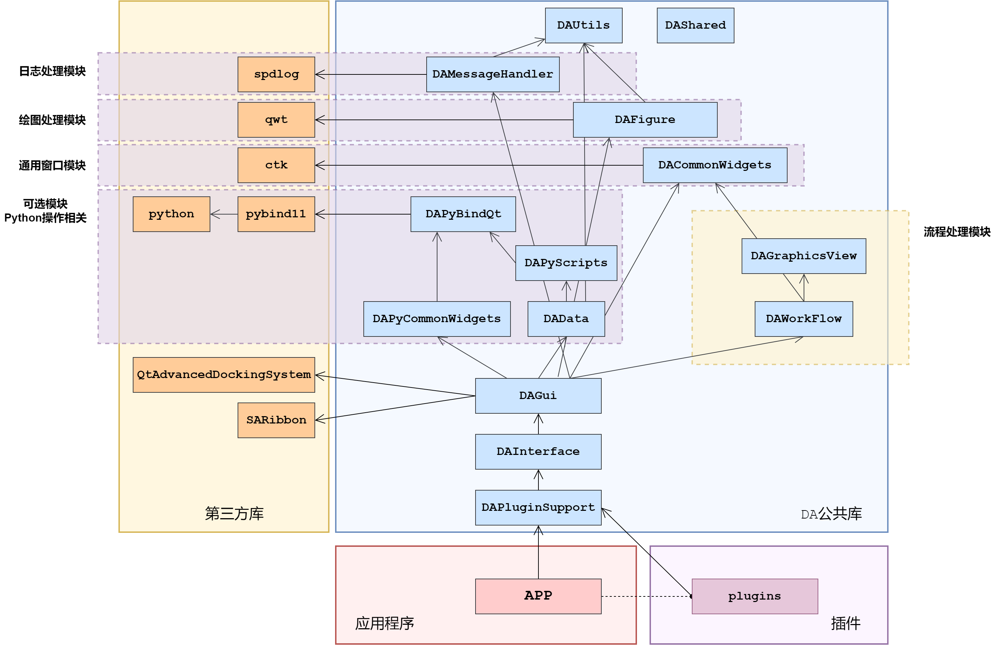
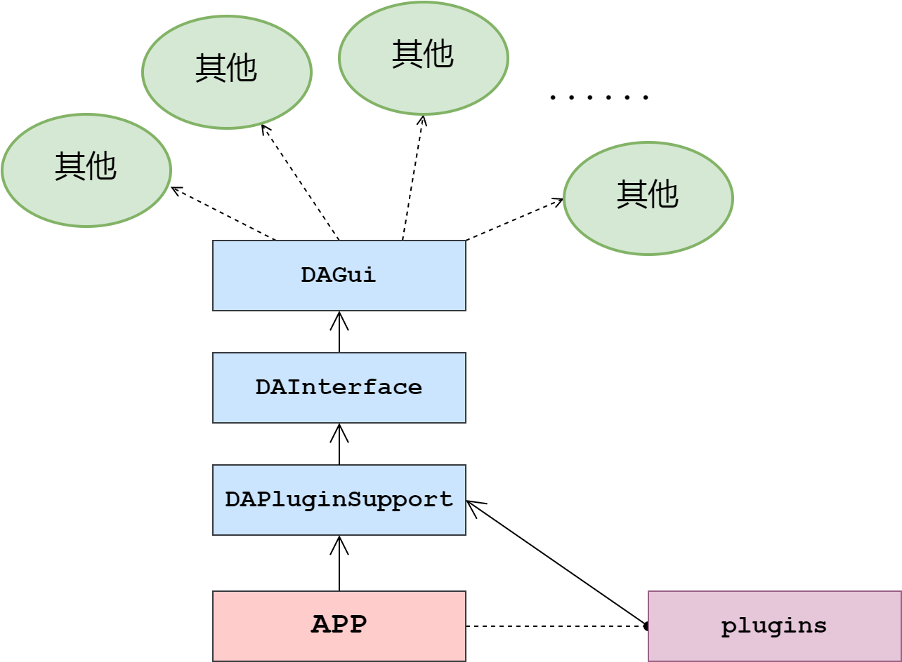

# 插件与接口

`data-workbench` 采用插件化架构设计，通过插件实现功能扩展，通过接口实现模块间的数据交互和通信。这种设计将业务逻辑与界面框架分离，保证了系统的可扩展性和可维护性。

## 主要功能特性

**特性**

- ✅ **松耦合设计**：插件与主程序通过接口通信，避免直接依赖具体实现
- ✅ **标准化接口**：统一的 `DACoreInterface` 入口，可访问所有系统功能
- ✅ **生命周期管理**：完整的插件初始化、运行、卸载生命周期
- ✅ **多语言支持**：通过 `retranslate()` 机制支持国际化

## 模块依赖关系

`data-workbench` 的各个模块间依赖关系如下图所示：



总体可以分为4大部分：

- **第三方库**：Qt、SARibbon、pybind11 等基础依赖
- **DA公共库**：DACommonWidgets、DAData、DAFigure 等通用模块
- **应用程序**：APP 主程序，提供基础框架
- **插件**：DataAnalysis 等功能插件，提供具体业务逻辑

!!! important "核心设计原则"
    `data-workbench` 的所有业务逻辑都通过插件实现，主程序只提供基础框架和接口。这种设计保证了业务逻辑和界面的分离，同时加强了扩展性。

## 插件与接口关系图

插件、接口、主程序之间的调用关系如下图所示：



通过接口可调用到整个程序的所有其他模块，业务逻辑通过插件实现，保证了模块间的解耦。

## DAAbstractPlugin 详解

`DAAbstractPlugin` 是所有插件的抽象基类，定义了插件与主程序交互的基本框架。所有插件必须继承此基类并实现其纯虚函数。

### 类定义

```cpp
class DAPLUGINSUPPORT_API DAAbstractPlugin
{
public:
    // 获取插件IID（唯一标识符）
    virtual QString getIID() const = 0;
    
    // 获取插件名称
    virtual QString getName() const = 0;
    
    // 获取插件版本
    virtual QString getVersion() const = 0;
    
    // 获取插件描述
    virtual QString getDescription() const = 0;
    
    // 初始化（关键入口）
    virtual bool initialize();
    
    // 释放清理
    virtual bool finalize();
    
    // 语言变更回调
    virtual void retranslate();
    
    // 获取核心接口
    DACoreInterface* core() const;
    
    // 创建设置页（可选）
    virtual DAAbstractSettingPage* createSettingPage();
    
    // 创建存档任务（可选）
    virtual std::shared_ptr<DAAbstractArchiveTask> createArchiveTask(bool isSave);
};
```

### 核心方法说明

| 方法 | 说明 | 返回值 |
|------|------|--------|
| `getIID()` | 获取插件的唯一标识符 | 插件IID字符串 |
| `getName()` | 获取插件显示名称 | 插件名称 |
| `getVersion()` | 获取插件版本号 | 版本字符串 |
| `getDescription()` | 获取插件功能描述 | 描述文本 |
| `initialize()` | 插件初始化入口 | 成功返回 `true` |
| `finalize()` | 插件卸载清理 | 成功返回 `true` |
| `core()` | 获取核心接口实例 | `DACoreInterface*` |

### 关键设计要点

1. **`core()` 方法**：这是插件与主程序通信的唯一入口，通过此方法获取 `DACoreInterface` 实例，进而访问主程序的所有功能。

2. **`initialize()` 方法**：主程序加载插件后立即调用此方法。所有针对界面的操作都应该在此方法中执行，此时系统界面框架已经建立完成。如果返回 `false`，插件将不会被加载。

3. **`retranslate()` 方法**：当应用程序语言发生变更时调用，用于实现多语言支持。插件应在此方法中重新加载翻译文件。

## DAAbstractNodePlugin 详解

`DAAbstractNodePlugin` 是工作流节点插件的基类，继承自 `DAAbstractPlugin`，专门用于提供工作流节点。如果需要开发数据处理、可视化等节点类插件，应继承此基类。

### 类定义

```cpp
class DAPLUGINSUPPORT_API DAAbstractNodePlugin : public DAAbstractPlugin
{
public:
    // 创建节点工厂（纯虚函数，必须实现）
    virtual DAAbstractNodeFactory* createNodeFactory() = 0;
    
    // 销毁节点工厂
    virtual void destoryNodeFactory(DAAbstractNodeFactory* p) = 0;
    
    // 节点加载完成回调
    virtual void afterLoadedNodes();
    
    // 获取当前激活的工作流编辑窗口
    DAWorkFlowOperateWidget* getCurrentActiveWorkflowOperateWidget() const;
    
    // 获取当前激活的工作流
    DAWorkFlow* getCurrentActiveWorkFlow() const;
};
```

### 核心方法说明

| 方法 | 说明 | 返回值 |
|------|------|--------|
| `createNodeFactory()` | 创建节点工厂实例 | `DAAbstractNodeFactory*` |
| `destoryNodeFactory()` | 销毁节点工厂（遵循谁创建谁删除原则） | `void` |
| `afterLoadedNodes()` | 节点加载完成后的回调，可用于节点排序等操作 | `void` |
| `getCurrentActiveWorkFlow()` | 获取当前激活的工作流对象 | `DAWorkFlow*` |

### 类继承关系

下图展示了插件基类的继承层次，从抽象基类到具体的节点插件实现：

```mermaid
classDiagram
    direction TB
    QObject <|-- DAAbstractPlugin
    DAAbstractPlugin <|-- DAAbstractNodePlugin
    DAAbstractNodePlugin <|-- DataAnalysisPlugin
    DAAbstractNodePlugin <|-- 自定义节点插件
    
    class DAAbstractPlugin {
        <<抽象基类>>
        +getIID() QString
        +getName() QString
        +getVersion() QString
        +getDescription() QString
        +initialize() bool
        +finalize() bool
        +retranslate() void
        +core() DACoreInterface*
    }
    
    class DAAbstractNodePlugin {
        <<节点插件基类>>
        +createNodeFactory() DAAbstractNodeFactory*
        +destoryNodeFactory(DAAbstractNodeFactory*)
        +afterLoadedNodes() void
        +getCurrentActiveWorkFlow() DAWorkFlow*
    }
    
    class DataAnalysisPlugin {
        <<具体实现>>
        -m_ui: DataAnalysisUI*
        -m_ioWorker: DataframeIOWorker*
        +initialize() bool
+createNodeFactory()
    }
    ```

上图展示了插件类的继承层次：
- `DAAbstractPlugin` 是抽象基类，定义所有插件必须实现的接口
- `DAAbstractNodePlugin` 继承 `DAAbstractPlugin`，专门用于提供工作流节点
- `DataAnalysisPlugin` 和自定义节点插件继承 `DAAbstractNodePlugin`，实现具体功能

## 接口使用方法

### 核心接口层次

`DACoreInterface` 是访问主程序所有功能的顶层入口，其结构如下图所示：

下图展示了核心接口的层次结构，`DACoreInterface` 作为顶层入口，提供多个子接口：

```mermaid
graph TB
    CI[DACoreInterface<br/>核心接口]
    
    subgraph "子接口"
        UI[DAUIInterface<br/>界面接口]
        PM[DAProjectInterface<br/>项目管理接口]
        DM[DADataManagerInterface<br/>数据管理接口]
    end
    
    CI --> UI
    CI --> PM
    CI --> DM
    
    subgraph "UI子接口"
        RA[DARibbonAreaInterface<br/>Ribbon区域]
        DA[DADockingAreaInterface<br/>Dock区域]
        AI[DAActionsInterface<br/>Action管理]
        SB[DAStatusBarInterface<br/>状态栏]
    end
    
    UI --> RA
    UI --> DA
    UI --> AI
    UI --> SB
    
    style CI fill:#e8f5e9
style UI fill:#e1f5fe
    ```

上图展示了接口的层次结构：
- `DACoreInterface` 是核心入口，提供获取其他接口的方法
- `DAUIInterface` 提供 UI 相关功能，包含 Ribbon 区域、Dock 区域、Actions 管理和状态栏
- `DAProjectInterface` 提供项目管理功能
- `DADataManagerInterface` 提供数据管理功能

### 获取接口实例

在插件的 `initialize()` 方法中获取各个接口：

以下代码展示了如何在插件初始化时获取核心接口和各个子接口：

```cpp
bool MyPlugin::initialize()
{
    // 获取核心接口（唯一入口）
    DACoreInterface* core = this->core();
    if (!core) {
        return false;  // 接口不可用，初始化失败
    }
    
    // 获取 UI 接口
    DAUIInterface* ui = core->getUiInterface();
    
    // 获取项目管理接口
    DAProjectInterface* project = core->getProjectInterface();
    
    // 获取数据管理接口
    DADataManagerInterface* dataMgr = core->getDataManagerInterface();
    
    // 通过 UI 接口获取子接口
    DARibbonAreaInterface* ribbon = ui->getRibbonArea();
    DADockingAreaInterface* dock = ui->getDockingArea();
    
    return true;
}
```

上述代码的关键点：
- 通过 `this->core()` 获取核心接口，这是唯一入口
- 获取接口后应检查指针有效性，避免空指针异常
- 通过 UI 接口可以获取 Ribbon 区域、Dock 区域等子接口
- 接口指针由主程序管理，插件不应删除这些指针

### 添加 Ribbon 菜单项

以下代码展示了如何在插件初始化时添加 Ribbon 分类、面板和按钮：

```cpp
bool MyPlugin::initialize()
{
    DACoreInterface* core = this->core();
    DAUIInterface* ui = core->getUiInterface();
    DARibbonAreaInterface* ribbon = ui->getRibbonArea();
    
    // 在 Ribbon 中添加分类
    SARibbonCategory* category = ribbon->addCategoryByPlugin(
        tr("MyPlugin"),      // 分类名称
        "myplugin.category" // 分类ID
    );
    
    // 添加面板
    SARibbonPannel* pannel = category->addPannel(tr("Tools"));
    
    // 添加按钮
    QAction* action = new QAction(tr("My Tool"), this);
    pannel->addLargeAction(action);
    
    return true;
}
```

上述代码展示了 Ribbon 界面的创建流程：
- 通过 `getRibbonArea()` 获取 Ribbon 区域接口
- 使用 `addCategoryByPlugin()` 创建分类，传入名称和 ID
- 使用 `addPannel()` 在分类中创建面板
- 创建 `QAction` 并添加到面板中

### 添加 Dock 窗口

以下代码展示了如何在插件初始化时添加自定义 Dock 窗口：

```cpp
bool MyPlugin::initialize()
{
    DACoreInterface* core = this->core();
    DAUIInterface* ui = core->getUiInterface();
    DADockingAreaInterface* dockArea = ui->getDockingArea();
    
    // 创建自定义 Dock 窗口
    MyDockWidget* dock = new MyDockWidget();
    dockArea->addDockWidget(dock, Qt::RightDockWidgetArea);
    
    return true;
}
```

上述代码展示了 Dock 窗口的添加流程：
- 通过 `getDockingArea()` 获取 Dock 区域接口
- 创建自定义 Dock 窗口实例
- 使用 `addDockWidget()` 添加到指定区域（如右侧区域）

## 与 DAPluginSupport 的关系

`DAPluginSupport` 模块提供了插件开发的核心支持类：

| 类名 | 作用 | 说明 |
|------|------|------|
| `DAAbstractPlugin` | 插件基类 | 所有插件的抽象基类 |
| `DAAbstractNodePlugin` | 节点插件基类 | 工作流节点插件的基类 |
| `DAAbstractNodeFactory` | 节点工厂基类 | 负责创建节点实例 |
| `DAPluginManager` | 插件管理器 | 单例，负责插件扫描、加载、生命周期管理 |
| `DAPluginOption` | 插件选项 | 封装插件元数据和加载状态 |

### 插件加载流程

下图展示了插件从扫描到初始化完成的完整加载时序：

```mermaid
sequenceDiagram
    participant APP as 主程序
    participant PM as DAPluginManager
    participant PL as 插件
    participant IF as DACoreInterface
    
    APP->>PM: 扫描 plugins/ 目录
    PM->>PM: 发现 .dll/.so 文件
    PM->>PL: QPluginLoader 加载
    PL-->>PM: 返回 DAAbstractPlugin*
    PM->>PL: setCore(interface)
    PM->>PL: initialize()
    PL->>IF: core()->getUiInterface()
    IF-->>PL: 返回界面接口
    PL->>PL: 初始化界面、注册节点
    PL-->>PM: 返回 true
PM->>PM: 注册插件到管理器
    ```

上图展示了插件加载的完整流程：

1. 主程序扫描 plugins/ 目录发现动态库文件
2. 使用 `QPluginLoader` 加载动态库
3. 插件返回 `DAAbstractPlugin*` 指针
4. 调用 `setCore(interface)` 设置核心接口
5. 调用 `initialize()` 初始化插件
6. 插件通过核心接口获取 UI 接口并初始化界面
7. 返回 `true` 后注册到插件管理器

## 插件注册与声明

### Qt 插件声明

使用 Qt 插件机制进行注册：

以下代码展示了如何使用 Qt 插件元数据声明插件，使系统能够正确识别和加载：

```cpp
// MyPlugin.h
#include "DAAbstractNodePlugin.h"

class MyPlugin : public QObject, public DA::DAAbstractNodePlugin
{
    Q_OBJECT
    // 声明插件元数据，IID 必须唯一
    Q_PLUGIN_METADATA(IID DAABSTRACTNODEPLUGIN_IID)
    // 声明实现的接口
    Q_INTERFACES(DA::DAAbstractNodePlugin)
    
public:
    MyPlugin();
    virtual ~MyPlugin() override;
    
    // 实现基类纯虚函数
    virtual QString getIID() const override;
    virtual QString getName() const override;
    virtual QString getVersion() const override;
    virtual QString getDescription() const override;
    virtual bool initialize() override;
    virtual DA::DAAbstractNodeFactory* createNodeFactory() override;
    virtual void destoryNodeFactory(DA::DAAbstractNodeFactory* p) override;
};
```

上述代码的关键点：
- `Q_OBJECT` 宏启用 Qt 元对象系统
- `Q_PLUGIN_METADATA` 声明插件 IID，必须与系统定义一致
- `Q_INTERFACES` 声明实现的接口类型
- 继承顺序：QObject 必须是第一个基类

### CMake 配置

以下代码展示了插件的 CMake 配置，包括自动 MOC/RCC 和依赖链接：

```cmake
# 设置为 Qt 插件
set(CMAKE_AUTOMOC ON)
set(CMAKE_AUTORCC ON)

# 添加插件库
add_library(MyPlugin SHARED
    MyPlugin.cpp
    MyNodeFactory.cpp
)

# 链接依赖
target_link_libraries(MyPlugin
    PRIVATE
        DAPluginSupport  # 插件支持模块
        DAInterface      # 接口模块
        Qt6::Core
        Qt6::Widgets
)
```

上述 CMake 配置的关键点：
- `CMAKE_AUTOMOC` 自动处理 Qt 元对象编译
- `CMAKE_AUTORCC` 自动处理 Qt 资源文件编译
- 创建 `SHARED` 库生成动态链接库
- 链接 `DAPluginSupport` 和 `DAInterface` 模块获取接口支持
- 链接 Qt 组件获取基础功能

## 注意事项

!!! warning "初始化时机"
    所有针对界面的操作都必须在 `initialize()` 方法中执行，此时主程序界面框架已完全建立。在构造函数中操作界面会导致崩溃。

!!! warning "接口空指针检查"
    获取接口实例后应检查指针有效性：
    ```cpp
    DACoreInterface* core = this->core();
    if (!core) {
        return false;
    }
    ```

!!! tip "谁创建谁删除"
    `createNodeFactory()` 创建的工厂对象由插件管理，需要在 `destoryNodeFactory()` 中正确释放，遵循"谁创建谁删除"原则。

!!! note "Qt版本兼容性"
    插件系统在 Qt5 和 Qt6 中使用方式相同，但编译后的插件不兼容，需要针对不同 Qt 版本分别编译。

!!! info "多语言支持"
    插件需要支持多语言时，应在 `initialize()` 中加载翻译文件，在 `retranslate()` 中更新界面文本。

## 参考资料

- [插件系统概述](../plugin-system.md)
- [创建插件项目](./plugin-project-create.md)
- [DAPluginSupport 模块](./plugin-module.md)
- 示例插件：`plugins/DataAnalysis/`