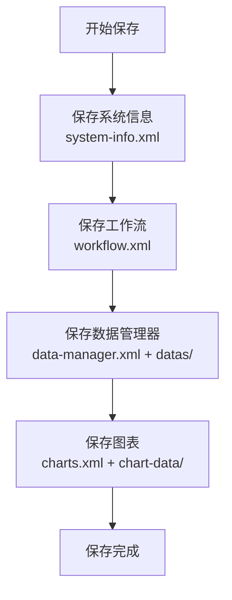
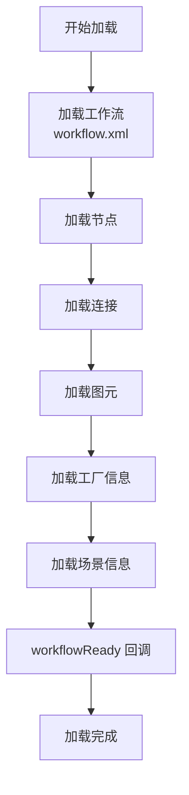
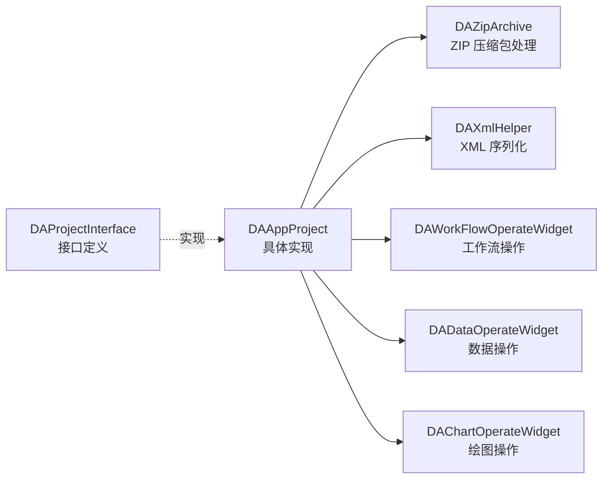

# DA 工程文件结构说明

工程文件结构说明文档介绍 DAWorkBench 项目文件的内部组织方式、保存加载流程以及 XML 结构规范。

## 主要功能特性

**特性**

- ✅ **ZIP 压缩包格式**：项目文件使用 `.dapro` 扩展名，采用 ZIP 压缩便于传输
- ✅ **XML 结构化存储**：配置信息使用 XML 格式，便于解析和扩展
- ✅ **分层保存机制**：各模块按顺序保存，确保依赖关系正确
- ✅ **版本兼容支持**：通过版本号标识支持新旧版本兼容

## 概述

DAWorkBench 的工程文件采用 **ZIP 压缩包** 格式，文件扩展名为 `.dapro`。打开工程文件时，程序会在临时目录解压该压缩包；保存文件时，将临时文件压缩并移动到指定位置。

ZIP 压缩包的管理基于开源库 `QuaZip` 实现，具体实现类为 `DAZipArchive`。

## 工程文件内部结构

`.dapro` 文件解压后的目录结构如下：

```txt
project.dapro (ZIP Archive)
├── system-info.xml           # 本地系统信息
├── workflow.xml              # 工作流信息（节点、连接、图元等）
├── charts.xml                # 绘图信息（图表配置、数据绑定等）
├── data-manager.xml          # 数据管理器配置
├── datas/                    # 数据文件目录
│   └── [各种数据文件]
└── chart-data/               # 图表数据目录
    └── [图表数据文件]
```

### XML 顶层节点 `<root>`

工程文件以 XML 形式保存，顶层节点为 `<root>`，节点属性 `type` 用于标记 XML 类型：

```xml
<?xml version="1.0" encoding="utf-8"?>
<root type="project">
    <!-- 项目内容 -->
</root>
```

## 工程文件保存和加载顺序

工程文件保存过程通过 `DAUtils.DAXMLFileInterface` 类的 `saveToXml` 和 `loadFromXml` 接口，各部件的接口调用顺序决定了 XML 的标签层次。

### 保存流程

工程文件保存采用分层保存机制，按模块依赖顺序依次保存。下图展示了保存的完整流程：



上图展示了工程保存的四个阶段：
- **第一阶段**：保存系统信息到 `system-info.xml`，记录创建环境
- **第二阶段**：保存工作流到 `workflow.xml`，包含节点、连接、图元
- **第三阶段**：保存数据管理器配置和实际数据文件
- **第四阶段**：保存图表配置和图表数据

**保存顺序详解**

1. 保存系统信息（`system-info.xml`）
2. 保存工作流（`workflow.xml`）
3. 保存数据管理器（`data-manager.xml` 及 `datas/` 目录）
4. 保存图表（`charts.xml` 及 `chart-data/` 目录）

**工作流保存顺序**

| 步骤 | 方法 | 说明 |
|------|------|------|
| 1 | `DAWorkFlow::saveExternInfoToXml` | workflow 信息 |
| 2 | `DAAbstractNode::saveExternInfoToXml` | 节点信息 |
| 3 | `DAAbstractNodeGraphicsItem::saveToXml` | 节点图元信息 |
| 4 | `DAAbstractNodeLinkGraphicsItem::saveToXml` | 连接信息 |
| 5 | `DAGraphicsItem::saveToXml` | 通用图元信息 |
| 6 | `DAAbstractNodeFactory::saveExternInfoToXml` | 工厂信息 |
| 7 | 场景信息 | 视图场景配置 |

### 加载流程

工程文件加载采用分层加载机制，按依赖顺序依次恢复各模块状态。下图展示了加载的完整流程：



上图展示了工程加载的完整流程，从工作流信息到场景配置依次恢复。注意加载完成后会调用 `workflowReady` 回调函数，通知各工厂执行后处理。

**加载顺序详解**

| 步骤 | 方法 | 说明 |
|------|------|------|
| 1 | `DAWorkFlow::loadExternInfoFromXml` | workflow 信息 |
| 2 | `DAAbstractNode::loadExternInfoFromXml` | 节点信息 |
| 3 | `DAAbstractNodeGraphicsItem::loadFromXml` | 节点图元信息 |
| 4 | `DAAbstractNodeLinkGraphicsItem::loadFromXml` | 连接信息 |
| 5 | `DAGraphicsItem::loadFromXml` | 通用图元信息 |
| 6 | `DAAbstractNodeFactory::loadExternInfoFromXml` | 工厂信息 |
| 7 | 场景信息 | 视图场景配置 |

!!! tip "工厂信息加载时机"
    工厂的额外信息加载是在节点之后，可以把节点的全局性信息存入工厂的额外信息中。加载时已加载完所有节点，可以对节点进一步操作。加载完成后会调用 `DAAbstractNodeFactory::workflowReady` 回调函数。

## Workflow XML 结构示例

`workflow.xml` 是工作流的核心配置文件，存储节点定义、连接关系、图元信息等。以下示例展示了典型的 Workflow XML 结构：

```xml
<?xml version="1.0" encoding="utf-8"?>
<root>
  <workflows ver="1.4.0" currentIndex="0">
    <workflow name="Workflow1">
      <extern>
        <!-- 工作流扩展信息 -->
      </extern>
      <nodes>
        <node id="123456" name="Node1" protoType="NodeType">
          <inputs>
            <li name="input1">
              <value>...</value>
            </li>
          </inputs>
          <outputs>
            <li name="output1">
              <data>...</data>
            </li>
          </outputs>
          <props>
            <prop>
              <key>propName</key>
              <value>propValue</value>
            </prop>
          </props>
          <item className="NodeGraphicsItem" tid="12345">
            <!-- 图形项信息 -->
          </item>
        </node>
      </nodes>
      <links>
        <link>
          <from id="123" name="outputKey"/>
          <to id="456" name="inputKey"/>
          <item>
            <!-- 连接线图形信息 -->
          </item>
        </link>
      </links>
      <items>
        <!-- 其他图形元素 -->
      </items>
      <factorys>
        <factory prototypes="FactoryType">
          <extern><!-- 工厂扩展信息 --></extern>
        </factory>
      </factorys>
      <scene x="0" y="0" width="800" height="600">
        <background><!-- 背景图信息 --></background>
      </scene>
    </workflow>
  </workflows>
</root>
```

上述 XML 结构展示了工作流的完整数据组织：
- `<workflows>`：顶层节点，包含版本号和当前索引
- `<workflow>`：单个工作流定义，包含名称属性
- `<nodes>`：节点集合，每个节点包含 ID、名称、原型类型、输入输出端口、属性、图元信息
- `<links>`：连接集合，定义节点之间的数据流向
- `<factorys>`：工厂信息，存储节点工厂的扩展数据
- `<scene>`：场景配置，存储视图位置和背景信息

## Charts XML 结构示例

`charts.xml` 存储图表的配置信息，包含图表布局、颜色主题、绑定数据等。以下示例展示了典型的 Charts XML 结构：

```xml
<?xml version="1.0" encoding="utf-8"?>
<root>
  <project version="1.0.0">
    <charts>
      <figure id="fig1" pickgroup="1" figure-name="Figure1">
        <background><!-- 背景色 --></background>
        <colortheme style="UserDefine">
          <li>#FF0000</li>
          <li>#00FF00</li>
        </colortheme>
        <charts>
          <chart x="0" y="0" w="400" h="300">
            <!-- 图表配置 -->
          </chart>
        </charts>
      </figure>
    </charts>
  </project>
</root>
```

上述 XML 结构展示了图表配置的数据组织：
- `<figure>`：图表画布定义，包含 ID、分组、名称
- `<background>`：背景色配置
- `<colortheme>`：颜色主题，可自定义颜色列表
- `<charts>`：图表集合，使用归一化坐标定义位置和大小

## 本地信息记录 `<local-info>`

`<local-info>` 位于 `<root>` 节点下，用于记录保存文件时的本地计算机环境信息。这些信息有助于追踪文件的创建来源。以下示例展示了本地信息的数据结构：

```xml
<local-info>
    <machineHostName>计算机名</machineHostName>
    <cpuArch>CPU 架构</cpuArch>
    <kernelType>操作系统类型</kernelType>
    <kernelVersion>操作系统版本</kernelVersion>
    <prettyProductName>操作系统全称</prettyProductName>
</local-info>
```

| 元素 | 说明 |
|------|------|
| `machineHostName` | 计算机名 |
| `cpuArch` | CPU 信息 |
| `kernelType` | 操作系统类型 |
| `kernelVersion` | 操作系统版本 |
| `prettyProductName` | 操作系统全称 |

## 版本兼容性

XML 文件中通过 `ver` 属性标识版本号，当前版本为 `1.4.0`。加载旧版本文件时，程序会根据版本号选择对应的解析逻辑：

| 版本 | 说明 |
|------|------|
| v1.1.0 | 旧版本节点输入输出解析 |
| v1.3.0 | 中间版本 |
| v1.4.0 | 当前版本 |

## 剪切板数据结构

DA 在进行复制粘贴时，通过 XML 传递复制粘贴内容。

### 图元编辑区的复制粘贴

图元编辑区进行复制操作，形成一个以 `<da-clip>` 为顶层节点的 XML 描述：

```xml
<da-clip type="copy">
    <workflow>
        <nodes>
            <node protoType="My.NodeType" id="..." name="Node Name">
                <item className="DAStandardNodeSvgGraphicsItem" tid="...">
                </item>
            </node>
        </nodes>
        <links>
            <link>
                <from id="..." name="out"/>
                <to id="..." name="in"/>
                <item className="DAStandardNodeLinkGraphicsItem" tid="...">
                </item>
            </link>
        </links>
        <items/>
    </workflow>
</da-clip>
```

**属性说明**

- `type`：区分 `copy`（复制）和 `cut`（剪切）

!!! note "ID 处理"
    复制过程需要重新生成节点 ID，旧的节点 ID 和新的节点 ID 的对应关系要记录，这样链接就知道要从哪个节点链接向哪个节点。

### mime-data 类型

生成的 XML 通过 mimeData 传递，类型定义为：`text/da-xml`

## 核心类关系

项目文件管理涉及多个核心类，通过接口与实现分离的模式组织。下图展示了项目管理的类关系：



上图展示了项目管理的核心类架构：
- **DAProjectInterface**：项目接口定义，提供加载、保存等标准方法
- **DAAppProject**：具体实现类，协调各模块的序列化操作
- **DAZipArchive**：ZIP 压缩包处理，基于 QuaZip 实现
- **DAXmlHelper**：XML 序列化工具类
- 各操作模块（WorkFlow、Data、Chart）：负责各自领域的序列化数据收集

## 参考资料

- [项目序列化架构详解](./project-serialization-architecture.md)
- [QuaZip 使用指南](https://github.com/stachenov/quazip)
- [工作流系统概述](../workflow.md)