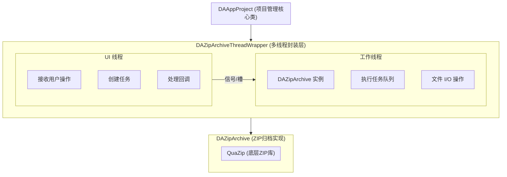
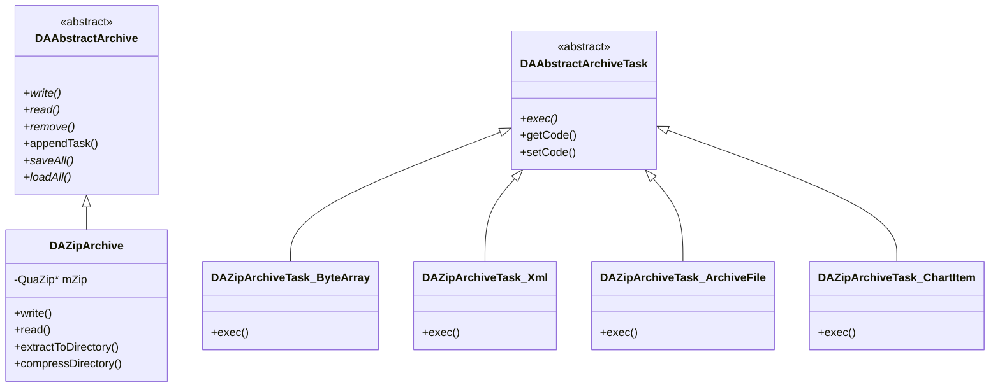
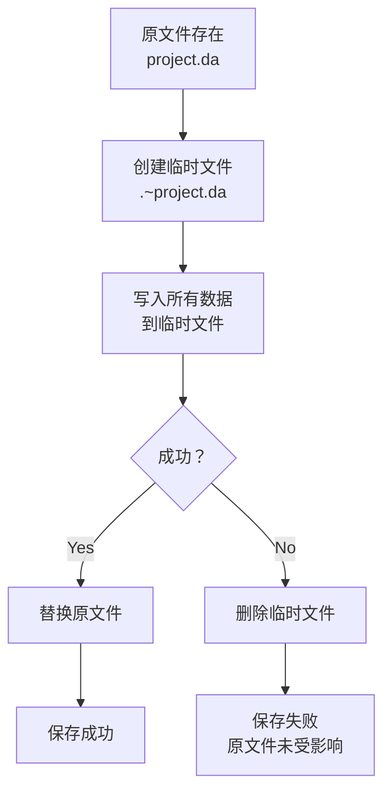
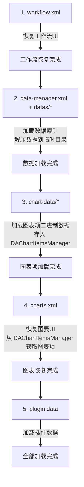
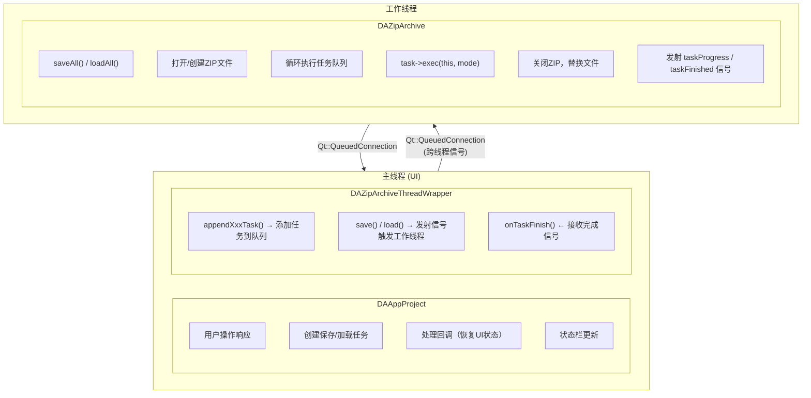
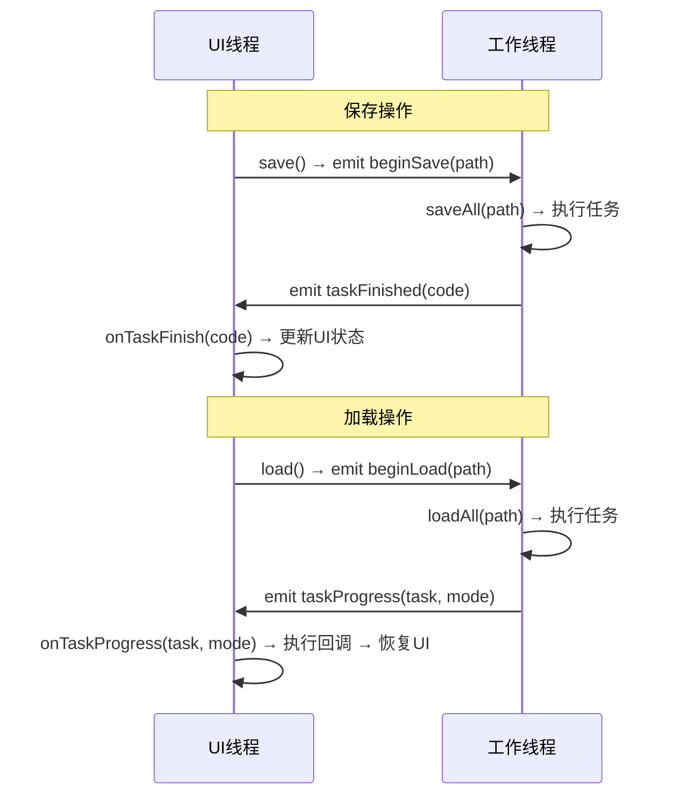
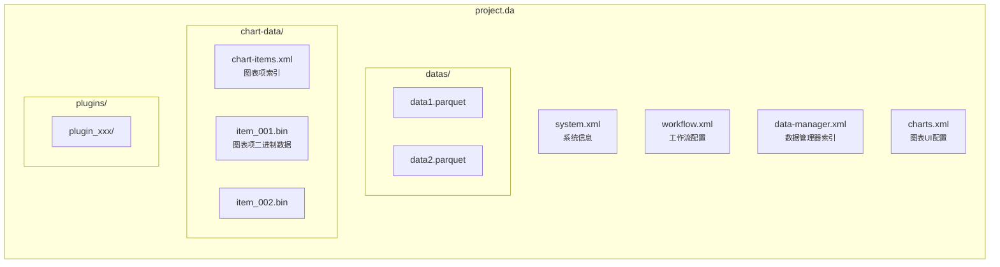

# 项目序列化架构详解

## 1. 概述

### 1.1 设计目标

Data Workbench 项目的序列化架构旨在实现以下核心目标：

1. **统一存储**：将整个项目（包括工作流、数据、图表、配置等）保存为单个 ZIP 压缩包
2. **多线程处理**：耗时操作在后台线程执行，避免阻塞 UI
3. **可扩展性**：通过任务队列机制，方便添加新的序列化内容
4. **事务安全**：使用临时文件机制，确保保存失败不会破坏原有文件
5. **进度反馈**：提供任务进度信号，支持状态栏显示

### 1.2 整体架构



### 1.3 核心类关系图



## 2. 核心组件详解

### 2.1 DAAbstractArchive - 抽象归档基类

[DAAbstractArchive.h](./../../../src/DAGui/DAAbstractArchive.h) 定义了归档操作的抽象接口。

```cpp title="DAAbstractArchive 核心接口"
class DAAbstractArchive : public QObject
{
    Q_OBJECT
public:
    enum ResultCode {
        SaveSuccess,
        SaveFailed,
        LoadSuccess,
        LoadFailed
    };

    // 核心接口 - 子类必须实现
    virtual bool write(const QString& relatePath, const QByteArray& byte) = 0;
    virtual QByteArray read(const QString& relatePath) = 0;
    virtual bool remove(const QString& relatePath) = 0;

    // 任务队列管理
    void appendTask(const std::shared_ptr<DAAbstractArchiveTask>& task);
    int getTaskCount() const;
    bool isTaskQueueEmpty() const;

public Q_SLOTS:
    virtual void saveAll(const QString& filePath) = 0;
    virtual void loadAll(const QString& filePath) = 0;

Q_SIGNALS:
    void taskProgress(std::shared_ptr<DAAbstractArchiveTask> task, int mode);
    void taskFinished(int resultCode);
};
```

**设计要点**：

- 使用纯虚函数定义核心接口，支持不同的存储后端
- 内置任务队列，支持批量操作
- 通过信号机制报告进度和完成状态

### 2.2 DAAbstractArchiveTask - 抽象任务基类

[DAAbstractArchiveTask.h](./../../../src/DAGui/DAAbstractArchiveTask.h) 定义了任务的抽象接口。

```cpp title="DAAbstractArchiveTask 核心接口"
class DAAbstractArchiveTask : std::enable_shared_from_this<DAAbstractArchiveTask>
{
public:
    enum Mode {
        ReadMode,   // 读取模式
        WriteMode   // 写入模式
    };

    // 执行任务 - 子类必须实现
    virtual bool exec(DAAbstractArchive* archive, Mode mode) = 0;

    // 任务标识
    int getCode() const;
    void setCode(int code);

    // 任务信息
    QString getName() const;
    QString getDescribe() const;

    // 加载完成回调
    using FpLoadedCallBack = std::function<void(std::shared_ptr<DAAbstractArchiveTask>)>;
    void setLoadedCallBack(const FpLoadedCallBack& callBack);
};
```

**关键特性**：

- **Mode 枚举**：区分读写操作，同一任务类可处理两种模式
- **Code 机制**：允许用户自定义任务标识，便于识别任务类型
- **回调函数**：支持在 UI 线程中处理加载结果

**典型实现示例**：

```cpp title="DAZipArchiveTask_ByteArray::exec 实现"
bool DAZipArchiveTask_ByteArray::exec(DAAbstractArchive* archive, DAAbstractArchiveTask::Mode mode)
{
    if (!archive) {
        return false;
    }
    DAZipArchive* zip = static_cast<DAZipArchive*>(archive);
    
    if (mode == DAAbstractArchiveTask::WriteMode) {
        // 写模式
        if (!zip->isOpened()) {
            if (!zip->create()) {
                return false;
            }
        }
        return zip->write(mPath, mData);
    } else {
        // 读模式
        if (!zip->isOpened()) {
            if (!zip->open()) {
                return false;
            }
        }
        mData = zip->read(mPath);
        return !mData.isEmpty();
    }
}
```

### 2.3 DAZipArchive - ZIP归档实现

[DAZipArchive.h](./../../../src/DAGui/DAZipArchive.h) 和 [DAZipArchive.cpp](./../../../src/DAGui/DAZipArchive.cpp) 实现了基于 QuaZip 的 ZIP 归档功能。

**核心功能**：

```cpp title="DAZipArchive 核心方法"
class DAZipArchive : public DAAbstractArchive
{
public:
    // 文件操作
    bool write(const QString& relatePath, const QByteArray& byte) override;
    QByteArray read(const QString& relatePath) override;
    bool remove(const QString& relatePath) override;
    
    // 大文件支持
    bool writeFileToZip(const QString& relatePath, const QString& localFilePath, 
                        std::size_t chunk_mb = 4);
    bool readToFile(const QString& zipRelatePath, const QString& localFilePath, 
                    std::size_t chunk_mb = 4);
    
    // 目录操作
    bool extractToDirectory(const QString& extractDir);
    bool compressDirectory(const QString& folderPath);
    
    // 文件管理
    QStringList getAllFiles() const;
    bool contains(const QString& relatePath) const;
};
```

**saveAll() 实现流程**：

```cpp title="DAZipArchive::saveAll 实现"
void DAZipArchive::saveAll(const QString& filePath)
{
    // 1. 创建临时文件
    QString tempFilePath = toTemporaryPath(filePath);  // 生成 .~xxx 临时文件
    setBaseFilePath(tempFilePath);
    
    // 2. 创建ZIP文件
    if (!create()) {
        emit taskFinished(SaveFailed);
        return;
    }
    
    // 3. 执行所有任务
    while (!isTaskQueueEmpty()) {
        auto task = takeTask();
        if (!task->exec(this, DAAbstractArchiveTask::WriteMode)) {
            close();
            QFile::remove(tempFilePath);
            emit taskFinished(SaveFailed);
            return;
        }
        emit taskProgress(task, DAAbstractArchiveTask::WriteMode);
    }
    
    // 4. 关闭并替换原文件
    close();
    if (!replaceFile(tempFilePath, filePath)) {
        QFile::remove(tempFilePath);
        emit taskFinished(SaveFailed);
        return;
    }
    
    emit taskFinished(SaveSuccess);
}
```

**临时文件命名规则**：

| 类型 | 文件名 |
|------|--------|
| 原文件 | `project.da` |
| 临时文件 | `.~project.da` |

### 2.4 DAZipArchiveThreadWrapper - 多线程封装

[DAZipArchiveThreadWrapper.h](./../../../src/DAGui/DAZipArchiveThreadWrapper.h) 和 [DAZipArchiveThreadWrapper.cpp](./../../../src/DAGui/DAZipArchiveThreadWrapper.cpp) 提供了多线程操作封装。

**初始化流程**：

```cpp title="DAZipArchiveThreadWrapper::init 实现"
void DAZipArchiveThreadWrapper::init()
{
    // 1. 创建线程
    QThread* thread = new QThread();
    DAZipArchive* archive = new DAZipArchive();
    
    // 2. 将 archive 移动到工作线程
    archive->moveToThread(thread);
    
    // 3. 建立信号连接
    connect(archive, &DAAbstractArchive::taskFinished, 
            this, &DAZipArchiveThreadWrapper::onTaskFinish);
    connect(archive, &DAAbstractArchive::taskProgress, 
            this, &DAZipArchiveThreadWrapper::onTaskProgress);
    connect(this, &DAZipArchiveThreadWrapper::beginSave, 
            archive, &DAAbstractArchive::saveAll);
    connect(this, &DAZipArchiveThreadWrapper::beginLoad, 
            archive, &DAAbstractArchive::loadAll);
    
    // 4. 启动线程
    thread->start();
}
```

**任务添加方法**：

```cpp title="任务添加方法"
// 保存任务
std::shared_ptr<DAAbstractArchiveTask> appendByteSaveTask(const QString& zipRelatePath, 
                                                           const QByteArray& data);
std::shared_ptr<DAAbstractArchiveTask> appendXmlSaveTask(const QString& zipRelatePath, 
                                                          const QDomDocument& data);
std::shared_ptr<DAAbstractArchiveTask> appendFileSaveTask(const QString& zipRelatePath, 
                                                           const QString& localFilePath);
std::shared_ptr<DAAbstractArchiveTask> appendChartItemSaveTask(const QString& zipRelateFolderPath,
                                                                DAChartItemsManager chartItemMgr);

// 加载任务
std::shared_ptr<DAAbstractArchiveTask> appendByteLoadTask(const QString& zipRelatePath, int code);
std::shared_ptr<DAAbstractArchiveTask> appendXmlLoadTask(const QString& zipRelatePath, int code);
std::shared_ptr<DAAbstractArchiveTask> appendFileLoadTask(const QString& zipRelatePath, int code);
std::shared_ptr<DAAbstractArchiveTask> appendChartItemLoadTask(const QString& zipRelateFolderPath, int code);
```

## 3. 任务系统设计

### 3.1 任务队列机制

任务队列采用 FIFO（先进先出）模式，确保任务按添加顺序执行：

```cpp title="任务队列操作"
// 添加任务到队列尾部
void DAAbstractArchive::appendTask(const std::shared_ptr<DAAbstractArchiveTask>& task)
{
    // 实现细节...
}

// 从队列头部取出任务
std::shared_ptr<DAAbstractArchiveTask> DAAbstractArchive::takeTask()
{
    // 实现细节...
}
```

### 3.2 内置任务类型

| 任务类型 | 头文件 | 用途 |
|---------|--------|------|
| `DAZipArchiveTask_ByteArray` | [DAZipArchiveTask_ByteArray.h](./../../../src/DAGui/DAZipArchiveTask_ByteArray.h) | 保存/加载字节数组 |
| `DAZipArchiveTask_Xml` | [DAZipArchiveTask_Xml.h](./../../../src/DAGui/DAZipArchiveTask_Xml.h) | 保存/加载 XML 文档 |
| `DAZipArchiveTask_ArchiveFile` | [DAZipArchiveTask_ArchiveFile.h](./../../../src/DAGui/DAZipArchiveTask_ArchiveFile.h) | 压缩/解压本地文件 |
| `DAZipArchiveTask_ChartItem` | [DAZipArchiveTask_ChartItem.h](./../../../src/DAGui/DAZipArchiveTask_ChartItem.h) | 保存/加载图表项 |

### 3.3 自定义任务开发

要创建自定义任务，需要：

1. **继承 `DAAbstractArchiveTask`**
2. **实现 `exec()` 方法**
3. **添加必要的构造函数和数据成员**

```cpp title="自定义任务示例"
class MyCustomTask : public DAAbstractArchiveTask
{
public:
    // 保存构造
    MyCustomTask(const QString& path, const MyData& data);
    // 加载构造
    MyCustomTask(const QString& path);
    
    virtual bool exec(DAAbstractArchive* archive, Mode mode) override;
    
    MyData getData() const;
    
private:
    QString mPath;
    MyData mData;
};
```

## 4. 项目保存流程

### 4.1 DAAppProject::save() 完整流程

[DAAppProject.cpp](./../../../src/APP/DAAppProject.cpp) 中的保存流程：

```cpp title="DAAppProject::save 实现"
bool DAAppProject::save(const QString& path)
{
    // 1. 检查繁忙状态
    if (isBusy()) {
        return false;
    }
    
    // 2. 设置项目路径
    setProjectPath(path);
    
    // 3. 创建保存任务（按顺序添加）
    
    // 3.1 保存系统信息
    makeSaveSystemInfoTask(mArchive);
    
    // 3.2 保存工作流（UI相关，需在主线程预处理）
    makeSaveWorkFlowTask(mArchive);
    
    // 3.3 保存数据管理器
    makeSaveDataManagerTask(mArchive);
    
    // 3.4 保存图表
    makeSaveChartTask(mArchive);
    
    // 3.5 保存插件数据
    if (m_pluginMgr) {
        for (auto plugin : m_pluginMgr->getAllPlugins()) {
            auto task = plugin->createArchiveTask(true);
            if (task) {
                mArchive->appendTask(task);
            }
        }
    }
    
    // 4. 启动异步保存
    return mArchive->save(path);
}
```

### 4.2 各模块保存任务详解

#### 4.2.1 系统信息保存

```cpp title="系统信息保存"
void DAAppProject::makeSaveSystemInfoTask(DAZipArchiveThreadWrapper* archive)
{
    QDomDocument doc;
    // ... 构建XML文档
    QDomElement sysEle = DAXMLFileInterface::makeSysInfoElement("system", &doc);
    
    auto t = archive->appendXmlSaveTask("system.xml", doc);
    t->setName(tr("Save System Info"));
}
```

**ZIP 文件位置**: `system.xml`

#### 4.2.2 工作流保存

```cpp title="工作流保存"
void DAAppProject::makeSaveWorkFlowTask(DAZipArchiveThreadWrapper* archive)
{
    // UI操作必须在主线程完成
    QDomDocument workflowXml = createWorkflowUIDomDocument();
    
    auto t = archive->appendXmlSaveTask("workflow.xml", workflowXml);
    t->setName(tr("Save workflow information"));
}
```

**ZIP 文件位置**: `workflow.xml`

#### 4.2.3 数据管理器保存

```cpp title="数据管理器保存"
void DAAppProject::makeSaveDataManagerTask(DAZipArchiveThreadWrapper* archive)
{
    // 遍历所有数据
    for (int i = 0; i < dataMgr->getDataCount(); ++i) {
        DAData data = dataMgr->getData(i);
        QString name = data.getName();
        QString tempFilePath = makeDataTemporaryFilePath(name);
        QString dataZipPath = makeDataArchiveFilePath(name);  // "datas/xxx"
        
        // 写入临时文件（Python GIL限制，必须在主线程）
        DAData::writeToFile(data, tempFilePath);
        
        // 添加文件压缩任务
        mArchive->appendFileSaveTask(dataZipPath, tempFilePath);
    }
    
    // 保存数据索引XML
    archive->appendXmlSaveTask("data-manager.xml", doc);
}
```

**ZIP 文件位置**:

- `data-manager.xml` - 数据索引
- `datas/` - 数据文件目录

#### 4.2.4 图表保存

图表保存采用两阶段策略：

```cpp title="图表保存"
void DAAppProject::makeSaveChartTask(DAZipArchiveThreadWrapper* archive)
{
    // 阶段1: 收集图表项到 DAChartItemsManager
    DAChartItemsManager chartItemMgr;
    QDomDocument chartXml = createChartsUIDomDocument(chartItemMgr);
    
    // 保存图表UI信息XML
    auto t1 = archive->appendXmlSaveTask("charts.xml", chartXml);
    
    // 阶段2: 保存图表项二进制数据
    auto t2 = archive->appendChartItemSaveTask("chart-data", chartItemMgr);
}
```

**ZIP 文件位置**:

- `charts.xml` - 图表UI配置
- `chart-data/` - 图表项二进制数据目录
- `chart-data/chart-items.xml` - 图表项索引

### 4.3 临时文件处理机制

保存过程使用临时文件确保事务安全：



## 5. 项目加载流程

### 5.1 DAAppProject::load() 完整流程

```cpp title="DAAppProject::load 实现"
bool DAAppProject::load(const QString& path)
{
    // 1. 检查文件有效性
    if (!DAZipArchive::isCorrectFile(path)) {
        return false;
    }
    
    // 2. 清空当前项目
    clear();
    setProjectPath(path);
    
    // 3. 创建加载任务（注意顺序）
    
    // 3.1 加载工作流XML
    auto task = mArchive->appendXmlLoadTask("workflow.xml", TASK_LOAD_ID_WORKFLOW);
    task->setLoadedCallBack([this](auto t) { loadedWorkflowInfo(t); });
    
    // 3.2 加载数据管理器
    auto loadDataTask = std::make_shared<DAZipArchiveTask_LoadDataManager>();
    loadDataTask->setCode(TASK_LOAD_ID_DATAMANAGER);
    loadDataTask->setLoadedCallBack([this](auto t) { loadedDataManager(t); });
    mArchive->appendTask(loadDataTask);
    
    // 3.3 加载图表项（必须在charts.xml之前）
    auto taskChartItem = mArchive->appendChartItemLoadTask("chart-data", TASK_LOAD_ID_CHARTITEM);
    taskChartItem->setLoadedCallBack([this](auto t) {
        auto chartMgr = std::static_pointer_cast<DAZipArchiveTask_ChartItem>(t);
        mChartItemManager = chartMgr->getChartItemsManager();
    });
    
    // 3.4 加载图表UI信息
    auto taskCharts = mArchive->appendXmlLoadTask("charts.xml", TASK_LOAD_ID_CHARTS_INFO);
    taskCharts->setLoadedCallBack([this](auto t) { loadedChartsInfo(t); });
    
    // 3.5 加载插件数据
    if (m_pluginMgr) {
        for (auto plugin : m_pluginMgr->getAllPlugins()) {
            auto task = plugin->createArchiveTask(false);
            if (task) {
                mArchive->appendTask(task);
            }
        }
    }
    
    // 4. 启动异步加载
    return mArchive->load(path);
}
```

### 5.2 回调机制与数据恢复

加载完成后，通过回调函数在 UI 线程中恢复数据：

```cpp title="回调函数示例"
void DAAppProject::loadedWorkflowInfo(const std::shared_ptr<DAAbstractArchiveTask>& t)
{
    // 在UI线程中执行
    auto xmlArchive = std::static_pointer_cast<DAZipArchiveTask_Xml>(t);
    QDomDocument xmlDoc = xmlArchive->getDomDocument();
    
    // 恢复工作流UI
    appendWorkflowInProject(xmlDoc);
}

void DAAppProject::loadedDataManager(const std::shared_ptr<DAAbstractArchiveTask>& t)
{
    auto datamgrTask = std::static_pointer_cast<DAZipArchiveTask_LoadDataManager>(t);
    
    // 获取临时文件路径映射
    auto tempFiles = datamgrTask->getZipPathToTempFilePath();
    
    // 从临时文件加载数据
    for (auto it = tempFiles.begin(); it != tempFiles.end(); ++it) {
        DAPyDataFrame df;
        DAPyScripts::getInstance().getDataFrame().from_parquet(df, it.value());
        // 添加到数据管理器
        dataMgr->dataManager()->addData(DAData(df));
    }
}

void DAAppProject::loadedChartsInfo(const std::shared_ptr<DAAbstractArchiveTask>& t)
{
    auto xmlArchive = std::static_pointer_cast<DAZipArchiveTask_Xml>(t);
    QDomDocument xmlDoc = xmlArchive->getDomDocument();
    
    // 使用已加载的图表项恢复图表UI
    appendChartsInProject(xmlDoc, &mChartItemManager);
}
```

### 5.3 加载顺序与依赖关系



**关键依赖**：

- `charts.xml` 依赖 `chart-data/*` 必须先加载完成
- 数据恢复依赖临时文件已解压完成

## 6. 多线程架构

### 6.1 线程模型设计



### 6.2 信号槽通信机制

```cpp title="信号连接初始化"
// 初始化时建立的信号连接
void DAZipArchiveThreadWrapper::init()
{
    // 工作线程 → UI线程
    connect(archive, &DAAbstractArchive::taskFinished, 
            this, &DAZipArchiveThreadWrapper::onTaskFinish);
    connect(archive, &DAAbstractArchive::taskProgress, 
            this, &DAZipArchiveThreadWrapper::onTaskProgress);
    
    // UI线程 → 工作线程
    connect(this, &DAZipArchiveThreadWrapper::beginSave, 
            archive, &DAAbstractArchive::saveAll);
    connect(this, &DAZipArchiveThreadWrapper::beginLoad, 
            archive, &DAAbstractArchive::loadAll);
}
```

**信号流向**：



### 6.3 UI线程安全考虑

**必须在主线程执行的操作**：

1. **UI组件操作**：任何涉及 QWidget 的操作
2. **Python GIL 相关**：DataFrame 的序列化操作
3. **回调函数执行**：`setLoadedCallBack` 中的回调

**可以在工作线程执行的操作**：

1. **文件 I/O**：ZIP 压缩/解压
2. **二进制序列化**：QwtPlotItem 的序列化
3. **XML 解析**：QDomDocument 的构建和解析

**线程安全保证**：

```cpp title="回调在UI线程执行"
// 回调在UI线程执行
void DAZipArchiveThreadWrapper::onTaskProgress(std::shared_ptr<DAAbstractArchiveTask> task, int mode)
{
    if (mode == DAAbstractArchiveTask::ReadMode) {
        auto Fp = task->getLoadedCallBack();
        if (Fp) {
            Fp(task);  // 在UI线程执行回调
        }
    }
    Q_EMIT taskProgress(task, mode);
}
```

## 7. ZIP 文件结构

### 7.1 项目文件后缀

项目文件使用 `.da` 后缀。

### 7.2 ZIP 内部结构



### 7.3 XML 文件格式示例

**system.xml**:

```xml title="system.xml 示例"
<?xml version="1.0" encoding="UTF-8"?>
<root type="system-info">
    <system version="1.0" 
            os="Windows" 
            qt_version="6.7.3"
            create_time="2024-01-01T12:00:00"/>
</root>
```

**data-manager.xml**:

```xml title="data-manager.xml 示例"
<?xml version="1.0" encoding="UTF-8"?>
<root type="data manager">
    <datas>
        <d name="data1" type="TypePythonDataFrame">
            <v>datas/data1.parquet</v>
            <describe>数据描述</describe>
        </d>
    </datas>
</root>
```

**chart-items.xml**:

```xml title="chart-items.xml 示例"
<items>
    <item key="item_001" rtti="5"/>  <!-- rtti=5 表示 QwtPlotCurve -->
    <item key="item_002" rtti="6"/>  <!-- rtti=6 表示 QwtPlotGrid -->
</items>
```

## 8. 最佳实践与注意事项

### 8.1 添加新的序列化内容

1. **创建任务类**：继承 `DAAbstractArchiveTask`
2. **注册任务**：在 `DAAppProject::save()` 和 `load()` 中添加
3. **注意顺序**：确保依赖关系正确

### 8.2 错误处理

```cpp title="错误处理示例"
// 保存失败会自动清理临时文件
void DAZipArchive::saveAll(const QString& filePath)
{
    // ... 执行任务
    if (!success) {
        close();
        QFile::remove(tempFilePath);  // 清理临时文件
        emit taskFinished(SaveFailed);
    }
}
```

### 8.3 性能优化建议

1. **大文件分块处理**：使用 `writeFileToZip` 和 `readToFile` 的分块参数
2. **减少临时文件**：尽量使用 `QByteArray` 直接传输
3. **并行处理**：考虑将独立任务并行执行（当前为串行）

## 9. 相关文件索引

| 文件 | 说明 |
|------|------|
| [DAAppProject.h](./../../../src/APP/DAAppProject.h) | 项目管理核心类 |
| [DAAppProject.cpp](./../../../src/APP/DAAppProject.cpp) | 项目管理实现 |
| [DAAbstractArchive.h](./../../../src/DAGui/DAAbstractArchive.h) | 抽象归档基类 |
| [DAAbstractArchiveTask.h](./../../../src/DAGui/DAAbstractArchiveTask.h) | 抽象任务基类 |
| [DAZipArchive.h](./../../../src/DAGui/DAZipArchive.h) | ZIP归档实现 |
| [DAZipArchive.cpp](./../../../src/DAGui/DAZipArchive.cpp) | ZIP归档实现 |
| [DAZipArchiveThreadWrapper.h](./../../../src/DAGui/DAZipArchiveThreadWrapper.h) | 多线程封装 |
| [DAZipArchiveThreadWrapper.cpp](./../../../src/DAGui/DAZipArchiveThreadWrapper.cpp) | 多线程封装实现 |
| [DAZipArchiveTask_ByteArray.h](./../../../src/DAGui/DAZipArchiveTask_ByteArray.h) | 字节数组任务 |
| [DAZipArchiveTask_Xml.h](./../../../src/DAGui/DAZipArchiveTask_Xml.h) | XML文档任务 |
| [DAZipArchiveTask_ArchiveFile.h](./../../../src/DAGui/DAZipArchiveTask_ArchiveFile.h) | 文件任务 |
| [DAZipArchiveTask_ChartItem.h](./../../../src/DAGui/DAZipArchiveTask_ChartItem.h) | 图表项任务 |
| [DAChartItemsManager.h](./../../../src/DAGui/DAChartItemsManager.h) | 图表项管理器 |
